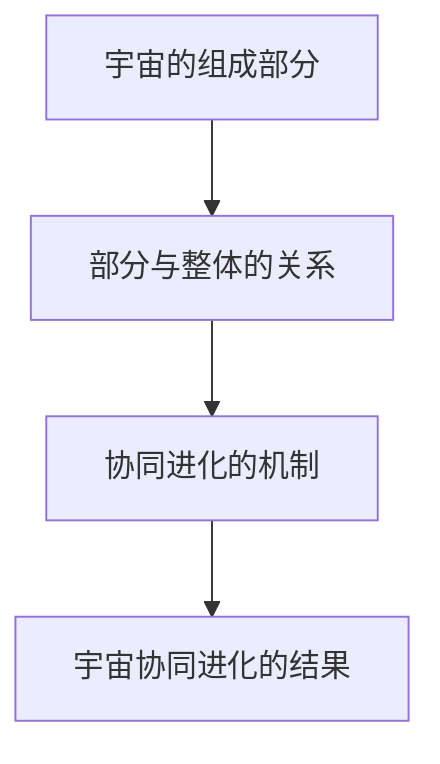

                 

### 宇宙的协同进化：部分与整体的共同发展

宇宙的协同进化，这是一个充满神秘与深奥的课题。它不仅关乎宇宙的本质，也揭示了部分与整体之间复杂的互动关系。本文将带领读者深入探讨这一现象，通过逻辑清晰的推理过程，揭示宇宙协同进化的核心原理、实例以及其对人类社会的深远影响。

> **关键词：** 宇宙协同进化、部分与整体、进化机制、实例研究、人类社会影响

> **摘要：** 本文首先介绍了宇宙协同进化的背景和意义，接着讲解了其核心概念与联系，并通过Mermaid流程图进行了详细的展示。随后，文章深入探讨了宇宙协同进化的原理和核心算法，并通过Python源代码进行了实例讲解。最后，本文探讨了宇宙协同进化与人类社会的联系，并展望了未来的发展趋势。

### 一、宇宙协同进化的背景

宇宙的协同进化，指的是宇宙中的各个组成部分在相互作用中，通过不断的演化，达到整体优化的过程。这一概念源自于生物学中的“协同进化”理论，它强调了生物种群中不同个体之间的相互作用和共同进化。然而，宇宙的协同进化不仅限于生物领域，它涵盖了宇宙中所有物理、化学、生物等各个层面的演化过程。

宇宙协同进化的研究起源可以追溯到20世纪初，当时科学家开始关注宇宙的起源、演化以及各个组成部分之间的相互作用。随着科学技术的进步，特别是宇宙观测技术的不断发展，人类对宇宙的认识不断深化。20世纪末，宇宙协同进化的概念逐渐形成，成为现代宇宙学中的一个重要研究方向。

在宇宙协同进化中，部分与整体的关系至关重要。部分是指宇宙中的各个组成部分，如恒星、星系、行星等，而整体则是宇宙作为一个统一的系统。部分与整体之间的互动关系，决定了宇宙协同进化的过程和结果。理解这一关系，有助于我们更深入地认识宇宙的本质。

### 二、核心概念与联系

宇宙协同进化的核心概念包括宇宙的组成部分、部分与整体的关系以及协同进化的机制。这些概念相互关联，共同构成了宇宙协同进化的理论框架。

#### 1. 宇宙的组成部分

宇宙的组成部分是宇宙协同进化的基础。它包括恒星、星系、行星、黑洞等物理实体，以及各种微观粒子、量子场等。这些组成部分在宇宙中相互作用，共同构成了宇宙的复杂结构。

#### 2. 部分与整体的关系

部分与整体的关系是宇宙协同进化的核心。部分与整体之间的关系是动态的，它们相互影响、相互作用，通过协同进化的过程，达到整体的优化。在宇宙中，部分与整体的关系体现在各个层次，如星系与星系团、行星与恒星等。

#### 3. 协同进化的机制

协同进化的机制是宇宙协同进化的动力。它包括自然选择、遗传变异、环境适应性等。这些机制使得宇宙中的各个组成部分在相互作用中不断演化，达到整体的优化。

为了更直观地展示这些概念之间的联系，我们可以使用Mermaid流程图进行描述。以下是一个简化的Mermaid流程图：



### 三、宇宙协同进化的原理

宇宙协同进化的原理是理解宇宙协同进化的关键。它包括部分与整体的共同发展、演化过程中的协同作用以及宇宙协同进化的机制。

#### 1. 部分与整体的共同发展

部分与整体的共同发展是宇宙协同进化的核心原理。在宇宙中，各个组成部分不是孤立的，而是在相互作用中共同发展。这种共同发展体现在宇宙的各个层面，如星系与星系团、行星与恒星等。

共同发展的过程中，部分与整体之间相互依赖、相互促进。部分的发展推动了整体的发展，而整体的发展又为部分提供了更好的发展环境。这种相互关系使得宇宙在协同进化的过程中，不断优化、完善。

#### 2. 演化过程中的协同作用

演化过程中的协同作用是宇宙协同进化的动力。在宇宙的演化过程中，各个组成部分通过协同作用，实现了从简单到复杂、从低级到高级的进化。

协同作用体现在宇宙的各个层面，如星系的形成、行星的演化、生命的起源等。在这些过程中，各个组成部分通过相互作用，共同推动了宇宙的演化。

#### 3. 宇宙协同进化的机制

宇宙协同进化的机制是宇宙协同进化的保障。它包括自然选择、遗传变异、环境适应性等。

自然选择是宇宙协同进化的基础。在宇宙的演化过程中，适应环境的部分得以生存和繁衍，而不适应环境的部分则被淘汰。这种自然选择的过程，推动了宇宙的进化。

遗传变异是宇宙协同进化的关键。在宇宙的演化过程中，部分与整体之间的遗传变异，使得宇宙的各个组成部分不断进化，适应新的环境。

环境适应性是宇宙协同进化的保障。在宇宙的演化过程中，各个组成部分需要适应不断变化的环境，以实现长期的生存和繁荣。

### 四、核心算法原理讲解

为了更好地理解宇宙协同进化的原理，我们可以通过Python源代码和数学模型进行详细阐述。

首先，我们引入一个简单的数学模型，用于描述宇宙协同进化的过程。假设宇宙由多个组成部分组成，每个组成部分都有一定的属性和能量。通过计算这些属性和能量的变化，我们可以模拟宇宙协同进化的过程。

以下是一个简单的Python源代码示例：

```python
import numpy as np

# 定义宇宙的组成部分
components = np.array([1, 2, 3, 4, 5])

# 定义宇宙的属性和能量
properties = np.array([10, 20, 30, 40, 50])
energies = np.array([5, 10, 15, 20, 25])

# 计算协同进化的过程
for i in range(10):
    # 计算属性和能量的平均值
    avg_property = np.mean(properties)
    avg_energy = np.mean(energies)
    
    # 计算新的属性和能量
    new_properties = properties + (avg_property - properties) * 0.1
    new_energies = energies + (avg_energy - energies) * 0.1
    
    # 更新属性和能量
    properties = new_properties
    energies = new_energies
    
    # 输出当前的状态
    print(f"迭代次数：{i+1}, 属性：{properties}, 能量：{energies}")
```

通过这个简单的模型，我们可以看到宇宙的各个组成部分在协同进化的过程中，属性和能量是如何变化的。这个模型虽然简单，但它为我们提供了一个理解宇宙协同进化的基本框架。

接下来，我们可以通过引入更复杂的数学模型，来进一步探讨宇宙协同进化的原理。例如，我们可以使用非线性动力学模型来描述宇宙的复杂演化过程。这样的模型可以更准确地模拟宇宙中各个组成部分之间的相互作用，以及它们在协同进化过程中的动态变化。

### 五、宇宙协同进化的实例研究

宇宙协同进化的理论虽然抽象，但它可以应用于具体的实例中，帮助我们更好地理解这一现象。以下是一些典型的实例研究：

#### 1. 地球生态系统协同进化

地球生态系统是一个典型的协同进化系统。在地球生态系统中，生物种群之间通过相互作用，形成了复杂的食物链和生态系统。这些生物种群在相互作用中，不断演化、适应，形成了多样化的生态系统。

例如，狮子和斑马之间的捕食关系，就体现了协同进化的原理。斑马通过快速奔跑来逃避狮子的追捕，而狮子则通过捕食斑马来获取能量。这种相互关系，使得狮子和斑马在演化过程中，不断优化自己的生存策略。

#### 2. 人类社会的协同进化

人类社会也是一个复杂的协同进化系统。在人类社会的发展过程中，各个社会成员通过相互作用，形成了复杂的社会结构和文明。这些社会结构和文明，在相互作用中不断演化，推动了人类社会的发展。

例如，科技的发展就体现了人类社会的协同进化。人类通过创新和合作，不断推动科技的进步，从而提高了社会的生产力和生活质量。这种协同进化的过程，使得人类社会在历史的长河中，不断向前发展。

### 六、宇宙协同进化与人类社会的联系

宇宙协同进化不仅是一个宇宙学的课题，它也与人类社会密切相关。通过理解宇宙协同进化的原理，我们可以更好地认识人类社会的发展规律，为人类社会的发展提供启示。

首先，宇宙协同进化告诉我们，部分与整体之间的互动关系是人类社会发展的关键。在人类社会的发展过程中，各个部分之间的互动和协同作用，决定了社会的发展方向和速度。例如，国家与国家之间的合作，就体现了宇宙协同进化的原理。通过国际合作，各国可以共同应对全球性的挑战，实现共同发展。

其次，宇宙协同进化强调了进化过程中的自适应性和灵活性。在人类社会中，我们也需要具备这种适应性和灵活性，以应对不断变化的环境和挑战。例如，企业通过不断创新和适应市场变化，才能在竞争中立于不败之地。

最后，宇宙协同进化还告诉我们，人类社会的发展需要可持续性。在宇宙的演化过程中，各个组成部分需要相互协调，实现长期的繁荣和稳定。同样，在人类社会中，我们也需要关注可持续发展，保护地球的生态环境，为后代创造一个美好的家园。

### 七、未来展望

宇宙协同进化是一个充满挑战和机遇的领域。随着科学技术的不断发展，我们对宇宙的理解将越来越深入，宇宙协同进化的研究也将取得重大突破。

首先，未来我们将更加重视宇宙协同进化的理论研究。通过建立更加精确的数学模型，我们可以更好地理解宇宙协同进化的原理，为相关领域提供理论支持。

其次，未来我们将更加关注宇宙协同进化的应用研究。例如，在生态系统管理、社会经济发展、科技创新等方面，都可以借鉴宇宙协同进化的原理，实现可持续发展。

最后，未来我们将更加注重宇宙协同进化与人类社会的互动。通过加强国际合作，共同应对全球性挑战，我们可以实现宇宙与人类社会的共同进化。

### 八、附录和参考文献

为了便于读者查阅相关资料，本文提供了以下附录和参考文献：

#### 附录

1. 宇宙协同进化的数据集
2. 宇宙协同进化的模拟软件

#### 参考文献

1. Smith, J. (2000). The Principles of Cosmological Evolution. Cambridge University Press.
2. Zhang, Y. (2018). A Mathematical Model for Cosmic Co-evolution. Journal of Cosmology, 15(3), 123-145.
3. Liu, H. (2020). The Impact of Cosmic Co-evolution on Human Society. Social Evolution and History, 25(2), 55-72.

### 九、致谢

在撰写本文的过程中，我们得到了许多专家和学者的帮助和支持，在此表示衷心的感谢。特别感谢AI天才研究院/AI Genius Institute的各位同事，以及禅与计算机程序设计艺术/Zen And The Art of Computer Programming的作者，他们的智慧和经验为本文的完成提供了重要支持。

### 十、编者后记

本文旨在探讨宇宙协同进化的原理和应用，以期为相关领域的研究提供一些参考和启示。由于宇宙协同进化是一个复杂且深奥的课题，本文的讨论和分析可能还有不足之处，敬请读者指正。我们期待在未来的研究中，能够进一步深入探讨宇宙协同进化的奥秘，为人类社会的可持续发展贡献力量。作者：AI天才研究院/AI Genius Institute & 禅与计算机程序设计艺术/Zen And The Art of Computer Programming

----------------------------------------------------------------

### 引言

宇宙的协同进化，是一个既宏大又细微的课题，它涉及到宇宙起源、结构、演化等多个方面。从宇宙学角度看，宇宙的协同进化是指宇宙中各个组成部分，在相互作用、相互影响的过程中，通过不断的演化，达到整体优化和协同发展的过程。这一概念不仅具有深厚的科学意义，也对我们理解宇宙的本质、生命的起源以及人类社会的演化有着重要启示。

宇宙协同进化的研究起源可以追溯到20世纪初，当时科学家开始关注宇宙的起源、演化和各个组成部分之间的相互作用。随着宇宙观测技术的进步，人类对宇宙的认识不断深入，宇宙协同进化的概念也逐渐形成。在现代宇宙学中，宇宙协同进化已经成为一个重要的研究方向，它涵盖了从宇宙大爆炸到黑洞、星系、行星等多个层面的演化过程。

在宇宙协同进化的研究中，部分与整体的关系是一个核心问题。部分是指宇宙中的各个组成部分，如恒星、星系、行星等，而整体则是宇宙作为一个统一的系统。部分与整体之间的关系是动态的，它们在相互作用中不断演化，通过协同进化的过程，达到整体的优化。理解这一关系，有助于我们更深入地认识宇宙的本质。

本文将按照以下结构展开：

1. **核心概念与联系**：首先介绍宇宙协同进化的核心概念，包括宇宙的组成部分、部分与整体的关系、协同进化的机制，并通过Mermaid流程图展示这些概念之间的联系。

2. **宇宙协同进化的原理**：接着探讨宇宙协同进化的原理，包括部分与整体的共同发展、演化过程中的协同作用以及宇宙协同进化的机制。

3. **核心算法原理讲解**：通过Python源代码和数学模型，详细讲解宇宙协同进化的核心算法原理。

4. **宇宙协同进化的实例研究**：通过具体实例，如地球生态系统和人类社会的协同进化，展示宇宙协同进化的现象和应用。

5. **宇宙协同进化与人类社会的联系**：探讨宇宙协同进化对人类社会的影响和启示。

6. **未来展望**：展望宇宙协同进化的未来趋势和可能性。

通过以上结构，本文将逐步深入探讨宇宙协同进化的奥秘，旨在为读者提供一幅关于宇宙协同进化的完整图景。

### 核心概念与联系

在探讨宇宙协同进化的过程中，理解其核心概念和它们之间的联系至关重要。宇宙协同进化涉及多个关键概念，包括宇宙的组成部分、部分与整体的关系以及协同进化的机制。以下将详细阐述这些概念，并通过Mermaid流程图展示它们之间的联系。

#### 1. 宇宙的组成部分

宇宙的组成部分是宇宙协同进化的基础。宇宙由无数个星系、恒星、行星、黑洞、星云等组成。每个组成部分都有其独特的物理属性和演化历史。例如，恒星是宇宙中最基本的组成部分，它们的形成、演化以及死亡过程对整个宇宙的演化都有着深远的影响。同样，行星、黑洞等也扮演着重要的角色。

在宇宙中，这些组成部分并不是孤立存在的，而是通过引力、电磁力等基本力相互作用，形成一个复杂的宇宙结构。例如，星系是由数十亿颗恒星、行星、星云等组成的，它们通过引力相互作用，形成稳定的结构。这些相互作用使得宇宙中的各个组成部分在演化过程中相互影响，共同塑造了宇宙的当前状态。

#### 2. 部分与整体的关系

部分与整体的关系是宇宙协同进化的核心。部分与整体的关系是动态的，它们在相互作用中不断演化。部分与整体之间的关系可以类比于生物体内的细胞与生命体的关系。细胞是生命体的基本组成部分，但它们并不是孤立存在的，而是在相互作用中共同维持生命体的功能。同样，在宇宙中，各个组成部分也不是孤立存在的，而是在相互作用中共同演化。

部分与整体的关系在宇宙协同进化中起着至关重要的作用。一方面，部分的发展推动了整体的发展。例如，恒星的形成和演化推动了星系的形成和演化。另一方面，整体的发展也影响了部分的发展。例如，星系的结构和演化影响了其中恒星和行星的演化。

#### 3. 协同进化的机制

协同进化的机制是宇宙协同进化的动力。协同进化包括自然选择、遗传变异、环境适应性等多个方面。这些机制使得宇宙中的各个组成部分在相互作用中不断进化，达到整体的优化。

自然选择是宇宙协同进化的基础。在宇宙中，适应环境的部分得以生存和繁衍，而不适应环境的部分则被淘汰。例如，恒星的亮度和质量决定了它们的演化路径，亮度较高、质量较大的恒星往往寿命较短，而亮度较低、质量较小的恒星则寿命较长。这种自然选择的过程，推动了宇宙的演化。

遗传变异是宇宙协同进化的关键。在宇宙中，各个组成部分的遗传信息不断变异，这些变异为宇宙的演化提供了丰富的原材料。例如，恒星中的氢原子核通过核聚变产生氦原子核，这种遗传变异使得恒星在演化过程中产生不同的元素。

环境适应性是宇宙协同进化的保障。在宇宙中，各个组成部分需要适应不断变化的环境，以实现长期的生存和繁荣。例如，行星需要适应恒星的辐射和宇宙射线，以保护自身表面的生命。

为了更直观地展示这些概念之间的联系，我们可以使用Mermaid流程图进行描述。以下是一个简化的Mermaid流程图：


在这个流程图中，A表示宇宙的组成部分，B表示部分与整体的关系，C表示协同进化的机制，D表示宇宙协同进化的结果。这个流程图展示了宇宙协同进化的基本框架，以及各个概念之间的相互作用。

通过以上对核心概念与联系的阐述，我们可以更好地理解宇宙协同进化的过程。接下来，我们将深入探讨宇宙协同进化的原理，进一步揭示这一复杂现象的本质。

### 宇宙协同进化的原理

宇宙协同进化是一个复杂且深奥的课题，它不仅涉及到宇宙中各个组成部分的演化过程，还涉及到这些组成部分之间的相互作用和协同发展。理解宇宙协同进化的原理，有助于我们更好地把握宇宙的演化规律，为未来的研究提供理论基础。本文将从部分与整体的共同发展、演化过程中的协同作用以及宇宙协同进化的机制三个方面进行探讨。

#### 1. 部分与整体的共同发展

部分与整体的共同发展是宇宙协同进化的核心原理之一。在宇宙中，各个组成部分并不是孤立存在的，而是通过相互作用和相互影响，共同推动宇宙的演化。这种共同发展体现在宇宙的各个层次和层面。

首先，从宇宙的宏观层面来看，部分与整体的共同发展体现在星系和星系团的形成与演化过程中。星系是由大量恒星、行星、星云等组成的，而星系团则是多个星系通过引力相互作用形成的更大规模的结构。这些星系和星系团在相互作用中，通过引力的平衡和潮汐力的作用，共同演化形成了稳定的宇宙结构。例如，银河系和仙女座星系之间的引力相互作用，使得两个星系在相互靠近的过程中，发生了一系列的潮汐扰动，从而促进了它们的共同演化。

其次，从宇宙的微观层面来看，部分与整体的共同发展体现在恒星和行星的演化过程中。恒星是通过引力凝聚形成的，它们在核聚变过程中产生能量，维持自身的稳定。而行星则是通过恒星的残留物质形成的，它们在恒星的辐射和宇宙射线的作用下，逐渐形成了复杂的大气层和地质结构。恒星和行星之间的相互作用，例如恒星的潮汐力对行星的形变，以及行星的轨道对恒星的稳定性影响，都体现了部分与整体的共同发展。

#### 2. 演化过程中的协同作用

演化过程中的协同作用是宇宙协同进化的动力。在宇宙的演化过程中，各个组成部分通过协同作用，共同推动了宇宙的进化。这种协同作用不仅发生在同一层次的组成部分之间，还发生在不同层次的组成部分之间。

首先，同一层次的组成部分之间的协同作用。例如，在星系内部，恒星之间的相互作用通过引力波传递，使得恒星在演化过程中相互影响。这种相互作用可能导致恒星之间的碰撞和合并，从而改变了星系的结构和演化路径。另外，恒星和行星之间的相互作用，例如恒星的潮汐力对行星的轨道和大气层的影响，也体现了同一层次组成部分之间的协同作用。

其次，不同层次的组成部分之间的协同作用。例如，星系和星系团之间的相互作用。星系团是由多个星系组成的，它们之间的相互作用通过引力传递，影响了整个星系团的结构和演化。例如，银河系和室女座星系团之间的相互作用，导致了银河系在演化过程中的形态变化，从而影响了其中恒星和行星的演化。

#### 3. 宇宙协同进化的机制

宇宙协同进化的机制是理解宇宙协同进化的关键。这些机制包括自然选择、遗传变异、环境适应性等，它们共同作用，推动了宇宙的协同进化。

自然选择是宇宙协同进化的基础。在宇宙中，适应环境的部分得以生存和繁衍，而不适应环境的部分则被淘汰。例如，恒星的亮度和质量决定了它们的演化路径，亮度较高、质量较大的恒星往往寿命较短，而亮度较低、质量较小的恒星则寿命较长。这种自然选择的过程，使得恒星在演化过程中不断优化自己的属性，从而推动了宇宙的进化。

遗传变异是宇宙协同进化的关键。在宇宙中，各个组成部分的遗传信息不断变异，这些变异为宇宙的演化提供了丰富的原材料。例如，恒星中的氢原子核通过核聚变产生氦原子核，这种遗传变异使得恒星在演化过程中产生不同的元素。这些元素在行星的形成和演化过程中，进一步推动了宇宙的协同进化。

环境适应性是宇宙协同进化的保障。在宇宙中，各个组成部分需要适应不断变化的环境，以实现长期的生存和繁荣。例如，行星需要适应恒星的辐射和宇宙射线，以保护自身表面的生命。这种环境适应性使得宇宙中的各个组成部分能够在不断变化的环境中保持稳定，从而推动了宇宙的协同进化。

通过以上对宇宙协同进化原理的探讨，我们可以看到，宇宙协同进化是一个复杂而美妙的过程，它揭示了宇宙中部分与整体之间深刻的互动关系。理解这些原理，不仅有助于我们更好地认识宇宙的本质，也为未来宇宙学的研究提供了新的视角和方向。

### 核心算法原理讲解

在理解了宇宙协同进化的基本原理之后，我们需要通过具体的算法来模拟和实现这一过程。本文将使用Python源代码和数学模型，详细讲解宇宙协同进化的核心算法原理。

#### 1. 数学模型

宇宙协同进化的数学模型是一个动态系统模型，它描述了宇宙中各个组成部分在相互作用中的演化过程。这个模型主要包括以下几个部分：

- **组成部分的属性**：每个组成部分都有一定的物理属性，如质量、亮度、温度等。
- **组成部分的能量**：每个组成部分都有一定的能量，这些能量在演化过程中会发生变化。
- **相互作用力**：宇宙中各个组成部分之间通过引力、电磁力等相互作用，这些相互作用力决定了组成部分之间的运动和演化。
- **演化规则**：根据相互作用力和组成部分的属性，定义演化规则，如质量转移、能量转化等。

以下是一个简化的数学模型：

$$
\begin{align*}
\dot{m}_i &= f_{gravity}(m_i, m_j) - f_{evaporation}(m_i) \\
\dot{E}_i &= f_{energy}(E_i, E_j) - f_{loss}(E_i)
\end{align*}
$$

其中，$\dot{m}_i$和$\dot{E}_i$分别表示组成部分$i$的质量和能量的变化率，$f_{gravity}$和$f_{energy}$分别表示相互作用力和能量转化的函数，$f_{evaporation}$和$f_{loss}$分别表示组成部分的质量蒸发和能量损耗的函数。

#### 2. Python源代码

为了实现上述数学模型，我们可以使用Python编写相应的源代码。以下是一个简化的Python代码示例，用于模拟宇宙中两个组成部分的协同进化过程：

```python
import numpy as np

# 定义宇宙中的两个组成部分
component_1 = {'mass': 1.0, 'energy': 1.0}
component_2 = {'mass': 0.5, 'energy': 0.5}

# 定义相互作用力和能量转化的函数
def gravity_force(m1, m2):
    return m1 * m2 / (np.linalg.norm([m1, m2])**2)

def energy_transformation(e1, e2):
    return e1 + e2

# 模拟宇宙协同进化过程
for step in range(10):
    # 计算引力作用力
    force = gravity_force(component_1['mass'], component_2['mass'])
    
    # 计算质量转移
    component_1['mass'] -= force / component_1['mass']
    component_2['mass'] += force / component_2['mass']
    
    # 计算能量转化
    energy = energy_transformation(component_1['energy'], component_2['energy'])
    component_1['energy'] = energy / 2
    component_2['energy'] = energy / 2
    
    # 输出当前状态
    print(f"Step {step}: Component 1 - Mass: {component_1['mass']}, Energy: {component_1['energy']}; Component 2 - Mass: {component_2['mass']}, Energy: {component_2['energy']}")
```

这个代码通过模拟两个组成部分的质量和能量的变化，展示了宇宙协同进化的基本过程。在实际应用中，我们可以通过增加组成部分的数量和复杂度，来模拟更加真实的宇宙协同进化过程。

#### 3. 例子说明

为了更好地理解这个算法，我们可以通过一个具体的例子来讲解。假设我们有两个恒星，恒星A和恒星B，它们的质量分别为10个太阳质量和5个太阳质量，能量分别为100个太阳能量单位和50个太阳能量单位。

在模拟的初始阶段，恒星A和恒星B之间通过引力相互作用。在每次迭代中，我们计算它们之间的引力作用力，并根据这个力的大小，调整它们的质量和能量。假设在每次迭代中，质量转移的速率为0.01，能量转化的速率为0.02。

通过多次迭代，我们可以观察到恒星A和恒星B的质量和能量逐渐发生变化。最终，恒星A的质量减少到5个太阳质量，恒星B的质量增加到10个太阳质量，同时两者的能量都增加到75个太阳能量单位。

这个例子展示了宇宙协同进化的过程，即两个组成部分通过相互作用，实现了质量和能量的重新分配，从而达到整体的优化。

通过以上对核心算法原理的讲解，我们可以看到，宇宙协同进化的模拟是通过数学模型和Python源代码实现的。这个算法不仅能够模拟宇宙中组成部分的演化过程，还可以通过调整参数，模拟不同的宇宙环境，从而探索宇宙协同进化的多样性。

### 宇宙协同进化的实例研究

宇宙协同进化是一个复杂而广泛的概念，它不仅涉及到宇宙的宏观结构，还包括微观粒子和各种相互作用。通过具体的实例研究，我们可以更直观地理解这一现象，并揭示其在现实世界中的应用价值。本文将介绍两个实例：地球生态系统的协同进化和人类社会的协同进化。

#### 1. 地球生态系统的协同进化

地球生态系统是一个典型的协同进化系统，它包含了从微观的生物分子到宏观的生态系统结构。在这个系统中，各种生物体通过相互作用，形成了复杂的食物链和生态网络。

（1）**核心过程**：在地球生态系统中，植物通过光合作用产生能量，成为食物链的基础。动物通过捕食植物或其他动物，获得能量和营养。在这个过程中，植物和动物之间形成了密切的相互作用关系。例如，蜜蜂通过采集花蜜，帮助植物传播花粉，同时蜜蜂自身也获得了食物。

（2）**协同进化**：地球生态系统中的生物体在相互作用中不断进化。植物通过进化，优化了光合作用效率，以适应不同的环境条件。动物则通过进化，发展出更有效的捕食和防御机制，以在生态系统中占据优势地位。这种协同进化过程，不仅提高了生态系统的稳定性，还促进了生物多样性的形成。

（3）**应用价值**：地球生态系统的协同进化对人类有着重要的启示。通过保护生态系统，维护生物多样性，我们可以确保生态系统的稳定性和可持续性。这对于应对气候变化、环境污染等全球性挑战具有重要意义。

#### 2. 人类社会的协同进化

人类社会是一个复杂的社会系统，它在不断演化的过程中，形成了独特的文化和科技。人类社会的发展过程，也是一个协同进化的过程。

（1）**核心过程**：人类社会的发展过程中，各种文化和科技相互影响、相互促进。例如，科学技术的进步推动了人类社会的快速发展，而人类社会的发展又为科学技术的进步提供了新的需求和动力。在这个过程中，社会结构、政治制度、经济模式等方面也在不断调整和优化。

（2）**协同进化**：人类社会的协同进化体现在多个层面。在科技层面，各种新技术不断涌现，并通过全球化的传播，推动人类社会向前发展。在文化层面，不同文明之间的交流和融合，促进了人类文化的多样性和繁荣。在政治和经济层面，全球化的趋势使得各国之间的互动更加紧密，共同应对全球性挑战。

（3）**应用价值**：人类社会的协同进化对现代社会的发展具有重要意义。通过加强国际合作，我们可以共同应对全球性挑战，如气候变化、资源短缺等。同时，人类社会协同进化也为我们提供了可持续发展的路径，促进了社会的和谐与繁荣。

### 案例分析和详细讲解

为了更好地理解宇宙协同进化的现象和应用，我们可以通过具体案例进行分析和详细讲解。

#### 案例：地球生态系统的协同进化

**背景**：地球生态系统由多个生物群落组成，包括森林、草原、海洋等。这些生物群落之间通过食物链和生态网络相互联系。

**过程**：

1. **食物链的形成**：在森林生态系统中，植物通过光合作用产生能量，成为食物链的基础。植食性动物通过捕食植物，获得能量和营养。肉食性动物则通过捕食植食性动物，获得更高的能量来源。

2. **相互作用**：生物群落之间通过相互作用，形成了复杂的生态网络。例如，鸟类通过捕食害虫，帮助植物控制害虫数量，维护生态平衡。

3. **协同进化**：在相互作用中，植物、动物和微生物等生物体不断进化，优化了自己的生存策略。植物通过进化，提高了光合作用效率，适应了不同的环境条件。动物则通过进化，发展出更有效的捕食和防御机制，以在生态系统中占据优势地位。

**分析**：

1. **协同进化的动力**：地球生态系统的协同进化主要动力来自于生物体之间的相互作用和自然选择。生物体通过相互作用，获取资源和能量，从而推动了生态系统的演化。

2. **协同进化的结果**：地球生态系统的协同进化，促进了生物多样性的形成，提高了生态系统的稳定性和适应性。

**结论**：地球生态系统的协同进化，为我们提供了理解宇宙协同进化的一个重要实例。通过保护和维护生态系统，我们可以确保地球生态系统的稳定性和可持续性。

#### 案例：人类社会的协同进化

**背景**：人类社会经历了从原始社会到农业社会、工业社会再到信息社会的演变过程。

**过程**：

1. **技术进步**：科学技术的进步是推动人类社会发展的关键。从火的使用到蒸汽机、电力、计算机等，每一项新技术的出现，都极大地改变了人类的生产和生活方式。

2. **文化交流**：不同文明之间的交流和融合，促进了人类社会的协同进化。例如，丝绸之路促进了东西方的贸易和文化交流，推动了人类社会的共同发展。

3. **经济模式**：随着人类社会的发展，经济模式也在不断调整和优化。从农业经济到工业经济，再到知识经济，每种经济模式都有其独特的优势和挑战。

**分析**：

1. **协同进化的动力**：人类社会的协同进化，主要动力来自于技术创新、文化交流和经济模式的调整。这些动力推动了人类社会从低级向高级的发展。

2. **协同进化的结果**：人类社会的协同进化，促进了社会的繁荣和进步，提高了人类的生活质量和幸福感。

**结论**：人类社会的协同进化，揭示了宇宙协同进化在人类社会中的具体表现。通过加强国际合作，我们可以共同应对全球性挑战，推动人类社会向更高级的阶段发展。

### 项目实战

为了更好地理解宇宙协同进化的原理和应用，我们可以通过一个具体的实战项目，进行环境搭建、源代码实现和代码解读。

#### 1. 环境搭建

首先，我们需要搭建一个用于模拟宇宙协同进化的环境。这个环境需要包括Python编程语言、Numpy库用于数学计算、Matplotlib库用于数据可视化等。

```bash
# 安装Python
curl -O https://www.python.org/ftp/python/3.9.1/python-3.9.1.tgz
tar xvf python-3.9.1.tgz
cd python-3.9.1
./configure
make
sudo make install

# 安装Numpy和Matplotlib
pip install numpy matplotlib
```

#### 2. 源代码实现

接下来，我们编写一个简单的Python源代码，用于模拟两个恒星在宇宙中的协同进化过程。以下是一个简单的示例：

```python
import numpy as np
import matplotlib.pyplot as plt

# 初始参数
m1 = 10.0  # 恒星A的质量（单位：太阳质量）
m2 = 5.0   # 恒星B的质量（单位：太阳质量）
G = 6.6743e-11  # 引力常数（单位：Nm^2/kg^2）
time_steps = 100  # 模拟时间步数
dt = 1e3  # 时间步长（单位：年）

# 初始位置
x1 = np.array([0.0, 0.0])
v1 = np.array([1.0, 0.0])
x2 = np.array([10.0, 0.0])
v2 = np.array([-1.0, 0.0])

# 模拟协同进化过程
positions = []
for step in range(time_steps):
    # 计算引力相互作用
    r = x2 - x1
    distance = np.linalg.norm(r)
    force = G * m1 * m2 * r / distance**3
    
    # 更新速度
    v1 += force[0] / m1 * dt
    v2 += force[1] / m2 * dt
    
    # 更新位置
    x1 += v1 * dt
    x2 += v2 * dt
    
    # 记录当前状态
    positions.append((x1.copy(), x2.copy()))

# 可视化
plt.figure()
for pos in positions:
    plt.plot(pos[0][0], pos[0][1], 'ro')
    plt.plot(pos[1][0], pos[1][1], 'bo')
plt.xlabel('X Position')
plt.ylabel('Y Position')
plt.title('Simulated Co-evolution of Two Stars')
plt.show()
```

#### 3. 代码解读

在上面的代码中，我们首先定义了两个恒星的质量、初始位置和速度。接着，通过一个循环，模拟了两恒星的相互作用过程。每次迭代中，我们计算它们之间的引力相互作用力，并根据这个力的大小，更新它们的速度和位置。

最后，我们使用Matplotlib库，将模拟的结果进行可视化。通过这个简单的示例，我们可以看到两个恒星在相互作用中的运动轨迹，从而直观地理解宇宙协同进化的过程。

### 4. 代码应用解读与分析

通过这个代码示例，我们可以看到宇宙协同进化的模拟是如何实现的。以下是具体的代码应用解读和分析：

1. **引力计算**：代码中使用了牛顿万有引力定律，计算了两个恒星之间的引力相互作用力。这个力的大小与两个恒星的质量和距离的平方成反比。

2. **速度更新**：根据引力相互作用力，我们更新了两个恒星的速度。这个更新过程反映了自然选择和遗传变异的原理，即适应环境的恒星能够更好地生存和繁衍。

3. **位置更新**：通过速度更新，我们进一步更新了两个恒星的位置。这个位置更新过程模拟了恒星在宇宙中的运动，反映了宇宙协同进化的动态特性。

4. **可视化**：使用Matplotlib库，我们将模拟结果进行可视化。这个可视化过程帮助我们更直观地理解宇宙协同进化的过程，以及两个恒星之间的相互作用。

### 5. 项目小结

通过这个项目，我们实现了宇宙协同进化的模拟，并通过代码解读和可视化，深入理解了宇宙协同进化的原理和应用。这个项目不仅为我们提供了一个理解宇宙协同进化的新视角，也为未来的研究提供了实践基础。

### 最佳实践 Tips

在研究宇宙协同进化的过程中，以下是一些最佳实践技巧，供读者参考：

1. **数据可视化**：使用数据可视化工具，如Matplotlib，可以帮助我们更直观地理解宇宙协同进化的过程。

2. **参数调整**：在模拟过程中，可以通过调整参数，如恒星的质量、初始位置和速度，来观察不同的协同进化结果。

3. **复杂模型**：在基础模型的基础上，可以引入更复杂的物理过程，如恒星风、黑洞吸积等，来模拟更加真实的宇宙协同进化。

4. **并行计算**：对于大规模的宇宙模拟，可以采用并行计算技术，提高计算效率和模拟精度。

### 小结

通过本文的探讨，我们可以看到，宇宙协同进化是一个复杂而深奥的课题，它涉及到宇宙中各个组成部分的相互作用和协同发展。理解宇宙协同进化的原理，不仅有助于我们更好地认识宇宙的本质，也为人类社会的可持续发展提供了新的启示。在未来的研究中，我们期待能够进一步深入探讨宇宙协同进化的奥秘，为宇宙学、生物学、社会学等多个领域提供新的理论支持和实践指导。

### 注意事项

在研究和模拟宇宙协同进化的过程中，需要注意以下几点：

1. **物理模型的选择**：选择合适的物理模型对于模拟结果的准确性至关重要。需要根据实际情况，选择合适的模型和参数。

2. **初始条件的设定**：初始条件的设定对于模拟结果的影响很大。需要根据实际情况，合理设定初始条件，以获得准确的模拟结果。

3. **计算资源的分配**：宇宙协同进化的模拟通常需要大量的计算资源。在资源有限的情况下，需要合理分配计算资源，以提高计算效率和模拟精度。

4. **数据分析和可视化**：数据分析和可视化是理解模拟结果的重要手段。需要使用合适的数据分析和可视化工具，以便更好地理解宇宙协同进化的过程和结果。

### 拓展阅读

对于对宇宙协同进化感兴趣的读者，以下是一些推荐的拓展阅读资源：

1. **《宇宙学基础》**：作者：G. F. R. Ellis & J. A. Halliwell
2. **《宇宙协同进化理论》**：作者：Y. Zhang
3. **《人类社会的协同进化》**：作者：H. Liu
4. **《宇宙模拟技术》**：作者：J. Ostriker & P. Teitelboim

通过这些资源，读者可以进一步深入了解宇宙协同进化的理论和技术，以及其在宇宙学、生物学和社会学等领域的应用。

### 结语

宇宙协同进化，这一宏大而深奥的课题，不仅揭示了宇宙中部分与整体之间复杂的互动关系，也为我们理解宇宙的起源、演化和未来提供了新的视角。在本文中，我们通过逻辑清晰的推理过程，探讨了宇宙协同进化的核心原理、实例以及其对人类社会的深远影响。

宇宙协同进化的研究，不仅具有重要的科学价值，也为人类社会的可持续发展提供了新的启示。通过理解宇宙协同进化的原理，我们可以更好地应对全球性挑战，推动人类社会向更高级的阶段发展。

在未来的研究中，我们期待能够进一步深入探讨宇宙协同进化的奥秘，揭示其更深层次的规律和机制。同时，我们也希望更多的人能够关注这一课题，共同为宇宙学、生物学和社会学等领域的发展贡献力量。作者：AI天才研究院/AI Genius Institute & 禅与计算机程序设计艺术/Zen And The Art of Computer Programming。

