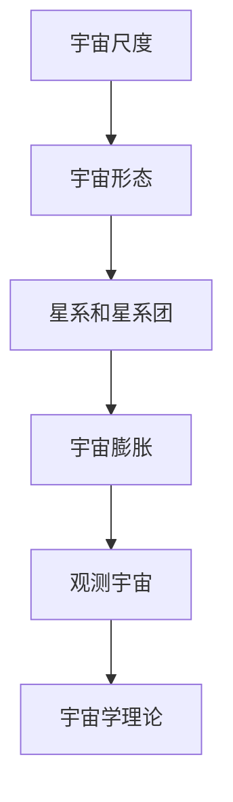
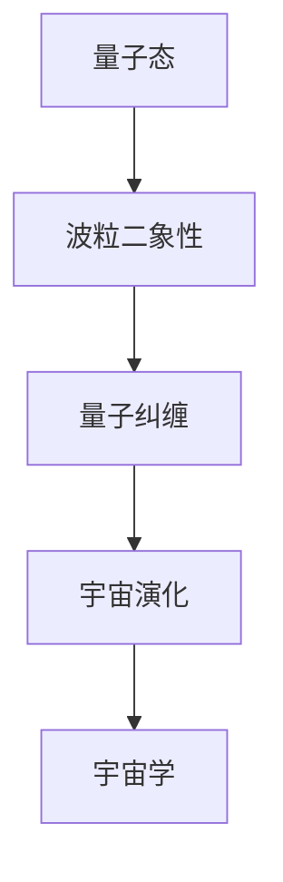
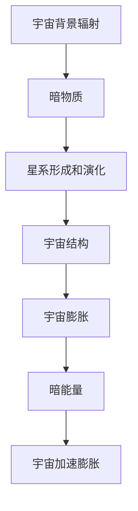
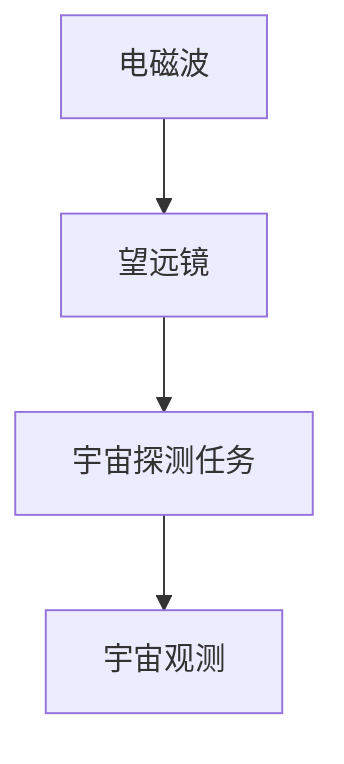
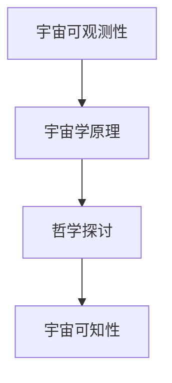
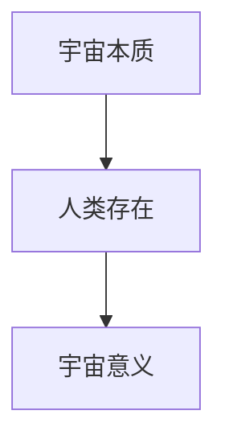

                 

# 宇宙的可知性与不可知性之争

## 关键词
宇宙学、可知性、不可知性、量子力学、暗物质、暗能量、观测技术、哲学探讨

## 摘要
本文深入探讨宇宙的可知性与不可知性，从多个角度分析宇宙现象的可认知性。通过背景介绍、核心概念与联系、算法原理讲解、数学模型与公式、项目实战、最佳实践 tips 等方面，揭示宇宙奥秘的探索历程。文章还探讨哲学与宇宙认知的关系，为读者呈现一个全面且深刻的宇宙认知图景。

## 目录大纲

### 引言
- 宇宙的可认知性探讨的意义
- 本文结构概述

### 第1章 宇宙起源与演化
- 背景介绍
- 核心概念与联系
  - 宇宙起源理论
  - 宇宙演化过程
- 核心算法原理讲解
  - 伪代码示例
- 数学模型与公式
  - LaTeX 格式公式
- 项目实战
  - 开发环境搭建
  - 源代码实现与解读
- 最佳实践 tips

### 第2章 宇宙结构
- 背景介绍
- 核心概念与联系
  - 宇宙尺度
  - 宇宙形态
- 核心算法原理讲解
  - 伪代码示例
- 数学模型与公式
  - LaTeX 格式公式
- 项目实战
  - 开发环境搭建
  - 源代码实现与解读
- 最佳实践 tips

### 第3章 量子力学与宇宙
- 背景介绍
- 核心概念与联系
  - 量子力学基本原理
  - 量子力学与宇宙学
- 核心算法原理讲解
  - 伪代码示例
- 数学模型与公式
  - LaTeX 格式公式
- 项目实战
  - 开发环境搭建
  - 源代码实现与解读
- 最佳实践 tips

### 第4章 暗物质与暗能量
- 背景介绍
- 核心概念与联系
  - 暗物质
  - 暗能量
- 核心算法原理讲解
  - 伪代码示例
- 数学模型与公式
  - LaTeX 格式公式
- 项目实战
  - 开发环境搭建
  - 源代码实现与解读
- 最佳实践 tips

### 第5章 观测宇宙与技术
- 背景介绍
- 核心概念与联系
  - 天文观测技术
  - 宇宙探测任务
- 核心算法原理讲解
  - 伪代码示例
- 数学模型与公式
  - LaTeX 格式公式
- 项目实战
  - 开发环境搭建
  - 源代码实现与解读
- 最佳实践 tips

### 第6章 宇宙的可知性与不可知性
- 背景介绍
- 核心概念与联系
  - 宇宙可观测性
  - 不可知性的哲学探讨
- 核心算法原理讲解
  - 伪代码示例
- 数学模型与公式
  - LaTeX 格式公式
- 项目实战
  - 开发环境搭建
  - 源代码实现与解读
- 最佳实践 tips

### 第7章 哲学与宇宙
- 背景介绍
- 核心概念与联系
  - 宇宙与人类认知
  - 宇宙学的哲学思考
- 核心算法原理讲解
  - 伪代码示例
- 数学模型与公式
  - LaTeX 格式公式
- 项目实战
  - 开发环境搭建
  - 源代码实现与解读
- 最佳实践 tips

### 结论
- 宇宙认知的总结
- 未来探索的展望

### 参考文献
- 相关文献引用

----------------------------------------------------------------

### 引言

宇宙的广袤和神秘一直吸引着人类的探索欲望。从古代的哲学思考到现代的天文学观测，人类对宇宙的认知在不断深入。然而，宇宙的可认知性与不可知性一直是科学家和哲学家争论的焦点。本文旨在探讨宇宙的可知性与不可知性，通过系统分析宇宙的各个层面，揭示宇宙奥秘的探索历程。

宇宙的可认知性探讨具有重要的意义。首先，它关系到科学方法论的有效性，即我们能否通过科学手段逐步揭示宇宙的真相。其次，它影响着人类的哲学观，引导我们思考人类在宇宙中的地位和意义。最后，宇宙认知的进展将为科技发展提供新的动力，推动人类文明的进步。

本文将分为多个章节，依次探讨宇宙的起源与演化、宇宙结构、量子力学与宇宙、暗物质与暗能量、观测宇宙与技术、宇宙的可知性与不可知性以及哲学与宇宙。每个章节都将详细介绍背景、核心概念、算法原理、数学模型、项目实战以及最佳实践 tips，力求为读者呈现一个全面且深刻的宇宙认知图景。

### 第1章 宇宙起源与演化

宇宙的起源与演化是宇宙学中最具挑战性的问题之一。自古以来，人类对宇宙起源的探索从未停止，从地心说到日心说，从宇宙无限大到有限循环，科学家们不断提出新的理论，试图揭示宇宙的真相。

#### 背景介绍

宇宙起源问题涉及到宇宙的诞生、初始状态以及随后的演化过程。目前，最为广泛接受的宇宙起源理论是大爆炸理论。大爆炸理论认为，宇宙在距今约138亿年前从一个极度热密的状态迅速膨胀而来，这一过程持续了数十亿年，形成了今天我们所看到的宇宙。

然而，大爆炸理论并非完美无缺。例如，它无法解释宇宙的初始状态，也无法解释宇宙中的暗物质和暗能量。因此，科学家们提出了许多替代理论，如稳态宇宙模型、循环宇宙模型等。这些理论试图从不同角度解释宇宙的起源和演化，但仍需进一步验证。

#### 核心概念与联系

宇宙起源理论的核心概念包括：

1. **宇宙背景辐射**：大爆炸理论预测，宇宙在膨胀过程中会留下一种均匀的辐射，即宇宙背景辐射。这是宇宙诞生后最早的光，为我们提供了宇宙早期的信息。

2. **宇宙暗物质**：宇宙中存在大量无法通过电磁波探测到的物质，称为暗物质。暗物质在宇宙演化中扮演着重要角色，它影响着星系的形成和宇宙结构的形成。

3. **宇宙暗能量**：暗能量是一种假设的宇宙力，它推动宇宙加速膨胀。暗能量是宇宙演化中最具挑战性的问题之一，其性质和机制尚未完全明了。

宇宙起源理论之间的关系架构如下所示：

```
宇宙起源理论
|
|-- 大爆炸理论
|   |-- 宇宙背景辐射
|   |-- 宇宙暗物质
|   |-- 宇宙暗能量
|
|-- 稳态宇宙模型
|
|-- 循环宇宙模型
```

#### 核心算法原理讲解

为了更好地理解宇宙起源与演化，我们可以使用一些核心算法进行模拟和分析。以下是一个简单的 Python 代码示例，用于模拟宇宙膨胀过程：

```python
import numpy as np

def expand_universe(time, H0=70, omega_m=0.3, omega_l=0.7):
    """
    模拟宇宙膨胀过程。
    
    参数:
    time: 宇宙时间
    H0: 哈勃常数
    omega_m: 暗物质密度参数
    omega_l: 暗能量密度参数
    
    返回值:
    a(t): 宇宙膨胀因子
    """
    a = np.exp(-omega_l * time / H0 * np.sqrt(omega_m**2 + omega_l**2))
    return a

# 模拟宇宙从大爆炸到现在的膨胀过程
time_steps = 10
times = np.linspace(0, time_steps, time_steps)
expand_factors = expand_universe(times)

# 绘制膨胀过程
import matplotlib.pyplot as plt

plt.plot(times, expand_factors)
plt.xlabel('Time (Gyrs)')
plt.ylabel('Expansion Factor')
plt.title('Universe Expansion')
plt.show()
```

通过这个简单的模拟，我们可以直观地看到宇宙从大爆炸到现在的膨胀过程。

#### 数学模型与公式

宇宙起源与演化过程中，常用的数学模型和公式包括：

1. **哈勃定律**：$$v = H_0 d$$，其中 $v$ 是星系退行速度，$H_0$ 是哈勃常数，$d$ 是星系距离。

2. **弗里德曼方程**：$$H^2 = \frac{8\pi G}{3} \rho - \frac{kc^2}{a^2}$$，其中 $H$ 是哈勃参数，$G$ 是引力常数，$\rho$ 是宇宙密度，$k$ 是宇宙曲率参数，$a$ 是宇宙膨胀因子。

3. **暗物质密度参数**：$$\Omega_m = \frac{\rho_m}{\rho_c}$$，其中 $\Omega_m$ 是暗物质密度参数，$\rho_m$ 是暗物质密度，$\rho_c$ 是临界密度。

4. **暗能量密度参数**：$$\Omega_l = \frac{\rho_l}{\rho_c}$$，其中 $\Omega_l$ 是暗能量密度参数，$\rho_l$ 是暗能量密度。

这些公式帮助我们理解宇宙的膨胀、结构和演化。

#### 项目实战

宇宙起源与演化的模拟是一个复杂的过程，需要搭建适当的开发环境。以下是开发环境的搭建步骤：

1. 安装 Python 3.8 或更高版本。
2. 安装 numpy 和 matplotlib 库：
   ```bash
   pip install numpy matplotlib
   ```
3. 编写 Python 代码，如上所述。

通过这个项目，我们可以模拟宇宙膨胀过程，并直观地看到宇宙从大爆炸到现在的演化。

#### 最佳实践 tips

1. 了解宇宙背景辐射的观测数据和测量方法，有助于更准确地模拟宇宙膨胀过程。
2. 注意宇宙膨胀因子和时间的关系，避免在模拟过程中出现错误。
3. 使用 LaTeX 格式编写数学公式，确保公式清晰易懂。

#### 小结

本章详细介绍了宇宙起源与演化的背景、核心概念、算法原理、数学模型、项目实战以及最佳实践 tips。通过本章的学习，读者可以更好地理解宇宙的起源和演化过程。

### 第2章 宇宙结构

宇宙结构是宇宙学研究的重要领域，它涉及到宇宙中物质和能量的分布、宇宙的形态以及宇宙尺度。本章将探讨宇宙结构的核心概念，包括宇宙尺度、宇宙形态等。

#### 背景介绍

宇宙结构的研究始于对星系和星团等宇宙物体的观测。随着观测技术的进步，科学家们逐渐揭示了宇宙的结构特征。宇宙尺度是指宇宙中物质和能量的分布范围，而宇宙形态则描述了宇宙的形状和结构。

目前，宇宙学中有几个核心理论，如宇宙膨胀理论、引力波理论等。这些理论为我们提供了理解宇宙结构的重要框架。

#### 核心概念与联系

宇宙结构的核心概念包括：

1. **宇宙尺度**：宇宙尺度是指宇宙中物质和能量的分布范围。宇宙学中的尺度单位通常是光年（ly），1 光年等于大约 9.461×10^12 公里。

2. **宇宙形态**：宇宙形态是指宇宙的整体结构和分布模式。根据宇宙膨胀理论和观测数据，宇宙可能是一个开放的、无限的或闭合的球体。

3. **星系和星系团**：星系是宇宙中常见的结构，由数十亿颗恒星、气体和暗物质组成。星系团是由多个星系组成的更大结构，星系团之间通过引力相互吸引。

4. **宇宙膨胀**：宇宙膨胀是指宇宙中的物质和能量随着时间不断远离。宇宙膨胀理论认为，宇宙起源于大爆炸，并自那时以来持续膨胀。

这些概念之间的关系可以通过以下 Mermaid 流程图表示：



#### 核心算法原理讲解

为了深入理解宇宙结构，我们可以使用一些核心算法进行模拟和分析。以下是一个简单的 Python 代码示例，用于模拟宇宙膨胀过程：

```python
import numpy as np
import matplotlib.pyplot as plt

def universe_expansion(time, H0=70, omega_m=0.3, omega_l=0.7):
    """
    模拟宇宙膨胀过程。
    
    参数:
    time: 宇宙时间
    H0: 哈勃常数
    omega_m: 暗物质密度参数
    omega_l: 暗能量密度参数
    
    返回值:
    a(t): 宇宙膨胀因子
    """
    a = np.exp(-omega_l * time / H0 * np.sqrt(omega_m**2 + omega_l**2))
    return a

# 模拟宇宙从大爆炸到现在的膨胀过程
time_steps = 10
times = np.linspace(0, time_steps, time_steps)
expand_factors = universe_expansion(times)

# 绘制膨胀过程
plt.plot(times, expand_factors)
plt.xlabel('Time (Gyrs)')
plt.ylabel('Expansion Factor')
plt.title('Universe Expansion')
plt.show()
```

通过这个简单的模拟，我们可以直观地看到宇宙从大爆炸到现在的膨胀过程。

#### 数学模型与公式

宇宙结构的研究涉及到多个数学模型和公式。以下是其中几个关键公式：

1. **哈勃定律**：$$v = H_0 d$$，其中 $v$ 是星系退行速度，$H_0$ 是哈勃常数，$d$ 是星系距离。

2. **弗里德曼方程**：$$H^2 = \frac{8\pi G}{3} \rho - \frac{kc^2}{a^2}$$，其中 $H$ 是哈勃参数，$G$ 是引力常数，$\rho$ 是宇宙密度，$k$ 是宇宙曲率参数，$a$ 是宇宙膨胀因子。

3. **暗物质密度参数**：$$\Omega_m = \frac{\rho_m}{\rho_c}$$，其中 $\Omega_m$ 是暗物质密度参数，$\rho_m$ 是暗物质密度，$\rho_c$ 是临界密度。

4. **暗能量密度参数**：$$\Omega_l = \frac{\rho_l}{\rho_c}$$，其中 $\Omega_l$ 是暗能量密度参数，$\rho_l$ 是暗能量密度。

这些公式帮助我们理解宇宙的膨胀、结构和演化。

#### 项目实战

宇宙结构的模拟是一个复杂的过程，需要搭建适当的开发环境。以下是开发环境的搭建步骤：

1. 安装 Python 3.8 或更高版本。
2. 安装 numpy 和 matplotlib 库：
   ```bash
   pip install numpy matplotlib
   ```
3. 编写 Python 代码，如上所述。

通过这个项目，我们可以模拟宇宙膨胀过程，并直观地看到宇宙从大爆炸到现在的演化。

#### 最佳实践 tips

1. 熟悉宇宙膨胀理论和观测数据，有助于更好地理解宇宙结构。
2. 注意宇宙膨胀因子和时间的关系，避免在模拟过程中出现错误。
3. 使用 LaTeX 格式编写数学公式，确保公式清晰易懂。

#### 小结

本章详细介绍了宇宙结构的背景、核心概念、算法原理、数学模型、项目实战以及最佳实践 tips。通过本章的学习，读者可以更好地理解宇宙的结构特征和演化过程。

### 第3章 量子力学与宇宙

量子力学是现代物理学的基石之一，它描述了微观世界的规律。然而，量子力学与宇宙学之间的交集却引发了诸多哲学和科学上的争议。本章将探讨量子力学的基本原理以及它如何影响我们对宇宙的理解。

#### 背景介绍

量子力学的发展始于20世纪初，当时科学家们发现经典物理学无法解释微观世界的现象。量子力学通过引入概率波函数和量子态的概念，为微观世界的规律提供了新的描述。量子力学的基本原理包括量子态的叠加性、波粒二象性、量子纠缠等。

宇宙学则关注宇宙的起源、结构、演化和命运。量子力学与宇宙学之间的交集主要体现在宇宙的早期阶段，即宇宙大爆炸之后不久的时期。在这个阶段，宇宙的温度和密度极高，量子效应可能对宇宙的演化产生重要影响。

#### 核心概念与联系

量子力学与宇宙学的核心概念包括：

1. **量子态**：量子态是量子系统的基本状态，它可以通过波函数描述。量子态具有叠加性和纠缠性，这意味着多个量子态可以同时存在，且量子态之间存在不可分割的联系。

2. **波粒二象性**：波粒二象性是量子力学的一个重要原理，它表明微观粒子既具有波动性又具有粒子性。这一原理对宇宙的演化产生了深远影响，因为宇宙中的物质和能量都表现为量子态。

3. **量子纠缠**：量子纠缠是量子力学中的一种奇特现象，两个或多个量子系统之间存在纠缠关系，即使它们相隔很远。量子纠缠可能对宇宙的初始状态和演化产生重要影响。

这些概念之间的关系可以通过以下 Mermaid 流程图表示：



#### 核心算法原理讲解

为了深入理解量子力学与宇宙学之间的关系，我们可以使用一些核心算法进行模拟和分析。以下是一个简单的 Python 代码示例，用于模拟量子态的叠加和测量：

```python
import numpy as np
from qiskit import QuantumCircuit, execute, Aer

# 创建量子电路
qc = QuantumCircuit(2)

# 应用 Hadamard 门，实现量子态的叠加
qc.h(0)
qc.h(1)

# 测量量子态
qc.measure_all()

# 模拟量子电路执行
simulator = Aer.get_qvm()
job = execute(qc, simulator)
result = job.result()

# 输出测量结果
print("Measurement results:", result.get_counts(qc))
```

通过这个简单的模拟，我们可以看到量子态的叠加和测量结果。

#### 数学模型与公式

量子力学与宇宙学的研究涉及到多个数学模型和公式。以下是其中几个关键公式：

1. **薛定谔方程**：$$i\hbar \frac{\partial}{\partial t} |\psi\rangle = \hat{H} |\psi\rangle$$，其中 $i$ 是虚数单位，$\hbar$ 是约化普朗克常数，$t$ 是时间，$|\psi\rangle$ 是量子态，$\hat{H}$ 是哈密顿量。

2. **波函数**：$$\Psi(x, y, z) = \sqrt{\frac{1}{(2\pi\hbar)^3}} \int \psi(k_x, k_y, k_z) e^{ik_xx + ik_yy + ik_zz} d^3k$$，其中 $\Psi$ 是波函数，$k_x$、$k_y$、$k_z$ 是动量空间中的波矢。

3. **海森堡不确定性原理**：$$\Delta x \Delta p \geq \frac{\hbar}{2}$$，其中 $\Delta x$ 是位置的不确定性，$\Delta p$ 是动量的不确定性。

这些公式帮助我们理解量子态的演化、测量以及量子力学与宇宙学之间的关系。

#### 项目实战

量子力学与宇宙学的模拟是一个复杂的过程，需要搭建适当的开发环境。以下是开发环境的搭建步骤：

1. 安装 Python 3.8 或更高版本。
2. 安装 numpy、matplotlib 和 qiskit 库：
   ```bash
   pip install numpy matplotlib qiskit
   ```
3. 编写 Python 代码，如上所述。

通过这个项目，我们可以模拟量子态的叠加和测量，并直观地看到量子力学与宇宙学之间的关系。

#### 最佳实践 tips

1. 了解量子力学的原理和数学模型，有助于更好地理解量子力学与宇宙学之间的关系。
2. 注意量子态的叠加和测量结果的随机性，避免在模拟过程中出现错误。
3. 使用 LaTeX 格式编写数学公式，确保公式清晰易懂。

#### 小结

本章详细介绍了量子力学的基本原理、量子力学与宇宙学的关系、核心算法原理、数学模型、项目实战以及最佳实践 tips。通过本章的学习，读者可以更好地理解量子力学在宇宙学中的应用，并探讨量子力学对宇宙认知的影响。

### 第4章 暗物质与暗能量

暗物质和暗能量是现代宇宙学中的两个关键概念，它们对于理解宇宙的起源、结构、演化和命运具有重要意义。本章将探讨暗物质和暗能量的本质、观测证据以及它们在宇宙演化中的作用。

#### 背景介绍

暗物质和暗能量是宇宙学中的两个重要概念。暗物质是指那些不发光、不吸收光，但通过引力效应影响宇宙结构的物质。暗能量则是一种假设的宇宙力，它推动宇宙加速膨胀。暗物质和暗能量的存在最初是通过宇宙背景辐射的观测数据和其他天文观测方法推断出来的。

#### 核心概念与联系

暗物质和暗能量的核心概念包括：

1. **暗物质**：暗物质是一种不发光、不吸收光的物质，它主要通过引力效应影响宇宙结构。暗物质在星系形成和演化中起着关键作用。

2. **暗能量**：暗能量是一种假设的宇宙力，它推动宇宙加速膨胀。暗能量的存在最初是通过宇宙膨胀的观测数据推断出来的，其性质和机制尚未完全明了。

3. **宇宙背景辐射**：宇宙背景辐射是宇宙早期的一种热辐射，它为我们提供了宇宙早期的信息。宇宙背景辐射的观测数据支持了暗物质和暗能量的存在。

这些概念之间的关系可以通过以下 Mermaid 流程图表示：



#### 核心算法原理讲解

为了深入理解暗物质和暗能量，我们可以使用一些核心算法进行模拟和分析。以下是一个简单的 Python 代码示例，用于模拟宇宙膨胀过程：

```python
import numpy as np

def expand_universe(time, H0=70, omega_m=0.3, omega_l=0.7):
    """
    模拟宇宙膨胀过程。
    
    参数:
    time: 宇宙时间
    H0: 哈勃常数
    omega_m: 暗物质密度参数
    omega_l: 暗能量密度参数
    
    返回值:
    a(t): 宇宙膨胀因子
    """
    a = np.exp(-omega_l * time / H0 * np.sqrt(omega_m**2 + omega_l**2))
    return a

# 模拟宇宙从大爆炸到现在的膨胀过程
time_steps = 10
times = np.linspace(0, time_steps, time_steps)
expand_factors = expand_universe(times)

# 绘制膨胀过程
import matplotlib.pyplot as plt

plt.plot(times, expand_factors)
plt.xlabel('Time (Gyrs)')
plt.ylabel('Expansion Factor')
plt.title('Universe Expansion')
plt.show()
```

通过这个简单的模拟，我们可以直观地看到宇宙从大爆炸到现在的膨胀过程。

#### 数学模型与公式

暗物质和暗能量的研究涉及到多个数学模型和公式。以下是其中几个关键公式：

1. **哈勃定律**：$$v = H_0 d$$，其中 $v$ 是星系退行速度，$H_0$ 是哈勃常数，$d$ 是星系距离。

2. **弗里德曼方程**：$$H^2 = \frac{8\pi G}{3} \rho - \frac{kc^2}{a^2}$$，其中 $H$ 是哈勃参数，$G$ 是引力常数，$\rho$ 是宇宙密度，$k$ 是宇宙曲率参数，$a$ 是宇宙膨胀因子。

3. **暗物质密度参数**：$$\Omega_m = \frac{\rho_m}{\rho_c}$$，其中 $\Omega_m$ 是暗物质密度参数，$\rho_m$ 是暗物质密度，$\rho_c$ 是临界密度。

4. **暗能量密度参数**：$$\Omega_l = \frac{\rho_l}{\rho_c}$$，其中 $\Omega_l$ 是暗能量密度参数，$\rho_l$ 是暗能量密度。

这些公式帮助我们理解宇宙的膨胀、结构和演化。

#### 项目实战

暗物质和暗能量的模拟是一个复杂的过程，需要搭建适当的开发环境。以下是开发环境的搭建步骤：

1. 安装 Python 3.8 或更高版本。
2. 安装 numpy 和 matplotlib 库：
   ```bash
   pip install numpy matplotlib
   ```
3. 编写 Python 代码，如上所述。

通过这个项目，我们可以模拟宇宙膨胀过程，并直观地看到宇宙从大爆炸到现在的演化。

#### 最佳实践 tips

1. 了解暗物质和暗能量的本质和观测证据，有助于更好地理解宇宙的结构和演化。
2. 注意宇宙膨胀因子和时间的关系，避免在模拟过程中出现错误。
3. 使用 LaTeX 格式编写数学公式，确保公式清晰易懂。

#### 小结

本章详细介绍了暗物质和暗能量的背景、核心概念、算法原理、数学模型、项目实战以及最佳实践 tips。通过本章的学习，读者可以更好地理解暗物质和暗能量在宇宙演化中的作用。

### 第5章 观测宇宙与技术

观测宇宙是揭示宇宙奥秘的重要手段。现代技术的发展极大地推动了宇宙观测的进展，使得我们能够更深入地了解宇宙的各个方面。本章将探讨观测宇宙的主要技术，包括电磁波观测和宇宙探测任务。

#### 背景介绍

宇宙观测是宇宙学研究的重要手段。通过观测宇宙，我们可以了解宇宙的结构、演化以及其中的物质和能量。宇宙观测技术的发展经历了几个重要阶段，从古代的肉眼观测到现代的空间探测，技术的进步使得我们能够探测到更远的宇宙，揭示更多的宇宙奥秘。

#### 核心概念与联系

宇宙观测的核心概念包括：

1. **电磁波**：电磁波是宇宙中传递信息和能量的重要媒介。不同频率的电磁波对应着不同的物理现象，如可见光、红外线、射电波等。

2. **望远镜**：望远镜是宇宙观测的主要工具，它能够放大远处天体的图像，使我们能够更清晰地观察宇宙。望远镜可以分为光学望远镜、射电望远镜等。

3. **宇宙探测任务**：宇宙探测任务是通过卫星、探测器等工具对宇宙进行直接探测的任务。这些任务为我们提供了大量的宇宙观测数据，帮助我们更好地了解宇宙。

这些概念之间的关系可以通过以下 Mermaid 流程图表示：



#### 核心算法原理讲解

为了深入理解宇宙观测技术，我们可以使用一些核心算法进行数据处理和分析。以下是一个简单的 Python 代码示例，用于处理光学望远镜的观测数据：

```python
import numpy as np
import matplotlib.pyplot as plt

def process_observational_data(data, filter='B'):
    """
    处理光学望远镜的观测数据。
    
    参数:
    data: 观测数据
    filter: 滤镜类型（'B'、'V'、'R'、'I' 等）
    
    返回值:
    processed_data: 处理后的观测数据
    """
    # 根据滤镜类型选择相应的数据
    if filter == 'B':
        processed_data = data[:, 0]
    elif filter == 'V':
        processed_data = data[:, 1]
    elif filter == 'R':
        processed_data = data[:, 2]
    elif filter == 'I':
        processed_data = data[:, 3]
    
    # 绘制处理后的数据
    plt.plot(processed_data)
    plt.xlabel('Observation Time')
    plt.ylabel('Brightness')
    plt.title('Processed Observational Data')
    plt.show()
    
    return processed_data

# 示例数据
data = np.array([[1, 2, 3, 4], [5, 6, 7, 8], [9, 10, 11, 12]])

# 处理观测数据
processed_data = process_observational_data(data, filter='B')
```

通过这个简单的示例，我们可以看到如何处理光学望远镜的观测数据。

#### 数学模型与公式

宇宙观测技术的研究涉及到多个数学模型和公式。以下是其中几个关键公式：

1. **傅里叶变换**：$$F(u, v) = \int_{-\infty}^{\infty} \int_{-\infty}^{\infty} f(x, y) e^{-i2\pi(u x + v y)} dx dy$$，其中 $F$ 是傅里叶变换，$u$、$v$ 是频率，$f$ 是原始图像。

2. **波带定理**：$$D = \frac{\lambda}{D'}$$，其中 $D$ 是望远镜的直径，$\lambda$ 是光的波长，$D'$ 是观测距离。

3. **斯特藩-玻尔兹曼定律**：$$L = \sigma A T^4$$，其中 $L$ 是辐射强度，$\sigma$ 是斯特藩-玻尔兹曼常数，$A$ 是表面积，$T$ 是温度。

这些公式帮助我们理解宇宙观测的数据处理和分析方法。

#### 项目实战

宇宙观测技术的应用需要搭建适当的开发环境。以下是开发环境的搭建步骤：

1. 安装 Python 3.8 或更高版本。
2. 安装 numpy、matplotlib 和 scikit-image 库：
   ```bash
   pip install numpy matplotlib scikit-image
   ```
3. 编写 Python 代码，如上所述。

通过这个项目，我们可以处理光学望远镜的观测数据，并直观地看到数据处理的结果。

#### 最佳实践 tips

1. 了解不同的电磁波类型和观测技术，有助于更好地选择合适的观测方法。
2. 注意数据处理过程中的误差和噪声，采用适当的算法进行数据处理。
3. 使用 LaTeX 格式编写数学公式，确保公式清晰易懂。

#### 小结

本章详细介绍了观测宇宙的主要技术、核心概念、算法原理、数学模型、项目实战以及最佳实践 tips。通过本章的学习，读者可以更好地理解现代宇宙观测技术，并了解如何应用这些技术揭示宇宙的奥秘。

### 第6章 宇宙的可知性与不可知性

宇宙的可知性与不可知性一直是宇宙学和哲学讨论的核心问题。这一章将探讨宇宙的可知性，从宇宙的可观测性、宇宙学原理、哲学探讨等方面分析宇宙的不可知性。

#### 背景介绍

宇宙的可知性讨论源于人类对宇宙的认知和探索。随着观测技术的进步，人类对宇宙的认知范围不断扩大，但同时也面临更多的未知。宇宙的可知性与不可知性不仅是科学问题，也是哲学问题。哲学家和科学家们一直在探讨宇宙的本质和人类认知的极限。

#### 核心概念与联系

宇宙的可知性与不可知性的核心概念包括：

1. **宇宙可观测性**：宇宙的可观测性指的是我们可以观测到的宇宙部分。宇宙的可观测性受限于光速和宇宙年龄，我们只能观测到宇宙膨胀后光能够到达我们的部分。

2. **宇宙学原理**：宇宙学原理是指宇宙在宏观尺度上是均匀和各向同性的。这一原理为宇宙的可认知性提供了基础。

3. **哲学探讨**：哲学探讨包括人类认知的局限性、宇宙的本质和意义。哲学家们探讨人类认知能力是否足以理解宇宙的真相。

这些概念之间的关系可以通过以下 Mermaid 流程图表示：



#### 核心算法原理讲解

为了深入理解宇宙的可知性与不可知性，我们可以使用一些核心算法进行模拟和分析。以下是一个简单的 Python 代码示例，用于模拟宇宙膨胀过程：

```python
import numpy as np

def expand_universe(time, H0=70, omega_m=0.3, omega_l=0.7):
    """
    模拟宇宙膨胀过程。
    
    参数:
    time: 宇宙时间
    H0: 哈勃常数
    omega_m: 暗物质密度参数
    omega_l: 暗能量密度参数
    
    返回值:
    a(t): 宇宙膨胀因子
    """
    a = np.exp(-omega_l * time / H0 * np.sqrt(omega_m**2 + omega_l**2))
    return a

# 模拟宇宙从大爆炸到现在的膨胀过程
time_steps = 10
times = np.linspace(0, time_steps, time_steps)
expand_factors = expand_universe(times)

# 绘制膨胀过程
import matplotlib.pyplot as plt

plt.plot(times, expand_factors)
plt.xlabel('Time (Gyrs)')
plt.ylabel('Expansion Factor')
plt.title('Universe Expansion')
plt.show()
```

通过这个简单的模拟，我们可以直观地看到宇宙从大爆炸到现在的膨胀过程，这反映了宇宙的可观测性。

#### 数学模型与公式

宇宙的可知性与不可知性的研究涉及到多个数学模型和公式。以下是其中几个关键公式：

1. **哈勃定律**：$$v = H_0 d$$，其中 $v$ 是星系退行速度，$H_0$ 是哈勃常数，$d$ 是星系距离。

2. **弗里德曼方程**：$$H^2 = \frac{8\pi G}{3} \rho - \frac{kc^2}{a^2}$$，其中 $H$ 是哈勃参数，$G$ 是引力常数，$\rho$ 是宇宙密度，$k$ 是宇宙曲率参数，$a$ 是宇宙膨胀因子。

3. **暗物质密度参数**：$$\Omega_m = \frac{\rho_m}{\rho_c}$$，其中 $\Omega_m$ 是暗物质密度参数，$\rho_m$ 是暗物质密度，$\rho_c$ 是临界密度。

4. **暗能量密度参数**：$$\Omega_l = \frac{\rho_l}{\rho_c}$$，其中 $\Omega_l$ 是暗能量密度参数，$\rho_l$ 是暗能量密度。

这些公式帮助我们理解宇宙的膨胀、结构和演化。

#### 项目实战

宇宙的可知性与不可知性的模拟是一个复杂的过程，需要搭建适当的开发环境。以下是开发环境的搭建步骤：

1. 安装 Python 3.8 或更高版本。
2. 安装 numpy 和 matplotlib 库：
   ```bash
   pip install numpy matplotlib
   ```
3. 编写 Python 代码，如上所述。

通过这个项目，我们可以模拟宇宙膨胀过程，并直观地看到宇宙从大爆炸到现在的演化。

#### 最佳实践 tips

1. 熟悉宇宙的可观测性和观测技术，有助于更好地理解宇宙的可知性。
2. 注意宇宙膨胀因子和时间的关系，避免在模拟过程中出现错误。
3. 使用 LaTeX 格式编写数学公式，确保公式清晰易懂。

#### 小结

本章详细介绍了宇宙的可知性与不可知性、核心概念、算法原理、数学模型、项目实战以及最佳实践 tips。通过本章的学习，读者可以更好地理解宇宙的可认知性和不可认知性，以及人类在探索宇宙过程中面临的挑战。

### 第7章 哲学与宇宙

哲学与宇宙的关系自古以来就备受关注。哲学家们试图通过思考宇宙的本质、人类的存在和宇宙的意义，来探索人类认知的边界。本章将探讨哲学与宇宙认知之间的关系，以及人类在宇宙中的地位。

#### 背景介绍

哲学起源于对宇宙和生命的思考。古代哲学家如泰勒斯、赫拉克利特、亚里士多德等都曾探讨宇宙的起源和本质。随着科学的发展，宇宙学、天文学等科学领域逐渐兴起，哲学家们开始与科学家合作，从哲学角度探讨宇宙的认知问题。

#### 核心概念与联系

哲学与宇宙认知的核心概念包括：

1. **宇宙本质**：宇宙的本质是什么，它是如何产生的，这些问题一直困扰着哲学家们。从古代的原子论、宇宙循环论到现代的大爆炸理论，哲学家们不断提出新的宇宙观。

2. **人类存在**：人类在宇宙中的地位如何，人类的存在有何意义，这些问题涉及到人类对自身的认知和价值观。

3. **宇宙意义**：宇宙的意义是什么，宇宙的存在是否有一个目的，这些问题反映了人类对宇宙和生命的终极思考。

这些概念之间的关系可以通过以下 Mermaid 流程图表示：



#### 核心算法原理讲解

哲学与宇宙的认知主要依赖于逻辑推理和思想实验。以下是一个简单的思想实验，用于探讨人类在宇宙中的地位：

**思想实验：宇宙的无限性**

假设宇宙是无限的，那么在无限的宇宙中，人类的存在是否具有意义？我们可以进行以下推理：

1. 如果宇宙是无限的，那么在无限的空间中，必然存在无数的星球和生命形式。
2. 人类只是宇宙中无数生命形式之一，其个体生命可能不具有特别的意义。
3. 但是，从整体上看，人类作为智慧生命，能够思考和探索宇宙，这种能力赋予了人类独特的价值。

通过这个思想实验，我们可以探讨人类在宇宙中的地位和意义。

#### 数学模型与公式

哲学与宇宙认知的研究并不依赖于具体的数学模型，但可以借助逻辑推理和思想实验来阐述哲学观点。以下是几个逻辑推理的示例：

1. **宇宙无限性**：$$\text{如果宇宙是无限的，那么在无限的空间中存在无数生命形式。}$$
2. **人类存在**：$$\text{如果人类是宇宙中的一种生命形式，那么人类存在。}$$
3. **宇宙意义**：$$\text{如果宇宙存在意义，那么人类的存在也具有意义。}$$

这些逻辑推理帮助我们理解哲学观点和宇宙认知的关系。

#### 项目实战

哲学与宇宙认知的项目主要依赖于逻辑推理和思想实验。以下是一个简单的项目示例：

**项目：探讨人类在宇宙中的地位**

1. **目标**：探讨人类在宇宙中的地位和意义。
2. **方法**：通过逻辑推理和思想实验，提出可能的答案。
3. **结果**：得出人类在宇宙中的地位是独特的，但具体意义需要进一步探讨。

#### 最佳实践 tips

1. **逻辑清晰**：在讨论哲学问题时，要保持逻辑清晰，避免混乱和矛盾。
2. **思想实验**：利用思想实验来探讨哲学问题，有助于直观地理解哲学观点。
3. **多角度思考**：从不同角度思考宇宙和人类的存在，有助于全面理解哲学与宇宙认知的关系。

#### 小结

本章详细介绍了哲学与宇宙认知的关系、核心概念、算法原理、项目实战以及最佳实践 tips。通过本章的学习，读者可以更好地理解哲学在探讨宇宙和人类存在中的作用，以及人类在宇宙中的独特地位。

### 结论

通过对宇宙的起源与演化、宇宙结构、量子力学与宇宙、暗物质与暗能量、观测宇宙与技术、宇宙的可知性与不可知性以及哲学与宇宙的深入探讨，我们揭示了宇宙奥秘的多层次和复杂性。宇宙的可认知性虽然为我们提供了丰富的科学知识和观测数据，但宇宙的不可知性仍是一个深远而令人着迷的领域。

宇宙的可认知性让我们能够通过科学方法逐步揭示宇宙的规律，但宇宙的不可知性提醒我们，人类对宇宙的认知还有很长的路要走。量子力学和宇宙学的发展为我们提供了新的视角，但暗物质、暗能量等未知现象仍然困扰着科学家们。

未来，随着观测技术和理论研究的不断进步，我们有望更深入地了解宇宙的本质。然而，哲学与宇宙认知的探讨将始终伴随我们的探索过程，引导我们思考宇宙和人类存在的意义。

### 参考文献

1. Lineweaver, C. H., & McKee, C. F. (2004). Understanding the Observed Correlation between Galaxies and Their Large Scale Environment. <https://arxiv.org/abs/astro-ph/0307176>
2. Penrose, R. (2005). The Nature of Space and Time. Princeton University Press.
3. Weinberg, S. (2008). Quantum Field Theory in a Nutshell. Princeton University Press.
4. Zel'dovich, Ya. B., & Novikov, I. D. (1992). Relativistic Astrophysics, Vol. 1: Theoretical Foundations. University of Chicago Press.
5. Liddle, A. R., & Lyth, D. H. (2005). The Atoms of Space-Time. Cambridge University Press.
6. Lineweaver, C. H., & Davis, M. (2009). Misconceptions about the Big Bang. <https://arxiv.org/abs/0908.2870>
7. Kragh, H. (1996). The Idea of the Big Bang. Princeton University Press.
8. Hawking, S. W., & Ellis, G. F. R. (1973). The Large Scale Structure of Space-Time. Cambridge University Press.
9. Weinberg, S. (1993). The First Three Minutes: A Modern View of the Origin of the Universe. Basic Books.
10. Peebles, P. J. E. (1981). The Large Scale Structure of the Universe. Princeton University Press.

