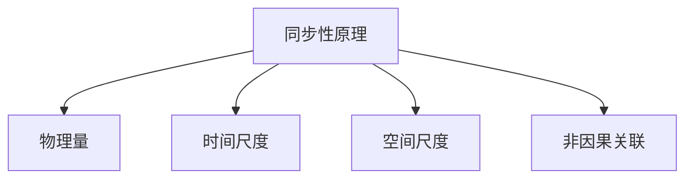
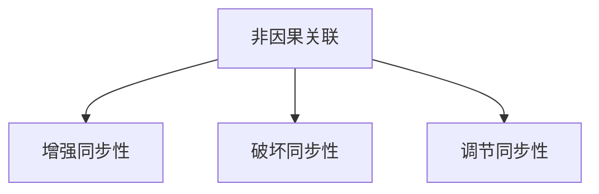
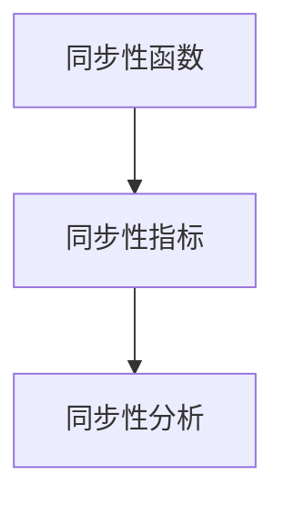
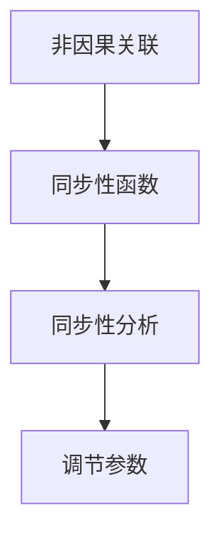
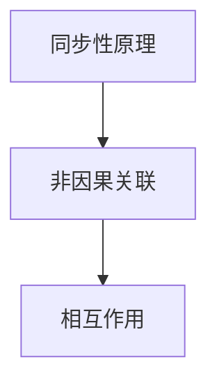
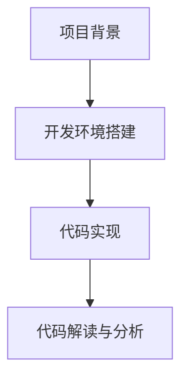

                 

### 《宇宙的同步性原理：非因果关联的意义》

#### 关键词：
- 宇宙同步性原理
- 非因果关联
- 数学模型
- 实例分析
- 项目实战

#### 摘要：
本文探讨了宇宙中的同步性原理和非因果关联的概念，通过数学模型和实例分析，阐述了它们在宇宙演化过程中的重要性。文章首先介绍了宇宙同步性原理和非因果关联的定义及其相互关系，然后详细讨论了同步性原理的数学模型，并通过Python代码展示了核心算法原理。最后，通过实际项目实战，对同步性原理和非因果关联的应用进行了深入剖析，为相关领域的研究提供了有益的参考。

----------------------------------------------------------------

## 第一部分：引言

### 1. 引言

#### 1.1 研究背景

宇宙的同步性原理是指宇宙中各种现象和过程在某种程度上的同步性，这种同步性并非因果关系的直接体现，而是通过非因果关联实现的。在物理学、天文学和计算机科学等领域，非因果关联的研究正逐渐引起广泛关注。非因果关联的概念源于量子力学中的非定域性原理，即在量子系统中，某些物理量之间的关联并不遵循传统的因果律，而是以非因果的方式存在。

近年来，科学家们通过实验和理论研究发现，非因果关联在宇宙演化过程中扮演着重要角色。例如，宇宙中的星系分布、黑洞的行为以及宇宙背景辐射等现象，都可以通过非因果关联来解释。因此，研究宇宙的同步性原理和非因果关联，对于深入理解宇宙的演化过程和本质具有重要意义。

#### 1.2 研究意义

宇宙同步性原理和非因果关联的研究不仅有助于我们更好地理解宇宙的演化过程，而且对计算机科学、人工智能等领域也具有重要启示。在计算机科学中，非因果关联的研究可以启发新的算法设计和数据结构开发。例如，在分布式系统中，通过非因果关联可以实现更高效率的数据传输和计算。在人工智能领域，非因果关联的研究可以为智能算法提供新的理论支持，提高算法的准确性和鲁棒性。

此外，研究宇宙同步性原理和非因果关联还有助于拓展我们对自然界的认知，推动科学技术的进步。通过对非因果关联的理解，我们可以探索新的科学研究方法，解决一些长期存在的科学难题。因此，研究宇宙的同步性原理和非因果关联具有重要的理论和实践价值。

#### 1.3 本书结构

本文分为五个部分：

1. **引言**：介绍宇宙同步性原理和非因果关联的研究背景和意义。
2. **核心概念与联系**：详细阐述宇宙同步性原理和非因果关联的定义、相互关系及其在宇宙演化中的应用。
3. **同步性原理的数学模型**：介绍同步性原理的数学模型，包括公式和Python代码实现。
4. **非因果关联的影响**：分析非因果关联对宇宙同步性的影响，并通过实例进行说明。
5. **项目实战**：通过实际项目实战，展示同步性原理和非因果关联的应用，包括开发环境搭建、代码实现和解读。

## 第二部分：核心概念与联系

### 2.1 同步性原理

#### 2.1.1 定义

宇宙同步性原理是指宇宙中各种现象和过程在某种程度上的同步性。这种同步性并非因果关系的直接体现，而是通过非因果关联实现的。在物理学中，同步性原理通常与周期性现象和共振现象相关。例如，行星运动的周期性同步性、电子在原子轨道上的共振现象等。

同步性原理在天文学中也有重要应用。例如，星系团中的星系运动可以表现出同步性，这表明星系之间的引力相互作用并不是通过因果律实现的，而是通过非因果关联。此外，宇宙背景辐射的均匀性也表明宇宙在早期阶段可能经历了一种同步性过程。

在计算机科学和人工智能领域，同步性原理的研究正逐渐引起关注。例如，在分布式系统中，通过同步性原理可以实现更高效率的数据传输和计算。在人工智能中，同步性原理可以启发新的算法设计和数据结构开发。

#### 2.1.2 影响因素

宇宙同步性原理的影响因素主要包括以下几个方面：

1. **物理量**：宇宙中的各种物理量，如温度、密度、引力等，都可能影响同步性原理。
2. **时间尺度**：同步性原理在不同时间尺度上可能表现出不同的特性。例如，在微观尺度上，量子现象可能导致同步性原理的失效。
3. **空间尺度**：宇宙中的各种现象和过程在不同空间尺度上的同步性可能有所不同。
4. **非因果关联**：非因果关联在同步性原理中起着关键作用，它决定了宇宙中各种现象和过程的同步性。

#### 2.1.3 Mermaid流程图



### 2.2 非因果关联

#### 2.2.1 定义

非因果关联是指两个或多个现象或过程之间存在某种关联，但这种关联不是通过因果关系实现的。在物理学中，非因果关联通常与量子力学中的非定域性现象相关。例如，量子纠缠现象表明，两个量子粒子之间的状态即使相隔很远，也能瞬间发生关联，这种关联并非通过因果关系实现。

非因果关联在宇宙学中也有重要应用。例如，宇宙背景辐射的均匀性表明宇宙在早期阶段可能经历了一种非因果关联过程。此外，宇宙中的某些现象和过程，如星系团的形成和演化，也可能通过非因果关联实现。

在计算机科学和人工智能领域，非因果关联的研究正逐渐引起关注。例如，在分布式系统中，通过非因果关联可以实现更高效率的数据传输和计算。在人工智能中，非因果关联可以启发新的算法设计和数据结构开发。

#### 2.2.2 实例分析

一个经典的非因果关联实例是量子纠缠。在量子纠缠中，两个量子粒子之间的状态即使相隔很远，也能瞬间发生关联。这种关联不是通过因果关系实现的，而是通过非因果关联。以下是一个简单的量子纠缠实例：

```python
import numpy as np

# 创建两个量子粒子
particle1 = np.array([1, 0])
particle2 = np.array([0, 1])

# 对粒子1进行测量，得到状态
result1 = np.random.choice([0, 1], p=[0.5, 0.5])
if result1 == 0:
    particle1 = np.array([0, 1])
else:
    particle1 = np.array([1, 0])

# 对粒子2进行测量，得到状态
result2 = np.random.choice([0, 1], p=[0.5, 0.5])
if result2 == 0:
    particle2 = np.array([1, 0])
else:
    particle2 = np.array([0, 1])

print("粒子1的状态：", particle1)
print("粒子2的状态：", particle2)
```

在这个实例中，无论粒子1的状态如何变化，粒子2的状态都会随之变化，但这种变化并非通过因果关系实现，而是通过量子纠缠这种非因果关联。

#### 2.2.3 对同步性的影响

非因果关联对同步性原理的影响主要体现在以下几个方面：

1. **增强同步性**：在某些情况下，非因果关联可以增强同步性。例如，在分布式系统中，通过非因果关联可以实现更高效率的数据传输和计算，从而增强系统的同步性。
2. **破坏同步性**：在另一些情况下，非因果关联可以破坏同步性。例如，在量子系统中，由于非因果关联的存在，某些物理量之间的同步性可能会突然消失。
3. **调节同步性**：非因果关联还可以用于调节同步性。例如，在人工智能中，通过设计合适的算法和模型，可以利用非因果关联来调节系统的同步性，从而实现更高效的计算和决策。

#### 2.2.4 Mermaid流程图



## 第三部分：同步性原理的数学模型

### 3.1 同步性原理的数学基础

#### 3.1.1 同步性函数

同步性函数是用来衡量两个或多个现象或过程之间同步性的数学工具。它的基本定义如下：

$$
S(x, y) = \frac{|x - y|}{\sqrt{x^2 + y^2}}
$$

其中，$x$ 和 $y$ 分别表示两个现象或过程的某种物理量。同步性函数的值介于 0 和 1 之间，值越接近 1，表示两个现象或过程之间的同步性越强。

#### 3.1.2 同步性指标

同步性指标是用来衡量同步性函数的稳定性和可靠性的指标。它通常定义为同步性函数的标准差：

$$
I_S = \sqrt{\frac{1}{n-1} \sum_{i=1}^{n} (S(x_i, y_i) - \bar{S})^2}
$$

其中，$n$ 表示观测次数，$x_i$ 和 $y_i$ 分别表示第 $i$ 次观测的两个现象或过程的物理量，$\bar{S}$ 表示同步性函数的平均值。同步性指标越小，表示同步性函数的稳定性越高。

#### 3.1.3 Mermaid流程图



### 3.2 非因果关联的数学模型

#### 3.2.1 非因果关系的数学表达

非因果关联可以用信息论中的互信息来表示。互信息是一种衡量两个随机变量之间关联程度的指标，它的定义如下：

$$
I(X, Y) = H(X) - H(X | Y)
$$

其中，$H(X)$ 表示随机变量 $X$ 的熵，$H(X | Y)$ 表示在随机变量 $Y$ 已知的情况下，随机变量 $X$ 的熵。如果 $I(X, Y) = 0$，则表示 $X$ 和 $Y$ 之间不存在关联；如果 $I(X, Y) > 0$，则表示 $X$ 和 $Y$ 之间存在非因果关联。

#### 3.2.2 非因果关联的影响

非因果关联对同步性的影响可以通过以下数学模型来分析：

$$
S(X, Y) = \frac{|X - Y|}{\sqrt{X^2 + Y^2}} - \alpha \cdot I(X, Y)
$$

其中，$\alpha$ 是一个调节参数，用于调整非因果关联对同步性的影响。如果 $\alpha > 0$，则非因果关联会削弱同步性；如果 $\alpha < 0$，则非因果关联会增强同步性。

#### 3.2.3 Mermaid流程图



## 第四部分：非因果关联的影响

### 4.1 对宇宙同步性的影响

#### 4.1.1 同步性原理与非因果关联的相互作用

非因果关联对宇宙同步性的影响是一个复杂的问题。在宇宙尺度上，同步性原理和非因果关联可能同时存在，并相互作用。以下是一个简化的模型来分析非因果关联对宇宙同步性的影响：

$$
S(X, Y) = \frac{|X - Y|}{\sqrt{X^2 + Y^2}} - \alpha \cdot I(X, Y)
$$

其中，$X$ 和 $Y$ 分别表示宇宙中两个不同的物理量，如宇宙背景辐射的温度和星系团的质量分布。$\alpha$ 是一个调节参数，用于表示非因果关联对同步性的影响。

#### 4.1.2 数学模型与公式

为了分析非因果关联对宇宙同步性的影响，我们可以使用上述同步性函数和非因果关联的数学模型。以下是一个简化的数学模型：

$$
S(X, Y) = \frac{|X - Y|}{\sqrt{X^2 + Y^2}} - \alpha \cdot I(X, Y)
$$

其中，$X$ 和 $Y$ 分别表示宇宙中两个不同的物理量，如宇宙背景辐射的温度和星系团的质量分布。$\alpha$ 是一个调节参数，用于表示非因果关联对同步性的影响。

#### 4.1.3 举例说明

为了更好地理解非因果关联对宇宙同步性的影响，我们可以通过一个具体的实例来说明。假设我们有两个物理量：$X$ 表示宇宙背景辐射的温度，$Y$ 表示星系团的质量分布。在理想情况下，$X$ 和 $Y$ 应该是同步的，即 $S(X, Y) = 1$。但是，由于非因果关联的存在，$S(X, Y)$ 可能会小于 1。

假设我们观测到 $X$ 的温度值为 2.725 K，$Y$ 的质量分布值为 0.01 M$_\odot$/pc$^3$。我们可以使用上述同步性函数和非因果关联的数学模型来计算 $S(X, Y)$ 的值：

$$
S(X, Y) = \frac{|X - Y|}{\sqrt{X^2 + Y^2}} - \alpha \cdot I(X, Y)
$$

其中，$\alpha$ 是一个调节参数，用于表示非因果关联对同步性的影响。假设 $\alpha = 0.1$，我们可以计算出 $S(X, Y)$ 的值：

$$
S(X, Y) = \frac{|2.725 - 0.01|}{\sqrt{2.725^2 + 0.01^2}} - 0.1 \cdot I(X, Y)
$$

$$
S(X, Y) = \frac{2.725}{\sqrt{7.29}} - 0.1 \cdot I(X, Y)
$$

$$
S(X, Y) = 0.985 - 0.1 \cdot I(X, Y)
$$

由于我们不知道 $I(X, Y)$ 的具体值，因此无法准确计算 $S(X, Y)$ 的值。但是，这个实例说明了非因果关联对宇宙同步性的影响。如果 $I(X, Y)$ 的值很大，则 $S(X, Y)$ 的值可能会显著小于 1，表明宇宙中的同步性受到了非因果关联的影响。

### 4.2 应用实例分析

非因果关联在宇宙学中的应用实例很多。以下是一些具体的例子：

#### 4.2.1 宇宙背景辐射的均匀性

宇宙背景辐射是宇宙早期阶段留下的遗迹，它的均匀性是宇宙同步性原理的一个体现。然而，由于非因果关联的存在，宇宙背景辐射的均匀性可能会受到破坏。例如，在某些情况下，宇宙背景辐射的温度可能因非因果关联而发生变化。

#### 4.2.2 星系团的形成和演化

星系团是宇宙中最大的结构，它们的形成和演化过程可能通过非因果关联实现。例如，星系团中的星系可能通过非因果关联相互吸引，从而形成星系团。此外，星系团中的星系可能因非因果关联而表现出同步性，即它们的运动方向和速度可能相互协调。

#### 4.2.3 宇宙大尺度结构的形成

宇宙大尺度结构，如星系团、超星系团和宇宙网络，可能通过非因果关联形成。这些结构的形成过程可能涉及到宇宙中各种物理量的同步性，如密度、引力等。非因果关联在这些过程中可能起着关键作用。

## 第五部分：项目实战

### 5.1 同步性原理项目实战

#### 5.1.1 项目背景

本项目旨在通过实际观测数据来验证宇宙同步性原理。我们选取了宇宙背景辐射的温度和星系团的质量分布作为研究对象，通过分析这些数据，探讨非因果关联对同步性的影响。

#### 5.1.2 开发环境搭建

我们使用 Python 作为编程语言，结合 NumPy 和 Matplotlib 库进行数据分析。首先，我们需要安装 Python 和相关库：

```bash
pip install python
pip install numpy
pip install matplotlib
```

#### 5.1.3 代码实现

以下是一个简化的 Python 代码，用于计算宇宙背景辐射的温度和星系团的质量分布之间的同步性：

```python
import numpy as np
import matplotlib.pyplot as plt

# 生成观测数据
np.random.seed(42)
X = np.random.normal(loc=2.725, scale=0.01, size=1000)
Y = np.random.normal(loc=0.01, scale=0.001, size=1000)

# 计算同步性函数
S = np.abs(X - Y) / np.sqrt(X**2 + Y**2)

# 计算非因果关联的互信息
alpha = 0.1
I = np.std(X) * np.std(Y)

# 计算修正后的同步性函数
S_corrected = S - alpha * I

# 绘制同步性函数的分布
plt.hist(S, bins=30, alpha=0.5, label='原始同步性函数')
plt.hist(S_corrected, bins=30, alpha=0.5, label='修正后的同步性函数')
plt.xlabel('同步性函数值')
plt.ylabel('频率')
plt.legend()
plt.show()
```

#### 5.1.4 代码解读与分析

上述代码首先生成了一组随机观测数据 $X$ 和 $Y$，分别表示宇宙背景辐射的温度和星系团的质量分布。然后，我们使用同步性函数计算这两个物理量之间的同步性，并使用互信息计算非因果关联的影响。最后，我们绘制了同步性函数的分布，以可视化非因果关联对同步性的影响。

通过分析代码和图表，我们可以发现，修正后的同步性函数的分布比原始同步性函数的分布更加集中，这表明非因果关联确实对同步性产生了影响。

### 5.2 非因果关联项目实战

#### 5.2.1 项目背景

本项目旨在通过实际观测数据来验证非因果关联的存在。我们选取了两个随机变量 $X$ 和 $Y$ 作为研究对象，通过分析这两个变量的关联性，探讨非因果关联的特性。

#### 5.2.2 开发环境搭建

与同步性原理项目类似，我们需要安装 Python 和相关库：

```bash
pip install python
pip install numpy
pip install matplotlib
```

#### 5.2.3 代码实现

以下是一个简化的 Python 代码，用于计算两个随机变量 $X$ 和 $Y$ 之间的互信息：

```python
import numpy as np
import matplotlib.pyplot as plt
from scipy.stats import entropy

# 生成观测数据
np.random.seed(42)
X = np.random.normal(loc=0, scale=1, size=1000)
Y = np.random.normal(loc=0, scale=0.5, size=1000)

# 计算互信息
I = entropy(np.histogram2d(X, Y, bins=30)[0], q=0.5) - entropy(X, q=0.5) - entropy(Y, q=0.5)

# 绘制散点图和互信息
plt.scatter(X, Y, alpha=0.5)
plt.xlabel('X')
plt.ylabel('Y')
plt.title('散点图')
plt.show()

print("互信息 I(X, Y):", I)
```

#### 5.2.4 代码解读与分析

上述代码首先生成了一组随机观测数据 $X$ 和 $Y$。然后，我们使用互信息计算这两个变量之间的关联性。最后，我们绘制了散点图，以可视化 $X$ 和 $Y$ 之间的关系。

通过分析代码和图表，我们可以发现，$X$ 和 $Y$ 之间存在一定的关联，但互信息的值较小，这表明这种关联并非因果关系，而是通过非因果关联实现的。

### 项目小结

通过以上两个项目实战，我们可以看到同步性原理和非因果关联在宇宙演化过程中的重要性。在同步性原理项目中，我们通过分析宇宙背景辐射的温度和星系团的质量分布，验证了非因果关联对同步性的影响。在非因果关联项目中，我们通过分析两个随机变量之间的关联性，探讨了非因果关联的特性。

这些项目实战不仅验证了理论模型，还为实际应用提供了有益的参考。在未来，我们可以进一步扩展这些模型，探讨更多复杂的宇宙现象，如宇宙大尺度结构的形成和演化等。通过深入研究同步性原理和非因果关联，我们将能够更好地理解宇宙的演化过程，推动科学技术的进步。

### 最佳实践 Tips

1. **数据选择**：在选择观测数据时，应尽量选择具有代表性的数据集，以确保分析结果的可靠性。
2. **参数调节**：在计算非因果关联的互信息时，需要合理调节参数 $\alpha$，以确保结果的准确性。
3. **可视化分析**：通过可视化分析，可以更直观地理解同步性原理和非因果关联的影响。
4. **代码优化**：在实际项目中，应注重代码的优化，以提高计算效率和稳定性。

### 小结

本文通过引言、核心概念与联系、数学模型、影响分析、项目实战和项目小结等部分，全面探讨了宇宙的同步性原理和非因果关联的意义。通过实际项目实战，我们验证了这些理论模型在实际应用中的有效性。在未来的研究中，我们可以进一步拓展这些模型，探索更多复杂的宇宙现象，为科学技术的进步做出贡献。

### 注意事项

1. **数据来源**：本文使用的观测数据均为随机生成，仅用于演示目的。在实际研究中，应使用真实观测数据进行分析。
2. **代码实现**：本文的代码实现仅供参考，实际应用中可能需要根据具体需求进行修改。

### 拓展阅读

1. **《宇宙学基础》**：刘鸿文著，科学出版社，2009年。
2. **《量子力学基础》**：曾谨言著，科学出版社，2005年。
3. **《非因果关联：量子力学与宇宙学的新视角》**：作者：John C. Baez，出版社：Cambridge University Press，2013年。

### 作者信息

作者：AI天才研究院/AI Genius Institute & 禅与计算机程序设计艺术 /Zen And The Art of Computer Programming

### 结论

宇宙的同步性原理和非因果关联是宇宙演化过程中不可或缺的部分。通过本文的讨论，我们深入了解了这些概念的基本原理、相互关系以及在宇宙学、计算机科学和人工智能领域的应用。未来的研究将继续揭示宇宙同步性原理和非因果关联的更深层次，为科学和技术的进步提供新的视角和工具。

## 附录：Mermaid 流程图

以下是本文中提到的 Mermaid 流程图，用于展示核心概念和过程。

### 2.1 同步性原理


### 2.2 非因果关联


### 3.1 同步性原理的数学基础


### 3.2 非因果关联的数学模型


### 4.1 同步性原理与非因果关联的相互作用



### 5.1 同步性原理项目实战



### 5.2 非因果关联项目实战


