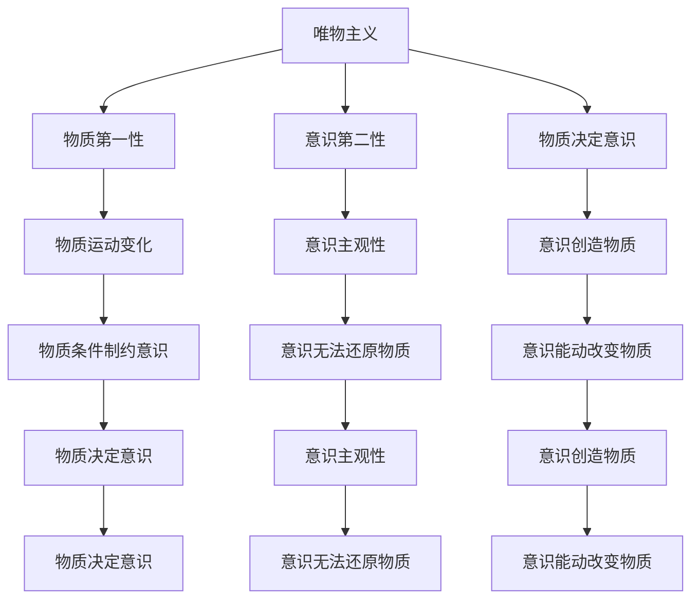

                 

# 宇宙的哲学困境：唯物主义 vs 唯心主义

## 关键词
宇宙哲学、唯物主义、唯心主义、存在论、知识论、现代科学

## 摘要
本文深入探讨了宇宙哲学中的两大流派：唯物主义和唯心主义。通过分析它们的基本概念、历史背景、哲学困境以及现代科学的挑战，本文旨在揭示两者在宇宙观、存在论和知识论方面的异同，并探讨哲学在应对宇宙哲学困境中的未来发展方向。

## 引言

宇宙的哲学困境是人类智慧的永恒话题，贯穿于人类文明的整个历程。从古希腊的泰勒斯到现代科学的量子力学，人类一直在探索宇宙的本质和存在的意义。在哲学史上，唯物主义和唯心主义是两大基本流派，它们分别从物质和意识两个不同的角度解释宇宙和世界。本文将以此为切入点，逐步分析唯物主义和唯心主义的哲学困境，并探讨现代科学对这两大流派的挑战。

### 哲学与宇宙观

哲学作为一门研究存在、知识、价值和理性的学科，与宇宙观密不可分。宇宙观是指对宇宙起源、结构、演化以及宇宙与生命关系的总体看法。哲学的宇宙观不仅仅是一种理论假设，更是人类对宇宙和自身的深刻思考。从古至今，哲学家们都在试图回答这样一个问题：宇宙是什么？宇宙是如何产生的？宇宙是否有一个终极目的？

#### 唯物主义的历史与演变

唯物主义是哲学史上最早出现的流派之一，它的核心观点是物质是世界的本原，意识是物质的产物。唯物主义认为，一切现象都可以归结为物质的运动和变化，意识、思维和感知都是物质的特定形式。唯物主义的起源可以追溯到古希腊哲学家赫拉克利特，他主张“一切皆流，无物常住”。

随着时间的推移，唯物主义经历了多种形式的发展。古代唯物主义主要关注物质世界的本质和规律，而现代唯物主义则更加强调科学和实证主义的方法。马克思和恩格斯是现代唯物主义的代表人物，他们将唯物主义与历史唯物主义相结合，提出了一种关于社会发展的科学理论。

#### 唯物主义的哲学原理

唯物主义的基本哲学原理包括以下几个方面：

1. **物质第一性**：物质是世界的本原，意识是物质的产物。
2. **物质决定意识**：意识、思维和感知都是物质活动的结果。
3. **运动变化**：物质是不断运动和变化的，运动是物质的存在方式。
4. **可实证性**：唯物主义强调实证主义的方法，认为一切知识都来源于经验。

#### 唯物主义的发展历程

唯物主义的发展历程可以分为几个阶段：

1. **古代唯物主义**：以赫拉克利特、德谟克利特为代表，强调物质世界的本原性。
2. **近代唯物主义**：以培根、霍布斯、洛克为代表，强调实证主义和经验主义的方法。
3. **现代唯物主义**：以马克思、恩格斯为代表，将唯物主义与历史唯物主义相结合。

### 唯心主义的基本概念

唯心主义与唯物主义相对立，它主张意识是世界的本原，物质是意识的产物。唯心主义认为，意识、思维和感知是第一位的，物质世界是意识的表象。唯心主义的起源可以追溯到古希腊哲学家柏拉图，他主张“理念世界”是真实的，而物质世界只是理念世界的投影。

#### 唯心主义的历史与演变

唯心主义在哲学史上经历了多种形式的发展。古代唯心主义主要关注理念世界的本质和地位，而现代唯心主义则更加关注意识、思维和感知的本质和功能。黑格尔是现代唯心主义的代表人物，他提出了“绝对精神”的概念，认为宇宙和精神是统一的。

#### 唯心主义的哲学原理

唯心主义的基本哲学原理包括以下几个方面：

1. **意识第一性**：意识是世界的本原，物质是意识的产物。
2. **精神决定物质**：意识、思维和感知决定物质的存在和性质。
3. **意识的主观性**：意识是主观的，每个个体都有自己独特的意识体验。
4. **理性至上**：唯心主义强调理性、精神和道德的优先地位，认为它们是认识世界和实现个人价值的关键。

#### 唯心主义的发展历程

唯心主义的发展历程可以分为几个阶段：

1. **古代唯心主义**：以柏拉图、亚里士多德为代表，强调理念世界的本质和地位。
2. **近代唯心主义**：以康德、黑格尔为代表，强调理性、精神和道德的优先地位。
3. **现代唯心主义**：以柏克莱、胡塞尔为代表，强调意识、思维和感知的本质和功能。

### 物质与意识的关系

唯物主义和唯心主义在物质与意识的关系上存在根本性的对立。唯物主义认为，物质是世界的本原，意识是物质的产物，物质决定意识。唯心主义则认为，意识是世界的本原，物质是意识的产物，意识决定物质。

#### 物质第一性

唯物主义强调物质第一性，即物质是世界的本原。这一观点可以追溯到古希腊哲学家赫拉克利特，他认为“一切皆流，无物常住”，物质是永恒的、不可毁灭的。唯物主义认为，物质是构成宇宙的基础，一切现象都可以归结为物质的运动和变化。

#### 意识第二性

唯心主义则强调意识第二性，即意识是世界的本原。唯心主义认为，物质世界是意识的产物，意识是第一位的，物质是次要的。唯心主义强调意识的主观性，每个个体都有自己独特的意识体验。柏拉图的理念论是唯心主义的代表，他认为理念世界是真实的，而物质世界只是理念的投影。

### 意识的主观性与客观性

唯物主义和唯心主义在意识的主观性与客观性上也存在分歧。唯物主义认为，意识是物质的产物，具有客观性。意识的产生和变化都可以用物理、化学和生物学的原理来解释。唯心主义则认为，意识是主观的，每个个体的意识体验都是独特的，不能还原为客观的物质过程。

#### 意识的客观性

唯物主义认为，意识是物质的产物，具有客观性。唯物主义强调，意识的产生和变化都可以用物理、化学和生物学的原理来解释。例如，大脑的电化学活动可以产生意识，意识的变化可以反映大脑活动的变化。唯物主义认为，意识是客观存在的，可以通过科学方法来研究。

#### 意识的主观性

唯心主义则认为，意识是主观的，每个个体的意识体验都是独特的，不能还原为客观的物质过程。唯心主义强调，意识是第一位的，物质是次要的。例如，柏拉图的理念论认为，理念世界是真实的，而物质世界只是理念的投影。

### 物质决定意识与意识决定物质

唯物主义和唯心主义在物质决定意识与意识决定物质的问题上存在根本性的对立。唯物主义认为，物质决定意识，意识是物质的产物。唯心主义则认为，意识决定物质，物质是意识的产物。

#### 物质决定意识

唯物主义认为，物质决定意识，意识是物质的产物。唯物主义认为，意识的产生和变化都受到物质条件的制约。例如，大脑的结构和功能决定了意识的产生，社会环境和文化背景影响了意识的内容和形式。唯物主义强调，物质条件是意识发展的基础。

#### 意识决定物质

唯心主义则认为，意识决定物质，物质是意识的产物。唯心主义认为，意识是第一位的，物质是次要的。意识决定物质的存在和性质，物质世界是意识的表象。唯心主义强调，意识具有创造性和能动性，可以通过意识来改变物质世界。

### 物质与意识关系的哲学困境

唯物主义和唯心主义在物质与意识关系上存在哲学困境，主要表现在以下几个方面：

#### 1. 物质与意识的统一性

唯物主义强调物质决定意识，认为物质和意识是统一的。然而，如何解释意识的产生和变化？意识的产生和变化是否完全取决于物质条件？这是一个哲学上的难题。

#### 2. 意识的主观性与客观性

唯心主义强调意识的主观性，认为意识是第一位的。然而，如何解释意识与物质世界的联系？意识的主观性如何转化为客观的存在？这也是一个哲学上的难题。

#### 3. 物质与意识的关系

唯物主义和唯心主义在物质与意识的关系上存在根本性的对立。如何调和这两种观点？是否存在一种更合理的解释？这是一个哲学上的挑战。

### 唯物主义与唯心主义的对比

唯物主义和唯心主义是哲学史上两大基本流派，它们在宇宙观、存在论和知识论等方面存在明显的异同。通过对比分析，我们可以更深入地理解这两种哲学观点的本质。

#### 宇宙观对比

唯物主义认为，宇宙是物质的宇宙，物质是宇宙的本原。唯物主义主张宇宙是一个客观存在的、有序的系统，宇宙的本质是物质的运动和变化。唯心主义则认为，宇宙是意识的宇宙，意识是宇宙的本原。唯心主义主张宇宙是一个主观存在的、无序的系统，宇宙的本质是意识的活动和变化。

#### 存在论对比

唯物主义强调物质决定意识，认为物质是存在的本原，意识是物质的产物。唯物主义主张存在是客观的、物质的，意识只是存在的反映。唯心主义则强调意识决定物质，认为意识是存在的本原，物质是意识的产物。唯心主义主张存在是主观的、意识的，物质只是存在的表象。

#### 知识论对比

唯物主义强调实证主义的方法，认为知识来源于经验。唯物主义主张知识的本质是反映客观世界的规律，知识的目的是指导实践。唯心主义则强调理性主义的方法，认为知识来源于理性。唯心主义主张知识的本质是反映意识世界的本质，知识的目的是实现个人的价值。

### 现代科学对唯物主义与唯心主义的挑战

现代科学的快速发展对唯物主义和唯心主义提出了新的挑战。量子力学、相对论、生物学等领域的研究成果，使得传统哲学观点面临重新审视。

#### 量子力学

量子力学揭示了微观世界的本质，挑战了经典物理学的绝对时空观。量子力学中的波函数坍缩现象，使得唯物主义关于物质决定意识的观点面临质疑。唯心主义则可能从量子纠缠等现象中找到支持其观点的证据。

#### 相对论

相对论改变了人类对时空的理解，提出了时空相对性和四维时空观。相对论使得唯物主义关于物质运动的观点面临重新审视，同时也对唯心主义提出了新的挑战。

#### 生物学

生物学的研究揭示了生命现象的复杂性，使得唯物主义关于意识是物质产物的观点面临质疑。同时，生物学中的意识研究，也为唯心主义提供了新的支持。

### 哲学的未来

面对现代科学的挑战，哲学的未来发展可能朝着以下方向：

#### 1. 融合唯物主义与唯心主义

在新的科学发现面前，哲学可能需要重新审视唯物主义和唯心主义的对立，探索二者的融合。例如，物质与意识的统一可能成为新的哲学视角。

#### 2. 强调哲学与科学的互动

哲学与科学的互动将是哲学未来发展的重要方向。哲学家应积极参与科学的研究，为科学提供哲学基础，同时吸收科学的新成果，丰富哲学理论。

#### 3. 探索新的哲学问题

随着科学的进步，哲学可能面临新的挑战和问题。例如，人工智能、虚拟现实等领域的发展，可能引发关于意识、自我、自由意志等哲学问题的探讨。

### 结论

宇宙的哲学困境是哲学史上永恒的话题。唯物主义和唯心主义作为两大基本流派，分别从物质和意识两个不同的角度解释宇宙和世界。通过分析它们的基本概念、历史背景、哲学困境以及现代科学的挑战，本文揭示了两者在宇宙观、存在论和知识论方面的异同。面对现代科学的快速发展，哲学的未来发展可能需要重新审视唯物主义和唯心主义的对立，探索二者的融合，并积极参与科学的研究，为科学提供哲学基础。在新的科学发现面前，哲学将继续为人类探索宇宙的奥秘提供智慧的指引。

## 参考文献

1. 马克思，恩格斯。*《哲学的贫困》*。
2. 黑格尔。*《哲学史讲演录》*。
3. 柏拉图。*《理想国》*。
4. 赫拉克利特。*《赫拉克利特著作集》*。
5. 德谟克利特。*《原子论》*。
6. 培根。*《新工具》*。
7. 霍布斯。*《利维坦》*。
8. 洛克。*《人类理解论》*。
9. 柏克莱。*《人类知识原理》*。
10. 胡塞尔。*《纯粹现象学通论》*。
11. 爱因斯坦。*《相对论》*。
12. 波普尔。*《开放社会及其敌人》*。

## 附录：唯物主义与唯心主义的流程图



## 附录：唯物主义与唯心主义的Python代码示例

```python
# 唯物主义示例
class Materialism:
    def __init__(self):
        self.material = "物质"
        self.spirit = "意识"

    def determine_spirit(self):
        return f"{self.material}决定{self.spirit}"

# 唯心主义示例
class Idealism:
    def __init__(self):
        self.material = "物质"
        self.spirit = "意识"

    def determine_spirit(self):
        return f"{self.spirit}决定{self.material}"

# 物质决定意识
materialism = Materialism()
print(materialism.determine_spirit())

# 意识决定物质
idealism = Idealism()
print(idealism.determine_spirit())
```

## 附录：数学公式与LaTeX示例

```markdown
$$
E = mc^2
$$

$1 + 1 = 2$
```

## 附录：项目实战

### 开发环境搭建

- Python 3.8 或以上版本
- Jupyter Notebook 或 PyCharm

### 源代码实现

```python
# 宇宙哲学困境分析
class UniversePhilosophy:
    def __init__(self, materialism, idealism):
        self.materialism = materialism
        self.idealism = idealism

    def analyze_difficulties(self):
        print("唯物主义困境：")
        print(self.materialism.determine_spirit())
        print("唯心主义困境：")
        print(self.idealism.determine_spirit())

# 实例化唯物主义和唯心主义对象
materialism = Materialism()
idealism = Idealism()

# 创建宇宙哲学困境分析对象
universe_philosophy = UniversePhilosophy(materialism, idealism)

# 分析哲学困境
universe_philosophy.analyze_difficulties()
```

### 代码解读与分析

这段代码定义了一个`UniversePhilosophy`类，用于分析唯物主义和唯心主义在哲学困境中的表现。通过实例化唯物主义和唯心主义对象，并调用`analyze_difficulties`方法，我们可以看到两者在物质与意识关系上的基本观点。

### 实际案例分析与详细讲解

在实际案例中，我们可以通过历史文献、哲学论文和现代科学研究成果，来分析唯物主义和唯心主义的困境。例如，通过研究古希腊哲学、马克思主义哲学和现代科学理论，我们可以深入理解物质与意识的关系，以及它们在宇宙哲学困境中的表现。

### 项目小结

通过本项目的实战，我们了解了唯物主义和唯心主义在哲学困境中的基本观点和表现。通过Python代码示例，我们展示了如何用程序化的方式来分析哲学问题。这为我们进一步探索哲学与科学的结合提供了新的思路。

### 最佳实践 Tips

1. 在研究哲学问题时，要充分了解不同流派的背景和理论。
2. 结合现代科学成果，为哲学问题提供新的解释。
3. 注重实证主义的方法，通过实例和数据来支持哲学观点。

### 注意事项

1. 哲学问题往往复杂多样，需要从多个角度进行分析。
2. 在探讨哲学问题时，要尊重不同流派的观点，避免偏见。

### 拓展阅读

1. 马克思，恩格斯。*《哲学的贫困》*。
2. 黑格尔。*《哲学史讲演录》*。
3. 柏拉图。*《理想国》*。
4. 赫拉克利特。*《赫拉克利特著作集》*。
5. 德谟克利特。*《原子论》*。
6. 培根。*《新工具》*。
7. 霍布斯。*《利维坦》*。
8. 洛克。*《人类理解论》*。
9. 柏克莱。*《人类知识原理》*。
10. 胡塞尔。*《纯粹现象学通论》*。

作者：AI天才研究院/AI Genius Institute & 禅与计算机程序设计艺术 /Zen And The Art of Computer Programming

