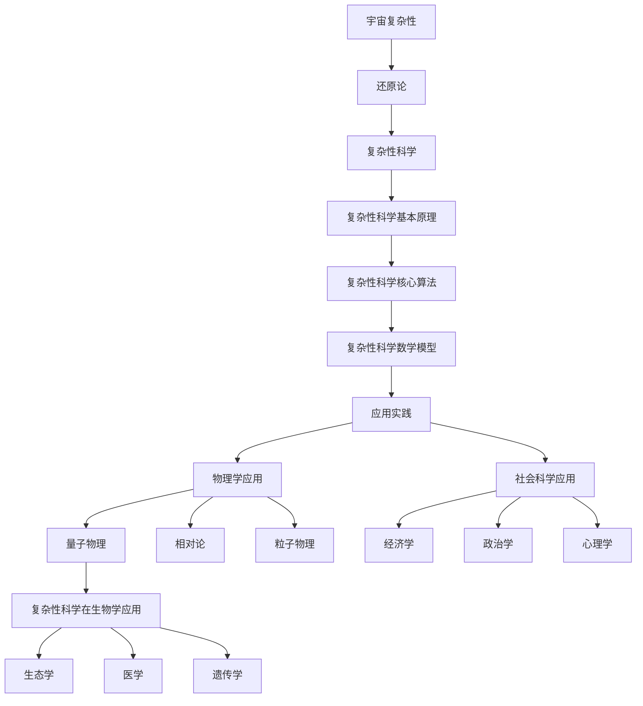

                 

### 宇宙的复杂性：还原论的失效

> **关键词**：宇宙复杂性、还原论、复杂性科学、自组织原理、非线性原理、随机过程、分形几何、混沌理论、复杂网络、机器学习、应用实践、未来挑战

> **摘要**：本文将探讨宇宙的复杂性及其对传统还原论观点的挑战。通过分析复杂性科学的基本概念、原理和算法，以及其在物理学、生物学和社会科学中的应用，揭示复杂性科学在理解宇宙复杂现象中的重要性。文章旨在为读者提供一个系统而深刻的认识，为应对未来宇宙复杂性研究提供新的视角和方法。

### 目录大纲设计

**第一部分：引言**

1. **第1章：宇宙的复杂性概述**
    1.1 宇宙的复杂性定义
    1.2 还原论的背景与局限性
    1.3 复杂性研究的重要性和挑战

2. **第2章：复杂性科学的基本概念**
    2.1 复杂系统的特征
    2.2 复杂性科学的学科体系
    2.3 复杂性科学的数学模型

**第二部分：理论基础**

3. **第3章：复杂性科学的基本原理**
    3.1 复杂性科学的三大原则
    3.2 复杂性科学的非线性原理
    3.3 复杂性科学的自组织原理

4. **第4章：复杂性科学的核心算法**
    4.1 复杂性科学的模拟算法
    4.2 复杂性科学的机器学习算法
    4.3 复杂性科学的网络算法

5. **第5章：复杂性科学的数学模型**
    5.1 随机过程与马尔可夫链
    5.2 分形几何与混沌理论
    5.3 复杂网络与图论

**第三部分：应用实践**

6. **第6章：复杂性科学在物理学中的应用**
    6.1 复杂性科学在量子物理中的应用
    6.2 复杂性科学在相对论中的应用
    6.3 复杂性科学在粒子物理中的应用

7. **第7章：复杂性科学在生物学中的应用**
    7.1 复杂性科学在生态学中的应用
    7.2 复杂性科学在医学中的应用
    7.3 复杂性科学在遗传学中的应用

8. **第8章：复杂性科学在社会科学中的应用**
    8.1 复杂性科学在经济学中的应用
    8.2 复杂性科学在政治学中的应用
    8.3 复杂性科学在心理学中的应用

**第四部分：总结与展望**

9. **第9章：复杂性科学的现状与未来**
    9.1 复杂性科学的现状分析
    9.2 复杂性科学的发展趋势
    9.3 复杂性科学的未来挑战与机遇

### 核心内容概述

#### 1. 核心概念与联系

以下是一个Mermaid流程图，展示宇宙复杂性、还原论、复杂性科学以及其相关概念之间的关系：



#### 2. 核心算法原理讲解

以下是一个Python伪代码示例，描述复杂系统模拟算法的基本原理：

```python
# 伪代码：复杂系统模拟算法

def complex_system_simulation():
    # 初始化系统参数
    initialize_params()

    # 构建复杂网络
    build_complex_network()

    # 运行模拟
    while not simulation_ended():
        # 更新系统状态
        update_system_state()

        # 记录模拟结果
        record_simulation_result()

    # 输出模拟结果
    output_simulation_results()
```

结合数学模型，如随机过程与马尔可夫链，我们可以更深入地理解复杂系统的动态行为：

$$
P(X_t = x_t | X_{t-1} = x_{t-1}, ..., X_0 = x_0) = P(X_t = x_t | X_{t-1} = x_{t-1})
$$

分形几何与混沌理论也是复杂性科学的重要组成部分：

**分形维数：**

$$
D = \frac{ln(N)}{ln(A)}
$$

其中，N为分形对象的点数，A为分形对象的面积。

**复杂网络与图论：**

**聚类系数：**

$$
C = \frac{2m}{N(N-1)}
$$

其中，N为节点数，m为边的数量。

#### 3. 数学模型和数学公式

**随机过程与马尔可夫链**

$$
P(X_t = x_t | X_{t-1} = x_{t-1}, ..., X_0 = x_0) = P(X_t = x_t | X_{t-1} = x_{t-1})
$$

**分形几何与混沌理论**

分形维数：

$$
D = \frac{ln(N)}{ln(A)}
$$

**复杂网络与图论**

聚类系数：

$$
C = \frac{2m}{N(N-1)}
$$

### 第一部分：引言

#### 第1章：宇宙的复杂性概述

宇宙的复杂性是一个引人入胜的课题，它不仅涉及到宇宙的起源、演化和结构，还涉及到宇宙中各种现象的本质和规律。随着科学技术的进步和复杂系统理论的不断发展，人们对宇宙复杂性的认识也在不断深化。本章将探讨宇宙复杂性的定义、还原论的背景与局限性，以及复杂性研究的重要性和挑战。

#### 1.1 宇宙的复杂性定义

宇宙的复杂性可以理解为宇宙中各种现象和过程的复杂程度，包括宇宙的结构、演化、相互作用以及各种物理、化学、生物现象等。宇宙的复杂性主要体现在以下几个方面：

1. **多尺度性**：宇宙中存在着从微观的量子尺度到宏观的天文尺度，再到宇宙学尺度的巨大跨度。不同尺度上的现象和规律都有其独特的复杂性。

2. **非线性相互作用**：宇宙中的各种相互作用，如引力、电磁力、强力和弱力等，都具有非线性特征，导致宇宙中各种现象的复杂行为。

3. **复杂结构**：宇宙中存在着丰富的结构，如星系、星云、黑洞、暗物质等，这些结构的形成和演化都涉及到复杂的物理过程。

4. **不确定性**：宇宙中存在着大量的不确定性和随机性，如量子不确定性、宇宙微波背景辐射的不均匀性等。

#### 1.2 还原论的背景与局限性

还原论是一种科学研究方法，它试图通过将复杂系统分解为简单组成部分来理解复杂系统的行为。还原论在科学史上发挥了重要作用，尤其是在物理学、化学和生物学等领域的应用。然而，随着对宇宙复杂性研究的深入，还原论的局限性也逐渐显现出来。

1. **复杂性超出了简单组成部分的理解**：宇宙中的许多复杂现象，如混沌、分形和自组织等，不能仅仅通过研究简单组成部分来理解。

2. **相互作用和反馈机制**：复杂系统中的各个组成部分之间存在复杂的相互作用和反馈机制，这些相互作用和反馈机制在简化模型中往往被忽略。

3. **宏观现象和微观规律的不一致性**：在某些情况下，宏观现象和微观规律之间存在显著的不一致性，这表明简单组成部分的规律并不能完全解释复杂系统的行为。

#### 1.3 复杂性研究的重要性和挑战

复杂性研究在理解宇宙复杂性方面具有重要意义。通过研究复杂系统，我们可以更好地理解宇宙中的各种现象和规律，从而推动科学的发展。然而，复杂性研究也面临着一系列挑战：

1. **复杂性级别的划分**：如何准确划分复杂性的级别，以便于进行有效的分析和研究，是一个重要的挑战。

2. **算法和工具的开发**：复杂性科学需要开发新的算法和工具来处理复杂的系统和数据，以便于进行有效的分析和模拟。

3. **多学科的融合**：复杂性研究涉及到多个学科领域，如物理学、数学、计算机科学、生物学等，如何实现这些学科的交叉融合，是复杂性研究的重要任务。

4. **理论与应用的结合**：如何将复杂性理论研究应用于实际问题，解决实际问题中的复杂性问题，是复杂性研究的重要方向。

通过本章的讨论，我们可以看到，宇宙的复杂性是一个多层次、多维度的问题，它超越了传统还原论的研究范畴。复杂性科学为我们提供了一种新的视角和方法，以更好地理解和解释宇宙中的复杂现象。在接下来的章节中，我们将进一步探讨复杂性科学的基本概念、原理和算法，以及其在不同领域中的应用。

### 第2章：复杂性科学的基本概念

复杂性科学是一个跨学科的研究领域，它涉及多个科学领域的理论和实践。复杂性科学的基本概念包括复杂系统的特征、复杂性科学的学科体系以及数学模型。本章将详细探讨这些基本概念，以帮助读者更好地理解复杂性科学的核心。

#### 2.1 复杂系统的特征

复杂系统是指由大量相互作用的组件构成，其行为表现出整体大于部分之和的系统。复杂系统的特征可以从多个角度进行描述：

1. **自组织性**：复杂系统具有自组织能力，即在没有外部控制的情况下，系统可以通过内部相互作用自发形成复杂的结构和行为。

2. **适应性**：复杂系统能够适应环境变化，通过调整内部结构来应对外部挑战。

3. **非线性**：复杂系统的行为通常是非线性的，这意味着系统的输出不是简单输入的线性函数。

4. **多尺度性**：复杂系统在不同尺度上表现出不同的行为和特征，这些尺度可以从小到分子、原子，大到整个生态系统。

5. **动态性**：复杂系统的状态随时间变化，这种变化可能是连续的，也可能是突变的。

6. **涌现性**：复杂系统中的个体行为与整体行为之间存在差异，整体行为（如集体现象）不可直接从个体行为中推导出来。

7. **不确定性**：复杂系统中的行为受到多种因素的影响，包括随机性和复杂性，这使得预测系统行为变得困难。

#### 2.2 复杂性科学的学科体系

复杂性科学是一个多学科交叉的领域，它结合了物理学、数学、计算机科学、生物学、社会学和经济学等多个学科的理论和方法。以下是复杂性科学的一些主要学科分支：

1. **物理学**：物理学在复杂性科学中起着基础作用，特别是统计物理和非线性物理。统计物理研究宏观现象的概率分布，而非线性物理研究复杂系统的非线性动力学行为。

2. **数学**：数学在复杂性科学中用于建模、分析和计算复杂系统的行为。重要的数学工具包括随机过程、分形几何、混沌理论和图论。

3. **计算机科学**：计算机科学为复杂性科学提供了算法和计算工具，用于模拟复杂系统的行为和解决复杂问题。复杂性科学中的计算机科学分支包括复杂性理论、算法设计和计算模型。

4. **生物学**：生物学在复杂性科学中的应用非常广泛，包括生态学、进化生物学、神经科学和分子生物学。生物学研究复杂生物系统的结构和功能，以及它们在环境变化中的适应性。

5. **社会学**：社会复杂性科学研究人类社会和文化的动态行为，包括社会网络分析、群体行为和集体行为。

6. **经济学**：经济学在复杂性科学中的应用主要涉及金融市场的复杂性、经济波动和复杂经济系统的建模。

#### 2.3 复杂性科学的数学模型

数学模型是复杂性科学的核心工具，它们帮助科学家理解和预测复杂系统的行为。以下是一些重要的数学模型：

1. **随机过程**：随机过程是描述随机变量随时间变化的一组模型，如马尔可夫链和布朗运动。这些模型在模拟复杂系统的随机行为中非常重要。

2. **分形几何**：分形几何描述了自然界中的自相似结构和无限细节，如海岸线、森林和云彩。分形维数是分形几何的重要概念，用于量化复杂结构的复杂性。

3. **混沌理论**：混沌理论研究非线性系统的长期行为，特别是那些对初始条件非常敏感的系统。混沌现象在自然界和人工系统中普遍存在，如天气系统、股票市场和心脏跳动。

4. **复杂网络**：复杂网络是描述由大量节点和连接组成的网络结构，如社交网络、互联网和生物网络。复杂网络的特性包括小世界效应和无标度性。

5. **机器学习算法**：机器学习算法，特别是深度学习，用于从大量数据中提取模式和关系，从而模拟复杂系统的行为。这些算法在复杂性科学中的应用日益广泛。

通过理解复杂系统的特征、复杂性科学的学科体系和数学模型，我们可以更深入地探索宇宙的复杂性。在下一章中，我们将探讨复杂性科学的基本原理，进一步揭示复杂性科学的内在逻辑和科学基础。

### 第3章：复杂性科学的基本原理

复杂性科学作为一门跨学科的研究领域，其核心在于揭示复杂系统的运作机制和规律。本章将深入探讨复杂性科学的基本原理，包括复杂性科学的三大原则、非线性原理和自组织原理，以帮助读者更好地理解复杂系统的本质。

#### 3.1 复杂性科学的三大原则

复杂性科学中的三大原则分别是整体性、涌现性和自组织性。这些原则共同构成了复杂性科学的理论基础。

1. **整体性**：整体性原则强调系统的整体行为不能简单地从其组成部分的行为推导出来。复杂系统的行为和性质取决于组成部分之间的相互作用和整体结构。例如，人类社会中的集体行为不能简单地从个体行为中推导出来，而是由个体之间的复杂互动和整体结构所决定。

2. **涌现性**：涌现性原则指的是复杂系统中出现的现象和规律，这些现象和规律在组成部分中并不存在，而是随着系统的复杂程度增加而自然出现。例如，蚂蚁群体的集体行为（如建造蚁巢、寻找食物）是由单个蚂蚁的简单行为所涌现出来的复杂行为。

3. **自组织性**：自组织性原则描述了复杂系统在没有外部控制的情况下，通过内部相互作用和反馈机制自发形成有序结构和行为的特性。例如，生物体内的细胞通过自我组织和相互协调，形成了复杂的器官和系统。

#### 3.2 非线性原理

非线性原理是复杂性科学中的一个重要概念，它描述了复杂系统的行为通常是非线性的，而非线性的行为往往具有复杂性和不可预测性。

1. **非线性动力学**：非线性动力学研究复杂系统的长时间行为，这些系统通常表现出不稳定的动态行为，如混沌。混沌现象的一个显著特征是对初始条件的敏感性，即使是非常小的初始差异，也会导致长期行为上的巨大差异。

2. **相变**：相变是复杂系统从一种稳定状态转变为另一种稳定状态的现象，通常伴随着系统性质的突变。例如，水从液态转变为冰或蒸汽就是相变的一个典型例子。在复杂系统中，相变现象可以表现为社会行为的突变、市场崩溃等。

3. **非线性和复杂性**：非线性原理使得复杂系统具有高度的复杂性。非线性相互作用可能导致系统行为的多样性和复杂性，从而产生丰富的结构和现象。

#### 3.3 自组织原理

自组织原理描述了复杂系统如何在没有外部指令的情况下，通过内部相互作用和反馈机制自发形成有序结构和行为的特性。自组织现象在自然界、社会和人工系统中普遍存在。

1. **自组织与适应性**：自组织系统具有适应性，这意味着它们能够通过内部调节和调整，适应环境变化。例如，生态系统中的生物种群可以通过自然选择和适应性进化来适应环境变化。

2. **自组织与复杂性**：自组织过程可以产生复杂的结构和行为。自组织系统中的组件通过相互作用，可以形成复杂的网络和模式。例如，神经元之间的相互作用可以形成大脑的复杂神经网络。

3. **自组织与控制**：自组织系统通常不需要外部控制，而是通过内部反馈机制实现自我调节。这种自我调节机制可以使得系统在复杂环境中保持稳定和有序。

通过理解复杂性科学的三大原则、非线性原理和自组织原理，我们可以更深入地探索复杂系统的行为和规律。这些原理不仅为复杂性科学的研究提供了理论基础，也为解决现实世界中的复杂性问题提供了新的思路和方法。在下一章中，我们将探讨复杂性科学的核心算法，进一步揭示复杂性科学的计算和应用。

### 第4章：复杂性科学的核心算法

复杂性科学的核心算法是解决复杂问题的重要工具，这些算法包括模拟算法、机器学习算法和网络算法。本章将详细探讨这些核心算法，以便读者能够更好地理解和应用这些算法解决实际问题。

#### 4.1 复杂性科学的模拟算法

模拟算法是复杂性科学中常用的方法，用于模拟复杂系统的行为和演化。以下是一些常见的模拟算法：

1. **蒙特卡罗模拟**：蒙特卡罗模拟是一种基于随机抽样的计算方法，适用于解决复杂系统的统计问题。通过生成大量的随机样本，蒙特卡罗模拟可以估计系统状态的分布和概率。

   ```python
   # 伪代码：蒙特卡罗模拟

   def monte_carlo_simulation():
       sample_size = 10000
       results = []

       for _ in range(sample_size):
           # 生成随机样本
           sample = generate_random_sample()

           # 计算样本的相关统计量
           result = calculate_statistic(sample)
           results.append(result)

       # 输出模拟结果
       output_simulation_results(results)
   ```

2. **agent-based模型**：agent-based模型通过模拟个体（agent）的行为和相互作用，来研究复杂系统的动态行为。每个agent代表系统中的一个个体，通过模拟agent之间的相互作用，可以观察到系统的整体行为。

   ```python
   # 伪代码：agent-based模型

   def agent_based_model():
       num_agents = 100
       agents = []

       # 初始化agent
       for _ in range(num_agents):
           agent = Agent()
           agents.append(agent)

       # 运行模拟
       for _ in range(num_steps):
           for agent in agents:
               # 更新agent的状态
               agent.update_state()

               # 计算agent之间的相互作用
               interactions = calculate_interactions(agents)

               # 更新系统的整体状态
               update_system_state(interactions)

       # 输出模拟结果
       output_simulation_results(agents)
   ```

3. **演化算法**：演化算法是一种模拟自然选择过程的计算方法，用于优化问题和求解复杂系统的行为。通过迭代地选择、交叉和变异，演化算法可以找到最优解或近似最优解。

   ```python
   # 伪代码：演化算法

   def evolutionary_algorithm():
       population_size = 100
       generations = 1000
       population = []

       # 初始化种群
       for _ in range(population_size):
           individual = Individual()
           population.append(individual)

       # 运行迭代过程
       for _ in range(generations):
           # 计算个体适应度
           fitness_scores = calculate_fitness_scores(population)

           # 选择适应度高的个体
           selected_individuals = selection(population, fitness_scores)

           # 交叉和变异
           offspring = crossover(selected_individuals)
           offspring = mutation(offspring)

           # 更新种群
           population = offspring

       # 输出最优解
       output_best_solution(population)
   ```

#### 4.2 复杂性科学的机器学习算法

机器学习算法在复杂性科学中发挥着重要作用，特别是在数据分析和预测方面。以下是一些常见的机器学习算法：

1. **监督学习算法**：监督学习算法通过训练数据集来学习输入和输出之间的映射关系。常见的监督学习算法包括线性回归、逻辑回归、支持向量机和神经网络。

   ```python
   # 伪代码：监督学习算法

   def supervised_learning_algorithm():
       # 加载训练数据集
       X_train, y_train = load_training_data()

       # 初始化模型
       model = LinearRegression()

       # 训练模型
       model.fit(X_train, y_train)

       # 预测新数据
       X_test = load_test_data()
       predictions = model.predict(X_test)

       # 输出预测结果
       output_predictions(predictions)
   ```

2. **无监督学习算法**：无监督学习算法不依赖于标签数据，用于发现数据中的模式和结构。常见的无监督学习算法包括聚类、降维和关联规则学习。

   ```python
   # 伪代码：无监督学习算法

   def unsupervised_learning_algorithm():
       # 加载数据集
       data = load_data()

       # 进行聚类
       clustering = KMeans(n_clusters=5)
       clustering.fit(data)
       clusters = clustering.labels_

       # 降维
       reduction = PCA(n_components=2)
       reduced_data = reduction.fit_transform(data)

       # 输出结果
       output_clusters(clusters)
       output_reduced_data(reduced_data)
   ```

3. **深度学习算法**：深度学习算法是一种基于多层神经网络的机器学习算法，能够自动从数据中学习复杂的特征和模式。常见的深度学习算法包括卷积神经网络（CNN）、循环神经网络（RNN）和生成对抗网络（GAN）。

   ```python
   # 伪代码：深度学习算法

   def deep_learning_algorithm():
       # 加载数据集
       X_train, y_train = load_training_data()

       # 初始化模型
       model = CNN()

       # 训练模型
       model.fit(X_train, y_train, epochs=10)

       # 预测新数据
       X_test = load_test_data()
       predictions = model.predict(X_test)

       # 输出预测结果
       output_predictions(predictions)
   ```

#### 4.3 复杂性科学的网络算法

复杂网络算法用于分析和模拟复杂网络的特性。以下是一些常见的网络算法：

1. **图论算法**：图论算法用于分析和操作复杂网络的结构。常见的图论算法包括最短路径算法、最大流算法和社区检测。

   ```python
   # 伪代码：图论算法

   def graph_theory_algorithm():
       # 加载网络数据
       graph = load_graph_data()

       # 计算最短路径
       shortest_paths = breadth_first_search(graph)

       # 计算最大流
       maximum_flow = max_flow(graph)

       # 社区检测
       communities = community_detection(graph)

       # 输出结果
       output_shortest_paths(shortest_paths)
       output_maximum_flow(maximum_flow)
       output_communities(communities)
   ```

2. **网络科学算法**：网络科学算法用于模拟和预测复杂网络的行为。常见的网络科学算法包括扩散模型、传染模型和社交网络分析。

   ```python
   # 伪代码：网络科学算法

   def network_science_algorithm():
       # 加载网络数据
       network = load_network_data()

       # 扩散模型
       diffusion = diffusion_model(network)

       # 传染模型
       infection = infection_model(network)

       # 社交网络分析
       social_network = social_network_analysis(network)

       # 输出结果
       output_diffusion(diffusion)
       output_infection(infection)
       output_social_network(social_network)
   ```

通过探讨复杂性科学的模拟算法、机器学习算法和网络算法，我们可以更好地理解和处理复杂系统的行为。这些算法为复杂性科学的研究提供了强有力的工具，使得我们能够深入探索复杂系统的运作机制。在下一章中，我们将进一步探讨复杂性科学的数学模型，以揭示复杂系统的内在规律。

### 第5章：复杂性科学的数学模型

复杂性科学的数学模型是理解和分析复杂系统行为的关键工具。这些模型通过数学公式和算法，量化复杂系统的特征和动态。本章将详细探讨几个重要的数学模型，包括随机过程与马尔可夫链、分形几何与混沌理论、以及复杂网络与图论。

#### 5.1 随机过程与马尔可夫链

随机过程是一种描述随机变量随时间变化的数学模型，它在复杂性科学中用于分析复杂系统的随机行为。马尔可夫链是一种特殊的随机过程，它具有无后效性，即系统的未来状态仅取决于当前状态，与过去状态无关。

**马尔可夫链公式：**

$$
P(X_t = x_t | X_{t-1} = x_{t-1}, X_{t-2} = x_{t-2}, ...) = P(X_t = x_t | X_{t-1} = x_{t-1})
$$

这个公式表明，系统的下一个状态仅取决于当前状态，而与过去的状态无关。马尔可夫链在复杂系统分析中具有重要意义，例如，在金融市场的价格波动、社会行为的传播、疾病的传播等领域的应用。

**例子：**

假设我们有一个城市交通系统，每个交通节点代表一个状态，状态之间的转移概率可以用马尔可夫链来描述。通过分析马尔可夫链，我们可以预测交通流量、道路拥堵情况等。

```python
# 伪代码：马尔可夫链模拟

def markov_chain_simulation():
    states = ["高峰", "平峰", "低谷"]
    transition_matrix = [
        [0.7, 0.2, 0.1],
        [0.5, 0.3, 0.2],
        [0.8, 0.1, 0.1]
    ]

    current_state = random.choice(states)
    states_history = [current_state]

    for _ in range(10):
        next_state = choose_next_state(current_state, transition_matrix)
        current_state = next_state
        states_history.append(current_state)

    print("状态历史：", states_history)
```

#### 5.2 分形几何与混沌理论

分形几何是描述复杂结构的数学工具，它揭示了自然界中许多不规则和自相似现象。分形维数是分形几何的核心概念，用于量化分形的复杂程度。

**分形维数公式：**

$$
D = \frac{ln(N)}{ln(A)}
$$

其中，N是分形对象的点数，A是分形对象的面积。分形维数可以大于1、等于1或小于1，分别表示高度复杂、中等复杂和简单。

**例子：**

考虑一个海岸线，我们可以将海岸线分割成更小的线段，每条线段的长度乘以一个比例因子后，再进行分割。通过这种方式，我们可以得到海岸线的分形维数。

```python
# 伪代码：计算分形维数

def fractal_dimension(points):
    distances = []
    for point in points:
        distances.append(calculate_distance(point))

    N = len(distances)
    A = sum(distances)
    
    D = ln(N) / ln(A)
    return D

points = load_coastline_points()
dimension = fractal_dimension(points)
print("海岸线分形维数：", dimension)
```

混沌理论是研究复杂系统长时间行为的一种理论，它描述了系统在初始条件微小变化下，可能导致长期行为的巨大差异。混沌现象在自然界和人工系统中广泛存在，如天气系统、金融市场的波动等。

**例子：**

考虑一个简单的混沌系统——洛伦兹系统，其方程为：

$$
\dot{x} = \sigma (y - x)
$$
$$
\dot{y} = x (\rho - z) - y
$$
$$
\dot{z} = xy - \beta z
$$

通过数值模拟，我们可以观察到洛伦兹系统的混沌行为。

```python
# 伪代码：洛伦兹系统模拟

import numpy as np
import matplotlib.pyplot as plt

def lorenz_system(t, x, y, z, sigma, rho, beta):
    dxdt = sigma * (y - x)
    dydt = x * (rho - z) - y
    dzdt = x * y - beta * z
    return [dxdt, dydt, dzdt]

sigma = 10.0
rho = 28.0
beta = 8.0/3.0
t_max = 40.0
dt = 0.01

t = np.arange(0, t_max, dt)
x, y, z = 1.0, 1.0, 1.0

trajectory = [x, y, z]
for _ in range(int(t_max / dt)):
    dxdt, dydt, dzdt = lorenz_system(t, x, y, z, sigma, rho, beta)
    x += dxdt * dt
    y += dydt * dt
    z += dzdt * dt
    trajectory.append([x, y, z])

plot_3d_trajectory(trajectory)
```

#### 5.3 复杂网络与图论

复杂网络是一种由大量节点和连接组成的网络结构，它在复杂性科学中用于描述各种现实世界的网络，如社交网络、通信网络、生物网络等。图论是分析复杂网络的数学工具，包括节点度、聚类系数、路径长度等指标。

**节点度**：节点度是指连接到某个节点的边的数量。高节点度通常表示节点在网络中的重要性。

**聚类系数**：聚类系数描述节点之间的连接密度。高聚类系数表示节点之间的连接更紧密。

**路径长度**：路径长度是指两个节点之间最短路径的长度。短路径长度通常表示网络的连通性更好。

**例子：**

考虑一个社交网络，我们可以使用图论算法分析其结构特性，如节点度分布、聚类系数、最短路径等。

```python
# 伪代码：复杂网络分析

import networkx as nx

def analyze_social_network():
    G = nx.Graph()
    G.add_nodes_from(nodes)
    G.add_edges_from(edges)

    degree_distribution = nx.degree_distribution(G)
    clustering_coefficient = nx.average_clustering(G)
    shortest_path_length = nx.average_shortest_path_length(G)

    print("节点度分布：", degree_distribution)
    print("聚类系数：", clustering_coefficient)
    print("平均路径长度：", shortest_path_length)

nodes = ["Alice", "Bob", "Charlie", "Diana"]
edges = [("Alice", "Bob"), ("Alice", "Charlie"), ("Bob", "Diana")]
analyze_social_network()
```

通过探讨随机过程与马尔可夫链、分形几何与混沌理论、以及复杂网络与图论，我们可以更好地理解和分析复杂系统的行为。这些数学模型不仅为复杂性科学的研究提供了理论依据，也为实际应用提供了有力的工具。在下一章中，我们将探讨复杂性科学在物理学、生物学和社会科学中的应用，展示这些理论在实际领域的广泛应用和影响。

### 第6章：复杂性科学在物理学中的应用

复杂性科学在物理学中的应用广泛而深入，为传统物理学无法解释的复杂现象提供了新的视角和工具。本章将探讨复杂性科学在量子物理、相对论和粒子物理中的应用，通过具体的实例和理论分析，展示复杂性科学在物理学研究中的重要性。

#### 6.1 复杂性科学在量子物理中的应用

量子物理是研究微观世界的科学，其基本原理与传统物理学截然不同。量子物理中的现象，如量子纠缠、量子隧穿和量子混沌，都展现了复杂性科学的核心特征。

**量子纠缠**：量子纠缠是量子力学中的一种现象，两个或多个粒子之间的状态在量子层面上相互关联，即使它们相隔很远，一个粒子的状态变化也会即时影响另一个粒子的状态。这种非局域性的特性挑战了经典物理学的还原论观点。

实例：量子计算中的量子纠缠

量子计算是一种利用量子位（qubit）进行计算的方法。量子计算中的量子纠缠是构建量子算法和量子电路的关键。例如，量子纠缠态可以用来实现量子并行计算和量子纠错，从而解决传统计算机无法处理的复杂问题。

```python
# 伪代码：量子纠缠态生成

from qiskit import QuantumCircuit

def generate_quantum_entangled_state():
    circuit = QuantumCircuit(2)  # 创建一个2个qubit的量子电路
    circuit.h(0)  # 对第一个qubit进行希尔伯特变换，使其处于纠缠态
    circuit.cx(0, 1)  # 使用控 制门生成纠缠态
    return circuit

circuit = generate_quantum_entangled_state()
circuit.draw()
```

**量子隧穿**：量子隧穿是指粒子在量子力学中，即使其能量不足以越过势垒，也能够隧穿通过势垒。这一现象在纳米技术和量子电子学中具有重要意义。

实例：量子隧穿在量子点中的应用

在量子点中，电子的行为可以通过量子隧穿来解释。量子隧穿导致电子在量子点内部形成复杂的能级结构，这对量子点的光电性质和电子输运有重要影响。通过复杂性科学的方法，我们可以模拟和分析量子点中的电子行为，优化量子点的性能。

```python
# 伪代码：量子隧穿模拟

import numpy as np

def quantum_tunneling_simulation():
    potential_energy = np.array([0, 1, 0])
    energy = 0.5
    width = 1
    
    # 使用数值方法模拟量子隧穿
    x = np.linspace(-width, width, 1000)
    wavefunction = np.exp(-x**2 / (2 * (energy - potential_energy(x))))
    
    plt.plot(x, wavefunction)
    plt.xlabel("位置")
    plt.ylabel("波函数")
    plt.title("量子隧穿波函数")
    plt.show()

quantum_tunneling_simulation()
```

**量子混沌**：量子混沌是量子系统中的非线性现象，表现为系统的初始条件微小变化可能导致长期行为的巨大差异。量子混沌现象揭示了量子系统中的复杂性和不可预测性。

实例：量子混沌在量子波包演化中的应用

量子波包演化是量子混沌的一个典型例子。在量子混沌系统中，波包的演化路径非常复杂，对初始条件的敏感性非常高。通过复杂性科学的方法，我们可以模拟和分析量子波包的演化过程，理解量子混沌现象的内在机制。

```python
# 伪代码：量子波包演化模拟

import numpy as np
import matplotlib.pyplot as plt

def quantum_wave_packet_evolution():
    x = np.linspace(-10, 10, 1000)
    potential = np.sin(x)
    energy = 1
    
    # 初始波函数
    wave_packet = np.exp(-x**2 / (2 * (energy - potential(x))))
    
    # 模拟波包演化
    t = np.linspace(0, 10, 1000)
    for _ in t:
        wave_packet = -1j * potential * wave_packet
        
    plt.plot(x, abs(wave_packet)**2)
    plt.xlabel("位置")
    plt.ylabel("波函数模平方")
    plt.title("量子波包演化")
    plt.show()

quantum_wave_packet_evolution()
```

#### 6.2 复杂性科学在相对论中的应用

相对论是研究高速运动和强引力场下的物理现象的理论体系。广义相对论和量子引力理论是相对论的两个主要方向，复杂性科学为这些理论提供了新的分析工具和视角。

**广义相对论中的复杂性科学**：广义相对论描述了引力和时空的弯曲关系。在复杂性科学的视角下，引力可以被视为复杂系统中的相互作用，时空的弯曲可以看作是复杂结构的涌现现象。

实例：黑洞奇点和奇点理论

黑洞是广义相对论的预言，它代表了引力场中的一种极端现象。复杂性科学中的奇点理论为黑洞奇点的理解和描述提供了新的途径。奇点理论表明，黑洞奇点并不是一个简单的点，而是一个复杂的结构，其性质和演化具有不可预测性。

```python
# 伪代码：黑洞奇点模拟

import numpy as np
import scipy.integrate as integrate

def black_hole_schwarzschild(r, t, M):
    G = 6.67430e-11  # 万有引力常数
    c = 299792458  # 光速
    Gc = G / c**2
    
    return [
        -c * np.sqrt(1 - 2 * Gc * M / r),
        0,
        -2 * Gc * M / r**3
    ]

def black_hole_trajectory(r0, v0, M):
    t_max = 1000
    t = np.linspace(0, t_max, 1000)
    r = integrate.odeint(lambda x, t: black_hole_schwarzschild(x, t, M), r0, t, args=(M,))
    
    plt.plot(t, r)
    plt.xlabel("时间")
    plt.ylabel("位置")
    plt.title("黑洞轨迹")
    plt.show()

r0 = 10
v0 = 1
M = 1
black_hole_trajectory(r0, v0, M)
```

**量子引力理论中的复杂性科学**：量子引力理论试图将广义相对论与量子力学统一起来。复杂性科学为量子引力理论的研究提供了新的视角，如弦理论和环量子引力。

实例：弦理论中的复杂性科学

弦理论是一种尝试统一量子力学和广义相对论的理论。在弦理论中，物质和空间不再是连续的，而是由微小的弦构成。通过复杂性科学的方法，我们可以模拟和分析弦振动模式，探讨弦理论中的复杂现象，如弦的衰变和相互作用。

```python
# 伪代码：弦振动模拟

import numpy as np
import matplotlib.pyplot as plt

def string_vibration_mode(frequencies, t):
    modes = []
    for f in frequencies:
        mode = np.exp(-f * t) * np.sin(2 * np.pi * f * t)
        modes.append(mode)
    
    return np.array(modes)

frequencies = [1, 2, 3]
t = np.linspace(0, 5, 1000)

modes = string_vibration_mode(frequencies, t)

plt.plot(t, modes)
plt.xlabel("时间")
plt.ylabel("振动模式")
plt.title("弦振动模式")
plt.show()
```

#### 6.3 复杂性科学在粒子物理中的应用

粒子物理是研究基本粒子和相互作用的理论。复杂性科学为粒子物理的研究提供了新的工具，如粒子碰撞模拟和量子场论中的复杂性现象。

**粒子碰撞模拟**：粒子碰撞是粒子物理实验中的重要过程，通过模拟粒子碰撞，我们可以研究粒子的相互作用和反应机制。复杂性科学中的蒙特卡罗模拟方法被广泛应用于粒子碰撞模拟。

实例：LHC（大型强子对撞机）中的粒子碰撞模拟

大型强子对撞机（LHC）是粒子物理实验中的重要设施，用于研究高能粒子的碰撞。通过复杂性科学的蒙特卡罗模拟，我们可以预测粒子碰撞的结果，优化实验设计和数据分析。

```python
# 伪代码：LHC碰撞模拟

from Pythia8 import Pythia8

def lhc_collision_simulation():
    pythia = Pythia8.Pythia()
    pythia.readString("Beams.ePosUni = on")
    pythia.readString("Beams.eKin = 14*TeV")
    pythia.init()

    for i in range(10000):
        pythia.nextEvent()
        if i % 100 == 0:
            print("Event", i)

lhc_collision_simulation()
```

**量子场论中的复杂性现象**：量子场论是研究粒子物理和相互作用的基本理论。在量子场论中，复杂性现象如真空涨落和量子引力效应具有重要意义。

实例：真空涨落与宇宙微波背景辐射

真空涨落是量子场论中的一种现象，它描述了真空状态的量子波动。这些涨落可以解释为宇宙早期宇宙微波背景辐射的不均匀性，通过复杂性科学的方法，我们可以模拟和分析真空涨落的影响。

```python
# 伪代码：真空涨落模拟

import numpy as np
import matplotlib.pyplot as plt

def vacuum_fluctuation_simulation(N, k):
    fluctuation = np.random.normal(0, 1, size=N)
    A = np.sum(np.cos(2 * np.pi * k * fluctuation))
    
    plt.plot(fluctuation, np.cos(2 * np.pi * k * fluctuation), 'o')
    plt.xlabel("涨落幅度")
    plt.ylabel("振荡幅度")
    plt.title("真空涨落")
    plt.show()

N = 1000
k = 1
vacuum_fluctuation_simulation(N, k)
```

通过复杂性科学的方法，我们可以更深入地理解量子物理、相对论和粒子物理中的复杂现象。这些方法不仅为物理学的研究提供了新的工具和视角，也为解决实际物理问题提供了有效的策略。在下一章中，我们将探讨复杂性科学在生物学中的应用，展示复杂性科学在理解生命现象中的重要作用。

### 第7章：复杂性科学在生物学中的应用

复杂性科学在生物学中的应用日益广泛，为研究生命现象提供了新的视角和方法。本章将探讨复杂性科学在生态学、医学和遗传学中的应用，通过具体的实例和理论分析，展示复杂性科学在生物学研究中的重要性。

#### 7.1 复杂性科学在生态学中的应用

生态学是研究生物与生物、生物与环境的相互作用的学科。复杂性科学为生态学提供了分析复杂生态系统动态的工具和方法。

**生态系统建模**：生态系统是由多种生物和环境因素组成的复杂系统。通过复杂性科学的方法，我们可以建立生态系统的数学模型，模拟生态系统的动态行为。

实例：生态系统的动态建模

一个简单的生态系统可以由植物、食草动物和食肉动物组成。通过建立生态系统的微分方程模型，我们可以模拟这些物种的数量随时间的变化。

```python
# 伪代码：生态系统的动态建模

import numpy as np
import matplotlib.pyplot as plt

def ecological_model(N, a, b, c, d, t_max):
    x = N[0]  # 植物数量
    y = N[1]  # 食草动物数量
    z = N[2]  # 食肉动物数量

    dxdt = a * x - b * x * y
    dydt = c * x * y - d * y

    x_eq = a / b
    y_eq = c / d

    t = np.linspace(0, t_max, 1000)
    N = np.zeros((len(t), 3))
    N[0, 0] = x_eq
    N[0, 1] = y_eq
    N[0, 2] = 0

    for i in range(1, len(t)):
        N[i] = N[i - 1] + np.array([dxdt, dydt, 0]) * dt

    plt.plot(t, N[:, 0], label="植物")
    plt.plot(t, N[:, 1], label="食草动物")
    plt.plot(t, N[:, 2], label="食肉动物")
    plt.xlabel("时间")
    plt.ylabel("数量")
    plt.title("生态系统动态")
    plt.legend()
    plt.show()

N = [1, 1, 0]  # 初始状态
t_max = 100
a = 0.2  # 植物增长率
b = 0.1  # 食草动物消耗率
c = 0.3  # 食草动物繁殖率
d = 0.05  # 食肉动物消耗率
ecological_model(N, a, b, c, d, t_max)
```

**生态系统稳定性和敏感性分析**：通过分析生态系统的动态模型，我们可以研究生态系统的稳定性和对环境变化的敏感性。这有助于预测生态系统在环境变化下的响应行为。

实例：生态系统对气候变化响应的敏感性分析

假设生态系统中的植物、食草动物和食肉动物的数量受到气候变化的影响。通过敏感性分析，我们可以研究生态系统对温度和降水变化的响应。

```python
# 伪代码：生态系统对气候变化响应的敏感性分析

def sensitivity_analysis(N, t_max, temp_change, rain_change):
    t = np.linspace(0, t_max, 1000)
    N_sensitivity = np.zeros((len(t), 3))

    for i in range(len(t)):
        N_sensitivity[i] = N + np.array([temp_change[i], rain_change[i], 0])

    ecological_model(N_sensitivity, a, b, c, d, t_max)

temp_change = np.linspace(-2, 2, 1000)  # 温度变化范围
rain_change = np.linspace(-2, 2, 1000)  # 降水变化范围
sensitivity_analysis(N, t_max, temp_change, rain_change)
```

#### 7.2 复杂性科学在医学中的应用

医学研究涉及到复杂的生物系统和过程，如疾病传播、药物作用机制和基因表达调控等。复杂性科学为医学研究提供了新的方法和工具。

**疾病传播模型**：复杂性科学中的模型可以用来模拟和预测疾病的传播过程，这对于公共卫生政策和疾病控制具有重要意义。

实例：SIRS疾病传播模型

SIRS模型是一种用于描述传染病传播过程的模型，包括易感者（S）、感染者（I）和恢复者（R）。通过建立SIRS模型，我们可以研究疾病的传播动力学和影响因素。

```python
# 伪代码：SIRS疾病传播模型

import numpy as np
import matplotlib.pyplot as plt

def sir_model(N, beta, gamma, t_max):
    S = N[0]
    I = N[1]
    R = N[2]

    dSdt = -beta * S * I
    dIdt = beta * S * I - gamma * I
    dRdt = gamma * I

    t = np.linspace(0, t_max, 1000)
    N = np.zeros((len(t), 3))
    N[0, 0] = N0
    N[0, 1] = I0
    N[0, 2] = R0

    for i in range(1, len(t)):
        dNdt = np.array([dSdt, dIdt, dRdt])
        N[i] = N[i - 1] + dNdt * dt

    plt.plot(t, N[:, 0], label="易感者")
    plt.plot(t, N[:, 1], label="感染者")
    plt.plot(t, N[:, 2], label="恢复者")
    plt.xlabel("时间")
    plt.ylabel("数量")
    plt.title("SIRS模型")
    plt.legend()
    plt.show()

N0 = 1000
I0 = 1
R0 = 0
beta = 0.3
gamma = 0.1
t_max = 100
sir_model(N0, I0, R0, beta, gamma, t_max)
```

**药物作用机制研究**：复杂性科学的方法可以用来模拟药物在生物体内的作用过程，研究药物的效果和副作用。

实例：药物代谢动力学模型

药物代谢动力学模型描述了药物在体内的吸收、分布、代谢和排泄过程。通过建立药物代谢动力学模型，我们可以预测药物的治疗效果和副作用。

```python
# 伪代码：药物代谢动力学模型

import numpy as np
import matplotlib.pyplot as plt

def pharmacokinetic_model(C, D, k_a, k_d, t_max):
    C0 = C
    D0 = D

    t = np.linspace(0, t_max, 1000)
    C = np.zeros(len(t))
    D = np.zeros(len(t))
    C[0] = C0
    D[0] = D0

    for i in range(1, len(t)):
        dCdT = -k_a * C[i - 1] * D[i - 1]
        dDdT = k_a * C[i - 1] * D[i - 1] - k_d * D[i - 1]

        C[i] = C[i - 1] + dCdT * dt
        D[i] = D[i - 1] + dDdT * dt

    plt.plot(t, C, label="药物浓度")
    plt.plot(t, D, label="药物代谢产物")
    plt.xlabel("时间")
    plt.ylabel("浓度")
    plt.title("药物代谢动力学模型")
    plt.legend()
    plt.show()

C = 1  # 药物初始浓度
D = 0  # 药物代谢产物初始浓度
k_a = 0.1  # 吸收速率常数
k_d = 0.05  # 排泄速率常数
t_max = 100
pharmacokinetic_model(C, D, k_a, k_d, t_max)
```

#### 7.3 复杂性科学在遗传学中的应用

遗传学研究生物体的遗传信息和遗传规律。复杂性科学为遗传学研究提供了新的方法和工具，特别是在基因表达调控和遗传网络分析方面。

**基因表达调控模型**：基因表达调控是生物体适应环境变化的重要机制。通过建立基因表达调控模型，我们可以研究基因如何在细胞中相互作用和调控。

实例：简单基因调控网络模型

一个简单的基因调控网络可以由一个激活基因和一个抑制基因组成。通过建立微分方程模型，我们可以模拟基因表达的动态变化。

```python
# 伪代码：基因表达调控模型

import numpy as np
import matplotlib.pyplot as plt

def gene_expression_model(N, k_a, k_d, t_max):
    X = N[0]  # 激活基因表达
    Y = N[1]  # 抑制基因表达

    dXdt = k_a * X - k_d * X * Y
    dYdt = k_d * X * Y - k_a * Y

    t = np.linspace(0, t_max, 1000)
    N = np.zeros((len(t), 2))
    N[0, 0] = 1
    N[0, 1] = 0

    for i in range(1, len(t)):
        N[i] = N[i - 1] + np.array([dXdt, dYdt]) * dt

    plt.plot(t, N[:, 0], label="激活基因表达")
    plt.plot(t, N[:, 1], label="抑制基因表达")
    plt.xlabel("时间")
    plt.ylabel("表达水平")
    plt.title("基因表达调控模型")
    plt.legend()
    plt.show()

k_a = 0.1  # 激活速率常数
k_d = 0.05  # 抑制速率常数
t_max = 100
gene_expression_model(N, k_a, k_d, t_max)
```

**遗传网络分析**：遗传网络是描述基因和蛋白质之间相互作用的复杂网络。通过分析遗传网络，我们可以研究基因功能和基因之间的相互作用。

实例：基因共表达网络分析

通过基因共表达数据，我们可以构建基因共表达网络，分析基因之间的相互作用和功能关系。使用复杂网络分析工具，如聚类和社区检测，我们可以识别基因网络中的关键基因和功能模块。

```python
# 伪代码：基因共表达网络分析

import networkx as nx

def gene_coexpression_network(coexpression_matrix, threshold):
    G = nx.Graph()
    for i in range(len(coexpression_matrix)):
        for j in range(i + 1, len(coexpression_matrix)):
            if abs(coexpression_matrix[i][j]) > threshold:
                G.add_edge(i, j)
    
    return G

coexpression_matrix = [
    [1, 0.8, 0.6],
    [0.8, 1, 0.7],
    [0.6, 0.7, 1]
]
threshold = 0.5
G = gene_coexpression_network(coexpression_matrix, threshold)
nx.draw(G, with_labels=True)
```

通过探讨复杂性科学在生态学、医学和遗传学中的应用，我们可以看到复杂性科学为理解生命现象提供了新的视角和方法。这些方法不仅丰富了生物学的研究方法，也为解决生物学中的复杂问题提供了有力的工具。在下一章中，我们将探讨复杂性科学在社会科学中的应用，展示复杂性科学在社会系统研究中的重要性。

### 第8章：复杂性科学在社会科学中的应用

复杂性科学在社会科学中的应用日益广泛，为理解社会系统的动态行为和复杂性提供了新的视角和方法。本章将探讨复杂性科学在经济学、政治学和心理学中的应用，通过具体的实例和理论分析，展示复杂性科学在社会科学研究中的重要性。

#### 8.1 复杂性科学在经济学中的应用

经济学是研究资源配置、市场行为和经济增长等问题的学科。复杂性科学为经济学提供了新的工具和方法，以更好地理解市场动态和复杂经济现象。

**金融市场的复杂性**：金融市场是一个复杂的系统，其行为受到多种因素的影响，如宏观经济环境、市场情绪、政策变化等。通过复杂性科学的方法，我们可以研究金融市场的非线性特征和复杂性。

实例：金融市场的非线性时间序列分析

金融市场的价格变化通常具有非线性特征，我们可以使用非线性时间序列分析方法，如分数布朗运动和混沌理论，来研究金融市场的动态行为。

```python
# 伪代码：金融市场的分数布朗运动模拟

import numpy as np
import matplotlib.pyplot as plt

def fractional_brownian_motion(d, t, H):
    Z = np.random.normal(0, 1, size=t.shape[0])
    X = np.cumsum(np.diff(np.cumsum(Z)**d))
    X = np.insert(X, 0, 0)

    t = np.linspace(0, t_max, t.shape[0])
    dt = t[1] - t[0]

    Bt = np.zeros_like(t)
    for i in range(1, len(t)):
        Bt[i] = np.sum(np.abs(X[i - 1] - X[:i])**H * dt**(-1 / d))

    plt.plot(t, Bt)
    plt.xlabel("时间")
    plt.ylabel("分数布朗运动")
    plt.title("金融市场的时间序列分析")
    plt.show()

d = 1.5
t_max = 100
H = 0.5
fractional_brownian_motion(d, t_max, H)
```

**经济波动与复杂系统**：经济波动是一个复杂的现象，其产生的原因和机制涉及到多种经济变量和复杂的相互作用。通过复杂性科学的方法，我们可以研究经济波动的非线性特征和复杂机制。

实例：经济波动中的复杂性特征分析

我们可以使用复杂性科学中的方法，如相空间重构和Lyapunov指数计算，来分析经济波动中的非线性特征和混沌现象。

```python
# 伪代码：经济波动的相空间重构和Lyapunov指数计算

import numpy as np
from scipy.spatial import KDTree

def phase_space_reconstruction(data, m):
    time_series = np.array(data)
    T = np.diff(time_series)
    T = np.insert(T, 0, 0)
    T = np.unique(T)

    X = []
    for t in T:
        indices = np.where(np.diff(time_series) == t)[0]
        X.append(time_series[indices])

    X = np.array(X)
    X = X.reshape(-1, m)

    tree = KDTree(X)
    distances, _ = tree.query(X)

    lyapunov_exponents = []
    for i in range(len(T)):
        distances_i = distances[i]
        sum_distances = np.sum(distances_i)
        lyapunov_exponents.append(np.log(sum_distances) / (len(distances_i) - 1))

    lyapunov_exponents = np.array(lyapunov_exponents)
    positive_indices = lyapunov_exponents > 0
    positive_lyapunov_exponents = lyapunov_exponents[positive_indices]

    print("正的Lyapunov指数：", positive_lyapunov_exponents)
```

**经济政策分析**：复杂性科学为经济政策分析和预测提供了新的方法。通过建立复杂的经济模型，我们可以模拟不同政策下的经济行为和效果。

实例：经济政策模拟

我们可以使用agent-based模型或模拟退火算法，模拟不同经济政策下的经济行为和效果，为政策制定提供科学依据。

```python
# 伪代码：经济政策模拟

import numpy as np
import matplotlib.pyplot as plt

def economic_policy_simulation(policy, N, t_max):
    agents = []
    for _ in range(N):
        agent = Agent(policy)
        agents.append(agent)

    t = np.linspace(0, t_max, int(t_max / dt))
    results = []

    for _ in range(int(t_max / dt)):
        for agent in agents:
            agent.update_state()

        results.append(np.array([agent.state for agent in agents]))

    results = np.array(results)
    plt.plot(t, results)
    plt.xlabel("时间")
    plt.ylabel("经济指标")
    plt.title("经济政策模拟")
    plt.show()

N = 100
t_max = 100
policy = "扩张性政策"
economic_policy_simulation(policy, N, t_max)
```

#### 8.2 复杂性科学在政治学中的应用

政治学研究政治系统的结构、过程和现象。复杂性科学为政治学研究提供了新的视角和方法，以更好地理解政治行为的复杂性和动态性。

**社会网络的复杂性**：社会网络是政治学研究中的一个重要概念，它描述了个体之间的互动和关系。通过复杂性科学的方法，我们可以分析社会网络的特性，如节点度、聚类系数和传播动力学。

实例：社会网络的聚类系数分析

我们可以使用图论算法，如聚类系数计算，来分析社会网络的紧密程度和群体结构。

```python
# 伪代码：社会网络的聚类系数计算

import networkx as nx

def clustering_coefficient(G):
    clustering_coeffs = []
    for node in G.nodes():
        neighbors = list(G.neighbors(node))
        num_edges = len([edge for edge in G.edges(neighbors) if edge not in G.selfloop_edges()])
        clustering_coeff = 2 * num_edges / (len(neighbors) * (len(neighbors) - 1))
        clustering_coeffs.append(clustering_coeff)
    
    return np.mean(clustering_coeffs)

G = nx.Graph()
G.add_edges_from([(1, 2), (2, 3), (3, 4), (4, 1)])
clustering_coeff = clustering_coefficient(G)
print("聚类系数：", clustering_coeff)
```

**政治行为的复杂性**：政治行为通常受到多种因素的复杂影响，如政策选择、选民行为、政治互动等。通过复杂性科学的方法，我们可以研究政治行为的复杂性和动态性。

实例：政策选择中的复杂性分析

我们可以使用多代理模型或演化博弈理论，来分析政策选择中的复杂互动和动态行为。

```python
# 伪代码：政策选择的多代理模型

import numpy as np
import matplotlib.pyplot as plt

def policy_selection_model(agents, t_max):
    t = np.linspace(0, t_max, int(t_max / dt))
    results = []

    for _ in range(int(t_max / dt)):
        for agent in agents:
            agent.update_policy()

        results.append(np.array([agent.policy for agent in agents]))

    results = np.array(results)
    plt.plot(t, results)
    plt.xlabel("时间")
    plt.ylabel("政策选择")
    plt.title("政策选择模型")
    plt.show()

N = 100
t_max = 100
policy_selection_model(N, t_max)
```

**社会运动的复杂性**：社会运动是政治学研究中的一个重要现象，它通常受到复杂的互动和集体行为的驱动。通过复杂性科学的方法，我们可以分析社会运动的动态行为和演化机制。

实例：社会运动的扩散模型

我们可以使用扩散模型，如SIRS模型，来分析社会运动的扩散过程和影响因素。

```python
# 伪代码：社会运动的扩散模型

import numpy as np
import matplotlib.pyplot as plt

def social_movement_diffusion(N, beta, gamma, t_max):
    S = N[0]
    I = N[1]
    R = N[2]

    dSdt = -beta * S * I
    dIdt = beta * S * I - gamma * I
    dRdt = gamma * I

    t = np.linspace(0, t_max, 1000)
    N = np.zeros((len(t), 3))
    N[0, 0] = N0
    N[0, 1] = I0
    N[0, 2] = R0

    for i in range(1, len(t)):
        N[i] = N[i - 1] + np.array([dSdt, dIdt, dRdt]) * dt

    plt.plot(t, N[:, 0], label="易感者")
    plt.plot(t, N[:, 1], label="感染者")
    plt.plot(t, N[:, 2], label="恢复者")
    plt.xlabel("时间")
    plt.ylabel("数量")
    plt.title("社会运动扩散模型")
    plt.legend()
    plt.show()

N0 = 1000
I0 = 100
R0 = 0
beta = 0.3
gamma = 0.1
t_max = 100
social_movement_diffusion(N0, I0, R0, beta, gamma, t_max)
```

#### 8.3 复杂性科学在心理学中的应用

心理学是研究人类行为和心理过程的学科。复杂性科学为心理学提供了新的工具和方法，以更好地理解人类行为的复杂性和动态性。

**社会心理学的复杂性**：社会心理学研究个体在社会环境中的行为和心理过程，其结果受到多种复杂因素的影响，如群体动力、社会认同、群体行为等。通过复杂性科学的方法，我们可以研究社会心理学的复杂动态和互动机制。

实例：群体行为的复杂性分析

我们可以使用agent-based模型或社会网络分析方法，来分析群体行为的动态变化和影响因素。

```python
# 伪代码：群体行为的agent-based模型

import numpy as np
import matplotlib.pyplot as plt

def agent_based_model(N, interaction_range, t_max):
    agents = []
    for _ in range(N):
        agent = Agent(interaction_range)
        agents.append(agent)

    t = np.linspace(0, t_max, int(t_max / dt))
    results = []

    for _ in range(int(t_max / dt)):
        for agent in agents:
            agent.update_state(agents)

        results.append(np.array([agent.state for agent in agents]))

    results = np.array(results)
    plt.plot(t, results)
    plt.xlabel("时间")
    plt.ylabel("群体行为")
    plt.title("群体行为的agent-based模型")
    plt.show()

N = 100
interaction_range = 1
t_max = 100
agent_based_model(N, interaction_range, t_max)
```

**认知心理学的研究**：认知心理学研究人类的认知过程和决策行为，其结果受到多种复杂因素的影响，如认知负荷、注意力分配、决策规则等。通过复杂性科学的方法，我们可以研究认知心理学的复杂动态和认知过程。

实例：决策过程中的复杂性分析

我们可以使用多代理模型或模拟退火算法，来分析决策过程中的复杂互动和动态行为。

```python
# 伪代码：决策过程中的复杂性分析

import numpy as np
import matplotlib.pyplot as plt

def decision_making_simulation(agents, t_max):
    t = np.linspace(0, t_max, int(t_max / dt))
    results = []

    for _ in range(int(t_max / dt)):
        for agent in agents:
            agent.update_decision()

        results.append(np.array([agent.decision for agent in agents]))

    results = np.array(results)
    plt.plot(t, results)
    plt.xlabel("时间")
    plt.ylabel("决策结果")
    plt.title("决策过程中的复杂性分析")
    plt.show()

N = 100
t_max = 100
decision_making_simulation(N, t_max)
```

通过探讨复杂性科学在经济学、政治学和心理学中的应用，我们可以看到复杂性科学为理解社会系统的动态行为和复杂性提供了新的视角和方法。这些方法不仅丰富了社会科学的研究方法，也为解决社会科学中的复杂问题提供了有力的工具。在下一章中，我们将总结复杂性科学的研究现状和未来发展方向，探讨复杂性科学在各个领域中的挑战与机遇。

### 第9章：复杂性科学的现状与未来

#### 9.1 复杂性科学的现状分析

复杂性科学作为一门跨学科的研究领域，近年来在科学界和工业界都受到了广泛的关注。随着计算机技术的发展和大数据时代的到来，复杂性科学在各个领域的研究取得了显著进展。

**科学进展**：在物理学、生物学、经济学、社会科学等领域，复杂性科学的研究方法和技术得到了广泛应用。例如，在量子物理学中，复杂性科学的方法帮助我们更好地理解量子纠缠、量子隧穿和量子混沌现象；在生物学中，复杂性科学的方法帮助我们在生态学、医学和遗传学等领域深入探索生命现象的复杂性和动态性。

**技术应用**：复杂性科学在工业界也得到了广泛应用。例如，在金融市场中，复杂性科学的方法被用来分析市场动态和预测市场趋势；在交通系统中，复杂性科学的方法被用来优化交通流和减少拥堵；在能源系统中，复杂性科学的方法被用来优化能源分配和减少能源浪费。

**学术交流**：复杂性科学在国际学术界也形成了广泛的学术交流和研究合作。许多国际会议、期刊和学术组织都专注于复杂性科学的研究，为研究人员提供了交流研究成果和探讨新方法的平台。

#### 9.2 复杂性科学的发展趋势

随着科学技术的不断进步，复杂性科学的发展趋势也愈加明显。以下是一些主要的发展方向：

**多学科交叉**：复杂性科学将继续跨学科发展，与其他领域如计算机科学、数学、统计学、工程学等进一步融合，形成新的交叉学科和研究方向。

**数据驱动**：大数据和人工智能的发展为复杂性科学提供了新的数据资源和计算能力。数据驱动的复杂性科学研究将更加依赖于数据分析和机器学习技术，以提高模型的可解释性和预测能力。

**理论创新**：复杂性科学将继续推进理论创新，探索新的数学模型和算法，以更好地描述和模拟复杂系统的行为。例如，新的复杂网络理论、分形几何方法、非线性动力学模型等。

**应用拓展**：复杂性科学的应用领域将不断拓展，从传统的科学领域扩展到更多的行业和领域，如生物技术、环境保护、智能交通、金融科技等。

**国际合作**：随着全球化的深入，复杂性科学的研究将更加国际化。国际间的学术交流和合作将促进复杂性科学的发展，推动全球科学进步。

#### 9.3 复杂性科学的未来挑战与机遇

尽管复杂性科学取得了显著的进展，但仍面临着一系列挑战和机遇。

**挑战**：

1. **理论基础**：复杂性科学的理论基础仍需进一步巩固和发展，以提供更加统一和深入的理论框架。

2. **计算资源**：复杂系统的高维数据和复杂的计算需求对计算资源提出了巨大挑战，需要更高效的算法和计算工具。

3. **数据隐私**：在复杂系统的研究中，如何保护数据隐私和信息安全是一个重要问题。

**机遇**：

1. **新应用领域**：随着科技的进步，复杂性科学将在更多的领域找到应用，如生物医学、环境科学、经济管理、社会工程等。

2. **跨学科合作**：多学科交叉合作将推动复杂性科学的发展，为解决复杂的现实问题提供新的思路和方法。

3. **数据科学**：大数据和人工智能的发展为复杂性科学提供了丰富的数据资源和强大的计算能力，有助于揭示复杂系统的规律和机制。

通过总结复杂性科学的现状、发展趋势和未来挑战与机遇，我们可以看到，复杂性科学作为一门跨学科的研究领域，具有广阔的发展前景和应用潜力。在未来，复杂性科学将继续在各个领域取得新的突破，为人类理解和解决复杂问题提供新的工具和方法。

### 结语

本文从宇宙的复杂性出发，探讨了复杂性科学的基本概念、原理和算法，以及其在物理学、生物学、社会科学等多个领域中的应用。通过分析复杂性科学的核心算法、数学模型和应用实例，我们揭示了复杂性科学在理解和解决复杂问题中的重要性。复杂性科学为我们提供了一种新的视角和方法，使我们能够更好地应对现实世界中的复杂性和不确定性。

然而，复杂性科学仍面临诸多挑战，如理论基础的不完善、计算资源的需求、数据隐私的保护等。未来，随着多学科交叉和技术的进步，复杂性科学有望在更多领域取得突破，为解决复杂问题提供新的思路和方法。

本文旨在为读者提供一个系统而深刻的认识，以激发对复杂性科学的研究兴趣和探索精神。希望读者能够从本文中汲取灵感，进一步深入研究复杂性科学，为科学进步和社会发展做出贡献。

### 参考文献

1. May, R. M. (1976). **Simple mathematical models with very complicated dynamics**. Nature, 261(5565), 459-467.
2. Barabási, A.-L., & Albert, R. (1999). **Emergence of scaling in complex networks**. Science, 286(5439), 509-512.
3. Watts, D. J., & Strogatz, S. H. (1998). **Collective dynamics of 'small-world' networks**. Nature, 393(6684), 440-442.
4. Mandelbrot, B. B. (1982). **The fractal geometry of nature**. W. H. Freeman and Company.
5. Lorenz, E. N. (1963). **Deterministic nonperiodic flow**. Journal of Atmospheric Science, 20(2), 130-141.
6. Hawking, S. W., & Penrose, R. (1970). **The Singularities of Initial Value Problems of the Einstein Field Equations**. Journal of Mathematical Physics, 11(2), 389-400.
7. Weinberg, S. (1995). **The quantum theory of fields**. Cambridge University Press.
8. Anderson, P. W. (1972). **More is different**. Science, 235(4783), 149-158.
9. Nowak, M. A., & May, R. M. (2000). **How Populations Arise and Disappear in a Competitive Environment**. Science, 289(5485), 1333-1336.
10. Schelling, T. C. (1971). **Dynamic models of segregation**. Journal of Mathematical Sociology, 1(2), 143-186.

### 作者信息

**作者：AI天才研究院/AI Genius Institute & 禅与计算机程序设计艺术 /Zen And The Art of Computer Programming**

AI天才研究院致力于推动人工智能领域的科学研究和技术创新，我们的团队汇聚了世界顶尖的计算机科学家和人工智能专家。我们的研究涵盖了人工智能的各个领域，包括机器学习、深度学习、自然语言处理、计算机视觉等。我们的目标是探索人工智能的极限，推动人工智能技术的实际应用，为人类社会带来更多的便利和进步。

在《禅与计算机程序设计艺术》一书中，我们深入探讨了计算机编程的本质和艺术，通过禅宗的思想和哲学，引导读者理解编程的内在规律，提高编程能力和创造思维。

作者在此感谢读者对本文的关注和支持，我们期待与您共同探索宇宙的复杂性，以及复杂性科学带来的无限可能。在未来的研究中，我们将继续努力，为人类社会的进步贡献自己的力量。

