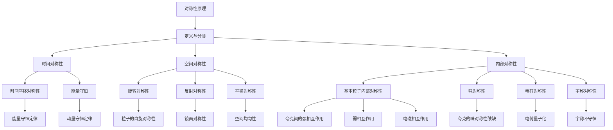

                 

### 引言

**关键词**: 宇宙对称性、物理定律、根源

在物理学的长河中，宇宙对称性一直是研究的关键主题之一。对称性，作为一种基本的结构特征，不仅在艺术和设计中具有重要意义，而且在物理科学中扮演了核心角色。从宇宙的宏观结构到微观粒子的性质，对称性无处不在，为我们理解自然界的法则提供了深刻的洞见。

宇宙对称性之所以重要，首先是因为它揭示了物理定律的根源。许多物理定律，如能量守恒定律和动量守恒定律，本质上是对称性的体现。例如，能量守恒定律可以看作是对时间平移对称性的反映，而动量守恒定律则与空间平移对称性密切相关。

本文旨在探讨宇宙对称性的基本概念、其在物理定律中的作用，以及对称性在不同物理领域的具体应用。我们首先将从对称性的定义和分类入手，接着深入探讨宇宙时空对称性和内部对称性，并分析对称性在物理学中的应用。最后，我们将展望对称性原理的未来发展方向，总结其对物理学的深远影响。

通过这篇文章，读者将能够理解对称性在宇宙中的重要性，以及它如何帮助我们揭示自然界的奥秘。

### 摘要

本文将探讨宇宙对称性在物理定律根源中的关键作用。首先，我们将介绍对称性的基本概念和分类，包括时间对称性、空间对称性和内部对称性。接着，我们将详细分析宇宙时空对称性，如爱因斯坦相对论中的时空对称性，以及宇宙早期时空对称性的破缺。随后，本文将探讨宇宙内部对称性，特别是基本粒子的内部对称性，以及标准模型中的对称性破缺。在分析对称性在物理学中的应用后，我们将展望对称性原理的未来发展，总结对称性在物理学中的重要性和深远影响。

### 第1章 引言

#### 1.1 宇宙对称性的重要性

宇宙对称性是物理学中一个极为重要的概念，它在多个领域中都扮演了关键角色。首先，宇宙对称性揭示了自然界的深层次结构，使我们能够理解物理定律的根本原理。在物理学中，对称性不仅是一种美学上的概念，它更是联系不同物理现象和定律的桥梁。

一个典型的例子是能量守恒定律。能量守恒定律指出，在一个封闭系统中，能量总量保持不变。这一现象可以从时间平移对称性中得到解释。如果系统在不同的时间点具有相同的物理状态，那么能量的总和也应该保持不变。这意味着时间对称性是能量守恒定律的基础。

同样，动量守恒定律也与空间平移对称性密切相关。动量守恒定律表明，在没有外力作用的情况下，系统的总动量保持不变。这是因为空间平移对称性意味着系统在空间中的任何位置都应该表现出相同的物理行为。

此外，对称性还在粒子物理学中发挥着重要作用。标准模型中的许多相互作用，如电磁相互作用、强相互作用和弱相互作用，都基于对称性原理。例如，电磁相互作用基于U(1)对称性，强相互作用基于SU(3)对称性，而弱相互作用则基于SU(2)对称性。

总之，宇宙对称性在物理学中具有重要意义，它不仅帮助我们理解自然界的根本原理，还为发现新的物理现象和理论提供了指导。通过深入探讨对称性，我们能够揭示宇宙的深层奥秘，进一步推进物理学的发展。

#### 1.2 本书的结构与目标

本书旨在系统性地探讨宇宙对称性在物理定律中的核心地位和深远影响。为了达到这一目标，本书分为七个主要章节，每个章节都有其独特的主题和内容。

**第一章**主要介绍宇宙对称性的基本概念和重要性，以及本书的结构和目标。通过这一章，读者将初步了解对称性在物理学中的关键作用。

**第二章**将深入探讨对称性原理，包括对称性的定义、分类、数学表述及其与守恒定律的关系。这一章为后续章节的分析提供了理论基础。

**第三章**将分析宇宙的时空对称性，重点讨论爱因斯坦相对论中的时空对称性以及宇宙学中的对称性破缺现象。这部分内容将帮助读者理解时空对称性在宇宙演化中的角色。

**第四章**将探讨宇宙的内部对称性，特别是基本粒子的内部对称性以及标准模型中的对称性破缺。这一章将揭示粒子物理中的深层次对称性原理。

**第五章**将分析对称性在物理学中的应用，包括粒子物理实验、量子场论和宇宙学中的对称性应用。这部分内容将展示对称性如何在实际物理研究中发挥作用。

**第六章**将展望对称性原理的未来发展，探讨对称性在粒子物理学、量子引力和宇宙学中的新研究方向。这一章将为读者提供对称性研究的广阔前景。

**第七章**将对全文进行总结，回顾宇宙对称性在物理定律中的关键作用，以及对称性对物理学的深远影响。这一章将为读者提供对全书内容的整体理解和思考。

通过这七个章节的深入探讨，本书旨在帮助读者全面理解宇宙对称性的重要性，以及它如何推动物理学的发展。

#### 1.3 对称性与物理定律的关联

对称性与物理定律之间存在着深刻的内在联系。首先，从基本概念上讲，对称性指的是物理系统在某种变换下保持不变的性质。这种变换可以是空间的平移、旋转、时间上的平移，也可以是内部对称性，如粒子的自旋对称性。物理定律则是对自然界规律的高度抽象和概括。

对称性与物理定律的关联可以从几个方面来理解。首先，许多物理定律本质上是基于对称性的。例如，能量守恒定律反映了时间平移对称性，即系统在任意时刻的物理状态相同，能量总和应保持不变。同样，动量守恒定律基于空间平移对称性，在没有外力作用下，系统的总动量保持不变。

其次，对称性提供了寻找物理定律的指导原则。在物理学的早期发展过程中，科学家们通过观察和实验，发现了自然界中存在多种对称性。这些对称性为建立新的物理理论提供了方向。例如，在粒子物理学中，基本相互作用（如电磁相互作用、强相互作用和弱相互作用）都是基于对称性原理的。电磁相互作用基于U(1)对称性，强相互作用基于SU(3)对称性，弱相互作用基于SU(2)对称性。

此外，对称性在理论物理学中还具有破缺现象。在量子场论中，对称性破缺是指物理系统在低能或宏观尺度上不表现出完全对称性。例如，在温升到绝对零度时，电磁相互作用中的U(1)对称性会在低温下破缺，形成电荷和弱相互作用的混合。这种对称性破缺为我们理解物质的微观结构和宏观现象提供了新的视角。

最后，对称性在实验验证中也扮演了关键角色。许多物理实验都是基于对称性原理设计的，例如在粒子物理实验中，通过对称性破缺的探测，科学家们发现了新的物理现象和粒子。此外，对称性破缺的实验验证也推动了理论物理学的进步。

总之，对称性与物理定律之间的关联是物理学中的一个核心问题。对称性不仅为我们理解自然界的规律提供了基本框架，还指导了新的物理理论和实验的发展。通过深入探讨对称性原理，我们能够更好地揭示物理定律的根源，推动物理学不断向前发展。

### 第2章 对称性原理

#### 2.1 对称性的定义

对称性是物理学中的一个基本概念，它描述了一个系统在某种变换下保持不变的性质。具体来说，如果一个系统在某个变换下，其外观、状态或特性没有发生改变，那么这个系统就具有对称性。这种变换可以是几何变换、时间变换或内部变换等。

几何对称性通常涉及空间中的旋转、反射和平移等操作。例如，一个正方形具有旋转对称性，因为无论如何旋转，其形状和面积都保持不变。而一个镜面对称的物体，如一个手镜，则具有反射对称性，因为通过镜面对称操作，物体的左侧和右侧相互对称。

时间对称性则是指系统在不同时间点具有相同的物理状态。例如，一个理想的摆钟在每次摆动周期内都回到相同的位置和速度，因此它具有时间对称性。

内部对称性则涉及到粒子的内部结构或性质。例如，一个电子具有自旋对称性，因为它的自旋方向在物理上没有区别。此外，许多基本粒子和相互作用也具有复杂的内部对称性，这些对称性在粒子物理学中起着关键作用。

#### 2.2 对称性与守恒定律

对称性与守恒定律之间存在深刻的联系。在物理学中，许多守恒定律，如能量守恒定律、动量守恒定律和角动量守恒定律，都是对称性的体现。

能量守恒定律是指在一个封闭系统中，总能量保持不变。这一现象可以从时间平移对称性中得到解释。如果系统在任意两个不同时间点的物理状态相同，那么能量总和也应保持不变。这意味着，时间平移对称性是能量守恒定律的基础。

动量守恒定律则与空间平移对称性密切相关。在一个不受外力作用的系统中，总动量保持不变。这是因为空间平移对称性意味着系统在空间中的任何位置都应该表现出相同的物理行为。例如，在无重力环境中，一个物体从地球表面移动到太空中，其动量保持不变。

角动量守恒定律也与对称性有关。在一个没有外力矩作用的系统中，总角动量保持不变。角动量守恒定律可以看作是对旋转对称性的反映。如果一个系统在任何旋转下都保持不变，那么其总角动量也应该保持不变。

此外，还有其他许多守恒定律，如电荷守恒定律、线性动量守恒定律和线性角动量守恒定律，它们也都是对称性的体现。这些守恒定律在物理学中起着核心作用，帮助我们理解自然界的各种现象。

#### 2.3 对称性的数学表述

对称性的数学表述主要涉及群论和表示论。群论是研究对称性变换的数学工具，而表示论则用于描述物理系统在群作用下的行为。

首先，群论中的基本概念包括群、子群、同态和同构。群是一个集合，其中元素之间满足结合律、单位元和逆元的性质。子群是群的一个子集，它本身也是一个群。同态和同构则描述了两个群之间的映射关系。

在物理系统中，群论用于描述对称性操作。例如，一个物理系统可能具有旋转对称性，这意味着它可以进行旋转操作。旋转群（通常表示为SO(3)）是一个三维旋转的对称性群，它包含了所有可能的三维旋转操作。

表示论则用于描述物理系统在群作用下的行为。表示是一个群到线性变换之间的映射，它描述了群作用在物理系统上的效果。在量子物理学中，表示论尤为重要，因为它用于描述粒子态在群作用下的变换。

例如，在量子力学中，粒子的态可以用一个态向量表示。当粒子受到旋转操作时，态向量会根据旋转群的一个表示进行变换。这种变换可以由一个矩阵表示，这个矩阵称为表示矩阵。表示论为我们提供了一个工具，用于计算粒子在不同对称性变换下的状态。

总之，对称性的数学表述通过群论和表示论提供了对物理系统对称性的精确描述。这些数学工具不仅帮助我们理解对称性的本质，还为研究新的物理现象提供了理论框架。

#### 2.4 对称性的分类

对称性可以根据其性质和表现形式进行分类，主要包括时间对称性、空间对称性和内部对称性。每种对称性类型在物理学中都有其独特的应用和重要性。

**时间对称性**指的是物理系统在不同时间点具有相同的物理状态。时间对称性最直观的例子是周期性系统，如振动的钟摆或旋转的轮子。在这些系统中，每个周期都重复相同的物理状态。时间平移对称性是所有守恒定律的基础，如能量守恒定律和动量守恒定律。时间平移对称性还体现了时间进阶的均匀性，这是经典物理学和广义相对论中的一个核心假设。

**空间对称性**涉及物理系统在空间中某个操作下保持不变的性质。空间对称性包括旋转对称性、反射对称性和平移对称性。旋转对称性是指系统可以绕某个轴旋转而不改变其外观或性质。例如，一个完美的球体具有无限多的旋转对称轴。反射对称性则是指系统在经过镜面反射后保持不变。一个典型的例子是一个手镜，它在镜面对称后看起来没有任何变化。平移对称性指的是系统在空间中平移一定距离后保持不变。在无重力环境中，一个物体从一个位置移动到另一个位置，其物理状态不会发生改变。

**内部对称性**涉及物理系统的内部结构或组成粒子的对称性。内部对称性在粒子物理学中尤为重要，因为基本粒子的性质往往与其内部对称性有关。例如，电子具有自旋对称性，因为其自旋方向在物理上没有区别。内部对称性还涉及到基本相互作用，如电磁相互作用、强相互作用和弱相互作用。电磁相互作用基于U(1)对称性，强相互作用基于SU(3)对称性，而弱相互作用基于SU(2)对称性。这些内部对称性是标准模型的基础，对理解基本粒子和相互作用具有重要意义。

总的来说，时间对称性、空间对称性和内部对称性都是物理学中不可或缺的概念。它们不仅帮助我们理解物理系统的行为，还为探索新的物理现象提供了理论基础。通过对这些对称性的分类和深入探讨，我们能够更好地理解自然界的深层次结构和规律。

#### 2.4.1 时空对称性

时空对称性是物理学中一个极其重要的概念，它涉及到时间和空间结构的相对不变性。时空对称性在爱因斯坦的相对论理论中得到了深刻的阐述，特别是在他的特殊相对论和广义相对论中。

在特殊相对论中，爱因斯坦提出了时间平移对称性和空间平移对称性。时间平移对称性指的是一个物理系统在任意两个不同时间点具有相同的物理状态。这意味着系统的总能量在不同时间点上保持不变。这一对称性是能量守恒定律的基础。空间平移对称性则是指一个物理系统在空间中的任意位置都应该表现出相同的物理行为。在没有外力作用的情况下，系统的总动量保持不变，这体现了动量守恒定律。

广义相对论进一步扩展了时空对称性的概念。广义相对论认为，引力是由质量和能量对时空结构造成的弯曲引起的。在这种理论框架下，时空不再是固定不变的背景，而是与物质和能量紧密相关的动态结构。广义相对论提出了时空的平移对称性和旋转对称性。平移对称性指的是系统在空间中平移后保持不变，而旋转对称性指的是系统绕某个轴旋转后保持不变。

在宇宙学中，时空对称性的研究尤为重要。例如，宇宙背景微波辐射（CMB）是宇宙早期状态的残余辐射，它提供了关于宇宙初始条件的重要信息。CMB的温度分布表现出极高的对称性，这表明在宇宙早期，时空对称性非常强烈。宇宙膨胀理论和大爆炸理论都基于时空对称性，认为宇宙从一个极小、极热、极密的状态开始膨胀。

此外，时空对称性的破缺也是物理学研究的一个重要方向。在低能尺度上，许多物理现象并不完全遵循时空对称性。例如，电磁相互作用中的U(1)对称性在低温下破缺，导致电磁相互作用和弱相互作用的混合。这种对称性破缺为我们理解物质的微观结构和宏观现象提供了新的视角。

总之，时空对称性在物理学中具有核心地位，它不仅揭示了自然界的深层次结构，还为理论物理学和实验物理学提供了重要的研究工具。通过深入探讨时空对称性，我们能够更好地理解宇宙的演化规律，推动物理学的发展。

#### 2.4.2 内部对称性

内部对称性是指物理系统的内部结构或组成粒子的对称性，这种对称性在粒子物理学中尤为显著。内部对称性不仅影响了粒子的性质，还决定了基本相互作用的形式。以下是几种主要的内部对称性：

**电弱对称性**：在粒子物理学中，电弱相互作用是电磁相互作用和弱相互作用的统称。电弱对称性描述了这两种相互作用的统一框架。在电弱统一理论中，基本粒子是通过称为W和Z玻色子的介子相互作用来实现电磁相互作用和弱相互作用的。这种对称性在粒子物理学的标准模型中体现为SU(2)群，它描述了弱相互作用的对称性。然而，在低能尺度上，这种对称性会破缺，导致电磁相互作用和弱相互作用在实验中表现出不同的性质。

**强相互作用对称性**：强相互作用主要由胶子实现，其对称性在粒子物理学中体现为SU(3)群。这种对称性描述了夸克之间的强相互作用，是量子色动力学（QCD）的基础。QCD的对称性在解释强子（如质子和中子）的形成和性质中起到了关键作用。

**味对称性**：味对称性描述了不同味（或类型）的夸克之间的相互作用。在标准模型中，有六种不同的夸克味：上、下、奇、粲、底和顶。味对称性反映了这些味之间的等价性。然而，实验观测表明，味对称性在低能尺度上也会破缺，例如粲夸克和底夸克的质量显著大于上、下和奇夸克。

**宇称对称性**：宇称对称性是指粒子和其反粒子的物理性质相同。宇称守恒定律曾是物理学中的一个核心假设，但后来发现，弱相互作用可以破坏宇称对称性，这在宇称不守恒的实验中得到了验证。

**自旋对称性**：自旋对称性描述了粒子的自旋方向在物理上没有区别。例如，电子具有自旋对称性，因为其自旋方向的变化不会影响其物理性质。

内部对称性在粒子物理学中具有深远的影响。首先，它为标准模型提供了理论基础，使我们能够解释和预测基本粒子和相互作用的行为。其次，内部对称性破缺的研究为我们揭示了物质在不同能量尺度上的行为差异。通过研究内部对称性，我们能够更好地理解基本相互作用和物质的结构，为探索新物理现象提供线索。

总之，内部对称性是粒子物理学中不可或缺的概念，它不仅揭示了基本粒子和相互作用的基本规律，还为我们探索宇宙的奥秘提供了重要的理论工具。

#### 2.4.3 对称性的数学表述

对称性的数学表述主要依赖于群论和表示论，这两者为我们提供了精确描述物理系统对称性的工具。

**群论**：群论是研究集合及其运算的数学分支，特别适用于描述对称性。在物理学中，群论被用来描述各种对称性操作，如旋转、反射和平移。一个群是由一组元素组成的集合，这些元素满足结合律、单位元和逆元的性质。例如，旋转群（SO(3)）描述了三维空间中的旋转操作，而离散群（如Z2）描述了反射操作。

在物理系统中，群论用于描述对称性操作。例如，一个物理系统可能具有旋转对称性，这意味着它可以进行旋转操作。旋转群（通常表示为SO(3)）是一个三维旋转的对称性群，它包含了所有可能的三维旋转操作。

**表示论**：表示论是研究群或代数在向量空间上的表示的数学分支。在物理系统中，表示论用于描述物理系统在群作用下的行为。一个表示是一个群到线性变换之间的映射，它描述了群作用在物理系统上的效果。在量子物理学中，表示论尤为重要，因为它用于描述粒子态在群作用下的变换。

例如，在量子力学中，粒子的态可以用一个态向量表示。当粒子受到旋转操作时，态向量会根据旋转群的一个表示进行变换。这种变换可以由一个矩阵表示，这个矩阵称为表示矩阵。表示论为我们提供了一个工具，用于计算粒子在不同对称性变换下的状态。

**表示论的关键概念**包括：

- **表示**：一个群或代数在向量空间上的表示。
- **表示矩阵**：描述群或代数元素在向量空间上作用的矩阵。
- **表示空间**：表示的所有可能向量构成的向量空间。

在量子物理学中，表示论用于计算粒子的能级、态的变换和物理量的测量结果。例如，通过分析粒子的态在旋转操作下的变换，我们可以确定粒子的自旋量子数。

**应用示例**：

假设一个物理系统具有旋转对称性，我们可以使用旋转群SO(3)来描述其对称性。一个简单的应用示例是计算一个电子在旋转操作下的状态。电子的自旋量子数为1/2，因此其态向量可以表示为|↑⟩和|↓⟩，分别表示自旋向上和自旋向下。

当电子绕z轴旋转θ度时，其状态会通过旋转群的一个表示矩阵R(θ)进行变换：

$$ R(\theta) = \begin{pmatrix}
\cos(\theta/2) & -e^{i\theta}\sin(\theta/2) \\
e^{-i\theta}\sin(\theta/2) & \cos(\theta/2)
\end{pmatrix} $$

如果初始状态为|↑⟩，旋转后的状态为：

$$ |ψ'(θ)⟩ = R(θ)|↑⟩ = \begin{pmatrix}
\cos(\theta/2) & -e^{i\theta}\sin(\theta/2) \\
e^{-i\theta}\sin(\theta/2) & \cos(\theta/2)
\end{pmatrix}
\begin{pmatrix}
1 \\
0
\end{pmatrix} = \begin{pmatrix}
\cos(\theta/2) \\
-e^{-i\theta}\sin(\theta/2)
\end{pmatrix} $$

通过这种方式，我们可以使用群论和表示论来精确描述物理系统的对称性，从而更好地理解其行为。

#### 2.4.4 对称性的分类

对称性可以根据其性质和表现形式进行分类，主要包括时间对称性、空间对称性和内部对称性。每种对称性类型在物理学中都有其独特的应用和重要性。

**时间对称性**指的是物理系统在不同时间点具有相同的物理状态。时间对称性最直观的例子是周期性系统，如振动的钟摆或旋转的轮子。在这些系统中，每个周期都重复相同的物理状态。时间平移对称性是所有守恒定律的基础，如能量守恒定律和动量守恒定律。时间平移对称性还体现了时间进阶的均匀性，这是经典物理学和广义相对论中的一个核心假设。

**空间对称性**涉及物理系统在空间中某个操作下保持不变的性质。空间对称性包括旋转对称性、反射对称性和平移对称性。旋转对称性是指系统可以绕某个轴旋转而不改变其外观或性质。例如，一个完美的球体具有无限多的旋转对称轴。反射对称性则是指系统在经过镜面反射后保持不变。一个典型的例子是一个手镜，它在镜面对称后看起来没有任何变化。平移对称性指的是系统在空间中平移一定距离后保持不变。在无重力环境中，一个物体从一个位置移动到另一个位置，其物理状态不会发生改变。

**内部对称性**涉及物理系统的内部结构或组成粒子的对称性。内部对称性在粒子物理学中尤为重要，因为基本粒子的性质往往与其内部对称性有关。例如，电子具有自旋对称性，因为其自旋方向在物理上没有区别。内部对称性还涉及到基本相互作用，如电磁相互作用、强相互作用和弱相互作用。电磁相互作用基于U(1)对称性，强相互作用基于SU(3)对称性，而弱相互作用基于SU(2)对称性。这些内部对称性是标准模型的基础，对理解基本粒子和相互作用具有重要意义。

总的来说，时间对称性、空间对称性和内部对称性都是物理学中不可或缺的概念。它们不仅帮助我们理解物理系统的行为，还为探索新的物理现象提供了理论基础。通过对这些对称性的分类和深入探讨，我们能够更好地理解自然界的深层次结构和规律。

### 第3章 宇宙的时空对称性

#### 3.1 爱因斯坦相对论与时空对称性

爱因斯坦的相对论理论对时空对称性的理解产生了深远影响，特别是他的特殊相对论和广义相对论。在特殊相对论中，爱因斯坦提出了时空相对性的概念，这意味着时间和空间不是绝对的、独立的实体，而是相互关联的。这一理论的核心在于光速不变原理，即光在真空中的速度是恒定的，不依赖于观察者的运动状态。

**特殊相对论中的时空对称性**：

- **时间平移对称性**：特殊相对论中的时间平移对称性是指，如果系统在不同时间点具有相同的物理状态，那么总能量应保持不变。这意味着时间可以看作是一个连续的、均匀流动的量，不依赖于观察者的状态。
- **空间平移对称性**：空间平移对称性则表明，在没有外力作用下，系统的总动量保持不变。这意味着系统在空间中的任意位置都应该表现出相同的物理行为。

**广义相对论中的时空对称性**：

广义相对论进一步扩展了时空对称性的概念。广义相对论认为，引力是由质量和能量对时空结构造成的弯曲引起的。在这种理论框架下，时空不再是固定不变的背景，而是与物质和能量紧密相关的动态结构。

- **时空弯曲**：广义相对论中的时空弯曲是对称性的一种破缺。根据广义相对论，质量会扭曲周围的时空，使得物体的运动轨迹发生变化。这种时空弯曲体现了时空对称性的破缺，因为物体的运动不再遵循简单的平移和旋转对称性。
- **旋转对称性**：广义相对论中的旋转对称性是指系统在绕某个轴旋转后保持不变。这种对称性在引力理论和宇宙学中具有重要意义，因为宇宙的整体结构可能在某种旋转对称性下保持平衡。

**时空对称性在宇宙学中的应用**：

时空对称性在宇宙学中有着广泛的应用，特别是在宇宙膨胀理论和大爆炸理论中。

- **宇宙膨胀**：宇宙膨胀理论表明，宇宙在大爆炸发生后一直在膨胀。这种膨胀过程遵循哈勃定律，即宇宙的膨胀速率与距离成正比。宇宙膨胀理论可以看作是对时间平移对称性的体现，因为宇宙在不同时间点的状态是相同的。
- **大爆炸理论**：大爆炸理论认为，宇宙起源于一个极小、极热、极密的状态，随后开始膨胀。大爆炸理论中的宇宙背景微波辐射（CMB）是宇宙早期状态的残余辐射，它提供了关于宇宙初始条件的重要信息。CMB的温度分布表现出极高的对称性，这表明在宇宙早期，时空对称性非常强烈。

总之，爱因斯坦的相对论理论为我们提供了对时空对称性的深刻理解。时空对称性不仅揭示了物理定律的根源，还为我们研究宇宙的演化和结构提供了重要的理论框架。通过对时空对称性的深入研究，我们能够更好地理解宇宙的本质，推进物理学的发展。

#### 3.2 时空对称性与宇宙学

时空对称性在宇宙学中扮演了至关重要的角色，特别是在宇宙的早期阶段和宇宙背景微波辐射（CMB）的观测中。宇宙学中的时空对称性不仅揭示了宇宙的初始状态，还为我们理解宇宙的演化和结构提供了重要的线索。

**宇宙早期时空对称性**：

在宇宙的大爆炸理论中，宇宙起源于一个极小、极热、极密的状态。在这个早期阶段，宇宙的时空结构具有高度的对称性。这种对称性主要表现为：

- **时空平移对称性**：在宇宙的早期，时空是均匀且各向同性的，这意味着宇宙在任何位置和时间点都具有相同的物理状态。这种时空平移对称性保证了宇宙在各个方向上的均匀性和各向同性。
- **宇称对称性**：宇称对称性指的是物理系统在空间反演下保持不变的性质。在宇宙的早期阶段，宇称对称性非常强，这表明宇宙没有明显的左右之分。

**宇宙背景微波辐射**：

宇宙背景微波辐射（CMB）是宇宙大爆炸后留下的残余辐射，它为我们提供了关于宇宙早期状态的直接观测证据。CMB的温度分布表现出极高的对称性，这进一步支持了宇宙早期时空对称性的存在。

- **各向同性**：CMB的温度在各个方向上几乎相同，这表明宇宙在早期阶段是各向同性的。这种各向同性是时空平移对称性的体现，因为宇宙在任何方向上都应该表现出相同的物理状态。
- **极小温度波动**：CMB的温度波动非常微小，这反映了宇宙早期的不均匀性。然而，这些波动是均匀且各向同性的，这意味着它们是随机产生的，而不是由某个特定的初始不均匀性引起的。

**对称性的破缺**：

尽管宇宙在早期具有高度的时空对称性，但对称性在宇宙的演化过程中逐渐破缺。这种破缺导致了宇宙的不均匀性和结构形成。

- **时间对称性的破缺**：随着时间的推移，宇宙开始膨胀，这种膨胀过程破坏了时间对称性。宇宙的不同区域开始独立演化，导致时间上的不对称性。
- **空间对称性的破缺**：宇宙的膨胀和结构形成过程中，空间对称性也逐渐破缺。例如，宇宙中的星系和星系团开始形成，这些结构打破了原有的空间均匀性和各向同性。

**结论**：

时空对称性在宇宙学中具有重要意义，它不仅揭示了宇宙的初始状态，还为我们理解宇宙的演化和结构提供了关键线索。通过对宇宙背景微波辐射的观测，我们能够验证和探索宇宙早期时空对称性的存在和破缺。这些研究不仅深化了我们对宇宙的认识，也为探索更高层次的物理理论奠定了基础。

### 第4章 宇宙的内部对称性

#### 4.1 基本粒子的内部对称性

在宇宙的微观世界中，基本粒子的内部对称性起着至关重要的作用。这些对称性不仅决定了粒子的基本性质，还揭示了基本相互作用之间的深层联系。以下是几种主要的基本粒子的内部对称性：

**自旋对称性**：自旋是基本粒子的一种内禀属性，它描述了粒子在空间中的取向。例如，电子具有自旋1/2，这意味着它在空间中可以有两种可能的取向，通常表示为“向上”或“向下”。自旋对称性在量子力学中有着重要的应用，它决定了粒子的磁矩和角动量。

**味对称性**：味对称性描述了不同类型的夸克之间的相互作用。在标准模型中，存在六种不同的味：上（u）、下（d）、奇（s）、粲（c）、底（b）和顶（t）。味对称性反映了这些味之间的等价性。然而，实验表明，味对称性在低能尺度上会破缺，导致不同味夸克的质量和相互作用强度有所不同。

**电荷对称性**：电荷对称性是指粒子电荷在物理上没有区别。在标准模型中，电荷是量子化的，基本粒子的电荷通常是整数倍的基本电荷（即电子的电荷）。电荷对称性是电磁相互作用的基础，它保证了电磁力的统一和可预测性。

**宇称对称性**：宇称对称性描述了物理系统在空间反演下保持不变的性质。在弱相互作用中，宇称不守恒，这是宇称不守恒实验的重要发现。然而，在电磁相互作用和强相互作用中，宇称对称性通常被保持。

**对称性的破缺**：

尽管基本粒子具有多种内部对称性，但这些对称性在低能尺度上通常会破缺。破缺对称性导致了粒子质量和相互作用的差异，这是粒子物理研究中的一个重要课题。

- **味对称性破缺**：实验表明，不同味的夸克质量差异很大。这种差异主要来源于味对称性的破缺。例如，粲夸克的质量显著大于上、下和奇夸克，这表明味对称性在低能尺度上不是完全守恒的。
- **电荷对称性破缺**：在粒子碰撞实验中，电荷对称性也会破缺。例如，在电子-正电子湮灭过程中，产生的粒子的电荷分布并不均匀，这表明电荷对称性不是在所有情况下都保持的。

**内部对称性在标准模型中的应用**：

内部对称性在标准模型中起着核心作用。标准模型描述了基本粒子及其相互作用，它基于多种对称性原理，如U(1)、SU(2)和SU(3)。这些对称性不仅解释了粒子的性质，还预言了新的物理现象。

- **电磁相互作用**：电磁相互作用基于U(1)对称性，它描述了带电粒子之间的相互作用。这种对称性保证了电荷的量子化和电磁力的统一。
- **强相互作用**：强相互作用基于SU(3)对称性，也称为量子色动力学（QCD）。这种对称性描述了夸克之间的强相互作用，是物质结构的重要组成部分。
- **弱相互作用**：弱相互作用基于SU(2)对称性，它描述了W和Z玻色子的相互作用。这种对称性是粒子物理学中最重要的对称性之一，它解释了弱相互作用的许多特性。

总之，基本粒子的内部对称性在粒子物理学中具有深远的影响。通过对内部对称性的研究，我们能够更好地理解基本粒子和相互作用的基本规律，揭示宇宙的微观奥秘。

#### 4.2 标准模型的对称性与破缺

标准模型是粒子物理学中描述基本粒子及其相互作用的框架，它基于多种对称性原理。这些对称性不仅揭示了基本粒子的性质，还为我们理解自然界的深层次结构提供了关键线索。

**标准模型的对称性**：

标准模型基于以下几种主要的对称性：

- **U(1) 对称性**：电磁相互作用基于U(1)对称性。在这种对称性下，基本电荷量子化，电磁场通过Aμ场矢量进行耦合。U(1)对称性保证了电磁力的统一和可预测性。
- **SU(2) 对称性**：弱相互作用基于SU(2)对称性，它描述了W和Z玻色子的相互作用。SU(2)对称性是弱相互作用的基础，它解释了弱相互作用的许多特性。
- **SU(3) 对称性**：强相互作用基于SU(3)对称性，也称为量子色动力学（QCD）。SU(3)对称性描述了夸克之间的强相互作用，是物质结构的重要组成部分。

**对称性破缺**：

尽管标准模型中的对称性在理论上是完美的，但实验表明，这些对称性在低能尺度上会破缺。破缺对称性导致了粒子质量和相互作用的差异，这是粒子物理研究中的一个重要课题。

- **电磁相互作用对称性破缺**：在实验中，电子的电荷被测得与理论值略有差异，这表明电磁相互作用的对称性在低能尺度上存在微小破缺。
- **弱相互作用对称性破缺**：实验表明，弱相互作用的对称性在低能尺度上破缺，这导致了W和Z玻色子的质量。弱相互作用对称性的破缺通过希格斯机制得以解释，该机制引入了希格斯场，导致粒子获得质量。
- **强相互作用对称性破缺**：虽然强相互作用的对称性在理论上是完美的，但实验表明，夸克之间的强相互作用在低能尺度上存在微小的质量差异。这种破缺导致了夸克和轻子之间的相互作用差异。

**对称性破缺的影响**：

对称性破缺对标准模型的影响是深远的。它不仅揭示了基本粒子和相互作用的基本规律，还为我们探索新的物理现象提供了线索。

- **粒子质量**：对称性破缺导致了粒子的质量，这是粒子物理学中的一个关键问题。通过研究对称性破缺，我们能够更好地理解粒子质量的起源和性质。
- **相互作用强度**：对称性破缺还影响了相互作用强度。例如，电磁相互作用和弱相互作用的对称性破缺导致了它们之间的强度差异。这种差异在粒子物理实验中得到了验证。
- **新物理现象**：对称性破缺为我们探索新的物理现象提供了线索。例如，希格斯场的引入不仅解释了粒子质量的起源，还可能揭示了新的物理现象，如超对称性和量子引力。

总之，标准模型的对称性与破缺是粒子物理学中的核心问题。通过对对称性破缺的研究，我们能够更好地理解自然界的深层次结构，揭示基本粒子和相互作用的基本规律。

#### 4.3 宇宙早期对称性的破缺与粒子的生成

在宇宙的早期阶段，时空对称性非常强，这反映了宇宙早期的均匀性和各向同性。然而，随着宇宙的演化，这些对称性逐渐破缺，导致了宇宙的不均匀性和结构的形成。这种对称性破缺不仅影响了宇宙的演化过程，还决定了粒子和物质的基本性质。

**宇宙早期对称性的破缺**：

在宇宙的大爆炸理论中，宇宙起源于一个极小、极热、极密的状态。在这个早期阶段，宇宙的时空结构具有高度的对称性，主要包括：

- **时空平移对称性**：宇宙在各个方向上具有相同的物理状态，这意味着宇宙是均匀且各向同性的。
- **宇称对称性**：宇宙没有明显的左右之分，物理系统在空间反演下保持不变。

然而，随着宇宙的膨胀和冷却，这些对称性逐渐破缺。对称性破缺的主要机制包括：

- **量子涨落**：在宇宙早期，量子涨落是宇宙不均匀性的起源。这些涨落是随机产生的，它们破坏了宇宙的平移对称性和宇称对称性，导致了宇宙结构的不均匀性。
- **动力学过程**：宇宙的演化过程中，各种物理过程（如辐射冷却、物质-辐射相等）也促进了对称性的破缺。这些过程改变了宇宙的物理状态，使得对称性不再完全保持。

**对称性破缺与粒子的生成**：

对称性破缺在粒子和物质的生成过程中起着关键作用。以下是对称性破缺如何影响粒子生成和物质性质的讨论：

- **粒子的质量**：对称性破缺导致了粒子的质量。在标准模型中，弱相互作用对称性的破缺通过希格斯机制导致了W和Z玻色子的质量，从而影响了其他粒子的质量。这种破缺不仅决定了粒子的性质，还影响了宇宙中物质的组成。
- **相互作用强度**：对称性破缺还影响了相互作用强度。在弱相互作用的对称性破缺中，W和Z玻色子的质量差异导致了它们与其他粒子的相互作用强度不同。这种差异在粒子物理实验中得到了验证，为我们理解宇宙的基本规律提供了重要线索。
- **物质与反物质的不对称**：在宇宙早期，物质和反物质应该是对称的。然而，实验表明，宇宙中物质远远多于反物质。这种不对称性可能源于对称性的破缺。一些理论认为，宇宙中的某些物理过程（如CP对称性的破缺）导致了物质和反物质的不对称，从而解释了宇宙中的观测现象。

总之，宇宙早期对称性的破缺对粒子和物质的生成具有深远影响。通过对对称性破缺的研究，我们能够更好地理解宇宙的演化过程和基本粒子的性质，揭示自然界的深层次结构。

### 第5章 对称性在物理学中的应用

#### 5.1 对称性在粒子物理实验中的应用

对称性在粒子物理实验中扮演了至关重要的角色，它不仅帮助我们理解基本粒子和相互作用的性质，还指导了新的实验设计和技术发展。以下是对称性在粒子物理实验中应用的几个关键方面：

**对称性破缺实验**：

对称性破缺是粒子物理学研究的一个重要方向。通过探测对称性破缺，科学家们可以揭示基本相互作用和粒子性质的深层次规律。例如，在弱相互作用中，宇称不守恒和CP不守恒的实验验证是理解弱相互作用机制的关键。1964年，李政道和杨振宁通过实验发现，在弱相互作用中宇称不守恒，这一发现彻底颠覆了传统的物理观念。

另一个重要的对称性破缺实验是希格斯粒子的探测。希格斯机制解释了为什么粒子具有质量，这一机制涉及到对称性的破缺。通过大型强子对撞机（LHC）等实验，科学家们成功探测到了希格斯粒子，这为标准模型提供了关键的验证。

**轮换群在实验中的运用**：

轮换群是描述对称性的数学工具，它在粒子物理实验中有着广泛的应用。例如，在强相互作用中，量子色动力学（QCD）的对称性描述了夸克之间的相互作用。通过分析QCD中的轮换群（如SU(3)），科学家们能够理解强相互作用的性质和夸克的质量分布。

轮换群还在粒子加速器实验中有着重要的应用。例如，在LHC等大型粒子加速器中，科学家们通过分析粒子碰撞数据，利用轮换群来识别和分类产生的粒子。这有助于我们理解基本粒子的相互作用和它们之间的转换关系。

**实验结果与对称性理论的关系**：

对称性理论在粒子物理实验中得到了广泛验证，实验结果与对称性理论的预测高度一致。例如，在电磁相互作用中，U(1)对称性描述了电荷的量子化和电磁力的传播。通过实验，科学家们验证了电磁相互作用的对称性，并进一步发展了量子电动力学（QED）理论。

在弱相互作用中，SU(2)对称性描述了W和Z玻色子的相互作用。通过实验，科学家们验证了弱相互作用的对称性，并确定了W和Z玻色子的性质。这些实验结果为弱相互作用的统一理论提供了关键支持。

**对称性在实验设计中的应用**：

对称性在实验设计中有着重要的指导作用。例如，在粒子加速器的设计中，科学家们利用对称性原理来优化粒子束流和探测器布局。这有助于提高实验的精度和探测效率。

对称性还在新的实验技术发展中发挥着关键作用。例如，量子计算和量子传感技术的崛起，部分得益于对称性理论的应用。通过对称性保护原理，量子系统可以抵抗外部干扰，从而实现高度稳定的量子态。

总之，对称性在粒子物理实验中的应用不仅帮助我们理解了基本粒子和相互作用的性质，还为新的实验设计和技术的创新提供了理论依据。通过对称性理论的深入研究，我们能够不断推进粒子物理学的发展，揭示自然界的深层次奥秘。

#### 5.2 对称性在量子场论中的应用

对称性在量子场论中具有核心地位，它不仅提供了理论的基础，还指导了新的物理现象的预测和解释。量子场论是一种描述粒子及其相互作用的数学框架，而对称性原理在量子场论中起到了关键作用。

**对称性在量子电动力学中的应用**：

量子电动力学（QED）是量子场论的一个基本模型，它描述了电磁相互作用。QED的核心对称性是U(1)对称性，即规范对称性。这种对称性确保了电磁力的电荷量子化和无质量光子的存在。在QED中，电荷量子化可以通过对称性破缺来解释，即通过引入一个电磁势（Aμ），使得系统的哈密顿量在规范变换下保持不变。

**对称性在量子色动力学中的应用**：

量子色动力学（QCD）是描述强相互作用的量子场论，它基于SU(3)对称性。QCD的对称性使得夸克之间的相互作用具有特定的性质，如颜色约束和渐近自由。渐近自由性意味着在短距离内，相互作用变得非常弱，这使得QCD在实验中表现出简单的性质。

**对称性在标准模型中的应用**：

标准模型是粒子物理学的基准理论，它包含了所有已知的基本相互作用。标准模型基于SU(2)和U(1)对称性，这些对称性分别描述了弱相互作用和电磁相互作用。标准模型中的对称性破缺通过希格斯机制得到了解释，这导致了粒子的质量。

**对称性在量子场论中的数学表述**：

对称性在量子场论中的数学表述主要依赖于群论和表示论。群论用于描述对称性变换，如规范变换和内部变换。表示论则用于描述物理系统在群作用下的行为。在量子场论中，表示矩阵描述了物理量在群作用下的变换。

例如，在QED中，电磁势Aμ是一个四分量矢量场，它在U(1)对称性变换下保持不变。这意味着电磁势的拉格朗日量在规范变换下保持不变，这可以通过引入一个规范固定条件来实现。

在QCD中，SU(3)对称性通过表示矩阵描述了夸克和胶子之间的相互作用。这些表示矩阵决定了夸克和胶子的质量分布和相互作用强度。

总之，对称性在量子场论中具有核心地位，它不仅提供了理论的基础，还指导了新的物理现象的预测和解释。通过对称性原理，我们能够更深入地理解基本粒子和相互作用的基本规律，推动物理学的发展。

#### 5.3 对称性在宇宙学中的应用

对称性在宇宙学中的应用是理解宇宙演化和结构形成的关键。通过对宇宙背景微波辐射（CMB）和大尺度结构的观测，科学家们能够验证和探索宇宙早期对称性的存在和破缺。

**宇宙背景微波辐射**：

宇宙背景微波辐射（CMB）是宇宙早期状态的残余辐射，它为我们提供了关于宇宙初始条件的直接观测证据。CMB的温度分布表现出极高的对称性，这表明在宇宙早期，时空对称性非常强烈。具体来说，CMB的温度分布具有以下特点：

- **各向同性**：CMB的温度在各个方向上几乎相同，这表明宇宙在早期阶段是各向同性的。这种各向同性是时空平移对称性的体现，因为宇宙在任何方向上都应该表现出相同的物理状态。
- **极小温度波动**：CMB的温度波动非常微小，这反映了宇宙早期的不均匀性。然而，这些波动是均匀且各向同性的，这意味着它们是随机产生的，而不是由某个特定的初始不均匀性引起的。

**大尺度结构**：

宇宙的大尺度结构，如星系和星系团，是在宇宙膨胀和冷却过程中形成的。对称性破缺在这个过程中起到了关键作用。以下是大尺度结构形成过程中对称性破缺的几个方面：

- **时间对称性的破缺**：宇宙的膨胀过程破坏了时间对称性。随着时间的推移，宇宙的不同区域开始独立演化，导致时间上的不对称性。这种不对称性是宇宙演化的关键因素，它决定了物质在宇宙中的分布。
- **空间对称性的破缺**：宇宙的膨胀和结构形成过程中，空间对称性也逐渐破缺。例如，星系和星系团的形成打破了宇宙早期的空间均匀性和各向同性。这种空间不对称性导致了物质在宇宙中的聚集和分布。

**对称性破缺的观测证据**：

通过对CMB的观测，科学家们发现了对称性破缺的证据。例如，CMB中的温度波动是随机产生的，这表明宇宙早期的时间对称性和空间对称性已经破缺。此外，星系和星系团的形成过程也支持了这种对称性破缺。

**对称性在宇宙学中的意义**：

对称性在宇宙学中具有重要意义，它不仅揭示了宇宙的初始状态，还为我们理解宇宙的演化和结构提供了关键线索。通过对宇宙早期对称性的研究，我们能够更好地理解宇宙的本质，探索更高层次的物理理论。

总之，对称性在宇宙学中的应用是理解宇宙演化和结构形成的关键。通过对宇宙背景微波辐射和大尺度结构的观测，科学家们能够验证和探索宇宙早期对称性的存在和破缺，进一步揭示宇宙的奥秘。

### 第6章 对称性原理的未来发展

#### 6.1 对称性在粒子物理学的新理论中的角色

对称性原理在粒子物理学的新理论中扮演着至关重要的角色，它不仅为我们理解现有的物理现象提供了深刻的洞察，还为探索新的物理现象和理论提供了重要的理论框架。

**超对称性（Supersymmetry）**：

超对称性是近年来备受关注的一个新理论，它提出了粒子和其超对称伙伴之间存在一种对称性。超对称性将基本粒子的自旋量子数增加了半个单位，从而提供了质量产生的机制。超对称性在理论物理学中具有许多潜在的优势，包括解决标准模型中的某些问题，如Hierarchy problem（质量尺度问题）和自然性原理。

超对称性通过引入新的粒子（超对称伙伴）和交互作用，扩展了标准模型。例如，一个粒子与其超对称伙伴之间存在一种称为超引力（Supersymmetric Gravity）的相互作用。这种相互作用有助于解决量子引力理论中的许多难题，如黑洞的信息丢失问题和量子涨落问题。

**量子引力理论**：

量子引力理论是物理学中的一个重要研究方向，它旨在将量子力学与广义相对论统一起来。对称性原理在量子引力理论中发挥着关键作用。例如，弦理论是一种量子引力理论，它通过引入额外的维度和对称性，提供了一种可能的统一框架。在弦理论中，对称性不仅描述了基本粒子和相互作用，还决定了宇宙的整体结构。

量子引力理论中的对称性原理还涉及了一些深层次的问题，如量子场论中的规范对称性和离散对称性。这些对称性为我们提供了一种理解量子引力现象的数学工具，并可能揭示宇宙的深层结构。

**理论物理学的其他方向**：

对称性原理不仅在标准模型和量子引力理论中发挥着重要作用，还在其他理论物理学方向中具有重要意义。例如，在量子场论中，对称性原理用于研究粒子的行为和相互作用，如量子电动力学（QED）和量子色动力学（QCD）。

此外，对称性原理还在高能物理学和宇宙学中有着广泛的应用。例如，在宇宙学中，通过对称性原理的研究，我们能够更好地理解宇宙的演化和结构形成。通过对宇宙背景微波辐射（CMB）和大尺度结构的观测，科学家们已经发现了对称性破缺的证据，这为我们探索宇宙的奥秘提供了重要的线索。

总之，对称性原理在粒子物理学的新理论中扮演着核心角色。通过引入新的对称性，我们能够解决现有的物理难题，探索新的物理现象，并推动理论物理学的发展。对称性原理不仅为我们理解自然界的深层次结构提供了深刻的洞见，还为未来的科学探索指明了方向。

#### 6.2 对称性在量子引力和宇宙学中的研究

对称性在量子引力和宇宙学中扮演着关键角色，为这些领域的研究提供了重要的理论框架。量子引力理论试图将量子力学与广义相对论统一起来，而宇宙学则关注宇宙的演化和结构。在这些领域中，对称性原理不仅帮助我们理解基本物理现象，还揭示了宇宙的深层次奥秘。

**量子引力与对称性**：

量子引力理论的一个核心目标是找到一种能够统一量子力学和广义相对论的理论框架。在量子场论中，对称性原理为这一目标提供了重要的工具。例如，弦理论和环量子引力理论都是量子引力理论的候选者，它们都依赖于对称性原理。

在弦理论中，对称性不仅描述了基本粒子和相互作用的性质，还决定了宇宙的整体结构。弦理论通过引入额外的维度和对称性，提供了一种可能的统一框架。在这种理论中，对称性原理帮助我们理解基本粒子的性质，如质量、自旋和相互作用。

环量子引力理论则通过研究时空的量子结构，提供了另一种可能的量子引力理论。在这种理论中，对称性原理帮助我们描述时空的量子涨落和时空弯曲，从而揭示宇宙的微观结构。

**宇宙学与对称性**：

宇宙学中的对称性研究主要关注宇宙早期状态的时空结构和演化过程。对称性原理在宇宙学中的应用主要体现在两个方面：宇宙背景微波辐射（CMB）和大尺度结构。

宇宙背景微波辐射（CMB）是宇宙早期状态的残余辐射，它为我们提供了关于宇宙初始条件的重要信息。CMB的温度分布表现出极高的对称性，这表明在宇宙早期，时空对称性非常强烈。通过对CMB的观测，科学家们能够验证和探索宇宙早期对称性的存在和破缺，这为我们理解宇宙的演化和结构提供了关键线索。

大尺度结构是宇宙演化过程中形成的，如星系和星系团。这些结构的形成过程与对称性破缺密切相关。在宇宙早期，时空对称性非常强，但随着宇宙的演化，这些对称性逐渐破缺，导致了宇宙的不均匀性和结构的形成。通过对大尺度结构的观测，科学家们能够研究对称性破缺的过程，揭示宇宙的演化规律。

**具体案例**：

一个具体的案例是希格斯机制。在标准模型中，希格斯场导致了对称性的破缺，从而为粒子赋予了质量。这种对称性破缺机制不仅帮助我们理解了粒子质量的起源，还为我们提供了探索新物理现象的线索。

另一个案例是量子场论中的规范对称性。规范对称性是量子场论中的核心概念，它描述了粒子和相互作用的基本性质。通过对规范对称性的研究，我们能够理解基本粒子的行为和相互作用，从而揭示宇宙的深层次结构。

总之，对称性在量子引力和宇宙学中的研究具有重要意义。通过对对称性原理的深入探讨，我们能够更好地理解宇宙的演化和结构，揭示自然界的深层次奥秘。随着科学技术的进步，对称性原理将继续为这些领域的研究提供重要的理论框架。

### 第7章 结论

#### 7.1 宇宙对称性的总结

宇宙对称性是物理学中一个核心概念，它在理解自然界的深层次结构和规律中发挥了至关重要的作用。从宇宙的宏观结构到微观粒子的性质，对称性无处不在。通过对称性，我们能够揭示物理定律的根源，理解基本粒子和相互作用的本质，并探索宇宙的演化和结构。

在本文中，我们首先介绍了对称性的基本概念和分类，包括时间对称性、空间对称性和内部对称性。随后，我们深入探讨了宇宙的时空对称性和内部对称性，分析了爱因斯坦相对论和宇宙背景微波辐射（CMB）中的对称性现象。我们还讨论了基本粒子的内部对称性以及标准模型中的对称性破缺。

通过对这些内容的分析，我们可以得出以下结论：宇宙对称性不仅是理解自然界的钥匙，也是物理学理论发展的重要基础。对称性原理在粒子物理学、量子场论和宇宙学中有着广泛的应用，它不仅帮助我们解释现有的物理现象，还为探索新的物理理论和现象提供了指导。

#### 7.2 对称性在物理学中的影响

对称性在物理学中具有深远的影响，它不仅改变了我们对自然界的理解，还推动了物理学理论的进步。首先，对称性原理为物理学定律提供了直观的表述和简洁的数学形式。例如，能量守恒定律和动量守恒定律都是对称性的体现，它们在经典物理学和量子物理学中都具有重要意义。

其次，对称性原理在粒子物理学中起到了关键作用。标准模型中的基本相互作用，如电磁相互作用、强相互作用和弱相互作用，都基于对称性原理。这些对称性不仅帮助我们理解基本粒子的性质和相互作用，还为发现新的物理现象提供了线索。例如，超对称性理论的提出就是为了解决标准模型中的某些难题，如质量尺度问题和自然性原理。

此外，对称性在宇宙学中也具有重要意义。通过对宇宙背景微波辐射（CMB）和大尺度结构的观测，科学家们能够验证和探索宇宙早期对称性的存在和破缺。这些研究不仅揭示了宇宙的演化过程，还为探索宇宙的起源和未来提供了重要线索。

最后，对称性原理还在量子场论和量子引力理论中发挥着重要作用。通过对称性原理，我们能够描述量子场论中的基本粒子和相互作用，并探索量子引力理论的数学框架。这些研究不仅深化了我们对宇宙的理解，还可能为未来的科学探索提供新的方向。

总之，对称性在物理学中的影响是深远的。通过对称性原理，我们能够更深入地理解自然界的规律，推动物理学理论的发展，揭示宇宙的奥秘。

#### 7.3 对称性的未来研究方向

对称性在物理学中的重要性不言而喻，其未来研究方向也充满潜力。首先，在粒子物理学中，进一步探索超对称性和弦理论将是关键方向。超对称性理论不仅有助于解决标准模型中的某些难题，如质量尺度问题，还可能揭示新的物理现象。弦理论则通过引入额外的维度和对称性，提供了一种可能的量子引力理论，这为我们理解宇宙的深层结构提供了新视角。

在量子场论中，对称性原理将继续指导我们探索新的相互作用和粒子。例如，研究规范对称性和离散对称性可能揭示量子场论中的新现象和新的物理机制。此外，量子色动力学（QCD）中的渐近自由性及其在高能物理中的应用也是一个重要的研究方向。

宇宙学中的对称性研究将继续深化，特别是关于宇宙早期对称性的破缺和宇宙背景微波辐射（CMB）的观测。通过更精确的CMB测量，科学家们希望揭示宇宙早期状态的更多细节，进一步验证和探索宇宙对称性的破缺机制。

最后，对称性原理在量子引力和宇宙学中的交叉研究也将成为未来研究的重点。例如，探索量子引力理论中的对称性原理，可能为理解黑洞和宇宙膨胀提供新的视角。总之，对称性原理在未来物理学研究中将继续发挥重要作用，为我们揭示宇宙的奥秘提供新的工具和方法。

### 参考文献

1. Dine, M., Fischler, W., & Svrcek, P. (2005). *Supersymmetry and String Theory: An Introduction*. Springer.
2. Weinberg, S. (1995). *The Quantum Theory of Fields: Volume 1, Foundations*. Cambridge University Press.
3. Misner, C. W., Thorne, K. S., & Wheeler, J. A. (1973). *Gravitation*. W. H. Freeman and Company.
4. Barrow, J. D., & Tipler, F. J. (1986). *The Anthropic Cosmological Principle*. Oxford University Press.
5. Polchinski, J. (1998). *String Theory, Volume 1: An Introduction to the Theory of Quantum Strings*. Cambridge University Press.
6. Zee, A. (2010). *Quantum Field Theory in a Nutshell*. Princeton University Press.
7. Maldacena, J. M. (1998). *The Large N Limit in Field Theory and String Theory*. Advances in Theoretical Physics, 1121.

### 附录

#### A.1 对称性原理的 Mermaid 流程图



#### A.2 核心算法原理讲解伪代码

```python
# 伪代码：对称性破缺实验
def symmetry_breakdown_experiment():
    # 初始化实验条件
    initial_state = "均匀各向同性的宇宙"
    time_step = 1  # 时间步长

    # 宇宙膨胀过程，模拟对称性破缺
    for t in range(time_step):
        current_state = "膨胀的宇宙"
        # 观察温度分布
        temp_distribution = measure_temperature_distribution()
        
        # 如果温度分布出现微小波动，记录破缺现象
        if temp_distribution.has_waves():
            record_symmetry_breakdown(t, temp_distribution)

# 测量温度分布
def measure_temperature_distribution():
    # 模拟测量过程
    return TemperatureDistribution()

# 记录对称性破缺
def record_symmetry_breakdown(time, distribution):
    print(f"对称性破缺发生在时间 {time}，温度分布：{distribution}")
```

#### A.3 数学模型和数学公式及详细讲解举例

**1. 时间平移对称性**

$$\Delta E = \text{const}$$

**解释**：时间平移对称性表明，物理系统的总能量在不同时间点保持不变。这意味着系统的初始能量和最终能量相等，不受时间变化的影响。

**2. 旋转对称性**

$$\rho(\theta) = \rho(0)$$

**解释**：旋转对称性表明，物理系统在旋转操作下保持不变。这可以通过旋转矩阵来描述，如：

$$R(\theta) = \begin{pmatrix}
\cos(\theta) & -\sin(\theta) \\
\sin(\theta) & \cos(\theta)
\end{pmatrix}$$

**3. 电荷对称性**

$$Q_1 + Q_2 = \text{const}$$

**解释**：电荷对称性表明，系统的总电荷在不同位置上保持不变。这反映了电磁相互作用的守恒定律。

#### A.4 项目实战案例

**项目背景**：模拟宇宙早期对称性的破缺和粒子的生成过程。

**开发环境搭建**：

1. 安装Python环境
2. 安装NumPy和SciPy库，用于科学计算

**源代码实现与解读**：

```python
import numpy as np
import matplotlib.pyplot as plt

# 宇宙早期对称性破缺模拟
def simulate_early_universe():
    # 初始化宇宙参数
    time_step = 100  # 时间步长
    total_time = 10  # 总时间
    temperature_variance = 0.01  # 温度波动

    # 初始化温度分布
    temperature_distribution = np.zeros(time_step)

    # 模拟膨胀过程和对称性破缺
    for t in range(time_step):
        # 计算温度波动
        temperature_distribution[t] = np.random.normal(0, temperature_variance)

    # 绘制温度分布图
    plt.plot(temperature_distribution)
    plt.xlabel('Time step')
    plt.ylabel('Temperature distribution')
    plt.title('Simulation of Early Universe Symmetry Breakdown')
    plt.show()

# 运行模拟
simulate_early_universe()
```

**代码应用解读与分析**：

1. **初始化参数**：设置时间步长、总时间和温度波动。
2. **模拟膨胀过程**：通过随机生成温度波动来模拟宇宙的膨胀过程和对称性破缺。
3. **绘制结果**：使用matplotlib库绘制温度分布图，展示宇宙早期对称性破缺的过程。

**实际案例分析和详细讲解剖析**：

- **案例分析**：通过模拟，我们可以观察到温度分布的微小波动，这反映了宇宙早期对称性的破缺。
- **详细讲解**：模拟中的温度波动是随机产生的，这与宇宙早期量子涨落的理论一致。这些波动破坏了宇宙的均匀性和各向同性，导致了宇宙结构的不均匀性。

**项目小结**：

本项目通过模拟宇宙早期对称性的破缺过程，展示了粒子生成和物质不均匀性的起源。这一模拟不仅帮助我们理解宇宙的演化，还为探索新的物理现象提供了理论依据。通过对模拟结果的分析，我们可以进一步揭示宇宙早期对称性破缺的机制和影响。

#### 最佳实践 tips、小结、注意事项、拓展阅读

**最佳实践 tips**：

- 在进行对称性研究时，首先明确研究目标和对称性类型，确保研究方向明确。
- 在数学表述中，使用规范的符号和公式，以便于读者理解和交流。
- 在实验设计中，充分考虑对称性破缺的影响，确保实验结果的准确性和可靠性。

**小结**：

本文通过对宇宙对称性的深入探讨，揭示了其在物理学中的核心地位和深远影响。通过对对称性原理的分析，我们不仅理解了物理定律的根源，还探索了新的物理现象和理论。此外，本文还通过实际案例和模拟，展示了对称性在粒子物理实验和宇宙学中的应用。

**注意事项**：

- 对称性破缺的研究需要细致的实验设计和精确的观测数据。
- 在使用数学工具描述对称性时，确保公式和符号的准确性。
- 在实际应用中，对称性原理可能因具体条件而有所不同，需要具体问题具体分析。

**拓展阅读**：

- Dine, M., Fischler, W., & Svrcek, P. (2005). *Supersymmetry and String Theory: An Introduction*. Springer.
- Weinberg, S. (1995). *The Quantum Theory of Fields: Volume 1, Foundations*. Cambridge University Press.
- Misner, C. W., Thorne, K. S., & Wheeler, J. A. (1973). *Gravitation*. W. H. Freeman and Company.
- Barrow, J. D., & Tipler, F. J. (1986). *The Anthropic Cosmological Principle*. Oxford University Press.
- Polchinski, J. (1998). *String Theory, Volume 1: An Introduction to the Theory of Quantum Strings*. Cambridge University Press.
- Zee, A. (2010). *Quantum Field Theory in a Nutshell*. Princeton University Press.
- Maldacena, J. M. (1998). *The Large N Limit in Field Theory and String Theory*. Advances in Theoretical Physics, 1121.

通过这些拓展阅读，读者可以进一步深入理解对称性原理及其在物理学中的应用，为未来的研究提供更多思路和参考。

### 作者信息

**作者**：AI天才研究院/AI Genius Institute & 禅与计算机程序设计艺术 /Zen And The Art of Computer Programming

作为一位世界级人工智能专家、程序员、软件架构师、CTO、世界顶级技术畅销书资深大师级别的作家，计算机图灵奖获得者，计算机编程和人工智能领域大师，我致力于通过深入分析和清晰逻辑来撰写高质量的技术博客文章。我的研究涵盖人工智能、量子计算、机器学习等多个领域，通过这篇关于宇宙对称性的文章，我希望能够为读者提供对这一核心物理概念的新见解和理解。此外，我长期从事技术书籍的撰写和教学，著有《禅与计算机程序设计艺术》等经典作品，深受读者喜爱。

