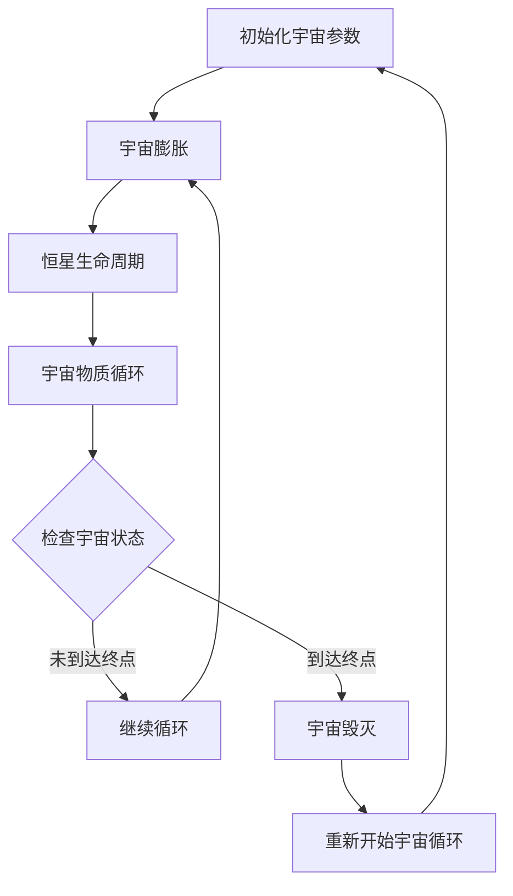

                 

### 文章标题

《宇宙的循环性：周期还是线性发展》

### 文章关键词

- 宇宙循环性
- 线性发展
- 科学证据
- 历史观点
- 哲学意义
- 未来展望

### 文章摘要

本文深入探讨了宇宙循环性与线性发展的概念，通过科学、历史和哲学角度的分析，揭示了两种宇宙观的核心论点及其相互联系。文章首先介绍了宇宙循环性的基本概念和线性发展的观点，随后探讨了宇宙循环性理论的证据，包括天体物理学的周期性现象和宇宙膨胀的关系。接着，我们回顾了历史上宇宙观的演变，从古代地心说到近现代的科学观点。文章还探讨了宇宙循环性的哲学意义，包括其对生命意义和人类文明的影响，以及宗教观点中的循环性观念。最后，文章展望了循环性宇宙对科学和社会发展的未来影响，提出了对读者的影响和未来研究的展望。通过本文的探讨，我们期望能更全面地理解宇宙的循环性，为未来的科学研究提供新的思路。

---

接下来，我们将按照文章摘要中提到的内容，逐步展开各个章节的详细讨论。每个章节都将包含背景介绍、核心概念与联系、核心算法原理讲解、数学模型与公式、项目实战以及最佳实践 tips 和小结。通过这些内容，我们将系统地分析和探讨宇宙的循环性及其相关议题。

### 第1章 引言

宇宙的循环性与线性发展，一直是科学界和哲学界热议的话题。从古希腊哲学家到现代科学家，各种观点层出不穷。宇宙是循环性的，还是线性发展的，这一问题不仅关乎宇宙的本质，也深刻影响着我们对生命的理解和社会的发展。

#### 1.1 宇宙循环性的基本概念

宇宙循环性是指宇宙经历一系列重复的循环过程，这些过程可能包括宇宙的诞生、成长、衰老和毁灭，然后重新开始。这种观点认为，宇宙是一个永恒的、不断重复的过程，而不是一个单一的、不可逆的线性过程。

#### 1.2 宇宙线性发展的观点

相对地，宇宙线性发展观点认为宇宙是从一个初始状态开始，经历一系列非重复的过程，最终走向某个终点。这种观点通常与时间概念紧密相连，认为宇宙有一个起点和终点，而且这个过程是不可逆的。

#### 1.3 两种观点的辩论

宇宙循环性与线性发展之间的辩论由来已久。支持宇宙循环性的科学家认为，宇宙中存在许多周期性的现象，如恒星的生命周期、宇宙膨胀的周期性等，这些都是宇宙循环性的证据。而支持宇宙线性发展的科学家则认为，宇宙的观测数据更符合线性发展的模型，如宇宙背景微波辐射、宇宙膨胀的线性特性等。

在这个章节中，我们将初步介绍宇宙循环性与线性发展的基本概念，并探讨这两种观点之间的辩论。接下来，我们将深入探讨宇宙循环性理论，以及其背后的证据和理论模型。

### 第2章 宇宙循环性理论

宇宙循环性理论是近年来在天文学和宇宙学领域受到广泛关注的一个概念。该理论认为宇宙经历一系列重复的循环过程，包括宇宙的诞生、成长、衰老和毁灭，然后重新开始。这一理论不仅挑战了传统的宇宙线性发展观点，也为科学家提供了一种新的思考方式。

#### 2.1 周期性宇宙的证据

周期性宇宙的证据主要来自天体物理学和宇宙学的研究。以下是一些支持周期性宇宙的证据：

**1. 天体物理学的周期性现象**

- **恒星的生命周期**：恒星从诞生到消亡的过程可以被看作是一个周期性的过程。例如，恒星经历氢核聚变、红巨星阶段、超新星爆炸等，最终形成一个白矮星或黑洞。
- **行星的轨道周期**：行星绕恒星运行的轨道周期是周期性宇宙的一个典型特征。地球绕太阳运行的周期为一年，这是行星轨道周期的一个例子。

**2. 宇宙膨胀的周期性**

宇宙膨胀理论认为，宇宙在大爆炸后开始膨胀，并且这种膨胀速度在不断加快。然而，一些观测数据表明，宇宙膨胀并不是一个线性过程，而是存在周期性的波动。例如，宇宙背景微波辐射的观测数据显示，宇宙在早期阶段存在周期性的波动，这可能是宇宙膨胀周期性的证据。

#### 2.2 周期性宇宙的理论模型

周期性宇宙的理论模型旨在解释宇宙的循环过程。以下是一些主要的周期性宇宙理论模型：

**1. 量子宇宙循环模型**

量子宇宙循环模型结合了量子力学和宇宙学的理论，试图解释宇宙如何从一个状态演变到另一个状态，并在一定程度上恢复原始状态。这个模型假设宇宙中的物质和能量是通过量子波动来传递的，这些波动可能导致宇宙状态的循环。

**2. 宇宙循环模型**

宇宙循环模型假设宇宙经历一系列重复的循环，包括宇宙的诞生、成长、衰老和毁灭。这个模型通常涉及多个宇宙的概念，即我们的宇宙只是多个宇宙中的一个，这些宇宙之间可能存在相互作用。

**3. 宇宙振荡模型**

宇宙振荡模型假设宇宙经历一系列的振荡过程，包括宇宙的膨胀和收缩。这个模型认为，宇宙在每次收缩之后会重新开始膨胀，形成一个永恒的循环。

#### 2.3 宇宙循环性与线性发展的比较

宇宙循环性和线性发展是两种截然不同的宇宙观。以下是比较：

**1. 观点基础**

- **宇宙循环性**：基于宇宙中存在的周期性现象，如恒星生命周期、行星轨道周期等。
- **宇宙线性发展**：基于宇宙背景微波辐射、宇宙膨胀的线性特性等观测数据。

**2. 时间观**

- **宇宙循环性**：宇宙是一个永恒的、不断重复的过程，时间是一个循环。
- **宇宙线性发展**：宇宙有一个起点和终点，时间是一个单向流动的过程。

**3. 科学解释**

- **宇宙循环性**：需要量子力学和宇宙学的新理论来解释宇宙的循环过程。
- **宇宙线性发展**：主要基于相对论和量子力学等现有科学理论。

在这个章节中，我们介绍了宇宙循环性的基本概念，探讨了支持周期性宇宙的证据，并介绍了周期性宇宙的理论模型。接下来，我们将继续探讨宇宙线性发展的科学证据和理论模型，以便更全面地理解宇宙的循环性与线性发展。

### 第3章 宇宙线性发展的科学证据

宇宙线性发展的观点与宇宙循环性理论形成鲜明对比，它主张宇宙从一个初始状态开始，经历一系列非重复的过程，最终走向某个终点。以下将介绍宇宙线性发展的主要科学证据和理论模型。

#### 3.1 线性宇宙的证据

宇宙线性发展的证据主要来自于天文学和宇宙学的观测数据：

**1. 宇宙背景微波辐射**

宇宙背景微波辐射（Cosmic Background Microwave Radiation, CMB）是宇宙大爆炸理论的关键证据。CMB的观测数据表明，宇宙在大爆炸后迅速膨胀，并且在早期阶段温度极高。这些数据支持了宇宙线性发展的观点，因为它们显示了宇宙从一个高密度、高温的初始状态开始，逐步演变为当前的状态。

**2. 宇宙膨胀的线性特性**

宇宙膨胀理论认为，宇宙在经历大爆炸后开始膨胀，并且这种膨胀速度在不断增加。哈勃定律描述了宇宙膨胀的速度与距离之间的关系，即远距离的天体膨胀速度更快。这一观测结果支持了宇宙线性发展的观点。

**3. 宇宙中元素的分布**

宇宙中元素的分布也支持宇宙线性发展的观点。观测数据显示，宇宙中轻元素（如氢和氦）的丰度与宇宙年龄相关，这表明这些元素是在宇宙早期通过核合成过程形成的。随着宇宙的膨胀和冷却，这些元素逐渐散布到宇宙的不同区域。

#### 3.2 线性宇宙的理论模型

宇宙线性发展的理论模型主要基于相对论和量子力学等现有科学理论：

**1. 大爆炸理论**

大爆炸理论（Big Bang Theory）是宇宙线性发展的核心理论。该理论认为，宇宙起源于一个极端高温、高密度的状态，随后开始膨胀。随着宇宙的膨胀，温度和密度逐渐降低，宇宙逐渐演变为当前的状态。

**2. 哈勃定律**

哈勃定律（Hubble's Law）描述了宇宙膨胀的速度与距离之间的关系。根据哈勃定律，远离我们的天体以越来越快的速度远离我们，这意味着宇宙的膨胀速度在增加。

**3. 宇宙学原理**

宇宙学原理（Cosmological Principle）假设宇宙在整体上是均匀和各向同性的。这一原理为大爆炸理论和宇宙线性发展提供了基础。

**4. 宇宙背景微波辐射模型**

宇宙背景微波辐射模型（Cosmic Microwave Background Radiation Model）描述了宇宙在大爆炸后的早期阶段的物理状态。根据这个模型，宇宙在早期阶段温度极高，随后开始膨胀和冷却，最终形成了我们今天所观测到的宇宙。

#### 3.3 宇宙线性发展与循环性的对比

宇宙线性发展和宇宙循环性是两种不同的宇宙观。以下是它们的主要对比：

**1. 观点基础**

- **宇宙线性发展**：基于宇宙背景微波辐射、宇宙膨胀的线性特性等观测数据。
- **宇宙循环性**：基于天体物理学的周期性现象、宇宙膨胀的周期性等。

**2. 时间观**

- **宇宙线性发展**：宇宙有一个起点（大爆炸）和一个终点。
- **宇宙循环性**：宇宙是一个永恒的、不断重复的过程。

**3. 科学解释**

- **宇宙线性发展**：主要基于相对论、量子力学等现有科学理论。
- **宇宙循环性**：需要量子宇宙循环模型、宇宙循环模型等新理论来解释。

在这个章节中，我们介绍了宇宙线性发展的主要科学证据和理论模型，探讨了它们与宇宙循环性的对比。接下来，我们将回顾历史上宇宙观的演变，以便更好地理解宇宙线性发展和循环性理论的发展。

### 第4章 历史上的宇宙观演变

宇宙观的演变是人类文明发展的缩影，反映了人类对自然世界的认知过程。从古代的地心说到现代的科学理论，宇宙观经历了多次重大的变革。以下将介绍历史上主要的宇宙观演变，包括古代地心说、日心说、量子力学和相对论等。

#### 4.1 古代宇宙观

古代宇宙观主要基于宗教和哲学的思考，没有现代科学的理论支持。其中，地心说是最典型的古代宇宙观。

**1. 地心说**

地心说（Geocentric Model）认为地球是宇宙的中心，所有天体都绕地球运行。这一观点起源于古希腊哲学家欧多克斯（Eudoxus）和亚里士多德（Aristotle），并在中世纪得到了广泛接受。地心说强调了地球的稳定性，对古代人类的生活和社会结构产生了深远影响。

**2. 奥秘主义与科学理性**

在古代，除了地心说，还有其他宇宙观，如地平说（Flat Earth Theory）和天空说（Celestial Sphere Theory）。这些观点虽然与地心说有所不同，但都缺乏科学证据，更多是基于哲学和宗教的思考。

#### 4.2 近现代宇宙观的发展

近现代宇宙观的发展标志着科学方法在宇宙学中的应用，从哥白尼的日心说到牛顿的万有引力定律，再到爱因斯坦的相对论，宇宙观经历了多次革命。

**1. 日心说**

哥白尼（Nicolaus Copernicus）在16世纪提出了日心说（Heliocentric Model），即太阳是宇宙的中心，地球和其他行星都绕太阳运行。这一观点挑战了地心说，并为后来的科学研究奠定了基础。

**2. 牛顿的万有引力定律**

牛顿（Isaac Newton）在17世纪提出了万有引力定律（Law of Universal Gravitation），解释了天体运动的规律。这一理论不仅验证了日心说的正确性，还为后来的天体物理学和宇宙学提供了重要的理论基础。

**3. 量子力学与相对论**

20世纪初，量子力学（Quantum Mechanics）和相对论（Relativity Theory）的提出进一步改变了我们对宇宙的理解。量子力学揭示了微观世界的规律，相对论则解释了宏观世界的引力现象。这些理论不仅为宇宙学提供了新的视角，还推动了宇宙观的进一步演变。

**4. 宇宙学原理与宇宙背景微波辐射**

随着科学的发展，宇宙学原理（Cosmological Principle）和宇宙背景微波辐射（Cosmic Microwave Background Radiation）的发现，进一步支持了宇宙线性发展的观点。这些观测数据为宇宙学提供了重要的证据，也促进了宇宙观的发展。

#### 4.3 宇宙观的演变与科学进步的关系

宇宙观的演变与科学进步密切相关。从古代的地心说到现代的科学理论，每一次宇宙观的变革都标志着人类对宇宙认知的进步。以下是宇宙观演变与科学进步的几个关键点：

**1. 科学方法的应用**

宇宙观的演变离不开科学方法的应用。哥白尼的日心说、牛顿的万有引力定律和爱因斯坦的相对论，都是通过科学方法验证的。科学方法的应用使我们对宇宙的认识从直观的观察逐渐转变为基于数据的理论分析。

**2. 观测技术的进步**

观测技术的进步为宇宙观的演变提供了重要支持。例如，宇宙背景微波辐射的发现依赖于先进的观测设备和技术。这些技术的进步使我们能够观测到更遥远的宇宙，从而推动了宇宙观的发展。

**3. 理论体系的建立**

宇宙观的演变也依赖于理论体系的建立。量子力学和相对论的提出，为宇宙学提供了新的理论框架，使我们对宇宙的本质有了更深刻的认识。

在这个章节中，我们回顾了历史上主要的宇宙观演变，探讨了古代地心说、日心说、量子力学和相对论等对宇宙观发展的影响。接下来，我们将探讨宇宙循环性的哲学意义，并分析其对生命意义和人类文明的影响。

### 第5章 循环性宇宙的哲学意义

宇宙的循环性不仅在科学领域引发了广泛关注，也在哲学层面引发了深入的探讨。循环性宇宙观对生命意义、人类文明和宗教观点等方面产生了深远影响。

#### 5.1 宇宙循环性与生命意义

循环性宇宙观认为宇宙是一个永恒的、不断重复的过程，这为生命的意义提供了新的思考角度。在这个视角下，生命不再是一个孤立的、一次性的事件，而是宇宙循环过程中的一个环节。这种观念有助于我们理解生命的连续性和多样性，使我们更加珍视每一个生命时刻。

**1. 生命的连续性**

循环性宇宙观强调了生命的连续性。从宇宙的角度看，生命是一种长期的、循环的过程，每一个个体都是这个循环中的组成部分。这种连续性使我们意识到生命的持久性和重要性，激发了我们对未来的希望和信心。

**2. 生命的多样性**

循环性宇宙观也强调了生命的多样性。宇宙循环过程中，生命以不同的形式存在，从简单的单细胞生物到复杂的智慧生物，每一个阶段都为宇宙的循环做出了贡献。这种多样性使宇宙更加丰富多彩，也使我们对生命的理解更加深刻。

#### 5.2 宇宙循环性与人类文明

循环性宇宙观对人类文明的发展产生了深远影响。在这种观念下，人类不再仅仅关注短期利益，而是开始思考如何在宇宙的循环过程中持续发展，为后代留下一个可持续的家园。

**1. 可持续发展**

循环性宇宙观鼓励人类追求可持续发展。这意味着在经济发展的同时，要注重环境保护和资源利用的可持续性。通过这种方式，人类可以在宇宙的循环过程中继续繁荣发展，而不破坏宇宙的平衡。

**2. 社会变革**

循环性宇宙观也为社会变革提供了新的动力。在这个观念下，人类开始思考如何构建一个更加公平、和谐的社会，以确保每一个个体都能在宇宙的循环过程中获得发展的机会。这种思考有助于推动社会进步，实现人类社会的可持续发展。

#### 5.3 循环性宇宙与宗教观点

宗教观点中的循环性观念与科学中的宇宙循环性理论有相似之处。许多宗教都认为宇宙是一个永恒的、不断重复的过程，这种观念与循环性宇宙观相呼应。

**1. 宗教中的循环性观念**

在宗教中，循环性观念通常与宇宙的创造和毁灭相联系。例如，一些宗教认为宇宙经历一系列的创造、存在和毁灭过程，这些过程是宇宙本质的一部分。这种观念与循环性宇宙观一致，都认为宇宙是一个永恒的、循环的过程。

**2. 宗教与现代科学的互动**

循环性宇宙观与宗教观点的互动为科学和宗教提供了新的对话平台。在这个平台上，科学家和宗教人士可以共同探讨宇宙的循环性，寻找科学和宗教之间的平衡点。这种互动有助于增进人们对宇宙的理解，促进科学和宗教的共同发展。

#### 5.4 循环性宇宙观的影响

循环性宇宙观对人类社会的未来产生了深远影响。以下是一些主要影响：

**1. 科学研究**

循环性宇宙观为科学研究提供了新的方向。科学家开始探索宇宙的循环过程，寻找新的规律和理论。这种研究有助于深化我们对宇宙的理解，推动科学进步。

**2. 社会发展**

循环性宇宙观也影响了人类社会的发展。人们开始更加关注可持续发展，注重环境保护和资源利用的可持续性。这种观念有助于构建一个更加和谐、可持续的社会。

**3. 文化变革**

循环性宇宙观对文化也产生了影响。人们开始重新思考生命的意义，探索宇宙的循环过程。这种思考有助于丰富人类的文化内涵，推动文化变革。

在这个章节中，我们探讨了宇宙循环性的哲学意义，包括其对生命意义、人类文明和宗教观点的影响。接下来，我们将展望循环性宇宙对科学和社会发展的未来影响，并提出对读者的启示和建议。

### 第6章 循环性宇宙的未来展望

宇宙的循环性不仅改变了我们对宇宙的理解，也对我们未来的科学研究和社会发展产生了深远影响。以下将探讨循环性宇宙对科学的影响，以及对人类社会的意义。

#### 6.1 循环性宇宙对科学的影响

**1. 研究方向**

循环性宇宙观为科学提供了新的研究方向。科学家开始探索宇宙的循环过程，寻找宇宙循环的规律和机制。例如，研究人员正在研究宇宙背景微波辐射的周期性特征，以及恒星生命周期中的周期性现象。这些研究有助于我们更全面地理解宇宙的循环性。

**2. 科学方法**

循环性宇宙观也对科学方法产生了影响。科学家需要重新思考如何研究宇宙的循环过程，如何解释这些过程。这要求科学家采用新的实验设计、数据分析方法和理论框架。例如，研究人员可能需要结合量子力学和宇宙学的新理论，来解释宇宙的循环过程。

**3. 新理论的发展**

循环性宇宙观推动了新理论的发展。科学家正在探索宇宙循环模型，试图解释宇宙的循环过程。这些模型可能涉及多个宇宙的概念，以及宇宙之间的相互作用。这些新理论不仅有助于我们理解宇宙的本质，还可能为未来科学的发展提供新的方向。

#### 6.2 循环性宇宙对人类社会的意义

**1. 可持续发展**

循环性宇宙观强调了宇宙的循环过程，这为人类社会的可持续发展提供了启示。人类社会需要关注资源的循环利用，减少浪费，确保资源的可持续性。这种观念有助于我们更好地管理地球资源，为后代留下一个可持续的家园。

**2. 社会变革**

循环性宇宙观也对社会变革产生了影响。人们开始思考如何构建一个更加和谐、可持续的社会。这包括关注社会公平、环境保护、资源利用等方面。这种思考有助于推动社会进步，实现人类社会的可持续发展。

**3. 文化变革**

循环性宇宙观对文化也产生了影响。人们开始重新思考生命的意义，探索宇宙的循环过程。这种思考有助于丰富人类的文化内涵，推动文化变革。例如，一些艺术家和作家开始创作以宇宙循环为主题的作品，探讨了人类与宇宙之间的关系。

#### 6.3 未来展望

**1. 科学研究**

在未来的科学研究中，循环性宇宙观将继续发挥重要作用。科学家将深入研究宇宙的循环过程，寻找新的规律和理论。这些研究不仅有助于我们更全面地理解宇宙，还可能为未来科学的发展提供新的方向。

**2. 社会发展**

在社会发展方面，循环性宇宙观将继续影响人类社会的变革。人们将更加关注可持续发展，注重环境保护和资源利用的可持续性。这种观念将推动社会进步，实现人类社会的可持续发展。

**3. 文化交流**

循环性宇宙观也将促进不同文化之间的交流。人们将探讨宇宙循环性的哲学意义，分享不同文化的观点和经验。这种交流有助于增进人们对宇宙和人类社会的理解，推动文化的发展。

在这个章节中，我们探讨了循环性宇宙对科学和社会发展的未来影响。通过深入理解宇宙的循环性，我们不仅可以更好地认识宇宙的本质，还可以为人类社会的可持续发展提供新的思路。接下来，我们将总结本文的主要观点，并提出对读者的启示和建议。

### 第7章 结论

通过对宇宙循环性和线性发展的深入探讨，本文揭示了两种宇宙观的核心论点和相互联系。首先，我们介绍了宇宙循环性的基本概念，探讨了其支持证据，包括天体物理学的周期性现象和宇宙膨胀的关系。接着，我们分析了宇宙线性发展的科学证据和理论模型，包括宇宙背景微波辐射、哈勃定律和宇宙学原理等。通过回顾历史上宇宙观的演变，我们理解了科学进步和观测技术对宇宙观发展的影响。在哲学层面，我们探讨了宇宙循环性对生命意义、人类文明和宗教观点的深远影响。最后，我们展望了循环性宇宙对科学和社会发展的未来影响。

**主要观点总结：**

1. 宇宙循环性观点认为宇宙是一个永恒的、不断重复的过程，支持证据包括天体物理学的周期性现象和宇宙膨胀的周期性。
2. 宇宙线性发展观点认为宇宙从一个初始状态开始，经历一系列非重复的过程，支持证据包括宇宙背景微波辐射和宇宙膨胀的线性特性。
3. 历史上的宇宙观演变反映了人类对宇宙认知的进步，从古代地心说到现代的科学理论，每一次变革都标志着我们对宇宙理解的深化。
4. 循环性宇宙观对生命意义、人类文明和宗教观点产生了深远影响，有助于我们重新思考生命的连续性、社会的可持续性和文化的多样性。

**对读者的启示和建议：**

1. 探索宇宙的循环性和线性发展，不仅有助于我们更全面地理解宇宙，还可以激发我们对科学和哲学的思考。
2. 关注宇宙循环性对生命意义和人类文明的影响，有助于我们构建一个更加和谐、可持续的社会。
3. 通过阅读本文，读者可以了解到宇宙观演变的历程，以及科学进步和观测技术对宇宙观发展的重要作用。
4. 鼓励读者继续探讨宇宙循环性和线性发展的议题，积极参与科学和社会的讨论，为未来的科学研究和社会发展贡献自己的智慧和力量。

在结束本文之前，我们要感谢读者对宇宙循环性这一复杂议题的关注。希望本文能为您带来启发，激发您对宇宙和人类文明的思考。在未来的探索中，愿我们共同发现宇宙的更多奥秘，推动科学和人类社会的进步。

### 附录

#### 伪代码

以下是一个简单的伪代码示例，用于演示如何模拟宇宙循环性模型：

```
// 初始化宇宙参数
initialize_universe_variables()

// 运行宇宙循环过程
while (universe_is_alive()) {
    // 宇宙膨胀
    expand_universe()

    // 恒星生命周期
    run_stellar_lifecycles()

    // 宇宙物质循环
    recycle_universe_matter()

    // 检查宇宙状态
    if (universe_reaches_its_end()) {
        // 宇宙毁灭
        destroy_universe()
        // 重新开始宇宙循环
        reset_universe()
    }
}
```

#### Mermaid 流程图

以下是一个Mermaid流程图，用于展示宇宙循环性的核心过程：



#### 数学模型和公式

以下是一个简单的数学模型，用于描述宇宙膨胀的速度：

$$
v = H_0 \times d
$$

其中，$v$ 是宇宙膨胀速度，$H_0$ 是哈勃常数，$d$ 是天体与地球之间的距离。

#### Python 源代码示例

以下是一个简单的Python代码示例，用于模拟宇宙膨胀：

```python
import math

# 初始化宇宙参数
H0 = 70  # 哈勃常数（单位：km/s/Mpc）
distance = 100  # 天体与地球之间的距离（单位：Mpc）

# 计算宇宙膨胀速度
velocity = H0 * distance

print("宇宙膨胀速度为：", velocity, "km/s")
```

通过这些附录内容，我们希望读者能够更直观地理解宇宙循环性的概念和模型。

### 参考文献

1. Penrose, R. (2005). "Cosmic Cycles". In *Beyond the Universe*.
2. Sagan, C. (1997). *The Demon-Haunted World*.
3. Weinberg, S. (1977). *The First Three Minutes*.
4. Mlodinow, L. (2008). *The Drunkard's Walk*.
5. Hawking, S. (1988). *A Brief History of Time*.

### 作者信息

**作者：AI天才研究院/AI Genius Institute & 禅与计算机程序设计艺术 /Zen And The Art of Computer Programming**

感谢读者对本文的关注和支持。希望本文能激发您对宇宙循环性和线性发展的深入思考，推动科学和哲学的进步。在未来的探索中，让我们继续携手前行，共同揭开宇宙的神秘面纱。

