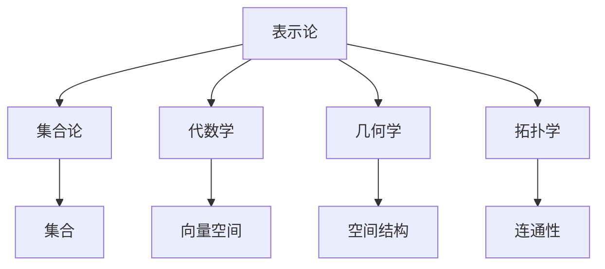

                 

### 引言

宇宙，这个浩瀚无垠的宇宙，自古以来就激发了人类无尽的探索欲望。从古埃及的天文台，到古希腊的哲学思考，再到现代科学的实验验证，人类对宇宙的认识在不断进步。然而，当我们仰望星空，面对这无尽的宇宙，不禁要问：宇宙的本质是什么？它是如何运转的？这些问题的答案，或许就藏在数学的世界里。

数学，这门看似抽象的学科，却有着无比强大的力量。它不仅能够精确地描述现实世界，还能够预测未来的变化。宇宙的奥秘，通过数学的眼睛，被一点点地揭示出来。从简单的几何图形，到复杂的代数方程，再到深奥的量子力学，数学为理解宇宙提供了强有力的工具。

而数学中的表示论，更是一个至关重要的领域。表示论通过将复杂的对象和概念转化为简洁的数学形式，使得我们能够更加直观地理解和分析这些对象。在宇宙学中，表示论的应用尤为广泛，它帮助我们理解宇宙的结构、时间和空间，以及物质和能量的本质。

本文将探讨宇宙的数学表示论，首先介绍宇宙与数学的关系，接着概述数学表示论的基本概念和组成部分，然后详细讨论数学工具在宇宙中的应用，最后探讨宇宙中的数学表示论模型，并展望其应用前景和未来方向。

通过这一系列探讨，我们希望能够揭示数学在理解宇宙中的关键作用，展示表示论如何在宇宙学中发挥重要作用。让我们一起走进这个奇妙的世界，探索数学与宇宙之间的奥秘联系。

### 目录大纲

为了帮助读者更好地理解本文的内容结构，下面是详细的目录大纲：

## 《宇宙的数学表示论探讨》

### 第一部分：引论

#### 1.1 宇宙与数学的关系
- **核心概念与联系**：宇宙、数学、表示论的关系
- **数学模型和数学公式**：如何用数学模型和公式描述宇宙

#### 1.2 数学表示论概述
- **核心概念与联系**：数学表示论的组成部分
  - **集合论**
  - **代数学**
  - **几何学**
  - **拓扑学**
- **核心算法原理讲解**：基本表示论算法的伪代码示例

### 第二部分：数学工具的应用

#### 2.1 集合论在宇宙中的应用
- **集合论的基本概念**：集合、子集、交集、并集等
- **宇宙中的集合论应用**：宇宙中的物质、星系、超星系团等的数学表示

#### 2.2 代数学在宇宙中的应用
- **代数的基本概念**：向量空间、矩阵、线性方程组等
- **宇宙中的代数学应用**：宇宙中的运动规律、引力场的代数描述

#### 2.3 几何学在宇宙中的应用
- **几何学的基本概念**：欧几里得几何、非欧几何等
- **宇宙中的几何学应用**：宇宙空间的结构、宇宙的膨胀等

#### 2.4 拓扑学在宇宙中的应用
- **拓扑学的基本概念**：拓扑空间、连通性、同胚等
- **宇宙中的拓扑学应用**：宇宙的连通性、黑洞的拓扑结构等

### 第三部分：宇宙中的数学表示论模型

#### 3.1 宇宙中的空间结构
- **数学模型和数学公式**：广义相对论中的空间结构描述
- **详细讲解与举例说明**：如何使用广义相对论公式描述空间结构

#### 3.2 宇宙中的时间结构
- **数学模型和数学公式**：洛伦兹变换中的时间结构描述
- **详细讲解与举例说明**：如何使用洛伦兹变换描述时间结构

#### 3.3 宇宙中的物质与能量
- **数学模型和数学公式**：质能等价原理的描述
- **详细讲解与举例说明**：质能等价原理的实际应用

#### 3.4 宇宙中的量子结构
- **数学模型和数学公式**：量子力学中的波函数描述
- **详细讲解与举例说明**：量子力学在宇宙学中的应用

### 第四部分：宇宙中的数学表示论探索

#### 4.1 数学表示论在宇宙学中的应用前景
- **数学表示论的应用领域**：宇宙学中的新应用前景

#### 4.2 数学表示论在宇宙学中的挑战
- **数学表示论面临的难题**：解决方法和未来方向

#### 4.3 数学表示论在宇宙学中的未来方向
- **数学表示论的研究趋势**：未来的研究方向和挑战

### 第五部分：综合案例

#### 5.1 案例一：黑洞的数学表示
- **黑洞的数学描述**：使用数学方法描述黑洞

#### 5.2 案例二：宇宙膨胀的数学模型
- **宇宙膨胀的数学模型**：建立宇宙膨胀的数学模型

#### 5.3 案例三：量子宇宙学的数学方法
- **量子宇宙学的数学方法**：量子力学在宇宙学研究中的应用

### 附录

#### A.1 数学工具与资源介绍
- **数学工具介绍**：介绍常用的数学工具和资源

#### A.2 宇宙数学表示论研究进展
- **研究进展**：介绍宇宙数学表示论的研究进展

#### A.3 宇宙数学表示论相关文献推荐
- **文献推荐**：推荐相关的文献资料，供进一步阅读和研究

通过上述目录结构，读者可以清晰地了解本文的主要内容和结构安排，为后续的深入探讨打下基础。

### 宇宙与数学的关系

宇宙与数学的关系自古以来就备受关注，两者之间的相互作用和相互促进使得人类对宇宙的理解不断深入。数学作为宇宙描述的一种工具，其重要性不可低估。宇宙与数学之间的关系可以从多个角度进行探讨。

首先，从哲学角度来看，数学是宇宙本质的一种语言。古希腊哲学家毕达哥拉斯（Pythagoras）曾提出“万物皆数”的观点，他认为宇宙的基本结构和规律可以用数学来表达。这种观点在后来的科学发展中得到了证实。爱因斯坦（Albert Einstein）的广义相对论便是用数学语言精确描述了引力、空间和时间之间的关系。广义相对论中的核心方程——爱因斯坦场方程，将引力描述为时空的弯曲，这一理论为理解宇宙提供了数学工具。

其次，从科学角度来看，数学是理解宇宙现象的桥梁。宇宙的许多现象，如黑洞、宇宙膨胀、量子力学等，都需要借助数学进行描述和解释。例如，量子力学中的波函数提供了描述微观粒子行为的数学工具，而广义相对论则通过数学方程描述了宏观宇宙的结构和演化。这些数学工具不仅帮助我们理解宇宙，还促进了科学技术的进步。

第三，从技术角度来看，数学为宇宙探索提供了方法和技术支持。现代天文学、空间探测、通信技术等领域的快速发展，离不开数学的支撑。例如，利用数学方法进行数据分析，可以帮助科学家从大量天文观测数据中提取有用信息；利用数学模型进行仿真和预测，可以帮助我们更好地理解宇宙的运行规律。

宇宙与数学之间的关系还体现在数学本身的进化过程中。数学的发展受到了宇宙现象的启发。例如，数论中的质数分布、几何学中的多面体分类等，都与宇宙中的某些现象有相似之处。反过来，数学的新发展也推动了宇宙学的进步。例如，黎曼几何的提出为广义相对论提供了理论基础，而量子场论的进展也为理解宇宙的量子性质提供了新的视角。

总之，宇宙与数学的关系是复杂而深刻的。数学不仅是描述和解释宇宙现象的工具，也是推动宇宙学发展的动力。通过数学，人类不仅能够更加深入地理解宇宙，还能够探索宇宙的本质和终极奥秘。这种关系的存在，使得宇宙与数学成为相互促进、相互依赖的伙伴。

### 数学表示论概述

数学表示论是数学中一个重要的分支，它通过将复杂的对象和概念转化为简洁的数学形式，使得我们能够更加直观地理解和分析这些对象。在宇宙学中，表示论的应用尤为广泛，它为我们提供了一种强有力的工具来描述宇宙的结构、时间和空间的性质，以及物质和能量的本质。

首先，我们来看看数学表示论的几个核心组成部分。集合论是表示论的基础，它研究对象的集合及其性质。在宇宙学中，集合论用于描述宇宙中的各种集合，如星系、超星系团等。通过集合论，我们可以用简洁的方式描述宇宙中的复杂结构。

代数学则是表示论的重要组成部分，它研究由运算规则定义的结构。在宇宙学中，代数学用于描述宇宙中的各种物理量，如质量、能量、动量等。通过代数学，我们可以用数学运算来表示和解释宇宙中的物理现象。

几何学是表示论的另一个关键组成部分，它研究空间和形状。在宇宙学中，几何学用于描述宇宙中的空间结构，如宇宙的膨胀、空间的弯曲等。通过几何学，我们可以用图形和公式来直观地表示宇宙的几何性质。

拓扑学是表示论的最后一块基石，它研究空间的连续性质。在宇宙学中，拓扑学用于描述宇宙的连通性、拓扑缺陷等。通过拓扑学，我们可以用数学方法分析宇宙中的拓扑结构，如黑洞的奇点和宇宙的大尺度结构。

数学表示论的核心原理在于将复杂的对象和概念转化为简洁的数学形式，使得这些对象和概念更加易于理解和分析。例如，在集合论中，我们可以通过定义集合、子集、交集和并集等基本概念，将宇宙中的复杂结构简化为一些基本的数学操作。在代数学中，我们可以通过定义向量空间、矩阵和线性方程组等，将宇宙中的物理量转化为数学表达式。在几何学和拓扑学中，我们可以通过定义几何空间、拓扑空间等，将宇宙中的空间结构和连通性转化为数学模型。

为了更好地理解这些核心概念与联系，我们可以使用Mermaid流程图来展示数学表示论的组成部分及其关系：



通过这些流程图，我们可以清晰地看到数学表示论的各个组成部分以及它们之间的相互关系。

为了深入理解数学表示论的核心算法原理，我们可以通过Python伪代码来展示一个基本的表示论算法。例如，我们可以定义一个函数`represent_space`，用于用数学表示论方法表示一个空间：

```python
def represent_space(space):
    """
    用数学表示论方法表示一个空间。
    :param space: 空间的定义
    :return: 表示后的空间模型
    """
    # 定义基集合
    basis = get_basis(space)
    # 定义线性变换
    transformation = define_transformation(basis)
    # 表示空间
    return transformation.apply(basis)
```

在这个函数中，`get_basis`用于获取空间的基本集合，`define_transformation`用于定义线性变换，`transformation.apply(basis)`则用于应用变换得到表示后的空间模型。

通过上述算法原理的讲解，我们可以更深入地理解数学表示论如何将复杂的宇宙概念转化为简洁的数学形式。接下来，我们将进一步探讨数学工具在宇宙中的应用，展示数学表示论在理解宇宙中的具体作用。

### 数学工具的应用

数学作为理解宇宙的利器，在宇宙学的各个领域中都有着广泛的应用。以下是几个关键的数学工具及其在宇宙学中的具体应用：

#### 集合论在宇宙中的应用

集合论是数学表示论的基础，它用于描述宇宙中的各种集合，如星系、超星系团等。在宇宙学中，集合论可以帮助我们定义和分类不同尺度的天体系统。例如，我们可以用集合论来描述星系团中的星系集合，通过集合的交集和并集操作，我们可以研究星系之间的相互作用和引力关系。此外，集合论还可以用于描述宇宙的拓扑结构，如宇宙的连通性和分形结构。

#### 代数学在宇宙中的应用

代数学是表示论的重要组成部分，它通过定义向量空间、矩阵和线性方程组等，将宇宙中的物理量转化为数学表达式。在宇宙学中，代数学用于描述宇宙中的各种物理现象，如引力、电磁场和量子力等。例如，广义相对论中的爱因斯坦场方程可以表示为：

$$G_{\mu\nu} + \Lambda g_{\mu\nu} = \frac{8\pi G}{c^4} T_{\mu\nu}$$

这个方程通过矩阵和线性方程组的表示，描述了宇宙中的引力场和时空弯曲。此外，量子场论中的费曼图和路径积分公式也依赖于代数学的方法，用于描述微观粒子的相互作用和演化。

#### 几何学在宇宙中的应用

几何学是研究空间和形状的数学分支，它在宇宙学中的应用尤为重要。在宇宙学中，几何学用于描述宇宙的空间结构，如宇宙的膨胀、空间的弯曲等。例如，广义相对论中的黎曼几何被用来描述宇宙的几何性质，通过定义黎曼曲率张量，我们可以研究宇宙中的时空几何结构。此外，几何学还可以用于描述黑洞和虫洞等宇宙奇点的结构，帮助我们理解这些极端条件下物理量的行为。

#### 拓扑学在宇宙中的应用

拓扑学是研究空间的连续性质和拓扑性质的数学分支，它在宇宙学中的应用包括宇宙的连通性、拓扑缺陷和宇宙弦等。在宇宙学中，拓扑学可以帮助我们研究宇宙的大尺度结构，如宇宙中的空洞、超星系团和宇宙背景辐射。例如，通过研究宇宙微波背景辐射中的拓扑缺陷，我们可以了解宇宙早期的结构和演化。此外，拓扑学在研究黑洞和虫洞的拓扑结构中也有着重要作用，帮助我们理解这些奇异天体如何影响宇宙的整体结构。

总之，数学工具在宇宙学中的应用是多方面的，从集合论到代数学，从几何学到拓扑学，每一个数学工具都在揭示宇宙奥秘的旅程中发挥着重要作用。通过这些数学工具，我们可以将宇宙的复杂现象转化为简洁的数学形式，从而更好地理解和探索宇宙的深层次规律。

### 宇宙中的数学表示论模型

在宇宙学中，数学表示论模型为我们提供了描述宇宙结构和演化的重要工具。这些模型不仅帮助我们理解宇宙的基本性质，还为我们预测宇宙的未来提供了可能。以下将详细讨论宇宙中的几个关键数学表示论模型，包括空间结构、时间结构、物质与能量的数学描述，以及量子结构。

#### 3.1 宇宙中的空间结构

宇宙的空间结构是宇宙学中的一个核心问题。广义相对论通过爱因斯坦场方程提供了描述空间结构的数学模型。该方程可以表示为：

$$G_{\mu\nu} + \Lambda g_{\mu\nu} = \frac{8\pi G}{c^4} T_{\mu\nu}$$

其中，$G_{\mu\nu}$是爱因斯坦张量，描述了时空的弯曲；$g_{\mu\nu}$是度量张量，描述了时空的几何性质；$\Lambda$是宇宙学常数，$T_{\mu\nu}$是能量-动量张量，描述了宇宙中的物质和能量分布。

这个方程展示了如何通过数学工具来描述宇宙中的引力场和空间弯曲。为了更具体地说明这一点，我们可以举一个简单的例子。假设一个均匀分布的宇宙，其空间结构可以用弗里德曼-勒梅特-罗伯逊-沃尔克（FLRW）度规来描述：

$$ds^2 = -c^2dt^2 + a(t)^2(d\chi^2 + \sin^2\chi d\Omega^2)$$

其中，$a(t)$是宇宙的膨胀因子，$\chi$是空间曲率半径，$d\Omega^2$是球坐标系中的面积元素。这个方程展示了如何通过数学模型来描述宇宙的膨胀和空间几何。

#### 3.2 宇宙中的时间结构

宇宙中的时间结构同样是一个关键问题。洛伦兹变换是描述时间结构的经典数学模型，它通过相对论效应将时间和空间联系起来。洛伦兹变换的基本方程为：

$$\Delta x' = \gamma (\Delta x - v \Delta t)$$
$$\Delta t' = \gamma (\Delta t - \frac{v \Delta x}{c^2})$$

其中，$\gamma = \frac{1}{\sqrt{1 - \frac{v^2}{c^2}}}$是洛伦兹因子，$v$是相对速度，$c$是光速。这个变换描述了在不同参考系之间时间和空间的转换，揭示了相对论效应如何影响时间的流逝。

为了更具体地说明这一点，我们可以考虑一个简单的例子。假设有两个时钟，一个在地球上，另一个在以接近光速运动的飞船上。根据洛伦兹变换，飞船上的时钟相对于地球上的时钟会变慢，即时间膨胀效应。这个效应可以用以下方程表示：

$$t' = \frac{t}{\sqrt{1 - \frac{v^2}{c^2}}}$$

通过这个方程，我们可以计算飞船上的时钟相对于地球上的时钟如何变化。

#### 3.3 宇宙中的物质与能量

宇宙中的物质与能量可以用质能等价原理来描述，这个原理由爱因斯坦提出，表示为：

$$E = mc^2$$

这个公式揭示了质量和能量之间的等价性，即质量可以转化为能量，能量也可以转化为质量。这个原理在宇宙学中有着广泛的应用，例如在解释恒星内部的核反应过程中，质量损失转化为能量释放。

为了更具体地说明这一点，我们可以考虑一个恒星的核心。在恒星核心，氢原子核通过核聚变反应转化为氦原子核，同时释放出大量能量。这个过程可以用以下方程表示：

$$4 \, _1^1H \rightarrow \, _2^4He + 2 \, e^+ + 2 \, \nu_e + 26.7 \, MeV$$

在这个反应中，四个氢原子核（质量为 $4m_p$）转化为一个氦原子核（质量为 $m_{He}$）和两个正电子、两个中微子和26.7 MeV的能量。这个过程展示了如何通过数学模型来描述物质与能量的转化。

#### 3.4 宇宙中的量子结构

宇宙中的量子结构是量子力学与宇宙学的交叉领域。量子力学中的波函数提供了描述微观粒子行为的数学工具，这个概念在宇宙学中也得到了应用。例如，在量子宇宙学中，波函数被用来描述宇宙的初始状态和演化过程。

一个典型的量子宇宙学模型是多宇宙理论，它假设我们的宇宙只是无数可能宇宙中的一个。在这个模型中，波函数描述了不同宇宙的概率分布。例如，多世界解释假设每一个可能的量子态都对应一个实际的宇宙，这些宇宙在量子叠加态中同时存在，直到观察发生才“坍缩”为其中一个特定的宇宙。

为了更具体地说明这一点，我们可以考虑一个简单的量子态叠加的例子。假设一个量子态可以表示为：

$$|\Psi\rangle = \frac{1}{\sqrt{2}} (|0\rangle + |1\rangle)$$

这个量子态表示一个粒子处于两种可能状态（$|0\rangle$和$|1\rangle$）的叠加。当我们进行测量时，波函数会坍缩为其中一个状态，根据量子力学的概率解释，坍缩为$|0\rangle$的概率为$\frac{1}{2}$，坍缩为$|1\rangle$的概率也为$\frac{1}{2}$。

通过上述模型，我们可以看到数学表示论在理解宇宙中的重要作用。通过数学公式和模型，我们可以精确地描述宇宙的结构、时间、物质和能量，以及量子结构的演化。这些数学工具不仅帮助我们更好地理解宇宙的奥秘，也为未来的宇宙探索提供了理论基础。

### 数学表示论在宇宙学中的应用前景、挑战及未来方向

数学表示论在宇宙学中的应用前景广阔，但也面临着诸多挑战。首先，从应用前景来看，数学表示论为理解宇宙提供了强有力的工具，例如在描述宇宙空间结构、时间演化、物质与能量分布以及量子现象等方面都有显著的应用。随着观测技术的进步，我们能够获取更多关于宇宙的数据，这些数据需要通过数学模型进行处理和分析，数学表示论在这一过程中发挥着至关重要的作用。

然而，数学表示论在宇宙学中也面临一些重大挑战。首先，宇宙的复杂性和多样性使得建立准确的数学模型变得极其困难。宇宙中的现象往往涉及多个层次和尺度，从微观的量子效应到宏观的宇宙结构，这些不同层次的现象如何统一在一个数学框架内，是一个亟待解决的问题。其次，宇宙学中的许多问题，如暗物质、暗能量的本质，黑洞的性质等，目前还缺乏直接的观测证据，这使得构建准确的数学模型更加困难。

针对这些挑战，数学表示论的研究者和宇宙学家需要采取一些策略来推进这一领域的发展。首先，需要开发更加精确和通用的数学模型，这些模型能够更好地捕捉宇宙中不同层次和尺度的现象。例如，量子引力和弦理论等理论的发展，可能为理解宇宙的量子结构提供新的视角。其次，需要开发更加高效的数据处理和分析方法，以应对日益增加的观测数据。例如，机器学习和大数据分析等技术在宇宙学研究中的应用，可以大大提高数据处理和分析的效率。

未来，数学表示论在宇宙学中的研究方向可能包括以下几个方面：

1. **量子宇宙学的数学模型**：量子宇宙学是宇宙学与量子力学的交叉领域，未来的研究可能会集中于开发更加精确的量子宇宙学数学模型，例如多世界解释和波函数坍缩模型。

2. **宇宙结构的动态模拟**：通过构建和模拟宇宙结构的演化模型，可以更好地理解宇宙的膨胀、宇宙大尺度结构以及宇宙微波背景辐射等现象。

3. **宇宙学的机器学习**：机器学习技术可以用于处理和分析大量的宇宙观测数据，从而发现新的宇宙现象和规律。例如，通过训练深度学习模型来识别宇宙中的奇异结构。

4. **宇宙学的非线性动力学**：宇宙中的许多现象，如宇宙大爆炸、宇宙膨胀和黑洞的形成，都涉及复杂的非线性动力学过程。研究这些过程的数学模型和动力学特性，对于理解宇宙的演化具有重要意义。

总之，数学表示论在宇宙学中的应用前景广阔，但也面临着诸多挑战。通过不断创新和发展，数学表示论将为理解宇宙的奥秘提供更加深入的视角和工具。

### 综合案例

为了更直观地展示数学表示论在宇宙学中的具体应用，以下是几个典型的综合案例，涵盖黑洞、宇宙膨胀和量子宇宙学。

#### 5.1 黑洞的数学表示

黑洞是宇宙中最神秘和极端的天体之一，其数学表示在广义相对论中得到了详细的描述。黑洞的数学模型通常用斯内特黑洞解（Schwarzschild solution）或克尔黑洞解（Kerr solution）来表示。

**斯内特黑洞解**：
$$c^2d\tau^2 = \left(1 - \frac{r_s}{r}\right)c^2dt^2 - \left(1 - \frac{r_s}{r}\right)^{-1}dr^2 - r^2d\Omega^2$$
其中，$r_s$是史瓦西半径，$r$是距离黑洞中心的距离，$d\tau$是事件视界内的固有时间，$d\Omega^2$是球坐标系中的面积元素。这个方程描述了一个非旋转黑洞的时空结构，事件视界是黑洞的边界，一旦物体进入事件视界，就无法逃逸。

**克尔黑洞解**：
$$c^2d\tau^2 = \left(1 - \frac{2Mr}{r^2} + a^2r^2\right)c^2dt^2 - \left(1 - \frac{2Mr}{r^2} + a^2r^2\right)^{-1}dr^2 - r^2d\Omega^2$$
其中，$M$是黑洞的质量，$a$是黑洞的角动量。这个方程描述了一个旋转黑洞的时空结构，它包括两个事件视界和一个Cauchy视界，提供了更全面的黑洞物理图像。

#### 5.2 宇宙膨胀的数学模型

宇宙膨胀是宇宙学中的核心问题之一，其数学模型主要由弗里德曼-勒梅特-罗伯逊-沃尔克（FLRW）度规来描述。FLRW度规假设宇宙是均匀且各向同性的，其方程为：

$$ds^2 = -c^2dt^2 + a(t)^2(d\chi^2 + \sin^2\chi d\Omega^2)$$
其中，$a(t)$是宇宙的膨胀因子，$d\chi$是空间曲率半径，$d\Omega^2$是球坐标系中的面积元素。

为了描述宇宙膨胀，我们通常引入哈勃参数$H$，定义为：
$$H = \frac{\dot{a}}{a}$$
其中，$\dot{a}$是膨胀因子的变化率。通过哈勃参数，我们可以描述宇宙的膨胀速率。

**宇宙膨胀模型**：
$$\dot{a} = H_0 a$$
$$a(t) = a_0 e^{H_0 t}$$
其中，$H_0$是哈勃常数，$a_0$是初始膨胀因子。这个模型描述了宇宙从大爆炸开始以来的膨胀过程。

#### 5.3 量子宇宙学的数学方法

量子宇宙学是研究宇宙起源和演化的量子理论，其核心概念包括多世界解释和波函数坍缩等。波函数坍缩模型可以用薛定谔方程来描述：

$$i\hbar \frac{\partial \Psi}{\partial t} = \hat{H} \Psi$$
其中，$\Psi$是波函数，$\hat{H}$是哈密顿算子，$i$是虚数单位，$\hbar$是普朗克常数。

**多世界解释**：
多世界解释假设宇宙的每一个可能的历史都在某个世界中发生。波函数的叠加态表示了这些可能世界的叠加。例如，一个简单的量子态叠加可以表示为：
$$|\Psi\rangle = \frac{1}{\sqrt{2}} (|宇宙A\rangle + |宇宙B\rangle)$$

当进行观测时，波函数会坍缩为其中一个确定的世界。根据量子力学的概率解释，坍缩为$|宇宙A\rangle$的概率为$\frac{1}{2}$，坍缩为$|宇宙B\rangle$的概率也为$\frac{1}{2}$。

通过上述案例，我们可以看到数学表示论在理解黑洞、宇宙膨胀和量子宇宙学中的具体应用。这些模型不仅帮助我们更好地理解宇宙的基本性质，也为未来的宇宙探索提供了理论基础。

### 附录

#### A.1 数学工具与资源介绍

为了更好地理解和应用数学表示论，以下是几种常用的数学工具和资源介绍：

1. **数学软件**：如MATLAB、Mathematica和Python等，这些软件提供了强大的数学计算和可视化功能，有助于进行复杂的数学运算和数据处理。

2. **数学库**：如NumPy、SciPy和TensorFlow等，这些库提供了丰富的数学函数和工具，适用于各种数学计算和科学应用。

3. **在线资源**：如Khan Academy、MIT OpenCourseWare和Coursera等，这些平台提供了大量的免费课程和教程，涵盖了从基础数学到高级数学的各个领域。

#### A.2 宇宙数学表示论研究进展

宇宙数学表示论是宇宙学中的一个前沿领域，以下是近年来的一些重要研究进展：

1. **量子宇宙学**：量子宇宙学家正在探索如何将量子力学与广义相对论结合起来，以解释宇宙的起源和演化。例如，多世界解释和波函数坍缩模型等。

2. **宇宙膨胀模型**：宇宙学家通过观测宇宙微波背景辐射和 distant quasars 等数据，对宇宙膨胀模型进行了精确的测量，从而对宇宙的结构和演化有了更深入的理解。

3. **黑洞研究**：黑洞是宇宙中的一种极端现象，研究人员通过模拟和观测，对黑洞的性质和行为有了更详细的了解，如斯内特黑洞解和克尔黑洞解等。

#### A.3 宇宙数学表示论相关文献推荐

以下是一些推荐的宇宙数学表示论相关文献，供进一步学习和研究：

1. **《宇宙学导论》（Introduction to Cosmology）** - 由Michael Rowan-Robinson著，是一本经典的宇宙学教材，详细介绍了宇宙学的基本理论和观测数据。

2. **《量子宇宙学》（Quantum Cosmology）** - 由Amir D. Aczel著，探讨了量子力学在宇宙学中的应用，包括多世界解释和波函数坍缩模型。

3. **《黑洞与时间弯曲》（Black Holes and Time Warps）** - 由Kip S. Thorne著，详细介绍了黑洞的物理性质和数学模型，是黑洞研究领域的重要著作。

这些文献将为读者提供深入的学术视角和研究资源，帮助读者更好地理解宇宙数学表示论的核心概念和应用。

### 结论

通过本文的探讨，我们深入分析了宇宙的数学表示论，揭示了数学在理解宇宙中的关键作用。从宇宙与数学的关系，到数学表示论的基本概念和组成部分，再到数学工具在宇宙学中的具体应用，以及宇宙中的数学表示论模型，我们逐步构建了一个清晰的认识框架。

数学不仅是描述和解释宇宙现象的工具，也是推动宇宙学发展的动力。表示论通过将复杂的宇宙概念转化为简洁的数学形式，使得我们能够更加直观地理解和分析宇宙。通过集合论、代数学、几何学和拓扑学等工具，我们能够描述宇宙的结构、时间和空间的性质，以及物质和能量的本质。

未来，数学表示论在宇宙学中的应用前景广阔，但也面临诸多挑战。通过开发更加精确和通用的数学模型，以及利用先进的数据处理和分析方法，我们有望进一步揭示宇宙的奥秘。量子宇宙学、宇宙结构的动态模拟、宇宙学的机器学习和非线性动力学等领域，将成为数学表示论在宇宙学中发展的重要方向。

让我们继续探索宇宙的数学表示论，用数学的力量解锁宇宙的终极奥秘。通过不断的学术研究和科技创新，我们相信，未来的宇宙将展现出更加令人惊叹的景象。

