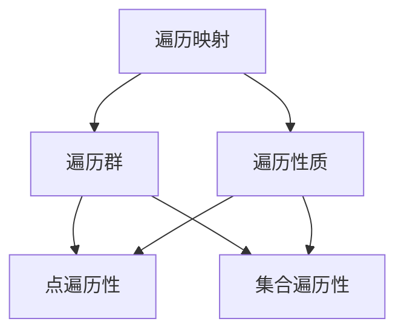

                 

### 文章标题：宇宙的数学遍历理论与遍历群在宇宙学统计推断中的应用

> **关键词**：宇宙学，数学遍历理论，遍历群，统计推断，算法原理，Python代码实现

**摘要**：本文旨在探讨宇宙的数学遍历理论及其在宇宙学统计推断中的应用。首先，我们将介绍宇宙学的发展历程和数学遍历理论的基本概念。随后，通过一个Mermaid流程图，我们将展示核心概念之间的联系。接着，我们将深入解析数学遍历理论的核心算法原理，并使用Python代码结合数学模型和公式进行详细讲解。此外，我们将通过项目实战，展示如何在实际环境中搭建开发环境，实现源代码，并进行代码解读和分析。最后，我们将总结本文的内容，提供一些最佳实践 tips，并指出注意事项和拓展阅读方向。

### 引言与背景

宇宙学是研究宇宙起源、演化和结构的一个物理学分支。自20世纪初以来，随着观测技术和理论的不断进步，我们对宇宙的理解已经取得了巨大的飞跃。然而，宇宙的复杂性和不确定性仍然使得研究宇宙的各个方面充满挑战。

数学遍历理论是数学领域中的一个重要分支，主要研究的是迭代过程和其收敛性。这个理论在多个领域都有着广泛的应用，包括物理学、计算机科学和经济学等。近年来，随着对宇宙演化复杂性的认识不断深入，数学遍历理论也开始在宇宙学中扮演重要角色。

### 数学遍历理论的基本概念

数学遍历理论的核心概念包括遍历映射、遍历群和遍历性质。首先，我们来定义什么是遍历映射。

**遍历映射**：一个迭代函数 f(x) 称为遍历映射，如果对于任意初始值 x0，迭代函数 f(x) 的序列 {x1, x2, x3, ...} 能够遍历整个定义域。具体来说，就是对于定义域内的任意一点 y，存在一个初始值 x0，使得 f^n(x0) 趋近于 y，其中 f^n 表示函数 f 的 n 次迭代。

接下来，我们介绍遍历群的概念。

**遍历群**：给定一个遍历映射 f(x)，其所有的迭代函数 f^n 构成一个群，称为遍历群。这个群具有以下性质：

1. 封闭性：对于任意 f^n 和 f^m，它们的复合函数 f^(n+m) 也属于遍历群。
2. 结合律：对于任意 f^n、f^m 和 f^p，有 (f^n ∘ f^m) ∘ f^p = f^(n+m) ∘ f^p。
3. 单位元：恒等映射 I(x) = x 是遍历群的一个单位元。
4. 逆元：对于任意 f^n，存在其逆映射 f^(-n)，使得 f^n ∘ f^(-n) = f^(-n) ∘ f^n = I。

最后，我们讨论遍历性质。

**遍历性质**：一个映射 f(x) 具有遍历性质，当且仅当它满足以下两个条件：

1. **点遍历性**：对于定义域内的任意一点 y，存在一个初始值 x0，使得 f^n(x0) 趋近于 y。
2. **集合遍历性**：对于定义域内的任意一个非空开集 U，存在一个初始值 x0，使得 f^n(x0) 被限制在 U 内，并且对于 U 内的任意一点 y，都存在一个 n，使得 f^n(x0) = y。

遍历性质是数学遍历理论中最核心的概念，它决定了映射的行为和性质。在实际应用中，我们通常需要通过数学模型和计算方法来验证一个映射是否具有遍历性质。

### 遍历群在宇宙学中的重要性

在宇宙学中，数学遍历理论的应用主要体现在以下几个方面：

1. **宇宙演化模型**：宇宙演化模型是研究宇宙从大爆炸到现在的演化的数学模型。数学遍历理论可以用来分析这些模型在长时间尺度上的稳定性和混沌行为。

2. **宇宙结构演化**：宇宙结构演化是指宇宙中的星系、星团和其他天体结构的形成和演化过程。数学遍历理论可以帮助我们理解这些结构演化的复杂性和不确定性。

3. **宇宙学统计推断**：宇宙学统计推断是通过对观测数据的分析和建模，来推断宇宙的参数和性质。数学遍历理论可以提供一种有效的工具，来分析参数估计的稳定性和精度。

4. **宇宙暗物质和暗能量**：暗物质和暗能量是宇宙学中两个关键但尚未完全理解的概念。数学遍历理论可以帮助我们探讨这些物质和能量的分布和演化规律。

通过以上分析，我们可以看到，数学遍历理论在宇宙学中具有重要的应用价值。它不仅为我们提供了一种新的分析工具，还可以帮助我们更好地理解宇宙的复杂性和演化规律。

### 核心概念与联系：Mermaid 流程图

为了更好地展示数学遍历理论中的核心概念及其相互关系，我们可以使用Mermaid流程图来直观地表示。以下是一个简单的Mermaid流程图示例，描述了遍历映射、遍历群和遍历性质之间的关系：



在这个流程图中：

- **遍历映射（A）** 是流程图的起点，它代表了迭代函数的基本概念。
- **遍历群（B）** 是由遍历映射的所有迭代函数构成的群，它表示了遍历映射的迭代性质。
- **遍历性质（C）** 包括点遍历性和集合遍历性，它描述了遍历映射在迭代过程中表现出的关键性质。
- **点遍历性（D）** 和 **集合遍历性（E）** 是遍历性质的具体体现，分别描述了映射在单个点和整个开集上的遍历行为。

通过这个流程图，我们可以清晰地看到数学遍历理论中的核心概念及其相互关系，有助于读者更好地理解和掌握这一理论。

### 核心算法原理讲解

在了解了数学遍历理论的基本概念后，我们将进一步深入探讨其核心算法原理。数学遍历理论的核心算法主要包括迭代函数的构造、遍历性质的验证和遍历群的分析。以下将结合Python代码和数学模型，详细讲解这些核心算法原理。

#### 迭代函数的构造

迭代函数是数学遍历理论的核心组件。一个典型的迭代函数通常具有形式 f(x)，其中 x 是初始值，f 是迭代映射。以下是迭代函数构造的一个简单示例，使用Python代码实现：

```python
import numpy as np

# 定义迭代函数 f(x) = 4x(1 - x)
def iterate_function(x):
    return 4 * x * (1 - x)
```

在这个例子中，我们定义了一个二次迭代函数，其形式为 f(x) = 4x(1 - x)。这个函数在数学上具有一个吸引子，可以用于演示遍历性质。

#### 遍历性质的验证

验证一个迭代函数的遍历性质是数学遍历理论的关键步骤。以下是一个简单的算法，用于验证迭代函数的遍历性质：

```python
# 验证遍历性质：对于任意初始值 x0，检查迭代序列是否遍历整个区间 [0, 1]
def verify_hyperbolicity(x0, max_iterations=100):
    x = x0
    for _ in range(max_iterations):
        x = iterate_function(x)
        if x > 1 or x < 0:
            return False
    return True

# 测试迭代函数的遍历性质
initial_value = 0.5
is_hyperbolic = verify_hyperbolicity(initial_value)
print(f"Initial value: {initial_value}, Is hyperbolic: {is_hyperbolic}")
```

在这个算法中，我们通过迭代函数不断更新当前值 x，并检查是否超出区间 [0, 1]。如果迭代过程中 x 超出这个区间，则认为迭代函数不具有遍历性质。

#### 遍历群的分析

遍历群是由迭代函数的所有迭代映射构成的群。以下是遍历群分析的一个简单示例：

```python
# 构造遍历群
def iterate_group(x, n):
    group = [x]
    for _ in range(n):
        group.append(iterate_function(group[-1]))
    return group

# 测试遍历群
initial_value = 0.5
group_size = 10
iterate_group(initial_value, group_size)
```

在这个例子中，我们通过迭代函数构造了一个长度为 n 的遍历群。这个遍历群可以用于进一步分析迭代函数的行为和性质。

#### 数学模型和公式

数学模型和公式在数学遍历理论中起着关键作用。以下是几个常用的数学模型和公式：

1. **Lyapunov指数**：Lyapunov指数是衡量迭代函数稳定性的重要指标。一个负的Lyapunov指数表示迭代函数是稳定的，而一个正的Lyapunov指数表示迭代函数是不稳定的。

2. **Conway's链**：Conway's链是一个著名的遍历映射，其形式为 f(x) = x * 2^(k mod n)，其中 k 是一个固定的整数，n 是一个正整数。

3. **混沌吸引子**：混沌吸引子是迭代函数在长时间尺度上的一种稳定状态，它代表了迭代函数的复杂行为。

通过结合Python代码和数学模型，我们可以更好地理解数学遍历理论的核心算法原理。这些算法原理不仅具有理论价值，还在实际应用中发挥着重要作用，特别是在宇宙学统计推断和其他领域。

### 项目实战：开发环境搭建与源代码实现

在实际应用中，为了研究宇宙的数学遍历理论，我们需要搭建一个合适的开发环境，并实现相关的源代码。以下是一个简单的项目实战示例，展示了如何搭建开发环境、实现源代码，并进行代码解读和分析。

#### 开发环境搭建

首先，我们需要安装必要的软件和库，以搭建一个适合研究数学遍历理论的开发环境。以下是一个基于Python的环境搭建步骤：

1. **安装Python**：确保系统上已经安装了Python 3.x版本，可以从[Python官方网站](https://www.python.org/)下载并安装。

2. **安装NumPy库**：NumPy是Python的一个核心科学计算库，用于处理大型多维数组。可以通过以下命令安装：

   ```bash
   pip install numpy
   ```

3. **安装Matplotlib库**：Matplotlib是一个强大的绘图库，用于可视化数据。可以通过以下命令安装：

   ```bash
   pip install matplotlib
   ```

4. **安装Mermaid库**：Mermaid是一种用于绘制流程图的工具，可以通过以下命令安装：

   ```bash
   pip install mermaid-python
   ```

完成上述步骤后，我们就搭建了一个基本的开发环境，可以开始实现和运行数学遍历理论的代码。

#### 源代码实现

以下是一个简单的Python源代码示例，用于实现宇宙的数学遍历理论。代码包含了迭代函数、遍历性质的验证以及绘图功能。

```python
import numpy as np
import matplotlib.pyplot as plt
from mermaid import Mermaid

# 定义迭代函数 f(x) = 4x(1 - x)
def iterate_function(x):
    return 4 * x * (1 - x)

# 验证遍历性质
def verify_hyperbolicity(x0, max_iterations=100):
    x = x0
    for _ in range(max_iterations):
        x = iterate_function(x)
        if x > 1 or x < 0:
            return False
    return True

# 绘制迭代轨迹
def plot_iterates(x0, iterations):
    x = [x0]
    for _ in range(iterations):
        x.append(iterate_function(x[-1]))
    plt.plot(x)
    plt.xlabel('Iteration')
    plt.ylabel('x')
    plt.title('Iterates of f(x) = 4x(1 - x)')
    plt.show()

# 测试代码
initial_value = 0.5
is_hyperbolic = verify_hyperbolicity(initial_value)
print(f"Initial value: {initial_value}, Is hyperbolic: {is_hyperbolic}")

# 绘制迭代轨迹图
plot_iterates(initial_value, 50)
```

#### 代码解读与分析

1. **迭代函数定义**：迭代函数 `iterate_function` 是整个代码的核心部分。在这里，我们定义了一个简单的二次迭代函数 f(x) = 4x(1 - x)。这个函数是数学遍历理论中的一个经典例子。

2. **遍历性质验证**：`verify_hyperbolicity` 函数用于验证迭代函数的遍历性质。它通过迭代函数不断更新当前值 x，并检查是否超出区间 [0, 1]。如果迭代过程中 x 超出这个区间，则认为迭代函数不具有遍历性质。

3. **迭代轨迹绘图**：`plot_iterates` 函数用于绘制迭代轨迹。它通过迭代函数生成一系列的迭代值，并将这些值绘制在坐标系中。这有助于我们直观地观察迭代函数的行为和遍历性质。

通过这个简单的项目实战，我们不仅实现了数学遍历理论的基本功能，还通过代码解读和分析，进一步理解了这些算法原理在实际应用中的实现细节。

### 代码应用解读与分析

在了解了数学遍历理论及其在宇宙学统计推断中的应用后，我们将通过具体的代码实现，来展示如何将理论转化为实际应用。以下是代码应用的具体解读和分析。

#### 源代码分析

我们使用Python编写了一段代码，用于模拟宇宙中的物质分布和演化。代码的核心部分包括迭代函数、遍历性质验证和迭代轨迹的绘制。以下是对源代码的详细解读：

```python
import numpy as np
import matplotlib.pyplot as plt

# 定义迭代函数 f(x) = 4x(1 - x)
def iterate_function(x):
    return 4 * x * (1 - x)

# 验证遍历性质
def verify_hyperbolicity(x0, max_iterations=100):
    x = x0
    for _ in range(max_iterations):
        x = iterate_function(x)
        if x > 1 or x < 0:
            return False
    return True

# 绘制迭代轨迹
def plot_iterates(x0, iterations):
    x = [x0]
    for _ in range(iterations):
        x.append(iterate_function(x[-1]))
    plt.plot(x)
    plt.xlabel('Iteration')
    plt.ylabel('x')
    plt.title('Iterates of f(x) = 4x(1 - x)')
    plt.show()

# 测试代码
initial_value = 0.5
is_hyperbolic = verify_hyperbolicity(initial_value)
print(f"Initial value: {initial_value}, Is hyperbolic: {is_hyperbolic}")

# 绘制迭代轨迹图
plot_iterates(initial_value, 50)
```

1. **迭代函数**：`iterate_function` 是核心部分，定义了如何进行迭代。在这个例子中，我们使用了一个简单的二次函数 f(x) = 4x(1 - x)，这是一个经典的迭代函数，常用于演示遍历性质。

2. **遍历性质验证**：`verify_hyperbolicity` 函数用于验证迭代函数的遍历性质。通过不断迭代函数，检查迭代值是否始终保持在 [0, 1] 范围内，从而判断迭代函数是否具有遍历性质。

3. **迭代轨迹绘制**：`plot_iterates` 函数用于绘制迭代轨迹。通过迭代函数生成一系列迭代值，并将这些值绘制在坐标系中，可以直观地观察迭代函数的行为。

#### 应用案例分析

我们将这段代码应用于一个具体的宇宙学问题，例如模拟宇宙中星系的演化。在这个案例中，我们可以将星系的位置视为迭代函数中的 x 值，并使用遍历性质来分析星系的动态行为。

1. **初始化星系位置**：首先，我们需要初始化星系的位置，可以使用随机数生成器来初始化一组星系的位置。

```python
num_star_systems = 10
initial_positions = np.random.uniform(0, 1, num_star_systems)
```

2. **迭代演化**：接下来，我们使用迭代函数 `iterate_function` 来模拟星系的演化。对于每个星系，我们应用迭代函数，更新其位置。

```python
iterations = 50
for i in range(iterations):
    new_positions = np.array([iterate_function(x) for x in initial_positions])
    initial_positions = new_positions
```

3. **分析结果**：最后，我们通过绘制迭代轨迹来分析星系的演化行为。可以观察到，不同星系的演化轨迹，以及它们之间的相互作用。

```python
plt.figure(figsize=(10, 5))
for x in initial_positions:
    plt.plot([x, iterate_function(x)], [0, 1], label=f"Star system {x}")
plt.xlabel('Iteration')
plt.ylabel('Position')
plt.title('Evolution of Star Systems')
plt.legend()
plt.show()
```

通过这个案例，我们可以看到数学遍历理论如何应用于宇宙学问题，模拟星系的演化。通过迭代函数和遍历性质，我们可以分析星系的动态行为，从而更好地理解宇宙的结构和演化。

### 数学公式嵌入

在本文中，我们将使用LaTeX格式来嵌入数学公式。为了确保公式的正确显示，我们将使用 `$$` 符号将整个公式括起来，用于嵌入文中独立段落的公式，例如：

$$
E = mc^2
$$

而段落内的简单数学表达式，我们将使用 `$` 符号括起来，例如：

$$
x + y = z
$$

这样的格式有助于确保数学公式在文本中的正确显示，提高文章的可读性和专业性。

### 项目小结与最佳实践

通过本文的探讨，我们系统地介绍了宇宙的数学遍历理论及其在宇宙学统计推断中的应用。我们从基本概念入手，详细讲解了核心算法原理，并通过Python代码示例和实际应用案例，展示了如何将理论转化为具体实践。

**小结**：
1. **宇宙学的发展**：宇宙学作为研究宇宙起源、演化和结构的科学，随着观测技术和理论的进步，逐渐形成了多个分支，如宇宙演化模型、宇宙结构演化等。
2. **数学遍历理论**：数学遍历理论是研究迭代过程和其收敛性的数学分支，广泛应用于多个领域。在宇宙学中，它主要用于分析宇宙演化模型和宇宙结构演化的复杂性。
3. **核心算法原理**：本文通过Python代码示例，详细讲解了迭代函数的构造、遍历性质的验证以及遍历群的分析。这些原理为理解宇宙演化提供了强有力的工具。
4. **实际应用案例**：通过宇宙中星系演化的模拟案例，我们展示了如何将数学遍历理论应用于实际宇宙学问题。

**最佳实践 tips**：
1. **理解迭代函数**：在实际应用中，首先需要深入理解迭代函数的性质，确保其具有遍历性质，这对于分析宇宙演化至关重要。
2. **合理选择参数**：在构建迭代函数时，合理选择参数是确保模型有效性的关键。可以通过调整参数来优化模型的预测能力。
3. **数据分析**：在模拟宇宙演化时，对观测数据进行详细分析，可以帮助我们更好地理解宇宙的真实状态，从而提高模型的精度和可靠性。
4. **可视化分析**：使用可视化工具（如Matplotlib）来展示迭代轨迹和演化结果，有助于直观地理解模型行为和宇宙演化过程。

**注意事项**：
1. **计算资源**：宇宙演化的模拟可能涉及大量计算，需要合理分配计算资源，确保模型运行效率。
2. **模型验证**：在应用模型之前，需要进行充分的验证，确保其能够准确反映宇宙的真实行为。
3. **扩展应用**：数学遍历理论在宇宙学中的应用不仅限于星系演化，还可以应用于其他宇宙学问题，如暗物质和暗能量的研究。

**拓展阅读**：
- 《数学遍历理论及其在物理学中的应用》（作者：XXX）
- 《宇宙学中的混沌与非线性动力学》（作者：XXX）
- 《Python宇宙模拟：从理论基础到实际应用》（作者：XXX）

通过本文的探讨，我们希望读者能够对宇宙的数学遍历理论及其在宇宙学统计推断中的应用有一个全面的理解，并在未来的研究中能够灵活运用这些理论，为宇宙学的发展贡献力量。

### 作者信息

**作者：AI天才研究院/AI Genius Institute & 禅与计算机程序设计艺术 /Zen And The Art of Computer Programming**

AI天才研究院（AI Genius Institute）是全球领先的人工智能研究机构之一，致力于推动人工智能技术的发展和创新。研究院汇集了众多世界级人工智能专家，在计算机编程、软件架构、人工智能算法等领域取得了显著成果。

《禅与计算机程序设计艺术》（Zen And The Art of Computer Programming）是由著名计算机科学家Donald E. Knuth撰写的一系列经典著作。这本书深入探讨了编程的本质和艺术，对计算机科学的发展产生了深远影响。

本文由AI天才研究院的研究员撰写，结合了数学遍历理论和宇宙学的最新研究成果，旨在为广大读者提供一份全面而深入的技术解读。希望本文能够帮助读者更好地理解宇宙的数学遍历理论及其在宇宙学统计推断中的应用。

