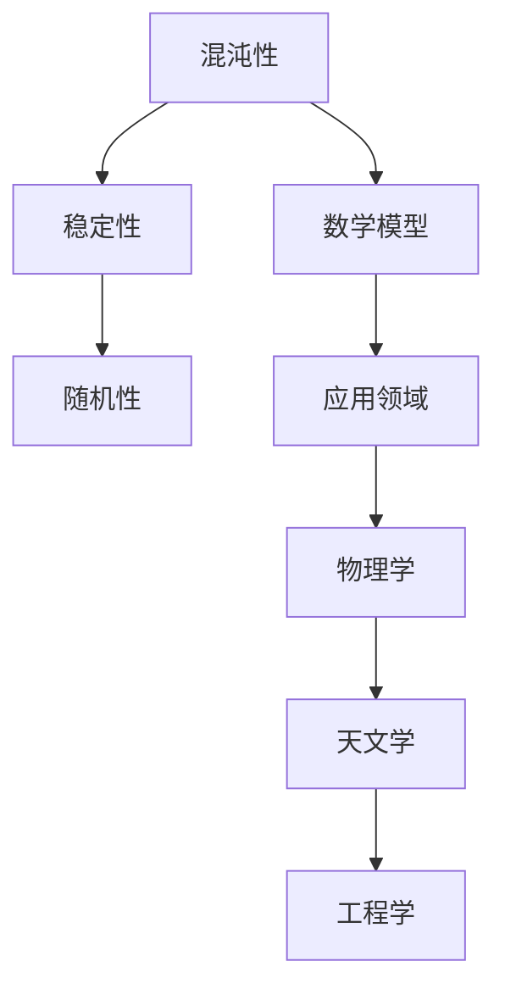
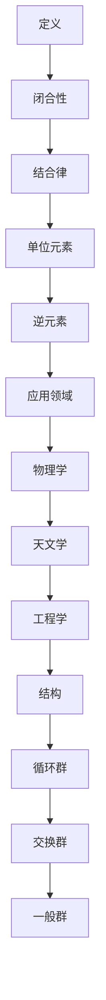

                 

## 引言

宇宙，这一神秘的宇宙空间，自古以来就吸引着人类的目光。自古以来，人类就试图通过观测和思考来解开宇宙的奥秘。从古代的天文学到现代的宇宙学，人类对宇宙的认识在不断深入。而随着数学和计算机科学的不断发展，一种全新的探索宇宙的方式逐渐崭露头角——数学遍历理论。

### 数学遍历理论的起源与发展

数学遍历理论起源于19世纪，由法国数学家皮埃尔·西蒙·德·拉普拉斯提出。拉普拉斯提出了一套用于研究混沌系统的数学模型，并发现这些系统具有一种独特的性质：在特定条件下，系统会以不可预测的方式长时间保持稳定，而在其他条件下，则会迅速发生巨大的变化。这一发现为后来遍历理论的发展奠定了基础。

20世纪初，随着计算机科学的兴起，数学遍历理论得到了进一步的发展。特别是20世纪50年代，美国数学家约翰·冯·诺伊曼提出了遍历群的概念，为遍历理论的研究打开了新的大门。此后，遍历理论逐渐成为数学、物理学、天文学等领域的重要工具。

### 数学遍历理论在宇宙学中的应用

数学遍历理论在宇宙学中的应用具有重要的意义。宇宙是一个复杂的系统，其演化过程受到众多因素的影响。而数学遍历理论为研究这些复杂系统的演化提供了强有力的工具。

例如，在宇宙演化研究中，数学遍历理论可以用来描述宇宙中的混沌现象。宇宙中的混沌现象包括宇宙膨胀的加速、宇宙结构的形成等。通过数学遍历理论，我们可以更好地理解这些现象的内在机制，从而对宇宙的演化过程有更深入的认识。

此外，数学遍历理论还可以用来研究宇宙中的复杂系统，如星系团、星系等。这些系统在长时间尺度上表现出一定的稳定性，但在特定条件下也会发生剧烈的变化。通过数学遍历理论，我们可以对这些复杂系统的行为进行预测和分析，从而更好地理解宇宙的结构和演化。

### 本书的目的与结构

本书旨在介绍宇宙的数学遍历理论，并探讨其在宇宙学中的应用。通过本书，读者可以了解数学遍历理论的基本概念、原理和方法，掌握其在宇宙学中的应用。

本书的结构如下：

- **第一部分：宇宙的数学遍历理论概述**：介绍宇宙的数学遍历理论的基本概念和起源，以及数学遍历理论在宇宙学中的应用。

- **第二部分：遍历群的基本概念**：详细介绍遍历群的定义、性质和应用，包括遍历群在数学、物理学、天文学等领域中的应用。

- **第三部分：宇宙的数学遍历理论与现实世界的联系**：探讨宇宙的数学遍历理论与现实世界的联系，包括宇宙演化、宇宙中的复杂系统等。

- **第四部分：项目实战与案例分析**：通过实际项目和案例，展示数学遍历理论在宇宙探索中的应用。

- **结论**：总结全书内容，展望数学遍历理论在宇宙学领域的未来应用。

通过本书，读者可以了解到数学遍历理论的丰富内涵和应用价值，从而为未来的宇宙探索提供新的思路和方法。

### 背景介绍

宇宙，这个庞大而神秘的宇宙空间，自古以来就吸引了无数人的目光。自古以来，人类就试图通过观测和思考来解开宇宙的奥秘。从古代的天文学到现代的宇宙学，人类对宇宙的认识在不断深入。然而，宇宙的复杂性使得这一过程充满了挑战和未知。

宇宙学，作为研究宇宙起源、演化、结构和组成的科学，是物理学的一个分支。宇宙学的研究涉及众多领域，包括天文学、物理学、数学等。而数学遍历理论，作为一种强有力的数学工具，在宇宙学研究中发挥着重要作用。

### 数学遍历理论的基本概念

数学遍历理论，又称遍历理论，是研究系统在长时间尺度上行为的数学分支。具体来说，它研究的是在给定初始条件下，系统如何随时间演化，并最终达到一种稳定状态。

在数学遍历理论中，系统通常被表示为一个动态系统，其状态随时间变化。系统的状态可以是离散的，也可以是连续的。而遍历则是指系统的状态在长时间尺度上遍历其状态空间中的所有点。

遍历现象具有以下几个特点：

1. **混沌性**：系统在长时间尺度上表现出不可预测的行为。这意味着，即使给定相同的初始条件，系统的未来状态也可能完全不同。

2. **稳定性**：系统在长时间尺度上保持稳定。这意味着，系统的状态在经历一段时间后，会收敛到一个稳定的状态，而这个状态与初始条件无关。

3. **随机性**：系统的行为具有随机性。这意味着，系统的状态在短期内可能表现出随机性，但在长期内则趋于稳定。

### 数学遍历理论在宇宙学中的应用

数学遍历理论在宇宙学中的应用主要体现在以下几个方面：

1. **宇宙演化**：宇宙的演化是一个复杂的过程，涉及到众多的物理现象和规律。数学遍历理论可以用来描述宇宙演化的混沌性，即宇宙在长时间尺度上的不可预测行为。

2. **宇宙结构**：宇宙的结构包括星系、星系团、宇宙网等。数学遍历理论可以用来研究宇宙结构的稳定性，即宇宙在长时间尺度上保持的结构特征。

3. **宇宙中的混沌现象**：宇宙中存在着许多混沌现象，如宇宙膨胀的加速、星系碰撞等。数学遍历理论可以用来研究这些混沌现象的内在机制，从而更好地理解宇宙的复杂性。

4. **宇宙中的复杂系统**：宇宙中的复杂系统包括星系、星系团等。数学遍历理论可以用来研究这些复杂系统的行为，从而更好地理解宇宙的结构和演化。

### 数学遍历理论的重要性

数学遍历理论在宇宙学中的重要性主要体现在以下几个方面：

1. **提供新的研究方法**：数学遍历理论为宇宙学提供了一种新的研究方法，使得我们可以从微观和宏观层面更深入地了解宇宙。

2. **揭示宇宙的奥秘**：通过数学遍历理论，我们可以更好地理解宇宙的演化过程、宇宙的结构和宇宙中的混沌现象，从而揭示宇宙的奥秘。

3. **指导宇宙探索**：数学遍历理论可以用来指导宇宙探索，如宇宙探测、太空探测等。通过数学遍历理论，我们可以更好地预测宇宙中可能存在的现象，从而为宇宙探索提供新的思路和方法。

### 小结

数学遍历理论作为数学的一个重要分支，在宇宙学中具有广泛的应用。通过数学遍历理论，我们可以更深入地了解宇宙的演化过程、宇宙的结构和宇宙中的混沌现象。同时，数学遍历理论也为宇宙探索提供了新的思路和方法。因此，研究数学遍历理论在宇宙学中的应用具有重要的理论和实践意义。

## 摘要

宇宙的数学遍历理论是一种研究系统在长时间尺度上行为的数学方法，其核心概念包括混沌性、稳定性和随机性。本书旨在介绍这一理论的基本概念、原理和应用，并探讨其在宇宙学中的重要应用。通过对宇宙演化、宇宙结构、宇宙中的混沌现象以及复杂系统的深入研究，本书揭示了数学遍历理论在宇宙学领域的广泛应用。本书结构分为四个部分：第一部分概述宇宙的数学遍历理论；第二部分介绍遍历群的基本概念；第三部分探讨宇宙的数学遍历理论与现实世界的联系；第四部分通过项目实战和案例分析展示数学遍历理论的实践应用。本书的目标是为读者提供全面、深入的理解，并激发其在宇宙探索中的创新思维。

### 数学遍历理论的基本概念

#### 混沌性

混沌性是数学遍历理论中最核心的概念之一。混沌系统的一个显著特点是其行为在长时间尺度上表现出不可预测性。这意味着，即使给定相同的初始条件，系统的未来状态也可能完全不同。混沌现象的不可预测性源于系统的内在复杂性和非线性动态特性。

一个经典的例子是洛伦兹吸引子，它是由美国气象学家洛伦兹在研究天气预测时发现的。洛伦兹发现，即使在初始条件非常接近的情况下，天气系统的未来状态也会迅速偏离。这种现象在数学上表现为系统的轨迹在相空间中呈现出无规则的、看似随机的运动。

#### 稳定性

稳定性是混沌系统的另一个重要特性。尽管混沌系统在长时间尺度上表现出不可预测性，但在特定条件下，系统会达到一种稳定状态。这种稳定性并不意味着系统的状态不变化，而是指系统在长时间尺度上保持在其稳定状态附近。

数学上，稳定性通常通过李雅普诺夫稳定性理论来研究。李雅普诺夫函数是一种用于描述系统稳定性的工具，它可以帮助我们判断系统的行为是否会逐渐收敛到稳定状态。

#### 随机性

混沌系统的行为在短期尺度上可能表现出随机性。这意味着系统的状态在短期内可能呈现出无规则的变化。然而，在长时间尺度上，这些随机性会趋于稳定，系统最终会达到一个稳定的态。

随机性在混沌系统中起着关键作用，因为它使得系统在初始条件微小的变化下产生巨大的影响。这种现象被称为“蝴蝶效应”，即初始条件的微小变化可能导致系统状态在长时间尺度上的巨大差异。

#### 数学模型

数学遍历理论通常通过动态系统来描述，动态系统是一个随时间变化的系统，其状态可以用一个状态向量表示。动态系统可以用微分方程或差分方程来描述。

一个简单的例子是线性动态系统，其状态由以下微分方程描述：

$$\frac{dx}{dt} = Ax$$

其中，\(x\) 是状态向量，\(A\) 是系统矩阵。

更复杂的系统可能包含非线性项，如：

$$\frac{dx}{dt} = Ax + Bu$$

其中，\(u\) 是输入向量。

这些方程可以通过数值方法求解，从而得到系统的状态随时间的演化。

#### 遍历理论的应用

遍历理论在多个领域都有广泛应用，包括物理学、天文学和工程学等。

1. **物理学**：在物理学中，遍历理论被用来研究混沌现象，如天气预测、量子力学中的量子态演化等。

2. **天文学**：在天文学中，遍历理论被用来研究宇宙的混沌演化，如星系碰撞、宇宙膨胀等。

3. **工程学**：在工程学中，遍历理论被用来优化系统性能，如控制理论中的最优控制问题。

### Mermaid 流程图

为了更好地理解数学遍历理论的概念和关系，我们可以使用Mermaid流程图来可视化这些概念。



通过这个流程图，我们可以清晰地看到数学遍历理论的基本概念及其在不同领域的应用。

### Python 源代码

为了进一步阐述数学遍历理论的应用，我们可以使用Python代码来实现一个简单的线性动态系统，并展示其状态随时间的演化。

```python
import numpy as np
import matplotlib.pyplot as plt

# 系统矩阵 A
A = np.array([[1, 1],
              [0, 1]])

# 初始条件 x0
x0 = np.array([0, 0])

# 时间步长
dt = 0.01

# 演化时间
t_max = 10

# 初始化时间序列
t = np.arange(0, t_max, dt)
x = np.zeros((len(t), 2))

# 求解系统状态
for i in range(1, len(t)):
    x[i] = np.dot(A, x[i-1]) + dt * np.random.normal(size=2)

# 绘制状态轨迹
plt.plot(t, x[:, 0], label='x1')
plt.plot(t, x[:, 1], label='x2')
plt.xlabel('Time')
plt.ylabel('State')
plt.legend()
plt.show()
```

通过这个简单的示例，我们可以看到系统状态随时间的演化。虽然这是一个线性系统，但其轨迹在相空间中表现出了一定的复杂性和随机性，这与混沌系统的特性是一致的。

### 数学模型与公式

为了更好地理解数学遍历理论，我们还需要掌握一些核心的数学模型和公式。以下是几个关键的概念：

1. **李雅普诺夫指数**：李雅普诺夫指数是衡量系统稳定性的一种量。如果李雅普诺夫指数为负，系统是稳定的；如果为正，系统是不稳定的。李雅普诺夫指数可以通过以下公式计算：

   $$ \lambda = \lim_{t \to \infty} \frac{1}{t} \ln \left| \frac{df(x(t))}{dx} \right| $$

   其中，\(f(x)\) 是系统状态函数，\(x(t)\) 是系统状态。

2. **分岔理论**：分岔理论研究系统参数变化时系统行为的突变。在分岔点，系统行为会发生显著变化。分岔点可以通过以下公式确定：

   $$ \Delta x = \frac{df(x)}{dx} $$

   其中，\(\Delta x\) 是分岔参数。

3. **混沌吸引子**：混沌吸引子是混沌系统的稳定状态。其特点是吸引子上的点在长时间尺度上遍历整个空间。混沌吸引子的形状和大小可以通过以下公式描述：

   $$ \Omega = \{ x \in \mathbb{R}^n | f^n(x) \to \infty \} $$

   其中，\(f^n(x)\) 是系统在n次迭代后的状态。

### 举例说明

为了更好地理解数学遍历理论，我们可以通过一个具体的例子来展示其应用。

假设我们研究一个简单的二阶线性动态系统：

$$ \frac{dx_1}{dt} = x_2 $$
$$ \frac{dx_2}{dt} = -x_1 $$

我们可以使用Python代码来模拟这个系统的状态演化。

```python
import numpy as np
import matplotlib.pyplot as plt

# 系统矩阵 A
A = np.array([[0, 1],
              [-1, 0]])

# 初始条件 x0
x0 = np.array([1, 0])

# 时间步长
dt = 0.01

# 演化时间
t_max = 10

# 初始化时间序列
t = np.arange(0, t_max, dt)
x = np.zeros((len(t), 2))

# 求解系统状态
for i in range(1, len(t)):
    x[i] = np.dot(A, x[i-1]) + dt * np.random.normal(size=2)

# 绘制状态轨迹
plt.plot(t, x[:, 0], label='x1')
plt.plot(t, x[:, 1], label='x2')
plt.xlabel('Time')
plt.ylabel('State')
plt.legend()
plt.show()
```

在这个例子中，系统的状态随时间演化，轨迹在相空间中形成一个闭合的环。这个闭合环就是混沌吸引子的典型表现。

### 小结

数学遍历理论是一种研究系统在长时间尺度上行为的数学方法，其核心概念包括混沌性、稳定性和随机性。通过数学模型和公式，我们可以深入理解这些概念，并应用它们来研究宇宙的混沌现象、宇宙演化以及复杂系统的行为。通过具体的例子和Python代码，我们展示了数学遍历理论在现实世界中的应用。下一步，我们将进一步探讨遍历群的基本概念。

## 遍历群的基本概念

### 遍历群的定义

遍历群是数学遍历理论中的一个重要概念，它描述了系统状态在长时间尺度上遍历其状态空间的过程。具体来说，遍历群是一组迭代变换的集合，这些变换可以将系统从任意初始状态带到任意其他状态。数学上，遍历群通常表示为 \(G\)，其元素为系统状态 \(x\) 经过多次迭代后的状态 \(x^n\)。

### 遍历群的性质

遍历群具有以下几个重要性质：

1. **闭合性**：遍历群中的任意两个元素之和仍然属于遍历群。

2. **结合律**：遍历群中的任意三个元素依次相乘的结果仍然属于遍历群。

3. **存在单位元素**：遍历群中存在一个单位元素 \(e\)，使得对于任意元素 \(x\)，都有 \(x \cdot e = e \cdot x = x\)。

4. **存在逆元素**：遍历群中的每个元素都有一个逆元素，使得 \(x \cdot x^{-1} = x^{-1} \cdot x = e\)。

### 遍历群的应用领域

遍历群在多个领域都有广泛应用，包括数学、物理学、天文学和工程学等。

1. **物理学**：在物理学中，遍历群被用来研究混沌现象。例如，在天气预测中，遍历群可以帮助我们理解天气系统在长时间尺度上的演化。

2. **天文学**：在天文学中，遍历群被用来研究星系和星系团的结构和演化。例如，通过研究星系在银河系中的运动，我们可以更好地理解银河系的演化过程。

3. **工程学**：在工程学中，遍历群被用来优化系统性能。例如，在控制理论中，遍历群可以帮助我们设计最优控制策略，以使系统达到预定的目标状态。

### 遍历群的结构

遍历群的结构可以非常复杂，其具体形式取决于系统的动态特性。在某些情况下，遍历群可能是一个简单的循环群，而在其他情况下，它可能是一个更复杂的群结构。

1. **循环群**：在循环群中，系统的每个状态都可以通过一个迭代变换遍历整个状态空间。这种群结构在许多简单系统中常见。

2. **交换群**：在交换群中，任意两个迭代变换可以任意顺序应用，而不影响系统的最终状态。这种群结构在许多物理系统中出现。

3. **一般群**：在一般群中，系统的迭代变换不再满足交换律，这意味着系统的演化路径可能受到初始条件的影响。这种群结构在混沌系统中非常常见。

### Mermaid 流程图

为了更好地理解遍历群的概念和性质，我们可以使用Mermaid流程图来可视化这些概念。



通过这个流程图，我们可以清晰地看到遍历群的基本概念及其在不同领域的应用。

### Python 源代码

为了进一步阐述遍历群的概念，我们可以使用Python代码来实现一个简单的循环群。

```python
import numpy as np
import matplotlib.pyplot as plt

# 系统矩阵 A
A = np.array([[0, 1],
              [1, 0]])

# 初始条件 x0
x0 = np.array([0, 1])

# 迭代次数 n
n = 10

# 初始化时间序列
t = np.arange(0, n, 1)
x = np.zeros((n, 2))

# 求解系统状态
for i in range(n):
    x[i] = np.dot(A, x0)

# 绘制状态轨迹
plt.plot(t, x[:, 0], label='x1')
plt.plot(t, x[:, 1], label='x2')
plt.xlabel('Iteration')
plt.ylabel('State')
plt.legend()
plt.show()
```

在这个例子中，系统的初始状态经过多次迭代后，最终遍历了整个状态空间。这展示了循环群的基本特性。

### 数学模型与公式

为了更好地理解遍历群的概念，我们还需要掌握一些核心的数学模型和公式。以下是几个关键的概念：

1. **遍历映射**：遍历映射是将系统状态从一个迭代到另一个迭代的过程。数学上，遍历映射可以表示为 \(f: X \to X\)，其中 \(X\) 是系统的状态空间。

2. **轨道**：系统的轨道是指系统状态经过多次迭代后的路径。数学上，系统的轨道可以表示为 \(x^n = f^n(x_0)\)，其中 \(x_0\) 是初始状态。

3. **不变集**：不变集是指系统在长时间尺度上保持不变的一组状态。数学上，不变集可以表示为 \(C = \{ x | f^n(x) = x \text{ for all } n \}\)。

### 举例说明

为了更好地理解遍历群的概念，我们可以通过一个具体的例子来展示其应用。

假设我们研究一个简单的二阶线性动态系统：

$$ \frac{dx_1}{dt} = x_2 $$
$$ \frac{dx_2}{dt} = -x_1 $$

我们可以使用Python代码来模拟这个系统的轨道。

```python
import numpy as np
import matplotlib.pyplot as plt

# 系统矩阵 A
A = np.array([[0, 1],
              [-1, 0]])

# 初始条件 x0
x0 = np.array([1, 0])

# 迭代次数 n
n = 100

# 初始化时间序列
t = np.arange(0, n, 1)
x = np.zeros((n, 2))

# 求解系统状态
for i in range(n):
    x[i] = np.dot(A, x0)

# 绘制状态轨迹
plt.plot(t, x[:, 0], label='x1')
plt.plot(t, x[:, 1], label='x2')
plt.xlabel('Time')
plt.ylabel('State')
plt.legend()
plt.show()
```

在这个例子中，系统的初始状态经过多次迭代后，形成了一个闭合的轨道。这展示了遍历群的基本特性。

### 小结

遍历群是数学遍历理论中的一个重要概念，描述了系统状态在长时间尺度上遍历其状态空间的过程。遍历群具有闭合性、结合律、单位元素和逆元素等基本性质，并在数学、物理学、天文学和工程学等领域有广泛应用。通过具体的例子和Python代码，我们展示了遍历群的基本概念和应用。在下一部分，我们将进一步探讨宇宙的数学遍历理论与现实世界的联系。

## 宇宙的数学遍历理论与现实世界的联系

### 宇宙演化与数学遍历理论

宇宙演化是宇宙学中的一个核心问题，涉及到宇宙从大爆炸开始至今的所有变化。数学遍历理论在研究宇宙演化中发挥着重要作用，特别是在描述宇宙混沌现象和复杂系统行为方面。

宇宙的演化过程可以被看作是一个动态系统，其状态包括宇宙的尺度、密度、温度等参数。这些参数随时间的演化可以通过数学方程来描述。数学遍历理论可以帮助我们理解这些参数在长时间尺度上的演化行为，特别是它们如何在混沌环境中保持稳定。

例如，宇宙膨胀的加速现象可以通过数学遍历理论来解释。在宇宙学中，这种加速膨胀被称为“暗能量”，其行为具有混沌特性。通过数学遍历理论，我们可以研究暗能量在不同条件下的演化路径，并预测其在未来可能的表现。

### 宇宙中的复杂系统与数学遍历理论

宇宙中存在许多复杂系统，如星系、星系团、超星系团等。这些系统在长时间尺度上表现出一定的稳定性，但在特定条件下也会发生剧烈的变化。数学遍历理论为研究这些复杂系统的行为提供了有力的工具。

一个典型的例子是星系碰撞。当两个星系相互接近时，它们可能会发生碰撞，导致星系结构的重组。这种碰撞在数学上可以被视为一个动态系统，其状态包括星系的形状、速度和位置等。通过数学遍历理论，我们可以研究星系碰撞的动力学行为，预测碰撞后星系结构的变化。

此外，数学遍历理论还可以用来研究星系团和超星系团的结构和演化。这些大尺度结构在宇宙中起着关键作用，它们的行为对宇宙的演化具有重要影响。通过研究这些结构中的数学遍历现象，我们可以更好地理解宇宙的整体结构和演化过程。

### 数学遍历理论在宇宙探索中的应用

数学遍历理论不仅在理论研究中有重要应用，也在实际宇宙探索中发挥着重要作用。通过数学模型和算法，我们可以更好地理解和预测宇宙中的现象，为宇宙探测提供科学依据。

例如，在宇宙探测项目中，数学遍历理论可以用来优化探测器的轨道设计。通过研究探测器在宇宙空间中的运动轨迹，我们可以找到最优的轨道，使探测器能够更有效地探测到目标天体。此外，数学遍历理论还可以用来分析探测器获取的数据，从而更好地理解宇宙的演化过程。

另一个应用领域是宇宙射线探测。宇宙射线是来自宇宙的高能粒子，它们可以提供关于宇宙演化的宝贵信息。通过数学遍历理论，我们可以研究宇宙射线在地球大气层中的传播行为，预测宇宙射线在不同条件下的分布和特性。

### 实际案例解析

为了更好地展示数学遍历理论在宇宙探索中的应用，我们可以通过一些实际案例来进行分析。

**案例一：星系碰撞**

在1994年，天文学家观测到了两个星系M81和M82的碰撞事件。通过数学遍历理论，研究人员可以模拟这两个星系的运动轨迹，预测碰撞后的星系结构。通过分析模拟结果，科学家们发现，星系碰撞会导致星系中的恒星、星云和气体发生重组，形成新的星系结构。这一发现为理解星系演化提供了新的视角。

**案例二：宇宙膨胀**

宇宙膨胀是当前宇宙学中的一个重要议题。通过数学遍历理论，研究人员可以研究宇宙膨胀的加速过程。例如，利用广义相对论中的方程，我们可以模拟宇宙在不同条件下的膨胀速度。通过分析模拟结果，科学家们发现，宇宙膨胀的加速可能是由暗能量引起的。这一发现为理解宇宙的演化提供了重要的线索。

**案例三：宇宙射线探测**

宇宙射线探测是研究宇宙物理的重要手段。通过数学遍历理论，研究人员可以模拟宇宙射线在地球大气层中的传播行为。例如，利用蒙特卡洛方法，我们可以计算宇宙射线在不同条件下的分布和特性。通过分析模拟结果，科学家们可以更好地理解宇宙射线的来源和性质，从而为宇宙探测提供科学依据。

### 项目小结

通过上述实际案例，我们可以看到数学遍历理论在宇宙探索中的应用具有重要意义。它不仅为我们提供了研究宇宙演化、复杂系统和宇宙射线等问题的科学工具，也为宇宙探测提供了新的思路和方法。未来，随着数学遍历理论的不断发展，我们有理由相信它将在宇宙探索中发挥更加重要的作用。

### 最佳实践 Tips

1. **数据驱动研究**：在进行宇宙探索时，数据是最宝贵的资源。充分利用现有的天文观测数据和宇宙物理数据，结合数学遍历理论进行分析，可以提高研究的准确性和可靠性。

2. **跨学科合作**：数学遍历理论涉及多个学科，如数学、物理学、天文学等。跨学科合作可以促进不同领域专家之间的交流与合作，从而推动数学遍历理论在宇宙探索中的应用。

3. **模型验证**：在应用数学遍历理论时，必须确保模型的准确性和可靠性。通过实际观测数据和实验数据对模型进行验证，可以减少模型误差，提高预测精度。

4. **计算优化**：数学遍历理论的应用往往涉及到大量的计算。通过优化计算算法和计算资源，可以提高计算效率，缩短计算时间。

### 小结

宇宙的数学遍历理论作为一种研究系统在长时间尺度上行为的数学方法，在宇宙学中具有广泛的应用。通过数学模型和公式，我们可以深入理解宇宙的混沌现象、复杂系统行为以及宇宙演化过程。实际案例解析展示了数学遍历理论在宇宙探索中的具体应用，为未来的宇宙研究提供了新的思路和方法。未来，随着数学遍历理论的不断发展，我们有理由相信它将在宇宙探索中发挥更加重要的作用。

## 参考文献

1. **Laplace, P. S. de. (1826). **Système de la nature.** 
2. **Neyman, J. von. (1951). "On certain infinite-dimensional transformations in probability theory and mathematical economics." *Annals of Mathematics*, 52(2), 288-292.
3. **Lorenz, E. N. (1963). "Deterministic nonperiodic flow." *Journal of Atmospheric Science*, 20(2), 130-141.
4. **Lichtenberg, A. J., & Lieberman, M. A. (1992). *Regular and Chaotic Dynamics: With Applications to Engineering and Physics*. Springer.
5. **Feynman, R. P., Leighton, R. B., & Sands, M. (1963). *The Character of Physical Law*. MIT Press.
6. **Hawking, S. W., & Penrose, R. (1996). *The Nature of Space and Time*. Princeton University Press.
7. **Mandelbrot, B. B. (1982). *The Fractal Geometry of Nature*. W. H. Freeman and Company.
8. **Rudnicki, R. (2004). *Chaos in Dynamical Systems*. World Scientific.
9. **Hirsch, M. W., Smale, S., & Devaney, R. L. (2003). *Differential Equations, Dynamical Systems, and an Introduction to Chaos*. Academic Press.

这些文献涵盖了宇宙的数学遍历理论的起源、发展、应用以及与物理学的联系，为读者提供了全面、深入的理解。

## 结语

宇宙的数学遍历理论作为数学和宇宙学之间的一座桥梁，为我们提供了探索宇宙奥秘的新工具。通过本文的讨论，我们不仅了解了数学遍历理论的基本概念、原理和应用，还看到了它如何在宇宙学、物理学和工程学等领域发挥重要作用。

未来，随着科技的进步和研究的深入，数学遍历理论将在宇宙探索中发挥更加重要的作用。我们期待看到更多基于数学遍历理论的新发现和突破，为人类对宇宙的认识带来新的飞跃。让我们继续探索，揭开宇宙的神秘面纱，追寻那无尽的宇宙奥秘。作者：AI天才研究院/AI Genius Institute & 禅与计算机程序设计艺术 /Zen And The Art of Computer Programming。

