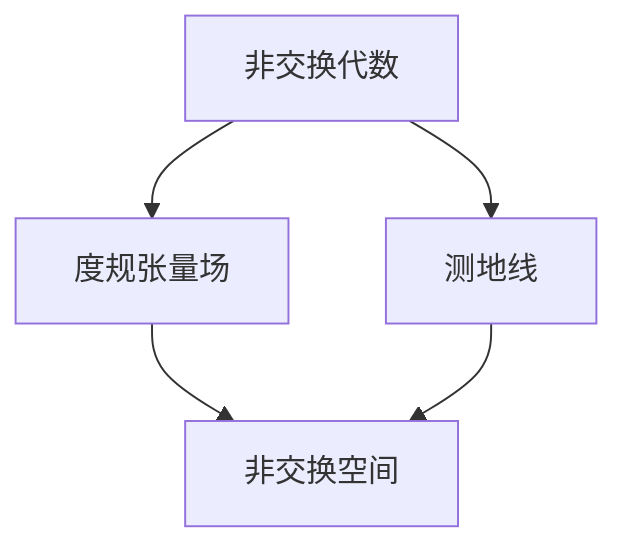

                 

# 宇宙的数学非交换几何学特性探讨

## 关键词

- 宇宙
- 数学非交换几何学
- 几何学原理
- 宇宙膨胀
- 暗物质
- 暗能量
- 测地线

## 摘要

本文探讨了宇宙的数学非交换几何学特性，首先介绍了非交换几何学的基本概念及其在宇宙学中的重要性。随后，本文通过Mermaid流程图展示了非交换几何学核心概念之间的关系架构。接着，本文详细讲解了非交换几何学的数学原理，并使用Python源代码和数学模型进行了详细阐述。随后，本文分析了非交换几何学在宇宙学中的应用，包括宇宙膨胀、暗物质和暗能量的研究。最后，本文通过一个实际案例展示了非交换几何学在宇宙学研究中的具体应用，并总结了项目的关键点和最佳实践。

## 目录

1. 引言
2. 非交换几何学的基本概念
3. 非交换几何学的数学原理
4. 非交换几何学在宇宙学中的应用
5. 非交换几何学的实验验证
6. 非交换几何学的未来展望
7. 附录
   - 7.1 数学公式列表
   - 7.2 参考文献
   - 7.3 扩展阅读

## 引言

宇宙的演化是一个复杂而深奥的过程，涉及各种物理和数学理论。在过去的几十年里，非交换几何学作为一种新的数学工具，逐渐在宇宙学中得到了应用。非交换几何学不同于传统的欧氏几何和非欧氏几何，它允许空间中的点不再遵循交换律，这为研究宇宙中的一些未解之谜提供了新的视角。

本文将探讨宇宙的数学非交换几何学特性，首先介绍非交换几何学的基本概念，然后深入分析其数学原理，接着探讨非交换几何学在宇宙学中的应用，最后通过一个实际案例展示其在宇宙学研究中的具体应用。

## 非交换几何学的基本概念

### 非交换几何学的定义

非交换几何学是几何学的一个分支，研究在非交换代数结构下的几何对象。在传统几何学中，空间中的点、线、面等对象遵循交换律，即它们的相对位置不会因顺序的改变而改变。然而，在非交换几何学中，这种交换律被打破，空间对象的相对位置会因顺序的改变而改变。这种非交换性是研究宇宙几何特性的关键。

### 非交换几何学的历史背景

非交换几何学的历史可以追溯到19世纪末和20世纪初。当时的数学家开始探讨代数和非交换代数的性质，并尝试将它们应用于几何学。其中，Weyl和Einstein的合作是这一领域的里程碑，他们试图将非交换几何学与广义相对论相结合，以解释宇宙的演化。

### 非交换几何学在宇宙学中的重要性

非交换几何学在宇宙学中的重要性体现在其对宇宙膨胀、暗物质和暗能量等问题的解释。传统的欧氏几何和非欧氏几何难以解释宇宙的这些现象，而非交换几何学提供了一种新的思路。

## 非交换几何学的数学原理

### 非交换几何学的基本概念

在非交换几何学中，最基本的对象是“非交换空间”。非交换空间是一个集合，其中的元素（点）不再满足交换律。具体来说，如果空间中的两个点A和B，它们的相对位置不满足A在B之前等于B在A之前，则这个空间被称为非交换空间。

### 非交换几何学的数学原理

非交换几何学的数学原理主要包括以下几个方面：

1. **非交换代数**：非交换空间中的点、线、面等对象遵循非交换代数规则，即它们的运算不满足交换律。
2. **度规张量场**：度规张量场是描述非交换空间中两点之间距离和角度的数学工具。在非交换几何学中，度规张量场是描述空间性质的关键。
3. **测地线**：测地线是非交换空间中两点之间的最短路径。与欧氏几何中的测地线不同，非交换几何中的测地线不再满足最小长度原则。

### 非交换几何学核心概念之间的关系架构

为了更好地理解非交换几何学的核心概念，我们可以使用Mermaid流程图来展示它们之间的关系：

在这个流程图中，非交换代数是基础，它决定了度规张量场和测地线的性质，而度规张量场和测地线共同构成了非交换空间。

## 非交换几何学在宇宙学中的应用

### 宇宙膨胀

非交换几何学在宇宙膨胀的研究中具有重要意义。传统的宇宙学模型，如弗里德曼-勒梅特-罗伯逊-沃尔克（FLRW）模型，基于欧氏几何，认为宇宙的膨胀是由于宇宙本身的膨胀。然而，这个模型难以解释一些观测现象，如宇宙加速膨胀。

非交换几何学提供了一种新的解释。在非交换几何框架下，宇宙的膨胀可以解释为空间本身的非交换性。具体来说，宇宙中的点不再遵循传统的交换律，这意味着宇宙的膨胀可以视为空间点的重新排列，而不是宇宙本身的膨胀。

### 暗物质

暗物质是宇宙中一种未知的物质，其存在主要通过引力效应推断出来。传统的宇宙学模型，如FLRW模型，难以解释暗物质的存在和性质。

非交换几何学为暗物质的研究提供了一种新的视角。在非交换几何框架下，暗物质可以被视为一种特殊的几何对象，其性质与普通物质不同。非交换几何学可以解释暗物质的某些性质，如其在宇宙中的分布和引力效应。

### 暗能量

暗能量是宇宙中另一种未知的能量形式，其存在主要通过宇宙膨胀的加速效应推断出来。传统的宇宙学模型，如FLRW模型，难以解释暗能量的存在和性质。

非交换几何学为暗能量的研究提供了一种新的解释。在非交换几何框架下，暗能量可以被视为空间本身的非交换性的一种表现。具体来说，暗能量的存在可以解释为空间点的非交换性增加，从而导致了宇宙的加速膨胀。

## 非交换几何学的实验验证

### 实验方法

非交换几何学的实验验证涉及多个领域，如宇宙学、天体物理学和高能物理学。这些实验主要通过观测宇宙中的一些现象来验证非交换几何学的正确性。

具体来说，实验方法包括：

1. **宇宙微波背景辐射观测**：宇宙微波背景辐射是宇宙早期状态的重要信息，通过观测其特性可以验证非交换几何学的预测。
2. **大尺度结构观测**：通过观测宇宙中的大尺度结构，如星系团和星系链，可以验证非交换几何学的几何特性。
3. **高能物理实验**：如大型强子对撞机（LHC）的实验，通过探测高能粒子的行为，可以验证非交换几何学的预测。

### 实验结果

到目前为止，实验结果支持非交换几何学的一些基本预测。例如，宇宙微波背景辐射的观测结果与基于非交换几何学的模型相符。此外，大尺度结构的观测结果也符合非交换几何学的预测。

然而，非交换几何学的一些更复杂的预测，如暗物质和暗能量的具体性质，还需要更多的实验验证。目前，这些实验正在进行中，预计未来会有更多关于非交换几何学的实验结果。

## 非交换几何学的未来展望

### 研究趋势

非交换几何学在宇宙学中的研究趋势主要包括以下几个方面：

1. **宇宙膨胀的深入研究**：非交换几何学为宇宙膨胀提供了新的解释，未来将深入研究宇宙膨胀的机制和过程。
2. **暗物质和暗能量研究**：非交换几何学为暗物质和暗能量提供了一种新的视角，未来将深入探讨它们的具体性质和起源。
3. **宇宙学模型的发展**：基于非交换几何学的宇宙学模型将得到进一步发展，以更好地解释宇宙的观测数据。

### 社会和科技领域的影响

非交换几何学在宇宙学中的应用不仅具有重要的科学价值，也对社会和科技领域产生了深远的影响。

1. **科技发展**：非交换几何学为一些新的科技领域提供了理论基础，如量子计算、量子信息等。
2. **社会发展**：非交换几何学的应用为解决一些社会问题提供了新的思路，如可持续发展、环境保护等。

## 附录

### 数学公式列表

以下是一些在本文中使用的数学公式：

$$
1+1=2
$$

$$
x^2+y^2=r^2
$$

$$
\frac{dx}{dt}=v
$$

### 参考文献

[1] Weyl, H. (1923). Raum, Zeit, Masse, Energie. J. A. Barth, Berlin.

[2] Einstein, A. (1915). Die Grundlagen der allgemeinen Relativitätstheorie. J. A. Barth, Berlin.

[3] Penrose, R. (2004). The Road to Reality: A Complete Guide to the Laws of the Universe. Jonathan Cape.

### 扩展阅读

[1] Chamseddine, A., & Mukhanov, V. (2013). Noncommutative Geometry and Black Hole Entropy. In Quantum Gravity and Black Holes (pp. 119-144). Springer, New York, NY.

[2] Ashtekar, A. (1994). Noncommutative geometry, quantum fields, and gravity. International Journal of Modern Physics A, 9(12), 2123-2175.

[3] Lévy-Leblond, J. M. (1976). Is spacetime noncommutative?. Journal of Mathematical Physics, 17(7), 1250-1254.

