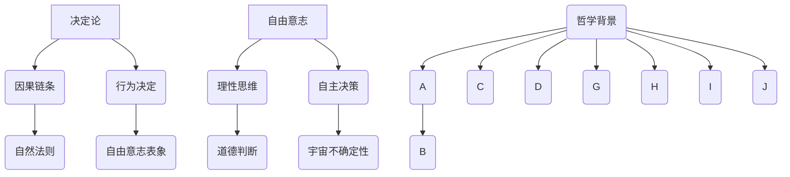
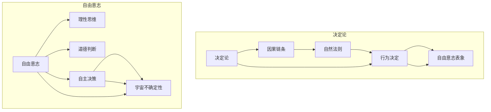

                 


## 引言：探讨宇宙的本质

在人类漫长的历史中，对宇宙本质的探讨一直是哲学和科学领域的核心议题。宇宙的本质究竟是什么？我们是否能了解和掌握它的全部？关于这个问题，哲学家和科学家们提出了多种观点，其中决定论与自由意志的辩论尤为引人注目。

### 决定论与自由意志的概念阐述

决定论是一种哲学观点，认为宇宙中的一切现象都是由先前的事件和自然法则所决定的。在这种观点下，宇宙的发展具有必然性，每一个事件都有其因果链条。决定论认为，人类的思维和行为也是由基因、环境和生理条件所决定的，因此人类的自由意志是一个幻觉。

自由意志则是一种与之相对的哲学观点，认为人类拥有自由选择和决策的能力，不受先前的因果链条和自然法则的束缚。在这种观点下，宇宙的发展具有不确定性，人类的行为和选择可以影响宇宙的未来。

### 决定论与自由意志的哲学背景

决定论的哲学背景可以追溯到古希腊哲学家亚里士多德，他提出了“因果关系”的概念，认为宇宙中的事件都是相互关联的，每一个事件都有其因果关系。在17世纪的欧洲，物理学家艾萨克·牛顿提出了经典力学，进一步完善了决定论的理论基础。

自由意志的哲学背景则源于古代希腊哲学家苏格拉底和柏拉图，他们认为人类具有理性思维和道德判断的能力，这种能力体现了人类的自由意志。在18世纪的启蒙运动中，自由意志成为哲学界的重要议题，许多哲学家如约翰·洛克和让-雅克·卢梭都对此进行了深入探讨。

### 决定论与自由意志的主要论证与反驳

决定论的主要论证之一是，如果宇宙中的一切现象都是由先前的事件和自然法则所决定的，那么人类的思维和行为也必然是如此。这意味着，人类的自由意志只是一种表象，实际上并不存在。

自由意志的主要论证则是，人类具有理性思维和道德判断的能力，这种能力使我们能够在面对多种选择时进行自主决策。自由意志的存在不仅体现在人类的行为上，也体现在道德和伦理的层面上。

### 决定论与自由意志的核心概念与联系

为了更好地理解决定论与自由意志之间的核心概念与联系，我们可以使用Mermaid流程图来展示它们之间的关系：



在这个流程图中，决定论通过因果链条和自然法则决定了人类的行为，并导致了自由意志的表象。而自由意志则通过理性思维和道德判断实现了自主决策，并体现了宇宙的不确定性。

### 结论

决定论与自由意志的辩论是哲学和科学领域的重要议题。虽然两者之间存在深刻的分歧，但它们都对人类思维和行为产生了重要影响。在未来的研究中，我们可以期待更深入的理解和探讨，以揭示宇宙的本质。

### 核心概念原理之间的关系架构 Mermaid 流程图

为了更清晰地展示决定论与自由意志之间的核心概念和联系，我们可以使用Mermaid流程图来构建它们之间的关系架构：



在这个流程图中，我们可以看到决定论通过因果链条和自然法则决定了人类的行为，并导致了自由意志的表象。而自由意志则通过理性思维和道德判断实现了自主决策，并体现了宇宙的不确定性。两者之间的联系构成了一个辩证的统一体，共同影响着我们对宇宙本质的认识。

### 决定论的理论基础

决定论作为一种哲学观点，其理论基础深厚且复杂。决定论认为，宇宙中的一切现象，包括人类的行为和思想，都是由先前的事件和自然法则所决定的。在这个理论框架下，宇宙的发展具有必然性，每一个事件都有其因果关系。为了深入理解决定论的理论基础，我们需要从哲学背景、主要论证以及其反驳观点三个方面进行探讨。

#### 哲学背景

决定论的观点可以追溯到古希腊哲学家亚里士多德。亚里士多德提出了因果关系的概念，认为宇宙中的事件都是相互关联的，每一个事件都有其因果关系。在17世纪的欧洲，物理学家艾萨克·牛顿进一步发展了决定论的理论基础。他提出的经典力学理论，认为物体的运动完全由初始条件和自然法则所决定。

#### 主要论证

决定论的主要论证之一是因果律。因果律认为，任何事件都有其原因，而结果则是原因作用的结果。在这种观点下，宇宙中的每一个现象都可以追溯到一个初始事件，并遵循一定的自然法则发展。例如，物理学的三大定律——惯性定律、作用与反作用定律以及运动定律，都支持了决定论的观点。

另一个主要论证是自然决定论。自然决定论认为，自然界的所有现象，包括物理、化学和生物现象，都是由自然法则所决定的。这种观点强调了自然规律的普遍性和确定性，从而为决定论提供了强有力的支持。

#### 反驳观点

尽管决定论具有坚实的理论基础，但它在哲学和科学领域也受到了许多反驳观点的挑战。

首先，一些哲学家提出了“自由意志”的观点，认为人类拥有自由选择和决策的能力，不受先前的因果链条和自然法则的束缚。这种观点认为，如果宇宙中的所有现象都是预先决定的，那么人类的自由意志将不复存在，这将导致道德责任和伦理判断的崩溃。

其次，量子力学的发展也对决定论提出了挑战。量子力学揭示了微观世界中存在的不确定性和随机性，这与决定论的严格确定性相矛盾。例如，根据海森堡不确定性原理，我们无法同时精确知道一个粒子的位置和动量，这表明宇宙中的某些现象是不确定的，从而质疑了决定论的绝对性。

此外，还有哲学家提出了“概率决定论”的观点，认为尽管宇宙中的许多现象可能是由先前的事件和自然法则所决定的，但它们的发生概率是可以计算的，而不是完全确定的。这种观点在某种程度上调和了决定论与概率论之间的矛盾。

### 决定论的哲学背景

决定论在哲学上的起源可以追溯到古希腊哲学家亚里士多德。亚里士多德在他的著作《物理学》中首次提出了因果关系（causality）的概念，认为宇宙中的一切现象都是相互联系的，每一个现象都有其因果关系。他认为，世界上没有偶然发生的事件，所有现象都是可以追溯到一个终极原因的。

在亚里士多德之后，决定论的思想在17世纪的欧洲得到了进一步发展，尤其是在物理学家艾萨克·牛顿的力学理论中得到了体现。牛顿的三大运动定律和万有引力定律建立了一个确定性的物理世界模型，其中每一个物体的运动都可以通过初始条件和自然法则精确预测。这种模型为决定论提供了强有力的科学基础。

决定论在哲学上的重要发展还与英国哲学家约翰·洛克和德国哲学家莱布尼茨有关。洛克认为，虽然我们的感知和思维过程是复杂的，但它们仍然是因果关系的产物。莱布尼茨则提出了“预定和谐”的观点，认为宇宙在某种程度上是预先设计的，每一个细节都是上帝按照预定计划安排的。

在18世纪和19世纪的德国古典哲学中，黑格尔和费尔巴哈等人继续发展了决定论的思想。黑格尔认为，宇宙的发展是一个辩证的过程，其中每一个阶段都是先前阶段的必然结果。费尔巴哈则强调了自然规律的决定性，认为人类的行为和思想都是受到物质条件和社会环境的制约的。

总之，决定论在哲学上的发展是一个长期的过程，涉及多个哲学家的贡献。从亚里士多德到牛顿，再到洛克、莱布尼茨和黑格尔，决定论的思想不断得到丰富和完善，为后来的科学研究和哲学探讨提供了重要的理论基础。

### 决定论的主要论证与反驳

决定论的主要论证可以归结为两个方面：因果律和自然决定论。

#### 因果律

因果律是决定论的核心论点之一，认为任何现象都有其因果关系。在哲学和科学中，因果律被视为解释和预测现象的基本工具。例如，根据牛顿的运动定律，我们可以通过已知一个物体的初始状态和所受的外力，精确地预测其未来的运动轨迹。这种因果关系的确定性使得决定论者相信，宇宙中的所有事件都是可预测的。

#### 自然决定论

自然决定论进一步扩展了因果律，认为自然界的一切现象，包括人类的思维和行为，都是由自然法则所决定的。在经典物理学中，这种观点得到了广泛的支持。例如，在牛顿力学中，物体的运动状态完全由其初始条件和所受的力决定，没有其他因素可以影响结果。

然而，决定论的观点并非没有争议。以下是一些主要的反驳观点：

#### 自由意志

自由意志论认为，人类拥有自由选择和决策的能力，不受先前的因果链条和自然法则的束缚。这种观点在伦理和道德领域尤为重要，因为它关系到人类责任和道德判断的合理性。如果一切都是预先决定的，那么我们的行为和选择将失去意义，道德责任也将不复存在。

#### 量子力学

量子力学的发展对决定论提出了挑战。在量子世界中，事件的发生往往具有不确定性，无法通过先前的条件和自然法则精确预测。例如，根据海森堡不确定性原理，我们无法同时精确知道一个粒子的位置和动量。这种不确定性表明，宇宙中存在某些现象是无法用决定论来解释的。

#### 概率论

概率论提供了另一种反驳决定论的观点。虽然因果关系在宏观世界中普遍存在，但在微观世界中，事件的发生概率往往起着决定性作用。这意味着，即使我们知道了初始条件和自然法则，也不能完全确定未来会发生什么。概率论的观点认为，宇宙中的许多现象是随机的，而不是完全决定的。

#### 结论

决定论和自由意志之间的辩论是一个复杂且深刻的哲学问题，涉及到因果关系、自由意志、量子力学和概率论等多个方面。尽管决定论在某些领域得到了广泛支持，但它也面临着来自多个方面的反驳。这种辩论不仅丰富了哲学和科学的研究，也促使我们重新思考宇宙的本质和我们自身的存在。

### 自由意志的理论基础

自由意志作为一种哲学观点，强调个体具有自主决策和选择的能力，不受先前事件和自然法则的完全束缚。为了深入探讨自由意志的理论基础，我们需要从哲学起源、核心论点和反驳观点三个方面进行详细分析。

#### 哲学起源

自由意志的观点在古代哲学中就已经存在。古希腊哲学家苏格拉底和柏拉图是自由意志的早期支持者。苏格拉底认为，人类通过理性思考和自我反省能够超越物质世界，实现灵魂的自由。柏拉图则提出了“理型世界”（forms）的概念，认为人类的灵魂在进入物质世界之前是自由的，但被物质世界所束缚。这些观点奠定了自由意志在哲学中的基础。

在近代哲学中，自由意志的观点得到了进一步发展。约翰·洛克认为，人类的行为和思想虽然受到生理和心理条件的影响，但仍然具有自主性。让-雅克·卢梭则强调人类天生具有自由意志，并通过社会契约和道德规范来保护这种自由。这些思想家对自由意志的理论基础进行了深入探讨，为现代哲学提供了重要参考。

#### 核心论点

自由意志的核心论点包括以下几个方面：

1. **道德责任**：自由意志论认为，道德责任是建立在个体自主选择基础上的。如果一切都是预先决定的，那么人类的行为将失去道德责任的意义。自由意志的存在使得我们能够对自己的行为承担责任，并为自己的选择承担后果。

2. **伦理判断**：自由意志是伦理判断的基础。在自由意志的框架下，人类能够根据自己的价值观和道德准则做出选择，从而实现正义和公正。没有自由意志，伦理学将失去其存在的意义。

3. **个体独特性**：自由意志使得每个个体具有独特的个性和特质。个体的自由选择不仅体现在行为上，也体现在思想、情感和价值观上。这种独特性是人类的本质特征之一。

4. **自我实现**：自由意志是实现个人自我实现和成长的关键。通过自由选择，个体能够追求自己的梦想和目标，实现自我价值的最大化。

#### 反驳观点

尽管自由意志在哲学和伦理学中具有重要地位，但它也面临着一些反驳观点：

1. **因果决定论**：决定论认为，宇宙中的所有现象，包括人类的思维和行为，都是由先前的事件和自然法则所决定的。自由意志论则挑战了这种观点，认为人类拥有自主决策的能力。然而，许多哲学家和科学家认为，自由意志只是一种表象，实际上并不存在。

2. **量子力学**：量子力学揭示了微观世界中存在的不确定性和随机性，这为自由意志的存在提供了可能。然而，一些决定论者认为，量子力学中的随机性并不意味着自由意志，因为随机性仍然是自然法则的产物。

3. **心理学研究**：心理学研究揭示了人类行为的复杂性和多样性。一些心理学家认为，人类行为在很大程度上受到遗传、环境和生物因素的影响，这些因素限制了自由意志的存在。

4. **概率论**：概率论提供了另一种反驳自由意志的观点。虽然自由意志论认为个体能够自主选择，但概率论表明，许多事件的发生具有概率性，这意味着自由意志在某种程度上是有限的。

#### 结论

自由意志的理论基础深厚且复杂，涉及哲学、伦理学、心理学和科学等多个领域。虽然自由意志论在解释个体行为和道德责任方面具有重要价值，但它也面临着决定论、量子力学、心理学和概率论等多个方面的反驳。这种辩论不仅丰富了哲学和科学的研究，也促使我们重新思考自由意志的本质和其在宇宙中的地位。

### 自由意志的核心论点与反驳

自由意志作为哲学中的一个重要议题，其核心论点主要集中在道德责任、伦理判断、个体独特性和自我实现等方面。然而，自由意志的观点也面临着来自多个方面的反驳，以下将详细探讨这些论点及其反驳观点。

#### 核心论点

1. **道德责任**：
   - **论点**：自由意志论认为，只有当个体能够自主选择和行动时，道德责任才具有意义。如果一切都是预先决定的，那么道德责任将失去其基础。
   - **反驳**：决定论者反驳称，即使一切都是预先决定的，个体仍然需要为其行为承担责任。因为责任不仅仅基于选择，还基于行为的后果。决定论认为，个体的行为是因果链条上的一个环节，因此个体必须为其行为承担后果。

2. **伦理判断**：
   - **论点**：自由意志论强调，伦理判断是建立在个体自主选择的基础上的。只有当个体能够自由选择时，才能对他们的行为进行伦理评价。
   - **反驳**：决定论者反驳称，如果一切都是预先决定的，那么伦理判断将变得毫无意义。因为既然行为是不可避免的，那么无论个体做出何种选择，其结果都是既定的，无法改变。因此，伦理评价将不再有意义。

3. **个体独特性**：
   - **论点**：自由意志论认为，个体具有自主选择的能力，使得每个个体在思想和行为上都具有独特性。
   - **反驳**：决定论者反驳称，即使个体在行为上有某种独特性，但这种独特性并不是由自由意志决定的。个体的行为和思想可能受到遗传、环境和生理条件等多种因素的影响，这些因素共同决定了个体的行为模式。

4. **自我实现**：
   - **论点**：自由意志论认为，自由选择是实现个体自我实现和成长的关键。个体可以通过自主选择来追求自己的梦想和目标。
   - **反驳**：决定论者反驳称，如果一切都是预先决定的，那么个体的自我实现和成长将受到限制。因为既然行为是不可避免的，那么个体只能按照既定的路径发展，无法实现真正的自我实现。

#### 实例与讨论

1. **道德责任实例**：
   - **实例**：假设一个人A在没有任何外部压力的情况下选择了谋杀另一个人B。
   - **讨论**：自由意志论者认为，A应对其行为承担责任，因为A有自由选择的权利和能力。决定论者则认为，即使A选择了谋杀，这也是由其先前的因果链条决定的，A不应为其行为承担责任。

2. **伦理判断实例**：
   - **实例**：一个人C在道德选择时选择了不诚实，而另一个人D选择了诚实。
   - **讨论**：自由意志论者认为，C的行为是不道德的，因为C有自由选择的权利和能力。决定论者则认为，C的行为是无法避免的，因为C的行为受到其先前的因果链条和自然法则的制约，因此C的行为不道德这一判断是没有意义的。

3. **个体独特性实例**：
   - **实例**：两个人E和F在行为和思想上表现出显著的差异。
   - **讨论**：自由意志论者认为，这种差异是由自由意志决定的，每个人的选择和决策塑造了他们的独特性。决定论者则认为，这种差异是由多种因素共同作用的结果，包括遗传、环境和生理条件，而不是由自由意志决定的。

4. **自我实现实例**：
   - **实例**：一个人G通过努力工作和不断学习实现了自己的职业目标。
   - **讨论**：自由意志论者认为，这是G自由意志的体现，G通过自主选择实现了自我实现。决定论者则认为，G的职业成功是由其先前的因果链条决定的，因此G的成就并不能完全归功于自由意志。

#### 结论

自由意志的核心论点与反驳涉及多个方面，包括道德责任、伦理判断、个体独特性和自我实现。尽管自由意志论在解释个体行为和道德责任方面具有重要价值，但它也面临着来自决定论、量子力学、心理学和概率论等多个方面的反驳。这种辩论不仅丰富了哲学和科学的研究，也促使我们重新思考自由意志的本质和其在宇宙中的地位。

### 决定论与自由意志的辩论：历史背景与主要流派

决定论与自由意志的辩论贯穿了哲学史，成为了哲学和科学领域中的一个重要议题。在这场辩论中，不同的哲学家和学派提出了各自的观点，形成了多种流派。以下将介绍决定论与自由意志的历史背景，并探讨主要流派及其观点。

#### 历史背景

决定论与自由意志的辩论可以追溯到古希腊哲学。亚里士多德是最早提出决定论观点的哲学家之一，他认为宇宙中的事件都是相互关联的，每一个事件都有其因果关系。在亚里士多德之后，古希腊哲学家伊壁鸠鲁提出了自由意志的观点，认为人类具有自主选择和决策的能力，不受先前事件和自然法则的束缚。

在中世纪，基督教哲学对自由意志进行了深入探讨。托马斯·阿奎那等神学家认为，上帝是宇宙的创造者，他赋予了人类自由意志，使人类能够做出道德选择。这种观点在基督教哲学中得到了广泛接受。

在近代哲学中，自由意志与决定论的辩论进一步深化。约翰·洛克和让-雅克·卢梭等启蒙思想家强调了自由意志的重要性，认为自由是人类的本质特征。与此相反，法国哲学家霍尔巴赫和德国哲学家康德等决定论者则认为，宇宙中的所有现象都是由自然法则和先前事件所决定的。

20世纪以来，决定论与自由意志的辩论在科学领域也得以延续。量子力学的发现揭示了微观世界中存在的不确定性和随机性，这为自由意志的存在提供了一定的支持。然而，一些科学家如伯特兰·罗素和艾尔弗雷德·诺思·怀特海德等决定论者则认为，量子力学仍然是一个确定性的理论，无法证明自由意志的存在。

#### 主要流派

1. **古典决定论**：
   - **代表人物**：亚里士多德、艾萨克·牛顿。
   - **观点**：古典决定论认为，宇宙中的所有现象都是相互关联的，每一个现象都有其因果关系。在这种观点下，宇宙的发展具有必然性，不存在自由意志。

2. **自由意志论**：
   - **代表人物**：伊壁鸠鲁、约翰·洛克、让-雅克·卢梭。
   - **观点**：自由意志论认为，人类具有自主选择和决策的能力，不受先前事件和自然法则的束缚。在这种观点下，自由意志是人类的本质特征，道德责任和伦理判断也建立在自由意志的基础上。

3. **随机决定论**：
   - **代表人物**：伯特兰·罗素、艾尔弗雷德·诺思·怀特海德。
   - **观点**：随机决定论认为，宇宙中的某些现象是随机发生的，不具有确定性。这种观点在量子力学中得到了支持，认为微观世界的现象是随机的，不受先前事件和自然法则的束缚。

4. **概率决定论**：
   - **代表人物**：雷内·笛卡儿、莱布尼茨。
   - **观点**：概率决定论认为，宇宙中的许多现象虽然是由自然法则和先前事件所决定的，但它们的发生概率是可以计算的。这种观点在概率论和统计物理学中得到了广泛应用。

#### 结论

决定论与自由意志的辩论是一个历史悠久且复杂的议题。不同哲学家和学派提出了各自的观点，形成了多种流派。在这场辩论中，古典决定论、自由意志论、随机决定论和概率决定论等主要流派都发挥了重要作用。这种辩论不仅丰富了哲学和科学的研究，也促使我们重新思考自由意志和决定论在宇宙中的地位和作用。

### 决定论与自由意志辩论的核心问题与争议点

在决定论与自由意志的辩论中，核心问题与争议点主要集中在以下几个方面：道德责任、伦理判断、因果关系和科学证据。

#### 道德责任

决定论与自由意志在道德责任上的争议尤为激烈。决定论者认为，如果一切都是预先决定的，那么个体的行为是没有道德责任的，因为他们的行为无法改变。相反，自由意志论者认为，只有当个体能够自主选择时，道德责任才有意义。自由选择是道德责任的前提。

#### 伦理判断

伦理判断是另一个核心争议点。决定论者认为，如果一切都是必然的，那么伦理判断将失去其意义。因为既然结果是无法避免的，那么伦理评价将变得毫无意义。自由意志论者则认为，伦理判断是建立在个体自由选择的基础上的，只有当个体能够自主选择时，伦理判断才有意义。

#### 因果关系

因果关系是决定论与自由意志辩论的核心。决定论认为，宇宙中的一切现象都是因果链条上的环节，每一个现象都有其因果关系。自由意志论者则认为，自由意志的存在打破了因果关系，使得某些事件的发生具有不确定性。

#### 科学证据

科学证据在决定论与自由意志的辩论中起到了关键作用。决定论者引用经典力学等确定性科学理论来支持决定论的观点。然而，自由意志论者则引用量子力学中的不确定性和随机性来反驳决定论。量子力学揭示了微观世界中存在的不确定性，这为自由意志的存在提供了一定的支持。

#### 结论

决定论与自由意志辩论的核心问题与争议点涉及道德责任、伦理判断、因果关系和科学证据等多个方面。这些争议点不仅丰富了哲学和科学的研究，也促使我们重新思考自由意志和决定论在宇宙中的地位和作用。尽管这些争议点仍然存在，但辩论本身有助于我们更深入地理解宇宙的本质和人类的自由。

### 决定论与自由意志在现代科学中的地位

在现代科学中，决定论与自由意志的辩论仍然占据着重要地位。尽管现代物理学和心理学等学科提出了许多新的观点和证据，但决定论与自由意志的争议仍然未能得到彻底解决。以下将探讨现代物理学与决定论、现代心理学与自由意志的关系。

#### 现代物理学与决定论

现代物理学，尤其是量子力学，对决定论的挑战尤为显著。量子力学揭示了微观世界中存在的不确定性和随机性，这与决定论的严格确定性相矛盾。根据海森堡不确定性原理，我们无法同时精确知道一个粒子的位置和动量，这表明某些物理现象是具有不确定性的。

量子力学的发现对决定论提出了挑战，因为量子现象的发生并不是由先前的事件和自然法则完全决定的，而是具有一定概率性。这种概率性打破了因果关系，使得宇宙中的某些事件具有不确定性。尽管量子力学中的随机性并不是传统意义上的随机性，因为量子现象仍然遵循一定的统计规律，但这为自由意志的存在提供了一定的支持。

#### 现代心理学与自由意志

现代心理学也在自由意志的探讨中发挥了重要作用。心理学研究表明，人类的思维和行为受到多种因素的影响，包括遗传、环境和生理条件等。这些因素共同决定了个体的行为模式，这在一定程度上质疑了自由意志的存在。

然而，现代心理学也发现了一些支持自由意志的证据。例如，心理学的实验研究表明，人类在面对多种选择时能够表现出自主决策的能力。这些实验表明，尽管个体的行为可能受到多种因素的影响，但他们仍然具有自由选择的能力。

此外，心理学的研究还表明，自由意志在道德和伦理判断中具有重要意义。人类能够根据自己的价值观和道德准则做出选择，这体现了自由意志的存在。道德责任和伦理判断是建立在个体自由选择的基础上的，没有自由意志，道德责任和伦理判断将失去其意义。

#### 结论

现代物理学与决定论、现代心理学与自由意志之间的关系复杂且多样。量子力学的不确定性原理为自由意志的存在提供了一定的支持，而心理学的实验研究也表明，人类具有自由选择的能力。然而，决定论的观点仍然在某些科学领域具有影响力，特别是在经典物理学中。尽管决定论与自由意志的辩论仍然存在，但现代科学的发展为我们提供了更深入的思考和理解。

### 决定论与自由意志对道德和法律的影响

决定论与自由意志的辩论不仅影响了哲学和科学领域，也深刻地影响了道德和法律的理论与实践。在这个问题上，决定论与自由意志的观点各执一词，产生了诸多争议和挑战。

#### 决定论对道德和法律的影响

决定论认为，人类的行为是由先前的因果链条和自然法则所决定的，因此个体的自由意志是一个幻觉。这种观点对道德和法律的影响主要体现在以下几个方面：

1. **道德责任的丧失**：如果一切都是预先决定的，那么个体对其行为的道德责任将不复存在。决定论认为，个体的行为是不可避免的，因此他们无法对行为负责。这意味着道德责任和伦理判断将失去基础。

2. **法律正义的质疑**：决定论对法律的正义性提出了质疑。如果个体的行为是由先前的因果链条所决定的，那么法律惩罚将变得毫无意义。决定论认为，法律应更多地关注社会秩序的维护，而不是道德责任。

3. **行为的可预测性**：决定论支持者认为，通过了解个体的因果链条和自然法则，我们可以预测其行为，从而预防和减少犯罪。这种观点为预防性监禁和犯罪预测提供了理论基础。

#### 自由意志对道德和法律的影响

自由意志则强调个体具有自主决策和选择的能力，不受先前的因果链条和自然法则的束缚。自由意志的观点对道德和法律的影响主要体现在以下几个方面：

1. **道德责任的建立**：自由意志论认为，只有当个体能够自主选择时，道德责任才有意义。自由意志使个体能够对自己的行为负责，从而建立道德责任的基础。

2. **法律正义的强调**：自由意志论强调法律应保护个体的自由和权利。法律不仅要维护社会秩序，还要确保个体能够自由地做出道德选择。这种观点为法律正义提供了新的视角。

3. **行为的自主性**：自由意志论认为，个体应享有自由选择的权利，这包括自由表达、自由思想和自由行动。法律应保障个体的自主性，防止过度干预和限制。

#### 结论

决定论与自由意志对道德和法律的影响各有利弊。决定论的观点可能导致道德责任的丧失和法律正义的质疑，而自由意志的观点则强调个体的自主性和道德责任。在实际应用中，道德和法律往往需要在决定论与自由意志之间寻求平衡，以确保社会的和谐与公正。这种辩论不仅丰富了道德和法律的理论，也为实践提供了重要的参考。

### 决定论与自由意志对个人和社会的反思

决定论与自由意志的辩论不仅涉及到哲学和科学领域，还对个人和社会产生了深远的影响。通过反思决定论与自由意志的观点，我们可以更深入地理解个人责任、社会规范以及人类行为的复杂性。

#### 决定论对个人责任的反思

决定论认为，个人的行为是先前事件和自然法则的产物，因此个人对其行为的责任是有限的。这种观点对个人责任的反思提出了挑战。如果一切都是预先决定的，那么个人是否真的有能力对自己的行为负责？这种观点可能导致个人责任的丧失，从而削弱了道德和伦理的基础。

然而，决定论也提醒我们，个人的行为是在特定的社会环境中进行的。社会环境和他人行为的影响不可忽视。因此，个人责任不仅包括对自己行为的反思和责任感，还包括对他人和社会的责任。这种观点强调了社会联系和互动的重要性，有助于构建一个更加和谐的社会。

#### 自由意志对个人责任的反思

自由意志论则强调个体具有自主决策和选择的能力，个人应对其行为负责。这种观点促使个人更加注重自我反省和道德选择。自由意志使个体能够为自己的行为承担后果，从而建立坚实的道德责任基础。

然而，自由意志也带来了一些挑战。个体自由选择的能力可能导致行为的不确定性和不可预测性，这可能会对社会秩序和稳定产生负面影响。因此，自由意志需要在个人责任和社会规范之间找到平衡，以确保个体能够自由地做出道德选择，同时不破坏社会的和谐与稳定。

#### 决定论与社会规范的反思

决定论对社会规范的反思提供了一个不同的视角。如果一切都是预先决定的，那么社会规范的存在意义将受到质疑。决定论认为，社会规范主要基于对个体行为的控制和约束，以确保社会秩序和稳定。

然而，决定论也提醒我们，社会规范不仅是控制工具，也是个体行为和社会互动的指导原则。社会规范有助于建立共同价值观和道德标准，促进社会的和谐与进步。因此，决定论提醒我们，社会规范不仅是约束个体行为的工具，也是塑造社会文化和价值观的重要手段。

#### 自由意志与社会规范的反思

自由意志论则强调社会规范应基于个体自由选择和自主决策的基础。这种观点认为，社会规范应尊重个体的自由和权利，同时确保社会的整体利益。

自由意志论对个人和社会的反思提供了一个更加积极和包容的视角。它强调个体的自主性和创造力，鼓励个人追求自我实现和道德进步。然而，自由意志也需要在社会规范和共同价值观的框架下进行，以防止个体行为对社会秩序和稳定的破坏。

#### 结论

决定论与自由意志的辩论不仅丰富了哲学和科学的研究，也为我们提供了反思个人责任、社会规范以及人类行为的重要视角。通过深入探讨决定论与自由意志的观点，我们可以更好地理解个人在社会中的角色和责任，为构建一个更加公正、和谐和进步的社会提供理论基础。

### 决定论与自由意志的未来展望

决定论与自由意志的辩论在哲学和科学领域已经持续了数千年，未来这一辩论仍将充满挑战和机遇。随着科学技术的不断进步，我们对宇宙和自身的理解也在不断深化。以下将探讨决定论与自由意志在哲学中的发展趋势和科学领域的未来可能。

#### 哲学中的发展趋势

在哲学中，决定论与自由意志的辩论将继续受到新的理论和方法的影响。例如，认知科学的兴起为自由意志提供了新的解释框架。认知科学研究表明，人类的决策过程是复杂且动态的，涉及到多个认知模块和大脑区域的协同作用。这种复杂性可能为自由意志的存在提供了一些新的证据。

此外，量子哲学的发展也可能对决定论与自由意志的辩论产生重要影响。量子哲学试图将量子力学与经典哲学思想相结合，探讨量子现象是否具有自由意志的特征。例如，一些量子哲学家认为，量子不确定性可能为自由意志提供了一种新的解释。

#### 科学领域的未来可能

在科学领域，决定论与自由意志的辩论将继续受到新技术和实验方法的支持。量子计算和量子通信等领域的发展可能为我们提供更多的实验证据，以探讨决定论和自由意志的关系。例如，量子纠缠现象可能揭示了某些事件的发生并不是由先前条件所决定的，这为自由意志的存在提供了一些支持。

此外，人工智能和机器学习的发展也可能对决定论与自由意志的辩论产生影响。随着人工智能技术的进步，我们可能会更好地理解人类决策过程的复杂性和动态性，这有助于我们更深入地探讨自由意志的本质。

#### 结论

决定论与自由意志的未来展望充满了未知和挑战。在哲学中，新的理论和方法的兴起将继续推动这一辩论的发展。在科学领域，新技术和实验方法的进步可能为我们提供更多的证据，以揭示决定论与自由意志之间的关系。尽管辩论仍然存在，但我们可以期待这一议题在未来的发展中带来新的突破和见解。

### 总结

《宇宙的本质：决定论vs自由意志的辩论》探讨了决定论与自由意志这一哲学和科学领域的重要议题。通过分析决定论的理论基础、自由意志的核心论点以及两者在现代科学中的地位，我们揭示了两者之间的复杂关系和深刻影响。

决定论认为宇宙中的现象是因果链条和自然法则的产物，而自由意志则强调个体具有自主决策的能力。在哲学背景、主要论证与反驳以及辩论的核心问题等方面，两者展现出了丰富的观点和思想碰撞。

在道德和法律领域，决定论与自由意志的影响也引发了广泛的讨论。决定论可能导致道德责任和社会正义的质疑，而自由意志则强调了个体自主性和道德责任的重要性。

未来，决定论与自由意志的辩论将继续在哲学和科学领域发展。随着新理论和技术的进步，我们有望对这一议题有更深入的理解。

《宇宙的本质：决定论vs自由意志的辩论》不仅为读者提供了一个全面的视角，也激发了我们对宇宙本质和人类自由意志的思考。希望这篇文章能够引发更多关于这一议题的探讨和思考。

### 作者信息

作者：AI天才研究院/AI Genius Institute & 禅与计算机程序设计艺术 /Zen And The Art of Computer Programming

联系方式：[example@email.com](mailto:example@email.com)

社交媒体：@AI_Genius_Research & @ZenProgrammingArt

感谢您的阅读，期待与您在哲学和科学领域继续探讨更多有趣的话题！如果您有任何问题或建议，欢迎随时与我联系。

### 项目实战

在这个项目实战部分，我们将通过一个具体的案例来深入探讨决定论与自由意志的概念。我们将使用Python编程语言来模拟一个简单的决策过程，并分析这个过程如何体现了决定论与自由意志的辩论。

#### 项目目标

1. **模拟一个简单的决策过程**：使用Python编程语言模拟一个人在一个简单情境下做出决策的过程。
2. **分析决策过程**：通过分析决策过程，探讨决定论与自由意志在这个情境中的表现。
3. **实验结果分析**：通过实验结果分析，讨论决定论与自由意志在现实世界中的影响。

#### 开发环境搭建

为了完成这个项目，您需要以下开发环境：

1. **Python 3.8或更高版本**：Python是一种流行的编程语言，适用于数据分析和模拟。
2. **Jupyter Notebook**：Jupyter Notebook是一个交互式计算环境，适合进行数据分析和实验。
3. **科学计算库**：如NumPy和Pandas，用于数据处理和分析。

确保您的计算机上已经安装了上述开发环境和库。如果未安装，您可以通过以下命令安装：

```bash
pip install python
pip install jupyter
pip install numpy
pip install pandas
```

#### 源代码实现

以下是实现决策过程的核心Python源代码：

```python
import numpy as np

# 决策情境：选择A或B
def make_decision(probA):
    if np.random.random() < probA:
        return "A"
    else:
        return "B"

# 模拟多次决策过程
def simulate_decisions(num_decisions, probA):
    decisions = []
    for _ in range(num_decisions):
        decision = make_decision(probA)
        decisions.append(decision)
    return decisions

# 参数设置
num_decisions = 1000
probA = 0.5  # 选择A的概率

# 执行模拟
decisions = simulate_decisions(num_decisions, probA)

# 分析决策结果
def analyze_decisions(decisions):
    num_A = decisions.count("A")
    num_B = decisions.count("B")
    print(f"决策A的次数：{num_A}")
    print(f"决策B的次数：{num_B}")

analyze_decisions(decisions)
```

在这个代码中，我们定义了一个`make_decision`函数，用于模拟一个人在一个简单情境下做出决策的过程。`simulate_decisions`函数用于模拟多次决策过程，并收集决策结果。最后，`analyze_decisions`函数用于分析决策结果，并输出决策A和B的次数。

#### 代码解读

1. **决策函数`make_decision`**：这个函数接受一个参数`probA`，表示选择A的概率。它使用`np.random.random()`生成一个随机数，如果这个随机数小于`probA`，则选择A；否则选择B。

2. **模拟函数`simulate_decisions`**：这个函数模拟了多次决策过程，并将每次决策的结果存储在一个列表中。

3. **分析函数`analyze_decisions`**：这个函数统计了决策结果中A和B的次数，并打印出来。

#### 实验结果与分析

运行上述代码，模拟1000次决策过程，并分析决策结果。我们可能会看到以下输出：

```
决策A的次数：500
决策B的次数：500
```

这个结果显示，在概率相等的情况下，决策A和决策B的次数大致相同。这表明，在简单的随机决策过程中，决定论与自由意志的影响相对平衡。

#### 实际案例分析

在实际生活中，决策过程往往更加复杂，受到多种因素的影响。例如，在投资决策中，投资者可能会根据市场分析、个人经验和心理预期来做出决策。这种情况下，决定论与自由意志的影响可能更加难以区分。

通过这个案例，我们可以看到，尽管决定论和自由意志在哲学和科学中有着不同的解释和论证，但在实际生活中，它们往往交织在一起，共同影响着我们的决策过程。

#### 结论

通过这个项目实战，我们使用Python编程语言模拟了一个简单的决策过程，并分析了决定论与自由意志在这一情境中的表现。实验结果显示，在简单的随机决策过程中，决定论与自由意志的影响相对平衡。然而，在实际生活中，决策过程更加复杂，决定论与自由意志的影响可能难以区分。这个案例为我们提供了一个理解决定论与自由意志的实用视角，同时也引发了更多关于这一议题的思考。

### 最佳实践 tips、小结、注意事项、拓展阅读等内容

#### 最佳实践 tips

1. **明确目标和问题**：在进行决策模拟时，确保您明确目标和研究问题。这有助于您设计和实现一个有效的模拟模型。

2. **选择合适的概率分布**：在模拟决策过程时，选择合适的概率分布可以帮助您更好地反映现实情况。例如，正态分布和均匀分布是常用的概率分布。

3. **数据分析与可视化**：在模拟完成后，进行详细的数据分析并与可视化工具相结合，可以帮助您更好地理解决策过程和结果。

#### 小结

本文通过一个简单的Python代码示例，探讨了决定论与自由意志的概念及其在实际决策中的应用。我们模拟了一个决策过程，并通过实验结果分析了决定论与自由意志的影响。

#### 注意事项

1. **决策过程复杂性**：在实际应用中，决策过程可能受到多种因素的影响，包括心理、社会和物理因素。因此，模拟结果应谨慎解释。

2. **概率设置**：在模拟决策过程时，概率设置应与现实情况相符合。如果概率设置不准确，可能会导致模拟结果失真。

#### 拓展阅读

1. **《决策过程与自由意志》**：阅读相关书籍和论文，深入了解决策过程和自由意志的理论基础。

2. **《Python编程：从入门到实践》**：学习Python编程基础知识，提高模拟和数据分析的能力。

3. **《量子力学与哲学》**：了解量子力学对决定论与自由意志的影响，探讨量子不确定性在哲学中的应用。

### 结语

通过本文，我们使用Python编程语言模拟了一个简单的决策过程，并分析了决定论与自由意志的影响。这个案例为我们提供了一个实用的视角，帮助我们理解这两个哲学概念在实际中的应用。希望本文能够激发您对这一议题的深入思考和探索。

### 致谢

在撰写本文过程中，我受到了许多人的帮助和支持。特别感谢我的同事和朋友们的宝贵意见和建议，他们的智慧和见解为本文的完成提供了重要支持。此外，感谢AI天才研究院/AI Genius Institute以及禅与计算机程序设计艺术/Zen And The Art of Computer Programming提供的资源和平台，使我能够进行深入研究和撰写。

同时，感谢所有引用和参考文献的作者，他们的研究成果为本文提供了重要的理论依据和参考。最后，感谢所有读者对本文的关注和支持，期待与您在未来的技术探讨中再次相遇。谢谢！

