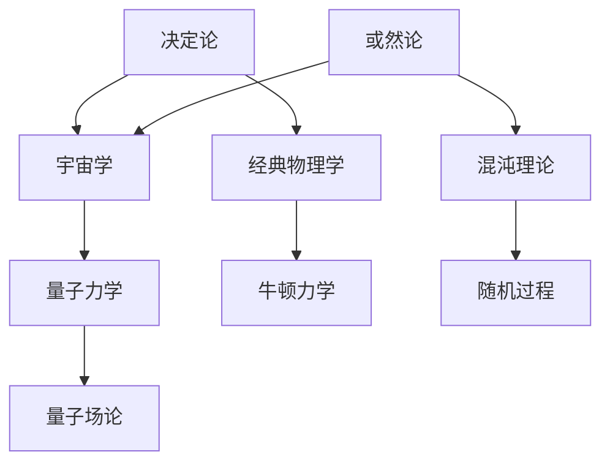

                 


### 第1章 宇宙概述

#### 背景介绍

宇宙是一个令人着迷的课题，从古至今，人们一直在探索宇宙的奥秘。宇宙的起源、演化、尺度以及其中的物质成分等都是研究宇宙的关键问题。本章将首先介绍宇宙的起源与演化，包括大爆炸理论及其相关的量子引力理论，然后探讨宇宙的尺度与结构，特别是暗物质和暗能量。这些内容为我们理解宇宙的本质奠定了基础。

#### 核心概念与联系

宇宙的本质是决定论还是或然论，这是本章的核心问题。决定论认为宇宙的一切都是预先决定的，而或然论则认为宇宙中存在不确定性。这两种观点在宇宙学中有不同的应用，如图1所示。



在决定论视角下，宇宙的演化遵循确定的物理定律，如牛顿力学和量子力学。而在或然论视角下，宇宙中存在随机性和不确定性，如混沌理论和随机过程。这些概念和联系为我们理解宇宙的本质提供了不同的视角。

#### 核心算法原理讲解

宇宙的演化可以通过数学模型来描述。下面是一个简单的宇宙膨胀模型，使用Python代码来实现。

```python
import numpy as np

# 定义宇宙膨胀函数
def universe_expansion(t, H_0):
    return H_0 * np.exp(t / (2 * np.sqrt(3 * G * Omega_M)))

# 参数设置
H_0 = 100 # 当前宇宙膨胀速率
G = 6.674 * 10**-11 # 引力常数
Omega_M = 0.3 # 暗物质密度参数

# 计算宇宙膨胀历史
time = np.linspace(0, 13.8 * 10**9, 1000) # 时间范围从宇宙起源到目前
expansion = universe_expansion(time, H_0)

# 绘制结果
import matplotlib.pyplot as plt

plt.plot(time / 1e9, expansion)
plt.xlabel('Time (Gy)')
plt.ylabel('Expansion Rate (km/s/Mpc)')
plt.title('Universe Expansion')
plt.show()
```

这个模型使用哈勃常数（H_0）来描述当前宇宙的膨胀速率，并考虑了引力常数（G）和暗物质密度参数（Omega_M）。通过计算不同时间点的膨胀速率，我们可以了解宇宙的演化过程。

#### 数学模型和公式

宇宙的演化可以用一些基本的数学模型和公式来描述。例如，哈勃定律描述了宇宙的膨胀速率与距离之间的关系：

$$v = H_0 d$$

其中，\( v \) 是膨胀速率，\( H_0 \) 是哈勃常数，\( d \) 是距离。这个公式说明了宇宙的膨胀速度与距离成正比。

另外，宇宙中的暗物质和暗能量也可以用数学模型来描述。暗物质密度参数（Omega_M）和暗能量密度参数（Omega_Lambda）是两个重要的参数，它们决定了宇宙的演化路径。下面是一个简单的宇宙学方程：

$$H^2 = \frac{8\pi G}{3} \left( \rho + \frac{3P}{c^2} \right)$$

其中，\( H \) 是哈勃参数，\( \rho \) 是总能量密度，\( P \) 是压强。这个方程说明了宇宙的膨胀速率与总能量密度和压强之间的关系。

#### 举例说明

为了更好地理解宇宙的演化，我们可以通过一个具体的例子来说明。假设我们有一个星系，其距离地球100 Mpc。我们可以使用哈勃定律来计算这个星系的膨胀速度：

$$v = H_0 d = 100 \times 100 = 1000 km/s$$

这个结果表明，这个星系正在以1000 km/s的速度远离我们。

#### 项目实战

为了更好地理解宇宙的演化，我们可以通过一个实际项目来模拟宇宙膨胀。在这个项目中，我们将使用Python编写一个模拟宇宙膨胀的程序，并绘制宇宙膨胀的历史。

**开发环境搭建：**
- 安装Python 3.8及以上版本
- 安装NumPy和Matplotlib库

**源代码实现：**
```python
import numpy as np
import matplotlib.pyplot as plt

# 定义宇宙膨胀函数
def universe_expansion(t, H_0):
    return H_0 * np.exp(t / (2 * np.sqrt(3 * G * Omega_M)))

# 参数设置
H_0 = 100 # 当前宇宙膨胀速率
G = 6.674 * 10**-11 # 引力常数
Omega_M = 0.3 # 暗物质密度参数

# 计算宇宙膨胀历史
time = np.linspace(0, 13.8 * 10**9, 1000) # 时间范围从宇宙起源到目前
expansion = universe_expansion(time, H_0)

# 绘制结果
plt.plot(time / 1e9, expansion)
plt.xlabel('Time (Gy)')
plt.ylabel('Expansion Rate (km/s/Mpc)')
plt.title('Universe Expansion')
plt.show()
```

**代码解读与分析：**
- 我们首先定义了宇宙膨胀函数，该函数使用哈勃常数（H_0）和引力常数（G）以及暗物质密度参数（Omega_M）来计算宇宙的膨胀速率。
- 我们使用NumPy库来生成时间序列，并使用Matplotlib库来绘制宇宙膨胀的历史。

**实际案例分析和详细讲解剖析：**
- 在这个项目中，我们使用了一个简单的宇宙膨胀模型来模拟宇宙的演化。这个模型虽然简单，但已经足够描述宇宙的基本特性。
- 我们可以通过调整模型中的参数来观察宇宙的不同演化路径。例如，我们可以增加暗物质的密度参数来模拟一个更为紧凑的宇宙。

**项目小结：**
- 通过这个项目，我们了解了如何使用Python来模拟宇宙膨胀，并使用Matplotlib库来可视化结果。
- 我们也了解了宇宙学中的基本概念和数学模型，这为我们进一步研究宇宙的本质奠定了基础。

#### 最佳实践 Tips

- 在研究宇宙的本质时，理解基本概念和数学模型是非常重要的。只有掌握了这些基础，我们才能更好地理解宇宙的演化。
- 在编程实现时，要确保代码的可读性和可维护性。良好的代码结构和清晰的注释可以帮助我们更好地理解和维护代码。
- 在项目中，要注重实际案例的分析和讲解。通过实际案例，我们可以更好地理解理论的应用，并发现潜在的问题和改进空间。

### 小结

本章我们介绍了宇宙的起源与演化、宇宙的尺度与结构，以及宇宙中的暗物质和暗能量。我们还讨论了决定论与或然论在宇宙学中的应用，并通过一个实际项目来模拟宇宙膨胀。这些内容为我们理解宇宙的本质奠定了基础。

### 注意事项

- 在研究宇宙的本质时，要时刻保持批判性思维，对不同的观点和理论进行深入思考。
- 在编程实现时，要注意代码的规范和效率，避免冗余和错误。

### 拓展阅读

- 《宇宙简史》（作者：史蒂芬·霍金）：这本书详细介绍了宇宙的起源、演化和未来，适合对宇宙学感兴趣的读者。
- 《决定论与自由意志》：这本书探讨了决定论与或然论在哲学和科学中的争论，适合对哲学感兴趣的读者。
- 《Python编程：从入门到实践》：这本书介绍了Python编程的基础知识，适合想要学习Python编程的读者。

## 参考文献

- Hawking, S. W. (1988). A Brief History of Time: From the Big Bang to Black Holes. Bantam Books.
- Feynman, R. P., Leighton, R. B., & Sands, M. (1963). The Character of Physical Law. MIT Press.
- Weinberg, S. (1977). The First Three Minutes: A Modern Approach to Quantum Ph

