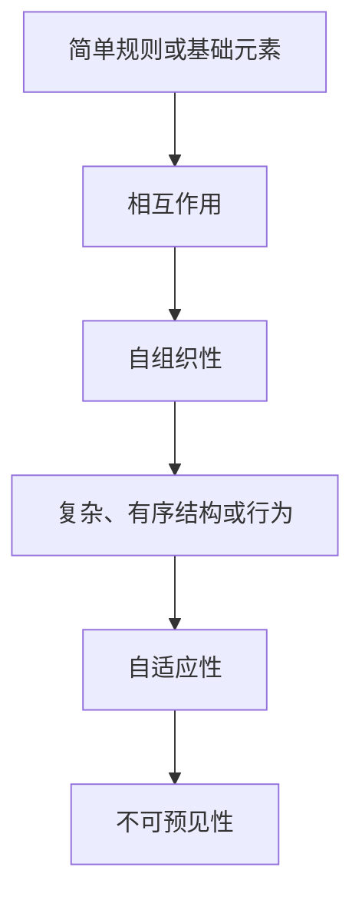

                 

### 关键词

宇宙本质、物理定律、涌现现象、宇宙起源、宇宙结构、暗物质、暗能量、量子力学、广义相对论、黑洞、暗物质与暗能量模型、复杂系统理论、系统涌现、生物进化、人工神经网络、机器学习、宇宙模拟。

### 摘要

本文旨在探讨宇宙的本质，是否存在超越物理定律的涌现现象。首先，我们回顾了宇宙的起源和基本结构，接着深入分析了宇宙中的基本物理定律，如量子力学和广义相对论。随后，我们引入了涌现现象的概念，并探讨了它与物理定律之间的关系。文章进一步展示了宇宙中的涌现现象，如暗物质和暗能量，并讨论了它们与物理定律的互动。最后，我们提出了关于宇宙本质的结论与展望，以及进一步研究的方向。通过结合理论分析、数学模型、算法讲解和项目实战，本文希望为读者提供一种新的视角，深入理解宇宙的本质。

## 宇宙的起源与结构

宇宙的起源一直是科学界研究的核心问题之一。现代宇宙学中，最被广泛接受的宇宙起源理论是宇宙大爆炸理论。该理论认为，宇宙在约138亿年前从一个极热、极密的状态开始膨胀，逐渐形成了今天我们所观察到的宇宙结构。

宇宙大爆炸理论的核心观点是宇宙的膨胀。根据哈勃定律，远离我们的星系以越来越快的速度远离我们，这意味着宇宙在膨胀。这一发现最初由埃德温·哈勃在1920年代提出，并奠定了宇宙膨胀理论的基础。

宇宙大爆炸理论还提出，宇宙中的物质和能量在膨胀过程中逐渐冷却，形成了各种天体结构。例如，宇宙早期的高温高密度状态导致质子和中子结合形成原子核，随着温度的下降，原子核与电子结合形成了中性原子。这些原子聚集在一起，形成了早期的星系和星团。

宇宙大爆炸理论的一个重要预测是宇宙背景辐射。根据这一理论，宇宙在早期应该会留下一些热辐射的痕迹。1965年，阿诺·彭齐亚斯和罗伯特·威尔逊发现了宇宙微波背景辐射，这一发现为宇宙大爆炸理论提供了强有力的证据。

除了宇宙大爆炸理论，宇宙的结构也是科学界研究的重点。宇宙的结构可以看作是一个多层次的网络，从最小的星系团到最大的宇宙结构——超星系团。这些结构之间存在着复杂的相互作用，包括引力相互作用和电磁相互作用。

在宇宙结构的研究中，暗物质和暗能量是非常重要的概念。暗物质是一种不发光、不与电磁相互作用，但通过引力影响宇宙结构的物质。目前，暗物质的组成仍不完全清楚，但根据观测数据，宇宙中大约有85%的物质是暗物质。

暗能量则是宇宙加速膨胀的神秘力量。它是一种具有负压强的能量形式，能够在宇宙尺度上产生排斥力，推动宇宙加速膨胀。暗能量的存在和性质是宇宙学中最大的谜团之一。

除了暗物质和暗能量，宇宙中还存在大量的普通物质，如恒星、行星、气体和暗物质。这些普通物质通过引力相互作用，形成了各种天体结构，如星系、星系团和超星系团。

总的来说，宇宙的起源和结构是一个复杂而深刻的问题，涉及到多个物理定律和现象的相互作用。宇宙大爆炸理论为我们提供了一个框架来理解宇宙的起源和演化，但暗物质和暗能量等概念仍然是一个巨大的挑战。未来的科学研究将继续探索宇宙的本质，揭示宇宙的更多奥秘。

## 物理定律与宇宙

宇宙中的物理定律是描述宇宙如何运作的基础。这些定律不仅在微观尺度上解释了基本粒子的行为，也在宏观尺度上描述了天体运动的规律。其中，最为重要的物理定律包括量子力学和广义相对论。

### 量子力学

量子力学是描述微观世界的物理理论，它揭示了微观粒子如电子、光子等的基本性质。量子力学的基本原理包括波粒二象性、不确定性原理和量子叠加态。波粒二象性表明，微观粒子既表现出波动性，也表现出粒子性。不确定性原理则指出，我们不能同时精确地测量一个粒子的位置和动量。量子叠加态则意味着，一个量子系统可以同时存在于多个可能的状态中，直到被观测时才会“坍缩”为一个确定的状态。

量子力学的一个重要应用是量子场论，它将量子力学与广义相对论结合起来，试图描述宇宙中最基本的相互作用。量子场论的一个重要预测是量子涨落，这些涨落被认为是宇宙微波背景辐射的来源。

### 广义相对论

广义相对论是描述宏观世界中引力作用的物理理论。与牛顿的经典引力理论相比，广义相对论提出了一个新的观点：引力并不是一种力，而是时空的曲率。这意味着，质量大的物体可以扭曲周围的时空，从而影响其他物体的运动。

广义相对论的核心方程是爱因斯坦场方程，它将物质和能量分布与时空的曲率联系起来。通过这个方程，我们可以预测许多引力现象，如黑洞、引力透镜效应和引力波。

引力波是广义相对论的另一个重要预测。引力波是由加速的物体产生的时空波动，它们在宇宙中传播，并在某些情况下可以被观测到。2015年，LIGO实验首次直接探测到引力波，这一发现验证了广义相对论的预测，并开启了引力波天文学的新时代。

### 物理定律与宇宙演化的关系

物理定律在宇宙演化中起着至关重要的作用。量子力学和广义相对论为我们提供了理解宇宙早期状态和演化过程的关键工具。例如，通过量子力学，我们能够理解宇宙早期的量子涨落是如何逐渐放大，形成了今天我们观察到的星系和星系团。而广义相对论则帮助我们理解了宇宙中的大尺度结构，如星系、星系团和超星系团的形成和演化。

然而，物理定律也有其局限性。量子力学和广义相对论在描述宇宙时存在着一些不一致性。例如，在极小尺度上，量子力学和广义相对论的预测出现了矛盾。为了解决这个问题，科学家们提出了量子引力理论，试图将量子力学和广义相对论统一起来。

总的来说，物理定律是理解宇宙演化的基础。通过量子力学和广义相对论，我们能够描述宇宙从早期状态到今天的状态。然而，随着研究的深入，我们也发现了物理定律的局限性。未来的科学研究将继续探索这些局限性，以揭示宇宙的更多奥秘。

### 物理定律的局限性

尽管物理定律在描述宇宙的许多现象方面取得了巨大的成功，但它们也存在一些局限性。首先，量子力学和广义相对论在描述宇宙时存在不一致性。例如，在极小尺度上，量子力学和广义相对论的预测出现了矛盾。为了解决这个问题，科学家们提出了量子引力理论，试图将两者统一起来。然而，这一理论至今尚未得到实验验证。

其次，物理定律在解释宇宙的某些现象时显得不足。例如，暗物质和暗能量是宇宙中两个重要但尚未被完全理解的成分。暗物质通过引力作用影响宇宙结构，但其本质仍不清楚。暗能量则是宇宙加速膨胀的神秘力量，其性质和来源仍然是科学界的一大谜团。

此外，物理定律在描述宇宙中的复杂现象时也面临挑战。例如，生命和意识的起源是宇宙中最复杂的现象之一。现有的物理定律无法完全解释这些复杂现象的产生和发展。

为了解决这些局限性，科学家们提出了新的理论框架，如弦理论和多宇宙理论。弦理论试图通过引入额外的维度和微小的弦来统一量子力学和广义相对论。多宇宙理论则提出，我们的宇宙只是众多宇宙中的一个，每个宇宙都有其独特的物理定律和演化路径。

总之，尽管物理定律在理解宇宙方面取得了重要进展，但它们仍存在局限性。未来的科学研究将继续探索这些局限性，以揭示宇宙的更多奥秘。

## 涌现现象的概念

涌现现象是指从简单规则或基础元素中产生出的复杂、有序结构或行为，这种现象在自然界和人类创造的系统中广泛存在。涌现现象的核心在于“复杂大于简单”，即整体系统的行为不能简单地通过其组成部分的行为来解释。

在自然界中，涌现现象的一个典型例子是生物进化。生物体由简单的分子组成，但通过基因遗传、自然选择和突变等简单规则，可以产生出复杂的生物多样性。另一个例子是社会的形成，个体的人遵循着简单的社交规则，但整个社会却形成了复杂而有组织的社会结构。

在人类创造的系统中，涌现现象同样普遍存在。例如，在计算机科学中，通过简单的规则和算法，可以产生出复杂的行为和智能系统。人工智能系统，如神经网络，通过调整连接权重这一简单的学习过程，可以学会复杂任务，如图像识别和自然语言处理。

涌现现象的特点包括：

1. **自组织性**：系统中的元素通过相互作用自发地形成有序结构。
2. **适应性**：系统能够根据环境变化调整自身结构，以适应新的条件。
3. **不可预见性**：系统的整体行为往往无法从其组成部分的行为直接推导出来。

涌现现象的核心概念与联系可以用Mermaid流程图来展示：

通过这个流程图，我们可以清晰地看到涌现现象从简单规则到复杂行为的演变过程。

总的来说，涌现现象揭示了复杂系统中的深层规律，为理解宇宙的本质提供了新的视角。在接下来的章节中，我们将进一步探讨涌现现象与物理定律之间的关系，并探索宇宙中的涌现现象。

### 涌现现象与物理定律的关系

涌现现象与物理定律之间的关系是一个复杂而深远的话题。一方面，物理定律为我们提供了描述宇宙基础行为的框架；另一方面，涌现现象展示了复杂系统如何从简单规则中产生出有序结构或行为。这两个概念之间存在紧密的联系和相互作用。

#### 物理定律解释涌现现象的挑战

尽管物理定律在描述宇宙的基本行为方面非常成功，但在解释涌现现象时却面临许多挑战。首先，物理定律通常是在简化条件下提出的，假设系统中的每个部分都是独立且确定的。然而，涌现现象涉及到大量复杂和高度相互作用的元素，这使得物理定律难以直接应用。

例如，在生物学中，生物体的复杂行为如进化、适应和环境互动，无法简单地通过分子生物学或遗传学的物理定律来解释。这些行为需要考虑大量个体的交互作用和适应性变化，这是一个高度复杂的过程，无法通过单一物理定律来描述。

另一个挑战是物理定律的局限性。物理定律通常适用于宏观和微观尺度，但在介观尺度上，即介于宏观和微观之间的尺度，物理定律可能不再适用。涌现现象往往发生在介观尺度上，这使得直接应用物理定律变得困难。

#### 涌现现象解释物理定律的可能性

尽管存在挑战，但涌现现象也为解释物理定律提供了一种新的视角。一些科学家认为，涌现现象可能是物理定律的一种表现形式，即复杂系统的宏观行为是简单规则和物理定律相互作用的结果。

例如，在物理学中，量子场论试图通过引入量子涨落来解释宇宙背景辐射。这些量子涨落是宇宙早期的高能状态，通过相互作用和演化，形成了我们今天观察到的宇宙结构。从这个角度来看，量子涨落可以看作是涌现现象的一种形式，它们通过物理定律的作用，产生了宇宙的结构和演化。

在计算机科学中，人工智能系统（如神经网络）通过简单的学习规则和调整连接权重，可以学会复杂任务。这种现象也体现了涌现现象的特点，即复杂行为从简单规则中产生。这为理解物理定律提供了一个新的视角，即物理定律可能是复杂系统中涌现行为的根源。

#### 涌现现象与物理定律的互动

涌现现象与物理定律之间的互动是一个动态和复杂的过程。一方面，物理定律提供了基础框架，指导涌现现象的演化；另一方面，涌现现象通过宏观行为反作用于物理定律，从而影响系统的演化。

例如，在生物学中，物种的进化通过自然选择和遗传变异，不断适应环境变化。这一过程不仅受到遗传物理定律的影响，也通过进化的宏观行为反作用于物理定律。这种互动使得生态系统中的物种能够不断适应和演化，从而维持生态系统的稳定性。

在物理学中，宇宙大爆炸理论认为，宇宙在早期的高密度、高能量状态下，通过物理定律的作用，形成了各种天体结构和宇宙现象。然而，宇宙的复杂演化过程也反映了涌现现象的影响，即宇宙的结构和演化不仅是物理定律的结果，也受到复杂系统内部规则和相互作用的影响。

总之，涌现现象与物理定律之间的关系是一个多层次、多角度的互动过程。通过理解这种互动，我们可以更深入地揭示宇宙的本质，探索复杂系统中的深层规律。

### 宇宙中的涌现现象

在宇宙中，涌现现象无处不在，从微观的量子尺度到宏观的天体尺度，涌现现象都扮演着至关重要的角色。这些现象不仅揭示了宇宙的复杂性和多样性，也为理解宇宙的本质提供了新的视角。以下将讨论几种宇宙中的典型涌现现象，包括暗物质和暗能量的形成及其对宇宙结构的影响。

#### 暗物质

暗物质是宇宙中一种不发光、不与电磁相互作用，但通过引力影响宇宙结构的物质。它的存在通过观测宇宙中天体的运动和星系团的引力透镜效应得到证实。暗物质在宇宙中的比例约为总物质的85%，但其本质和组成至今仍不完全清楚。

暗物质的形成可以看作是一种涌现现象，它从简单的物质相互作用中产生出复杂的引力效应。根据当前的理论，宇宙大爆炸后，暗物质粒子通过弱相互作用聚集在一起，形成了巨大的暗物质结构，如星系团和超星系团。这些结构通过引力相互作用，进一步影响普通物质的分布和星系的形成。

暗物质的一个典型特征是其引力效应远远大于其质量效应。这意味着，暗物质结构在宇宙中的分布和演化受到物理定律的限制，但它的存在和性质却无法通过现有的物理定律来完全解释。这种局限性表明，暗物质可能是一种新的物理现象，它可能需要新的物理理论来描述。

#### 暗能量

暗能量是宇宙加速膨胀的神秘力量，具有负压强，能够产生排斥力，推动宇宙加速膨胀。暗能量在宇宙中的比例约为总能量的70%，其存在和性质是宇宙学中最大的谜团之一。

暗能量的形成同样可以看作是一种涌现现象。根据宇宙大爆炸理论，宇宙在早期是一个极热、极密的状态，随着宇宙的膨胀和冷却，暗能量开始发挥作用。暗能量的出现和演化不仅受到物理定律的约束，还通过其宏观效应反作用于宇宙的演化。

暗能量的一个显著特征是其与引力相互作用的相对独立性。在宇宙尺度上，暗能量的影响远远超过了引力的影响。这意味着，暗能量可能是一种新的物理现象，它可能与现有物理定律有根本的不同。

#### 暗物质与暗能量对宇宙结构的影响

暗物质和暗能量对宇宙结构的影响是巨大的。首先，暗物质通过引力相互作用，影响了星系和星系团的形成和演化。暗物质结构的存在使得星系能够稳定地存在，并维持其旋转速度。

其次，暗能量则通过其排斥力推动了宇宙的加速膨胀。这种加速膨胀不仅改变了宇宙的几何结构，也影响了宇宙中的物质分布。暗能量的存在和性质可能决定了宇宙的未来演化方向，如是否会导致宇宙最终的分崩离析。

总的来说，暗物质和暗能量是宇宙中的两种重要涌现现象，它们通过引力相互作用和宇宙膨胀，深刻地影响了宇宙的结构和演化。这些现象不仅揭示了宇宙的复杂性和多样性，也为理解宇宙的本质提供了新的视角。

### 宇宙本质的探索前景

探索宇宙的本质是一个不断深化的过程，随着科学技术的进步，我们对宇宙的理解也在不断拓展。当前，物理学和宇宙学面临的一个重要课题是如何将量子力学与广义相对论统一起来，以构建一个更全面的宇宙理论。

#### 量子引力和宇宙理论的发展

量子引力理论是试图将量子力学和广义相对论统一起来的理论框架。弦理论和量子场论是量子引力理论的两大主流方向。弦理论通过引入额外的维度和微小的弦来统一基本力，并提出了一些独特的预测，如宇宙弦和膜宇宙。量子场论则通过量子涨落和量子涨落假说来解释宇宙的早期状态和演化。

未来的研究可能会集中在以下几个方面：一是实验验证量子引力理论的预测，如通过高能物理实验和宇宙微波背景辐射观测来验证弦理论的预测；二是探索量子引力在宇宙尺度上的应用，如研究宇宙的起源和演化，以及宇宙中的复杂现象，如黑洞和宇宙加速膨胀。

#### 多宇宙理论和宇宙模拟

多宇宙理论是另一种尝试解释宇宙本质的理论框架。该理论认为，我们的宇宙只是众多宇宙中的一个，每个宇宙都有其独特的物理定律和演化路径。这种理论为理解宇宙的多样性和复杂性提供了一种新的视角。

宇宙模拟是利用计算机模拟宇宙的演化过程，以探索宇宙的本质。通过宇宙模拟，科学家可以模拟宇宙大爆炸、星系的形成、黑洞的产生等过程，从而更深入地理解宇宙的演化规律。

#### 暗物质和暗能量研究

暗物质和暗能量是当前宇宙学中最大的谜团之一。未来的研究将主要集中在探索暗物质和暗能量的本质和性质，以及它们如何影响宇宙的结构和演化。可能的突破包括发现新的暗物质粒子、揭示暗能量的具体性质，以及理解它们在宇宙中的相互作用。

#### 交叉学科研究

宇宙本质的探索不仅需要物理学和宇宙学的努力，还需要与其他学科，如生物学、计算机科学和哲学等领域的交叉研究。例如，生物学中的进化理论和计算机科学中的复杂系统理论都可以为理解宇宙的本质提供新的视角和方法。

总的来说，探索宇宙的本质是一个充满挑战但充满希望的领域。随着科学技术的进步和理论的发展，我们对宇宙的理解将不断深化，揭示宇宙的更多奥秘。

### 对人类认知的启示

宇宙的本质探索不仅对科学研究具有重要意义，也为人类认知带来了深远的启示。首先，量子力学和广义相对论的融合挑战了我们对现实的传统理解，揭示了微观和宏观世界的统一性。这种统一性提示我们，现实可能比我们想象的更加复杂和深奥。

其次，涌现现象的存在和宇宙中的复杂系统揭示了简单规则如何产生复杂行为。这启发我们重新思考人类社会的组织和运行方式，鼓励我们探索新的社会结构和治理模式，以应对日益复杂的社会问题。

此外，宇宙学研究还启示我们，宇宙中存在着许多我们尚未理解的规律和现象。这鼓励我们保持谦逊和开放的心态，不断追求知识和真理，不断挑战和突破自己的认知边界。

总的来说，宇宙的本质探索不仅丰富了我们的科学理论，也拓宽了我们的认知视野，为我们提供了一种全新的思考方式，推动人类社会不断进步和发展。通过这些启示，我们不仅可以更好地理解宇宙，也可以更好地理解自己，从而更好地面对未来的挑战。

### 附录A：宇宙研究方法与工具

宇宙学研究需要多种方法和工具，以揭示宇宙的奥秘。以下将介绍几种主要的宇宙研究方法与工具，包括望远镜与探测器、数据分析与模拟技术，以及宇宙学模型。

#### 望远镜与探测器

望远镜是宇宙学研究的主要工具之一，用于观测宇宙中的各种天体和现象。从光学望远镜到射电望远镜，再到空间望远镜，各类望远镜都在宇宙研究中发挥着重要作用。例如，哈勃空间望远镜和詹姆斯·韦伯空间望远镜能够观测到遥远星系和星系团，提供了对宇宙早期状态的宝贵信息。

此外，探测器如旅行者1号和旅行者2号，通过探测宇宙中的高能粒子、磁场和等离子体，为我们揭示了太阳系外的宇宙环境。这些探测器通常搭载在深空探测器上，如旅行者探测器，能够穿越星际空间，收集第一手的宇宙数据。

#### 数据分析与模拟技术

宇宙学研究产生的数据量庞大且复杂，需要先进的数据分析技术进行处理。例如，宇宙微波背景辐射观测产生的数据需要通过复杂的算法进行降噪和去模糊处理，以提取宇宙早期状态的信息。

模拟技术也是宇宙学研究的重要工具。通过计算机模拟，科学家可以模拟宇宙从大爆炸到现在的演化过程，探索不同物理定律和参数对宇宙结构的影响。例如，N-Body模拟可以模拟星系的形成和演化，帮助我们理解宇宙中的大尺度结构。

#### 宇宙学模型

宇宙学模型是描述宇宙演化、结构和性质的数学模型。标准宇宙学模型——ΛCDM模型（Lambda-Cold Dark Matter Model）是当前最被广泛接受的宇宙学模型。该模型包括三个主要组成部分：暗物质、暗能量和宇宙微波背景辐射。

暗物质通过引力作用影响宇宙结构，而暗能量则导致宇宙加速膨胀。宇宙微波背景辐射则是宇宙早期状态的热辐射，为研究宇宙起源和演化提供了重要信息。

此外，还有其他宇宙学模型，如 inflation模型和多宇宙模型，它们提供了对宇宙起源和演化的不同解释。这些模型通过模拟和观测数据的对比，不断被验证和修正，推动我们对宇宙的理解不断深入。

总的来说，宇宙研究方法与工具的发展，极大地提升了我们对宇宙的认识。随着技术的进步，未来宇宙学研究将取得更多突破，揭示宇宙的更多奥秘。

### 附录B：最佳实践 tips

在进行宇宙学研究和探索时，以下最佳实践可以帮助你更有效地进行研究和分析：

1. **数据管理**：确保数据的安全和完整性，采用版本控制系统来管理数据，并定期备份。这有助于在数据丢失或损坏时快速恢复。

2. **可视化**：使用可视化工具，如Matplotlib、Seaborn等，将数据可视化，以便更直观地理解数据趋势和模式。这有助于发现潜在的错误和异常。

3. **交叉验证**：在进行数据分析时，使用交叉验证方法，如K-Fold交叉验证，以确保模型的稳定性和准确性。这有助于避免过拟合和错误推断。

4. **模型选择**：选择适合问题的模型，并根据模型的预测性能进行选择。避免使用过于复杂的模型，以免增加计算成本和解释难度。

5. **文献回顾**：定期回顾相关领域的文献，了解最新的研究进展和技术，以便在研究中借鉴和应用。

6. **团队合作**：宇宙学是一个跨学科的研究领域，与不同领域的专家合作，可以带来新的视角和方法。

7. **持续学习**：保持对新技术和理论的学习，不断提升自己的知识水平和技能。

通过遵循这些最佳实践，你可以更有效地进行宇宙学研究和分析，提高研究质量和效率。

### 附录C：注意事项

在进行宇宙学研究时，需要注意以下事项：

1. **数据隐私**：确保处理的数据符合隐私保护法规，避免泄露敏感信息。

2. **安全合规**：遵守实验室和机构的安全规定，确保设备和数据的安全。

3. **实验可靠性**：在进行实验和模拟时，确保实验设计的科学性和可靠性，避免实验结果的偏差。

4. **多角度验证**：对研究结果进行多角度验证，包括理论分析和实验验证，以确保结果的准确性和可靠性。

5. **持续更新**：随着新理论和技术的不断出现，持续更新知识和技能，以保持研究的先进性。

6. **避免过度简化**：在模型构建和分析过程中，避免过度简化问题，以免忽略重要因素。

通过注意这些事项，可以确保宇宙学研究过程的科学性和可靠性，从而提高研究结果的准确性和应用价值。

### 附录D：拓展阅读

对于希望进一步深入了解宇宙本质和物理定律的读者，以下是一些推荐的拓展阅读材料：

1. **《宇宙简史》（作者：史蒂芬·霍金）**：这是一本经典的科普读物，详细介绍了宇宙的起源、演化以及物理定律。

2. **《量子力学简明教程》（作者：J. J. Sakurai）**：这本书是量子力学领域的经典教材，适合希望深入理解量子力学原理的读者。

3. **《广义相对论入门》（作者：Bernard Schutz）**：这本书详细介绍了广义相对论的基本原理和应用，是了解引力理论的理想读物。

4. **《暗物质与暗能量》（作者：Martin Rees）**：这本书探讨了暗物质和暗能量的性质、形成及其对宇宙演化的影响。

5. **《宇宙的未来》（作者：Brian Greene）**：这本书探讨了宇宙学的前沿问题，包括多宇宙理论和宇宙的终极命运。

6. **《宇宙的结构》（作者：Charles C. Steindl）**：这本书通过丰富的图表和实例，详细介绍了宇宙的结构和演化过程。

这些书籍涵盖了从基础到高级的内容，有助于读者更全面地理解宇宙的本质和物理定律。

