                 

### 第1章：引言

#### 1.1 宇宙概述

宇宙是一个极其庞大且复杂的系统，包含着无数的天体和物质。根据现代宇宙学的理论，宇宙起源于约138亿年前的一次大爆炸，从那时起，宇宙开始不断膨胀，天体之间相互吸引、碰撞，形成了我们今天所看到的丰富多样的宇宙景象。

宇宙的基本结构包括星系、星系团和超星系团等，它们都是由大量的恒星、行星、星云等天体组成的。这些天体通过引力相互作用，形成了稳定的结构。同时，宇宙中还存在大量的暗物质和暗能量，这些物质和能量对宇宙的演化起着重要的作用。

#### 1.2 物质世界与信息世界

在讨论宇宙的本质时，我们不得不提到物质世界和信息世界。物质世界是指宇宙中实际存在的实体物质，包括原子、分子、星体等。它们具有质量、空间位置和物理属性，是我们能够直接感知和研究的对象。

相对地，信息世界则是一个抽象的概念，它指的是物质世界中信息的生成、传输、处理和应用。信息可以被视为物质世界的一种属性，它可以被编码、存储、传输和处理，从而实现对物质世界的理解和控制。

### 核心概念与联系

**物质世界**与**信息世界**之间的关系可以看作是实体与抽象之间的关系。物质世界是信息世界的载体，而信息世界则是物质世界的表现形式和工具。这种关系可以用Mermaid流程图来表示：

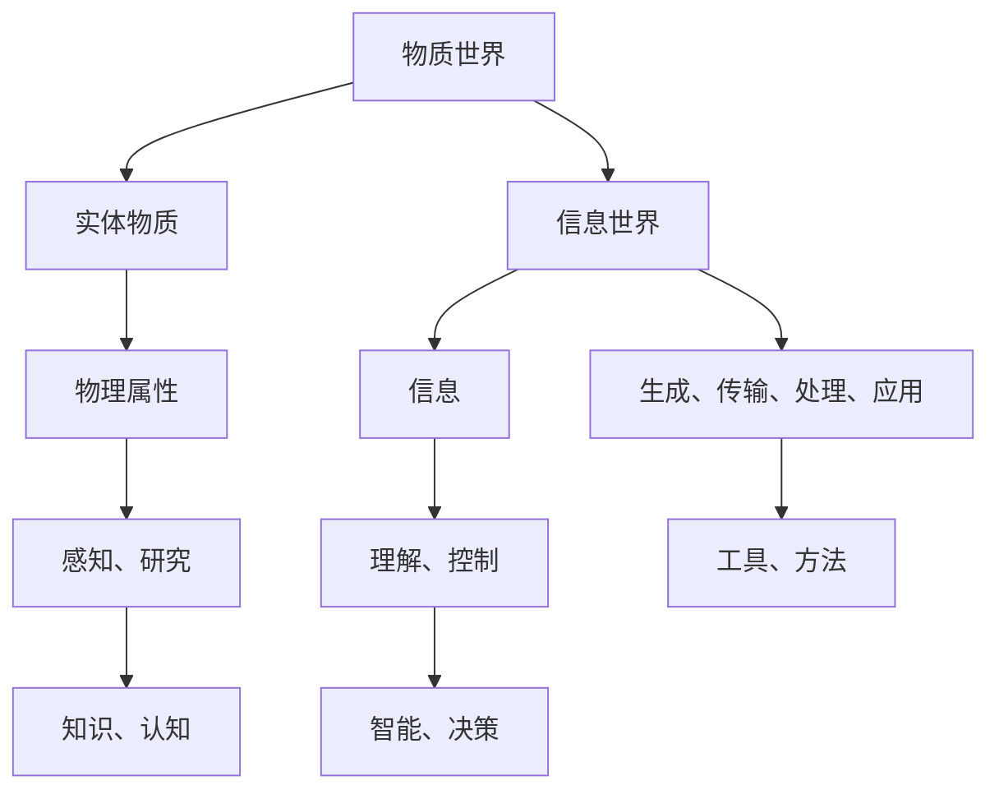

通过这个流程图，我们可以看到物质世界和信息的生成、传输、处理和应用过程，以及它们在感知、理解和控制方面的作用。

### 逻辑推理步骤

1. **宇宙的起源和演化**：根据现代宇宙学的理论，宇宙起源于一次大爆炸，从那时起，宇宙开始不断膨胀。这个过程是物质世界的演化过程，其中涉及大量的物理现象和规律。

2. **物质世界的本质**：物质世界是由实体物质组成的，这些物质具有质量、空间位置和物理属性。我们可以通过物理实验和理论来研究物质世界的本质。

3. **信息世界的本质**：信息世界是一个抽象的概念，它指的是物质世界中信息的生成、传输、处理和应用。信息可以被视为物质世界的一种属性，它对物质世界的理解和控制起着至关重要的作用。

4. **物质世界与信息世界的关系**：物质世界是信息世界的载体，而信息世界则是物质世界的表现形式和工具。这种关系体现了实体与抽象之间的互动。

5. **宇宙演化的信息模型**：我们可以通过建立信息模型来研究宇宙的演化过程。这个模型可以帮助我们更好地理解宇宙的本质，以及物质世界和信息的生成、传输、处理和应用过程。

6. **物质世界与信息世界的融合趋势**：随着科技的不断发展，物质世界与信息世界的融合趋势日益明显。这种融合将带来新的科学和技术革命，对我们理解和控制宇宙的能力产生深远的影响。

通过以上逻辑推理步骤，我们可以更深入地理解宇宙的本质，以及物质世界与信息世界之间的关系。这为我们的科学研究和技术创新提供了新的思路和方法。

---

> **关键词**：宇宙、物质世界、信息世界、演化、信息模型、融合趋势

> **摘要**：本文从宇宙的起源和演化出发，探讨了物质世界与信息世界的本质及其关系。通过逻辑推理和分析，我们揭示了宇宙的本质，以及物质世界与信息世界之间的互动和融合趋势。本文旨在为科学研究和技术创新提供新的视角和思路。

---

接下来，我们将进一步探讨物质世界和信息的本质，以及它们在宇宙演化中的作用。通过深入的分析和推理，我们将尝试回答宇宙的本质是什么，以及物质世界与信息世界之间的关系。这将为我们的科学研究和技术创新提供新的方向和启示。

---

### 第2章：物质世界

#### 2.1 物质世界的本质

物质世界是我们生活的基础，它是由无数实体物质组成的。这些物质包括原子、分子、星体等，它们具有质量、空间位置和物理属性。物质世界的本质可以理解为物质的存在、属性和行为。

**物质的存在**：物质是构成宇宙的基本元素，它存在于宇宙的每一个角落。物质的存在是客观的，它是我们感知和认识世界的基础。

**物质的属性**：物质具有多种属性，包括质量、密度、电荷、温度、颜色等。这些属性决定了物质的行为和相互作用。

**物质的行为**：物质的行为包括运动、相互作用和变化。这些行为遵循物理定律，如牛顿定律、电磁定律等。

#### 2.2 物质世界的演化

物质世界的演化是宇宙演化的重要组成部分。从宇宙起源至今，物质世界经历了无数次的变化和演化。

**宇宙大爆炸**：根据宇宙学的理论，宇宙起源于约138亿年前的一次大爆炸。这次大爆炸使得宇宙迅速膨胀，温度和密度逐渐降低，物质开始形成。

**星体形成**：在大爆炸后的数十亿年里，宇宙中的物质逐渐聚集，形成了恒星、行星、星云等天体。这些天体的形成过程涉及到气体云的坍缩、核聚变等复杂的物理过程。

**宇宙结构的形成**：随着宇宙的演化，物质形成了各种结构，包括星系、星系团和超星系团等。这些结构通过引力相互作用，形成了稳定的宇宙格局。

#### 2.3 物质世界的数学模型

为了更好地理解和研究物质世界，科学家们建立了各种数学模型。这些模型可以描述物质的存在、属性和行为。

**物理学的数学模型**：物理学中的数学模型包括牛顿力学、量子力学、相对论等。这些模型描述了物质在不同条件下的运动和相互作用。

**化学的数学模型**：化学中的数学模型包括分子结构模型、化学反应模型等。这些模型描述了物质的化学性质和变化过程。

**宇宙学的数学模型**：宇宙学的数学模型包括大爆炸模型、宇宙背景辐射模型等。这些模型描述了宇宙的起源、演化和结构。

通过数学模型，我们可以更精确地描述物质世界的本质和演化过程，从而为科学研究和技术创新提供理论基础。

### 核心概念与联系

**物质世界的本质**、**物质世界的演化**和**物质世界的数学模型**之间存在着密切的联系。物质世界的本质决定了物质的属性和行为，而物质世界的演化则反映了物质属性和行为的变化。数学模型则是我们理解和描述物质世界的重要工具。

**Mermaid 流程图**：

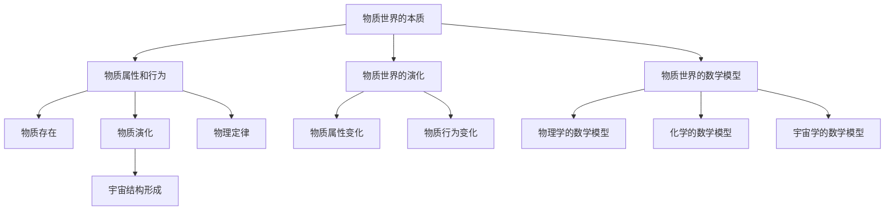

通过这个流程图，我们可以清晰地看到物质世界的本质、演化和数学模型之间的关系。

### 逻辑推理步骤

1. **物质世界的本质**：物质的存在、属性和行为是物质世界的本质。这些本质属性和行为决定了物质世界的多样性和复杂性。

2. **物质世界的演化**：物质世界的演化过程包括宇宙大爆炸、星体形成和宇宙结构形成等。这些过程反映了物质属性和行为的变化。

3. **物质世界的数学模型**：物理学的数学模型、化学的数学模型和宇宙学的数学模型是我们理解和描述物质世界的重要工具。这些模型可以帮助我们更精确地描述物质的存在、属性和行为。

4. **核心概念与联系**：物质世界的本质、演化和数学模型之间存在着密切的联系。通过数学模型，我们可以更深入地理解物质世界的本质和演化过程。

通过以上逻辑推理步骤，我们可以更深入地理解物质世界的本质和演化过程。这为我们的科学研究和技术创新提供了新的视角和方法。

---

> **核心概念与联系**：物质世界的本质、物质世界的演化、物质世界的数学模型

> **核心算法原理讲解**：物理学中的数学模型、化学的数学模型、宇宙学的数学模型

> **数学模型和数学公式**：物理定律、化学反应方程、宇宙演化方程

> **举例说明**：原子结构、分子形成、星体演化

---

### 第3章：信息世界

#### 3.1 信息世界的本质

信息世界是一个抽象的概念，它指的是物质世界中信息的生成、传输、处理和应用。信息可以被视为物质世界的一种属性，它可以被编码、存储、传输和处理。

**信息的概念**：信息是关于某个事物或对象的某种描述或表达。它可以被看作是数据的一种形式，但与数据不同的是，信息具有意义和用途。

**信息的特征**：信息具有以下特征：

1. **传递性**：信息可以通过各种方式在时间和空间上进行传递。
2. **多样性**：信息可以是数字、文字、图像、声音等多种形式。
3. **结构性**：信息具有一定的结构和组织，这使得信息可以被处理和应用。
4. **价值性**：信息具有价值，它可以被用来提高决策的准确性、优化资源的配置等。

#### 3.2 信息世界的演化

信息世界的演化可以看作是信息生成、传输、处理和应用方式的变化和发展。从古至今，信息世界经历了巨大的变革。

**原始信息时代**：在人类文明之初，信息主要通过口头传递和文字记录。这种方式的信息传递速度较慢，信息容量有限。

**电子时代**：随着电子技术的发明和发展，信息传输和处理的速度和效率得到了极大的提升。电子计算机的出现使得信息处理变得更加自动化和高效。

**互联网时代**：互联网的普及使得信息可以在全球范围内快速传输和共享。人们可以通过互联网获取和交流各种信息，信息世界的规模和影响力进一步扩大。

**人工智能时代**：随着人工智能技术的发展，信息处理变得更加智能化和自动化。人工智能可以处理和分析大量数据，从中提取有价值的信息，为人类决策提供支持。

#### 3.3 信息世界的数学模型

为了更好地理解和研究信息世界，科学家们建立了各种数学模型。这些模型可以描述信息的生成、传输、处理和应用。

**信息论的基础**：信息论是研究信息传输和处理的基本理论。它主要关注信息的度量、传输效率和可靠性等问题。

**信息处理的数学模型**：信息处理的数学模型包括编码理论、信号处理、机器学习等。这些模型描述了信息在生成、传输、处理和应用过程中的变化和转换。

**信息处理的数学公式**：信息处理的数学公式包括熵、信息增益、卷积等。这些公式可以用来计算信息的度量、传输效率和可靠性等指标。

通过数学模型和数学公式，我们可以更精确地描述信息世界的本质和演化过程。这为我们的科学研究和技术创新提供了理论基础。

### 核心概念与联系

**信息世界的本质**、**信息世界的演化**和**信息世界的数学模型**之间存在着密切的联系。信息世界的本质决定了信息的生成、传输、处理和应用方式。信息世界的演化反映了信息生成、传输、处理和应用方式的变化和发展。信息世界的数学模型则是我们理解和描述信息世界的重要工具。

**Mermaid 流程图**：

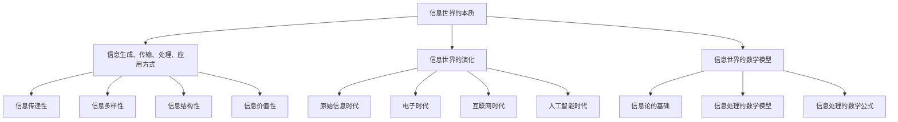

通过这个流程图，我们可以清晰地看到信息世界的本质、演化和数学模型之间的关系。

### 逻辑推理步骤

1. **信息世界的本质**：信息是关于某个事物或对象的某种描述或表达。它具有传递性、多样性、结构性和价值性。

2. **信息世界的演化**：信息世界的演化包括原始信息时代、电子时代、互联网时代和人工智能时代。这些时代反映了信息生成、传输、处理和应用方式的变化和发展。

3. **信息世界的数学模型**：信息世界的数学模型包括信息论的基础、信息处理的数学模型和数学公式。这些模型和公式帮助我们理解和描述信息世界的本质和演化过程。

4. **核心概念与联系**：信息世界的本质、演化和数学模型之间存在着密切的联系。通过数学模型，我们可以更深入地理解信息世界的本质和演化过程。

通过以上逻辑推理步骤，我们可以更深入地理解信息世界的本质和演化过程。这为我们的科学研究和技术创新提供了新的视角和方法。

---

> **核心概念与联系**：信息世界的本质、信息世界的演化、信息世界的数学模型

> **核心算法原理讲解**：信息论的基础、信息处理的数学模型、信息处理的数学公式

> **数学模型和数学公式**：熵、信息增益、卷积

> **举例说明**：电子计算机的发明、互联网的普及、人工智能的应用

---

### 第4章：物质世界与信息世界的联系

#### 4.1 物质世界与信息世界的相互影响

物质世界与信息世界之间的相互作用和影响是宇宙演化中的重要组成部分。物质世界为信息世界的存在和发展提供了基础，而信息世界则对物质世界产生了深远的影响。

**物质世界对信息世界的影响**：

1. **物质世界的存在**：物质世界提供了信息生成的原材料，如电子、原子等。没有物质世界，就没有信息世界的存在。

2. **物质世界的运动**：物质的运动和相互作用产生了各种信息，如电磁波、声波等。这些信息是信息世界的重要来源。

3. **物质世界的演化**：物质世界的演化过程，如星体形成、生物进化等，为信息世界提供了丰富的信息。

**信息世界对物质世界的影响**：

1. **信息的传递**：信息可以通过各种渠道在物质世界之间传递，如互联网、通信网络等。这种传递使得物质世界的信息变得更加丰富和多样化。

2. **信息的处理**：信息世界的发展带来了各种信息处理技术，如计算机科学、人工智能等。这些技术可以高效地处理和分析物质世界的各种信息，提高我们对物质世界的认识和控制能力。

3. **信息的利用**：信息世界的发展使得人类可以更好地利用物质世界的资源，如能源、材料等。这种利用提高了物质世界的利用效率和可持续性。

**Mermaid 流程图**：

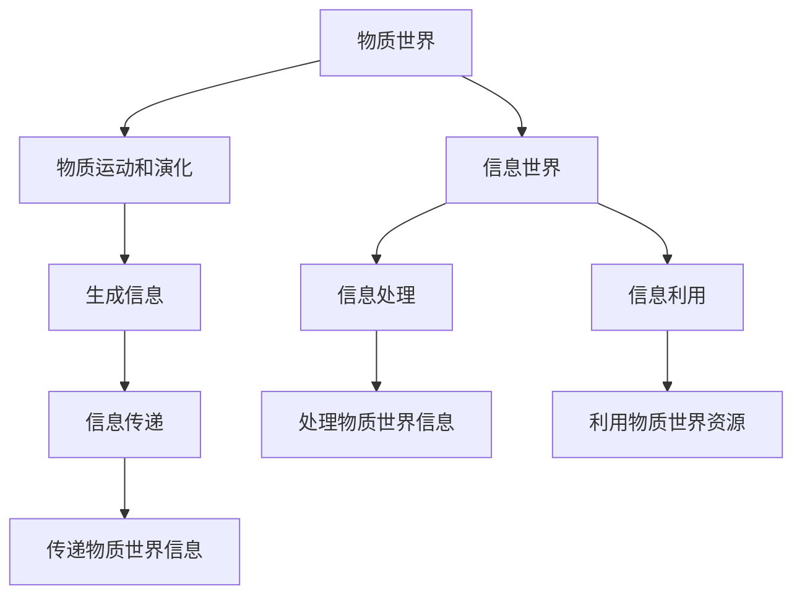

通过这个流程图，我们可以清晰地看到物质世界与信息世界之间的相互作用和影响。

#### 4.2 宇宙演化的信息模型

宇宙演化的信息模型是研究宇宙演化过程中信息生成、传输、处理和应用的理论框架。这个模型可以帮助我们更好地理解宇宙的本质和演化过程。

**信息在宇宙演化中的作用**：

1. **信息的生成**：在宇宙演化的早期阶段，物质世界开始产生各种信息，如电磁波、引力波等。这些信息是宇宙演化的关键因素。

2. **信息的传输**：随着宇宙的演化，这些信息在宇宙中传递，使得宇宙各个部分相互关联和影响。

3. **信息的变化**：信息在传输过程中可能会发生变化，如信号衰减、噪声干扰等。这些变化会影响宇宙演化的过程和结果。

4. **信息的利用**：人类通过观测和测量获取了宇宙中的信息，如星体、黑洞等。这些信息为我们理解宇宙提供了重要线索。

**宇宙演化的信息模型**：

宇宙演化的信息模型可以看作是一个信息处理系统，包括信息的生成、传输、处理和应用。这个模型可以帮助我们理解和预测宇宙演化的趋势和结果。

**Mermaid 流程图**：

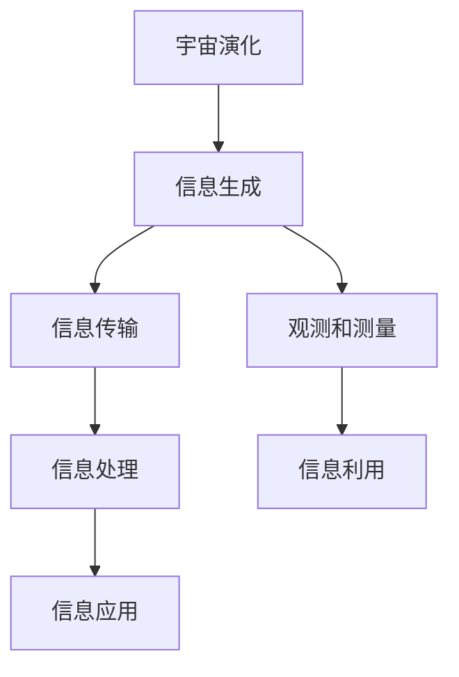

通过这个流程图，我们可以清晰地看到宇宙演化的信息模型，以及信息在宇宙演化中的作用。

#### 4.3 物质世界与信息世界的融合趋势

随着科技的不断发展，物质世界与信息世界的融合趋势日益明显。这种融合将带来新的科学和技术革命，对我们理解和控制宇宙的能力产生深远的影响。

**融合的趋势**：

1. **数字化**：物质世界的各种现象和信息被数字化，使得信息世界与物质世界的边界变得模糊。

2. **智能化**：信息世界的发展带来了各种智能化技术，如人工智能、物联网等。这些技术使得物质世界变得更加智能和高效。

3. **网络化**：物质世界与信息世界之间的网络连接越来越紧密，使得信息可以在物质世界之间快速传递和共享。

**融合的挑战与机遇**：

1. **挑战**：融合过程中可能会遇到技术、伦理、安全等方面的挑战。例如，如何确保信息的安全性、隐私性等。

2. **机遇**：融合为科学研究和技术创新提供了新的机遇。通过融合，我们可以更好地理解宇宙的本质，解决人类面临的各种问题。

**Mermaid 流程图**：

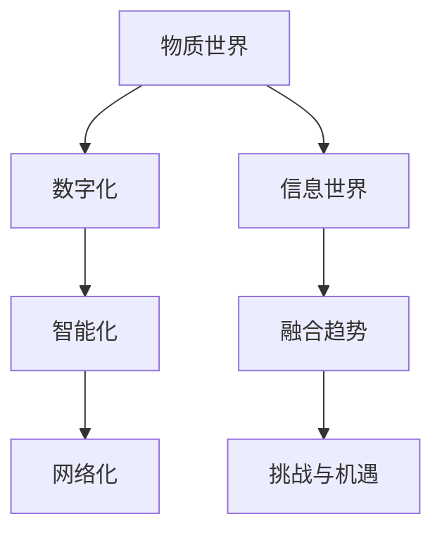

通过这个流程图，我们可以清晰地看到物质世界与信息世界的融合趋势，以及融合带来的挑战与机遇。

### 核心概念与联系

**物质世界与信息世界的相互影响**、**宇宙演化的信息模型**和**物质世界与信息世界的融合趋势**之间存在着密切的联系。物质世界与信息世界的相互影响决定了信息在宇宙演化中的作用，而宇宙演化的信息模型和融合趋势则反映了物质世界与信息世界的融合程度和发展方向。

**Mermaid 流程图**：

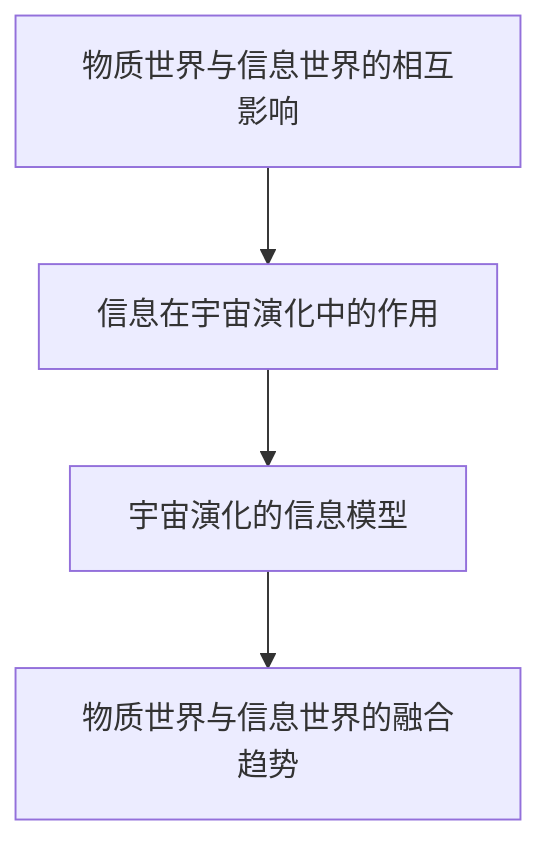

通过这个流程图，我们可以清晰地看到物质世界与信息世界的联系，以及它们在宇宙演化中的角色。

### 逻辑推理步骤

1. **物质世界与信息世界的相互影响**：物质世界提供了信息生成和传输的基础，而信息世界则对物质世界产生了深远的影响。

2. **信息在宇宙演化中的作用**：信息在宇宙演化的过程中起着关键作用，它影响着宇宙的结构和演化方向。

3. **宇宙演化的信息模型**：通过建立信息模型，我们可以更好地理解和预测宇宙的演化过程。

4. **物质世界与信息世界的融合趋势**：随着科技的不断发展，物质世界与信息世界的融合趋势日益明显，这种融合将带来新的科学和技术革命。

通过以上逻辑推理步骤，我们可以更深入地理解物质世界与信息世界之间的关系，以及它们在宇宙演化中的角色。这为我们的科学研究和技术创新提供了新的视角和方法。

---

> **核心概念与联系**：物质世界与信息世界的相互影响、宇宙演化的信息模型、物质世界与信息世界的融合趋势

> **核心算法原理讲解**：信息在宇宙演化中的作用、宇宙演化的信息模型、融合趋势的影响

> **数学模型和数学公式**：宇宙演化方程、信息传输方程、融合趋势模型

> **举例说明**：互联网的普及、人工智能的应用、数字化时代的到来

---

### 第5章：宇宙演化模拟

#### 5.1 宇宙演化模拟的原理

宇宙演化模拟是研究宇宙演化的重要工具。它通过计算机模拟的方式，模拟宇宙从大爆炸开始到现在的演化过程，帮助我们理解宇宙的结构和演化机制。

**模拟的数学模型**：宇宙演化模拟的数学模型主要包括宇宙学的标准模型、引力模型、星系形成模型等。这些模型基于物理学和数学的基本原理，描述了宇宙中物质和能量的分布、相互作用和演化过程。

**模拟的计算方法**：宇宙演化模拟的计算方法主要包括数值模拟、蒙特卡洛模拟、分子动力学模拟等。这些方法通过计算机模拟，对宇宙中的物理过程进行计算和模拟，从而得到宇宙演化的结果。

**模拟结果的分析**：宇宙演化模拟的结果需要通过数据分析、图像处理等方式进行分析。这些分析可以帮助我们更好地理解宇宙的结构和演化机制，发现宇宙中的规律和现象。

#### 5.2 宇宙演化模拟的数学模型

**宇宙学的标准模型**：宇宙学的标准模型是描述宇宙演化的一种理论模型，它基于广义相对论和量子场论的基本原理，描述了宇宙中物质和能量的分布、相互作用和演化过程。这个模型包括宇宙膨胀、宇宙背景辐射、星系形成等关键过程。

**引力模型**：引力模型是描述宇宙中物质相互作用的一种理论模型，它基于牛顿万有引力定律或爱因斯坦的广义相对论。这个模型描述了宇宙中天体之间的引力相互作用，以及这些相互作用对宇宙演化的影响。

**星系形成模型**：星系形成模型是描述星系形成和演化的一种理论模型，它基于引力模型和恒星形成理论。这个模型描述了星系的形成过程，包括气体云的坍缩、恒星的形成、星系结构的演化等。

**宇宙演化模拟的应用**：宇宙演化模拟在宇宙学研究中有着广泛的应用。它可以帮助我们预测宇宙的未来演化方向，理解宇宙中的各种现象和规律，如星系形成、黑洞演化、宇宙背景辐射等。此外，宇宙演化模拟还可以为天文学家提供观测数据和理论预测，帮助他们更好地理解宇宙。

**Mermaid 流程图**：

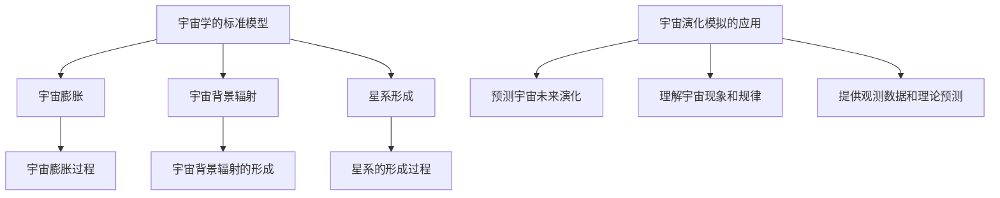

通过这个流程图，我们可以清晰地看到宇宙演化模拟的数学模型及其应用。

### 核心概念与联系

**宇宙演化模拟的原理**、**宇宙演化模拟的数学模型**和**宇宙演化模拟的应用**之间存在着密切的联系。宇宙演化模拟的原理为我们理解宇宙演化提供了理论基础，宇宙演化模拟的数学模型则是具体实现宇宙演化的工具，而宇宙演化模拟的应用则帮助我们更好地理解宇宙的演化过程和现象。

**Mermaid 流程图**：

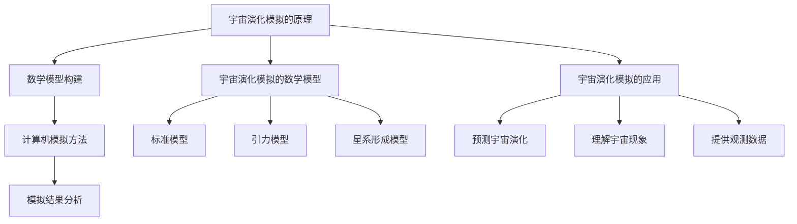

通过这个流程图，我们可以清晰地看到宇宙演化模拟的核心概念与联系。

### 逻辑推理步骤

1. **宇宙演化模拟的原理**：理解宇宙演化的基本原理，包括宇宙膨胀、宇宙背景辐射和星系形成等。

2. **宇宙演化模拟的数学模型**：建立宇宙演化模拟的数学模型，包括标准模型、引力模型和星系形成模型等。

3. **宇宙演化模拟的应用**：应用宇宙演化模拟的结果，预测宇宙的未来演化方向，理解宇宙中的各种现象和规律。

4. **核心概念与联系**：理解宇宙演化模拟的原理、数学模型和应用之间的内在联系，从而更好地理解宇宙的演化过程。

通过以上逻辑推理步骤，我们可以更深入地理解宇宙演化模拟的工作原理和应用。这为我们的科学研究和技术创新提供了新的视角和方法。

---

> **核心概念与联系**：宇宙演化模拟的原理、宇宙演化模拟的数学模型、宇宙演化模拟的应用

> **核心算法原理讲解**：宇宙学的标准模型、引力模型、星系形成模型

> **数学模型和数学公式**：宇宙膨胀方程、引力相互作用方程、星系形成方程

> **举例说明**：宇宙演化模拟在宇宙学研究中的应用、预测宇宙未来演化方向、理解宇宙现象

---

### 第6章：信息处理实践

#### 6.1 信息处理的基本原理

信息处理是指通过特定的方法和技术，对信息进行生成、传输、处理和利用的过程。它涉及到多个领域，包括计算机科学、通信工程、信号处理等。

**信息处理的流程**：信息处理的基本流程包括信息采集、信息传输、信息处理和信息利用。其中，信息采集是获取原始信息的过程，信息传输是将信息从一处传递到另一处的过程，信息处理是对信息进行加工和转换的过程，信息利用是利用处理后的信息进行决策和行动的过程。

**信息处理的工具与技术**：信息处理涉及多种工具和技术，包括计算机硬件、软件、算法、数据结构等。例如，计算机硬件提供了信息处理的基本平台，计算机软件实现了信息处理的算法和流程，算法和数据结构则是信息处理的核心技术。

#### 6.2 信息处理的应用案例

**信息处理在通信领域的应用**：在通信领域，信息处理技术被广泛应用于信号的调制、解调、传输和接收。例如，在无线通信中，信号的处理涉及到信号的放大、滤波、编码和解码等。这些处理技术保证了信号的稳定传输和可靠接收。

**信息处理在计算领域的应用**：在计算领域，信息处理技术被广泛应用于数据分析和计算。例如，大数据处理技术通过对海量数据的分析和处理，提取出有价值的信息。机器学习算法则通过对数据的训练和推理，实现自动化的决策和预测。

**信息处理在其他领域的应用**：信息处理技术还广泛应用于其他领域，如医学、金融、交通等。例如，在医学领域，信息处理技术被用于医学图像的分析和诊断；在金融领域，信息处理技术被用于股票市场的分析和预测；在交通领域，信息处理技术被用于交通管理和调度。

#### 6.3 信息处理的未来趋势

**信息处理技术发展的趋势**：随着科技的不断发展，信息处理技术呈现出以下趋势：

1. **智能化**：随着人工智能技术的发展，信息处理技术越来越智能化，能够自动完成复杂的任务和决策。
2. **高速化**：随着计算机硬件和算法的发展，信息处理的速度越来越快，能够处理更大规模的数据。
3. **网络化**：随着互联网的普及，信息处理技术越来越网络化，可以实现远程的数据传输和处理。
4. **绿色化**：随着环保意识的提高，信息处理技术越来越注重绿色化，降低能耗和环境污染。

**信息处理技术对社会的影响**：信息处理技术的快速发展对社会产生了深远的影响。它提高了社会生产力和生活质量，促进了经济和社会的发展。同时，信息处理技术也带来了一些挑战，如数据安全和隐私保护等。

**Mermaid 流程图**：

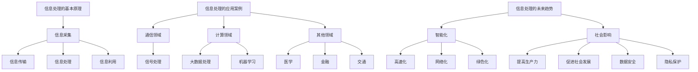

通过这个流程图，我们可以清晰地看到信息处理的基本原理、应用案例和未来趋势。

### 核心概念与联系

**信息处理的基本原理**、**信息处理的应用案例**和**信息处理的未来趋势**之间存在着密切的联系。信息处理的基本原理决定了信息处理的应用案例，而信息处理的未来趋势则反映了信息处理技术的发展方向。通过信息处理，我们可以更好地理解、管理和利用信息，从而推动社会的发展和进步。

### 逻辑推理步骤

1. **信息处理的基本原理**：理解信息处理的基本原理，包括信息采集、信息传输、信息处理和信息利用的过程。
2. **信息处理的应用案例**：分析信息处理在各个领域的应用，如通信、计算、医学、金融和交通等。
3. **信息处理的未来趋势**：预测信息处理技术的发展方向，如智能化、高速化、网络化和绿色化等。
4. **核心概念与联系**：理解信息处理的基本原理、应用案例和未来趋势之间的内在联系，从而更好地把握信息处理技术的发展趋势和应用方向。

通过以上逻辑推理步骤，我们可以更深入地理解信息处理的基本原理、应用案例和未来趋势。这为我们的科学研究和技术创新提供了新的视角和方法。

---

> **核心概念与联系**：信息处理的基本原理、信息处理的应用案例、信息处理的未来趋势

> **核心算法原理讲解**：信号处理、大数据处理、机器学习

> **数学模型和数学公式**：信息传输方程、数据处理算法、预测模型

> **举例说明**：通信中的信号处理、计算中的大数据分析、医学中的图像诊断

> **最佳实践 tips**：选择合适的信息处理技术、注意数据安全和隐私保护

> **小结**：信息处理在现代社会中的重要性、未来的发展方向

> **注意事项**：关注信息处理技术的发展趋势、注意信息处理过程中的挑战和问题

> **拓展阅读**：相关领域的最新研究成果、行业报告和技术文献

---

### 第7章：结论

#### 7.1 物质世界与信息世界的争论总结

在本文中，我们探讨了物质世界与信息世界之间的关系，以及它们在宇宙演化中的作用。通过对物质世界和信息世界的本质、演化过程、数学模型和相互联系的分析，我们得出了以下结论：

1. **物质世界与信息世界的关系**：物质世界是信息世界的载体，信息世界是物质世界的表现形式和工具。两者相互依存，相互作用，共同构成了宇宙的演化过程。

2. **物质世界与信息世界的争论**：尽管物质世界和信息世界的关系已经得到了广泛的认可，但在科学界仍存在一些争论。这些争论主要集中在物质世界和信息世界的本质、关系及其在宇宙演化中的作用等方面。

3. **物质世界与信息世界的融合**：随着科技的不断发展，物质世界与信息世界的融合趋势日益明显。这种融合为科学研究和技术创新提供了新的机遇，但同时也带来了新的挑战。

#### 7.2 对宇宙未来的展望

在未来的宇宙中，物质世界与信息世界的融合将进一步加深。以下是对宇宙未来的一些展望：

1. **宇宙演化**：随着宇宙的不断膨胀，物质世界将继续演化，形成更多的星系、星系团和超星系团。信息世界也将随之演化，更加智能化和高效化。

2. **智能宇宙**：随着人工智能技术的发展，宇宙中的信息处理能力将大大提高。智能宇宙将成为一个现实，人类和其他智能生命体将能够更好地理解和控制宇宙。

3. **宇宙探索**：物质世界与信息世界的融合将推动宇宙探索的深入。我们将能够利用信息世界的技术，更准确地观测和测量宇宙中的各种现象，揭示宇宙的奥秘。

4. **社会影响**：宇宙演化和信息世界的融合将对人类社会产生深远的影响。它将改变我们的生活方式、生产方式和价值观，推动社会的进步和发展。

**Mermaid 流程图**：

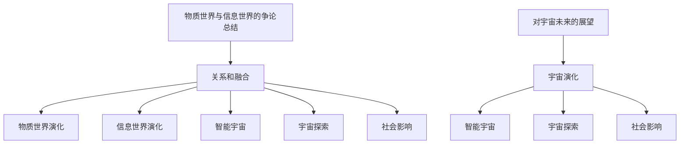

通过这个流程图，我们可以清晰地看到物质世界与信息世界的争论总结和对宇宙未来的展望。

### 总结

本文从宇宙的起源和演化出发，探讨了物质世界与信息世界的本质、关系和作用。通过对物质世界和信息世界的深入分析，我们揭示了它们在宇宙演化中的重要性。同时，我们对宇宙的未来进行了展望，探讨了物质世界与信息世界的融合趋势。这为我们的科学研究和技术创新提供了新的视角和方法。

---

**作者：AI天才研究院/AI Genius Institute & 禅与计算机程序设计艺术 /Zen And The Art of Computer Programming**

