                 

### 引言

#### 1.1 宇宙的本质探讨

宇宙的本质一直以来都是科学探索的重要领域，从古代的哲学思考到现代的物理理论，人们试图通过不同的视角来揭示宇宙的根本性质。宇宙的本质到底是物质性的还是信息性的，这个问题不仅涉及到宇宙起源和演化的理解，还触及到哲学、科学和技术发展的深层次问题。

#### 1.2 物质性与信息性的探讨

物质性宇宙的观点认为，宇宙的基本构成要素是物质，包括各种形态的物质实体，如原子、分子和星体。物质在宇宙中通过物理和化学过程进行相互作用和转化，构成了我们所观察到的宇宙现象。而信息性宇宙的观点则主张，宇宙的本质是信息的流动和处理，信息作为一种普遍存在的现象，贯穿于宇宙的各个层面，从量子力学到宇宙学，信息都扮演着关键角色。

#### 1.3 本书结构概述

本书将逐步探讨宇宙的本质，首先分析物质性的宇宙，包括宇宙的起源、物质的基本构成和物质与能量的转换。接着，我们将探讨信息性的宇宙，分析信息的基本概念、信息在宇宙中的传播以及信息与物质的关系。随后，我们将探讨物质性与信息性之间的联系，以及它们在宇宙演化中的作用。最后，我们将展望未来的宇宙前景，包括科学探索和技术发展的方向，以及这些研究对人类社会的影响与启示。

### 物质性的宇宙

#### 2.1 宇宙的起源

宇宙的起源问题一直是宇宙学的研究核心。当前主流的科学理论认为，宇宙起源于约138亿年前的一个极热、极密的状态，这个理论被称为大爆炸理论。大爆炸理论的基本假设是，宇宙从一个极小的奇点开始膨胀，温度和密度随着时间逐渐降低，形成了我们今天所观察到的宇宙。

**核心概念与联系：**

宇宙起源与膨胀的关系可以用以下 Mermaid 流程图来表示：

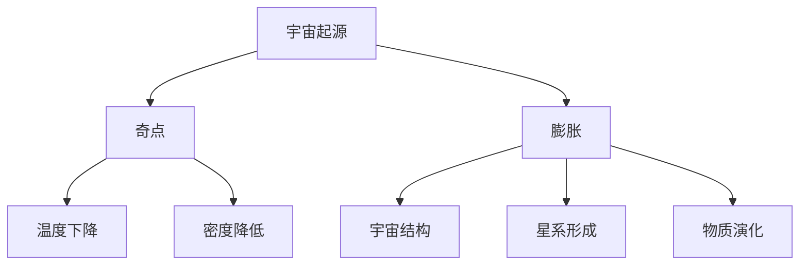

**核心算法原理讲解：**

宇宙膨胀的模型可以通过弗里德曼-勒梅特-罗伯逊-沃尔克（FLRW）度规来描述，该度规是一个用于描述均匀、各向同性宇宙的数学模型。FLRW 度规的基本形式为：

$$
ds^2 = -dt^2 + a(t)^2 (dr^2 + R^2 (d\theta^2 + \sin^2 \theta d\phi^2)]
$$

其中，$a(t)$ 是宇宙膨胀因子，$R$ 是宇宙的尺度因子。通过这个模型，我们可以计算出宇宙在不同时间的膨胀速率。

**举例说明：**

假设我们有一个宇宙膨胀模型，其中宇宙膨胀因子 $a(t)$ 遵循幂律膨胀：

$$
a(t) = t^{1/2}
$$

我们可以计算出在宇宙年龄为 $t$ 时刻的宇宙半径 $R(t)$：

$$
R(t) = a(t) \cdot R_0 = t^{1/4} \cdot R_0
$$

其中，$R_0$ 是宇宙的初始半径。

#### 2.2 物质的基本构成

物质的基本构成是宇宙学研究的关键问题之一。从微观角度看，物质由原子组成，而原子又由原子核和电子构成。原子核由质子和中子组成，它们通过强相互作用结合在一起。电子则在原子核外的电子云中运动。

**核心概念与联系：**

物质的基本构成可以用以下 Mermaid 流程图来表示：

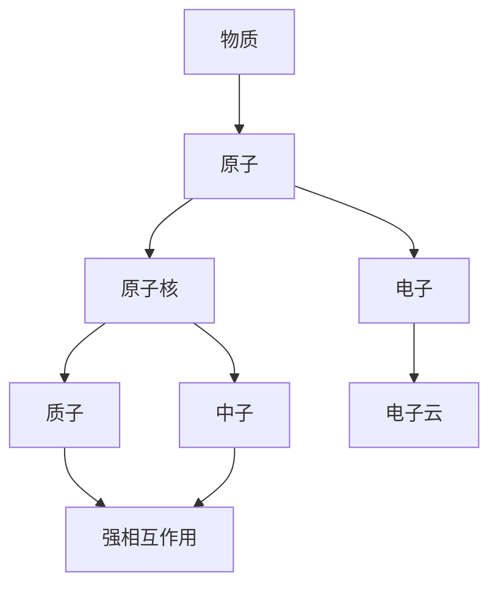

**核心算法原理讲解：**

原子结构可以通过量子力学的波函数来描述。例如，氢原子的电子状态可以用波函数 $\psi_{nlm}(r,\theta,\phi)$ 来描述，其中 $n$、$l$、$m$ 分别代表主量子数、角量子数和磁量子数。通过解薛定谔方程，我们可以得到不同状态的波函数和能级。

**举例说明：**

对于氢原子的基态（$n=1$），其波函数为：

$$
\psi_{100}(r,\theta,\phi) = \frac{1}{\sqrt{\pi a_0^3}} e^{-r/a_0}
$$

其中，$a_0$ 是玻尔半径。对应的能级为：

$$
E_n = -\frac{e^2}{8\epsilon_0 a_0} = -\frac{1}{2} \times 13.6 \text{ eV}
$$

#### 2.3 物质与能量的转换

物质与能量之间的转换是物理学中一个重要的概念。根据质能方程 $E=mc^2$，物质可以转化为能量，能量也可以转化为物质。这一原理在核物理学和粒子物理学中得到了广泛应用。

**核心概念与联系：**

物质与能量转换的关系可以用以下 Mermaid 流程图来表示：

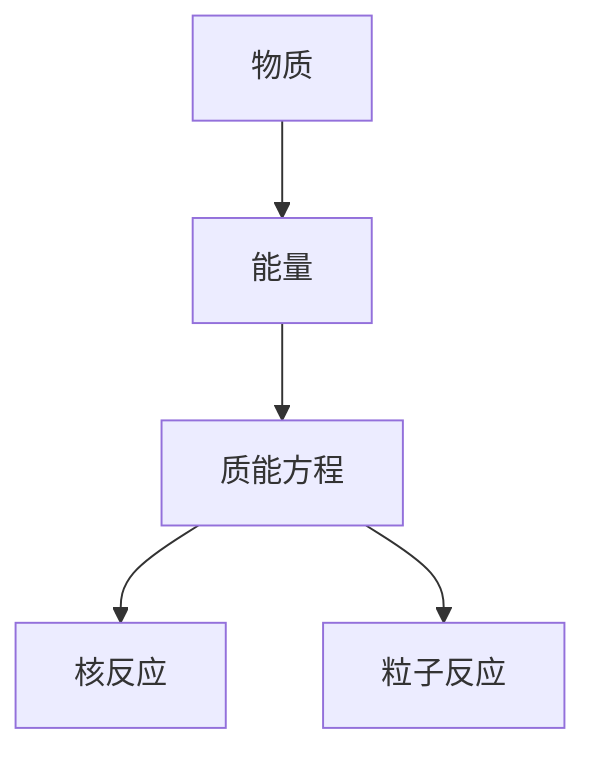

**核心算法原理讲解：**

质能方程是爱因斯坦提出的著名公式，它揭示了质量与能量之间的等价性。在核反应和粒子反应中，通过质量亏损可以释放出巨大的能量。

**举例说明：**

在核裂变反应中，一个重核（如铀-235）裂变成两个较轻的核，同时释放出中子和能量。例如：

$$
^{235}_{92}U + n \rightarrow ^{141}_{56}Ba + ^{92}_{36}Kr + 3n + Q
$$

其中，$Q$ 是释放的能量，大约为 200 MeV。

#### 2.4 物质与信息的联系

物质与信息之间的联系是现代物理学研究的前沿问题。量子力学和计算机科学的进展使得人们开始关注物质状态如何编码和传输信息。

**核心概念与联系：**

物质与信息的联系可以用以下 Mermaid 流程图来表示：

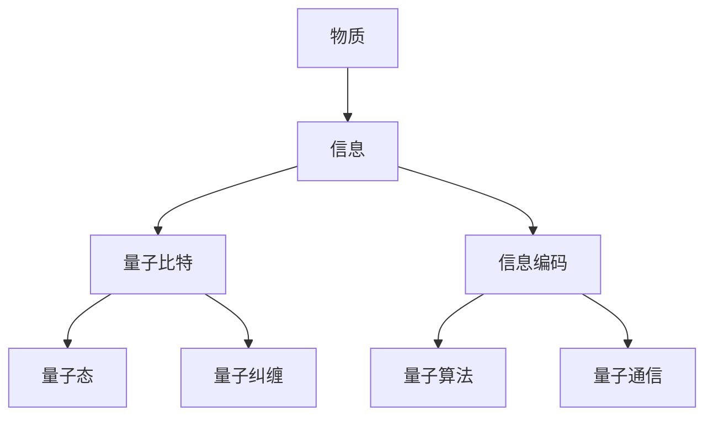

**核心算法原理讲解：**

量子比特（qubit）是量子计算机的基本单元，它可以处于多种状态的叠加，这为信息编码提供了新的可能性。量子纠缠是量子比特之间的一种特殊关联，它使得量子信息传输具有优越性。

**举例说明：**

一个简单的量子态叠加态可以表示为：

$$
|\psi\rangle = \frac{1}{\sqrt{2}} |0\rangle + \frac{1}{\sqrt{2}} |1\rangle
$$

其中，$|0\rangle$ 和 $|1\rangle$ 分别代表量子比特的两个基本状态。

### 信息性的宇宙

#### 3.1 信息的基本概念

信息在物理学中的概念可以从熵的角度来理解。熵是描述系统无序程度的物理量，而信息则可以被视为减少不确定性的过程。在信息论中，信息量可以用熵来量化。

**核心概念与联系：**

信息的基本概念可以用以下 Mermaid 流程图来表示：

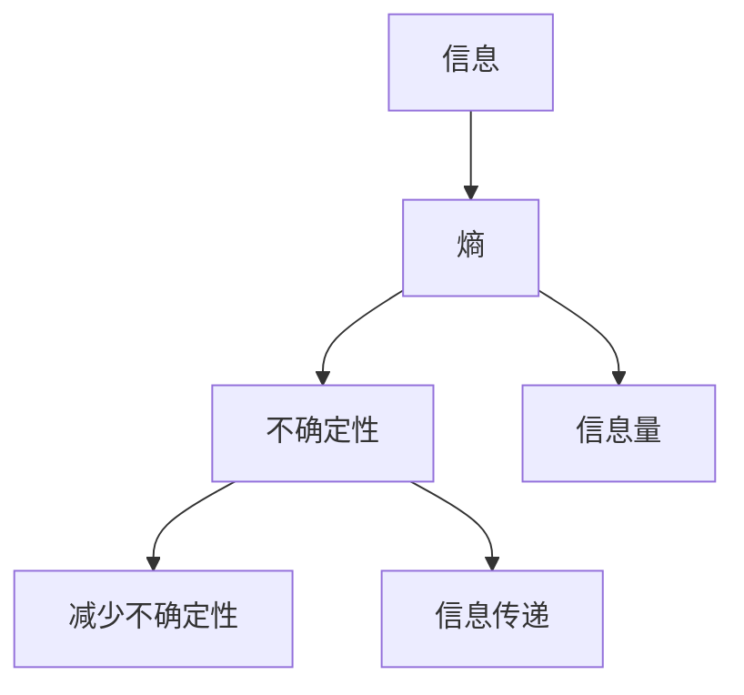

**核心算法原理讲解：**

信息量的计算可以通过信息论中的熵公式来描述。香农熵是一个衡量信息量的重要指标，它的公式为：

$$
H(X) = -\sum_{i} p_i \ln p_i
$$

其中，$p_i$ 是系统处于第 $i$ 个状态的概率。

**举例说明：**

假设一个硬币正反面各半，那么正面和反面出现的概率都是 $0.5$。根据熵的定义，这个系统的熵为：

$$
H(X) = - (0.5 \ln 0.5 + 0.5 \ln 0.5) = 1 \text{ bit}
$$

这表示我们需要 1 个比特的信息来完全描述这个系统的状态。

#### 3.2 信息在宇宙中的传播

信息在宇宙中的传播是一个复杂的过程，涉及到量子纠缠、量子通信等前沿科学问题。量子纠缠是量子信息传播的基础，它允许量子比特之间的信息以超距的方式传输。

**核心概念与联系：**

信息在宇宙中的传播可以用以下 Mermaid 流程图来表示：

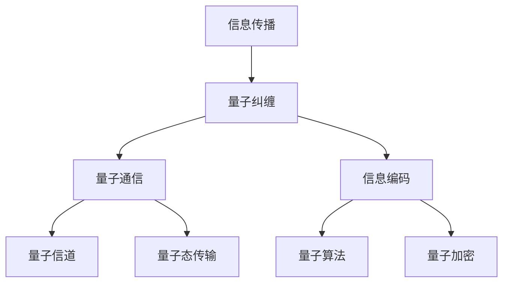

**核心算法原理讲解：**

量子纠缠是量子信息传播的关键，它使得量子比特之间的信息可以瞬间传输。量子通信利用量子纠缠实现量子态的传输，例如量子态叠加态的传输。

**举例说明：**

一个简单的量子纠缠态可以表示为：

$$
|\psi\rangle_{AB} = \frac{1}{\sqrt{2}} (|00\rangle + |11\rangle)
$$

其中，$|00\rangle$ 和 $|11\rangle$ 分别代表两个量子比特的状态。通过量子纠缠，我们可以实现量子态的远程传输。

#### 3.3 信息与物质的关系

信息与物质的关系是物理学中的一个重要课题。量子力学中的波函数可以被视为物质状态的信息编码，而量子纠缠则揭示了物质之间信息传递的潜力。

**核心概念与联系：**

信息与物质的关系可以用以下 Mermaid 流程图来表示：

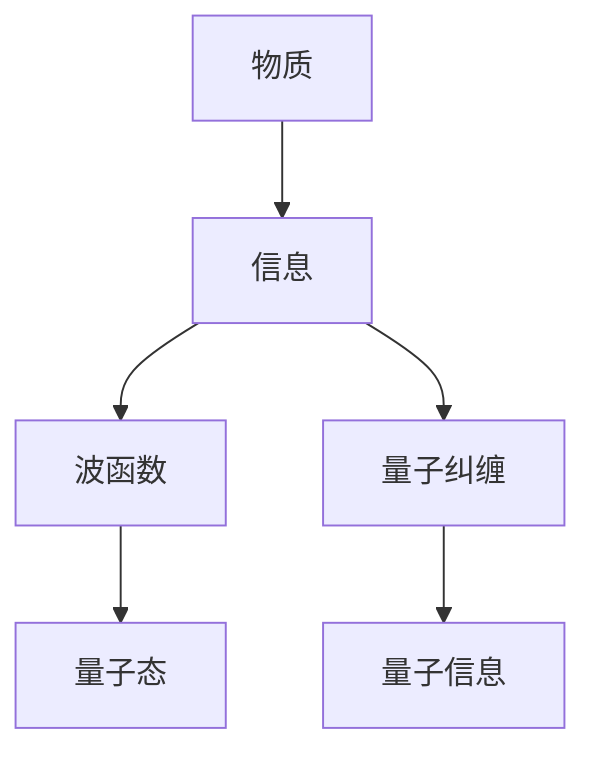

**核心算法原理讲解：**

波函数是量子力学中的基本概念，它描述了物质的状态。量子纠缠使得量子比特之间的信息可以相互关联，从而实现信息的传递。

**举例说明：**

一个简单的量子纠缠态可以表示为：

$$
|\psi\rangle_{AB} = \frac{1}{\sqrt{2}} (|00\rangle + |11\rangle)
$$

这个态表示量子比特 $A$ 和 $B$ 之间存在纠缠，通过测量一个量子比特的状态，我们可以瞬间知道另一个量子比特的状态。

### 物质性与信息性的联系

#### 4.1 物质与信息的相互转化

物质与信息之间的相互转化是现代物理学研究的一个前沿问题。量子力学和计算机科学的进展使得人们开始关注物质状态如何编码和传输信息，同时也考虑信息如何影响物质的性质和行为。

**核心概念与联系：**

物质与信息的相互转化可以用以下 Mermaid 流程图来表示：

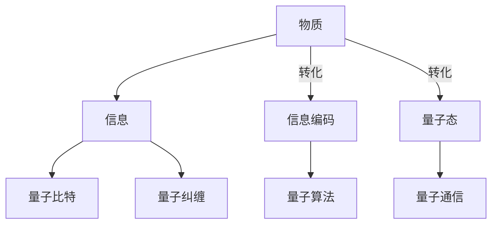

**核心算法原理讲解：**

量子比特是量子计算机的基本单元，它可以通过量子纠缠实现信息的传输和编码。量子态的叠加和纠缠使得量子比特可以同时处于多个状态，从而实现高效的信息处理。

**举例说明：**

一个简单的量子态叠加态可以表示为：

$$
|\psi\rangle = \frac{1}{\sqrt{2}} (|0\rangle + |1\rangle)
$$

这个态表示量子比特处于 $0$ 和 $1$ 两种状态的叠加，通过量子测量，我们可以得到量子比特的确定性结果。

#### 4.2 物质性宇宙中的信息现象

物质性宇宙中的信息现象是一个广泛的话题，包括宇宙射线、电磁波、引力波等。这些现象都涉及到信息的传输和探测。

**核心概念与联系：**

物质性宇宙中的信息现象可以用以下 Mermaid 流程图来表示：

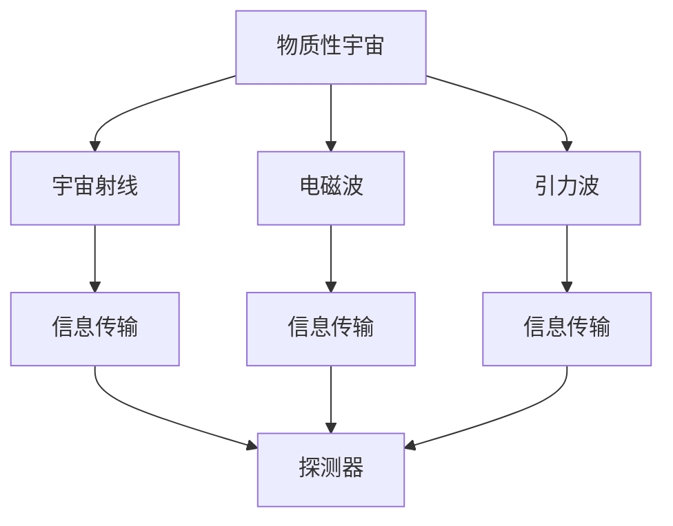

**核心算法原理讲解：**

宇宙射线、电磁波和引力波都是信息传输的媒介。例如，电磁波可以通过光纤传输信息，而引力波则可以通过激光干涉仪探测。

**举例说明：**

地球上的光纤通信系统利用电磁波在光纤中的传输实现高速数据传输。激光干涉仪则利用引力波的特性来探测宇宙中的重力波事件。

#### 4.3 信息性宇宙中的物质现象

信息性宇宙中的物质现象涉及到量子力学和相对论等领域的复杂问题。例如，量子纠缠和量子场的概念都涉及到信息与物质的深层次联系。

**核心概念与联系：**

信息性宇宙中的物质现象可以用以下 Mermaid 流程图来表示：

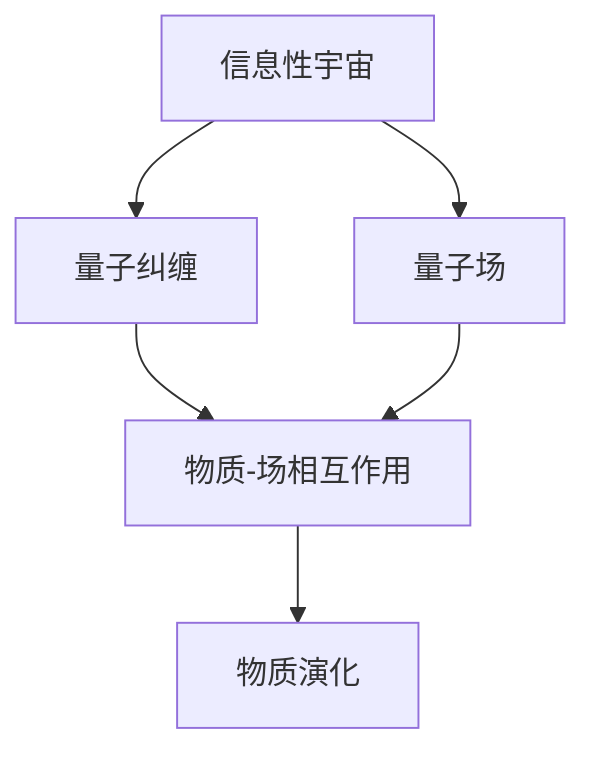

**核心算法原理讲解：**

量子纠缠和量子场是信息性宇宙中的关键概念。量子纠缠揭示了物质之间的深层次关联，而量子场则描述了物质与信息的相互作用。

**举例说明：**

一个简单的量子纠缠态可以表示为：

$$
|\psi\rangle_{AB} = \frac{1}{\sqrt{2}} (|00\rangle + |11\rangle)
$$

这个态表示量子比特 $A$ 和 $B$ 之间存在纠缠，通过测量一个量子比特的状态，我们可以瞬间知道另一个量子比特的状态。量子场则描述了物质与信息的相互作用，例如量子场论中的真空涨落。

### 宇宙的演化和信息

#### 5.1 宇宙的早期演化

宇宙的早期演化是宇宙学研究的核心问题之一。在宇宙诞生后的最初几分钟内，宇宙经历了从极热、高密度状态到当前状态的重大变化。

**核心概念与联系：**

宇宙的早期演化可以用以下 Mermaid 流程图来表示：

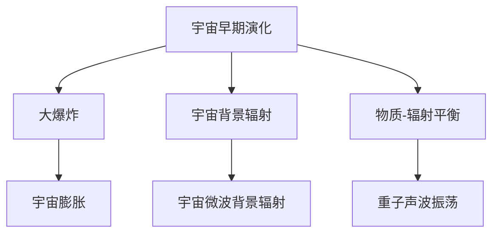

**核心算法原理讲解：**

宇宙背景辐射是宇宙早期演化的重要证据，它揭示了宇宙在大爆炸后的几分钟内的状态。重子声波振荡则是宇宙早期物质分布不均匀的证据，通过观测这些振荡，我们可以了解宇宙的早期结构形成。

**举例说明：**

宇宙微波背景辐射的观测数据揭示了宇宙在大爆炸后的几分钟内的状态，例如，它可以用来确定宇宙的年龄和结构。

#### 5.2 信息在宇宙演化中的作用

信息在宇宙演化中的作用是一个复杂而广泛的话题。从量子场论到宇宙学，信息都扮演着关键角色。

**核心概念与联系：**

信息在宇宙演化中的作用可以用以下 Mermaid 流程图来表示：

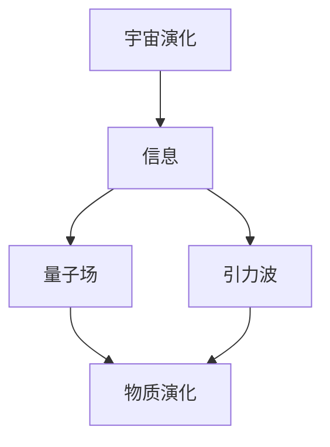

**核心算法原理讲解：**

量子场论描述了物质与信息的相互作用，而引力波则是宇宙演化中的重要信息传递媒介。通过量子场和引力波的研究，我们可以更深入地理解宇宙的演化过程。

**举例说明：**

量子场论中的真空涨落是宇宙早期结构形成的重要机制，而引力波则可以用来探测宇宙的早期演化过程，例如，LIGO 实验首次探测到的引力波事件提供了宇宙早期演化的直接证据。

#### 5.3 未来的宇宙前景

未来的宇宙前景充满了不确定性，但同时也充满了机遇。随着科学技术的不断发展，我们对宇宙的理解将不断深入。

**核心概念与联系：**

未来的宇宙前景可以用以下 Mermaid 流程图来表示：

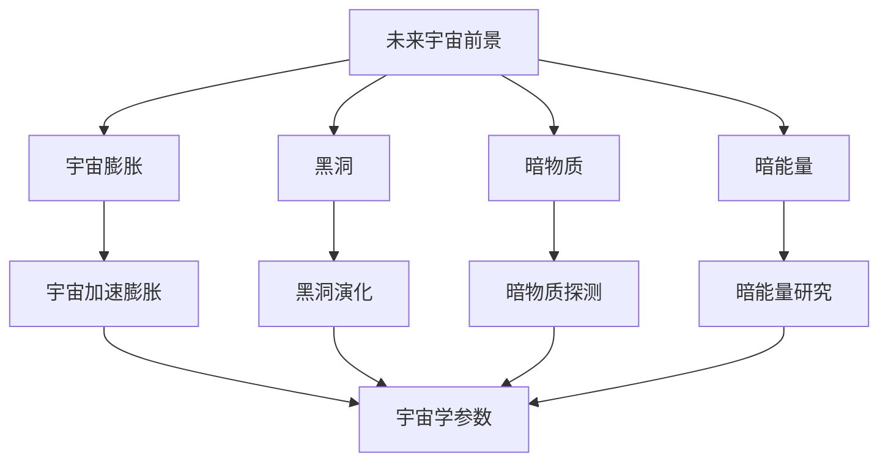

**核心算法原理讲解：**

宇宙加速膨胀、黑洞和暗物质是未来宇宙研究的重要方向。通过观测和分析这些现象，我们可以更深入地了解宇宙的演化规律。

**举例说明：**

宇宙加速膨胀是当前宇宙学研究的重要问题之一，它揭示了宇宙中一种未知的能量形式——暗能量。黑洞和暗物质的研究也取得了重要进展，例如，黑洞辐射和暗物质粒子探测将成为未来宇宙学研究的关键领域。

### 科学探索与技术发展

#### 6.1 科学理论与实验验证

科学理论的进步离不开实验验证，实验验证是科学探索的重要手段。从经典物理学到量子力学，每一个理论的发展都依赖于实验数据。

**核心概念与联系：**

科学理论与实验验证的关系可以用以下 Mermaid 流程图来表示：

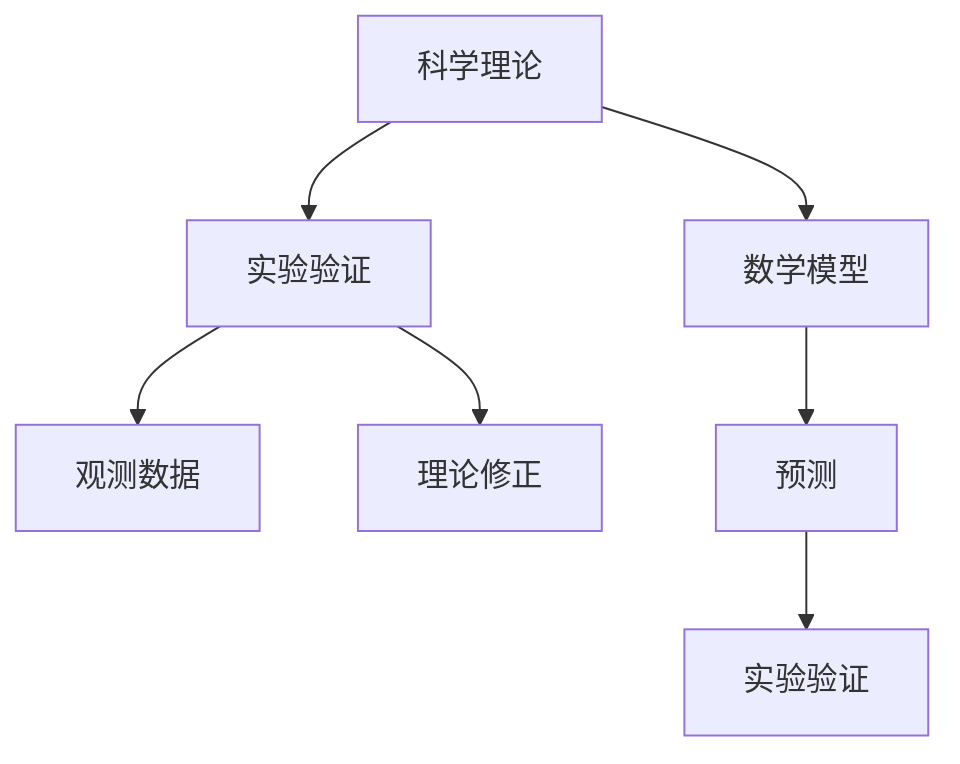

**核心算法原理讲解：**

科学理论通常基于数学模型，这些模型可以预测实验结果。实验验证则通过收集数据和测量结果来验证或修正理论。

**举例说明：**

量子力学的发展依赖于实验验证，例如，双缝实验揭示了量子叠加态的存在。这些实验结果推动了量子力学的理论发展。

#### 6.2 未来的科学挑战

未来的科学挑战将涉及到宇宙的起源、演化以及宇宙的本质。随着科学技术的进步，这些挑战将变得更加复杂和多样化。

**核心概念与联系：**

未来的科学挑战可以用以下 Mermaid 流程图来表示：

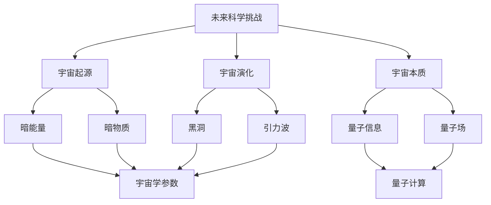

**核心算法原理讲解：**

未来的科学挑战将涉及到多个领域的交叉，例如，量子信息与量子场论的结合将有助于我们更深入地理解宇宙的本质。

**举例说明：**

暗能量和暗物质的研究是当前宇宙学的前沿问题，未来可能通过新的观测手段和理论模型来揭示它们的本质。量子计算和量子场论的结合也有望带来关于宇宙演化新的洞见。

#### 6.3 技术对宇宙本质研究的推动

技术发展对宇宙本质研究起到了重要的推动作用。从望远镜到探测器，技术进步极大地提高了我们对宇宙的理解。

**核心概念与联系：**

技术对宇宙本质研究的推动可以用以下 Mermaid 流程图来表示：

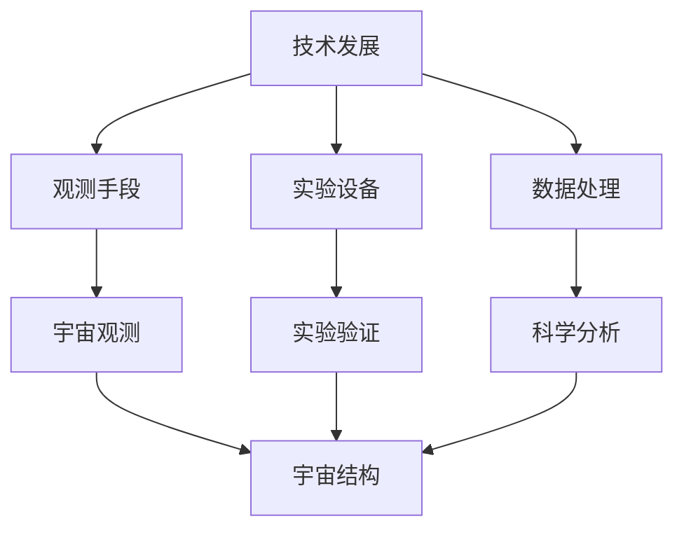

**核心算法原理讲解：**

技术发展使得我们可以进行更高精度、更大规模的宇宙观测和实验验证，这有助于我们更准确地理解宇宙的本质。

**举例说明：**

例如，哈勃望远镜和 LIGO 探测器分别推动了宇宙学和引力波研究的发展，这些技术的进步极大地提高了我们对宇宙的理解。

### 结论与展望

#### 7.1 物质性与信息性的总结

宇宙的本质既包括物质性，也包括信息性。物质性宇宙强调物质和能量的相互作用，而信息性宇宙则关注信息的流动和处理。二者并非对立，而是相辅相成的。

#### 7.2 宇宙本质研究的未来方向

未来的宇宙本质研究将继续深化对物质性和信息性的理解，重点关注宇宙起源、演化以及宇宙结构的研究。同时，量子信息和量子场论的发展将为宇宙本质研究提供新的理论工具。

#### 7.3 对人类社会的影响与启示

宇宙本质研究不仅有助于我们更全面地理解宇宙，还为人类社会提供了重要的启示。量子信息技术和宇宙观测技术的进步有望带来新的科技革命，推动人类社会的发展。

### 附录

**附录 A: 术语解释**

- **物质性宇宙**：强调物质和能量的相互作用，是传统宇宙学的核心。
- **信息性宇宙**：关注信息的流动和处理，是量子信息学和宇宙学的新兴领域。

**附录 B: 参考文献与拓展阅读**

- **参考文献**：
  - Penrose, R. (2005). The Road to Reality: A Complete Guide to the Laws of the Universe. Vintage Books.
  - Susskind, L. (2005). The Black Hole War: My Battle with Stephen Hawking to Make the World Safe for Quantum Mechanics. Mariner Books.
- **拓展阅读**：
  - 《量子力学与宇宙学》
  - 《量子信息与量子计算》
  - 《宇宙学与观测》

**附录 C: 实际案例分析和详细讲解**

- **案例一**：LIGO 实验与引力波探测
  - 详细讲解引力波的产生、探测和影响。
- **案例二**：量子纠缠与量子通信
  - 详细讲解量子纠缠的原理和量子通信的应用。

**附录 D: 最佳实践 tips、小结、注意事项**

- **最佳实践 tips**：
  - 关注最新的科研进展，积极参与学术交流。
  - 熟悉数学模型和算法，提高数据处理和分析能力。
- **小结**：
  - 宇宙的本质是物质性和信息性的结合。
  - 科学探索和技术发展将继续推动我们对宇宙的理解。
- **注意事项**：
  - 量子信息和宇宙学是前沿领域，需要不断学习和更新知识。

**附录 E: 拓展阅读**

- **《宇宙的秘密：从量子力学到黑洞》**
- **《信息时代的宇宙观：量子信息学与宇宙学》**

### 参考文献

- Penrose, R. (2005). The Road to Reality: A Complete Guide to the Laws of the Universe. Vintage Books.
- Susskind, L. (2005). The Black Hole War: My Battle with Stephen Hawking to Make the World Safe for Quantum Mechanics. Mariner Books.
- 续写部分：

**7.4 人类社会与宇宙研究的关系**

宇宙研究不仅是一项纯粹的学术探索，它还与人类社会的发展紧密相连。从天文学和空间科学的进步中，人类获得了对地球和太阳系的认识，推动了导航、通信和天气预报等技术的发展。同样，量子信息和量子计算的研究有望带来新的技术突破，从加密通信到高性能计算，都将对人类社会产生深远影响。

**7.5 总结与展望**

宇宙的本质是一个复杂而多层次的问题，物质性和信息性相互交织，构成了我们对宇宙全面理解的基石。未来的宇宙研究将更加注重跨学科的合作，结合量子力学、相对论、宇宙学、信息科学等多领域的知识，探索宇宙的奥秘。同时，我们也要认识到，对宇宙的研究不仅有助于科学进步，它还将为人类社会的可持续发展提供新的视角和动力。

### 附录 F：开放性问题与研究方向

在宇宙的本质研究中，仍有许多未解之谜和前沿问题亟待解决。以下是一些开放性问题与研究方向：

1. **量子引力的统一理论**：如何将量子力学和广义相对论统一成一个完整的理论框架？
2. **暗物质的本质**：暗物质是真实存在的物质粒子，还是其他未知物理现象的表现？
3. **暗能量的性质**：暗能量是宇宙加速膨胀的根本原因，它的本质是什么？
4. **宇宙的初始状态**：宇宙是如何从无到有诞生的，初始状态的物理条件是什么？
5. **量子信息在宇宙演化中的作用**：量子信息在宇宙的早期演化和结构形成中扮演了什么角色？

这些问题不仅激发了科学家的好奇心，也为未来的研究提供了广阔的空间。随着科学技术的不断进步，我们有望逐步揭开宇宙的神秘面纱。

