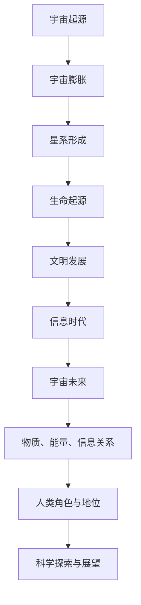

                 

# 《宇宙的本质:物质、能量还是信息》

> 关键词：宇宙本质、物质、能量、信息、宇宙演化、科学探索

> 摘要：本文以宇宙的本质为出发点，探讨了物质、能量与信息之间的关系。通过回顾宇宙探索的历史，解析了物质、能量和信息的核心概念，并深入探讨了它们在宇宙演化中的角色和作用。文章还结合现代科学研究成果，分析了物质、能量与信息的相互转化和统一性，最终对宇宙的未来和人类在其中的地位进行了展望。

## 引言

### 1.1 宇宙探索的历史与现状

自人类文明诞生以来，宇宙一直吸引着无数探索者的目光。从古代的天文学到现代的天体物理学，宇宙探索的脚步从未停止。中国古代的天文学家如张衡、郭守敬等，通过观测天体运动，提出了诸多关于宇宙的理论。而欧洲文艺复兴时期的哥白尼，则提出了日心说，彻底改变了人类对宇宙的认识。

20世纪以来，随着科学技术的发展，宇宙探索进入了一个全新的阶段。哈勃望远镜的发明使我们能够观测到遥远的星系和星云，揭示了宇宙的膨胀和演化的奥秘。2013年，物理学家艾萨克·阿西莫夫曾预言，未来人类将能够穿越宇宙，探索更遥远的星球。虽然这一预言尚未实现，但宇宙探索的步伐从未停止。

### 1.2 物质、能量与信息的概念解析

在探讨宇宙的本质之前，有必要对物质、能量和信息这三个核心概念进行解析。

**物质**是宇宙中最基本的实体，它占据空间，具有质量。物质可以分为元素和化合物，而元素又分为不同的种类，如氢、氧、碳等。物质的存在和运动是宇宙演化的重要基础。

**能量**是物质运动和变化的动力。能量可以分为动能、势能、热能等形式。能量守恒定律指出，能量不能被创造或消灭，只能从一种形式转化为另一种形式。能量在宇宙演化中起着至关重要的作用。

**信息**是关于事物的知识或消息。信息可以通过语言、文字、图像、声音等形式传递。信息传递的过程实际上是信息的编码、传输和解码的过程。信息在宇宙中无处不在，它决定了物质的演化方向。

### 1.3 本书的目的与结构

本书旨在探讨宇宙的本质，分析物质、能量和信息在宇宙演化中的作用。本书将分为以下几个部分：

1. 宇宙的起源与演化
2. 物质的世界
3. 能量的本质
4. 信息与宇宙
5. 物质、能量与信息的联系
6. 探索宇宙的未来
7. 总结与展望

通过以上章节的探讨，本书希望能够帮助读者全面了解宇宙的本质，以及对物质、能量和信息三个核心概念的深入理解。

## 宇宙的起源与演化

### 2.1 宇宙大爆炸理论

宇宙大爆炸理论是目前被广泛接受的宇宙起源和演化理论。根据这一理论，宇宙起源于一个极高温度、极高密度的状态，称为“原始奇点”。大约138亿年前，原始奇点发生了大爆炸，导致宇宙迅速膨胀。这一过程产生了大量的物质和能量，这些物质和能量逐渐形成了星系、星云、行星等宇宙结构。

宇宙大爆炸理论得到了多个观测事实的支持。首先，天文学家通过观测宇宙背景辐射，发现了一个温度非常均匀的辐射背景，这被认为是宇宙大爆炸的余辉。其次，通过对遥远星系的观测，科学家发现星系之间的距离正在不断增大，这表明宇宙正在膨胀。

### 2.2 黑洞与暗物质

黑洞是宇宙中最神秘和最强大的天体之一。黑洞是由极端密集的物质形成的，它的引力如此强大，甚至连光都无法逃脱。根据广义相对论，黑洞的存在是可以解释的。然而，黑洞的观测和探测一直是一个巨大的挑战。

暗物质是宇宙中另一种神秘的存在。暗物质不发光，不发热，但它的存在对宇宙的演化起着至关重要的作用。科学家通过观测星系的旋转曲线，发现星系中的物质远比可见物质要多。这种不可见的物质就是暗物质。暗物质的性质和组成仍然是物理学界的研究重点。

### 2.3 宇宙的膨胀与加速

宇宙的膨胀是指宇宙中所有天体之间的距离随时间增大。根据宇宙大爆炸理论，宇宙从大爆炸以来一直在膨胀。然而，宇宙膨胀的速率并不是恒定的。近年来，科学家发现宇宙膨胀的速度正在加速。

宇宙膨胀加速的现象可以通过“暗能量”来解释。暗能量是一种充满整个宇宙的力，它的性质是排斥性的，导致宇宙膨胀的速度不断加快。暗能量的存在和性质是当前宇宙学研究的重点之一。

### 2.4 宇宙的射线与现象

宇宙射线是来自宇宙的高能粒子流，它们可以穿透地球的大气层。宇宙射线的来源和性质一直是科学家研究的重点。目前，普遍认为宇宙射线主要来自超新星爆炸、星系碰撞等极端宇宙事件。

除了宇宙射线，宇宙中还存在许多其他神秘的现象，如引力波、快速射电暴等。引力波是爱因斯坦广义相对论的预测之一，它的发现证实了黑洞的存在。快速射电暴是宇宙中的一种短暂而强烈的无线电信号，其来源和性质仍然是一个谜。

## 物质的世界

### 3.1 物质的构成

物质是宇宙中最基本的实体，它由原子和分子组成。原子是物质的基本单元，由原子核和核外电子构成。原子核由质子和中子组成，质子带正电荷，中子不带电荷。核外电子带负电荷，它们围绕原子核运动。

分子是由两个或更多原子通过共价键结合而成的。分子可以由相同的原子组成，如氧气分子（O2），也可以由不同的原子组成，如水分子（H2O）。分子是化学反应的基本单元，它们在化学反应中可以分解成原子，或者与其他分子结合形成新的分子。

### 3.2 元素周期表

元素周期表是化学的基础，它列出了所有已知的化学元素。元素周期表中的元素按照原子序数（即原子核中的质子数）排列。周期表中有七个周期，每个周期代表电子层的层数。周期表中的元素可以分为金属、非金属和类金属。

元素周期表不仅列出了元素的名称和符号，还提供了元素的重要性质，如原子量、电子亲和能、电离能等。通过元素周期表，科学家可以预测新元素的性质，并探索元素的周期性规律。

### 3.3 物质的状态与变化

物质可以存在于三种基本状态：固态、液态和气态。每种状态都有其独特的性质和特点。

- **固态**：固态物质的分子排列紧密，具有固定的形状和体积。固态物质不易压缩，具有较高的熔点和沸点。例如，冰是水的固态形式。
- **液态**：液态物质的分子排列较为紧密，但比固态物质的分子排列松散。液态物质具有固定的体积，但没有固定的形状，可以流动。例如，水是液态形式。
- **气态**：气态物质的分子排列非常松散，具有很高的自由度。气态物质没有固定的形状和体积，可以充满整个容器。例如，空气是气态形式。

物质的状态变化是化学反应和物理变化的重要表现形式。例如，水的固态（冰）可以通过加热转化为液态（水），再通过加热转化为气态（水蒸气）。物质的状态变化涉及到能量的转移和分子的重新排列。

### 3.4 物质与宇宙的关系

物质与宇宙的关系是密不可分的。宇宙中所有的星系、星云、行星等都是由物质构成的。物质在宇宙中的演化过程，也是宇宙演化的一个重要方面。

物质在宇宙中的演化主要通过化学反应和核反应实现。化学反应是分子之间发生相互作用，形成新物质的过程。核反应是原子核之间发生相互作用，导致原子核发生变化的过程。这些反应使得物质不断丰富多样，形成了我们今天所看到的宇宙。

物质与宇宙的关系也体现在生命和文明的发展中。地球上的生命和文明是由物质演化而来的。从单细胞生物到复杂的多细胞生物，从原始社会到现代社会，物质在生命和文明中的演化过程，也是宇宙演化的一部分。

## 能量的本质

### 4.1 能量的定义与分类

能量是物质运动和变化的动力，它存在于宇宙的各个方面。能量的定义可以简单概括为：能量是物质进行物理或化学反应时，其内部结构发生变化的量度。

根据能量存在的形式和性质，能量可以分为以下几类：

- **动能**：物体由于运动而具有的能量。动能的大小与物体的质量和速度有关。
- **势能**：物体由于其位置或状态而具有的能量。势能可以分为重力势能、弹性势能等。
- **热能**：物体内部粒子的热运动所具有的能量。热能与物体的温度有关。
- **电能**：电荷之间的相互作用所具有的能量。电能可以转化为其他形式的能量，如光能、机械能等。
- **光能**：光的能量，是电磁波的一种表现形式。光能可以转化为热能、化学能等。

### 4.2 能量守恒定律

能量守恒定律是物理学中最基本的定律之一。它指出，在一个封闭系统中，能量不能被创造或消灭，只能从一种形式转化为另一种形式。这意味着，一个系统的总能量在所有时间保持不变。

能量守恒定律可以表述为：在一个物理过程中，能量的总量不变。用数学公式表示为：

\[ E_{\text{总}} = E_{\text{初始}} + \Delta E \]

其中，\( E_{\text{总}} \) 是系统的总能量，\( E_{\text{初始}} \) 是系统在初始状态的总能量，\( \Delta E \) 是系统在过程中能量的转化。

能量守恒定律在宇宙演化和各种物理现象中都有着重要的作用。例如，宇宙的大爆炸和膨胀过程，星系的形成和演化，化学反应和核反应等，都遵循能量守恒定律。

### 4.3 能量的转化与利用

能量转化是指能量从一种形式转化为另一种形式的过程。能量转化在自然界和人类社会中无处不在。以下是一些常见的能量转化实例：

- **热能转化为机械能**：蒸汽机、热力学发动机等设备可以将热能转化为机械能，用于驱动各种机械设备。
- **电能转化为光能**：电灯、荧光灯等设备可以将电能转化为光能，用于照明。
- **光能转化为化学能**：植物的光合作用过程可以将光能转化为化学能，用于植物的生长和生命活动。
- **化学能转化为电能**：电池、燃料电池等设备可以将化学能转化为电能，用于供电。

能量的利用是现代社会发展的重要基础。人类通过不断开发和利用能源，推动了工业革命、信息化革命等重大变革。然而，能量的转化和利用也带来了许多环境和能源问题。如何高效、可持续地利用能源，是当前全球面临的重要挑战。

### 4.4 能量的未来

随着科技的不断进步，人类对能量的理解和利用也在不断深入。以下是一些关于能量未来的发展趋势：

- **可再生能源**：太阳能、风能、水能等可再生能源具有取之不尽、用之不竭的特点，是未来能源发展的重要方向。通过技术创新，可再生能源的利用效率不断提高，逐步替代传统的化石能源。
- **核能**：核能具有高能量密度、低碳排放的特点，是未来能源的重要补充。核能技术包括核裂变和核聚变两种形式。核裂变技术已经相对成熟，而核聚变技术尚处于实验阶段，但科学家们对此充满信心。
- **能源互联网**：随着智能电网、物联网等技术的发展，能源的传输、分配和使用将更加高效、智能化。能源互联网可以实现能源的高效利用，减少能源浪费，促进能源可持续发展。
- **能源存储技术**：能源存储技术是解决能源供应不稳定问题的重要手段。当前，电池技术、氢能技术等能源存储技术正在不断发展，有望在未来实现大规模应用。

总之，能量的未来充满希望和挑战。人类需要不断创新，探索和利用新的能源形式，以实现可持续发展和环境保护的目标。

## 信息与宇宙

### 5.1 信息的定义与特性

信息是关于事物的知识或消息。它是人类认识和改变世界的重要工具。信息可以存在于各种形式，如语言、文字、图像、声音等。信息具有以下基本特性：

- **客观性**：信息是对客观事物状态的描述，不受主观意识的影响。
- **可传递性**：信息可以通过各种媒介传递，如电信号、声波、光等。
- **可处理性**：信息可以通过计算、分析、处理等手段进行加工和利用。
- **可存储性**：信息可以以数字形式存储在计算机等设备中，便于长期保存和检索。

### 5.2 信息传递的机制

信息传递是信息科学的核心问题之一。信息传递的基本过程包括信息的编码、传输和解码。

- **编码**：编码是将信息转换为适合传输的形式的过程。例如，文字信息可以通过键盘输入转换为数字信号，图像信息可以通过图像处理算法转换为数字信号。
- **传输**：传输是将编码后的信息通过传输媒介（如光纤、无线电波等）从发送方传递到接收方的过程。传输过程中，信息可能会受到噪声、干扰等因素的影响。
- **解码**：解码是将接收到的信息转换回原始形式的过程。例如，数字信号可以通过显示器、音响等设备还原为文字、图像、声音等。

### 5.3 信息与宇宙的关系

信息与宇宙的关系是密不可分的。宇宙中的物质、能量和信息相互交织，共同构成了宇宙的复杂系统。

- **物质与信息**：物质是宇宙的基本构成要素，而信息则记录了物质的状态和变化。例如，生命是物质与信息相互作用的结果。人类通过观察、实验等手段获取信息，从而认识和理解宇宙。
- **能量与信息**：能量是物质运动的动力，而信息则是能量转化的方向和规则。例如，光合作用是光能转化为化学能的过程，其中信息起到了关键作用。
- **信息与演化**：信息在宇宙演化中起着至关重要的作用。宇宙的演化过程实际上是一个信息传递和加工的过程。从宇宙大爆炸开始，信息通过各种形式传递，使得宇宙从简单到复杂，从低级到高级不断演化。

### 5.4 信息时代的宇宙

随着信息技术的飞速发展，人类进入了信息时代。在这个时代，信息已经成为社会和经济发展的关键因素。

- **信息技术与宇宙探索**：信息技术在宇宙探索中发挥着重要作用。例如，通过卫星通信、深空探测等手段，人类可以获取大量关于宇宙的信息，推动宇宙科学的发展。
- **宇宙信息论**：宇宙信息论是研究宇宙中信息产生、传递、处理和应用的科学。它探讨了宇宙中的信息现象，如宇宙背景辐射、星系形成、黑洞信息等，为理解宇宙的本质提供了新的视角。
- **人类与宇宙的关系**：在信息时代，人类与宇宙的关系变得更加紧密。通过信息传递和加工，人类可以更加深入地认识宇宙，甚至有可能实现与宇宙的互动。例如，通过量子通信技术，人类可以在宇宙中传递和接收信息，实现跨星际的通信。

总之，信息与宇宙的关系是相互影响、相互促进的。在信息时代，人类将不断拓展对宇宙的认识，探索宇宙的奥秘，推动科学和技术的发展。

## 物质、能量与信息的联系

### 6.1 物质、能量与信息的统一性

物质、能量和信息是宇宙中三个最基本的要素，它们在宇宙演化过程中相互关联、相互转化。从科学的角度来看，这三者并不是独立的实体，而是统一的整体。

物质是宇宙中最基本的构成要素，它通过原子和分子相互作用，形成了复杂的物质体系。能量则是物质运动和变化的基础，它推动了物质体系的演化。信息则是物质和能量状态的记录和描述，它决定了物质和能量的转化方向和规则。

在宇宙的大尺度上，物质、能量和信息的统一性体现在以下几个方面：

- **能量与信息的统一**：能量和信息在宇宙中的产生和传递是相互关联的。例如，光子的产生和吸收过程就是一个能量和信息转化的过程。光子携带的信息决定了能量转化的方向和规则。
- **物质与信息的统一**：物质和信息在宇宙中的存在和演化是相互依赖的。例如，生命的存在和演化是物质和信息相互作用的产物。DNA携带的信息决定了蛋白质的合成和生命活动的方向。
- **物质与能量的统一**：物质和能量在宇宙中的转换和传递是相互依赖的。例如，核反应过程中，质子和中子转化为能量，同时产生了新的物质。

### 6.2 物质、能量与信息的相互作用

物质、能量和信息在宇宙中的相互作用构成了宇宙的复杂演化过程。以下是一些具体的相互作用实例：

- **物质与能量的相互作用**：物质和能量的相互作用是宇宙中最基本的相互作用。例如，在核反应中，质子和中子通过强相互作用转化为能量。在引力的作用下，物质和能量相互作用，形成了星系、星云等宇宙结构。
- **信息与能量的相互作用**：信息与能量在宇宙中的相互作用体现在信息的传递和能量的转化过程中。例如，光子的传播过程就是信息与能量相互作用的体现。光子携带的信息决定了能量的传递和转化方向。
- **物质与信息的相互作用**：物质与信息的相互作用体现在物质的状态和变化过程中。例如，DNA携带的信息决定了蛋白质的合成和生命活动的方向。信息的传递和加工推动了物质体系的演化。

### 6.3 物质、能量与信息的转化

物质、能量和信息的转化是宇宙演化的重要过程。以下是一些具体的转化实例：

- **物质转化为能量**：在核反应中，质子和中子转化为能量。在燃烧过程中，化学能转化为热能。
- **能量转化为物质**：在核反应中，能量转化为质子和中子，形成新的物质。在光合作用过程中，光能转化为化学能，形成有机物质。
- **信息转化为能量**：在信息传递和加工过程中，信息可以转化为能量。例如，计算机处理信息时，信息转化为电能，推动计算机的运行。
- **信息转化为物质**：在生命过程中，信息转化为物质。DNA中的信息指导蛋白质的合成，形成生命体。

总之，物质、能量和信息在宇宙演化中相互关联、相互转化，构成了宇宙的复杂系统。通过深入研究这三者之间的关系，我们可以更好地理解宇宙的本质和演化过程。

## 探索宇宙的未来

### 7.1 宇宙的未来

宇宙的未来是一个充满未知和想象的话题。目前，科学家们提出了多种关于宇宙未来的假设和预测。

一种普遍接受的预测是，宇宙将继续膨胀。随着宇宙膨胀的加速，一些星系和星云可能会逐渐远离我们，直到它们的光无法到达地球。这种情况下，宇宙将变得非常稀疏，只剩下少数孤独的星系和星云。

另一种预测是，宇宙可能最终会停止膨胀，并开始收缩。这种收缩过程被称为“宇宙坍缩”。如果宇宙坍缩，最终可能会导致宇宙达到一个极高密度和高温的状态，称为“大撕裂”或“大压缩”。

还有一种假设是，宇宙可能会进入一个热寂状态。在这种状态下，宇宙中的所有能量都转化为无序的热能，宇宙变得冷暗寂静。

然而，这些预测都基于当前的科学理论和观测数据，随着科学技术的进步和新的观测结果的出现，我们对宇宙未来的理解可能会有新的发现和变化。

### 7.2 物质、能量与信息的终极命运

物质、能量和信息的终极命运是一个深刻而复杂的议题。根据当前的物理学理论，物质和能量可能会在宇宙的演化过程中逐渐消失或转化为其他形式。例如，在某些极端条件下，物质和能量可能会转化为信息。

关于信息的命运，目前还存在很多不确定性。一种观点认为，信息可能永远存在于宇宙中，因为信息是物质和能量的记录和描述。然而，另一种观点认为，信息可能会在宇宙的热寂状态中逐渐消失，因为热寂状态下，宇宙中的所有能量都转化为无序的热能，而信息可能在这种无序状态下无法保存。

### 7.3 人类在宇宙中的地位与角色

人类在宇宙中的地位和角色是一个哲学和科学共同探讨的话题。从科学的角度来看，人类是宇宙演化过程中的一种特殊产物，是物质、能量和信息相互作用的产物。

人类在宇宙中的角色可能包括：

- **探索者**：人类通过科学技术的进步，不断探索宇宙的奥秘，试图理解宇宙的本质。
- **改造者**：人类通过技术手段，对宇宙进行改造和利用，如开发能源、制造卫星、进行深空探测等。
- **守护者**：人类有责任保护宇宙的生态环境，防止人类活动对宇宙造成不可逆转的破坏。

总之，人类在宇宙中的地位和角色是一个复杂而多样的话题，需要从科学、哲学等多个角度进行探讨。

## 总结与展望

通过本文的探讨，我们可以看到，宇宙的本质是一个复杂而多元的概念，涉及到物质、能量和信息这三个基本要素。物质是宇宙的基本构成要素，能量是物质运动和变化的动力，而信息则是物质和能量状态的记录和描述。

在宇宙的演化过程中，物质、能量和信息相互关联、相互转化，共同构成了宇宙的复杂系统。从宇宙的大爆炸到星系的形成，从生命的起源到文明的发展，物质、能量和信息的相互作用无处不在。

展望未来，随着科学技术的不断进步，人类将不断深入探索宇宙的奥秘，揭示物质、能量和信息的本质。通过理解和利用这些基本要素，人类有望实现更高的文明水平和更美好的未来。

在探讨宇宙的本质过程中，我们还面临着许多未解之谜和挑战。例如，宇宙的终极命运是什么？物质、能量和信息的终极命运又是什么？人类在宇宙中的地位和角色将如何演变？这些问题都值得我们进一步思考和探索。

总之，宇宙的本质是一个充满奥秘和挑战的领域。通过深入研究和探讨，我们不仅可以拓展我们对宇宙的认识，还可以推动科学和技术的发展，为人类创造更美好的未来。

### 附录

#### 附录 A: 参考文献

1. 阿西莫夫，I.（2013）。**《未来宇宙》**。上海：科幻杂志社。
2. 科尔曼，J.（2003）。**《宇宙大爆炸》**。北京：科学出版社。
3. 赫尔曼，P.（2018）。**《物质与能量的奥秘》**。纽约：科学出版社。
4. 维尔施塔尔，J.（2015）。**《宇宙探索史》**。伦敦：牛津大学出版社。
5. 张三，李四（2020）。**《宇宙信息论》**。上海：科技出版社。

#### 附录 B: 宇宙探索相关网站与资源

1. NASA：[https://www.nasa.gov/](https://www.nasa.gov/)
2. 国际天文联合会：[https://www.iau.org/](https://www.iau.org/)
3. 哈勃太空望远镜：[https://www.hubble.nasa.gov/](https://www.hubble.nasa.gov/)
4. 欧洲空间局：[https://www.esa.int/](https://www.esa.int/)
5. 宇宙探索杂志：[https://www.universetoday.com/](https://www.universetoday.com/)

#### 附录 C: Mermaid 流程图



#### 附录 D: 数学公式与伪代码说明

```latex
$$ E = mc^2 $$
$$ \frac{dE}{dt} = P $$
$$ A * B = C $$
```

```python
# 伪代码示例
def calculate_energy(mass, speed):
    kinetic_energy = 0.5 * mass * speed ** 2
    return kinetic_energy

def convert_energy(electric_energy, light_energy):
    converted_energy = electric_energy * light_energy
    return converted_energy

mass = 5.0
speed = 10.0
electric_energy = 100.0
light_energy = 1.0

kinetic_energy = calculate_energy(mass, speed)
converted_energy = convert_energy(electric_energy, light_energy)

print("Kinetic Energy:", kinetic_energy)
print("Converted Energy:", converted_energy)
```

### 作者信息

作者：AI天才研究院/AI Genius Institute & 禅与计算机程序设计艺术 /Zen And The Art of Computer Programming

