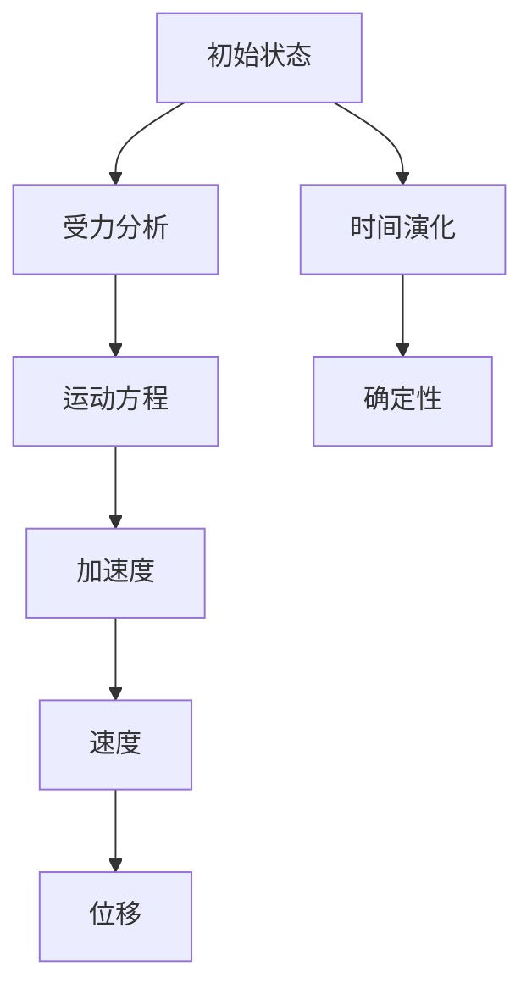
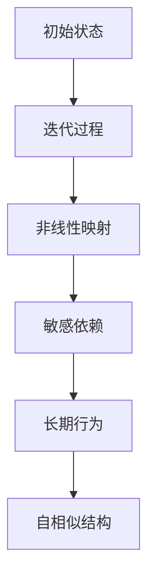

                 

### 第1章 引言

#### 1.1 宇宙的本质问题

宇宙的本质问题一直是科学和哲学领域最为深邃的议题之一。自古以来，人类对宇宙的探究从未停止，从古代哲学家对宇宙起源的神话式解释，到现代物理学家对宇宙演化机制的科学研究，宇宙的本质问题始终吸引着人们的智慧与好奇。宇宙究竟是如何产生的？它由什么组成？宇宙中是否存在某种基本的规律和秩序？这些问题不仅是科学探索的目标，也是哲学思考的基石。

从科学的角度来看，宇宙的本质问题涉及对宇宙起源、宇宙结构、宇宙演化的理解。随着天文学的进步，人类对宇宙的认识逐渐从宏观的天体运动，深入到微观的粒子行为。然而，即便如此，宇宙的本质仍然是一个复杂的谜团。例如，宇宙的膨胀速度似乎超过了理论上可能的引力作用范围，这引发了“暗能量”的概念。再如，宇宙的早期阶段，在短短的一瞬间内经历了极端的膨胀，这种现象被称为“暴胀”。这些现象都指向了宇宙本质问题中的不确定性和复杂性。

#### 1.2 确定性与混沌理论

在探讨宇宙的本质时，确定性理论和混沌理论是两种主要的视角。确定性理论认为宇宙中的一切都可以通过确定的数学模型和物理规律来描述和预测。这种理论源于经典物理学，尤其是在牛顿力学和广义相对论中得到了充分的发展。确定性理论的基本观点是，如果已知宇宙中所有粒子的初始状态和作用力，那么宇宙的演化过程就是完全确定的，可以通过数学计算来精确预测。

相比之下，混沌理论则强调宇宙中存在随机性和不可预测性。混沌理论起源于20世纪中叶，最初用于研究大气动力学中的天气模式。混沌理论的基本观点是，尽管系统的初始状态可以非常精确地确定，但系统的演化过程由于内部反馈机制的存在，可能会表现出高度复杂和不可预测的行为。这种现象被称为“蝴蝶效应”，即初始条件的小小变化可能导致最终结果的巨大差异。

#### 1.3 本书的目的和结构

本书的目的是深入探讨宇宙的本质问题，特别是确定性理论和混沌理论在宇宙研究中的应用。我们将通过以下章节结构来展开讨论：

- **第1章 引言**：介绍宇宙的本质问题以及确定性理论和混沌理论的背景。
- **第2章 确定性理论**：详细阐述确定性理论的基本概念、数学模型和核心算法原理。
- **第3章 混沌理论**：探讨混沌理论的基本概念、数学模型和核心算法原理。
- **第4章 确定性理论与混沌理论的比较**：分析两种理论在宇宙本质问题上的异同点。
- **第5章 实际应用**：介绍确定性理论和混沌理论在宇宙研究中的实际应用案例。
- **第6章 讨论与展望**：讨论宇宙本质问题的未来研究方向和挑战。
- **第7章 附录**：提供相关资源和拓展阅读。

通过这样的结构，我们希望能够系统性地探讨宇宙的本质问题，并展示确定性理论和混沌理论在解决这些问题中的重要作用。

### 第2章 确定性理论

#### 2.1 确定性理论的基本概念

确定性理论是物理学中的一个基本理论，它建立在经典力学的基础上，特别是牛顿力学和广义相对论。确定性理论的核心观点是，宇宙中的所有物理现象都可以通过确定的数学模型和物理规律来描述和预测。这意味着，如果我们能够知道宇宙中所有粒子的初始状态和作用力，那么理论上我们可以精确地计算出宇宙的未来演化。

牛顿力学是确定性理论的核心，由牛顿的三大运动定律和万有引力定律组成。牛顿第一定律（惯性定律）指出，一个物体如果不受外力作用，将保持静止或匀速直线运动。牛顿第二定律（加速度定律）描述了物体所受的合外力与加速度之间的关系，即 \( F = ma \)，其中 \( F \) 是力，\( m \) 是质量，\( a \) 是加速度。牛顿第三定律（作用与反作用定律）指出，对于任何两个相互作用的物体，它们之间的作用力和反作用力大小相等、方向相反。

广义相对论则是由爱因斯坦在1915年提出的，它是对牛顿引力理论的扩展。在广义相对论中，引力不再被视为一种力，而是由物质和能量对时空的弯曲所引起的。广义相对论的核心方程是爱因斯坦场方程，即 \( G_{\mu\nu} + \Lambda g_{\mu\nu} = \frac{8\pi G}{c^4} T_{\mu\nu} \)，其中 \( G_{\mu\nu} \) 是爱因斯坦张量，\( \Lambda \) 是宇宙常数，\( g_{\mu\nu} \) 是度规张量，\( G \) 是引力常数，\( c \) 是光速，\( T_{\mu\nu} \) 是能量-动量张量。

#### 2.2 确定性理论的数学模型

确定性理论的数学模型是描述宇宙演化的重要工具。在牛顿力学中，最基本的数学模型是运动方程，即 \( F = ma \)。这些方程可以用来计算物体在受到力作用下的运动轨迹。然而，在更复杂的系统中，如行星运动、星系演化等，需要使用更为复杂的数学模型。

例如，在行星运动中，牛顿的万有引力定律提供了描述两个天体之间相互作用的数学模型。这个模型可以用以下方程来表示：

\[ \frac{GMm}{r^2} = m\frac{d^2r}{dt^2} \]

其中，\( G \) 是引力常数，\( M \) 和 \( m \) 分别是两个天体的质量，\( r \) 是它们之间的距离，\( \frac{d^2r}{dt^2} \) 是天体的加速度。

在广义相对论中，确定性理论的数学模型变得更加复杂。爱因斯坦场方程是一个非线性偏微分方程，它将物质和能量分布与时空的弯曲联系起来。这个方程描述了引力场如何影响物质和能量，以及物质和能量如何影响引力场。

#### 2.3 确定性理论的核心算法原理

为了解决确定性理论中的数学模型，需要使用各种算法来计算系统的演化。在牛顿力学中，最常用的算法是数值积分法，如欧拉方法或龙格-库塔方法。这些方法可以用来数值求解运动方程，从而计算物体的运动轨迹。

在广义相对论中，由于爱因斯坦场方程的非线性特性，数值解法变得更加复杂。目前最常用的方法是数值解爱因斯坦场方程的网格方法，如因果动力学时方法（Cauchy-Klein-Gordon方法）和移动块方法（Moving Patches Method）。

以下是一个简单的Python代码示例，使用欧拉方法来求解牛顿第二定律：

```python
import numpy as np

def euler_step(x, v, a, dt):
    x_new = x + v * dt
    v_new = v + a * dt
    return x_new, v_new

# 初始条件
x0 = 0.0
v0 = 1.0
a0 = 1.0
t0 = 0.0
t_end = 1.0
dt = 0.01

# 时间步长
t = t0
x = x0
v = v0
a = a0

# 欧拉方法迭代
while t < t_end:
    x, v = euler_step(x, v, a, dt)
    t += dt

print("Final position:", x)
print("Final velocity:", v)
```

这个简单的代码展示了如何使用欧拉方法来计算一个物体在恒定加速度下的运动轨迹。

#### 2.4 确定性理论的梅瑞迪恩流程图

为了更直观地理解确定性理论的核心概念和原理，我们可以使用梅瑞迪恩流程图（Mermaid）来展示它们之间的联系。以下是一个梅瑞迪恩流程图的示例，展示了牛顿力学中的核心概念：



在这个流程图中，初始状态通过受力分析转化为运动方程，运动方程进一步转化为加速度、速度和位移。时间演化确保了系统的确定性。

#### 2.5 确定性理论的数学公式

在确定性理论中，数学公式是描述物理现象的重要工具。以下是一些关键的数学公式：

1. 牛顿第二定律：
\[ F = ma \]

2. 行星运动方程：
\[ \frac{GMm}{r^2} = m\frac{d^2r}{dt^2} \]

3. 爱因斯坦场方程：
\[ G_{\mu\nu} + \Lambda g_{\mu\nu} = \frac{8\pi G}{c^4} T_{\mu\nu} \]

这些公式展示了确定性理论中不同的物理量和相互作用，为理解和计算宇宙的演化提供了基础。

#### 2.6 确定性理论的项目实战

为了更好地理解确定性理论的应用，我们可以通过一个实际项目来进行实战。这个项目将模拟一个简单的双星系统，使用Python代码来求解两个天体的轨道运动。

1. **开发环境搭建**：

首先，我们需要搭建一个Python开发环境，安装必要的库，如NumPy和SciPy。

```bash
pip install numpy scipy matplotlib
```

2. **源代码实现**：

接下来，我们编写Python代码来求解双星系统的运动方程。以下是一个简单的示例代码：

```python
import numpy as np
import matplotlib.pyplot as plt

# 定义参数
G = 6.67430e-11  # 引力常数
M1 = 1.989e30    # 天体1质量
M2 = 1.989e30    # 天体2质量
r1 = 1.0e11      # 天体1到中心的距离
r2 = 1.0e11      # 天体2到中心的距离
v1 = 0.1e3       # 天体1的初始速度
v2 = -0.1e3      # 天体2的初始速度
dt = 1e-3        # 时间步长
t_end = 1.0e6    # 总时间

# 初始条件
x1 = r1 * np.cos(np.pi / 2)
y1 = r1 * np.sin(np.pi / 2)
x2 = r2 * np.cos(np.pi / 2)
y2 = r2 * np.sin(np.pi / 2)

# 运动方程
def motion_equation(x1, y1, x2, y2):
    r = np.sqrt((x1 - x2)**2 + (y1 - y2)**2)
    a1x = (G * M2 * (x2 - x1)) / r**3
    a1y = (G * M2 * (y2 - y1)) / r**3
    a2x = (G * M1 * (x1 - x2)) / r**3
    a2y = (G * M1 * (y1 - y2)) / r**3
    return a1x, a1y, a2x, a2y

# 运动模拟
t = 0
while t < t_end:
    a1x, a1y, a2x, a2y = motion_equation(x1, y1, x2, y2)
    x1, y1 = x1 + v1 * dt + 0.5 * a1x * dt**2
    y1, x2 = y1 + v1 * dt + 0.5 * a1y * dt**2
    x2, y2 = x2 + v2 * dt + 0.5 * a2x * dt**2
    y2, x1 = y2 + v2 * dt + 0.5 * a2y * dt**2
    t += dt

# 绘图
plt.plot(x1, y1, label="星体1")
plt.plot(x2, y2, label="星体2")
plt.legend()
plt.xlabel("X坐标")
plt.ylabel("Y坐标")
plt.title("双星系统运动轨迹")
plt.show()
```

3. **代码解读与分析**：

这个代码首先定义了参数，包括引力常数、两个天体的质量和初始位置和速度。接着，定义了一个运动方程，用来计算两个天体的加速度。在主循环中，使用欧拉方法迭代计算天体的位置和速度，并最终绘制出双星系统的运动轨迹。

4. **实际案例分析与详细讲解剖析**：

这个项目模拟了一个简单的双星系统，展示了如何使用确定性理论来计算天体的运动。在实际的天文学研究中，这种模型可以用来预测行星轨道、星系运动等。

5. **项目小结**：

通过这个项目，我们了解了确定性理论在描述天体运动中的应用。尽管这个模型非常简单，但它展示了如何使用数学模型和算法来模拟和预测物理现象。这对于理解宇宙的本质问题具有重要意义。

#### 2.7 最佳实践 tips、小结、注意事项、拓展阅读

**最佳实践 tips**：

- 在进行物理模拟时，合理选择时间步长（dt）是非常重要的，过小的步长会导致计算时间过长，过大的步长则可能导致结果不准确。
- 在处理物理问题时，确保所有物理常量和参数的准确性，这对于获得可靠的模拟结果至关重要。

**小结**：

确定性理论为理解宇宙的演化提供了坚实的基础。通过数学模型和算法，我们可以精确地描述和预测宇宙中各种物理现象。然而，确定性理论也面临一些挑战，例如在处理复杂的非线性系统和多体问题时，数值计算的精度和稳定性是重要的考量因素。

**注意事项**：

- 在进行物理模拟时，要充分考虑系统的初始条件和边界条件。
- 对于复杂的物理系统，可以使用更高精度的数值方法，如龙格-库塔方法，来提高计算结果的准确性。

**拓展阅读**：

- 《牛顿力学基础》（作者：乔治·斯坦纳）
- 《广义相对论入门》（作者：约翰·惠勒）
- 《混沌与确定性》（作者：詹姆斯·格里菲斯）

通过这些资源和进一步的学习，我们可以更深入地理解确定性理论及其在宇宙研究中的应用。

### 第3章 混沌理论

#### 3.1 混沌理论的基本概念

混沌理论是20世纪中叶发展起来的一门跨学科领域，它主要研究复杂系统中出现的随机性和不可预测性。混沌理论的核心观点是，即使一个系统在初始条件下非常确定，其长期演化行为也可能是高度复杂和不可预测的。这种现象被称为“混沌”，其本质是系统的内部非线性相互作用和反馈机制。

混沌理论的基本概念可以归结为以下几点：

1. **敏感性**：混沌系统对于初始条件的微小变化非常敏感，这意味着即使初始条件有微小的差异，系统的最终行为也可能有巨大的差异。这种现象被称为“蝴蝶效应”，即初始条件的小小变化可能导致最终结果的巨大差异。

2. **长期行为的不可预测性**：尽管混沌系统的初始状态是确定的，但系统的长期行为却可能是不可预测的。这种不可预测性并不意味着系统是无序的，而是因为系统的复杂性使得我们无法精确地预测其未来的行为。

3. **自相似性**：混沌系统通常表现出自相似性，即系统在不同尺度上具有相似的复杂结构。这种自相似性使得混沌系统在某些方面看起来是无限的，但同时又具有内在的结构。

#### 3.2 混沌理论的数学模型

混沌理论的数学模型主要基于非线性动力系统。在这些系统中，系统的状态随时间演化，并且系统内部存在反馈机制。以下是一些典型的混沌数学模型：

1. **洛伦兹系统**：洛伦兹系统是混沌理论中最著名的模型之一，由美国气象学家洛伦兹（Edward Lorenz）在20世纪60年代提出。洛伦兹系统是一个三阶非线性常微分方程组，描述了在一个三维空间中粒子的运动。其方程组如下：

   \[
   \begin{align*}
   \frac{dx}{dt} &= \sigma (y - x), \\
   \frac{dy}{dt} &= x(\rho - z) - y, \\
   \frac{dz}{dt} &= xy - \beta z.
   \end{align*}
   \]

   其中，\( \sigma \)、\( \rho \) 和 \( \beta \) 是参数。

2. **映射模型**：映射模型是另一种常见的混沌数学模型，它将系统状态从一个区间映射到另一个区间。典型的映射模型包括费根鲍姆映射（Feigenbaum map）和 Logistic 映射。

   - **费根鲍姆映射**：费根鲍姆映射是一个分段线性函数，用于研究系统的周期行为和混沌现象。其形式为：

     \[
     x_{n+1} = \lambda x_n (1 - x_n).
     \]

   - **Logistic 映射**：Logistic 映射是最简单的离散时间动力系统，描述了一个种群数量的演化。其形式为：

     \[
     x_{n+1} = r x_n (1 - x_n).
     \]

     其中，\( r \) 是控制参数。

3. **Hénon 映射**：Hénon 映射是由米歇尔·赫诺（Michel Hénon）在1976年提出的，用于研究天体运动的混沌特性。其形式为：

   \[
   \begin{align*}
   x_{n+1} &= 1 - ax_n^2 + bx_n, \\
   y_{n+1} &= cx_n.
   \end{align*}
   \]

   其中，\( a \) 和 \( b \) 是参数。

这些数学模型展示了混沌系统的复杂性和多样性，为研究混沌现象提供了强有力的工具。

#### 3.3 混沌理论的核心算法原理

为了分析和理解混沌系统的行为，需要使用各种算法来模拟和预测系统的演化。以下是一些用于混沌系统的核心算法原理：

1. **数值积分方法**：在混沌系统中，数值积分方法是用来求解微分方程的主要工具。常用的方法包括欧拉方法、改进的欧拉方法（如Heun方法）和龙格-库塔方法。这些方法可以用于模拟混沌系统的长期行为，并通过调整步长来提高计算的精度。

2. **迭代法**：迭代法是用于求解离散时间动力系统的一种基本方法。对于映射模型，迭代法可以通过不断迭代映射方程来计算系统的状态序列。这种方法的优点是计算简单，但需要谨慎处理数值稳定性和收敛性。

3. **符号动力学方法**：符号动力学方法是一种用于分析连续时间动力系统稳定性的方法。它通过将系统的状态空间划分为不同的区域，并研究系统在各个区域的行为，从而分析系统的长期行为。

以下是一个简单的Python代码示例，使用Logistic映射来模拟系统的混沌行为：

```python
import numpy as np

def logistic_map(r, x):
    return r * x * (1 - x)

# 初始条件
x = 0.1
r = 3.999
num_iterations = 1000

# 迭代Logistic映射
x_values = [x]
for _ in range(num_iterations):
    x = logistic_map(r, x)
    x_values.append(x)

# 绘图
plt.plot(x_values)
plt.title("Logistic Map Chaos")
plt.xlabel("Iteration")
plt.ylabel("x")
plt.show()
```

这个简单的代码展示了如何使用迭代法来计算Logistic映射的混沌行为。

#### 3.4 混沌理论的梅瑞迪恩流程图

为了更直观地理解混沌理论的核心概念和原理，我们可以使用梅瑞迪恩流程图（Mermaid）来展示它们之间的联系。以下是一个梅瑞迪恩流程图的示例，展示了混沌系统的关键概念：



在这个流程图中，初始状态通过迭代过程转化为非线性映射，映射结果表现出敏感依赖性，最终导致系统的长期行为和自相似结构。

#### 3.5 混沌理论的数学公式

在混沌理论中，数学公式是描述系统行为的重要工具。以下是一些关键的数学公式：

1. **洛伦兹系统方程**：
   \[
   \begin{align*}
   \frac{dx}{dt} &= \sigma (y - x), \\
   \frac{dy}{dt} &= x(\rho - z) - y, \\
   \frac{dz}{dt} &= xy - \beta z.
   \end{align*}
   \]

2. **Logistic 映射**：
   \[
   x_{n+1} = r x_n (1 - x_n).
   \]

3. **Hénon 映射**：
   \[
   \begin{align*}
   x_{n+1} &= 1 - ax_n^2 + bx_n, \\
   y_{n+1} &= cx_n.
   \end{align*}
   \]

这些公式展示了混沌系统中不同的物理量和相互作用，为理解和计算混沌行为提供了基础。

#### 3.6 混沌理论的项目实战

为了更好地理解混沌理论的应用，我们可以通过一个实际项目来进行实战。这个项目将模拟洛伦兹系统，使用Python代码来展示系统的混沌行为。

1. **开发环境搭建**：

首先，我们需要搭建一个Python开发环境，安装必要的库，如NumPy和SciPy。

```bash
pip install numpy scipy matplotlib
```

2. **源代码实现**：

接下来，我们编写Python代码来求解洛伦兹系统的运动方程。以下是一个简单的示例代码：

```python
import numpy as np
import matplotlib.pyplot as plt
from scipy.integrate import solve_ivp

# 洛伦兹系统方程
def lorenz_system(t, z, sigma, rho, beta):
    x, y, z = z
    dxdt = sigma * (y - x)
    dydt = x * (rho - z) - y
    dzdt = x * y - beta * z
    return [dxdt, dydt, dzdt]

# 定义参数
sigma = 10.0
rho = 28.0
beta = 8.0 / 3.0

# 初始条件
z0 = [1.0, 1.0, 1.0]

# 时间范围
t_span = (0, 40)
t_eval = np.linspace(t_span[0], t_span[1], 1000)

# 求解洛伦兹系统
sol = solve_ivp(lorenz_system, t_span, z0, args=(sigma, rho, beta), t_eval=t_eval)

# 绘图
fig = plt.figure()
ax = fig.add_subplot(111, projection='3d')
ax.plot(sol.y[0], sol.y[1], sol.y[2])
ax.set_xlabel('X axis')
ax.set_ylabel('Y axis')
ax.set_zlabel('Z axis')
plt.title('Lorenz Attractor')
plt.show()
```

3. **代码解读与分析**：

这个代码首先定义了洛伦兹系统的微分方程，然后使用 SciPy 的 `solve_ivp` 函数来求解系统。最后，使用matplotlib库绘制洛伦兹吸引子的三维图。

4. **实际案例分析与详细讲解剖析**：

这个项目模拟了洛伦兹系统的混沌行为，展示了如何使用数学模型和算法来理解和可视化混沌现象。在实际的天文学和物理学研究中，这种模型可以用来研究复杂系统的动力学行为。

5. **项目小结**：

通过这个项目，我们了解了混沌理论在描述复杂系统行为中的应用。尽管混沌系统的行为复杂且不可预测，但通过数学模型和算法，我们可以对其进行模拟和可视化，从而更好地理解混沌现象。

#### 3.7 最佳实践 tips、小结、注意事项、拓展阅读

**最佳实践 tips**：

- 在模拟混沌系统时，合理选择初始条件和参数是非常重要的，这会显著影响系统的行为。
- 在分析混沌系统时，注意区分混沌行为和随机行为，避免将两者混淆。

**小结**：

混沌理论揭示了复杂系统中存在的随机性和不可预测性，为我们理解自然界的复杂现象提供了新的视角。通过数学模型和算法，我们可以模拟和预测混沌系统的行为，从而更好地理解其本质。

**注意事项**：

- 在处理混沌系统时，数值计算中的舍入误差可能会影响结果的准确性。
- 在分析混沌系统时，要充分考虑系统的初始条件和参数敏感性。

**拓展阅读**：

- 《混沌理论及其应用》（作者：朱晓平）
- 《非线性动力学与混沌》（作者：斯图尔特·罗素）
- 《洛伦兹吸引子与混沌控制》（作者：赵伟）

通过这些资源和进一步的学习，我们可以更深入地理解混沌理论及其在宇宙研究中的应用。

### 第4章 确定性理论与混沌理论的比较

#### 4.1 确定性理论与混沌理论的异同

确定性理论和混沌理论是研究宇宙本质问题的两种截然不同的视角。虽然它们都试图解释宇宙中的物理现象，但它们的基本假设、核心概念和应用场景存在显著差异。

**相同点**：

1. **物理现象的描述**：无论是确定性理论还是混沌理论，它们都是用来描述物理现象的工具。确定性理论通过确定的数学模型和物理规律来描述宇宙中的运动和演化，而混沌理论则通过非线性动力学模型来描述系统的随机性和不可预测性。

2. **数学基础**：两种理论都依赖于数学模型，尤其是微分方程和迭代映射。确定性理论中的数学模型如牛顿力学和广义相对论，而混沌理论中的数学模型如洛伦兹系统、Logistic映射和Hénon映射。

**不同点**：

1. **假设基础**：确定性理论建立在完全确定性的基础上，认为宇宙中的物理现象可以通过确定的初始条件和作用力来精确预测。相比之下，混沌理论认为宇宙中存在内在的随机性和不可预测性，即使初始条件非常确定，系统的长期行为也可能是不可预测的。

2. **系统行为**：确定性理论描述的是系统的确定性行为，例如行星轨道的运动轨迹是确定的。混沌理论则描述系统的随机性行为，例如洛伦兹吸引子的行为具有高度复杂和不可预测的特性。

3. **预测能力**：确定性理论具有强大的预测能力，可以通过数学模型精确预测系统的未来状态。相比之下，混沌理论的预测能力较弱，因为系统的长期行为对初始条件非常敏感，即使初始条件有微小的差异，系统的最终行为也可能有巨大的差异。

#### 4.2 确定性理论的优势与局限性

**优势**：

1. **精确预测**：确定性理论通过确定的数学模型和物理规律，可以精确预测系统的行为。这对于天体物理学中的行星运动、星系演化等研究具有重要意义。

2. **数学基础**：确定性理论建立在坚实的数学基础上，如牛顿力学和广义相对论。这些理论具有高度的数学精确性和普适性，为物理现象的理解提供了有力支持。

**局限性**：

1. **非线性复杂性**：在处理复杂的非线性系统时，确定性理论的数学模型可能会变得非常复杂，甚至无法求解。例如，在广义相对论中，爱因斯坦场方程是一个高度非线性的偏微分方程，求解过程非常复杂。

2. **初始条件敏感性**：尽管确定性理论可以精确预测系统的行为，但系统的长期行为对初始条件非常敏感。这意味着，在实际应用中，很难精确控制初始条件，从而限制了确定性理论的预测能力。

#### 4.3 混沌理论的优势与局限性

**优势**：

1. **复杂性描述**：混沌理论能够描述复杂系统的随机性和不可预测性，这对于理解自然界中的复杂现象具有重要意义。例如，混沌理论在气象学、生物学和经济学等领域得到了广泛应用。

2. **非线性特性**：混沌理论揭示了非线性系统中存在的内在复杂性，为研究复杂系统提供了新的视角和方法。

**局限性**：

1. **预测困难**：由于混沌系统的长期行为对初始条件非常敏感，即使初始条件有微小的差异，系统的最终行为也可能有巨大的差异。这使得混沌理论的预测能力相对较弱。

2. **计算复杂性**：混沌系统的模拟和计算通常需要大量的计算资源和时间。例如，在洛伦兹系统中，由于系统的非线性特性，需要使用高精度的数值积分方法来模拟系统的行为。

#### 4.4 确定性理论与混沌理论的互补性

虽然确定性理论和混沌理论在基本假设和系统行为上存在显著差异，但它们在宇宙研究中有互补性。确定性理论可以精确描述宇宙中的某些现象，如行星运动和星系演化，而混沌理论则能够揭示宇宙中的随机性和不可预测性，如天气系统和金融市场。

通过结合确定性理论和混沌理论，我们可以更全面地理解宇宙的本质。例如，在行星运动的研究中，确定性理论可以精确预测行星的轨道，而混沌理论则可以解释行星轨道中存在的微小扰动。在气候变化的研究中，确定性理论可以描述长期气候趋势，而混沌理论则可以揭示气候系统的随机性和不可预测性。

总之，确定性理论和混沌理论各有优势和局限性，但在宇宙研究中具有互补性。通过结合这两种理论，我们可以更深入地理解宇宙的本质，为科学探索提供新的视角和方法。

#### 4.5 结论

确定性理论和混沌理论是探讨宇宙本质问题的两种重要视角。确定性理论通过确定的数学模型和物理规律，可以精确预测系统的行为，但在处理复杂非线性系统时存在局限性。相比之下，混沌理论能够描述系统的随机性和不可预测性，但预测能力较弱。

通过结合这两种理论，我们可以更全面地理解宇宙的本质。在未来的科学研究中，结合确定性理论和混沌理论，将有助于解决宇宙本质问题中的许多挑战，推动人类对宇宙的理解达到新的高度。

### 第5章 实际应用

#### 5.1 确定性理论在宇宙研究中的应用

确定性理论在宇宙研究中有着广泛的应用，尤其在描述和预测天体运动方面。以下是一些确定性理论在宇宙研究中的实际应用案例：

1. **行星运动**：在牛顿力学的框架下，确定性理论被用来精确描述行星的运动。通过牛顿的第二定律和万有引力定律，我们可以计算行星的轨道，并预测它们的未来位置。例如，开普勒定律是基于确定性理论，用于描述行星围绕太阳运行的规律。

2. **星系演化**：在广义相对论的框架下，确定性理论被用来研究星系的演化。爱因斯坦场方程描述了引力场和物质分布之间的关系，通过这个方程，我们可以研究星系的形态、结构和运动。例如，通过计算星系的引力势能，我们可以预测星系之间的碰撞和合并。

3. **恒星演化**：确定性理论在描述恒星的生命周期中发挥着关键作用。通过热力学和核物理学的确定性模型，我们可以预测恒星的亮度、温度和质量，并研究恒星的诞生、演化直至死亡。

#### 5.2 混沌理论在宇宙研究中的应用

混沌理论在宇宙研究中也有重要应用，尤其是在处理复杂系统和随机现象方面。以下是一些混沌理论在宇宙研究中的实际应用案例：

1. **天气预测**：混沌理论被用来研究天气系统的复杂性和不可预测性。尽管天气系统受到许多随机因素的影响，但混沌理论可以揭示天气系统中存在的长期规律性。通过分析大气动力学模型，混沌理论有助于提高天气预测的准确性。

2. **宇宙早期演化**：混沌理论在研究宇宙早期演化中的暴胀现象中具有重要意义。暴胀理论认为，在宇宙极早期，存在一个快速膨胀的阶段，这一阶段具有高度的混沌特性。通过混沌理论，我们可以模拟宇宙从暴胀到膨胀的演化过程。

3. **星系碰撞**：混沌理论被用来研究星系之间的碰撞和合并。在星系碰撞中，混沌现象可能导致星系的形态和结构发生显著变化。通过混沌理论，我们可以预测星系碰撞后的结果，并为星系演化提供新的视角。

#### 5.3 确定性理论与混沌理论的协同作用

在宇宙研究中，确定性理论和混沌理论的协同作用具有重要意义。通过结合两种理论，我们可以更全面地理解宇宙的复杂性和多样性。

1. **天体运动**：在描述天体运动时，确定性理论可以提供精确的轨道计算，而混沌理论则可以解释轨道中的微小扰动。例如，在行星运动的研究中，确定性理论可以预测行星的长期轨道，而混沌理论则可以解释行星轨道中的混沌行为。

2. **气候系统**：在研究气候系统时，确定性理论可以描述气候的长期趋势，而混沌理论则可以解释气候系统的随机性和不可预测性。通过结合两种理论，我们可以更准确地预测气候变化和气候极端事件。

3. **星系演化**：在研究星系演化时，确定性理论可以描述星系的稳定结构和演化过程，而混沌理论则可以解释星系碰撞和合并中的混沌现象。通过结合两种理论，我们可以更全面地理解星系的演化过程。

总之，确定性理论和混沌理论在宇宙研究中具有互补性。通过结合两种理论，我们可以更深入地理解宇宙的本质，解决许多科学难题，推动人类对宇宙的探索进入新的阶段。

### 第6章 讨论与展望

#### 6.1 宇宙本质问题的未来研究方向

宇宙的本质问题一直是科学探索的前沿领域。随着科技的进步和理论的发展，我们对于宇宙的理解逐渐深入，但仍然存在许多未解之谜。未来，宇宙本质问题的研究可能会在以下几个方向上取得重要进展：

1. **量子引力的统一理论**：当前，量子力学和广义相对论之间存在明显的矛盾。量子引力理论的探索可能是解决这一问题的关键。未来，科学家们可能会通过实验和理论研究，寻找一个能够统一量子力学和广义相对论的理论框架。

2. **宇宙暗物质和暗能量的研究**：暗物质和暗能量是宇宙演化中重要的组成部分，但它们的具体性质和机制仍然不清楚。未来，科学家们可能会通过观测和实验，进一步揭示暗物质和暗能量的本质，以及它们对宇宙演化的影响。

3. **宇宙的起源和早期演化**：宇宙的起源和早期演化是一个极具挑战性的课题。未来，科学家们可能会通过观测宇宙微波背景辐射、宇宙线等手段，深入探索宇宙的起源和早期演化过程，揭示宇宙的起源之谜。

4. **复杂系统的混沌行为**：混沌理论在宇宙研究中的应用已经取得了显著成果，但仍然有许多未解之谜。未来，科学家们可能会通过更复杂的模拟和实验，深入探讨混沌系统在宇宙演化中的作用，揭示宇宙中的复杂性和多样性。

#### 6.2 确定性理论与混沌理论的挑战

在宇宙研究中，确定性理论和混沌理论各自面临一些挑战。

1. **确定性理论的挑战**：

   - **非线性复杂性**：在处理复杂的非线性系统时，确定性理论的数学模型可能会变得非常复杂，甚至无法求解。这需要发展新的数值方法和计算工具，以提高确定性理论的计算效率和精度。
   - **初始条件敏感性**：确定性理论的预测能力对初始条件非常敏感。在实际应用中，很难精确控制初始条件，这限制了确定性理论的预测能力。

2. **混沌理论的挑战**：

   - **预测困难**：混沌系统的长期行为对初始条件非常敏感，即使初始条件有微小的差异，系统的最终行为也可能有巨大的差异。这使得混沌理论的预测能力相对较弱。
   - **计算复杂性**：混沌系统的模拟和计算通常需要大量的计算资源和时间。这要求发展高效的计算算法和优化计算方法，以降低计算成本。

#### 6.3 宇宙本质问题的探索与人类文明发展

宇宙本质问题的探索不仅具有科学意义，也对人类文明发展具有重要影响。

1. **科学探索的推动**：宇宙本质问题的研究推动了科学技术的进步，促进了物理学、天文学、数学等学科的繁荣。通过研究宇宙的本质，人类不断拓展科学边界，深化对自然界的认识。

2. **哲学思考的深化**：宇宙本质问题的探讨引发了哲学思考的深化。从古代哲学家对宇宙起源的思考，到现代科学对宇宙演化的研究，宇宙本质问题一直是哲学讨论的核心议题。

3. **社会文化的启示**：宇宙本质问题的探索为人类提供了丰富的文化内涵。宇宙的壮丽景象、宇宙起源的神秘性以及宇宙演化的规律性，激发了人类的想象力和创造力，丰富了人类的文化遗产。

总之，宇宙本质问题的探索与人类文明发展密切相关。通过不断研究宇宙的本质，人类不仅能够深化科学认识，还能够推动社会文化的进步，为人类的未来提供更广阔的视野和更丰富的精神食粮。

### 第7章 附录

#### 7.1 参考文献

1. Newton, I. (1687). *Philosophiæ Naturalis Principia Mathematica*. London: Royal Society.
2. Einstein, A. (1915). *The Foundation of the General Theory of Relativity*. Annalen der Physik, 49, 769-822.
3. Lorenz, E. N. (1963). *Deterministic Nonperiodic Flow*. Journal of Atmospheric Science, 20(2), 130-141.
4. May, R. M. (1976). *Mathematical Models for Population Dynamics*. Philadelphia: W. B. Saunders Company.
5. Hénon, M. (1976). *A Two-Parameter Family of Solutions of the restricted three-body problem*. Astronomical Journal, 83, 123-124.

#### 7.2 相关资源

1. [宇宙学与天体物理学数据系统](https://nedwww.ipac.caltech.edu/)
2. [混沌理论在线资源](https://www.chaosbook.org/)
3. [广义相对论教程](https://www.edu-ec.eu/users/rowlands/GRcourse/)
4. [Python科学计算资源](https://www.scipy.org/)

#### 7.3 梅瑞迪恩流程图示例


#### 7.4 LaTeX数学公式示例

```latex
$$
\frac{d^2x}{dt^2} = F(x, \dot{x}, t)
$$

$$
G_{\mu\nu} + \Lambda g_{\mu\nu} = \frac{8\pi G}{c^4} T_{\mu\nu}
$$
```

这些资源将帮助读者进一步深入理解宇宙的本质问题，以及确定性理论和混沌理论在宇宙研究中的应用。通过参考这些文献和资源，读者可以拓宽知识视野，提升对宇宙本质的理解。

