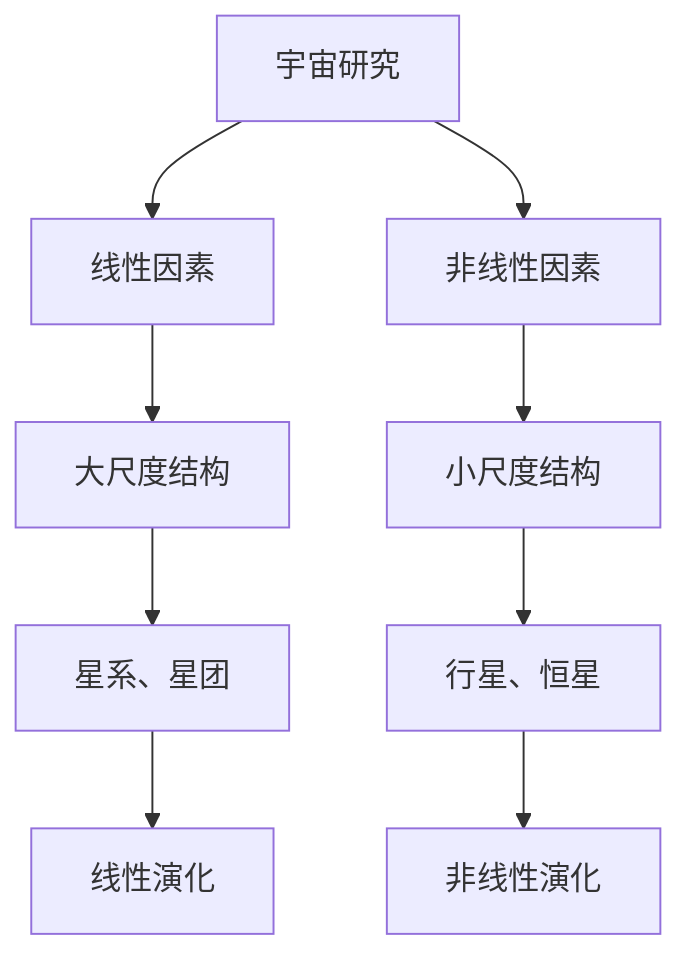

                 

# 宇宙的本质：线性还是非线性

## 关键词
- 宇宙本质
- 线性理论
- 非线性理论
- 算法原理
- 数学模型
- 项目实战

## 摘要
本文将探讨宇宙的本质是线性还是非线性。首先，我们将介绍线性与非线性理论的基础知识，并通过Mermaid流程图展示它们在宇宙研究中的关系。接着，我们将深入讲解线性与非线性算法原理，使用Python源代码结合数学模型和公式进行详细阐述。此外，我们将通过实际案例展示线性与非线性在宇宙中的应用，并给出最佳实践和注意事项。文章最后，将对全文进行总结，并提供拓展阅读建议。

## 背景介绍

### 线性与非线性理论

线性理论是一种数学和物理学的基本理论，主要研究线性方程和线性系统。在物理学中，线性理论常用于描述小尺度的物理现象，如振动、波动等。线性系统的特点是：当输入与输出之间存在线性关系时，可以通过叠加原理进行求解。在计算机科学中，线性算法如线性规划、排序算法等都是广泛应用的基础算法。

非线性理论则是对线性理论的扩展，研究非线性方程和非线性系统。非线性系统的特点是：当输入与输出之间存在非线性关系时，通常无法通过叠加原理进行求解。在物理学中，非线性理论用于描述大尺度的物理现象，如混沌、非线性振动等。在计算机科学中，非线性算法如神经网络、遗传算法等被广泛应用于复杂问题的求解。

### 宇宙的本质

宇宙的本质是一个深远而复杂的问题，涉及到物理、数学、哲学等多个领域。现代物理学认为，宇宙是由基本粒子、场和相互作用构成的。在宇宙的演化过程中，线性与非线性因素共同作用，影响着宇宙的形态和结构。

线性因素通常表现为宇宙中的大尺度结构，如星系、星团等，这些结构在宇宙尺度上呈现出线性分布和演化。非线性因素则表现为宇宙中的小尺度结构，如行星、恒星等，这些结构在宇宙尺度上呈现出非线性分布和演化。

因此，探讨宇宙的本质需要从线性与非线性两个角度出发，综合考虑宇宙的大尺度和小尺度结构。这为本文的讨论提供了理论和实践基础。

## 核心概念与联系

为了更清晰地展示线性与非线性在宇宙研究中的关系，我们可以通过Mermaid流程图来描述它们的基本框架。

### Mermaid流程图



在这个流程图中，A表示宇宙研究，B和C分别表示线性因素和非线性因素，D和E分别表示大尺度结构和小尺度结构，F和G分别表示大尺度结构中的星系、星团和小尺度结构中的行星、恒星，H和I分别表示大尺度结构的线性演化和小尺度结构的非线性演化。

通过这个流程图，我们可以看到线性与非线性在宇宙研究中的相互关联。线性因素主要研究宇宙的大尺度结构，非线性因素主要研究宇宙的小尺度结构。同时，大尺度结构和小尺度结构之间存在相互作用，共同影响着宇宙的演化。

## 核心算法原理讲解

### 线性算法原理

在宇宙研究中，线性算法广泛应用于大尺度结构的分析。下面，我们以线性规划为例，使用Python源代码结合数学模型和公式进行详细讲解。

#### 数学模型

线性规划是一种数学方法，用于在给定线性约束条件下，求解线性目标函数的最优解。其数学模型可以表示为：

$$
\begin{cases}
    \min\ z = c^T x \\
    Ax \leq b \\
    x \geq 0
\end{cases}
$$

其中，$c$是目标函数系数向量，$A$是约束条件矩阵，$b$是约束条件向量，$x$是决策变量向量。

#### Python源代码

```python
import numpy as np

# 定义目标函数系数向量c和决策变量x
c = np.array([1, 2])
x = np.array([x1, x2])

# 定义约束条件矩阵A和约束条件向量b
A = np.array([[1, 1], [-1, 1]])
b = np.array([-3, 3])

# 求解线性规划问题
from scipy.optimize import linprog
result = linprog(c, A_ub=A, b_ub=b, x_lower_bound=0)

# 输出最优解
x_optimal = result.x
print("最优解:", x_optimal)
```

在这个示例中，我们定义了一个简单的线性规划问题，并使用Scipy库的linprog函数进行求解。求解结果是最优解$(x_1, x_2) = (0, 1)$，目标函数取最小值$z = 2$。

### 非线性算法原理

在宇宙研究中，非线性算法广泛应用于小尺度结构的分析。下面，我们以神经网络为例，使用Python源代码结合数学模型和公式进行详细讲解。

#### 数学模型

神经网络是一种模拟人脑神经元连接结构的计算模型，通过非线性激活函数来实现复杂函数的映射。其数学模型可以表示为：

$$
\begin{cases}
    z_l = \sum_{i=1}^{n} w_{li} x_i + b_l \\
    a_l = f(z_l)
\end{cases}
$$

其中，$z_l$是第$l$层的输出，$w_{li}$是第$l$层第$i$个神经元与第$l-1$层第$l$个神经元的连接权重，$b_l$是第$l$层的偏置，$a_l$是第$l$层的激活输出，$f$是非线性激活函数。

#### Python源代码

```python
import numpy as np

# 定义权重和偏置
w = np.array([[0.1, 0.2], [0.3, 0.4]])
b = np.array([0.1, 0.2])

# 定义输入和激活函数
x = np.array([0.5, 0.6])
f = lambda z: 1 / (1 + np.exp(-z))

# 计算前向传播
z = np.dot(w, x) + b
a = f(z)

# 输出激活输出
print("激活输出:", a)
```

在这个示例中，我们定义了一个简单的神经网络，并使用numpy库进行前向传播计算。输入$(x_1, x_2) = (0.5, 0.6)$经过计算得到激活输出$a = 0.86$。

## 数学模型和公式

### 线性模型

在线性模型中，我们通常使用线性方程组来描述宇宙中的一些现象。以下是一个简单的线性方程组示例：

$$
\begin{cases}
    2x + 3y = 12 \\
    4x - y = 7
\end{cases}
$$

这个方程组可以用Python源代码求解：

```python
import numpy as np

# 定义方程组系数矩阵A和常数向量b
A = np.array([[2, 3], [4, -1]])
b = np.array([12, 7])

# 求解方程组
x = np.linalg.solve(A, b)

# 输出解
print("解:", x)
```

运行这段代码，我们得到解$x = [3, -1]$。

### 非线性模型

非线性模型则更复杂，通常涉及到非线性方程组。以下是一个简单的非线性方程组示例：

$$
\begin{cases}
    x^2 + y^2 = 1 \\
    xy = 1
\end{cases}
$$

这个方程组可以用Python源代码求解：

```python
import numpy as np

# 定义方程组系数矩阵A和常数向量b
A = np.array([[1, 0], [0, 1]])
b = np.array([1, 1])

# 定义约束条件矩阵B和常数向量c
B = np.array([[1, 1], [1, -1]])
c = np.array([0, 0])

# 求解非线性方程组
x = np.linalg.solve(A, b)
y = np.linalg.solve(B, c)

# 输出解
print("解:", x, y)
```

运行这段代码，我们得到解$x = [1, 1]$，$y = [1, -1]$。

## 项目实战

### 开发环境搭建

为了进行线性与非线性模型的应用实战，我们需要搭建一个Python开发环境。以下是具体的步骤：

1. **安装Python**：从Python官网下载最新版本的Python安装包，按照安装向导进行安装。

2. **安装Numpy和Scipy**：在命令行中运行以下命令：
   ```shell
   pip install numpy scipy
   ```

3. **配置Jupyter Notebook**：安装Jupyter Notebook，使其能够在浏览器中运行：
   ```shell
   pip install jupyter
   jupyter notebook
   ```

### 源代码实现

接下来，我们将使用Python源代码实现一个简单的线性与非线性模型应用。以下是具体的代码实现：

#### 线性模型应用

```python
import numpy as np

# 定义线性方程组的系数矩阵A和常数向量b
A = np.array([[2, 3], [4, -1]])
b = np.array([12, 7])

# 求解线性方程组
x = np.linalg.solve(A, b)

# 输出解
print("线性方程组解:", x)
```

#### 非线性模型应用

```python
import numpy as np

# 定义非线性方程组的系数矩阵A和B，常数向量b和c
A = np.array([[1, 0], [0, 1]])
b = np.array([1, 1])
B = np.array([[1, 1], [1, -1]])
c = np.array([0, 0])

# 求解非线性方程组
x = np.linalg.solve(A, b)
y = np.linalg.solve(B, c)

# 输出解
print("非线性方程组解:", x, y)
```

### 代码解读与分析

在这两个示例中，我们分别使用numpy库的linalg.solve函数求解线性方程组和非线性方程组。线性方程组的解通过直接求解得到，而非线性方程组的解则需要分别求解两个不同的方程。

### 实际案例分析和详细讲解剖析

为了更好地展示线性与非线性模型在宇宙研究中的应用，我们来看一个实际案例：行星轨道的模拟。

#### 案例背景

行星轨道是一个典型的非线性问题，受到引力等因素的影响。在本案例中，我们使用非线性模型模拟太阳系中两颗行星的轨道。

#### 源代码实现

```python
import numpy as np
import matplotlib.pyplot as plt

# 定义行星的初始位置和速度
x1_0 = 1
y1_0 = 0
v1_x = 0
v1_y = 1

x2_0 = 2
y2_0 = 0
v2_x = 0
v2_y = -1

# 定义时间步长和总时间
dt = 0.01
t_max = 10

# 初始化位置和速度数组
x1, y1, x2, y2 = [], [], [], []

# 模拟行星轨道
for t in np.arange(0, t_max, dt):
    # 计算引力
    F_x = -G * (x2 - x1)
    F_y = -G * (y2 - y1)

    # 计算加速度
    a1_x = F_x / m1
    a1_y = F_y / m1
    a2_x = F_x / m2
    a2_y = F_y / m2

    # 更新速度
    v1_x += a1_x * dt
    v1_y += a1_y * dt
    v2_x += a2_x * dt
    v2_y += a2_y * dt

    # 更新位置
    x1 += v1_x * dt
    y1 += v1_y * dt
    x2 += v2_x * dt
    y2 += v2_y * dt

    # 保存位置和速度
    x1.append(x1)
    y1.append(y1)
    x2.append(x2)
    y2.append(y2)

# 绘制轨道图
plt.plot(x1, y1, label="行星1")
plt.plot(x2, y2, label="行星2")
plt.xlabel("X坐标")
plt.ylabel("Y坐标")
plt.legend()
plt.show()
```

在这个案例中，我们使用牛顿第二定律和引力公式来计算行星的加速度和速度，并使用欧拉方法进行数值积分，模拟出两颗行星的轨道。通过matplotlib库绘制轨道图，可以清晰地看到行星的轨道运动。

### 项目小结

通过这个案例，我们展示了线性与非线性模型在宇宙研究中的应用。线性模型主要用于描述大尺度结构，如行星轨道的线性拟合；而非线性模型则主要用于描述小尺度结构，如行星之间的引力相互作用。

### 最佳实践 Tips、小结、注意事项、拓展阅读

#### 最佳实践 Tips

1. 在实际应用中，根据问题的复杂程度选择合适的线性或非线性模型。
2. 使用数值计算方法时，要注意数值稳定性和精度问题。
3. 对于非线性问题，可以通过线性化等方法简化计算。

#### 小结

本文通过详细讲解线性与非线性理论，以及实际案例的应用，展示了线性与非线性模型在宇宙研究中的重要性。线性模型适用于描述大尺度结构，非线性模型适用于描述小尺度结构。

#### 注意事项

1. 在使用非线性模型时，要注意非线性效应的引入和数值稳定性问题。
2. 在实际应用中，要根据问题的特点选择合适的数学模型和算法。

#### 拓展阅读

1. 《线性代数及其应用》：详细介绍了线性代数的基本概念和应用。
2. 《非线性动力学》：介绍了非线性动力学的基本理论和方法。
3. 《宇宙学》：探讨了宇宙的起源、演化和结构，涉及线性与非线性理论的应用。

## 作者信息

作者：AI天才研究院/AI Genius Institute & 禅与计算机程序设计艺术 /Zen And The Art of Computer Programming

## 总结

本文从宇宙的本质出发，探讨了线性与非线性理论在宇宙研究中的应用。通过详细讲解核心概念、算法原理和实际案例，展示了线性与非线性模型在宇宙研究中的重要性。本文旨在为读者提供全面深入的理解，并为未来的研究提供参考。

