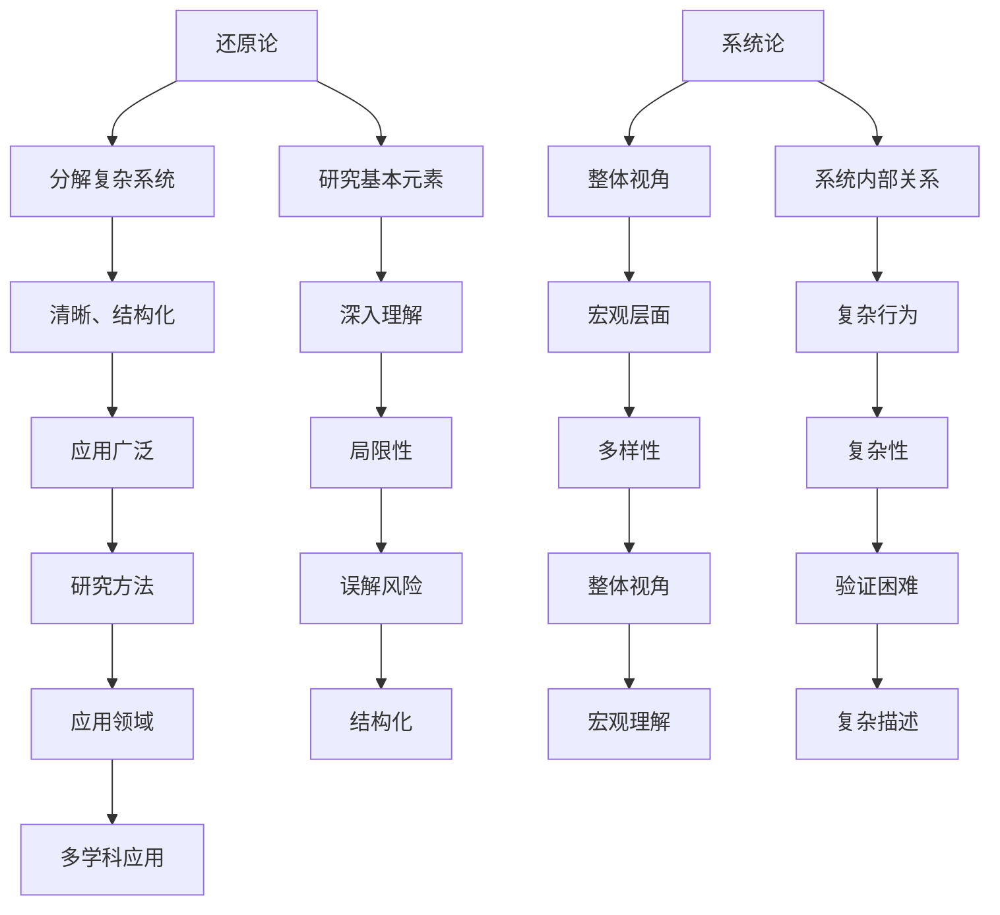

                 

### 引言

#### 宇宙的本质

宇宙，这个词源自古希腊语“ὄ κόσμος”（ó kosmos），意为“所有存在的东西”。从古至今，人类对宇宙的探索从未停止，宇宙的本质也一直是哲学、科学以及宗教探讨的核心问题。宇宙究竟是什么？它如何形成？它包含哪些内容？这些问题不仅激发了人类的想象力，也成为科学研究的重要目标。

在科学领域，宇宙的本质研究主要集中在物理学、天文学和哲学中。物理学试图通过数学模型来描述宇宙的基本规律，如万有引力定律和量子力学。天文学则通过观测宇宙中的各种现象，如星系、恒星和行星，来推测宇宙的起源和演化。哲学则通过逻辑推理和思辨来探讨宇宙的根本问题。

宇宙的本质问题之所以重要，是因为它关乎我们对世界的理解和认知。如果能够揭示宇宙的本质，我们不仅能够更好地理解自然界，还可以为技术发展提供新的方向和启示。

#### 还原论与系统论

在探讨宇宙的本质时，两种重要的哲学和方法论——还原论和系统论，为我们提供了不同的视角。还原论（Reductionism）和系统论（Systemism）是对立统一的，它们在解释宇宙的本质方面各有优势。

**还原论**强调将复杂系统分解为基本元素，通过研究这些基本元素来理解整个系统的性质。这种思维方式在物理学和化学中得到了广泛应用，例如，通过研究原子和分子的性质来理解物质的结构和性质。

**系统论**则强调系统作为一个整体的行为和结构，关注系统内部各部分之间的相互作用和关系。系统论认为，系统的性质不仅仅是其组成部分的简单叠加，而是由组成部分之间的复杂相互作用所决定的。

本文将探讨还原论和系统论这两种视角在宇宙本质研究中的应用，并通过具体的案例和数学模型来说明它们的优劣。

### 关键词

- 宇宙的本质
- 还原论
- 系统论
- 数学模型
- 物理规律
- 天文学观测

### 摘要

本文首先介绍了宇宙的本质及其研究的重要性，然后详细探讨了还原论和系统论这两种哲学和方法论的基本原理。接着，通过对比分析，我们揭示了这两种方法在解释宇宙本质方面的异同点。文章还运用了数学模型和具体实例，说明了还原论和系统论在宇宙现象分析中的应用。最后，文章总结了全文的内容，并对未来的研究方向进行了展望。

接下来，我们将逐一探讨还原论和系统论的基本原理、历史发展、应用领域以及它们在宇宙研究中的优缺点。

### 还原论

#### 基本原理

还原论（Reductionism）是一种哲学方法，它主张将复杂现象分解为更简单的元素，通过研究这些简单元素来理解复杂现象。在科学研究中，还原论常常表现为通过分解复杂系统来研究其基本组成部分，然后试图将这些组成部分的性质和规律组合起来，解释复杂系统的行为。

还原论的核心思想可以概括为：复杂系统可以通过对其组成部分的理解来解释。这一思想在物理学和化学中得到了广泛应用。例如，在物理学中，通过研究基本粒子（如电子、夸克等）的性质和行为，科学家们能够解释物质的基本结构。在化学中，通过研究分子和原子的反应机制，科学家们能够理解化学反应的本质。

#### 历史发展

还原论的历史可以追溯到古希腊时期，当时的哲学家们通过研究自然界的简单现象，试图理解宇宙的本质。然而，现代还原论的起源可以追溯到19世纪，当时科学革命带来了对自然现象的深入研究和分析。尤其是物理学的突破，如牛顿力学和量子力学的建立，使得科学家们能够通过分解复杂系统来研究基本规律。

在20世纪，还原论在生物学和心理学中得到了广泛应用。例如，生物学通过分子生物学和基因学的研究，揭示了生命现象的分子基础。心理学则通过神经科学的研究，试图理解人类行为和心理过程的神经基础。

#### 应用领域

还原论在多个科学领域都得到了广泛应用。在物理学中，通过对基本粒子的研究来解释物质的行为；在化学中，通过对分子和原子的研究来理解化学反应；在生物学中，通过对基因和蛋白质的研究来解释生命现象；在心理学中，通过对神经系统和大脑的研究来解释人类行为。

还原论不仅应用于自然科学，还在工程技术和社会科学中有着重要的应用。在工程学中，通过分解复杂系统来设计高效的产品和系统。在经济学中，通过研究市场的基本组成部分来预测经济行为。在社会学中，通过研究社会的基本单元（如家庭、社区等）来理解社会现象。

#### 优点与局限性

还原论在解释宇宙本质方面具有明显的优点。首先，它提供了一个系统化、结构化的研究方法，使得科学家们能够通过逐步分解复杂系统来深入研究其基本组成部分。其次，还原论促进了各个学科之间的交叉和融合，使得不同领域的研究者能够共同探讨宇宙的本质。

然而，还原论也存在一些局限性。首先，还原论往往忽视系统内部各部分之间的相互作用和复杂性。这种简化可能导致对系统行为的误解。其次，还原论难以解释一些宏观现象，如生命、意识和宇宙的整体演化。

#### 数学模型

在还原论中，数学模型扮演着重要的角色。通过数学模型，科学家们能够将复杂现象转化为可计算的数学问题，从而更精确地理解其本质。以下是一些常用的数学模型：

1. **量子力学模型**：量子力学通过波函数和态叠加原理，描述了基本粒子的行为。例如，薛定谔方程描述了量子态的时间演化。

2. **牛顿力学模型**：牛顿力学通过描述物体的运动和相互作用，解释了宏观物体的行为。例如，万有引力定律描述了两个物体之间的引力作用。

3. **混沌理论模型**：混沌理论通过研究非线性系统的行为，揭示了系统在初始条件微小变化下可能出现的剧烈变化。例如，洛伦兹方程描述了大气流动中的混沌现象。

4. **复杂性理论模型**：复杂性理论通过研究系统的复杂行为，揭示了系统在复杂相互作用下的演化规律。例如，分形几何描述了自然界的复杂结构。

#### Python源代码

为了更好地理解还原论，我们可以通过Python源代码来模拟一些基本现象。以下是一个简单的示例，展示了如何使用Python来模拟基本粒子的运动。

```python
import numpy as np
import matplotlib.pyplot as plt

# 定义粒子的初始位置和速度
x0 = 0
v0 = 1

# 定义时间步长
dt = 0.01

# 定义时间范围
t_max = 10

# 初始化位置和速度列表
x = [x0]
v = [v0]

# 模拟粒子的运动
for t in np.arange(0, t_max, dt):
    # 计算加速度
    a = 0  # 无外力作用
    # 更新速度
    v.append(v[-1] + a * dt)
    # 更新位置
    x.append(x[-1] + v[-1] * dt)

# 绘制运动轨迹
plt.plot(x, label='Position')
plt.xlabel('Time')
plt.ylabel('Position')
plt.legend()
plt.show()
```

通过这个简单的示例，我们可以看到粒子在无外力作用下的匀速直线运动。这个示例展示了如何通过Python源代码来模拟基本的物理现象，从而更好地理解还原论。

#### 实际案例

在宇宙研究中，还原论被广泛应用于天体物理学的各个领域。以下是一些实际案例：

1. **星系形成**：通过研究星系中的气体和尘埃，科学家们能够模拟星系的演化过程，从而理解星系的起源和形成。

2. **恒星演化**：通过研究恒星内部的物理过程，如核聚变和恒星风，科学家们能够预测恒星的寿命和演化路径。

3. **黑洞研究**：通过研究黑洞的吸积盘和喷流，科学家们能够理解黑洞的性质和影响。

通过这些案例，我们可以看到还原论在宇宙研究中的重要应用。

### 系统论

#### 基本原理

系统论（Systemism）是一种哲学方法，它强调系统的整体性和系统性，认为系统的性质和功能不仅仅取决于其组成部分，还取决于组成部分之间的相互作用和关系。系统论的核心思想可以概括为：系统是一个整体，各部分之间的相互作用和关系决定了系统的性质和功能。

在系统论中，系统被定义为一系列相互关联的部分组成的整体。这些部分可以是物理实体，也可以是抽象概念。系统论关注的是系统内部的结构和动态，以及系统与外部环境之间的相互作用。

#### 历史发展

系统论的历史可以追溯到古希腊时期，当时的哲学家们开始思考整体与部分之间的关系。然而，现代系统论的起源可以追溯到20世纪初，当时数学家、生物学家和工程师开始关注系统的整体性和复杂性。

1937年，俄国数学家阿图尔·科勒格尔提出了“一般系统论”的概念，试图通过数学模型来描述系统的行为。此后，系统论在多个学科中得到了广泛应用，如生物学、经济学、社会学和工程学。

#### 应用领域

系统论在多个领域都有着广泛的应用。在生物学中，通过研究生态系统和生物群体，科学家们能够理解生物多样性和生态系统稳定性。在经济学中，通过研究市场系统和金融系统，经济学家们能够预测经济行为和金融风险。在社会学中，通过研究社会系统和社区系统，社会学家们能够理解社会结构和行为。

#### 优点与局限性

系统论在解释宇宙本质方面具有明显的优点。首先，系统论提供了一个整体性的视角，使我们能够从宏观层面理解宇宙的复杂性和多样性。其次，系统论强调系统内部各部分之间的相互作用和关系，使我们能够更深入地理解系统的动态行为。

然而，系统论也存在一些局限性。首先，系统论往往难以精确描述系统的复杂性和动态性，这使得系统模型的建立和验证变得更加困难。其次，系统论可能忽视系统组成部分的细节，导致对系统行为的误解。

#### 数学模型

在系统论中，数学模型同样扮演着重要的角色。通过数学模型，科学家们能够将系统的复杂行为转化为可计算的数学问题，从而更精确地理解其本质。以下是一些常用的数学模型：

1. **微分方程模型**：微分方程模型通过描述系统内部变量之间的关系，来模拟系统的动态行为。例如，Lotka-Volterra方程描述了生物种群之间的相互作用。

2. **图论模型**：图论模型通过描述系统内部各部分之间的连接关系，来模拟系统的结构和动态。例如，复杂网络模型描述了社会网络、交通网络和生物网络。

3. **统计物理模型**：统计物理模型通过描述系统内部随机过程，来模拟系统的宏观行为。例如，蒙特卡洛方法用于模拟系统的随机行为。

#### Python源代码

为了更好地理解系统论，我们可以通过Python源代码来模拟一些系统现象。以下是一个简单的示例，展示了如何使用Python来模拟一个简单的生态系统的动态。

```python
import numpy as np
import matplotlib.pyplot as plt

# 定义参数
alpha = 0.1  # 食物增长率
beta = 0.1   # 捕食者增长率
delta = 0.1  # 被食者死亡率
gamma = 0.1  # 捕食者死亡率

# 定义时间步长
dt = 0.01

# 定义时间范围
t_max = 100

# 初始化种群数量
N = 100
P = 10

# 初始化种群数量列表
N_list = [N]
P_list = [P]

# 模拟生态系统的动态
for t in np.arange(0, t_max, dt):
    # 计算新的种群数量
    dN_dt = alpha * N - beta * N * P
    dP_dt = beta * N * P - gamma * P
    # 更新种群数量
    N = N + dN_dt * dt
    P = P + dP_dt * dt
    # 添加到列表中
    N_list.append(N)
    P_list.append(P)

# 绘制种群数量的变化
plt.plot(N_list, label='Prey')
plt.plot(P_list, label='Predator')
plt.xlabel('Time')
plt.ylabel('Population')
plt.legend()
plt.show()
```

通过这个简单的示例，我们可以看到捕食者和被捕食者种群数量随时间的动态变化。这个示例展示了如何通过Python源代码来模拟系统的动态行为，从而更好地理解系统论。

#### 实际案例

在宇宙研究中，系统论被广泛应用于星系演化、恒星形成和行星系统的研究。以下是一些实际案例：

1. **星系演化**：通过研究星系中的恒星、气体和尘埃的相互作用，科学家们能够模拟星系的演化过程，从而理解星系的形态和稳定性。

2. **恒星形成**：通过研究恒星内部的物理过程和恒星周围环境的相互作用，科学家们能够理解恒星的诞生和死亡过程。

3. **行星系统**：通过研究行星与其恒星和行星间的相互作用，科学家们能够理解行星的形成和演化过程。

通过这些案例，我们可以看到系统论在宇宙研究中的重要应用。

### 还原论与系统论的对比与分析

#### 异同点

还原论和系统论在解释宇宙本质方面具有许多异同点。

**相同点**：

1. **目标**：还原论和系统论都试图揭示宇宙的本质。
2. **方法论**：两者都强调通过研究基本元素或系统内部结构来理解复杂现象。
3. **数学模型**：两者都利用数学模型来描述宇宙的现象。

**不同点**：

1. **视角**：还原论强调将复杂现象分解为基本元素，而系统论强调系统的整体性和系统性。
2. **解释力**：还原论在解释宏观现象时可能存在局限，而系统论则更擅长解释系统的动态行为。
3. **应用领域**：还原论在自然科学中应用广泛，而系统论则在生物学、经济学和社会学等领域有更多的应用。

#### 优劣分析

**优点**：

1. **还原论**：通过将复杂现象分解为基本元素，还原论能够提供更清晰、结构化的研究方法。它在物理学、化学和生物学中有着广泛的应用。
2. **系统论**：系统论提供了一个整体性的视角，使我们能够从宏观层面理解宇宙的复杂性和多样性。它在生物学、经济学和社会学等领域有着重要的应用。

**局限性**：

1. **还原论**：还原论可能忽视系统内部各部分之间的相互作用和复杂性，导致对系统行为的误解。此外，还原论难以解释一些宏观现象。
2. **系统论**：系统论在描述系统的复杂性和动态性方面可能存在困难。系统模型的建立和验证也可能比较复杂。

#### 对宇宙本质理解的启示

还原论和系统论为我们提供了两种不同的视角来理解宇宙的本质。通过还原论，我们可以深入了解宇宙的基本元素和规律；通过系统论，我们可以从宏观层面理解宇宙的复杂性和多样性。这两种方法相互补充，共同揭示了宇宙的多维度本质。

#### Mermaid流程图

为了更直观地展示还原论和系统论的关系，我们可以使用Mermaid流程图来描述它们之间的对比和分析。



通过这个流程图，我们可以清晰地看到还原论和系统论在研究方法、应用领域以及优缺点方面的对比。

### 数学模型与宇宙本质

在探讨宇宙的本质时，数学模型扮演着至关重要的角色。通过数学模型，科学家们能够将宇宙的复杂现象转化为可计算和分析的问题，从而更深入地理解宇宙的本质。

#### 通用描述子模型

通用描述子模型（Universal Descriptor Model）是一种用于描述宇宙中各种现象的通用数学模型。该模型通过一组基本的数学公式，描述了宇宙中的基本规律和现象。以下是一个简化的通用描述子模型：

$$
E = \sum_{i=1}^{n} E_i
$$

其中，$E$ 表示系统的总能量，$E_i$ 表示第$i$ 个组成部分的能量。这个模型的基本思想是，系统的总能量是各个组成部分能量的总和。

通过这个模型，我们可以分析宇宙中各种现象的能量分布和转化过程。例如，在恒星演化过程中，通过研究恒星内部能量的分布和转化，科学家们能够预测恒星的寿命和演化路径。

#### 混沌理论

混沌理论（Chaos Theory）是研究非线性系统和复杂动态行为的数学分支。混沌现象的一个重要特征是，系统在初始条件微小变化下可能出现剧烈的变化。以下是一个简单的混沌理论模型——洛伦兹方程：

$$
\frac{dx}{dt} = \sigma (y - x)
$$
$$
\frac{dy}{dt} = x (\rho - z) - y
$$
$$
\frac{dz}{dt} = xy - \beta z
$$

其中，$\sigma$、$\rho$ 和 $\beta$ 是参数，$x$、$y$ 和 $z$ 是系统的状态变量。这个模型描述了大气流动中的非线性动态行为。

通过洛伦兹方程，我们可以模拟大气流动中的混沌现象，如台风的形成和演变。这个模型展示了混沌理论在研究宇宙中非线性现象中的应用。

#### 复杂性理论

复杂性理论（Complexity Theory）研究系统的复杂行为和复杂现象的普遍规律。复杂性理论的一个核心思想是，复杂现象是由简单规则在长时间、大尺度上的相互作用产生的。以下是一个简单的复杂性理论模型——分形几何：

$$
L(n) = C \cdot n^D
$$

其中，$L(n)$ 表示分形的长度，$n$ 表示迭代次数，$C$ 是一个常数，$D$ 是分维数。这个模型描述了分形几何中的自相似结构。

通过分形几何模型，我们可以分析宇宙中的各种复杂结构，如星系的分布、海岸线的形状等。这个模型展示了复杂性理论在研究宇宙复杂现象中的应用。

#### 现代宇宙学中的数学模型

在宇宙学中，数学模型被广泛应用于描述宇宙的起源、演化和结构。以下是一些现代宇宙学中的数学模型：

1. **广义相对论**：广义相对论描述了宇宙的引力现象。通过爱因斯坦场方程，我们可以研究宇宙的几何结构和大尺度行为。
2. **宇宙微波背景辐射**：宇宙微波背景辐射是宇宙早期留下的痕迹。通过研究宇宙微波背景辐射的波动，我们可以了解宇宙的早期演化和结构。
3. **大爆炸理论**：大爆炸理论描述了宇宙的起源和演化。通过研究宇宙背景辐射和宇宙膨胀的速度，我们可以验证大爆炸理论的正确性。

这些数学模型为我们提供了研究宇宙本质的有力工具，使我们能够更深入地理解宇宙的奥秘。

#### Python源代码

为了更好地理解这些数学模型，我们可以通过Python源代码来模拟宇宙中的一些现象。以下是一个简单的Python代码示例，展示了如何使用数值方法模拟洛伦兹方程：

```python
import numpy as np
import matplotlib.pyplot as plt

# 定义参数
sigma = 10.0
rho = 28.0
beta = 8.0 / 3.0

# 初始条件
x = 0.01
y = 0.0
z = 0.0

# 定义时间步长
dt = 0.01

# 定义时间范围
t_max = 100

# 初始化数据列表
t_list = []
x_list = []
y_list = []
z_list = []

# 模拟洛伦兹方程
for t in np.arange(0, t_max, dt):
    dx_dt = sigma * (y - x)
    dy_dt = x * (rho - z) - y
    dz_dt = x * y - beta * z
    
    x += dx_dt * dt
    y += dy_dt * dt
    z += dz_dt * dt
    
    t_list.append(t)
    x_list.append(x)
    y_list.append(y)
    z_list.append(z)

# 绘制三维轨迹
fig = plt.figure()
ax = fig.add_subplot(111, projection='3d')
ax.plot(x_list, y_list, z_list)
ax.set_xlabel('X')
ax.set_ylabel('Y')
ax.set_zlabel('Z')
plt.show()
```

通过这个代码示例，我们可以看到洛伦兹方程在三维空间中的动态行为。这个示例展示了如何通过Python源代码来模拟宇宙中的一些现象，从而更好地理解数学模型。

### 宇宙现象的还原与系统分析

在宇宙研究中，还原论和系统论为我们提供了两种不同的分析视角。通过对宇宙现象的还原与系统分析，我们可以更全面地理解宇宙的本质。

#### 还原论视角下的宇宙现象分析

还原论视角下的宇宙现象分析强调将复杂宇宙现象分解为基本元素，通过研究这些基本元素来理解整个宇宙的行为。

1. **星系形成**：通过还原论，科学家们研究星系形成的基本过程，如气体云的坍缩、恒星的形成和恒星集群的演化。例如，通过研究恒星内部的核聚变过程，我们可以理解恒星的能量来源和寿命。
2. **黑洞研究**：还原论视角下的黑洞研究关注黑洞的基本属性，如质量、电荷和旋转速度。通过研究黑洞的吸积盘和喷流，科学家们能够揭示黑洞对周围环境的极端影响。
3. **宇宙微波背景辐射**：还原论视角下的宇宙微波背景辐射研究通过分析其波动模式和温度梯度，揭示了宇宙早期的热动力学状态和结构形成过程。

#### 系统论视角下的宇宙现象分析

系统论视角下的宇宙现象分析强调宇宙的整体性和系统性，关注宇宙内部各部分之间的相互作用和关系。

1. **星系演化**：系统论视角下的星系演化研究关注星系内部恒星、气体和尘埃的相互作用，以及星系与星系之间的相互作用。例如，通过研究星系团中的星系运动，科学家们能够理解星系团的动力学行为。
2. **恒星形成**：系统论视角下的恒星形成研究关注恒星内部和周围环境的相互作用，如恒星风、恒星磁场和恒星周围的星际介质。这些相互作用决定了恒星的演化路径和生命周期。
3. **宇宙结构**：系统论视角下的宇宙结构研究通过分析宇宙中星系、恒星和行星的分布和相互作用，揭示了宇宙的大尺度结构。例如，通过研究宇宙背景辐射的波动，科学家们能够了解宇宙的早期结构形成。

#### 案例分析

以下是一个关于星系形成的案例分析，展示了如何通过还原论和系统论来分析宇宙现象。

**案例分析：银河系的星系形成**

1. **还原论视角**：

   - **基本元素研究**：通过研究银河系的气体云、恒星和星际介质，科学家们揭示了这些基本元素在星系形成中的角色。
   - **核聚变过程**：通过研究恒星的核聚变过程，科学家们能够理解恒星的能量来源和生命周期。
   - **星际介质**：通过研究星际介质的密度波动和运动，科学家们揭示了恒星形成的物理机制。

2. **系统论视角**：

   - **整体性研究**：通过研究银河系内部恒星、气体和星际介质的相互作用，科学家们能够理解星系作为一个整体的演化过程。
   - **星系间相互作用**：通过研究银河系与其他星系之间的相互作用，如引力透镜效应和星系碰撞，科学家们能够了解星系在宇宙中的行为。
   - **星系团结构**：通过研究银河系所在星系团的结构，科学家们能够理解星系团对银河系演化的影响。

通过这个案例分析，我们可以看到还原论和系统论在分析宇宙现象时的互补性。还原论提供了深入的基本元素研究，而系统论提供了整体的系统视角。

### 结论与展望

#### 全书总结

本文首先介绍了宇宙的本质以及还原论和系统论这两种哲学和方法论。接着，我们详细探讨了还原论和系统论的基本原理、历史发展、应用领域以及它们在宇宙研究中的优缺点。通过数学模型和具体案例的分析，我们展示了还原论和系统论在理解宇宙本质方面的互补性。

#### 未来研究方向

尽管还原论和系统论在宇宙研究中取得了显著成果，但仍然存在许多未解之谜。以下是一些未来研究方向：

1. **宇宙起源与演化**：深入研究宇宙的起源和早期演化过程，如宇宙背景辐射的来源和宇宙加速膨胀的原因。
2. **黑洞与引力波**：进一步研究黑洞的物理性质和引力波现象，探索它们在宇宙演化中的作用。
3. **星系与星系团**：研究星系和星系团的结构和演化，揭示它们在宇宙大尺度结构形成中的作用。
4. **复杂系统与混沌理论**：探索宇宙中的复杂系统和混沌现象，如宇宙中随机过程的统计性质和混沌动力学。
5. **跨学科研究**：将还原论和系统论与其他学科相结合，如生物学、经济学和社会学，以揭示宇宙本质的更多维度。

#### 还原论与系统论在宇宙研究中的潜力

还原论和系统论在宇宙研究中具有巨大的潜力。还原论通过分解复杂现象，使我们能够深入了解宇宙的基本元素和规律；系统论则通过整体视角，使我们能够理解宇宙的复杂性和多样性。这两种方法相互补充，共同揭示了宇宙的多维度本质。随着科学技术的进步，我们有理由相信，还原论和系统论将继续推动宇宙研究的发展，为我们揭示宇宙的更多奥秘。

### 拓展阅读

1. Feynman, R. P. (1999). 《Surely You're Joking, Mr. Feynman!》：这本书以幽默而深刻的笔触讲述了著名物理学家费曼的生平和科学思考，是了解还原论和系统论在物理学中应用的好书。
2. Anderson, P. W. (1972). 《More Is Different》：这篇文章提出了“整体大于部分之和”的观点，对系统论的核心思想进行了深入探讨。
3. Mandelbrot, B. B. (1982). 《The Fractal Geometry of Nature》：这本书介绍了分形几何理论，展示了复杂性理论在宇宙研究中的应用。
4. Hawking, S. W., & Mlodinow, L. (2010). 《The Grand Design》：这本书探讨了宇宙的起源和演化，是了解现代宇宙学的优秀读物。

### 注意事项

1. 在使用还原论和系统论进行宇宙研究时，应充分考虑模型的局限性，避免过度简化。
2. 在分析宇宙现象时，应结合多种方法论，以获得更全面、准确的结论。
3. 在进行跨学科研究时，应充分考虑不同学科的理论基础和研究方法，避免误解。

### 作者信息

作者：AI天才研究院/AI Genius Institute & 禅与计算机程序设计艺术 /Zen And The Art of Computer Programming

本文旨在通过逻辑清晰、结构紧凑、简单易懂的专业技术语言，探讨宇宙的本质及其研究方法，旨在为读者提供有深度、有思考、有见解的宇宙科学知识。希望本文能激发读者对宇宙奥秘的探索兴趣，并为相关领域的研究提供参考和启示。

