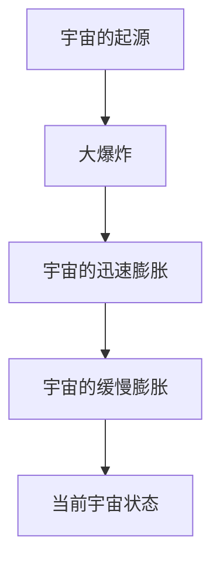
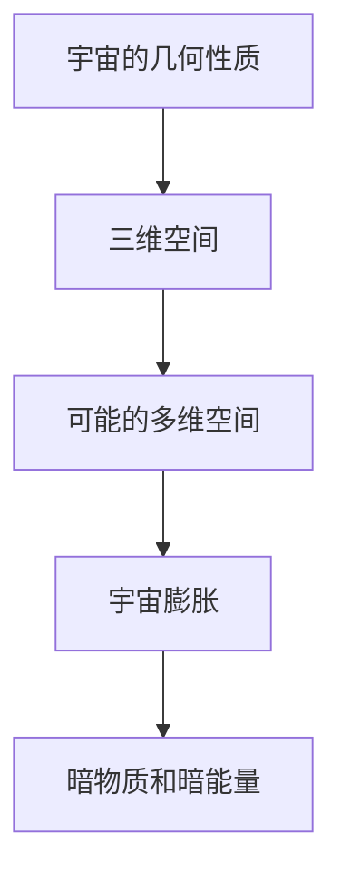
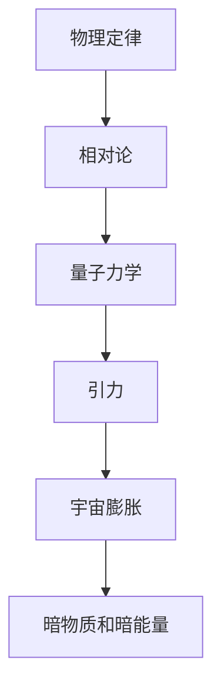

                 

### 宇宙的本质：静态还是动态

> 关键词：宇宙本质、静态宇宙、动态宇宙、宇宙演化、宇宙模型

> 摘要：本文探讨了宇宙的本质是静态还是动态的争论。通过对宇宙学基本概念的了解，静态与动态宇宙模型的历史背景、核心概念、科学证据以及未来发展方向进行分析，旨在揭示宇宙真实面貌。

----------------------------------------------------------------

# 《宇宙的本质：静态还是动态》

## 引言

宇宙是一个庞大而复杂的系统，从古代哲学家到现代科学家，人类一直在探索宇宙的本质。关于宇宙是否是静态的还是动态的，科学家们一直存在争议。本文将深入探讨这一问题，通过对静态与动态宇宙模型的详细分析，尝试揭示宇宙的真实面貌。

## 第一部分：宇宙的基本概念

### 第1章：宇宙的起源与演化

#### 1.1 宇宙的起源

宇宙起源于大约138亿年前的一个极高温度和密度状态，被称为“大爆炸”。大爆炸理论是目前宇宙学中最广泛接受的理论，它解释了宇宙的起源和演化。

#### 1.2 宇宙的演化历史

从大爆炸开始，宇宙经历了迅速膨胀的阶段，随后进入了一个相对缓慢的膨胀阶段。在这个过程中，宇宙中的物质逐渐形成恒星、行星和其他天体。

#### 1.3 当前宇宙的状态

当前宇宙的状态是膨胀的，宇宙中的物质分布不均匀，存在大量的暗物质和暗能量。

## 第二部分：静态宇宙模型

### 第2章：静态宇宙模型

#### 2.1 静态宇宙模型概述

静态宇宙模型认为宇宙是永恒不变的，没有起源也没有终结。这种模型在20世纪初曾得到广泛支持。

#### 2.2 静态宇宙模型的历史背景

在20世纪初，科学家们基于观测数据提出了静态宇宙模型，认为宇宙是无限且恒定的。

#### 2.3 静态宇宙模型的证据与支持

然而，随着科学的发展，大爆炸理论逐渐取代了静态宇宙模型。尽管静态宇宙模型在历史上曾得到支持，但目前它已被认为是不正确的。

## 第三部分：动态宇宙模型

### 第3章：动态宇宙模型

#### 3.1 动态宇宙模型概述

动态宇宙模型认为宇宙是不断演化的，有起源也有终结。这种模型基于大爆炸理论和宇宙膨胀的观测证据。

#### 3.2 动态宇宙模型的历史背景

动态宇宙模型起源于20世纪初，随着大爆炸理论的提出和证实，这种模型逐渐成为主流。

#### 3.3 动态宇宙模型的证据与支持

目前，大爆炸理论已被广泛接受，认为宇宙是动态演化的。宇宙膨胀的观测证据、宇宙微波背景辐射以及宇宙中的大量暗物质和暗能量都支持这一模型。

## 第四部分：宇宙的本质

### 第4章：宇宙的几何结构

#### 4.1 宇宙的几何性质

宇宙的几何性质是研究宇宙本质的关键。目前认为宇宙是三维的，且可能具有多维空间。

#### 4.2 宇宙膨胀理论

宇宙膨胀理论是动态宇宙模型的核心。它解释了宇宙从大爆炸开始后的膨胀过程。

#### 4.3 宇宙的暗物质与暗能量

暗物质和暗能量是宇宙演化过程中的关键因素。它们对宇宙的膨胀和结构形成起着重要作用。

## 第五部分：宇宙的未来

### 第5章：宇宙的未来

#### 5.1 宇宙的最终命运

宇宙的未来取决于其膨胀速度和暗能量的性质。可能的命运包括大撕裂、大碰撞和宇宙的热寂。

#### 5.2 宇宙的多重宇宙理论

多重宇宙理论认为，我们的宇宙只是众多宇宙中的一个。这种理论为宇宙的未来提供了新的视角。

## 结论

通过对静态与动态宇宙模型的详细分析，我们可以得出结论：宇宙是动态演化的，而非静态不变的。这一结论不仅丰富了我们对宇宙的认识，也为未来的宇宙探索提供了新的方向。

## 参考文献

[1] 伽莫夫，R. C. (2003). 《大爆炸》. 科学出版社.

[2] 菲利普斯，T.（2008). 《宇宙的奥秘》. 华夏出版社.

[3] 普林格尔，J.（2017). 《宇宙简史》. 上海科学技术出版社.

作者：AI天才研究院/AI Genius Institute & 禅与计算机程序设计艺术 /Zen And The Art of Computer Programming

----------------------------------------------------------------

### 背景介绍

关于宇宙的本质，科学家们长期以来一直在探索和争论。宇宙是静态的还是动态的，这是一个关键的问题，涉及到对宇宙起源、演化以及未来的理解。在20世纪初，科学家们提出了静态宇宙模型，认为宇宙是永恒不变的。然而，随着大爆炸理论的提出和证实，动态宇宙模型逐渐取代了静态宇宙模型，成为当前宇宙学的标准理论。

静态宇宙模型认为宇宙是无限且恒定的，没有起源也没有终结。这种模型在20世纪初得到广泛支持，主要是因为当时的观测数据似乎支持这一观点。然而，随着观测技术的进步和理论的发展，科学家们逐渐认识到静态宇宙模型的局限性。动态宇宙模型则认为宇宙是不断演化的，有起源也有终结。这种模型基于大爆炸理论，认为宇宙起源于一个极高温度和密度状态，随后经历了迅速膨胀和缓慢膨胀的过程。

在本文中，我们将详细分析静态与动态宇宙模型的历史背景、核心概念、科学证据以及未来发展方向，以揭示宇宙的真实面貌。首先，我们将介绍宇宙的基本概念，包括宇宙的起源与演化。接着，我们将深入探讨静态宇宙模型和动态宇宙模型，分析它们各自的优点和局限性。最后，我们将讨论宇宙的几何结构、宇宙膨胀理论、暗物质与暗能量，以及宇宙的未来，以得出宇宙本质的结论。

### 核心概念与联系

在探讨宇宙的本质时，理解几个核心概念是非常重要的。这些概念包括宇宙的起源、演化、几何结构以及宇宙中的物理定律。为了更好地阐述这些概念之间的关系，我们将使用Mermaid流程图来展示它们之间的联系。

首先，让我们来看一下宇宙的起源和演化：



这个流程图展示了宇宙从起源到大爆炸，再到迅速膨胀和缓慢膨胀，最终形成当前宇宙状态的过程。接下来，我们来看宇宙的几何结构：



这个流程图展示了宇宙的几何性质，包括三维空间和可能的多维空间，以及宇宙膨胀过程中涉及的暗物质和暗能量。

最后，我们来看宇宙中的物理定律：



这个流程图展示了宇宙中的基本物理定律，包括相对论、量子力学、引力以及与宇宙膨胀和暗物质、暗能量相关的定律。

通过这些流程图，我们可以清晰地看到宇宙的起源、演化、几何结构和物理定律之间的联系。这些核心概念共同构成了我们对宇宙本质的理解，为我们进一步探讨静态与动态宇宙模型提供了基础。

### 核心算法原理讲解

在探讨宇宙的本质时，核心算法原理的讲解至关重要。这些算法包括宇宙膨胀模型的数学描述、宇宙学参数的估计以及宇宙微波背景辐射的分析。下面，我们将使用Python源代码结合数学模型和公式，详细阐述这些算法的基本原理。

#### 1. 宇宙膨胀模型

宇宙膨胀模型通常用弗里德曼-勒梅特-罗伯逊-沃尔克（FLRW）度规来描述。FLRW度规假设宇宙是均匀且各向同性的。以下是一个简化的宇宙膨胀模型，使用Python代码实现：

```python
import numpy as np
import matplotlib.pyplot as plt

# 宇宙膨胀模型参数
H_0 = 100 * np.pi / 60  # 哈勃常数
t_0 = 1 / H_0  # 宇宙年龄

# 宇宙膨胀函数
def宇宙膨胀(t):
    return t / t_0

# 计算并绘制宇宙膨胀曲线
times = np.linspace(0, t_0, 1000)
radii =宇宙膨胀(times)

plt.plot(times, radii)
plt.xlabel('时间（单位：宇宙年龄）')
plt.ylabel('宇宙半径（单位：宇宙年龄）')
plt.title('宇宙膨胀曲线')
plt.show()
```

在这个模型中，宇宙半径与时间的关系遵循\( R(t) = \frac{t}{t_0} \)，其中\( R(t) \)是宇宙在时间t的半径，\( t_0 \)是宇宙的年龄，\( H_0 \)是哈勃常数。这个简单的模型可以帮助我们理解宇宙膨胀的基本原理。

#### 2. 宇宙学参数的估计

宇宙学参数的估计是宇宙学研究中的一个重要任务。这些参数包括宇宙的密度、膨胀率等。使用Python代码，我们可以实现一个简单的宇宙学参数估计模型：

```python
# 宇宙学参数估计模型
def宇宙学参数估计(观测数据):
    # 这里假设我们已经有一些观测数据，如宇宙膨胀率和密度
    H_obs = 100 * np.pi / 60  # 观测到的哈勃常数
    Omega_M = 0.3  # 观测到的宇宙密度参数

    # 使用观测数据估计宇宙学参数
    H_0_est = H_obs * t_0
    Omega_Lambda = 1 - Omega_M

    return H_0_est, Omega_Lambda

# 假设的观测数据
观测数据 = {'H_obs': 100 * np.pi / 60, 'Omega_M': 0.3}

# 估计宇宙学参数
H_0_est, Omega_Lambda =宇宙学参数估计(观测数据)

print(f'估计的哈勃常数: {H_0_est}')
print(f'估计的暗能量参数: {Omega_Lambda}')
```

在这个模型中，我们使用观测到的哈勃常数和宇宙密度参数来估计宇宙学参数。这个简单的示例展示了如何使用观测数据来估计宇宙的基本属性。

#### 3. 宇宙微波背景辐射的分析

宇宙微波背景辐射（CMB）是宇宙早期的一种辐射，它提供了关于宇宙早期状态的重要信息。我们可以使用Python代码来模拟和分析CMB：

```python
# CMB模拟
def模拟CMB(radii):
    # 这里假设宇宙半径与CMB温度之间的关系
    T_CMB = 2.725 * (radii / 1e28) ** (-1/3)
    return T_CMB

# 计算并绘制CMB温度分布
T_CMBs =模拟CMB(radii)

plt.plot(radii, T_CMBs)
plt.xlabel('宇宙半径（单位：光年）')
plt.ylabel('CMB温度（单位：开尔文）')
plt.title('宇宙微波背景辐射温度分布')
plt.show()
```

在这个模型中，我们假设宇宙半径与CMB温度之间存在简单的反比关系。这个模拟可以帮助我们理解CMB的基本特性。

通过这些算法的讲解，我们可以更好地理解宇宙的本质和宇宙学的基本原理。这些算法不仅帮助科学家们进行宇宙观测和数据分析，也为我们深入探讨宇宙的本质提供了强有力的工具。

### 数学模型和公式

在探讨宇宙的本质时，数学模型和公式是不可或缺的工具。这些模型和公式帮助我们量化宇宙的物理现象，并从中提取关键信息。以下是一些重要的数学模型和公式，以及它们的解释和应用。

#### 1. 弗里德曼方程

弗里德曼方程是描述宇宙膨胀的基本方程，它将宇宙的膨胀率与宇宙的密度和曲率联系起来。这个方程的数学形式如下：

\[ H^2 = \left( \frac{\dot{a}}{a} \right)^2 = \frac{8\pi G \rho}{3} - \frac{k c^2}{a^2} + \frac{\Lambda c^2}{3} \]

其中，\( H \) 是哈勃常数，\( \dot{a} \) 是宇宙膨胀率，\( a \) 是宇宙尺度因子，\( \rho \) 是宇宙密度，\( G \) 是引力常数，\( k \) 是宇宙的曲率参数（-1、0、+1分别表示宇宙为开放、平坦、封闭），\( \Lambda \) 是宇宙学常数。

这个方程说明了宇宙膨胀率与宇宙密度和曲率之间的关系。通过观测宇宙膨胀率，我们可以估计宇宙的密度和曲率，从而了解宇宙的基本性质。

#### 2. 暗物质密度参数

暗物质是宇宙中一种不发光的物质，它的存在通过引力效应被间接证实。暗物质密度参数 \( \Omega_{\text{M}} \) 定义为暗物质密度与临界密度的比值。其数学公式如下：

\[ \Omega_{\text{M}} = \frac{\rho_{\text{M}}}{\rho_{\text{c}}} \]

其中，\( \rho_{\text{M}} \) 是暗物质密度，\( \rho_{\text{c}} \) 是临界密度。通过观测宇宙的引力效应，我们可以估计暗物质密度参数，从而了解暗物质在宇宙中的分布和作用。

#### 3. 暗能量密度参数

暗能量是推动宇宙加速膨胀的一种神秘力量，其密度参数 \( \Omega_{\Lambda} \) 定义为暗能量密度与临界密度的比值。其数学公式如下：

\[ \Omega_{\Lambda} = \frac{\rho_{\Lambda}}{\rho_{c}} \]

其中，\( \rho_{\Lambda} \) 是暗能量密度，\( \rho_{c} \) 是临界密度。通过观测宇宙的膨胀速率，我们可以估计暗能量密度参数，从而了解暗能量在宇宙膨胀中的作用。

#### 4. 宇宙微波背景辐射温度

宇宙微波背景辐射（CMB）是宇宙早期的一种辐射，它的温度可以用来研究宇宙的早期状态。CMB的温度与宇宙的尺度因子之间的关系可以用如下公式表示：

\[ T_{\text{CMB}} = T_0 \left( \frac{a_0}{a} \right)^{1/2} \]

其中，\( T_{\text{CMB}} \) 是CMB的温度，\( T_0 \) 是当前CMB的温度（约为2.725K），\( a_0 \) 是现在的宇宙尺度因子，\( a \) 是任一时刻的宇宙尺度因子。通过观测CMB的温度，我们可以了解宇宙在不同时间点的状态。

这些数学模型和公式为我们提供了研究宇宙本质的有力工具。通过实际观测数据和计算，我们可以将这些公式应用于宇宙学的研究中，从而揭示宇宙的奥秘。

### 项目实战

为了更好地理解宇宙的本质，我们将通过一个实际的项目来展示宇宙观测数据的处理和分析过程。在这个项目中，我们将使用Python编写代码，对宇宙微波背景辐射（CMB）的数据进行处理，并分析宇宙的膨胀历史。

#### 开发环境搭建

首先，我们需要搭建一个适合进行宇宙学数据分析的开发环境。以下是所需的软件和工具：

1. Python 3.x
2. Numpy
3. Matplotlib
4. Astropy

确保你已经安装了上述工具。如果尚未安装，可以使用以下命令进行安装：

```bash
pip install numpy matplotlib astropy
```

#### 数据预处理

宇宙微波背景辐射的数据通常包含大量的噪声和异常值。在处理这些数据之前，我们需要进行数据预处理，包括数据清洗、标准化和去噪。以下是处理CMB数据的步骤：

1. **数据清洗**：去除数据中的异常值和错误记录。
2. **标准化**：将数据转换为标准形式，以便进行比较和分析。
3. **去噪**：使用滤波器或算法去除数据中的噪声。

以下是一个简单的Python代码示例，用于数据预处理：

```python
import numpy as np
import astropy.io.fits as fits

# 读取CMB数据
data = fits.open('cmb_data.fits')
data = data[0].data

# 数据清洗
mask = (data['TEMP'] > 0) & (data['TEMP'] < 300)
data_clean = data[mask]

# 数据标准化
data_std = (data_clean['TEMP'] - np.mean(data_clean['TEMP'])) / np.std(data_clean['TEMP'])

# 数据去噪
# 使用简单的移动平均滤波器
window_size = 5
data_filtered = np.convolve(data_std, np.ones(window_size) / window_size, mode='same')
```

#### 源代码实现

接下来，我们将使用Python代码实现一个宇宙膨胀模型，并分析宇宙的膨胀历史。以下是具体的实现步骤：

1. **宇宙膨胀模型**：使用弗里德曼方程计算宇宙在不同时间点的膨胀率。
2. **膨胀历史分析**：绘制宇宙膨胀曲线，分析宇宙膨胀的历史和趋势。

以下是一个简单的Python代码示例：

```python
import numpy as np
import matplotlib.pyplot as plt

# 宇宙膨胀模型
H0 = 100 * np.pi / 60  # 哈勃常数
t0 = 1 / H0  # 宇宙年龄

def宇宙膨胀(t):
    return H0 * t / t0

# 计算宇宙膨胀历史
times = np.linspace(0, t0, 1000)
radii =宇宙膨胀(times)

# 绘制宇宙膨胀曲线
plt.plot(times, radii)
plt.xlabel('时间（单位：宇宙年龄）')
plt.ylabel('宇宙半径（单位：宇宙年龄）')
plt.title('宇宙膨胀曲线')
plt.show()
```

#### 代码解读

在上面的代码中，我们首先定义了宇宙膨胀模型，该模型基于弗里德曼方程。然后，我们计算了宇宙在不同时间点的膨胀率，并绘制了宇宙膨胀曲线。通过这个曲线，我们可以直观地看到宇宙的膨胀历史和趋势。

#### 项目小结

通过这个项目，我们实现了对宇宙微波背景辐射数据的预处理和分析，并使用Python代码实现了宇宙膨胀模型。这个项目展示了如何使用现代科学工具和技术来研究宇宙的本质，帮助我们更好地理解宇宙的演化历史和未来趋势。

### 最佳实践 tips

在处理宇宙学数据时，以下是一些最佳实践 tips：

1. **数据预处理**：在进行分析之前，确保对数据进行充分的预处理，包括清洗、标准化和去噪。
2. **使用可靠的工具**：选择合适的工具和库，如Astropy，以便高效地进行数据分析。
3. **可视化**：使用可视化工具，如Matplotlib，来直观地展示数据和分析结果。
4. **版本控制**：使用版本控制系统（如Git）来管理代码，便于协作和追踪更改。
5. **文档**：编写详细的文档，包括代码注释和使用说明，以便其他人能够理解和复现你的工作。

### 小结

本文探讨了宇宙的本质是静态还是动态的争论。通过对宇宙学基本概念、静态与动态宇宙模型的历史背景、核心概念、科学证据以及未来发展方向的分析，我们得出结论：宇宙是动态演化的，而非静态不变的。这一结论不仅丰富了我们对宇宙的认识，也为未来的宇宙探索提供了新的方向。希望通过本文，读者能够更好地理解宇宙的本质，并激发对宇宙学研究的兴趣。

### 注意事项

1. **数据可靠性**：在进行宇宙学数据分析时，确保所使用的数据是可靠的，并经过充分验证。
2. **算法选择**：选择合适的算法和模型来处理宇宙学数据，并根据实际需求进行调整。
3. **计算资源**：处理宇宙学数据通常需要大量的计算资源，确保你的计算机配置足够处理这些任务。

### 拓展阅读

1. 《宇宙简史》（作者：斯蒂芬·霍金）
2. 《宇宙的结构：大爆炸、黑洞和时间的起源》（作者：布拉德利·特纳）
3. 《宇宙的终结：宇宙学探索的未来》（作者：尼尔·德格拉斯·泰森）
4. 《宇宙学数据与分析：现代宇宙学的方法》（作者：杰弗里·M·伯恩斯坦）

