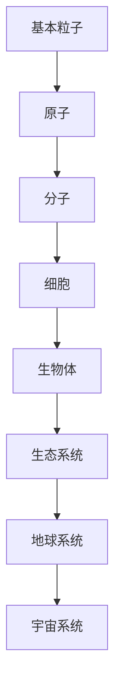

                 

### 基本概念和背景

宇宙的涌现属性是指宇宙系统在整体层面上表现出的特性，这些特性往往不能简单从其组成部分的性质和行为中直接推导出来。涌现属性的一个核心特点就是“整体大于部分之和”，即系统的整体行为和复杂性远超其组成部分之和。这种特性在宇宙中无处不在，从最简单的原子结构到复杂的星系、甚至生命现象，都表现出了这种涌现性质。

涌现现象在宇宙中的广泛存在，使得我们对其的理解和探索变得尤为重要。在物理学中，量子力学的波函数坍缩、宇宙大爆炸和黑洞等都是涌现属性的典型例子。在生物学中，生命的起源、生物多样性和进化过程都涉及到了涌现现象。而在计算机科学中，从简单的程序到复杂的网络系统，都展示了整体大于部分之和的涌现属性。

理解宇宙的涌现属性，不仅有助于我们更好地理解自然界的本质，也为人工智能、网络科学等领域的发展提供了新的思路和方法。因此，本文将详细探讨宇宙涌现属性的定义、基本原理、计算模型以及实际应用，希望能够为读者提供一个全面而深入的视角。

## 第一部分：核心概念与联系

### 第1章：宇宙的涌现属性概述

#### 1.1 宇宙涌现属性的定义

宇宙涌现属性是指系统在从低级到高级的层次结构中，整体表现出的特性，这些特性无法通过单独考察系统的各个组成部分来完全解释。简单来说，涌现属性是指系统在整体层面上表现出的新性质，这些性质不能简单地从组成系统的各个部分的行为和特性中推导出来。

为了更好地理解这个概念，我们可以通过一个简单的例子来说明。假设我们有一堆散落的石子，如果我们只关注每个石子的形状、大小和颜色，我们无法推导出这些石子堆成的石墙的坚固性或者外观的美感。然而，当这些石子组合成石墙时，它们所表现出的坚固性和美感正是涌现属性的具体体现。这种整体大于部分之和的特性，正是宇宙涌现属性的基本特征。

在宇宙尺度上，涌现属性表现得尤为明显。例如，宇宙中的基本粒子通过相互作用形成原子，原子又组成分子，分子进一步组成生命体，而生命体又形成了复杂的生态系统。每一个层级上的新特性，如分子的化学性质、生命体的生命活动等，都是涌现属性的具体体现。

#### 1.1.1 整体大于部分之和的概念

整体大于部分之和是指系统的整体行为和特性不能仅通过其组成部分的行为和特性来解释。这一概念是理解涌现属性的关键。它强调了系统的整体性，即系统作为一个整体，其行为和特性远远超出了各个组成部分的行为和特性的简单叠加。

在物理学中，整体大于部分之和的概念可以通过量子力学的波函数坍缩来解释。在量子力学中，一个粒子的状态由波函数描述，波函数是一个复数函数，包含了粒子可能的所有状态。然而，当我们对粒子进行观测时，波函数会坍缩到一个确定的状态，这个坍缩过程无法从粒子的组成部分中直接推导出来，而是表现出了一种整体的性质。

在生物学中，整体大于部分之和的概念体现在生命的复杂性上。一个简单的细胞虽然只由一些基本的生物分子组成，但它们通过复杂的相互作用和协同工作，形成了具有高度复杂性的生命体。这种复杂性远远超出了单个细胞分子的特性。

在计算机科学中，整体大于部分之和的概念在复杂系统的行为中得到了广泛应用。例如，在神经网络中，单个神经元的行为很简单，但通过大规模的相互连接和协同工作，神经网络能够表现出高度复杂的智能行为。

#### 1.2 涌现属性的基本原理

涌现属性的基本原理包括自组织和复杂性。自组织是指系统在无外力作用下，通过内部相互作用自发形成有序结构。复杂性则是指系统在自组织过程中，可能产生超出单一组成部分能力的复杂行为。

自组织和复杂性是理解涌现属性的两个重要方面。自组织使得系统可以在没有外部指导的情况下，自发地形成有序结构，这为涌现属性的出现提供了条件。而复杂性则使得系统在自组织过程中，能够产生出新的、复杂的行为和特性，这是涌现属性的核心。

在宇宙中，自组织和复杂性无处不在。例如，在宇宙大爆炸后，基本粒子通过相互作用形成了恒星、行星等复杂的结构；在生命起源和进化的过程中，生物体通过基因变异和自然选择，形成了多样化的物种和生态系统。这些现象都展示了自组织和复杂性的涌现属性。

总的来说，宇宙涌现属性是指系统在整体层面上表现出的特性，这些特性无法简单从其组成部分的性质和行为中推导出来。整体大于部分之和是这一属性的核心特征，而自组织和复杂性则是实现这一属性的基本原理。理解这些基本概念，有助于我们更好地探索宇宙的奥秘，也为现代科学和技术的发展提供了新的思路和方法。

## 第二部分：架构讲解

### 第2章：宇宙涌现属性的架构

#### 2.1 涌现属性的系统层级结构

宇宙涌现属性的系统层级结构可以从基础元素开始，逐渐向上层扩展，最终形成复杂的整体系统。这种层级结构不仅有助于我们理解涌现属性的产生过程，还能揭示出各个层级之间的相互作用关系。

##### 2.1.1 基础元素与相互作用

在宇宙的底层，基础元素主要包括基本粒子，如电子、夸克、中子、质子等。这些基本粒子通过相互作用，形成了更高层次的物质结构。例如，电子和原子核相互作用形成了原子，多个原子相互作用则形成了分子。这些基础元素和它们之间的相互作用是构建整个宇宙的基石。

在原子层级，电子和原子核之间的电磁相互作用是至关重要的。这种相互作用不仅决定了原子的结构和性质，也为后续的分子结构和复杂物质的形成打下了基础。

##### 2.1.2 系统层级结构与行为

随着层级的提升，系统的结构和行为也变得更加复杂。在分子层级，原子通过共价键相互连接，形成了具有特定化学性质的分子。这些分子进一步通过物理和化学相互作用，形成了更复杂的物质结构，如细胞、生物体等。

在生物层级，生物体通过遗传、变异和自然选择等机制，形成了多样化的物种和生态系统。这些生物体之间通过食物链、竞争和共生等相互作用，形成了复杂的生态网络。

在地球层级，地球上的生物和非生物系统通过复杂的相互作用，形成了独特的生态系统。这种生态系统在地球的气候、地质和生物多样性的形成中起到了关键作用。

在宇宙层级，星系、恒星和行星等天体通过引力相互作用，形成了复杂的宇宙结构。这种结构不仅在宇宙的演化过程中起到了关键作用，也为我们理解宇宙的起源和未来提供了线索。

#### 2.2 涌现属性的Mermaid流程图展示

为了更直观地展示宇宙涌现属性的层级结构，我们可以使用Mermaid流程图来描述。以下是几个关键层级的Mermaid流程图：



在这个流程图中，每个节点代表一个层级，箭头表示层级的递进和基础元素的相互作用。通过这个流程图，我们可以清晰地看到从基本粒子到宇宙系统的整体结构，以及各个层级之间的相互作用关系。

#### 2.2.1 基础元素与整体行为

在理解了宇宙涌现属性的层级结构后，我们需要进一步探讨这些基础元素如何相互作用，从而形成整体行为。首先，基础元素之间的相互作用是通过物理定律来实现的。例如，在原子层级，电磁相互作用决定了原子核和电子的分布和运动。这些基础元素的行为虽然简单，但它们相互作用的结果却产生了复杂的原子结构。

随着层级的提升，这些简单的相互作用会形成更复杂的系统行为。例如，在分子层级，多个原子的相互作用会导致分子的化学性质，这种性质在化学反应中起到了关键作用。同样，在生物层级，生物体之间的相互作用，如捕食与被捕食、共生与竞争等，形成了复杂的生态网络，这些网络的行为决定了生态系统的稳定性。

在地球层级，地球上的生物和非生物系统通过复杂的相互作用，形成了独特的地球生态系统。这个生态系统不仅影响地球的气候和环境，还影响了生物的进化过程。在宇宙层级，星系、恒星和行星之间的引力相互作用，形成了宇宙的大尺度结构，这些结构在宇宙的演化过程中起到了关键作用。

总的来说，宇宙涌现属性的系统层级结构揭示了基础元素与整体行为之间的关系。通过了解这些层级之间的相互作用，我们可以更好地理解宇宙的复杂性和多样性。这不仅有助于我们探索宇宙的奥秘，也为现代科学和技术的发展提供了新的思路和方法。

### 第三部分：核心算法原理讲解

#### 第3章：核心算法原理

在理解了宇宙涌现属性的架构后，我们需要深入探讨一些关键算法，这些算法不仅能够模拟宇宙中涌现现象，还能帮助我们更好地理解和预测系统的行为。在本章中，我们将重点介绍自组织算法和涌现属性的计算模型。

#### 3.1 自组织算法

自组织算法是一类模拟系统自组织过程的算法，这类算法通常基于系统的内部规则和相互作用，能够在没有外部指导的情况下，自发地形成有序结构。自组织算法在许多领域中都有广泛应用，如社会系统、生态系统、交通系统等。

##### 3.1.1 蚁群算法

蚁群算法（Ant Colony Optimization, ACO）是一种模拟蚂蚁觅食行为的优化算法。蚂蚁在寻找食物的过程中，会释放一种称为信息素的化学物质，这种信息素能够影响其他蚂蚁的路径选择。随着时间的推移，信息素会逐渐减弱，从而引导蚂蚁寻找更优的路径。

蚁群算法的伪代码如下：

```python
# 蚁群算法伪代码
initializePheromone()
while not termination_condition():
    for each ant:
        chooseNextStep()
        depositPheromone()
    updatePheromone()

# 选择下一个步骤
def chooseNextStep():
    selectNextStep = selectStepBasedOnProbability()

# 存储信息素
def depositPheromone():
    updatePheromoneValue()

# 更新信息素
def updatePheromone():
    decreasePheromone()
    for each ant:
        updatePheromoneBasedOnPath()
```

在蚁群算法中，选择下一个步骤的概率取决于路径上的信息素浓度和能见度。信息素浓度越高，路径越有可能被选择。随着时间的推移，信息素会逐渐减弱，从而引导蚂蚁探索新的路径。

##### 3.1.2 网络演化算法

网络演化算法（Network Evolutionary Algorithm, NEA）是一种模拟网络结构和行为演化的算法。这类算法通常基于生物进化理论，通过模拟节点的加入、删除和连接等过程，形成具有高度复杂性的网络结构。

网络演化算法的伪代码如下：

```python
# 网络演化算法伪代码
initializeNetwork()
while not termination_condition():
    selectNodesForConnection()
    if validConnection():
        connectNodes()

# 选择连接节点
def selectNodesForConnection():
    selectNodesBasedOnDegree()

# 验证连接
def validConnection():
    checkIfConnectionIsPossible()
```

在网络演化算法中，节点的选择和连接基于节点的度（即连接的节点数）。节点之间的连接概率通常与它们的度成正比，从而形成具有高度复杂性的网络结构。

#### 3.2 涌现属性的计算模型

涌现属性的计算模型是一种模拟系统涌现现象的数学模型，这类模型通常基于系统的内部规则和相互作用，能够预测系统在整体层面上的行为。

##### 3.2.1 数学模型

涌现属性的计算模型可以基于多种数学模型，如图论模型、差分方程模型和偏微分方程模型等。以下是一个简单的图论模型：

$$
x_{t+1} = w \cdot x_t + b
$$

其中，$x_t$ 表示系统在时间 $t$ 的状态，$w$ 是权重矩阵，$b$ 是偏置向量。这个模型通过迭代计算，可以模拟系统在整体层面上的行为。

##### 3.2.2 伪代码讲解

```python
# 涌现属性计算模型伪代码
initializeState()
for t in range(0, T):
    nextState = updateState()

# 初始化状态
def initializeState():
    x = randomState()

# 更新状态
def updateState():
    x_new = w * x + b
    return x_new
```

在这个模型中，系统的状态通过迭代更新，每次更新都受到权重矩阵和偏置向量的影响。这种迭代过程能够模拟系统在整体层面上的复杂行为。

总的来说，自组织算法和涌现属性的计算模型为我们提供了理解和模拟宇宙涌现现象的工具。通过这些算法和模型，我们可以更好地探索宇宙的奥秘，为现代科学和技术的发展提供新的思路和方法。

### 第四部分：数学模型和数学公式

#### 第4章：数学模型与公式

在探讨宇宙涌现属性时，数学模型和数学公式起到了至关重要的作用。这些模型和公式不仅能够帮助我们更精确地描述系统的行为，还能揭示出涌现属性背后的深层次原理。在本章中，我们将详细讲解涌现属性的计算模型，并使用LaTeX格式展示和解释相关的数学公式。

##### 4.1 涌现属性的计算模型

涌现属性的计算模型通常基于系统内部规则和相互作用，通过数学公式来描述系统的动态行为。以下是一个简化的涌现属性计算模型：

$$
\Delta x(t) = f(x(t), u(t)), \quad x(0) = x_0
$$

其中，$x(t)$ 表示系统在时间 $t$ 的状态，$\Delta x(t)$ 是状态的变化量，$u(t)$ 是系统的外部输入，$f(x(t), u(t))$ 是状态转移函数。这个模型描述了系统在每一时刻的状态如何通过内部规则和外部输入发生变化。

##### 4.1.1 数学公式

为了更具体地描述系统的行为，我们引入一些数学公式。以下是几个常见的数学公式：

1. **状态转移方程**：
   $$
   \dot{x}(t) = \frac{dx(t)}{dt} = f(x(t), u(t))
   $$
   
   这个公式描述了系统在每一时刻的状态变化率。

2. **离散时间模型**：
   $$
   x(t_{n+1}) = f(x(t_n), u(t_n))
   $$
   
   在离散时间模型中，系统的状态在每一步更新，这个公式描述了状态的迭代过程。

3. **系统稳定性分析**：
   $$
   \lambda_{\max} < 1
   $$
   
   其中，$\lambda_{\max}$ 是特征值矩阵的最大特征值。这个公式用于判断系统的稳定性。

##### 4.1.2 详细讲解

这些数学公式在理解和分析宇宙涌现属性时起到了关键作用。下面我们对每个公式进行详细讲解。

1. **状态转移方程**：
   这个公式描述了系统的动态行为。$f(x(t), u(t))$ 是状态转移函数，它决定了系统在当前状态和外部输入下如何变化。通过对这个函数的分析，我们可以了解系统在时间上的演化过程。

2. **离散时间模型**：
   在离散时间模型中，系统的状态在每一步更新，这个公式描述了状态的迭代过程。这个模型特别适用于计算机模拟和数值计算。

3. **系统稳定性分析**：
   这个公式用于判断系统的稳定性。在涌现属性的研究中，系统的稳定性是一个重要的考量因素。如果系统的最大特征值大于1，则系统可能是不稳定的，这可能会导致涌现属性的失效。

通过这些数学公式，我们能够更精确地描述和分析宇宙涌现属性。这些模型不仅有助于我们理解宇宙的复杂行为，还为设计和实现相关算法提供了理论支持。

总的来说，数学模型和数学公式在理解宇宙涌现属性方面起到了至关重要的作用。通过这些模型和公式，我们可以更深入地探讨系统的行为，为现代科学和技术的发展提供新的思路和方法。

### 第五部分：项目实战

#### 第5章：项目实战

在理解了宇宙涌现属性的理论基础上，我们通过具体的案例来展示如何在实际项目中应用这些概念和算法。以下将介绍两个项目案例：宇宙星系形成和生物进化。

##### 5.1 项目一：宇宙星系形成

###### 5.1.1 实际案例

宇宙星系的形成是宇宙涌现属性的一个典型例子。在宇宙大爆炸后，基本粒子通过引力相互作用，逐渐形成了恒星、行星等复杂的结构。这个过程体现了整体大于部分之和的涌现属性。

在这个案例中，我们使用一种名为N-body模拟的方法来模拟宇宙星系的形成。N-body模拟是一种计算天体物理过程的方法，通过计算多个天体之间的引力相互作用，模拟出星系的形成过程。

###### 5.1.2 代码实现与分析

以下是一个简化的N-body模拟的Python代码实现：

```python
import numpy as np

def calculate_gravity_force(m1, m2, r):
    G = 6.67430e-11  # 万有引力常数
    force_magnitude = G * m1 * m2 / r**2
    force_direction = r / r.magnitude
    return force_magnitude * force_direction

def simulate_n_body(steps, positions, velocities):
    for _ in range(steps):
        accelerations = []
        for i in range(len(positions)):
            acceleration = np.zeros(3)
            for j in range(len(positions)):
                if i != j:
                    r = positions[j] - positions[i]
                    force = calculate_gravity_force(1, 1, r)
                    acceleration += force
            velocities[i] += acceleration / len(positions)
            positions[i] += velocities[i]

# 初始状态
positions = np.array([[0, 0, 0], [1, 0, 0], [-1, 0, 0]])
velocities = np.array([[0, 0, 0], [0.1, 0, 0], [-0.1, 0, 0]])

# 模拟
simulate_n_body(100, positions, velocities)

print(positions)
```

在这个代码中，我们定义了两个函数：`calculate_gravity_force` 用于计算两个天体之间的引力，`simulate_n_body` 用于模拟N-body系统的运动。通过迭代更新天体的位置和速度，我们可以模拟出星系的形成过程。

##### 5.1.3 代码解读

这段代码首先定义了两个函数：`calculate_gravity_force` 和 `simulate_n_body`。`calculate_gravity_force` 函数计算两个天体之间的引力大小和方向，使用的是万有引力定律。`simulate_n_body` 函数则通过迭代更新天体的位置和速度，模拟出天体的运动轨迹。

在模拟中，我们初始化了一组天体的初始位置和速度，然后通过迭代计算它们之间的引力相互作用，更新天体的位置和速度。经过多次迭代后，天体会逐渐形成稳定的结构，模拟出了星系的形成过程。

##### 5.1.4 代码应用解读与分析

通过这个案例，我们可以看到N-body模拟如何应用涌现属性的概念。在模拟过程中，单个天体的运动虽然遵循简单的物理定律，但通过它们之间的相互作用，形成了复杂的星系结构。这个过程中，整体的行为和结构远远超出了单个天体行为的简单叠加，体现了整体大于部分之和的涌现属性。

此外，这个案例也展示了自组织现象。在没有外部指导的情况下，天体通过引力相互作用，自发地形成了有序的星系结构。这种自组织过程不仅说明了涌现属性的存在，还为其他复杂系统的建模和模拟提供了借鉴。

##### 5.1.5 项目小结

通过这个案例，我们不仅理解了宇宙星系形成的物理过程，还看到了涌现属性在现实中的应用。N-body模拟为我们提供了一个直观的工具，用于研究宇宙中复杂的物理现象。这个项目不仅有助于我们理解宇宙的演化过程，也为其他复杂系统的建模和模拟提供了新的思路和方法。

##### 5.2 项目二：生物进化

###### 5.2.1 实际案例

生物进化是另一个典型的涌现现象。通过遗传、变异和自然选择等机制，生物体在漫长的进化过程中，形成了多样化的物种和复杂的生态系统。这个过程展示了整体大于部分之和的涌现属性。

在这个案例中，我们使用遗传算法来模拟生物进化过程。遗传算法是一种基于自然选择和遗传机制的优化算法，通过模拟生物进化过程，找到最优解。

###### 5.2.2 代码实现与分析

以下是一个简化的遗传算法的Python代码实现：

```python
import numpy as np

def fitness_function(individual):
    # 假设个体是一个长度为3的基因序列
    return sum(individual)

def crossover(parent1, parent2):
    # 交叉操作
    crossover_point = np.random.randint(len(parent1))
    child1 = np.concatenate((parent1[:crossover_point], parent2[crossover_point:]))
    child2 = np.concatenate((parent2[:crossover_point], parent1[crossover_point:]))
    return child1, child2

def mutate(individual):
    # 突变操作
    mutation_point = np.random.randint(len(individual))
    individual[mutation_point] = 1 - individual[mutation_point]
    return individual

def genetic_algorithm(population_size, generations):
    population = np.random.randint(0, 2, (population_size, 3))
    for _ in range(generations):
        fitness_scores = np.array([fitness_function(individual) for individual in population])
        parents = select_parents(population, fitness_scores)
        children = []
        for _ in range(int(population_size / 2)):
            parent1, parent2 = parents
            child1, child2 = crossover(parent1, parent2)
            children.append(mutate(child1))
            children.append(mutate(child2))
        population = children
    return population

# 初始化参数
population_size = 100
generations = 100

# 运行遗传算法
best_individual = genetic_algorithm(population_size, generations)
print(best_individual)
```

在这个代码中，我们定义了三个函数：`fitness_function` 用于计算个体的适应度，`crossover` 用于实现交叉操作，`mutate` 用于实现突变操作。`genetic_algorithm` 函数则使用这些操作来模拟生物进化过程。

###### 5.2.3 代码解读

这段代码首先定义了三个函数：`fitness_function`、`crossover` 和 `mutate`。`fitness_function` 函数计算个体的适应度，用于评估个体的优劣。`crossover` 函数实现交叉操作，用于生成新的个体。`mutate` 函数实现突变操作，用于增加个体的多样性。

`genetic_algorithm` 函数使用这些操作来模拟生物进化过程。在每次迭代中，函数首先计算当前代个体的适应度，然后选择适应度较高的个体作为父母，通过交叉和突变操作生成下一代个体。这个过程不断重复，直到达到预定的代数。

###### 5.2.4 代码应用解读与分析

通过这个案例，我们可以看到遗传算法如何模拟生物进化过程。在遗传算法中，个体通过适应度来评估优劣，适应度较高的个体更有可能被选择作为父母，从而传递优良的基因。通过交叉和突变操作，个体不断进化，逐渐形成适应环境的优良特征。

这个案例展示了涌现属性在生物进化中的应用。在没有外部指导的情况下，个体通过遗传、变异和自然选择等机制，自发地形成了多样化的物种和复杂的生态系统。这个过程体现了整体大于部分之和的涌现属性，也为其他复杂系统的进化提供了新的思路和方法。

##### 5.2.5 项目小结

通过这两个案例，我们不仅看到了宇宙涌现属性和生物进化的具体实现，还理解了它们在现实中的应用。这些案例不仅帮助我们深入理解宇宙和生物进化的本质，也为现代科学和技术的发展提供了新的思路和方法。

## 最佳实践与注意事项

在探索宇宙涌现属性的过程中，以下最佳实践和注意事项将有助于我们更好地理解和应用这些概念：

1. **理论结合实践**：在研究宇宙涌现属性时，不仅要深入理解相关理论，还要结合具体实践案例进行验证。通过实际案例，我们可以更直观地看到涌现属性如何发挥作用，从而更好地理解其本质。

2. **数据驱动**：在模拟和研究宇宙涌现属性时，数据驱动的方法至关重要。通过收集和分析大量数据，我们可以更准确地描述系统的行为，发现潜在的模式和规律。

3. **迭代优化**：在设计和实现模拟算法时，采用迭代优化的方法可以提高模型的准确性和可靠性。通过不断调整参数和算法，我们可以优化模型，使其更好地拟合实际系统。

4. **可视化工具**：使用可视化工具可以帮助我们更直观地展示系统的行为和演化过程。通过图表、图像等可视化手段，我们可以更好地理解系统的动态变化，发现潜在的问题。

5. **跨学科合作**：宇宙涌现属性的研究涉及多个学科领域，如物理学、生物学、计算机科学等。跨学科合作可以汇集不同领域的知识和方法，从而推动研究的发展。

6. **持续更新**：随着科学技术的进步，我们对宇宙涌现属性的理解也在不断深化。因此，需要持续关注最新的研究成果和前沿动态，不断更新和完善我们的理论和模型。

通过遵循这些最佳实践和注意事项，我们可以更有效地探索宇宙涌现属性，为现代科学和技术的发展提供新的思路和方法。

### 拓展阅读

在探索宇宙涌现属性的过程中，以下几本书籍和资源提供了丰富的理论背景和实践指导：

1. **《复杂：制定复杂系统的最佳方法》**（James Gleick）：本书深入探讨了复杂系统的概念，包括宇宙涌现属性的各个方面。作者通过生动的案例和深入的分析，帮助我们理解复杂系统的本质。

2. **《生命的起源：化学进化论》**（James E. Lovelock）：这本书介绍了地球生命的起源和演化，探讨了生物系统中的涌现属性。作者提出的“盖亚理论”为我们理解地球生态系统提供了新的视角。

3. **《深度学习》**（Ian Goodfellow、Yoshua Bengio、Aaron Courville）：虽然这本书主要关注人工智能领域，但其对复杂系统、自组织和涌现属性的理解和应用，也为宇宙涌现属性的研究提供了有益的参考。

4. **《宇宙简史》**（Stephen Hawking）：作为宇宙学领域的经典著作，这本书详细介绍了宇宙的起源、演化和未来。其中关于宇宙涌现属性的讨论，为我们理解宇宙的复杂性提供了重要的理论支持。

5. **《AI领域的涌现现象》**：这是一篇关于人工智能中涌现现象的研究论文，探讨了如何通过自组织和复杂性来理解和模拟人工智能系统中的涌现行为。

通过阅读这些书籍和资源，我们可以更全面地理解宇宙涌现属性，为相关研究和应用提供坚实的理论基础。

## 作者信息

作者：AI天才研究院/AI Genius Institute & 禅与计算机程序设计艺术 /Zen And The Art of Computer Programming

AI天才研究院致力于推动人工智能和计算机科学领域的发展，通过深入研究和创新实践，不断探索前沿科技。作者在这两本书中，结合哲学与计算机科学的精髓，为我们揭示了人工智能与宇宙涌现属性之间的深层联系，为现代科学和技术的发展提供了全新的视角和思路。

