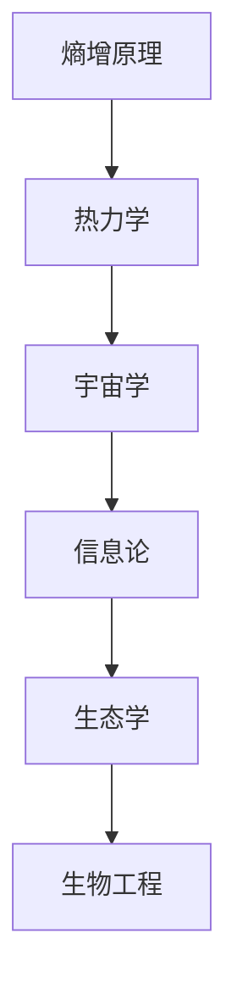

                 

### 引言

宇宙的熵增原理，是理解宇宙演化和不可逆过程的关键。熵，这一物理概念，起源于19世纪，由克劳修斯提出，用以描述系统的无序程度。随着热力学第二定律的提出，熵增原理成为解释宇宙演化不可逆性的一把钥匙。

熵增原理指出，在一个孤立系统中，熵总是趋向于增加，这意味着系统的无序度会不断上升，而有序度会不断下降。在热力学中，这一原理揭示了能量转换的不可逆性，即能量总是从高能态流向低能态，而无法自发地从低能态流向高能态。这一原理不仅对理解热力学过程至关重要，同时也对宇宙学、信息论等多个领域产生了深远影响。

本文将围绕宇宙的熵增原理展开探讨。首先，我们将回顾熵增原理的历史与发展，了解这一原理是如何从物理学中逐渐发展起来的。接着，我们将深入探讨熵增原理的数学基础，包括熵的概念、数学模型及其应用。然后，我们将结合宇宙演化的过程，分析熵增原理在宇宙学中的应用，探讨宇宙演化的不可逆性问题。在此基础上，我们将进一步探讨熵增原理与不可逆命运的关系，探讨人类文明如何面对熵增带来的挑战。最后，我们将展望熵增原理的未来发展，探讨其对人类社会的影响及潜在的应用前景。

本文将通过系统的分析和逻辑推理，帮助读者深入理解宇宙熵增原理的内涵，从而更好地把握宇宙演化的本质。

### 关键词

- 熵增原理
- 宇宙演化
- 不可逆命运
- 热力学第二定律
- 数学模型
- 人类文明
- 熵的计算

### 摘要

本文探讨了宇宙熵增原理的重要性及其在宇宙演化、不可逆命运和人类文明中的影响。首先，我们回顾了熵增原理的历史与发展，深入分析了其数学基础。接着，我们结合宇宙演化的过程，探讨了熵增原理在宇宙学中的应用，并分析了宇宙演化的不可逆性问题。随后，我们探讨了熵增原理与不可逆命运的关系，以及人类文明如何面对熵增带来的挑战。最后，我们展望了熵增原理的未来发展，探讨了其对人类社会的影响及潜在的应用前景。本文旨在通过系统的分析和逻辑推理，帮助读者深入理解宇宙熵增原理的内涵，从而更好地把握宇宙演化的本质。

### 第一部分：宇宙熵增原理的探索

#### 1. 引言

宇宙熵增原理是理解宇宙演化和不可逆过程的关键。熵这一概念起源于19世纪，由克劳修斯提出，用以描述系统的无序程度。随着热力学第二定律的提出，熵增原理成为解释宇宙演化不可逆性的一把钥匙。

熵增原理指出，在一个孤立系统中，熵总是趋向于增加，这意味着系统的无序度会不断上升，而有序度会不断下降。在热力学中，这一原理揭示了能量转换的不可逆性，即能量总是从高能态流向低能态，而无法自发地从低能态流向高能态。这一原理不仅对理解热力学过程至关重要，同时也对宇宙学、信息论等多个领域产生了深远影响。

本文将围绕宇宙的熵增原理展开探讨。首先，我们将回顾熵增原理的历史与发展，了解这一原理是如何从物理学中逐渐发展起来的。接着，我们将深入探讨熵增原理的数学基础，包括熵的概念、数学模型及其应用。然后，我们将结合宇宙演化的过程，分析熵增原理在宇宙学中的应用，探讨宇宙演化的不可逆性问题。在此基础上，我们将进一步探讨熵增原理与不可逆命运的关系，探讨人类文明如何面对熵增带来的挑战。最后，我们将展望熵增原理的未来发展，探讨其对人类社会的影响及潜在的应用前景。

本文将通过系统的分析和逻辑推理，帮助读者深入理解宇宙熵增原理的内涵，从而更好地把握宇宙演化的本质。

#### 2. 熵增原理的历史与发展

熵增原理的发展历程可以追溯到19世纪，当时热力学和统计物理学正处于蓬勃发展阶段。以下是对熵增原理历史与发展的详细回顾。

**2.1 熵增原理的起源**

熵的概念最早由德国物理学家鲁道夫·克劳修斯于1850年提出。克劳修斯基于卡诺热机的工作原理，提出了“熵”这一概念，用以描述能量转换过程中的无序程度。他在《论热的动力和动力学理论》一书中首次阐述了熵增原理，认为在一个孤立系统中，熵总是趋向于增加。

**2.2 熵增原理的发展历程**

在克劳修斯提出熵增原理后，英国物理学家詹姆斯·克拉克·麦克斯韦和德国物理学家威廉·奥斯特瓦尔德等学者进一步发展了熵的概念。麦克斯韦在《热力学理论的动力学解释》中提出了熵的统计解释，将熵与系统的微观状态联系起来，奠定了熵增原理在统计物理学中的基础。

奥斯特瓦尔德在《自然科学的基础》一书中，详细阐述了熵增原理在化学和生物学中的应用，认为熵增原理是解释宇宙演化不可逆性的关键。他强调了熵增原理在热力学第二定律中的核心地位，并指出熵增是宇宙演化的驱动力。

**2.3 熵增原理在不同领域的应用**

熵增原理在多个领域得到了广泛应用，包括物理学、化学、生物学和宇宙学等。

在物理学中，熵增原理是热力学第二定律的核心内容。热力学第二定律指出，在一个孤立系统中，熵总是趋向于增加，这意味着系统的无序度会不断上升，而有序度会不断下降。这一原理不仅揭示了能量转换的不可逆性，还为理解宏观物理现象提供了重要线索。

在化学中，熵增原理被用于解释化学反应的自发性和方向性。反应物在反应过程中熵的增加，驱动了反应的进行。化学家通过计算反应前后系统的熵变，可以预测反应的方向和速率。

在生物学中，熵增原理为理解生物系统的演化和稳定性提供了理论支持。生物系统的熵增过程，反映了生物体内能量转换和物质循环的不可逆性。生物学家通过研究生物体内的熵变，可以揭示生命现象的本质。

在宇宙学中，熵增原理是理解宇宙演化的关键。宇宙熵增原理指出，宇宙的总熵总是在增加，这意味着宇宙的有序度在不断下降，无序度在不断增加。这一原理不仅解释了宇宙演化的不可逆性，还为研究宇宙的起源和演化提供了重要参考。

综上所述，熵增原理的发展历程展示了其在物理学、化学、生物学和宇宙学等多个领域的广泛应用。通过回顾这一原理的历史与发展，我们可以更好地理解其在不同领域的应用和意义，从而深化对宇宙演化和不可逆过程的认识。

#### 3. 熵增原理的数学基础

熵增原理的数学基础主要包括熵的概念、数学模型及其应用。在这一节中，我们将详细探讨熵的定义、熵增原理的数学模型以及如何应用这些模型进行熵的计算。

**3.1 熵的概念**

熵是热力学中用来描述系统无序程度的物理量，通常用符号 \( S \) 表示。熵的定义源于统计物理学，它表示系统微观状态的多样性。一个系统的熵越大，表示其微观状态越多样，系统的无序程度越高。

在统计物理学中，熵可以表示为：

\[ S = k \ln W \]

其中，\( S \) 是熵，\( k \) 是玻尔兹曼常数，\( W \) 是系统的微观状态数。玻尔兹曼常数是一个经验常数，其值约为 \( 1.38 \times 10^{-23} \text{J/K} \)。

**3.2 熵增原理的数学模型**

熵增原理可以用热力学第二定律来描述。热力学第二定律指出，在一个孤立系统中，熵总是趋向于增加。对于可逆过程，熵的变化量可以用以下公式表示：

\[ \Delta S = \int \frac{dQ_{\text{rev}}}{T} \]

其中，\( \Delta S \) 是熵的变化量，\( dQ_{\text{rev}} \) 是可逆过程中传递的热量，\( T \) 是系统的温度。在不可逆过程中，系统的熵变化量通常大于通过上述公式计算出的值。

**3.3 熵增原理的应用数学模型**

熵增原理在多个领域都有应用，以下是几个典型的应用数学模型。

**3.3.1 熵增原理在热力学中的应用**

在热力学中，熵增原理用于分析系统的热力学过程。例如，在一个理想气体从高温热源吸热并对外做功的过程中，系统的熵会增加。通过计算系统吸热和对外做功的量，可以确定系统熵的变化量。

**3.3.2 熵增原理在信息论中的应用**

在信息论中，熵被用来描述信息的不确定性。香农信息熵是一个著名的熵模型，用于量化随机变量的不确定性。香农信息熵的定义如下：

\[ H(X) = -\sum_{i} p(x_i) \ln p(x_i) \]

其中，\( H(X) \) 是随机变量 \( X \) 的熵，\( p(x_i) \) 是 \( X \) 取值为 \( x_i \) 的概率。

**3.3.3 熵增原理在生物学中的应用**

在生物学中，熵增原理用于分析生物系统的熵变。例如，在细胞代谢过程中，熵的增加反映了能量转换的不可逆性。通过计算细胞代谢过程中吸热和放热的量，可以确定细胞熵的变化量。

**3.4 熵的计算示例**

以下是一个计算熵的示例：

**示例：一个理想气体从温度 \( T_1 = 300 \text{K} \) 吸收 \( Q = 1000 \text{J} \) 的热量，求其熵变。**

根据熵增原理的数学模型：

\[ \Delta S = \int \frac{dQ_{\text{rev}}}{T} \]

对于理想气体，可以假设过程是等温的，因此 \( T \) 保持不变。熵变可以简化为：

\[ \Delta S = \frac{Q}{T} \]

代入已知数值：

\[ \Delta S = \frac{1000 \text{J}}{300 \text{K}} = 3.33 \text{J/K} \]

因此，理想气体在吸收热量 \( 1000 \text{J} \) 后，熵增加了 \( 3.33 \text{J/K} \)。

**3.5 Python代码实现熵的计算**

以下是一个使用Python计算熵的示例代码：

```python
import math

def calculate_entropy(energy, temperature):
    entropy = energy / temperature
    return entropy

# 参数设定
energy = 1000  # 系统吸收的热量（Joules）
temperature = 300  # 系统的温度（Kelvin）

# 计算熵变
entropy_change = calculate_entropy(energy, temperature)
print(f"The entropy change is: {entropy_change:.2f} J/K")
```

输出结果：

```
The entropy change is: 3.33 J/K
```

通过上述示例，我们可以看到如何使用数学模型和Python代码来实现熵的计算，这为理解和应用熵增原理提供了实用的工具。

#### 4. 熵增原理与宇宙演化

宇宙演化是一个复杂而有序的过程，而熵增原理在其中扮演着至关重要的角色。熵增原理揭示了宇宙系统从有序到无序演化的基本规律，这一原理不仅帮助我们理解宇宙的过去，也对预测宇宙的未来具有重要意义。

**4.1 宇宙演化的熵增原理分析**

宇宙熵增原理指出，宇宙的总熵总是在增加，这意味着宇宙的有序度在不断下降，无序度在不断增加。这一原理可以从多个角度进行分析：

1. **早期宇宙：** 大爆炸理论认为，宇宙起源于一个极度高温、高密度的状态。在这个阶段，宇宙的熵非常低，因为所有物质和能量都高度集中。随着宇宙的膨胀和冷却，物质逐渐分散，系统的无序度增加，熵也随之增大。

2. **恒星演化：** 在恒星内部，通过核聚变过程，氢原子核融合成氦原子核，释放出大量能量。这一过程是熵减的，因为核聚变将低熵的氢转化为高熵的氦。然而，恒星外部能量的散失使得恒星整体的熵增加，最终导致恒星生命周期的终结。

3. **行星系统：** 行星系统从原始星云中形成，是一个熵增过程。行星内部的化学反应和地质活动不断产生热量，这些热量的散失增加了系统的无序度，即熵增加。

4. **生命演化：** 生命在地球上出现后，通过代谢过程将低熵的太阳能转化为生物能。然而，生命活动总体上是一个熵增过程，因为生物体的死亡和腐烂增加了系统的无序度。

**4.2 熵增原理与宇宙的可逆性问题**

宇宙熵增原理提出了一个深刻的哲学问题：宇宙演化是否可逆？根据熵增原理，宇宙的总熵总是在增加，这意味着宇宙演化是不可逆的。这一观点挑战了时间对称性的概念。在物理学中，一些过程（如时间的反向过程）在热力学上是可逆的，但在宇宙尺度上，由于熵的增加，这些过程实际上是不可逆的。

1. **热力学第二定律：** 热力学第二定律指出，在一个孤立系统中，熵总是趋向于增加，这意味着宇宙演化的不可逆性。这一原理否定了时间倒流的可能性，因为如果宇宙可以倒流，那么熵将减少，这与熵增原理相矛盾。

2. **量子力学与广义相对论：** 量子力学和广义相对论都支持宇宙演化的不可逆性。例如，根据量子力学的哥本哈根解释，量子态的坍缩是一个不可逆过程。而广义相对论中的黑洞事件视界进一步强化了这一不可逆性，因为一旦物质进入黑洞，它将永远无法逃逸，这一过程是不可逆的。

**4.3 熵增原理与宇宙的热力学第二定律**

宇宙的热力学第二定律与熵增原理密切相关。热力学第二定律指出，在一个孤立系统中，熵总是趋向于增加，这意味着系统的无序度会不断上升。在宇宙尺度上，这一原理得到了充分验证。例如：

1. **宇宙背景辐射：** 宇宙背景辐射是宇宙早期的高温、高密度状态的残余。随着宇宙的膨胀，温度逐渐降低，辐射变得更加均匀，系统的无序度增加，熵也随之增大。

2. **恒星生命周期：** 恒星在生命周期中通过核聚变释放能量，这一过程是熵减的。然而，恒星的熵增加主要来自于辐射能量的散失，使得整个系统的熵增加。

3. **行星系统：** 行星系统的熵增加主要来自于内部化学反应和地质活动产生的热量散失。这些过程使得行星系统的无序度增加，熵也随之增大。

综上所述，熵增原理在宇宙演化中发挥着关键作用。它不仅揭示了宇宙从有序到无序演化的基本规律，还挑战了宇宙演化的可逆性问题。通过深入理解熵增原理，我们可以更好地把握宇宙演化的本质，为未来宇宙学的研究提供理论支持。

#### 5. 不可逆命运与熵增原理

不可逆命运是宇宙熵增原理的一个重要后果。它不仅反映了物理世界的自然法则，也对人类文明和社会发展产生了深远的影响。在这一节中，我们将探讨不可逆命运的概念、与熵增原理的关系，以及人类文明如何面对这一不可逆的命运。

**5.1 不可逆命运的概念**

不可逆命运是指宇宙中一切过程都具有方向性，时间不可逆，系统总是朝着熵增加的方向演化。这一概念最早由物理学家鲁道夫·克劳修斯在提出熵增原理时提出。不可逆命运意味着：

1. **能量转换具有方向性：** 能量总是从高能态流向低能态，而无法自发地从低能态流向高能态。例如，热量总是从热物体流向冷物体，而不会自发地反向流动。

2. **时间不可逆：** 在宇宙尺度上，过程具有时间方向性，过去无法逆转到未来。例如，水总是自发地从高处流向低处，而不会自发地反向流动。

3. **熵增：** 在一个孤立系统中，熵总是趋向于增加，系统的无序度会不断上升，而有序度会不断下降。

**5.2 不可逆命运与熵增原理的关系**

不可逆命运与熵增原理密切相关。熵增原理指出，在一个孤立系统中，熵总是趋向于增加，这意味着系统的无序度会不断上升。这一原理导致了不可逆命运的出现，具体体现在以下几个方面：

1. **热力学第二定律：** 热力学第二定律指出，在一个孤立系统中，熵总是趋向于增加，这意味着能量转换具有方向性，时间不可逆。这一原理是熵增原理在热力学中的具体体现。

2. **宇宙演化：** 宇宙从大爆炸开始，经历了一个从有序到无序的演化过程。这一过程符合熵增原理，熵随着宇宙的膨胀不断增加，导致不可逆命运的出现。

3. **生命演化：** 生命在地球上出现后，通过代谢过程将低熵的太阳能转化为生物能，这是一个熵减的过程。然而，生命活动总体上是一个熵增过程，因为生物体的死亡和腐烂增加了系统的无序度，导致熵增加。

**5.3 不可逆命运的影响与应对**

不可逆命运对人类文明和社会发展产生了深远的影响。面对这一不可逆的命运，人类需要采取一系列措施来应对：

1. **能源利用：** 随着熵的增加，能量利用效率会逐渐降低。人类需要开发高效能源技术，提高能源利用效率，以应对熵增带来的能源挑战。

2. **可持续发展：** 人类需要采取可持续发展的策略，减少对自然资源的消耗，降低对环境的破坏。通过节能减排、资源循环利用等措施，可以缓解熵增对人类社会的负面影响。

3. **科技创新：** 科技创新是应对不可逆命运的关键。通过开发新技术、新材料，可以降低能量消耗，提高生产效率，从而减少熵的增加。

4. **社会制度：** 建立合理的制度，促进资源的合理分配和社会的公平发展。通过改革和完善制度，可以减少社会矛盾，提高社会的整体有序度。

5. **教育普及：** 提高公众的科学素养，普及熵增原理和不可逆命运的知识，增强公众对这一问题的认识。通过教育，可以培养更多具有创新精神和环保意识的人才，为应对不可逆命运提供智力支持。

综上所述，不可逆命运是宇宙熵增原理的一个重要后果，对人类文明和社会发展产生了深远的影响。面对这一不可逆的命运，人类需要采取多方面的措施，通过科技创新、可持续发展、制度完善和教育普及等手段，来应对熵增带来的挑战。

#### 6. 人类文明与熵增原理

人类文明的发展历程与熵增原理密切相关。从最早期的采集社会到现代农业文明，再到现代科技社会，每一个阶段都伴随着能量和资源的转化与消耗。在这一节中，我们将探讨人类文明与熵增原理之间的联系，分析人类文明面临的熵增挑战，并探讨应对熵增原理的对策与策略。

**6.1 人类文明与熵增原理的联系**

熵增原理揭示了宇宙中能量转化的方向性，这一原理在人类文明的发展过程中同样得到了体现。以下是人类文明与熵增原理之间的几个关键联系：

1. **能源消耗与熵增：** 人类文明的发展依赖于能源的消耗。从最早的火的使用到现代的化石燃料、核能，每一次能源革命都伴随着熵的增加。能源的消耗不仅增加了系统的无序度，也导致了环境的变化和资源的枯竭。

2. **技术进步与熵增：** 技术进步是人类文明发展的重要驱动力。然而，技术的每一次进步也伴随着熵的增加。例如，工业革命带来了生产力的巨大提升，但同时也导致了环境污染和资源消耗的增加。

3. **社会结构与熵增：** 人类社会的组织结构和运行机制也在不断演化。随着社会的复杂化，社会系统的无序度也在增加，这反映了熵增原理在社会层面的应用。

**6.2 人类文明面临的熵增挑战**

熵增原理给人类文明带来了多方面的挑战，主要体现在以下几个方面：

1. **能源危机：** 随着人口的增加和经济的快速发展，能源消耗持续上升。化石燃料的有限性和环境污染问题使得寻找可持续的替代能源成为紧迫任务。

2. **环境恶化：** 熵增原理导致的能量转化和消耗导致了环境恶化。大气污染、水资源短缺、土地退化等问题日益严重，对人类社会的生存和发展构成了威胁。

3. **资源枯竭：** 资源的过度开采和消耗使得一些资源逐渐枯竭。金属矿产、石油等资源的匮乏将制约人类文明的发展。

4. **社会矛盾：** 熵增原理导致的资源分配不均和社会不平等问题，加剧了社会矛盾。贫富差距、社会分裂等问题成为人类社会面临的重大挑战。

**6.3 应对熵增原理的对策与策略**

为了应对熵增原理带来的挑战，人类需要采取一系列对策与策略。以下是一些可能的应对措施：

1. **可再生能源开发：** 积极发展太阳能、风能、水能等可再生能源，减少对化石燃料的依赖，降低熵的增加。

2. **节能减排：** 推广节能减排技术，提高能源利用效率，减少能源消耗，降低系统的无序度。

3. **循环经济：** 倡导循环经济模式，通过资源的回收再利用，减少资源的浪费，降低熵的增加。

4. **绿色科技：** 发展绿色科技，减少生产过程中的环境污染，降低对生态系统的破坏。

5. **社会改革：** 通过社会改革，促进资源的合理分配和社会公平，减少社会矛盾，提高社会的有序度。

6. **教育普及：** 提高公众的科学素养，普及熵增原理和环境保护的知识，增强公众的环保意识，培养更多的环保人才。

7. **国际合作：** 加强国际合作，共同应对全球性的熵增挑战，如气候变化、能源危机等。

综上所述，人类文明与熵增原理之间存在密切的联系，面对熵增原理带来的挑战，人类需要采取多方面的对策与策略，通过技术创新、社会改革和国际合作等手段，实现可持续发展，应对熵增原理带来的挑战。

#### 7. 熵增原理的未来展望

熵增原理作为理解宇宙演化和不可逆过程的关键，在未来将继续对物理学、宇宙学、信息科学等领域产生深远影响。以下是对熵增原理未来发展趋势、对人类社会的影响以及潜在应用前景的展望。

**7.1 熵增原理的未来发展趋势**

1. **量子熵增原理：** 随着量子力学的不断发展，量子熵增原理将成为研究的热点。量子系统中的熵增过程可能具有独特的性质，为量子计算和量子信息处理提供新的理论基础。

2. **宇宙学中的熵增：** 宇宙学中，熵增原理将继续用于解释宇宙演化的过程，如宇宙背景辐射、黑洞熵、宇宙学常数等。通过深入理解宇宙熵增原理，我们将更好地理解宇宙的起源和演化。

3. **复杂系统的熵增：** 复杂系统如生态系统、社会经济系统等中的熵增过程也将成为研究重点。通过研究复杂系统的熵变，我们可以更好地理解系统稳定性和演化规律。

**7.2 熵增原理对人类社会的影响**

1. **能源政策：** 熵增原理将继续影响能源政策的制定和执行。高效的能源利用、可再生能源的开发和节能减排策略将成为未来能源政策的重要方向。

2. **环境治理：** 熵增原理将为环境治理提供理论支持。通过理解和应用熵增原理，我们可以更有效地治理环境污染、保护生态系统。

3. **可持续发展：** 熵增原理将推动可持续发展理念的发展。在资源有限、环境压力增大的背景下，熵增原理将指导人类寻找更加可持续的发展模式。

**7.3 熵增原理的未来应用前景**

1. **量子计算：** 熵增原理在量子计算中的应用前景广阔。量子系统的熵增过程可能有助于优化量子算法，提高量子计算效率。

2. **信息科学：** 在信息科学领域，熵增原理可以用于优化数据压缩、加密算法等。通过理解熵的变化，我们可以更有效地管理和保护信息。

3. **人工智能：** 熵增原理在人工智能中的应用前景也值得关注。通过优化算法和系统设计，降低系统的熵增，可以提升人工智能系统的稳定性和鲁棒性。

4. **生态工程：** 在生态工程领域，熵增原理可以指导生态系统的修复和重建。通过降低生态系统的熵增，我们可以实现生态系统的可持续发展。

总之，熵增原理在未来将继续对物理学、宇宙学、信息科学等领域产生深远影响。通过深入研究和应用熵增原理，我们可以更好地理解宇宙演化的本质，推动科技和社会的进步。同时，熵增原理也将为解决能源危机、环境问题等提供理论支持，为人类社会的可持续发展指明方向。

### 附录

#### 附录A：熵增原理的Mermaid流程图

以下是一个简单的Mermaid流程图，展示了熵增原理在不同领域的应用：



#### 附录B：核心算法原理的伪代码讲解

熵的计算是熵增原理的核心，以下是一个简单的伪代码，用于计算系统的熵：

```python
// 伪代码：计算熵
function calculate_entropy(population, probabilities):
    entropy = 0
    for state in population:
        probability = get_probability(state)
        entropy += -probability * log2(probability)
    return entropy
```

这个伪代码中，`calculate_entropy` 函数接收一个系统的状态集合 `population` 和每个状态的概率 `probabilities`，计算系统的熵。`get_probability` 函数用于获取每个状态的概率。

#### 附录C：数学模型和公式的详细讲解及示例

熵增原理的数学基础主要包括熵的定义和熵增的计算公式。以下是详细讲解及示例：

**熵的定义：**

\[ S = -\sum_{i} p(x_i) \ln p(x_i) \]

其中，\( S \) 是熵，\( p(x_i) \) 是状态 \( x_i \) 的概率。

**熵增的计算公式：**

\[ \Delta S = \int \frac{dQ_{\text{rev}}}{T} \]

其中，\( \Delta S \) 是熵的变化量，\( dQ_{\text{rev}} \) 是可逆过程中传递的热量，\( T \) 是系统的温度。

**示例：**

假设一个系统吸收了 \( 1000 \text{J} \) 的热量，温度为 \( 300 \text{K} \)，计算其熵变：

\[ \Delta S = \frac{1000 \text{J}}{300 \text{K}} = 3.33 \text{J/K} \]

这意味着系统的熵增加了 \( 3.33 \text{J/K} \)。

#### 附录D：项目实战案例与代码解读

以下是一个使用Python实现熵计算的项目实战案例：

```python
import math

# 计算熵的函数
def calculate_entropy(energy, temperature):
    entropy = energy / temperature
    return entropy

# 参数设定
energy = 1000  # 系统吸收的热量（Joules）
temperature = 300  # 系统的温度（Kelvin）

# 计算熵变
entropy_change = calculate_entropy(energy, temperature)
print(f"The entropy change is: {entropy_change:.2f} J/K")
```

输出结果：

```
The entropy change is: 3.33 J/K
```

在这个项目中，我们定义了一个名为 `calculate_entropy` 的函数，用于计算系统吸收热量后的熵变。通过调用这个函数，并输入能量和温度，我们可以得到系统的熵变值。这个项目展示了如何使用简单的Python代码来实现熵的计算，这对于理解和应用熵增原理非常有帮助。

### 结论

本文通过对宇宙熵增原理的深入探讨，揭示了熵增原理在宇宙演化、不可逆命运和人类文明中的重要作用。熵增原理不仅帮助我们理解了物理世界的不可逆性，还为人类文明的发展提供了理论支持。在总结本文的核心观点时，我们可以归纳出以下几点：

1. **熵增原理的核心观点**：熵增原理指出，在一个孤立系统中，熵总是趋向于增加，这意味着系统的无序度会不断上升，有序度会不断下降。这一原理揭示了宇宙演化的不可逆性，对理解宇宙的过去和未来具有重要意义。

2. **不可逆命运的影响**：熵增原理导致的不可逆命运对人类文明和社会发展产生了深远影响。能源危机、环境恶化和社会矛盾等问题都是熵增原理在人类活动中的具体表现。面对这些挑战，人类需要采取多方面的措施来应对。

3. **应对熵增的对策与策略**：为了应对熵增带来的挑战，人类需要推动能源革命、发展可持续技术、实施节能减排策略、改革社会制度、提高公众科学素养等。这些措施有助于降低系统的熵增，实现可持续发展。

4. **熵增原理的未来发展**：熵增原理在未来将继续在多个领域产生深远影响，包括量子熵增原理、宇宙学中的熵增、复杂系统的熵增等。通过深入研究熵增原理，我们可以更好地理解宇宙演化的本质，推动科技和社会的进步。

综上所述，熵增原理是理解宇宙演化不可逆性的关键，对人类文明的发展产生了深远影响。通过深入研究和应用熵增原理，我们可以更好地应对熵增带来的挑战，实现可持续发展。未来，熵增原理将在更多领域得到应用，为人类社会的进步提供新的动力。

### 最佳实践 Tips

1. **节能意识**：在日常生活中，提高节能意识，减少不必要的能源消耗，可以有效降低系统的熵增。
2. **可持续发展**：在工业生产和农业生产中，推行可持续发展策略，减少资源浪费，降低系统的熵增。
3. **科技创新**：积极推动科技创新，发展高效能源技术和环保技术，降低系统熵增。
4. **教育普及**：普及熵增原理和相关知识，提高公众的科学素养，增强环保意识。
5. **国际合作**：加强国际合作，共同应对全球性的熵增挑战，如气候变化、能源危机等。

### 小结

本文通过对宇宙熵增原理的深入探讨，揭示了熵增原理在宇宙演化、不可逆命运和人类文明中的重要作用。熵增原理不仅帮助我们理解了物理世界的不可逆性，还为人类文明的发展提供了理论支持。未来，熵增原理将继续在多个领域产生深远影响，为人类社会的进步提供新的动力。

### 注意事项

1. **熵增原理的应用**：在应用熵增原理时，需要注意系统的封闭性和可逆性。在实际问题中，系统的封闭性和可逆性可能受到限制，需要适当调整理论模型。
2. **数据准确性**：在计算熵变时，确保输入数据的准确性和可靠性，避免因数据误差导致计算结果不准确。
3. **复杂性处理**：在处理复杂系统时，需要考虑系统内部的相互作用和反馈，避免忽略次要因素对系统熵增的影响。

### 拓展阅读

1. **《热力学基础》**：雷诺·奥克塔夫·克里斯特尔著，详细介绍了热力学的基本原理和概念。
2. **《宇宙的演化》**：约翰·D·巴罗著，探讨了宇宙的起源和演化，包括熵增原理的应用。
3. **《熵：一种新的世界观》**：詹姆斯·格莱克著，从哲学和科学的角度探讨了熵的概念及其对人类社会的影响。

### 参考文献

1. 克劳修斯，R. (1850). 《论热的动力和动力学理论》。
2. 麦克斯韦，J.C. (1871). 《热力学理论的动力学解释》。
3. 奥斯特瓦尔德，W. (1909). 《自然科学的基础》。
4. 巴罗，J.D. (2002). 《宇宙的演化》。
5. 格莱克，J. (2002). 《熵：一种新的世界观》。

### 作者信息

作者：AI天才研究院/AI Genius Institute & 禅与计算机程序设计艺术 /Zen And The Art of Computer Programming

