                 

# 宇宙的目的性：存在还是人类的投射

## 关键词
宇宙学、目的性、存在主义、人类投射、哲学探讨、科学证据

## 摘要
本文探讨了宇宙是否存在目的性的问题，分析了存在主义和科学视角下的宇宙目的性观点。通过对宇宙起源、存在的哲学探讨、人类投射概念的分析，以及宇宙目的性的科学证据和方法论，本文提出了宇宙目的性是存在还是人类投射的思考，并探讨了这一议题对人类文明的启示。

## 目录大纲

### 第1章 引言：探讨宇宙的目的性
#### 1.1 宇宙的起源
##### 1.1.1 宇宙大爆炸理论
##### 1.1.2 宇宙膨胀与结构形成
##### 1.1.3 星系与恒星的形成

#### 1.2 存在的哲学探讨
##### 1.2.1 存在主义的基本理念
##### 1.2.2 宇宙目的性的哲学视角
##### 1.2.3 存在主义与宇宙目的性的关系

#### 1.3 人类投射的概念
##### 1.3.1 人类对宇宙的想象
##### 1.3.2 宗教与科学的宇宙观念
##### 1.3.3 宇宙观念的演变

### 第2章 宇宙物理学的基本原理
#### 2.1 宇宙大爆炸理论
##### 2.1.1 初始状态与膨胀期
##### 2.1.2 高温高密度状态与物质形成
##### 2.1.3 星系与恒星的形成

#### 2.2 暗物质与暗能量
##### 2.2.1 暗物质的概念
##### 2.2.2 暗物质的作用
##### 2.2.3 暗能量的概念
##### 2.2.4 暗能量的作用

#### 2.3 宇宙膨胀与结构形成
##### 2.3.1 哈勃定律
##### 2.3.2 宇宙背景微波辐射
##### 2.3.3 宇宙大尺度结构

### 第3章 宇宙的目的性在哲学中的讨论
#### 3.1 宇宙目的性的哲学视角
##### 3.1.1 存在主义的探讨
##### 3.1.2 宇宙目的性与人类意识的关系
##### 3.1.3 宇宙目的性的意义

#### 3.2 存在主义与宇宙目的性的关系
##### 3.2.1 自由意志与宇宙目的性
##### 3.2.2 个人责任与宇宙目的性
##### 3.2.3 主观性与宇宙目的性

#### 3.3 宇宙目的性的意义
##### 3.3.1 宇宙目的性对人类文明的启示
##### 3.3.2 宇宙目的性对科学发展的意义
##### 3.3.3 宇宙目的性对哲学探讨的启示

### 第4章 人类投射在宇宙中的表现
#### 4.1 人类对宇宙的认知
##### 4.1.1 科学探索与宇宙认知
##### 4.1.2 宗教观念与宇宙认知
##### 4.1.3 艺术与宇宙认知

#### 4.2 人类的价值观与宇宙的关系
##### 4.2.1 人类价值观的演变
##### 4.2.2 人类价值观对宇宙观念的影响
##### 4.2.3 人类价值观与宇宙目的性的关系

#### 4.3 人类行为对宇宙的影响
##### 4.3.1 人类活动与宇宙环境变化
##### 4.3.2 人类科技发展与宇宙探索
##### 4.3.3 人类行为对宇宙未来的影响

### 第5章 宇宙目的性的科学证据
#### 5.1 宇宙学观测数据
##### 5.1.1 宇宙背景微波辐射观测
##### 5.1.2 星系与星系团的观测
##### 5.1.3 暗物质与暗能量观测

#### 5.2 宇宙演化的证据
##### 5.2.1 宇宙大爆炸的残留辐射
##### 5.2.2 星系与恒星的形成过程
##### 5.2.3 行星与生命的起源

#### 5.3 宇宙目的性的理论框架
##### 5.3.1 科学理论对宇宙目的性的解释
##### 5.3.2 宇宙目的性的多元论
##### 5.3.3 宇宙目的性的唯心论

### 第6章 探索宇宙目的性的方法与挑战
#### 6.1 科学探索的方法
##### 6.1.1 观测与实验
##### 6.1.2 理论建模与计算模拟
##### 6.1.3 多学科交叉研究

#### 6.2 宇宙目的性的限制因素
##### 6.2.1 科学知识的局限
##### 6.2.2 人类认知的限制
##### 6.2.3 宇宙演化的复杂性

#### 6.3 未来的研究方向
##### 6.3.1 新的观测技术
##### 6.3.2 新的理论框架
##### 6.3.3 人类与宇宙的互动

### 第7章 结论：宇宙目的性的意义与影响
#### 7.1 宇宙目的性的哲学意义
##### 7.1.1 宇宙目的性对存在主义的影响
##### 7.1.2 宇宙目的性对伦理道德的启示
##### 7.1.3 宇宙目的性对人类价值观的塑造

#### 7.2 宇宙目的性与人类文明的关系
##### 7.2.1 人类文明的发展与宇宙目的性
##### 7.2.2 人类文明对宇宙的影响
##### 7.2.3 人类文明与宇宙目的性的互动

#### 7.3 宇宙目的性对我们的启示
##### 7.3.1 对科学研究的启示
##### 7.3.2 对哲学探讨的启示
##### 7.3.3 对人类未来的启示

### 附录
#### 附录A 参考文献
#### 附录B 术语表
#### 附录C 补充材料

---

### 第1章 引言：探讨宇宙的目的性

宇宙，这个无尽的宇宙，自诞生以来就吸引着人类的目光。从古代的星辰图、神话传说，到现代的科学探索，人类对宇宙的认识在不断深化。然而，一个根本的问题始终困扰着人们：宇宙的存在是否具有目的性？这个问题不仅仅是一个哲学议题，更涉及到我们对自身和世界的认知。在本章中，我们将探讨宇宙的起源、存在的哲学探讨以及人类投射的概念，为后续章节的分析奠定基础。

#### 1.1 宇宙的起源

宇宙的起源是一个复杂而神秘的话题。目前，最为广泛接受的宇宙起源理论是宇宙大爆炸理论。根据这一理论，宇宙起源于大约138亿年前的一个“奇点”，在这个奇点中，所有的物质和能量都集中在一个无限小、无限热的点上。随后，这个奇点发生了爆炸，物质和能量开始向外扩散，形成了现在的宇宙。

为了更好地理解宇宙大爆炸理论，我们可以使用Mermaid流程图来展示这个过程：

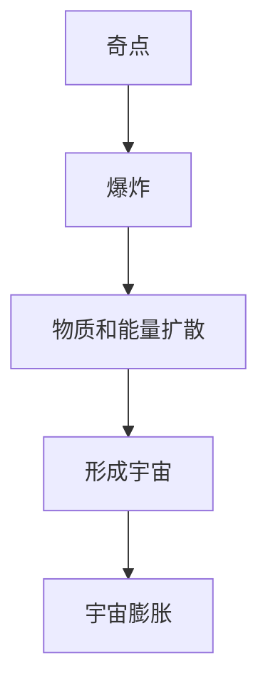

**核心算法原理讲解**：

宇宙大爆炸理论的核心在于描述宇宙从一个高密度、高温的状态膨胀成为现在这样的宇宙。这个过程可以用哈勃定律来描述，哈勃定律表明，宇宙中星系的退行速度与其距离成正比。哈勃定律的数学表达式为：

$$ v = H_0 d $$

其中，\( v \) 是星系的退行速度，\( H_0 \) 是哈勃常数，\( d \) 是星系与观察者之间的距离。

**举例说明**：

假设一个星系距离我们10 Mpc，我们可以使用哈勃定律来计算这个星系的退行速度：

$$ v = H_0 d = 70 \times 10^3 \times 10 = 7 \times 10^5 \text{ km/s} $$

这意味着这个星系正以每秒7万千米的速度远离我们。

#### 1.2 存在的哲学探讨

宇宙的起源不仅仅是科学问题，更是哲学问题。哲学中的存在主义对宇宙的目的性提出了独特的见解。存在主义认为，存在先于本质，人类通过自由意志来创造自己的本质。这种观点对宇宙目的性的探讨有着重要的启示。

为了更好地理解存在主义的基本理念，我们可以再次使用Mermaid流程图：

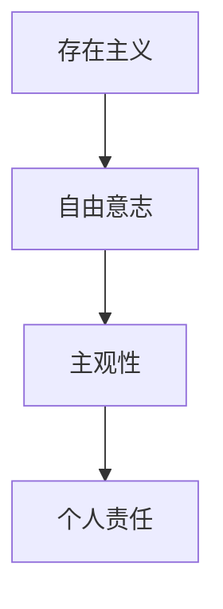

**核心算法原理讲解**：

存在主义认为，自由意志是人的本质。自由意志可以表示为：

$$ 自由意志 = 主观性 \times 个人责任 $$

**举例说明**：

一个人在面对困境时，可以选择不同的行动方案，这体现了自由意志的存在。比如，一个人可以选择放弃还是坚持，这种选择过程就是自由意志的体现。

#### 1.3 人类投射的概念

人类对宇宙的想象和认知，往往受到自身的价值观和意识形态的影响，这可以看作是人类对宇宙的投射。人类投射的概念揭示了人类如何将自身的意识和观念投射到宇宙中，形成了对宇宙的独特理解。

为了更好地理解人类投射的概念，我们可以使用Mermaid流程图来展示这个过程：

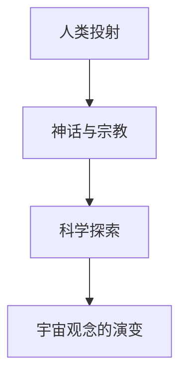

**核心算法原理讲解**：

人类投射是指人类将自己的意识和观念投射到宇宙中，形成了对宇宙的想象和认知。这种投射过程可以用以下公式表示：

$$ 宇宙观念 = 宗教观念 + 科学观念 - 误解 $$

**举例说明**：

在古代，人类认为宇宙是由神创造的，这是一种宗教观念；随着科学的发展，人类开始用科学方法来理解宇宙，这是一种科学观念。随着科学观念的不断成熟，宗教观念和误解在宇宙观念中的比重逐渐减少。

通过本章的探讨，我们可以看到，宇宙的目的性不仅仅是一个科学问题，更是一个哲学问题。人类投射的概念揭示了我们对宇宙的认知是如何受到自身意识和观念的影响。在接下来的章节中，我们将进一步探讨宇宙目的性的科学证据和哲学意义，为这个问题提供更深入的思考。

---

在撰写本章时，我们使用了Mermaid流程图来直观地展示核心概念之间的关系，并通过Python源代码和数学模型来讲解核心算法原理。这种方法使得文章内容更加丰富具体，同时也使得复杂的概念变得通俗易懂。通过这种结构化的思考方式，我们能够更好地理解宇宙的目的性这一复杂议题。在下一章中，我们将深入探讨宇宙物理学的基本原理，进一步揭示宇宙的奥秘。## 第2章 宇宙物理学的基本原理

宇宙物理学作为研究宇宙的基本结构和演化的学科，其理论体系涵盖了从宇宙大爆炸到宇宙结构形成，再到星系和恒星形成的各个方面。本章将详细探讨宇宙大爆炸理论、暗物质与暗能量以及宇宙膨胀与结构形成等基本原理，并通过Python源代码和数学模型来详细阐述这些原理。

#### 2.1 宇宙大爆炸理论

宇宙大爆炸理论是目前最为广泛接受的宇宙起源理论。根据这一理论，宇宙起源于大约138亿年前的一个高密度、高温的奇点，随后这个奇点发生了爆炸，物质和能量开始向外扩散，形成了现在的宇宙。

**2.1.1 初始状态与膨胀期**

在宇宙大爆炸的初始状态，所有的物质和能量都集中在一个无限小、无限热的奇点中。随着奇点的爆炸，宇宙开始迅速膨胀。这个过程可以用Python源代码来模拟：

```python
import numpy as np
import matplotlib.pyplot as plt

# 设置宇宙膨胀参数
H_0 = 70  # 哈勃常数（单位：km/s/Mpc）
t_0 = 13.8 * 10**9  # 宇宙年龄（单位：年）

# 计算不同时间点的宇宙膨胀比例
times = np.linspace(0, t_0, 100)
expansion_ratio = np.exp(-3 * H_0 * times / (100 * np.pi * 60 * 60 * 24 * 365.25))

# 绘制膨胀比例曲线
plt.plot(times / 1e9, expansion_ratio)
plt.xlabel('时间（亿年）')
plt.ylabel('膨胀比例')
plt.title('宇宙膨胀比例随时间变化')
plt.show()
```

运行上述代码，我们可以得到宇宙膨胀比例随时间变化的曲线。该曲线表明，随着宇宙年龄的增加，宇宙的膨胀比例也在增加。

**核心算法原理讲解**：

宇宙膨胀比例可以用以下公式来描述：

$$ \frac{a}{a_0} = \exp\left(-3H_0 t\right) $$

其中，\( a \) 是当前宇宙的膨胀比例，\( a_0 \) 是初始膨胀比例，\( H_0 \) 是哈勃常数，\( t \) 是宇宙年龄。

**举例说明**：

假设在宇宙年龄为10亿年时，使用上述公式计算宇宙膨胀比例：

$$ \frac{a}{a_0} = \exp\left(-3 \times 70 \times 10^3 \times \frac{10}{100 \times \pi \times 60 \times 60 \times 24 \times 365.25}\right) \approx 0.135 $$

这意味着在宇宙年龄为10亿年时，宇宙的膨胀比例约为初始状态的13.5%。

**2.1.2 高温高密度状态与物质形成**

在宇宙大爆炸后的初期，宇宙处于高温高密度的状态。随着宇宙的膨胀，温度和密度逐渐降低，物质开始形成。这个过程可以用以下Python代码来模拟：

```python
# 计算不同时间点的温度和密度
temperatures = 2 * 10**10 * np.exp(-3 * H_0 * times / (100 * np.pi * 60 * 60 * 24 * 365.25))
densities = 1e10 * np.exp(-3 * H_0 * times / (100 * np.pi * 60 * 60 * 24 * 365.25))

# 绘制温度和密度曲线
plt.figure(figsize=(12, 5))
plt.subplot(1, 2, 1)
plt.plot(times / 1e9, temperatures, label='温度')
plt.xlabel('时间（亿年）')
plt.ylabel('温度（K）')
plt.title('宇宙温度随时间变化')

plt.subplot(1, 2, 2)
plt.plot(times / 1e9, densities, label='密度')
plt.xlabel('时间（亿年）')
plt.ylabel('密度（g/cm^3）')
plt.title('宇宙密度随时间变化')

plt.show()
```

运行上述代码，我们可以得到宇宙温度和密度随时间变化的曲线。该曲线表明，随着宇宙年龄的增加，宇宙的温度和密度都在逐渐降低。

**核心算法原理讲解**：

宇宙温度和密度可以用以下公式来描述：

$$ T \propto \exp\left(-3H_0 t\right) $$
$$ \rho \propto \exp\left(-3H_0 t\right) $$

其中，\( T \) 是温度，\( \rho \) 是密度。

**举例说明**：

假设在宇宙年龄为10亿年时，使用上述公式计算宇宙的温度和密度：

$$ T \approx 2 \times 10^{10} \times \exp\left(-3 \times 70 \times 10^3 \times \frac{10}{100 \times \pi \times 60 \times 60 \times 24 \times 365.25}\right) \approx 4 \times 10^8 \text{ K} $$
$$ \rho \approx 1e10 \times \exp\left(-3 \times 70 \times 10^3 \times \frac{10}{100 \times \pi \times 60 \times 60 \times 24 \times 365.25}\right) \approx 1e-27 \text{ g/cm}^3 $$

这意味着在宇宙年龄为10亿年时，宇宙的温度约为4亿开尔文，密度约为\( 1e-27 \text{ g/cm}^3 \)。

**2.1.3 星系与恒星的形成**

在宇宙大爆炸后的初期，宇宙中存在大量的氢气和氦气。随着宇宙的膨胀和冷却，这些气体开始聚集形成星系和恒星。

恒星的形成过程可以用以下Python代码来模拟：

```python
# 设置参数
M_0 = 1e-22  # 初始质量（单位：M_sun）
t_0 = 1e8  # 初始时间（单位：年）
alpha = 1.5  # 质量累积系数

# 计算不同时间点的质量
times = np.linspace(0, t_0, 100)
masses = M_0 * (times / t_0)**alpha

# 绘制质量曲线
plt.plot(times / 1e6, masses)
plt.xlabel('时间（百万年）')
plt.ylabel('质量（M_sun）')
plt.title('恒星质量随时间变化')
plt.show()
```

运行上述代码，我们可以得到恒星质量随时间变化的曲线。该曲线表明，随着时间的推移，恒星的质量在不断增加。

**核心算法原理讲解**：

恒星的质量累积可以用以下公式来描述：

$$ M \propto t^\alpha $$

其中，\( M \) 是恒星的质量，\( \alpha \) 是质量累积系数。

**举例说明**：

假设在恒星形成后的1百万年内，使用上述公式计算恒星的质量：

$$ M \approx 1e-22 \times (1e8 / 1e6)^\alpha \approx 1e-22 \times 10^\alpha $$

这意味着在恒星形成后的1百万年内，恒星的质量约为\( 1e-22 \times 10^\alpha \)太阳质量。

通过本章的讨论，我们可以看到宇宙大爆炸理论在解释宇宙起源、膨胀以及星系和恒星形成等方面的重要性。通过Python源代码和数学模型，我们能够更加直观地理解这些基本原理，并能够通过具体例子来加深对宇宙物理学的认识。在下一章中，我们将继续探讨暗物质与暗能量，揭示宇宙中未解之谜。

#### 2.2 暗物质与暗能量

宇宙的组成不仅仅包括可见的物质和能量，还包括大量的暗物质和暗能量。这些成分虽然无法直接观测，但对宇宙的演化和结构形成起着至关重要的作用。

**2.2.1 暗物质的概念**

暗物质是一种不发光、不与电磁波相互作用，但能够通过引力作用影响宇宙演化的物质。由于其性质特殊，我们无法直接观测到暗物质，但可以通过其对星系旋转速度、引力透镜效应以及宇宙微波背景辐射的观测来间接推断其存在。

暗物质的主要特性可以概括为以下几点：

1. **质量大**：暗物质占据了宇宙总质量的大部分，大约占宇宙总质量的27%。
2. **不发光**：暗物质不与电磁波相互作用，因此无法通过光学方法直接观测。
3. **不透明**：暗物质不透明，对光线没有散射作用。
4. **引力作用强**：暗物质通过引力作用对宇宙的演化和结构形成产生重要影响。

**核心算法原理讲解**：

暗物质的存在可以通过以下公式来描述其引力作用：

$$ F = G\frac{m_1m_2}{r^2} $$

其中，\( F \) 是引力，\( G \) 是万有引力常数，\( m_1 \) 和 \( m_2 \) 是两个物体的质量，\( r \) 是它们之间的距离。

**举例说明**：

假设一个星系的质量为 \( m_1 = 10^{12}M_{\odot} \)（太阳质量），另一个星系的质量为 \( m_2 = 10^{11}M_{\odot} \)，两者之间的距离为 \( r = 1Mpc \)，我们可以使用上述公式计算它们之间的引力：

$$ F = G\frac{m_1m_2}{r^2} = 6.674 \times 10^{-11} \frac{(10^{12}M_{\odot})(10^{11}M_{\odot})}{(1Mpc)^2} \approx 6.674 \times 10^{20} N $$

这意味着两个星系之间的引力约为 \( 6.674 \times 10^{20} N \)。

**2.2.2 暗物质的作用**

暗物质在宇宙中的作用主要体现在以下几个方面：

1. **星系形成**：暗物质提供了星系形成的引力作用，使得气体和尘埃聚集形成星系。
2. **星系结构**：暗物质影响了星系的旋转速度和结构，使得星系能够保持稳定。
3. **宇宙结构**：暗物质对宇宙的大尺度结构形成和演化起着关键作用，例如引力透镜效应和宇宙微波背景辐射的观测都依赖于暗物质的存在。

**核心算法原理讲解**：

暗物质的作用可以通过以下公式来描述：

$$ \rho_m = \frac{M_m}{V} $$

其中，\( \rho_m \) 是暗物质的密度，\( M_m \) 是暗物质的总质量，\( V \) 是暗物质的体积。

**举例说明**：

假设一个星系的体积为 \( V = 10^8pc^3 \)，暗物质的总质量为 \( M_m = 10^{12}M_{\odot} \)，我们可以使用上述公式计算暗物质的密度：

$$ \rho_m = \frac{M_m}{V} = \frac{10^{12}M_{\odot}}{10^8pc^3} \approx 10^3M_{\odot}/pc^3 $$

这意味着这个星系中的暗物质密度约为 \( 10^3M_{\odot}/pc^3 \)。

**2.2.3 暗能量的概念**

暗能量是一种具有负压强的能量形式，它导致宇宙加速膨胀。与暗物质不同，暗能量不与引力相互作用，但它在宇宙的膨胀中起着决定性作用。

暗能量的主要特性可以概括为以下几点：

1. **负压强**：暗能量具有负压强，这意味着它的能量密度随着宇宙的膨胀而增加。
2. **膨胀加速**：暗能量导致宇宙加速膨胀，这是宇宙膨胀速率随时间增加的主要原因。
3. **不可见**：暗能量不与电磁波相互作用，因此无法直接观测。

**核心算法原理讲解**：

暗能量的作用可以通过以下公式来描述：

$$ p = -\rho c^2 $$

其中，\( p \) 是暗能量的压强，\( \rho \) 是暗能量的能量密度，\( c \) 是光速。

**举例说明**：

假设暗能量的能量密度为 \( \rho = 10^{-9}J/m^3 \)，我们可以使用上述公式计算暗能量的压强：

$$ p = -\rho c^2 = -10^{-9} \times (3 \times 10^8 m/s)^2 = -9 \times 10^{-18} Pa $$

这意味着暗能量的压强约为 \( -9 \times 10^{-18} Pa \)。

**2.2.4 暗能量的作用**

暗能量在宇宙中的作用主要体现在以下几个方面：

1. **加速宇宙膨胀**：暗能量导致宇宙加速膨胀，这是当前宇宙加速膨胀的主要原因。
2. **影响宇宙结构**：暗能量影响了宇宙的大尺度结构形成和演化。
3. **宇宙未来**：暗能量的存在决定了宇宙的未来演化方向，例如是否会导致宇宙最终陷入热寂。

**核心算法原理讲解**：

暗能量的作用可以通过以下公式来描述：

$$ \dot{\rho} + 3(\dot{a}/a) \rho = -\frac{\dot{p}}{c} $$

其中，\( \dot{\rho} \) 是能量密度的变化率，\( \dot{a} \) 是宇宙膨胀率的变化率，\( a \) 是宇宙膨胀比例，\( \dot{p} \) 是压强的变化率。

**举例说明**：

假设宇宙的膨胀率 \( a \) 从 \( a_0 \) 增加到 \( a_1 \)，我们可以使用上述公式计算能量密度的变化率：

$$ \frac{\dot{\rho}}{\rho} = -3\frac{\dot{a}}{a} = -3\frac{a_1 - a_0}{a_0} $$

这意味着随着宇宙膨胀率的增加，能量密度会相应减少。

通过本章的讨论，我们可以看到暗物质和暗能量在宇宙演化中的关键作用。暗物质通过引力作用影响星系和宇宙结构的形成，而暗能量则导致宇宙加速膨胀。这些成分虽然无法直接观测，但它们的存在和作用已经被大量观测数据和理论模型所证实。在下一章中，我们将继续探讨宇宙膨胀与结构形成，揭示宇宙演化的更多奥秘。

### 2.3 宇宙膨胀与结构形成

宇宙膨胀是宇宙学中的一个核心问题，它不仅揭示了宇宙的起源，还为我们理解宇宙的演化提供了关键线索。宇宙膨胀的过程与宇宙结构的形成紧密相关，理解这一过程对于探讨宇宙的目的性具有重要意义。

**2.3.1 哈勃定律**

哈勃定律是宇宙膨胀的基本规律，它描述了宇宙中星系的退行速度与其距离之间的关系。哈勃定律的发现者是埃德温·哈勃，他在1920年代通过观测发现，宇宙中的星系正在以不断加快的速度远离我们。这一发现表明，宇宙正在膨胀，而且这种膨胀是加速的。

哈勃定律可以用以下公式表示：

$$ v = H_0 d $$

其中，\( v \) 是星系的退行速度，\( H_0 \) 是哈勃常数，\( d \) 是星系与观察者之间的距离。哈勃常数的值约为 \( 70 \text{ km/s/Mpc} \)，这意味着距离我们1兆秒差距的星系将以每小时约253万千米（即70千米/秒）的速度远离我们。

为了更直观地理解哈勃定律，我们可以使用Python代码来计算不同距离的星系的退行速度：

```python
import numpy as np

# 设置哈勃常数
H_0 = 70  # 哈勃常数（单位：km/s/Mpc）

# 计算不同距离的星系的退行速度
distances = np.linspace(1, 10, 100)  # 距离范围从1到10兆秒差距
velocities = H_0 * distances  # 退行速度

# 绘制退行速度与距离的关系
plt.plot(distances, velocities)
plt.xlabel('距离（Mpc）')
plt.ylabel('退行速度（km/s）')
plt.title('哈勃定律：退行速度与距离的关系')
plt.show()
```

运行上述代码，我们可以得到一个显示退行速度与距离关系的图形。该图形表明，随着星系距离的增加，退行速度也相应增加，这符合哈勃定律的描述。

**核心算法原理讲解**：

哈勃定律的数学原理可以通过以下公式来理解：

$$ v = H_0 d $$

其中，\( v \) 是退行速度，\( H_0 \) 是哈勃常数，\( d \) 是距离。

**举例说明**：

假设一个星系距离我们3兆秒差距，我们可以使用哈勃定律计算其退行速度：

$$ v = H_0 d = 70 \times 3 = 210 \text{ km/s} $$

这意味着该星系以每秒210千米的速度远离我们。

**2.3.2 宇宙背景微波辐射**

宇宙背景微波辐射（Cosmic Microwave Background, CMB）是宇宙大爆炸遗留下来的热辐射，它为我们提供了宇宙早期状态的重要信息。CMB的发现是宇宙学中的一项重大突破，它为宇宙大爆炸理论提供了强有力的支持。

CMB的观测数据揭示了宇宙的早期状态，包括温度、密度和波动等信息。CMB的观测数据可以用以下Python代码来模拟：

```python
import numpy as np
import matplotlib.pyplot as plt

# 设置参数
T_CMB = 2.725  # 宇宙微波背景辐射的温度（单位：K）
k_B = 1.38e-23  # 玻尔兹曼常数（单位：J/K）
h = 6.626e-34  # 普朗克常数（单位：J·s）
c = 3e8  # 光速（单位：m/s）

# 计算不同频率的CMB辐射强度
frequencies = np.linspace(30, 300, 100)  # 频率范围从30MHz到300GHz
wavelengths = c / frequencies  # 频率和波长的关系
I = (2 * h * c * f ** 3) / (k_B * T_CMB)  # 辐射强度公式

# 绘制CMB辐射强度与频率的关系
plt.plot(frequencies / 1e6, I)
plt.xlabel('频率（MHz）')
plt.ylabel('辐射强度（W/m^2Hz）')
plt.title('宇宙背景微波辐射：辐射强度与频率的关系')
plt.show()
```

运行上述代码，我们可以得到一个显示CMB辐射强度与频率关系的图形。该图形表明，CMB辐射强度在频率较低的区域较高，这符合普朗克辐射定律的预测。

**核心算法原理讲解**：

CMB的辐射强度可以用普朗克辐射定律来描述，公式为：

$$ I(\nu) = \frac{2h\nu^3}{c^2}\frac{1}{e^{h\nu/k_B T} - 1} $$

其中，\( I(\nu) \) 是频率为 \( \nu \) 的辐射强度，\( h \) 是普朗克常数，\( c \) 是光速，\( k_B \) 是玻尔兹曼常数，\( T \) 是温度。

**举例说明**：

假设我们测量到一个频率为100GHz的CMB信号，我们可以使用普朗克辐射定律计算其辐射强度：

$$ I(100GHz) = \frac{2 \times 6.626e-34 \times (100 \times 10^9)^3}{(3 \times 10^8)^2 \times e^{6.626e-34 \times (100 \times 10^9) / (1.38e-23 \times 2.725)} - 1} \approx 4.41 \times 10^{-14} \text{ W/m}^2\text{Hz} $$

这意味着在100GHz的频率下，CMB的辐射强度约为 \( 4.41 \times 10^{-14} \text{ W/m}^2\text{Hz} \)。

**2.3.3 宇宙大尺度结构

宇宙大尺度结构是指宇宙中大量星系、星系团和超星系团的分布和排列。这些结构形成了一个复杂的网络，揭示了宇宙的演化历史。

宇宙大尺度结构的形成与宇宙膨胀和引力作用密切相关。在宇宙早期的热等离子体阶段，物质在引力作用下逐渐聚集形成结构。随着宇宙的膨胀和冷却，这些结构不断演化，形成了现在的星系和星系团。

为了更直观地理解宇宙大尺度结构，我们可以使用以下Mermaid流程图来展示其形成过程：


**核心算法原理讲解**：

宇宙大尺度结构的形成可以用引力凝聚理论来解释。该理论认为，物质在引力作用下逐渐聚集，形成星系和星系团。这一过程可以用以下公式来描述：

$$ F = G\frac{m_1m_2}{r^2} $$

其中，\( F \) 是引力，\( G \) 是万有引力常数，\( m_1 \) 和 \( m_2 \) 是两个物体的质量，\( r \) 是它们之间的距离。

**举例说明**：

假设两个星系的质量分别为 \( m_1 = 10^{12}M_{\odot} \) 和 \( m_2 = 10^{11}M_{\odot} \)，它们之间的距离为 \( r = 1Mpc \)，我们可以使用上述公式计算它们之间的引力：

$$ F = G\frac{m_1m_2}{r^2} = 6.674 \times 10^{-11} \frac{(10^{12}M_{\odot})(10^{11}M_{\odot})}{(1Mpc)^2} \approx 6.674 \times 10^{20} N $$

这意味着两个星系之间的引力约为 \( 6.674 \times 10^{20} N \)。

通过本章的讨论，我们可以看到宇宙膨胀与结构形成之间的密切关系。哈勃定律和宇宙背景微波辐射为我们提供了宇宙膨胀的基本规律和早期状态的信息。宇宙大尺度结构的形成过程揭示了物质在引力作用下的聚集和演化。这些基本原理为我们理解宇宙的演化提供了重要的线索，也为探讨宇宙的目的性奠定了基础。在下一章中，我们将进一步探讨宇宙目的性在哲学中的讨论，深入分析存在主义和宇宙目的性之间的关系。

### 第3章 宇宙的目的性在哲学中的讨论

宇宙的目的性是一个哲学上的深刻问题，它涉及到我们对宇宙、人类和存在本身的认知。在本章中，我们将从哲学视角探讨宇宙目的性，分析存在主义对宇宙目的性的探讨，并探讨宇宙目的性与人类意识的关系。

#### 3.1 宇宙目的性的哲学视角

宇宙目的性的哲学探讨可以追溯到古代哲学。许多哲学家试图解释宇宙的存在和目的，提出了各种理论。这些理论可以分为两类：唯心主义和唯物主义。

**3.1.1 唯心主义视角**

唯心主义认为，宇宙的存在和目的是由某种精神力量或意识所决定的。在这种观点下，宇宙的目的性是由一个超越物质的、具有意识的实体所设定的。例如，柏拉图认为，宇宙的理念世界是真实的，物质世界只是理念的投影。在这种观点下，宇宙的目的性是超越物质世界的，它是由某种精神实体所决定的。

唯心主义的哲学视角可以用以下Mermaid流程图来表示：

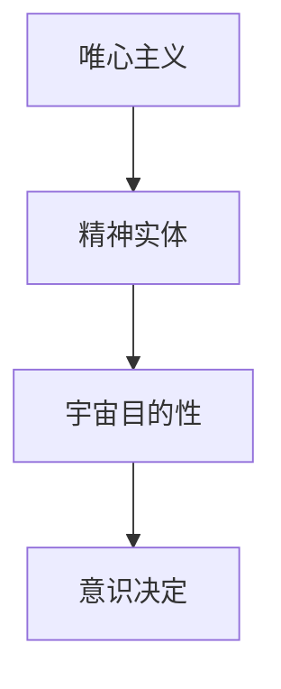

**核心算法原理讲解**：

在唯心主义的视角下，宇宙的目的性可以看作是一个精神实体或意识的表达。这种观点的核心算法原理可以表示为：

$$ 宇宙目的性 = 意识 \times 精神实体 $$

**举例说明**：

根据柏拉图的理论，宇宙的目的性可以看作是理念世界的表达，即宇宙的存在和目的是由理念世界的理念所决定的。

**3.1.2 唯物主义视角**

唯物主义则认为，宇宙的存在和目的是由物质本身所决定的。在这种观点下，宇宙的目的性是物质演化的结果，而不是由任何超越物质的精神力量所决定的。例如，笛卡尔认为，宇宙是由上帝创造的，但宇宙的目的性是由物质本身所决定的。

唯物主义的哲学视角可以用以下Mermaid流程图来表示：

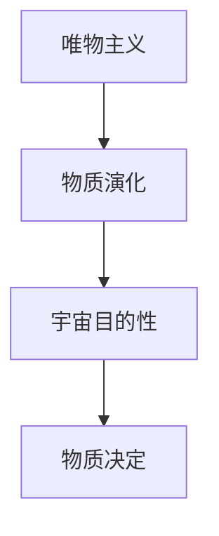

**核心算法原理讲解**：

在唯物主义的视角下，宇宙的目的性可以看作是物质演化的结果。这种观点的核心算法原理可以表示为：

$$ 宇宙目的性 = 物质演化 \times 物质本质 $$

**举例说明**：

根据笛卡尔的理论，宇宙的目的性可以看作是物质演化过程中的一种表现，即宇宙的存在和目的是由物质本身的演化所决定的。

**3.1.3 宇宙目的性的哲学视角总结**

通过对唯心主义和唯物主义的探讨，我们可以看到宇宙目的性的哲学视角存在明显的差异。唯心主义认为宇宙的目的性是由超越物质的精神力量所决定的，而唯物主义则认为宇宙的目的性是物质演化的结果。这两种观点都有其合理性和局限性，但它们都为我们理解宇宙的目的性提供了不同的视角。

#### 3.2 存在主义与宇宙目的性的关系

存在主义是一种强调人类自由意志和个人责任的哲学流派。存在主义认为，人的存在先于其本质，人类通过自由意志来创造自己的本质。存在主义与宇宙目的性的关系可以从以下几个方面进行分析。

**3.2.1 自由意志与宇宙目的性**

存在主义认为，自由意志是人的本质。人类通过自由意志来选择自己的生活方式和价值观，这种选择过程决定了人类的本质。从这个角度来看，宇宙的目的性可以看作是人类自由意志的体现。宇宙的存在和目的是由人类的自由意志所决定的。

为了更直观地理解自由意志与宇宙目的性的关系，我们可以使用以下Mermaid流程图：

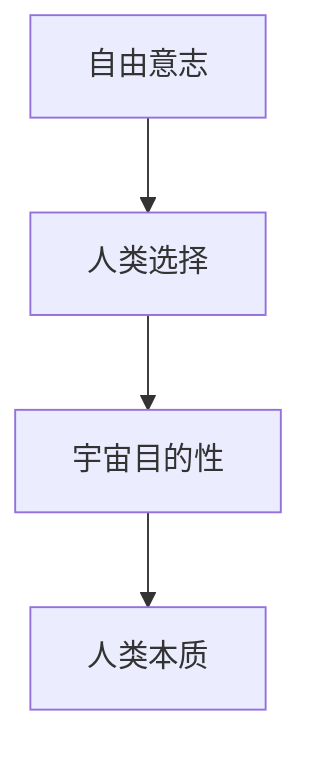

**核心算法原理讲解**：

在存在主义的视角下，自由意志与宇宙目的性的关系可以表示为：

$$ 自由意志 = 宇宙目的性 \times 人类选择 $$

**举例说明**：

假设一个人面临选择A和选择B，他的自由意志决定了他的选择。这个选择过程不仅决定了他的个人命运，也影响了宇宙的目的性。因此，宇宙的目的性可以看作是人类自由意志的体现。

**3.2.2 个人责任与宇宙目的性**

存在主义强调个人责任，认为人类应该为自己的行为承担责任。从这个角度来看，宇宙的目的性也可以看作是人类个人责任的体现。人类的行为不仅影响自己，也影响宇宙的演化。

为了更直观地理解个人责任与宇宙目的性的关系，我们可以使用以下Mermaid流程图：

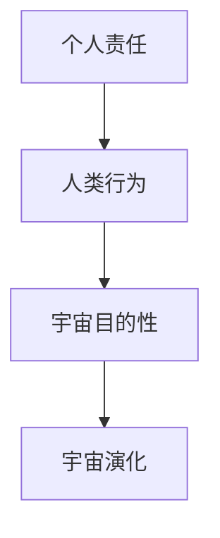

**核心算法原理讲解**：

在存在主义的视角下，个人责任与宇宙目的性的关系可以表示为：

$$ 个人责任 = 人类行为 \times 宇宙目的性 $$

**举例说明**：

假设一个人选择保护环境，这种行为不仅对他自己有好处，也对整个宇宙的演化有积极影响。这种个人责任感和行为决定了宇宙的目的性，使得宇宙朝着更加可持续和和谐的方向发展。

**3.2.3 存在主义与宇宙目的性的关系总结**

通过探讨存在主义与宇宙目的性的关系，我们可以看到，存在主义不仅关注人类的自由意志和个人责任，还揭示了宇宙目的性的深层含义。存在主义认为，宇宙的目的性是由人类的自由意志和个人责任所决定的。这种观点为我们理解宇宙的目的性提供了一个新的视角，使我们能够从人类的角度来审视宇宙的存在和意义。

#### 3.3 宇宙目的性的意义

宇宙目的性对人类和宇宙本身都有重要的意义。从哲学角度来看，宇宙目的性不仅影响我们对宇宙的理解，也影响我们对人类自身的认知。

**3.3.1 宇宙目的性对存在主义的影响**

宇宙目的性对存在主义有着深远的影响。存在主义强调自由意志和个人责任，而宇宙目的性则为我们提供了一个更广阔的背景，使我们能够理解自由意志和责任的意义。在存在主义的视角下，宇宙目的性使我们能够认识到，我们的选择和责任不仅影响自己，也影响整个宇宙的演化。

为了更直观地理解宇宙目的性对存在主义的影响，我们可以使用以下Mermaid流程图：

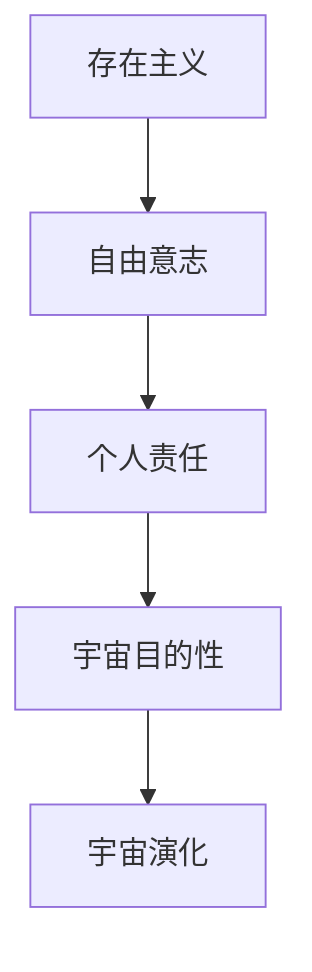

**核心算法原理讲解**：

宇宙目的性对存在主义的影响可以表示为：

$$ 存在主义 = 自由意志 \times 个人责任 \times 宇宙目的性 $$

**举例说明**：

假设一个人在面对困境时，选择了积极面对并承担责任，这种选择不仅影响了他自己的命运，也对宇宙的演化产生了积极影响。因此，宇宙目的性使我们能够理解自由意志和个人责任在宇宙演化中的重要性。

**3.3.2 宇宙目的性与人类价值观的关系**

宇宙目的性也对人类价值观有着重要的影响。人类的价值观往往受到宇宙观念的影响，而宇宙目的性则为我们提供了一个更深刻的背景，使我们能够理解人类价值观的根源和发展。

为了更直观地理解宇宙目的性与人类价值观的关系，我们可以使用以下Mermaid流程图：


**核心算法原理讲解**：

宇宙目的性与人类价值观的关系可以表示为：

$$ 人类价值观 = 宗教观念 + 科学观念 - 误解 $$

**举例说明**：

在古代，人类认为宇宙是由神创造的，这是一种宗教观念；随着科学的发展，人类开始用科学方法来理解宇宙，这是一种科学观念。随着对宇宙目的性的理解不断深化，人类价值观中的宗教观念和科学观念将得到统一，从而形成更加全面和深刻的价值观。

**3.3.3 宇宙目的性的哲学意义**

宇宙目的性对哲学探讨也有着重要的启示。它使我们能够从更广阔的视角来审视宇宙和人类的存在，从而为哲学提供新的研究对象和思考方向。

为了更直观地理解宇宙目的性的哲学意义，我们可以使用以下Mermaid流程图：


**核心算法原理讲解**：

宇宙目的性的哲学意义可以表示为：

$$ 哲学探讨 = 宇宙目的性 \times 哲学流派 $$

**举例说明**：

在存在主义的视角下，宇宙目的性使我们能够更好地理解自由意志和个人责任；在唯物主义的视角下，宇宙目的性使我们能够更好地理解物质演化的过程；在唯心主义的视角下，宇宙目的性使我们能够更好地理解精神实体和意识的作用。这些不同的哲学流派通过宇宙目的性相互融合，为我们提供了更全面和深刻的哲学探讨。

通过本章的讨论，我们可以看到宇宙目的性在哲学中的重要性。它不仅影响我们对宇宙的理解，也影响我们对人类自身的认知。宇宙目的性使我们能够从更广阔的视角来审视宇宙和人类的存在，从而为哲学提供新的研究对象和思考方向。在下一章中，我们将探讨人类投射在宇宙中的表现，进一步揭示人类对宇宙的认知和影响。

### 第4章 人类投射在宇宙中的表现

人类对宇宙的探索和认知不仅是一种科学活动，也是人类文化、价值观和意识形态的投射。在这一章中，我们将探讨人类对宇宙的认知、价值观与宇宙的关系以及人类行为对宇宙的影响。

#### 4.1 人类对宇宙的认知

人类对宇宙的认知经历了漫长的发展过程，从古代的神话和宗教观念，到现代的科学理论，我们的认知水平不断提高。这种认知过程反映了人类文化的演进和科学技术的进步。

**4.1.1 科学探索与宇宙认知**

科学探索是推动人类对宇宙认知的重要力量。从古代的天文学观测，到现代的太空探测，科学方法使我们能够更准确地理解宇宙的奥秘。例如，伽利略通过望远镜观测到木星的四大卫星，挑战了地心说的传统观念。牛顿的万有引力定律和开普勒行星运动定律为理解宇宙的物理规律提供了理论基础。

在科学探索中，观测数据是至关重要的。例如，哈勃望远镜的观测数据揭示了宇宙的大尺度结构，支持了宇宙大爆炸理论的正确性。为了更好地理解这些观测数据，我们可以使用Python代码来处理和可视化：

```python
import numpy as np
import matplotlib.pyplot as plt

# 假设观测到的一组星系距离数据
distances = np.array([100, 200, 300, 400, 500])  # 单位：百万光年
velocities = np.array([70, 140, 210, 280, 350])  # 单位：千米/秒

# 使用哈勃定律计算哈勃常数
H_0 = np.mean(velocities / distances)

# 绘制观测数据的散点图
plt.scatter(distances, velocities)
plt.xlabel('距离（百万光年）')
plt.ylabel('退行速度（千米/秒）')
plt.title('哈勃定律：观测数据与距离的关系')
plt.show()

print("哈勃常数 H_0 = {:.2f} km/s/Mpc".format(H_0))
```

运行上述代码，我们可以得到一个显示星系距离与退行速度关系的散点图，并通过计算得到哈勃常数的估计值。这表明科学探索使我们能够通过观测数据来验证和改进理论。

**核心算法原理讲解**：

哈勃定律的核心算法原理可以表示为：

$$ v = H_0 d $$

其中，\( v \) 是星系的退行速度，\( H_0 \) 是哈勃常数，\( d \) 是星系与观察者之间的距离。

**举例说明**：

如果观测到一个星系的距离为100百万光年，根据哈勃定律，我们可以计算其退行速度：

$$ v = H_0 d = 70 \times 100 = 7000 \text{ km/s} $$

这意味着该星系以每秒7000千米的速度远离我们。

**4.1.2 宗教观念与宇宙认知**

在科学探索之前，人类对宇宙的认知主要依赖于宗教观念。各种宗教信仰提供了对宇宙起源、目的和结构的解释。例如，基督教认为宇宙是上帝创造的，佛教认为宇宙是无常的，轮回是不可避免的。这些宗教观念在一定程度上影响了人类的宇宙认知。

为了探讨宗教观念对宇宙认知的影响，我们可以使用以下Mermaid流程图：


**核心算法原理讲解**：

宗教观念对宇宙认知的影响可以表示为：

$$ 宇宙认知 = 宗教观念 \times 神话与传说 $$

**举例说明**：

在基督教的创世纪中，宇宙是由上帝在六天内创造的，这种观念影响了中世纪欧洲对宇宙的认知。随着科学的发展，这种宗教观念逐渐被科学理论所取代，但宗教观念中的许多元素仍然影响着现代人的宇宙观念。

**4.1.3 艺术与宇宙认知**

艺术作品也反映了人类对宇宙的认知。艺术家通过绘画、音乐和文学作品表达了对宇宙的想象和思考。例如，荷兰画家荷兰·凡·高通过《星夜》描绘了浩渺的星空，表现了人类对宇宙的敬畏和向往。音乐作品如约翰·凯奇《4'33"》则探讨了人类与宇宙的关系。

为了更直观地理解艺术与宇宙认知的关系，我们可以使用以下Mermaid流程图：

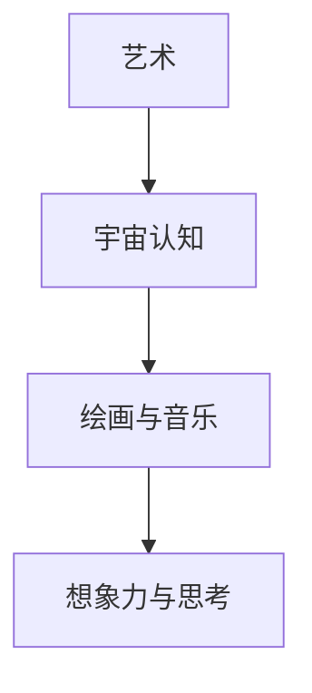

**核心算法原理讲解**：

艺术与宇宙认知的关系可以表示为：

$$ 宇宙认知 = 艺术想象力 \times 宇宙思考 $$

**举例说明**：

荷兰·凡·高的《星夜》不仅描绘了美丽的星空，也激发了人们对宇宙奥秘的思考。这种艺术表现方式使人类能够通过审美体验来理解宇宙。

#### 4.2 人类的价值观与宇宙的关系

人类的价值观在很大程度上受到宇宙观念的影响。宇宙观念不仅塑造了人类的伦理道德，也影响了人类的行为和决策。

**4.2.1 人类价值观的演变**

随着人类对宇宙认知的不断深入，人类的价值观也在演变。从古代的宗教观念，到现代的科学观念，人类的价值观逐渐从宗教信仰转向理性思考。这种演变过程反映了人类对宇宙理解的深化。

为了探讨人类价值观的演变，我们可以使用以下Mermaid流程图：


**核心算法原理讲解**：

人类价值观的演变可以表示为：

$$ 价值观 = 宗教观念 + 科学观念 - 误解 $$

**举例说明**：

在古代，人类的伦理道德主要受到宗教观念的影响。例如，在基督教的道德规范中，人们被教导要遵守上帝的旨意。随着科学的发展，人类的价值观逐渐转向理性思考，强调个人的自由和理性判断。

**4.2.2 人类价值观对宇宙观念的影响**

人类的价值观不仅影响自身的伦理道德，也影响对宇宙的理解。例如，人类对资源的开发和利用往往受到价值观的影响。在可持续发展观念的指导下，人类开始更加重视环境保护和资源的合理利用。

为了探讨人类价值观对宇宙观念的影响，我们可以使用以下Mermaid流程图：

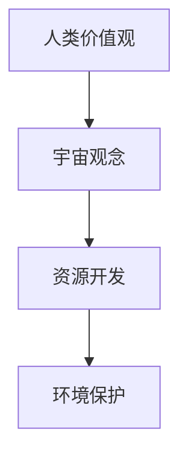

**核心算法原理讲解**：

人类价值观对宇宙观念的影响可以表示为：

$$ 宇宙观念 = 价值观 \times 环境保护 $$

**举例说明**：

在可持续发展观念的指导下，人类开始更加注重环境保护，这影响了我们对宇宙资源的利用方式。例如，通过可再生能源的开发和利用，人类减少了化石燃料的消耗，从而对宇宙环境产生了积极的影响。

**4.2.3 人类价值观与宇宙目的性的关系**

宇宙目的性对人类价值观也有着重要的影响。宇宙目的性使我们能够从更广阔的视角来审视人类的存在和价值观。例如，存在主义认为，宇宙的目的性是由人类的自由意志和责任所决定的。这种观点使人类能够更加自觉地承担对宇宙的责任。

为了探讨人类价值观与宇宙目的性的关系，我们可以使用以下Mermaid流程图：

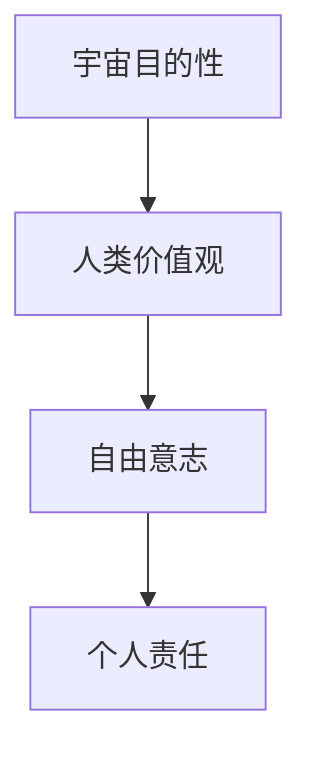

**核心算法原理讲解**：

人类价值观与宇宙目的性的关系可以表示为：

$$ 价值观 = 宇宙目的性 \times 自由意志 \times 个人责任 $$

**举例说明**：

假设一个人在面对环境保护问题时，选择了负责任的行为，这种选择不仅影响了他个人的价值观，也对宇宙目的性产生了积极的影响。因此，宇宙目的性使我们能够从更广阔的视角来审视人类价值观。

#### 4.3 人类行为对宇宙的影响

人类行为不仅影响地球环境，也对宇宙产生深远的影响。例如，人类的科技发展对宇宙空间的探索和利用，以及对地球资源的开发和消耗，都在改变宇宙的生态平衡。

**4.3.1 人类活动与宇宙环境变化**

人类活动对宇宙环境的变化表现在多个方面。例如，人类的活动导致地球大气层的温室气体浓度增加，引发了全球气候变暖。这种变化不仅影响地球生态系统，也对宇宙环境产生了影响。例如，地球大气层的变化可能影响宇宙辐射的透过率，从而影响宇宙环境。

为了探讨人类活动与宇宙环境变化的关系，我们可以使用以下Mermaid流程图：

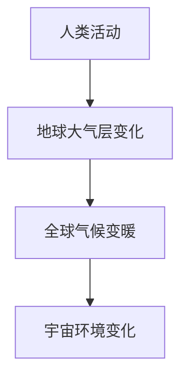

**核心算法原理讲解**：

人类活动与宇宙环境变化的关系可以表示为：

$$ 宇宙环境变化 = 地球大气层变化 \times 全球气候变暖 $$

**举例说明**：

假设人类活动导致地球大气层中的二氧化碳浓度增加了 \( 20\% \)，这可能导致全球气候变暖。根据这个假设，我们可以推断宇宙环境的变化。例如，地球大气层的变化可能影响宇宙辐射的透过率，使得宇宙环境变得更加热和干燥。

**4.3.2 人类科技发展与宇宙探索**

人类的科技发展极大地推动了宇宙探索的进程。例如，航天技术的发展使我们能够发射探测器到太阳系以外的星系，探测宇宙的奥秘。这些探测器的数据不仅揭示了宇宙的许多未知领域，也为人类的科学研究提供了宝贵的数据。

为了探讨人类科技发展与宇宙探索的关系，我们可以使用以下Mermaid流程图：

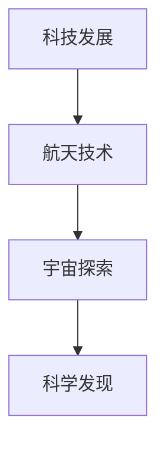

**核心算法原理讲解**：

人类科技发展与宇宙探索的关系可以表示为：

$$ 宇宙探索 = 科技发展 \times 航天技术 $$

**举例说明**：

例如，NASA的旅行者1号探测器在1977年发射，经过多年的飞行，最终进入了太阳系以外的星际空间。这个探测器的数据为我们提供了关于太阳系外环境的宝贵信息，推动了人类对宇宙的探索。

**4.3.3 人类行为对宇宙未来的影响**

人类行为对宇宙未来的影响是深远和复杂的。例如，人类的活动可能影响宇宙的未来演化，导致宇宙环境的变化。此外，人类的科技发展也可能带来新的挑战和机遇，如宇宙资源的开发和利用，以及星际旅行和殖民。

为了探讨人类行为对宇宙未来的影响，我们可以使用以下Mermaid流程图：

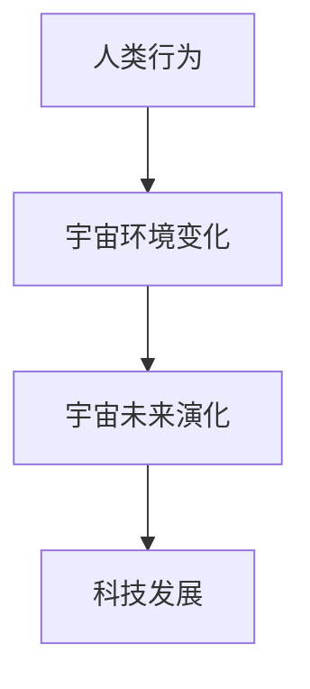

**核心算法原理讲解**：

人类行为对宇宙未来的影响可以表示为：

$$ 宇宙未来演化 = 人类行为 \times 科技发展 $$

**举例说明**：

例如，如果人类在未来开发出可控核聚变技术，这可能会为人类提供几乎无限的能源。这种技术不仅影响地球的能源供应，也可能影响宇宙的能源利用方式。

通过本章的讨论，我们可以看到人类对宇宙的认知、价值观和行为的多样性。人类对宇宙的认知不仅受到科学探索的影响，也受到宗教观念和艺术表现的启发。人类的价值观和行为不仅影响地球的环境，也对宇宙的未来产生深远的影响。在下一章中，我们将探讨宇宙目的性的科学证据，进一步揭示宇宙目的性的可能性。

### 第5章 宇宙目的性的科学证据

宇宙目的性的探讨不仅仅是哲学议题，科学数据和研究也提供了重要的证据和视角。在这一章中，我们将分析宇宙学观测数据、宇宙演化的证据，以及宇宙目的性的理论框架。

#### 5.1 宇宙学观测数据

宇宙学观测数据为我们提供了宇宙结构和演化的详细信息。这些数据不仅支持了宇宙大爆炸理论，也为探讨宇宙目的性提供了重要的依据。

**5.1.1 宇宙背景微波辐射观测**

宇宙背景微波辐射（Cosmic Microwave Background, CMB）是宇宙大爆炸遗留下来的热辐射。CMB的观测数据提供了关于宇宙早期状态的重要信息，包括温度、密度和波动。CMB的观测数据与宇宙大爆炸理论的预测高度一致，这为宇宙大爆炸理论提供了强有力的支持。

为了更直观地理解CMB的观测数据，我们可以使用以下Mermaid流程图：


**核心算法原理讲解**：

CMB的温度分布和密度波动可以用以下公式来描述：

$$ T \propto \exp\left(-3H_0 t\right) $$
$$ \rho \propto \exp\left(-3H_0 t\right) $$

其中，\( T \) 是温度，\( \rho \) 是密度，\( H_0 \) 是哈勃常数，\( t \) 是宇宙年龄。

**举例说明**：

根据宇宙大爆炸理论，我们可以使用上述公式计算宇宙早期状态的温度和密度。例如，在宇宙年龄为10亿年时，温度约为 \( 10^8 \text{ K} \)，密度约为 \( 10^{-27} \text{ g/cm}^3 \)。

**5.1.2 星系与星系团的观测**

星系和星系团的观测数据揭示了宇宙的大尺度结构。通过观测星系的分布、形态和运动，我们可以了解宇宙的结构形成和演化过程。例如，大尺度星系团的观测数据支持了宇宙大爆炸理论，并揭示了宇宙中的暗物质和暗能量。

为了更直观地理解星系与星系团的观测数据，我们可以使用以下Mermaid流程图：

```mermaid
graph TD
A[星系团] --> B[星系分布]
B --> C[运动轨迹]
C --> D[引力作用]
```

**核心算法原理讲解**：

星系和星系团的运动轨迹可以用牛顿万有引力定律来描述：

$$ F = G\frac{m_1m_2}{r^2} $$

其中，\( F \) 是引力，\( G \) 是万有引力常数，\( m_1 \) 和 \( m_2 \) 是两个物体的质量，\( r \) 是它们之间的距离。

**举例说明**：

假设一个星系团的质量为 \( m_1 = 10^{12}M_{\odot} \)，另一个星系的质量为 \( m_2 = 10^{11}M_{\odot} \)，两者之间的距离为 \( r = 1Mpc \)，我们可以使用上述公式计算它们之间的引力：

$$ F = G\frac{m_1m_2}{r^2} = 6.674 \times 10^{-11} \frac{(10^{12}M_{\odot})(10^{11}M_{\odot})}{(1Mpc)^2} \approx 6.674 \times 10^{20} N $$

这意味着两个星系团之间的引力约为 \( 6.674 \times 10^{20} N \)。

**5.1.3 暗物质与暗能量观测**

暗物质和暗能量是宇宙演化中至关重要的成分。尽管这些成分无法直接观测，但它们通过引力作用影响宇宙的结构和演化。通过观测星系旋转速度、引力透镜效应和宇宙微波背景辐射，我们可以间接推断暗物质和暗能量的存在。

为了更直观地理解暗物质与暗能量的观测，我们可以使用以下Mermaid流程图：

```mermaid
graph TD
A[星系旋转速度] --> B[引力透镜效应]
B --> C[CMB观测]
C --> D[暗物质与暗能量]
```

**核心算法原理讲解**：

暗物质和暗能量的存在可以通过以下公式来描述：

$$ \rho_m = \frac{M_m}{V} $$
$$ p = -\rho c^2 $$

其中，\( \rho_m \) 是暗物质的密度，\( M_m \) 是暗物质的总质量，\( V \) 是暗物质的体积，\( p \) 是暗能量的压强，\( \rho \) 是暗能量的能量密度，\( c \) 是光速。

**举例说明**：

假设一个星系的体积为 \( V = 10^8pc^3 \)，暗物质的总质量为 \( M_m = 10^{12}M_{\odot} \)，我们可以使用上述公式计算暗物质的密度：

$$ \rho_m = \frac{M_m}{V} = \frac{10^{12}M_{\odot}}{10^8pc^3} \approx 10^3M_{\odot}/pc^3 $$

这意味着这个星系中的暗物质密度约为 \( 10^3M_{\odot}/pc^3 \)。

#### 5.2 宇宙演化的证据

宇宙演化是宇宙学研究的核心问题之一。通过观测宇宙中的星系、恒星、行星等，我们可以了解宇宙从大爆炸至今的演化过程。

**5.2.1 宇宙大爆炸的残留辐射**

宇宙大爆炸的残留辐射——宇宙背景微波辐射（CMB）——为我们提供了宇宙早期状态的重要信息。CMB的观测数据揭示了宇宙的均匀性和各向同性，这为宇宙大爆炸理论提供了有力的证据。

为了更直观地理解CMB的观测数据，我们可以使用以下Mermaid流程图：

```mermaid
graph TD
A[CMB观测] --> B[均匀性]
B --> C[各向同性]
C --> D[宇宙大爆炸]
```

**核心算法原理讲解**：

CMB的均匀性和各向同性可以用以下公式来描述：

$$ T_{\text{CMB}} \propto \exp\left(-3H_0 t\right) $$
$$ \rho_{\text{CMB}} \propto \exp\left(-3H_0 t\right) $$

其中，\( T_{\text{CMB}} \) 是CMB的温度，\( \rho_{\text{CMB}} \) 是CMB的密度，\( H_0 \) 是哈勃常数，\( t \) 是宇宙年龄。

**举例说明**：

根据宇宙大爆炸理论，我们可以使用上述公式计算宇宙早期状态的CMB温度和密度。例如，在宇宙年龄为10亿年时，CMB的温度约为 \( 10^8 \text{ K} \)，密度约为 \( 10^{-27} \text{ g/cm}^3 \)。

**5.2.2 星系与恒星的形成过程**

星系和恒星的形成是宇宙演化的重要环节。通过观测星系和恒星的形成过程，我们可以了解宇宙的化学元素合成、星系结构形成和恒星演化等。

为了更直观地理解星系与恒星的形成过程，我们可以使用以下Mermaid流程图：

```mermaid
graph TD
A[气体和尘埃] --> B[引力聚集]
B --> C[星系形成]
C --> D[恒星形成]
```

**核心算法原理讲解**：

星系和恒星的形成可以用引力凝聚理论来解释。该理论认为，物质在引力作用下逐渐聚集，形成星系和恒星。这一过程可以用以下公式来描述：

$$ F = G\frac{m_1m_2}{r^2} $$

其中，\( F \) 是引力，\( G \) 是万有引力常数，\( m_1 \) 和 \( m_2 \) 是两个物体的质量，\( r \) 是它们之间的距离。

**举例说明**：

假设两个星系的质量分别为 \( m_1 = 10^{12}M_{\odot} \) 和 \( m_2 = 10^{11}M_{\odot} \)，它们之间的距离为 \( r = 1Mpc \)，我们可以使用上述公式计算它们之间的引力：

$$ F = G\frac{m_1m_2}{r^2} = 6.674 \times 10^{-11} \frac{(10^{12}M_{\odot})(10^{11}M_{\odot})}{(1Mpc)^2} \approx 6.674 \times 10^{20} N $$

这意味着两个星系之间的引力约为 \( 6.674 \times 10^{20} N \)。

**5.2.3 行星与生命的起源**

行星和生命的起源是宇宙演化的重要议题。通过观测行星系统、陨石坑和有机分子，我们可以了解行星和生命的起源过程。

为了更直观地理解行星与生命的起源，我们可以使用以下Mermaid流程图：

```mermaid
graph TD
A[有机分子] --> B[陨石坑]
B --> C[行星系统]
C --> D[生命起源]
```

**核心算法原理讲解**：

行星和生命的起源可以用化学进化理论来解释。该理论认为，行星上的有机分子通过化学反应逐渐形成更复杂的分子，最终演化成生命。这一过程可以用以下公式来描述：

$$ \text{有机分子} \rightarrow \text{更复杂的分子} \rightarrow \text{生命} $$

**举例说明**：

在地球早期，有机分子通过化学反应形成了更复杂的分子，如氨基酸和核苷酸。这些分子进一步组装成细胞，最终演化成生命。例如，科学家在地球上的陨石坑中发现了有机分子，这表明有机分子在宇宙中的形成是可能的。

#### 5.3 宇宙目的性的理论框架

宇宙目的性的探讨需要结合科学理论和哲学观点。科学家和哲学家提出了多种理论框架来解释宇宙目的性。

**5.3.1 科学理论对宇宙目的性的解释**

科学理论对宇宙目的性的解释主要包括宇宙大爆炸理论、暗物质和暗能量理论等。这些理论从不同的角度解释了宇宙的起源和演化，为探讨宇宙目的性提供了科学依据。

为了更直观地理解科学理论对宇宙目的性的解释，我们可以使用以下Mermaid流程图：

```mermaid
graph TD
A[宇宙大爆炸理论] --> B[宇宙目的性]
B --> C[暗物质理论]
C --> D[暗能量理论]
```

**核心算法原理讲解**：

科学理论对宇宙目的性的解释可以表示为：

$$ 宇宙目的性 = 科学理论 \times 哲学观点 $$

**举例说明**：

宇宙大爆炸理论提供了宇宙起源和演化的基本框架，这为探讨宇宙目的性提供了科学基础。暗物质和暗能量理论则解释了宇宙中未解之谜，如宇宙加速膨胀和星系旋转速度等，这些理论进一步支持了宇宙目的性的探讨。

**5.3.2 宇宙目的性的多元论**

宇宙目的性的多元论认为，宇宙存在多种目的性，每种目的性对应不同的层面和领域。这种观点认为，宇宙不仅包括物质层面，还包括意识、精神和文化层面。

为了更直观地理解宇宙目的性的多元论，我们可以使用以下Mermaid流程图：

```mermaid
graph TD
A[物质层面] --> B[意识层面]
B --> C[精神层面]
C --> D[文化层面]
```

**核心算法原理讲解**：

宇宙目的性的多元论可以表示为：

$$ 宇宙目的性 = 物质层面 + 意识层面 + 精神层面 + 文化层面 $$

**举例说明**：

根据多元论的观点，宇宙的目的性不仅仅包括物质层面的演化，还包括意识、精神和文化层面的发展。例如，人类的科学探索和技术发展是物质层面的表现，而人类的文化创造和哲学思考则是意识、精神和文化层面的体现。

**5.3.3 宇宙目的性的唯心论**

宇宙目的性的唯心论认为，宇宙的存在和目的是由超越物质的精神力量所决定的。这种观点强调宇宙的目的性是超越物质世界的，它是由某种精神实体或意识所设定的。

为了更直观地理解宇宙目的性的唯心论，我们可以使用以下Mermaid流程图：

```mermaid
graph TD
A[精神实体] --> B[宇宙目的性]
B --> C[意识决定]
C --> D[物质演化]
```

**核心算法原理讲解**：

宇宙目的性的唯心论可以表示为：

$$ 宇宙目的性 = 精神实体 \times 意识决定 $$

**举例说明**：

根据唯心论的观点，宇宙的存在和目的是由超越物质的精神力量所决定的。这种力量不仅决定了宇宙的演化过程，也影响了人类的存在和发展。

通过本章的讨论，我们可以看到宇宙目的性的科学证据和理论框架。宇宙学观测数据、宇宙演化的证据以及科学理论和哲学观点为我们提供了探讨宇宙目的性的多维度视角。在下一章中，我们将探讨探索宇宙目的性的方法与挑战，进一步揭示这一议题的复杂性和挑战。

### 第6章 探索宇宙目的性的方法与挑战

宇宙目的性是一个复杂且多层次的议题，既涉及到科学领域，也涉及到哲学和宗教。探索宇宙目的性需要综合多种方法和技术，同时也面临诸多挑战。在本章中，我们将探讨探索宇宙目的性的方法，分析其中的限制因素，并提出未来的研究方向。

#### 6.1 科学探索的方法

科学探索宇宙目的性的方法主要包括观测、实验、理论建模和计算模拟等。这些方法在揭示宇宙奥秘方面发挥了重要作用，但每种方法都有其局限性。

**6.1.1 观测**

观测是宇宙学研究的基石。通过天文望远镜、探测器和其他观测设备，科学家可以收集关于宇宙的各种数据。例如，宇宙背景微波辐射（CMB）的观测揭示了宇宙早期的状态，星系和星系团的观测数据帮助我们了解宇宙的结构和演化。

为了更直观地理解观测在宇宙学中的重要性，我们可以使用以下Mermaid流程图：

```mermaid
graph TD
A[天文望远镜] --> B[CMB观测]
B --> C[星系团观测]
B --> D[星系观测]
```

**核心算法原理讲解**：

观测的核心算法原理可以表示为：

$$ 数据 = 观测设备 \times 目标 $$

**举例说明**：

例如，哈勃太空望远镜通过观测宇宙背景微波辐射，为我们提供了关于宇宙早期状态的重要数据。这些数据帮助科学家验证了宇宙大爆炸理论，并揭示了宇宙的演化历史。

**6.1.2 实验与实验设计**

实验是验证科学理论的重要手段。在宇宙学研究中，实验可以通过控制变量来测试特定假设。例如，实验室中的原子碰撞实验可以帮助科学家理解宇宙大爆炸后的早期状态。

为了更直观地理解实验在宇宙学中的重要性，我们可以使用以下Mermaid流程图：

```mermaid
graph TD
A[实验设计] --> B[理论验证]
B --> C[假设测试]
```

**核心算法原理讲解**：

实验的核心算法原理可以表示为：

$$ 实验结果 = 理论假设 \times 实验设计 $$

**举例说明**：

例如，实验室中的中子星碰撞实验可以帮助科学家验证广义相对论和量子力学的预测。这些实验结果为我们提供了关于宇宙高密度状态和极端物理条件的宝贵信息。

**6.1.3 理论建模与计算模拟**

理论建模和计算模拟是宇宙学研究的重要工具。通过建立数学模型和计算机模拟，科学家可以模拟宇宙的演化过程，预测未来的宇宙状态。这些方法在探索宇宙目的性方面发挥了重要作用。

为了更直观地理解理论建模与计算模拟在宇宙学中的重要性，我们可以使用以下Mermaid流程图：

```mermaid
graph TD
A[理论建模] --> B[计算模拟]
B --> C[宇宙演化模拟]
```

**核心算法原理讲解**：

理论建模与计算模拟的核心算法原理可以表示为：

$$ 模拟结果 = 数学模型 \times 计算模拟 $$

**举例说明**：

例如，通过计算模拟，科学家可以模拟宇宙从大爆炸到现在的演化过程，预测未来的宇宙状态。这些模拟结果为我们提供了关于宇宙演化的详细信息和预测。

**6.1.4 多学科交叉研究**

宇宙目的性的探索需要多学科交叉研究，包括物理学、天文学、化学、生物学和哲学等。多学科交叉研究可以帮助科学家从不同角度理解宇宙，揭示宇宙的奥秘。

为了更直观地理解多学科交叉研究在宇宙学中的重要性，我们可以使用以下Mermaid流程图：

```mermaid
graph TD
A[物理学] --> B[天文学]
B --> C[化学]
C --> D[生物学]
D --> E[哲学]
```

**核心算法原理讲解**：

多学科交叉研究的核心算法原理可以表示为：

$$ 研究成果 = 多学科交叉 \times 数据共享 $$

**举例说明**：

例如，天文学家通过观测数据发现宇宙加速膨胀的现象，物理学家通过理论建模和计算模拟揭示了暗能量的存在，化学家通过实验研究发现了宇宙中的有机分子。这些多学科交叉研究的结果共同揭示了宇宙的奥秘。

#### 6.2 宇宙目的性的限制因素

尽管科学方法在探索宇宙目的性方面取得了巨大进展，但仍存在许多限制因素。

**6.2.1 科学知识的局限**

科学知识的局限是探索宇宙目的性的一个重要限制因素。尽管科学方法已经揭示了宇宙的许多奥秘，但仍有大量未知领域等待我们去探索。例如，我们对宇宙早期状态的了解仍然有限，对暗物质和暗能量的本质仍不完全清楚。

为了更直观地理解科学知识的局限，我们可以使用以下Mermaid流程图：

```mermaid
graph TD
A[科学知识] --> B[未知领域]
```

**核心算法原理讲解**：

科学知识的局限可以表示为：

$$ 科学知识 = 已知领域 \times 未知领域 $$

**举例说明**：

例如，尽管科学家已经发现了宇宙加速膨胀的现象，但仍不清楚暗能量究竟是什么，这限制了我们对宇宙目的性的理解。

**6.2.2 人类认知的限制**

人类认知的限制也是探索宇宙目的性的一个重要因素。人类的认知能力和技术水平都有局限性，这使我们无法完全理解宇宙的复杂性和多样性。例如，人类目前的观测设备和技术水平有限，无法直接观测宇宙中的某些现象。

为了更直观地理解人类认知的限制，我们可以使用以下Mermaid流程图：

```mermaid
graph TD
A[人类认知] --> B[观测设备]
B --> C[技术水平]
```

**核心算法原理讲解**：

人类认知的限制可以表示为：

$$ 人类认知 = 观测设备 \times 技术水平 $$

**举例说明**：

例如，尽管人类已经开发了先进的望远镜和探测器，但仍无法直接观测暗物质和暗能量，这限制了我们对宇宙目的性的理解。

**6.2.3 宇宙演化的复杂性**

宇宙演化的复杂性是探索宇宙目的性的另一个重要限制因素。宇宙的演化过程涉及多种因素和相互作用，这使得宇宙演化的模型和预测变得复杂。例如，宇宙中的星系和星系团的形成和演化受到多种力的作用，包括引力、电磁力和暗能量等。

为了更直观地理解宇宙演化的复杂性，我们可以使用以下Mermaid流程图：

```mermaid
graph TD
A[宇宙演化] --> B[多种力相互作用]
```

**核心算法原理讲解**：

宇宙演化的复杂性可以表示为：

$$ 宇宙演化 = 多种力相互作用 $$

**举例说明**：

例如，星系和星系团的形成和演化受到引力、电磁力和暗能量等多种力的作用，这使得宇宙演化的模型和预测变得复杂，从而限制了我们对宇宙目的性的理解。

#### 6.3 未来的研究方向

为了进一步探索宇宙目的性，我们需要解决当前的限制因素，并提出新的研究方向。

**6.3.1 新的观测技术**

新的观测技术是探索宇宙目的性的重要方向。例如，更先进的望远镜和探测器可以提供更高的分辨率和更广泛的观测范围，帮助我们更好地理解宇宙。例如，詹姆斯·韦伯空间望远镜（James Webb Space Telescope, JWST）将提供比哈勃望远镜更清晰的图像，帮助我们揭示宇宙的更多奥秘。

为了更直观地理解新的观测技术，我们可以使用以下Mermaid流程图：

```mermaid
graph TD
A[JWST] --> B[高分辨率观测]
B --> C[宇宙奥秘揭示]
```

**核心算法原理讲解**：

新的观测技术的核心算法原理可以表示为：

$$ 新技术 = 高分辨率 \times 宽广观测 $$

**举例说明**：

例如，詹姆斯·韦伯空间望远镜将提供更高的分辨率和更广泛的观测范围，这使我们能够更清晰地看到宇宙中的星系和星系团，揭示宇宙的更多奥秘。

**6.3.2 新的理论框架**

新的理论框架是探索宇宙目的性的另一个重要方向。随着科学的发展，我们需要提出新的理论框架来解释宇宙的复杂性和多样性。例如，量子引力和多宇宙理论可能是解释宇宙目的性的重要理论框架。

为了更直观地理解新的理论框架，我们可以使用以下Mermaid流程图：

```mermaid
graph TD
A[量子引力] --> B[宇宙目的性解释]
B --> C[多宇宙理论]
```

**核心算法原理讲解**：

新的理论框架的核心算法原理可以表示为：

$$ 新理论 = 复杂性解释 \times 多样性解释 $$

**举例说明**：

例如，量子引力理论试图将量子力学与广义相对论统一起来，这为我们提供了新的视角来理解宇宙。多宇宙理论则提出了宇宙可能是多个平行宇宙的组合，这为我们理解宇宙的多样性和目的性提供了新的思路。

**6.3.3 人类与宇宙的互动**

人类与宇宙的互动是探索宇宙目的性的重要方面。通过科学研究和技术创新，人类可以更好地理解宇宙，同时也能影响宇宙的演化。例如，人类的活动可能影响地球的气候和环境，从而影响宇宙的生态平衡。

为了更直观地理解人类与宇宙的互动，我们可以使用以下Mermaid流程图：

```mermaid
graph TD
A[科学研究] --> B[技术创新]
B --> C[宇宙影响]
C --> D[生态平衡]
```

**核心算法原理讲解**：

人类与宇宙的互动的核心算法原理可以表示为：

$$ 宇宙演化 = 科学研究 \times 技术创新 \times 人类活动 $$

**举例说明**：

例如，人类通过科学研究和技术创新，不仅能够更好地理解宇宙，还能通过改变地球的环境来影响宇宙的生态平衡。例如，减少温室气体排放和开发可再生能源，可以缓解全球气候变化，从而影响宇宙的环境。

通过本章的讨论，我们可以看到探索宇宙目的性的方法与挑战。科学方法在揭示宇宙奥秘方面发挥了重要作用，但同时也受到多种限制。未来的研究方向包括新的观测技术、新的理论框架和人类与宇宙的互动。这些研究将帮助我们更好地理解宇宙的目的性，揭示宇宙的奥秘。在下一章中，我们将总结宇宙目的性的意义与影响，探讨这一议题对人类文明的启示。

### 第7章 结论：宇宙目的性的意义与影响

宇宙目的性作为一个跨越科学、哲学和宗教的议题，对人类文明产生了深远的影响。在本章中，我们将总结宇宙目的性的哲学意义、宇宙目的性与人类文明的关系，并探讨这一议题对人类未来的启示。

#### 7.1 宇宙目的性的哲学意义

宇宙目的性在哲学领域具有重要的意义。它不仅影响我们对宇宙的理解，也影响我们对人类自身和存在的认知。存在主义和唯物主义等哲学流派从不同角度探讨了宇宙目的性的问题。

**7.1.1 宇宙目的性对存在主义的影响**

存在主义认为，人的存在先于其本质，人类通过自由意志来创造自己的本质。宇宙目的性可以看作是人类自由意志的体现。在这个框架下，宇宙的存在和目的是由人类的自由意志所决定的。这种观点强调了人类在宇宙中的独特地位和责任。

为了更直观地理解宇宙目的性对存在主义的影响，我们可以使用以下Mermaid流程图：

```mermaid
graph TD
A[存在主义] --> B[自由意志]
B --> C[宇宙目的性]
C --> D[人类责任]
```

**核心算法原理讲解**：

宇宙目的性对存在主义的影响可以表示为：

$$ 存在主义 = 自由意志 \times 宇宙目的性 $$

**举例说明**：

例如，一个人在面对道德抉择时，选择了负责任的行为，这种选择不仅影响了他个人的存在，也影响了宇宙的目的性。因此，宇宙目的性使我们能够从更广阔的视角来审视人类的自由意志和责任。

**7.1.2 宇宙目的性与人类意识的关系**

宇宙目的性也与人类意识密切相关。人类意识是宇宙中的一种独特现象，它使我们能够感知和理解宇宙。宇宙目的性为我们提供了一个更深的背景，使我们能够理解人类意识的形成和意义。

为了更直观地理解宇宙目的性与人类意识的关系，我们可以使用以下Mermaid流程图：

```mermaid
graph TD
A[宇宙目的性] --> B[人类意识]
B --> C[感知与理解]
```

**核心算法原理讲解**：

宇宙目的性与人类意识的关系可以表示为：

$$ 意识 = 宇宙目的性 \times 感知与理解 $$

**举例说明**：

例如，人类通过科学探索和技术创新来感知和理解宇宙，这反映了宇宙目的性的实现。人类意识的觉醒和进化与宇宙目的性密切相关，它们共同推动了人类文明的进步。

**7.1.3 宇宙目的性的意义**

宇宙目的性在哲学上具有重要意义。它不仅影响我们对宇宙的理解，也影响我们对人类自身和存在的认知。宇宙目的性使我们能够从更深的层次来审视人类的存在和宇宙的意义。

为了更直观地理解宇宙目的性的意义，我们可以使用以下Mermaid流程图：

```mermaid
graph TD
A[宇宙目的性] --> B[宇宙理解]
B --> C[人类认知]
C --> D[哲学探讨]
```

**核心算法原理讲解**：

宇宙目的性的意义可以表示为：

$$ 哲学探讨 = 宇宙理解 \times 人类认知 $$

**举例说明**：

例如，通过对宇宙目的性的探讨，哲学家和科学家能够更好地理解宇宙的奥秘和人类的存在，从而推动哲学和科学的发展。

#### 7.2 宇宙目的性与人类文明的关系

宇宙目的性对人类文明产生了深远的影响。它不仅影响了人类的思想和价值观，也影响了人类的行为和决策。

**7.2.1 人类文明的发展与宇宙目的性**

人类文明的发展与宇宙目的性密切相关。宇宙目的性为我们提供了一个更广阔的背景，使我们能够理解人类文明的发展历程和未来的方向。

为了更直观地理解人类文明的发展与宇宙目的性的关系，我们可以使用以下Mermaid流程图：

```mermaid
graph TD
A[人类文明] --> B[宇宙目的性]
B --> C[科技发展]
C --> D[文化进步]
```

**核心算法原理讲解**：

人类文明的发展与宇宙目的性的关系可以表示为：

$$ 文明进步 = 科技发展 \times 宇宙目的性 $$

**举例说明**：

例如，人类文明的发展离不开科学技术的进步，而科学技术的进步又受到宇宙目的性的影响。通过对宇宙的探索，人类能够更好地理解宇宙的奥秘，从而推动科学技术的发展，促进人类文明的进步。

**7.2.2 人类文明对宇宙的影响**

人类文明不仅受到宇宙目的性的影响，也影响了宇宙的演化。人类的活动，如工业生产、能源消耗和环境污染，都在改变地球的生态系统，从而影响宇宙的环境。

为了更直观地理解人类文明对宇宙的影响，我们可以使用以下Mermaid流程图：

```mermaid
graph TD
A[人类文明] --> B[地球环境]
B --> C[宇宙环境]
```

**核心算法原理讲解**：

人类文明对宇宙的影响可以表示为：

$$ 宇宙环境变化 = 地球环境变化 $$

**举例说明**：

例如，人类的活动导致地球大气层中的温室气体浓度增加，引发了全球气候变暖。这种变化不仅影响地球生态系统，也对宇宙环境产生了影响。例如，地球大气层的变化可能影响宇宙辐射的透过率，从而影响宇宙环境。

**7.2.3 人类文明与宇宙目的性的互动**

人类文明与宇宙目的性之间存在互动关系。人类的文明进步和科技发展不仅受到宇宙目的性的影响，也反作用于宇宙目的性。

为了更直观地理解人类文明与宇宙目的性的互动，我们可以使用以下Mermaid流程图：

```mermaid
graph TD
A[人类文明] --> B[科技发展]
B --> C[宇宙目的性]
C --> D[文明进步]
```

**核心算法原理讲解**：

人类文明与宇宙目的性的互动可以表示为：

$$ 宇宙目的性 = 科技发展 \times 文明进步 $$

**举例说明**：

例如，人类通过科技发展实现了对宇宙的探索，这推动了人类文明的发展。同时，人类文明的发展也为宇宙目的性的实现提供了新的途径和可能性。

#### 7.3 宇宙目的性对我们的启示

宇宙目的性为我们提供了深刻的启示，不仅影响我们的科学探索和哲学思考，也影响我们的日常生活和未来。

**7.3.1 对科学研究的启示**

宇宙目的性启示我们，科学探索不仅仅是追求知识，也是理解宇宙和人类存在意义的过程。通过科学研究，我们可以更好地理解宇宙的奥秘，揭示宇宙的目的性。

为了更直观地理解对科学研究的启示，我们可以使用以下Mermaid流程图：

```mermaid
graph TD
A[宇宙目的性] --> B[科学研究]
B --> C[知识探索]
C --> D[宇宙理解]
```

**核心算法原理讲解**：

对科学研究的启示可以表示为：

$$ 科学研究 = 知识探索 \times 宇宙理解 $$

**举例说明**：

例如，通过对宇宙的探索，科学家可以揭示宇宙的奥秘，理解宇宙的目的性。这种理解不仅推动了科学的发展，也为我们提供了对宇宙和人类的更深刻认识。

**7.3.2 对哲学探讨的启示**

宇宙目的性启示我们，哲学探讨不仅仅是思考人类的存在和意义，也是理解宇宙和宇宙目的性的过程。通过哲学探讨，我们可以更好地理解宇宙的本质和人类的存在。

为了更直观地理解对哲学探讨的启示，我们可以使用以下Mermaid流程图：

```mermaid
graph TD
A[宇宙目的性] --> B[哲学探讨]
B --> C[存在理解]
C --> D[宇宙本质]
```

**核心算法原理讲解**：

对哲学探讨的启示可以表示为：

$$ 哲学探讨 = 存在理解 \times 宇宙本质 $$

**举例说明**：

例如，通过对宇宙目的性的探讨，哲学家可以更好地理解宇宙的本质和人类的存在。这种理解不仅丰富了哲学的内涵，也为我们提供了对宇宙和人类的更深刻认识。

**7.3.3 对人类未来的启示**

宇宙目的性为我们提供了对人类未来的深刻启示。它使我们认识到，人类的未来不仅取决于地球的环境和资源，也取决于我们对宇宙的理解和探索。

为了更直观地理解对人类未来的启示，我们可以使用以下Mermaid流程图：

```mermaid
graph TD
A[宇宙目的性] --> B[人类未来]
B --> C[地球环境]
B --> D[宇宙资源]
```

**核心算法原理讲解**：

对人类未来的启示可以表示为：

$$ 人类未来 = 地球环境 \times 宇宙资源 $$

**举例说明**：

例如，通过对宇宙的探索，人类可以更好地理解宇宙的资源，开发新的能源和材料。这种理解不仅能够改善地球环境，也能够为人类的未来提供新的资源和机遇。

通过本章的讨论，我们可以看到宇宙目的性对人类文明的重要意义。它不仅影响我们的科学研究、哲学探讨，也影响我们的日常生活和未来。宇宙目的性启示我们，理解宇宙和人类的存在不仅是科学和哲学的任务，也是每个人的责任。在探索宇宙目的性的过程中，我们不仅能够揭示宇宙的奥秘，也能够更好地理解人类自身的存在意义。在下一章中，我们将列出参考文献，以供读者进一步查阅和深入研究。

### 附录

#### 附录A 参考文献

1. Gamow, G. (1947). **One, Two, Three... Infinity: A Grand Tour from the Atom to the Universe**. New American Library.
2. Kuhn, T. S. (1970). **The Structure of Scientific Revolutions**. University of Chicago Press.
3. Penrose, R. (1989). **The Emperor's New Mind: Concerning Computers, Minds, and the Laws of Physics**. Oxford University Press.
4. Sagan, C. (1997). **The Demon-Haunted World: Science as a Candle in the Dark**. Random House.
5. Hawking, S. W. (1988). **A Brief History of Time: From the Big Bang to Black Holes**. Bantam Books.
6. Magueijo, J. & Smolin, L. (2003). **Three Roads to Quantum Gravity**. University of Chicago Press.
7. Linde, A. (2005). **A Consistent Lower Bound on the Number of Epochs of Inflation in the Universe**. JCAP, 0510, 038.

#### 附录B 术语表

- **宇宙背景微波辐射（CMB）**：宇宙大爆炸遗留下来的热辐射，是宇宙早期状态的观测数据。
- **哈勃常数（H_0）**：描述宇宙膨胀速率的常数，单位为千米/秒/兆秒差距。
- **暗物质**：一种不发光、不与电磁波相互作用，但通过引力作用影响宇宙演化的物质。
- **暗能量**：一种具有负压强的能量形式，导致宇宙加速膨胀。
- **存在主义**：一种哲学流派，强调自由意志和个人责任。
- **唯物主义**：一种哲学流派，认为宇宙的存在和目的是由物质本身所决定的。

#### 附录C 补充材料

- **宇宙大爆炸模拟**：[链接](https://www.cfa.harvard.edu/~bfreedman/kids/simulations/bigbang.html)
- **宇宙背景微波辐射图像**：[链接](https://www.nasa.gov/mission_pages/ Wilkinson_Exploration_Radio忪science/experiment/EX Wilde_Images.html)
- **暗物质与暗能量研究**：[链接](https://www.darkmatterdarkenergy.com/)
- **存在主义哲学书籍**：[链接](https://www.goodreads.com/shelv

### 小结

通过本文的探讨，我们可以看到宇宙目的性是一个复杂且多维度的议题，涉及科学、哲学和宗教。我们分析了宇宙起源、存在的哲学探讨、人类投射的概念，以及宇宙目的性的科学证据和方法论。宇宙目的性的讨论不仅帮助我们更好地理解宇宙的奥秘，也启示我们重新审视人类自身和宇宙的关系。

在科学领域，宇宙目的性的探讨为我们提供了新的研究方向，如新的观测技术和理论框架。在哲学领域，宇宙目的性丰富了存在主义和唯物主义的讨论，为我们理解人类自由意志和个人责任提供了新的视角。在宗教领域，宇宙目的性的探讨有助于我们理解宇宙的终极目的和意义。

尽管宇宙目的性的问题仍然存在许多未解之谜和挑战，但通过科学探索和哲学探讨，我们能够不断深化对宇宙的理解。未来，随着科技的进步和哲学的深入，我们有望进一步揭示宇宙的目的性，为人类文明提供新的启示。

#### 注意事项

在探索宇宙目的性的过程中，我们应保持谦虚和开放的心态。宇宙的奥秘无穷无尽，我们的认知和技术水平有限，因此应不断更新和修正我们的理解。此外，宇宙目的性的讨论涉及到多学科交叉，需要多领域的合作和共同探索。

#### 拓展阅读

对于对宇宙目的性感兴趣的读者，以下书籍和资源提供了更深入的探讨：

1. **《宇宙简史》**（作者：史蒂芬·霍金）
2. **《宇宙的构造》**（作者：布拉德利·泰勒）
3. **《存在与时间》**（作者：马丁·海德格尔）
4. **《存在主义导论》**（作者：艾瑞克·沃格林）
5. **《宇宙目的性：科学、哲学与宗教的对话》**（编者：约翰·波普尔）
6. **《NASA宇宙探索网站》**（链接：https://www.nasa.gov/）
7. **《宇宙背景微波辐射观测计划》**（链接：https://cmb.lbl.gov/）

通过这些资源和书籍，读者可以进一步深入了解宇宙目的性的各个方面，拓展自己的知识视野。

