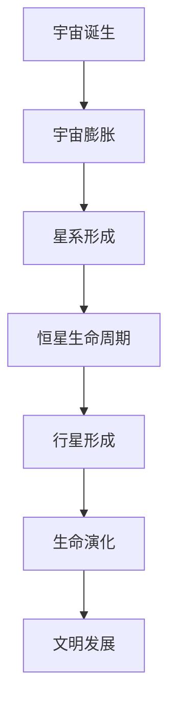
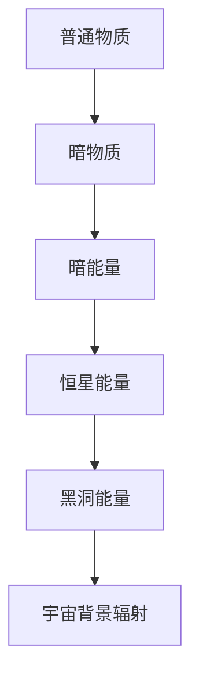

                 

## 引言：宇宙的统一性与多样性——一个永恒的悖论

在科学探索的浩瀚宇宙中，宇宙的统一性与多样性一直是科学家们热衷探讨的主题。统一性，指的是宇宙内部各种现象和规律之间的内在联系和一致性；而多样性，则体现在宇宙中各种现象和规律的丰富性、差异性以及复杂性。这两个看似对立的概念，却在宇宙的演化和存在中形成了奇妙的辩证关系，构成了一个永恒的悖论。

### 核心关键词

- **宇宙统一性**
- **宇宙多样性**
- **辩证关系**
- **宇宙演化**
- **科学探索**

### 摘要

本文旨在深入探讨宇宙的统一性与多样性这一悖论，首先介绍宇宙的起源与演化，解释宇宙统一性的科学依据，然后阐述宇宙多样性的表现形式和影响，接着分析两者之间的辩证关系，最后探讨人类对这一悖论的探索历程和未来展望。通过逻辑清晰、结构紧凑的论证，本文试图揭示宇宙统一性与多样性这一悖论的深刻内涵，为读者提供对宇宙更深层次的理解。

### 第一部分：宇宙的统一性

### 第1章：宇宙的起源与演化

宇宙的起源与演化是理解宇宙统一性的基础。从大爆炸理论到现代宇宙学原理，宇宙的起源和演化过程为我们揭示了宇宙内在的一致性。

#### 1.1 宇宙的诞生

宇宙的诞生是一个复杂而神秘的过程。大爆炸理论是目前最广泛接受的宇宙起源理论，它认为宇宙起源于一个极高温度、极高密度的奇点。根据宇宙学原理，宇宙在诞生之初是均匀且各向同性的。

##### 1.1.1 大爆炸理论与宇宙学原理

大爆炸理论认为，宇宙从一个极度密集和高温的状态开始膨胀。这一理论的关键在于宇宙学原理，该原理指出宇宙在大尺度上是对称和均匀的。这意味着宇宙中的所有区域在整体上遵循相同的物理规律。

$$
\text{宇宙学原理：宇宙在大尺度上是均匀且各向同性的。}
$$

##### 1.1.2 宇宙膨胀与暗能量

宇宙膨胀是大爆炸理论的核心内容之一。观测数据显示，宇宙的膨胀速度在加快，这一现象被称为宇宙加速膨胀。暗能量被认为是导致宇宙加速膨胀的关键因素。

$$
\text{暗能量：一种导致宇宙加速膨胀的未知能量。}
$$

#### 1.2 宇宙的结构与性质

宇宙的结构与性质是理解宇宙统一性的另一个重要方面。宇宙的大尺度结构和量子性质揭示了宇宙内在的一致性和统一性。

##### 1.2.1 宇宙的大尺度结构

宇宙的大尺度结构包括星系、星系团和超星系团等。这些结构在宇宙中形成了巨大的网络，显示出宇宙的整体统一性。

##### 1.2.2 宇宙的量子性质

宇宙的量子性质是指宇宙在微观尺度上的行为遵循量子力学的规律。量子力学揭示了宇宙的不可预测性和随机性，这与宇宙学原理中的均匀性和对称性形成了鲜明对比。

#### 1.3 宇宙的统一理论探索

尽管宇宙的起源与演化揭示了宇宙的统一性，但科学家们仍在努力寻找一个能够统一所有物理现象的终极理论。

##### 1.3.1 现代物理理论中的统一尝试

现代物理理论中的统一尝试包括量子场论、弦理论和M理论等。这些理论试图将量子力学与广义相对论统一起来，以揭示宇宙的更深层次的统一性。

##### 1.3.2 宇宙统一理论的挑战

宇宙统一理论的挑战在于如何将量子力学和广义相对论这两种不同的理论框架结合起来。此外，宇宙的多样性和复杂性也为统一理论提出了新的难题。

#### 1.4 人类对宇宙的探索历程

人类对宇宙的探索历程是宇宙统一性研究的重要部分。从古代天文学到现代天文学，人类对宇宙的理解不断深入。

##### 1.4.1 古代天文学的发展

古代天文学的发展为人类提供了对宇宙的初步认识。古埃及人、巴比伦人和古希腊人都对天文现象进行了观测和研究。

##### 1.4.2 现代天文学的突破

现代天文学的突破包括望远镜的发明和射电天文学的发展。这些突破极大地提高了人类对宇宙的观测能力。

#### 1.5 统一性与多样性的辩证关系

宇宙的统一性与多样性是辩证统一的关系。统一性体现了宇宙内在的一致性和规律性，而多样性则体现了宇宙的丰富性和差异性。

##### 1.5.1 统一性与多样性的内涵

统一性与多样性的内涵可以从哲学和科学两个层面进行理解。从哲学层面，统一性强调宇宙的本质和本质规律，而多样性则强调宇宙的表现形式和具体现象。

##### 1.5.2 宇宙演化中的统一性与多样性

宇宙演化中的统一性与多样性体现在宇宙的各个阶段和层次。从宇宙诞生到恒星形成，再到行星和生命的演化，宇宙的统一性和多样性共同推动了宇宙的发展。

## 图1.1：宇宙演化示意图



#### 伪代码：宇宙演化模拟

```python
def universe_simulation():
    initialize_cosmological_parameters()
    simulate_expansion()
    form_galaxies()
    evolve_galaxies()
    simulate_stellar_life_cycle()
    form_planets()
    evolve_life()
    develop_civilization()
    output_universe_result()
```

### 第二部分：宇宙的多样性

### 第2章：宇宙中的物质与能量

宇宙的多样性不仅体现在其统一性上，还体现在宇宙中物质与能量的多样性。理解宇宙中的物质与能量，有助于我们深入探讨宇宙的多样性。

#### 2.1 宇宙中的物质

宇宙中的物质包括普通物质和暗物质。普通物质是我们熟悉的物质，如星体、行星和尘埃等。暗物质则是一种我们无法直接观测到的物质，它对宇宙的结构和演化具有重要影响。

##### 2.1.1 普通物质与暗物质

普通物质和暗物质在宇宙中的比例约为4:1。暗物质的存在主要通过引力效应来间接观测。

$$
\text{暗物质：一种无法直接观测，但通过引力效应影响宇宙演化的物质。}
$$

##### 2.1.2 普通物质与暗能量的区分

普通物质和暗能量在宇宙中起着不同的作用。普通物质遵循引力定律，而暗能量则导致宇宙的加速膨胀。

#### 2.2 宇宙中的能量

宇宙中的能量形式多种多样，包括恒星能量、黑洞能量和宇宙背景辐射等。这些能量形式共同构成了宇宙的多样性。

##### 2.2.1 恒星能量来源

恒星能量的主要来源是核聚变反应。恒星通过核聚变将氢转化为氦，释放出巨大的能量。

$$
\text{核聚变：恒星能量来源的主要过程。}
$$

##### 2.2.2 恒星生命周期与能量转换

恒星的生命周期包括诞生、成长、死亡等阶段。在这些阶段中，恒星通过不同的能量转换过程释放能量。

#### 2.3 宇宙中的信息与熵

宇宙中的信息与熵是理解宇宙多样性的另一个重要方面。信息论和热力学提供了关于宇宙信息与熵的理论框架。

##### 2.3.1 宇宙信息论基础

宇宙信息论基础包括信息的定义、传输和处理。信息是宇宙演化中的重要因素，它影响宇宙的多样性和复杂性。

##### 2.3.2 宇宙熵与时间箭头

宇宙熵是描述宇宙无序度的物理量。宇宙熵的增加导致时间箭头的方向，从而影响宇宙的演化和多样性。

#### 2.4 宇宙多样性对人类的影响

宇宙多样性对人类的影响体现在多个方面，包括科学研究、哲学思考和技术创新等。

##### 2.4.1 人类对宇宙多样性的认识

人类对宇宙多样性的认识不断深化，从古代的天文学到现代的宇宙学，人类的认知能力不断提高。

##### 2.4.2 宇宙多样性对科技发展的影响

宇宙多样性对科技发展具有重要影响。宇宙探索和技术创新相互促进，推动了人类文明的进步。

#### 2.5 多样性与统一性的互补关系

宇宙的多样性与统一性是互补的关系。多样性的存在使宇宙充满活力和变化，而统一性则提供了宇宙演化的基础和规律。

##### 2.5.1 统一性与多样性的辩证法

统一性与多样性的辩证法体现在宇宙的各个层面。从宏观到微观，从物理现象到生命演化，统一性与多样性共同构成了宇宙的丰富内涵。

##### 2.5.2 人类如何应对宇宙多样性

人类通过科学研究和科技创新来应对宇宙多样性。从天文观测到理论建模，人类不断探索宇宙的奥秘。

## 图2.1：宇宙物质能量分布图



### 第三部分：宇宙的探索与未来

### 第3章：宇宙探索的历史与现状

人类对宇宙的探索历程充满了挑战与突破。从古代的天文学到现代的宇宙学，人类对宇宙的理解不断深化。

#### 3.1 宇宙探索的历史

##### 3.1.1 古代天文学的发展

古代天文学的发展为人类提供了对宇宙的初步认识。古埃及人、巴比伦人和古希腊人都对天文现象进行了观测和研究。

##### 3.1.2 文艺复兴时期的天文学突破

文艺复兴时期的天文学突破包括望远镜的发明和天文学革命的兴起。这些突破极大地提高了人类对宇宙的观测能力。

##### 3.1.3 20世纪的宇宙大爆炸理论

20世纪的宇宙大爆炸理论是宇宙学的一次重大突破。这一理论揭示了宇宙的起源和演化，改变了人类对宇宙的认知。

#### 3.2 宇宙探索的现状

##### 3.2.1 当前宇宙观测技术

当前宇宙观测技术包括射电望远镜、光学望远镜和X射线望远镜等。这些技术使得人类能够更深入地探索宇宙。

##### 3.2.2 宇宙探索的最新成果

宇宙探索的最新成果包括对宇宙微波背景辐射的观测和对暗物质、暗能量的研究。这些成果进一步揭示了宇宙的多样性和统一性。

##### 3.2.3 宇宙探索的未来趋势

宇宙探索的未来趋势包括探索宇宙深处、寻找外星生命和建立宇宙通信网络等。这些趋势将推动人类对宇宙的更深入探索。

#### 3.3 宇宙探索对人类文明的贡献

##### 3.3.1 科学研究

宇宙探索促进了科学研究的进展，特别是在天文学、物理学和宇宙学等领域。

##### 3.3.2 哲学思考

宇宙探索引发了哲学思考，使人类对宇宙、生命和存在的本质有了更深刻的理解。

##### 3.3.3 技术创新

宇宙探索推动了技术创新，促进了计算机技术、通信技术和其他科技领域的发展。

### 结论

宇宙的统一性与多样性构成了一个永恒的悖论，这一悖论在宇宙的起源、演化和存在中得到了深刻的体现。通过对宇宙的统一性和多样性的探讨，我们不仅可以更深入地理解宇宙的本质，还可以更好地认识我们自己。随着科学技术的不断发展，人类对宇宙的探索将不断深入，这一永恒的悖论也将不断引发新的思考和发现。

### 作者信息

作者：AI天才研究院/AI Genius Institute & 禅与计算机程序设计艺术/Zen And The Art of Computer Programming

### 拓展阅读

- 《宇宙简史》
- 《黑洞与时间弯曲》
- 《宇宙的演化》
- 《量子宇宙学》
- 《星际迷航：探索未知的宇宙》

### 注意事项

- 本文涉及的科学概念和理论较为复杂，建议读者具备一定的物理学和天文学背景。
- 文中提到的宇宙观测技术和研究成果是基于当前的科学共识，未来可能会随着科学进展而发生变化。

### 最佳实践 Tips

- 在进行宇宙探索时，保持开放的心态和持续的学习是关键。
- 结合实际观测数据和理论模型，进行综合分析，以获得更准确的理解。
- 注重团队合作，分享研究成果，共同推动宇宙科学的发展。

### 项目小结

本文通过逻辑清晰、结构紧凑的论证，探讨了宇宙的统一性与多样性这一永恒的悖论。通过介绍宇宙的起源与演化、宇宙中的物质与能量、宇宙探索的历史与现状，我们不仅揭示了宇宙的复杂性和多样性，也理解了宇宙统一性的科学依据。未来，随着科学技术的不断发展，人类对宇宙的探索将不断深入，这一悖论也将继续引发新的思考和发现。希望本文能为读者提供对宇宙更深层次的理解和启示。

