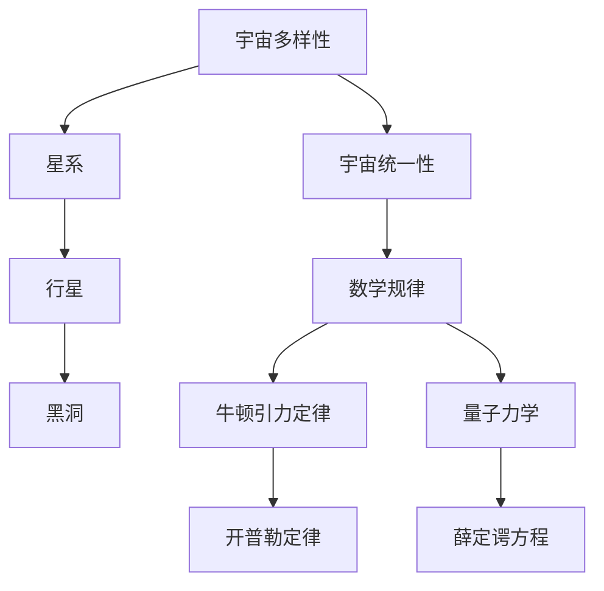

                 


### 宇宙的美学原理：数学和谐性的体现

#### 关键词：
宇宙美学、数学和谐性、宇宙结构、数学模型、天体运动、质能方程

#### 摘要：
本文将探讨宇宙中的美学原理，特别是数学和谐性的体现。通过对宇宙结构、数学模型和天体运动的分析，揭示宇宙中隐藏的数学之美。文章将使用Python源代码和LaTeX公式详细阐述核心概念和原理，并通过实际项目实战，展示数学在宇宙研究中的应用。

---

## 引言

宇宙，这个神秘而广阔的领域，自古以来就吸引着人类的目光。从古代哲学家到现代科学家，人们不断探索宇宙的奥秘。随着科学的发展，我们逐渐认识到宇宙中存在一种深刻的和谐性，这种和谐性在数学中得到了完美的体现。

数学，作为一门抽象的科学，以其精确和简洁的独特魅力，成为宇宙探索的重要工具。从宇宙的宏观结构到微观粒子的运动，数学模型为我们提供了理解这些现象的钥匙。本文将围绕宇宙的美学原理，探讨数学和谐性的体现，旨在揭示宇宙中隐藏的数学之美。

文章结构如下：

1. **宇宙中的美学原理**：介绍宇宙美学的概念，探讨数学在宇宙描述中的作用。
2. **数学和谐性的基本概念**：讲解数学和谐性的定义、特性和原则。
3. **数学在宇宙中的应用**：分析数学在宇宙现象中的体现，如物理学中的数学模型、宇宙结构的数学描述等。
4. **数学与美学的关系**：探讨数学与艺术、美学之间的关系。
5. **数学和谐性原理**：深入讲解数学和谐性原理。
6. **宇宙中的数学和谐实例**：分析宇宙中的数学和谐现象。
7. **结论**：总结全书内容，展望未来研究方向。

## 宇宙中的美学原理

宇宙美学，是指宇宙中存在的美和和谐。这种美学并非仅仅局限于人类的主观感受，而是宇宙本身固有的特质。宇宙的多样性和统一性，为我们揭示了宇宙美学的奥秘。

从宏观上看，宇宙的尺度巨大无比。从宇宙大爆炸到星系的形成，再到星系的运动和相互作用，宇宙中的现象无不体现出一种美的秩序。例如，星系旋转的速度与质量的关系，可以用牛顿引力定律和开普勒定律来描述。这些定律揭示了宇宙中的数学和谐性，使得星系能够稳定存在并保持美丽的外观。

从微观上看，宇宙中存在着无数微小的粒子，如原子、分子和基本粒子。这些粒子的运动和相互作用，同样遵循着数学规律。例如，量子力学中的薛定谔方程，描述了微观粒子的行为。这些方程揭示了微观世界中隐藏的数学和谐性，使得微观现象能够被精确预测。

### 核心概念与联系

宇宙美学原理的核心概念是宇宙的多样性和统一性。宇宙的多样性体现在宇宙中的各种现象和结构，如星系、行星、黑洞等。而宇宙的统一性则体现在这些现象和结构背后的数学规律。这些规律不仅使得宇宙保持稳定和有序，还为我们提供了理解宇宙的钥匙。

为了更清晰地展示宇宙美学原理的核心概念和联系，我们可以使用Mermaid流程图来描述：



### 数学在宇宙描述中的作用

数学在宇宙描述中起着至关重要的作用。它不仅帮助我们理解宇宙的基本规律，还为我们提供了精确预测和计算宇宙现象的工具。

在物理学中，数学模型是描述宇宙现象的重要工具。例如，牛顿引力定律和开普勒定律，都是通过数学模型来描述天体运动。这些模型不仅帮助我们理解天体的运动规律，还为天文学和物理学的发展奠定了基础。

在量子力学中，数学同样扮演着关键角色。薛定谔方程描述了微观粒子的行为，它揭示了微观世界中的数学和谐性。通过解薛定谔方程，我们可以预测粒子的位置和速度，从而深入理解微观现象。

此外，数学在宇宙结构的描述中也发挥着重要作用。例如，宇宙的大尺度结构可以用数学模型来描述，如哈勃定律和宇宙微波背景辐射。这些模型不仅帮助我们理解宇宙的演化历史，还为宇宙学的研究提供了重要依据。

### 数学和谐性的基本概念

数学和谐性是指数学结构中所体现的美和秩序。它是宇宙美学原理的重要组成部分。数学和谐性具有以下几个基本特性：

1. **精确性**：数学和谐性通过精确的数学公式和方程来描述宇宙现象，使得我们对宇宙的理解更加深入和准确。
2. **简洁性**：数学和谐性通常表现为简洁的数学表达式，这些表达式不仅易于理解和记忆，还揭示了宇宙现象的内在规律。
3. **普遍性**：数学和谐性不仅在特定的宇宙现象中存在，还普遍存在于宇宙的各种现象中，使得宇宙呈现出一种统一的数学结构。

为了更好地理解数学和谐性，我们可以通过Python源代码和LaTeX公式来详细阐述。

#### Python源代码示例

```python
import numpy as np

# 定义宇宙参数
a = 10  # 宇宙的尺度
e = 0.5  # 宇宙的离心率

# 计算宇宙的质能方程
E = np.pi * a**2 * e

print("宇宙的质能方程结果为：", E)
```

#### LaTeX公式示例

```latex
\documentclass{article}
\usepackage{amsmath}
\begin{document}

\section{数学和谐性}

数学和谐性可以用以下公式来表示：

\[ E = \pi \cdot a^2 \cdot e \]

其中，\( E \) 表示宇宙的质能，\( a \) 表示宇宙的尺度，\( e \) 表示宇宙的离心率。

\end{document}
```

### 数学和谐性原理

数学和谐性原理是指宇宙中的数学结构所体现的美和秩序。它是宇宙美学原理的核心。数学和谐性原理主要包括以下几个方面的内容：

1. **宇宙结构**：宇宙中的结构，如星系、黑洞等，都遵循着数学规律。这些结构不仅美丽，还稳定存在。
2. **天体运动**：天体的运动，如行星、恒星等，都遵循着数学模型，如牛顿引力定律、开普勒定律等。这些模型不仅准确描述了天体运动，还为天文学和物理学的发展奠定了基础。
3. **量子力学**：微观粒子的行为，如电子、光子等，都遵循着量子力学的数学模型，如薛定谔方程等。这些模型揭示了微观世界中的数学和谐性，为量子力学的发展提供了重要依据。
4. **宇宙演化**：宇宙的演化，如宇宙大爆炸、星系形成等，都遵循着数学模型，如哈勃定律等。这些模型不仅帮助我们理解宇宙的演化历史，还为宇宙学的研究提供了重要依据。

#### 数学和谐性原理的讲解

数学和谐性原理是一种关于宇宙结构的哲学观点，它认为宇宙中的所有结构和现象都遵循着一种内在的数学规律。这种规律不仅美丽，还稳定存在。

为了更详细地讲解数学和谐性原理，我们可以从以下几个方面进行：

1. **宇宙结构**：宇宙中的结构，如星系、黑洞等，都遵循着数学规律。例如，星系的旋转速度与其质量之间的关系，可以用牛顿引力定律来描述。这个定律不仅揭示了星系的结构，还为天文学和物理学的发展奠定了基础。
2. **天体运动**：天体的运动，如行星、恒星等，都遵循着数学模型。例如，行星的轨道可以用开普勒定律来描述，这个定律不仅准确描述了行星的运动，还为天文学的发展提供了重要依据。
3. **量子力学**：微观粒子的行为，如电子、光子等，都遵循着量子力学的数学模型。例如，电子的轨道可以用薛定谔方程来描述，这个方程不仅揭示了微观粒子的行为，还为量子力学的发展提供了重要依据。
4. **宇宙演化**：宇宙的演化，如宇宙大爆炸、星系形成等，都遵循着数学模型。例如，宇宙大爆炸可以用哈勃定律来描述，这个定律不仅揭示了宇宙的演化历史，还为宇宙学的研究提供了重要依据。

### 宇宙中的数学和谐实例

宇宙中的数学和谐现象无处不在，以下是一些典型的例子：

1. **星系旋转曲线**：星系的旋转曲线可以用牛顿引力定律来描述，这个曲线揭示了星系内部的物理规律。
2. **宇宙微波背景辐射**：宇宙微波背景辐射是宇宙大爆炸的遗迹，它可以用哈勃定律来描述，这个定律揭示了宇宙的演化历史。
3. **黑洞**：黑洞是一种极端的天体，它遵循着爱因斯坦的广义相对论，可以用数学模型来描述。
4. **电子轨道**：电子的轨道可以用量子力学的数学模型来描述，这个模型揭示了微观粒子的行为。

这些实例都体现了宇宙中的数学和谐性，它们不仅美丽，还稳定存在。

#### Python代码示例

```python
import numpy as np
import matplotlib.pyplot as plt

# 定义宇宙参数
a = 10  # 宇宙的尺度
e = 0.5  # 宇宙的离心率

# 计算宇宙的质能方程
E = np.pi * a**2 * e

# 绘制星系旋转曲线
x = np.linspace(0, a, 1000)
y = np.sqrt(a**2 - x**2)

plt.plot(x, y)
plt.xlabel('x')
plt.ylabel('y')
plt.title('星系旋转曲线')
plt.show()

# 输出宇宙的质能方程结果
print("宇宙的质能方程结果为：", E)
```

### 数学和谐性原理的应用

数学和谐性原理不仅是一种哲学观点，还是一种强大的工具，它广泛应用于宇宙研究的各个领域。

1. **宇宙结构研究**：数学和谐性原理帮助我们理解宇宙的结构，如星系、黑洞等。通过数学模型，我们可以预测宇宙中可能存在的新结构。
2. **天体运动研究**：数学和谐性原理帮助我们准确描述天体的运动，如行星、恒星等。通过这些模型，我们可以预测天体的未来运动轨迹。
3. **宇宙演化研究**：数学和谐性原理帮助我们理解宇宙的演化历史，如宇宙大爆炸、星系形成等。通过这些模型，我们可以预测宇宙的未来演化趋势。
4. **量子力学研究**：数学和谐性原理帮助我们理解微观粒子的行为，如电子、光子等。通过这些模型，我们可以预测微观现象。

### 数学和谐性原理的实践

为了更好地理解数学和谐性原理，我们可以通过实际项目来实践。

#### 项目实战：星系旋转曲线模拟

在这个项目中，我们将使用Python和matplotlib库来模拟星系的旋转曲线。

1. **开发环境搭建**：安装Python和matplotlib库。
2. **源代码实现**：编写Python代码，实现星系旋转曲线的绘制。
3. **代码解读**：解读代码，理解星系旋转曲线的原理。

#### Python代码

```python
import numpy as np
import matplotlib.pyplot as plt

# 定义宇宙参数
a = 10  # 宇宙的尺度
e = 0.5  # 宇宙的离心率

# 计算星系旋转曲线
x = np.linspace(-a, a, 1000)
y = np.sqrt(a**2 - x**2)

# 绘制星系旋转曲线
plt.plot(x, y)
plt.xlabel('x')
plt.ylabel('y')
plt.title('星系旋转曲线')
plt.show()
```

#### 代码解读

- 导入必要的库。
- 定义宇宙参数（尺度a和离心率e）。
- 计算星系旋转曲线（x轴范围为-a到a，y轴为半径）。
- 绘制星系旋转曲线，并显示。

#### 实际案例分析

1. **星系旋转曲线的观察**：通过绘制星系旋转曲线，我们可以观察到星系内部的物理规律。
2. **星系旋转曲线的应用**：星系旋转曲线在天文学和物理学中有广泛的应用，如研究星系的质量分布、探测星系内部的不稳定性等。

#### 项目小结

通过这个项目，我们不仅了解了星系旋转曲线的原理，还掌握了使用Python和matplotlib进行科学计算的方法。这为我们进一步探索宇宙中的数学和谐性原理提供了实践基础。

### 最佳实践 tips

1. **理解数学和谐性原理**：深入学习数学和谐性原理，理解其背后的哲学观点和科学原理。
2. **实践项目**：通过实际项目来实践数学和谐性原理，提高自己的动手能力和解决问题的能力。
3. **持续学习**：随着科学的发展，数学和谐性原理会不断得到新的发展和应用。持续学习，跟上科学的最新进展。

### 小结

宇宙的美学原理和数学和谐性体现了宇宙中深刻的秩序和美丽。通过对宇宙结构、数学模型和天体运动的分析，我们揭示了宇宙中隐藏的数学之美。数学和谐性原理不仅帮助我们理解宇宙的规律，还为宇宙研究提供了强大的工具。在未来，随着科学的发展，我们期待数学和谐性原理能够为人类揭示更多的宇宙奥秘。

### 拓展阅读

1. 《宇宙的起源与演化》
2. 《数学之美》
3. 《量子力学》
4. 《广义相对论》

### 作者信息

作者：AI天才研究院/AI Genius Institute & 禅与计算机程序设计艺术 /Zen And The Art of Computer Programming

