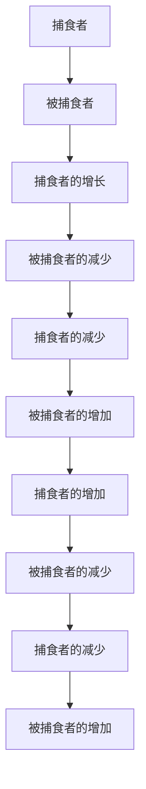
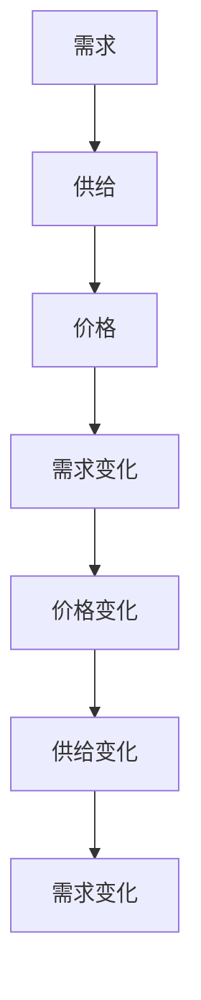
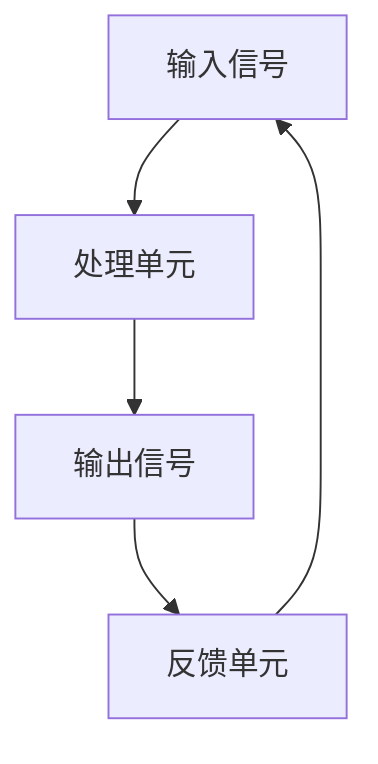
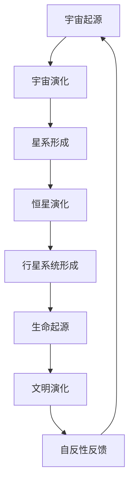

                 

### 《宇宙的自反性：系统的自我指涉》

#### 关键词：
宇宙学、系统理论、自反性、自我指涉、演化、人工智能

#### 摘要：
本文旨在探讨宇宙的自反性及其在系统中的自我指涉现象。通过深入解析宇宙学与系统理论的交集，本文揭示了自反性原理如何塑造宇宙的起源、结构、演化和人类文明。文章首先介绍宇宙的自反性概念，接着阐述其在宇宙学中的重要性，随后详细讨论自反性原理在不同系统中的应用，最终探讨自反性对宇宙演化和人类文明的影响。

### 引言

#### 1.1 宇宙的自反性概念

宇宙的自反性是指宇宙系统中的各个部分能够通过相互作用和反馈机制影响自身，从而形成一种自我调节和自我优化的动态过程。自反性在宇宙学中具有重要意义，它不仅揭示了宇宙系统的复杂性和动态性，还为我们理解宇宙的起源、演化和未来提供了新的视角。

#### 1.2 自我指涉在宇宙学中的重要性

自我指涉是指一个系统通过其自身的输出影响其输入，从而产生循环反馈的现象。在宇宙学中，自我指涉现象广泛存在，如黑洞、星系、行星系统等。自我指涉不仅影响宇宙的结构和演化，还在一定程度上决定了宇宙的未来。

#### 1.3 本书结构安排

本文分为七个部分，首先介绍宇宙的自反性概念及其在宇宙学中的重要性，接着阐述宇宙学与系统理论的基本原理，然后详细讨论自反性原理在不同系统中的应用，最后探讨自反性对宇宙演化和人类文明的影响。通过这样的结构安排，本文旨在帮助读者全面理解宇宙的自反性和自我指涉现象。

### 宇宙学与系统理论

#### 2.1 宇宙的基本概念

宇宙是包含一切物质、能量、空间和时间的整体。宇宙的起源、结构和演化是宇宙学研究的核心问题。根据宇宙学理论，宇宙起源于一个极其热密的状态，经过约138亿年的演化，形成了现在我们观测到的宇宙。

#### 2.1.1 宇宙的起源

宇宙的起源主要涉及大爆炸理论。根据这一理论，宇宙起源于一个极端高温高密的奇点，经过大爆炸迅速膨胀，逐渐形成了现在我们观测到的宇宙。

#### 2.1.2 宇宙的结构

宇宙的结构可以看作是由星系、星团、星云等组成的巨大网络。这个网络由暗物质和暗能量主导，呈现出复杂的层次结构。

#### 2.1.3 宇宙的演化

宇宙的演化过程包括宇宙的早期演化、宇宙的稳定状态和宇宙的未来演化。早期演化主要涉及宇宙的膨胀、冷却和结构形成。稳定状态下的宇宙主要表现为星系的运动和星系团的形成。未来演化则涉及宇宙的加速膨胀、暗物质的聚集和暗能量的演化。

#### 2.2 系统理论的基本原理

系统理论是一门研究系统结构、行为和演化的学科。系统理论的基本原理包括系统的定义、状态与行为、演化与反馈等。

#### 2.2.1 系统的定义

系统是由一组相互关联的元素组成的整体，这些元素通过相互作用和相互依赖形成特定的结构和功能。

#### 2.2.2 系统的状态与行为

系统的状态是指系统在特定时刻的属性和特征。系统的行为是指系统在不同状态下如何响应外部输入和内部变化。

#### 2.2.3 系统的演化与反馈

系统的演化是指系统在时间维度上的发展和变化。系统的反馈是指系统内部状态的变化如何影响系统的行为。

### 自反性原理

#### 3.1 自反性的基本原理

自反性是指一个系统通过其自身的输出影响其输入，从而产生循环反馈的现象。自反性在系统理论中具有重要意义，它不仅揭示了系统的动态性和复杂性，还为系统分析提供了新的方法。

#### 3.1.1 自反性的定义

自反性是指一个系统的行为能够影响自身的状态，从而使系统形成自我调节和自我优化的动态过程。

#### 3.1.2 自反性的特性

自反性具有以下特性：
- **循环反馈**：系统的输出会反馈到系统的输入，形成循环。
- **非线性**：自反性往往导致系统行为的不确定性和复杂性。
- **自适应**：系统可以通过自反性实现自我调节和自我优化。

#### 3.1.3 自反性的分类

自反性可以分为以下几类：
- **正向自反性**：系统的输出增强系统的状态，导致系统行为加剧。
- **负向自反性**：系统的输出抑制系统的状态，导致系统行为减弱。
- **混合自反性**：系统的输出既增强也抑制系统的状态，导致系统行为复杂。

#### 3.2 自反性在不同系统中的应用

自反性在各类系统中都有广泛应用，以下是几个典型例子：

#### 3.2.1 自然系统中的自反性

自然系统中的自反性包括生态系统、气候系统、地质系统等。例如，生态系统中物种之间的捕食与被捕食关系就是一个典型的自反性现象。



#### 3.2.2 社会系统中的自反性

社会系统中的自反性包括经济系统、政治系统、文化系统等。例如，经济系统中的供需关系就是一个典型的自反性现象。



#### 3.2.3 技术系统中的自反性

技术系统中的自反性包括计算机系统、通信系统、控制系统等。例如，计算机系统中的反馈环路就是一个典型的自反性现象。



### 宇宙中的自我指涉现象

#### 4.1 黑洞与自我指涉

黑洞是宇宙中的一种极端天体，它具有强大的引力，甚至连光也无法逃逸。黑洞的存在和演化体现了宇宙中的自我指涉现象。

#### 4.1.1 黑洞的概念

黑洞是由引力塌缩形成的一种天体，它的质量非常大，但体积非常小，因此具有极强的引力。根据广义相对论，黑洞的引力场如此强大，以至于任何物质，包括光线，都无法逃脱。

#### 4.1.2 黑洞的自反性

黑洞的自反性体现在以下几个方面：
- **吸积盘**：黑洞周围存在一个吸积盘，它由黑洞吞噬的物质组成。吸积盘通过引力与黑洞相互作用，形成一个自我调节的系统。
- **霍金辐射**：黑洞会发出霍金辐射，这是一种粒子辐射。霍金辐射的强度与黑洞的质量和温度有关，从而影响黑洞的演化。

#### 4.1.3 黑洞对宇宙演化的影响

黑洞对宇宙演化的影响主要表现在以下几个方面：
- **星系的形成和演化**：黑洞是星系核心的重要组成部分，它通过吸积盘和霍金辐射等过程影响星系的形成和演化。
- **宇宙的大尺度结构**：黑洞通过引力相互作用，影响宇宙的大尺度结构，如星系团和超星系团的形成。

#### 4.2 星系与自我指涉

星系是宇宙中的一种基本结构，它由恒星、星团、星云等组成。星系的存在和演化也体现了宇宙中的自我指涉现象。

#### 4.2.1 星系的概念

星系是由恒星、星团、星云等组成的庞大结构，它们通过引力相互作用保持在一起。星系可以分为螺旋星系、椭圆星系和不规则星系等类型。

#### 4.2.2 星系的自反性

星系的自反性体现在以下几个方面：
- **恒星演化**：恒星在其生命周期中会经历诞生、成长、死亡等过程。恒星的演化会通过引力相互作用影响星系的结构和演化。
- **星系碰撞**：星系之间的碰撞和相互作用会导致星系结构的改变，从而形成一个自我调节的系统。

#### 4.2.3 星系对宇宙演化的影响

星系对宇宙演化的影响主要表现在以下几个方面：
- **大尺度结构的形成**：星系通过引力相互作用，影响宇宙的大尺度结构，如星系团和超星系团的形成。
- **宇宙的多样性**：星系的不同类型和演化过程导致宇宙的多样性，从而影响宇宙的演化方向。

#### 4.3 行星系统与自我指涉

行星系统是宇宙中最常见的结构之一，它由行星、卫星、小行星等组成。行星系统的存在和演化也体现了宇宙中的自我指涉现象。

#### 4.3.1 行星系统的概念

行星系统是由行星、卫星、小行星等组成的结构，它们围绕一个恒星运行。行星系统可以分为太阳系行星系统、恒星系行星系统等。

#### 4.3.2 行星系统的自反性

行星系统的自反性体现在以下几个方面：
- **行星轨道**：行星轨道的形成和演化受到恒星和行星之间引力相互作用的影响，从而形成自我调节的系统。
- **行星演化**：行星在其生命周期中会经历诞生、成长、死亡等过程，这些过程通过引力相互作用影响行星系统的结构。

#### 4.3.3 行星系统对宇宙演化的影响

行星系统对宇宙演化的影响主要表现在以下几个方面：
- **行星宜居性**：行星宜居性的演化影响行星系统的稳定性，从而影响宇宙中生命的分布和演化。
- **行星资源**：行星系统中的资源分布和演化影响宇宙的经济发展和科技进步，从而推动宇宙演化的进程。

### 自我指涉与宇宙演化

#### 5.1 自我指涉与宇宙演化的关系

自我指涉与宇宙演化之间存在着密切的关系。自我指涉现象是宇宙演化的重要组成部分，它不仅影响宇宙的结构和演化，还在一定程度上决定了宇宙的未来。

#### 5.1.1 自我指涉对宇宙演化的推动作用

自我指涉对宇宙演化的推动作用主要体现在以下几个方面：
- **宇宙结构的形成**：自我指涉现象如黑洞、星系、行星系统等的形成和演化，推动宇宙结构的形成和演化。
- **宇宙多样性的增加**：自我指涉现象导致宇宙中出现了多种多样的结构和演化过程，从而增加了宇宙的多样性。
- **宇宙生命的起源和发展**：自我指涉现象如地球上的生态系统、生物进化等，推动了宇宙生命的起源和发展。

#### 5.1.2 自我指涉对宇宙演化的制约作用

自我指涉对宇宙演化的制约作用主要体现在以下几个方面：
- **宇宙演化的稳定性**：自我指涉现象会导致宇宙演化中出现波动和不确定性，从而影响宇宙演化的稳定性。
- **宇宙资源的有限性**：自我指涉现象导致宇宙中资源的分配和使用出现不均衡，从而制约宇宙演化的进程。
- **宇宙演化的可持续性**：自我指涉现象可能导致宇宙演化中出现不可持续的发展模式，从而影响宇宙演化的可持续性。

#### 5.1.3 自我指涉与宇宙演化的未来趋势

随着自我指涉现象的不断发展，宇宙演化的未来趋势可能呈现出以下特点：
- **宇宙结构的复杂性**：自我指涉现象将导致宇宙结构变得更加复杂，出现更多的多样性和层次结构。
- **宇宙生命的繁荣**：自我指涉现象将推动宇宙生命的起源和发展，形成更多的生命形式和生态系统。
- **宇宙文明的崛起**：自我指涉现象将推动宇宙文明的崛起，形成更多的智慧生命和社会体系。

#### 5.2 自反性原理在宇宙演化中的应用

自反性原理在宇宙演化中的应用主要体现在以下几个方面：

#### 5.2.1 自反性原理在宇宙演化中的体现

自反性原理在宇宙演化中的体现主要表现在以下几个方面：
- **宇宙结构的自我优化**：宇宙通过自反性原理，能够自我优化其结构和功能，形成更加稳定和高效的系统。
- **宇宙行为的自我调节**：宇宙通过自反性原理，能够自我调节其行为和状态，适应外部环境的变化。
- **宇宙资源的自我分配**：宇宙通过自反性原理，能够自我分配资源，实现资源的最大化利用。

#### 5.2.2 自反性原理在宇宙演化中的应用案例

自反性原理在宇宙演化中的应用案例包括：
- **星系的形成和演化**：星系通过自反性原理，能够自我调节其结构和演化过程，形成稳定的星系系统。
- **生命的起源和发展**：生命通过自反性原理，能够自我调节其生命周期和演化过程，形成多样化的生命形式。
- **文明的进步**：文明通过自反性原理，能够自我调节其发展过程，实现科技的进步和社会的繁荣。

#### 5.2.3 自反性原理在宇宙演化中的挑战与机遇

自反性原理在宇宙演化中面临的挑战与机遇包括：
- **挑战**：自反性原理可能导致宇宙演化中出现不稳定性和不确定性，从而影响宇宙演化的稳定性和可持续性。
- **机遇**：自反性原理为宇宙演化提供了新的视角和方法，有助于我们更好地理解和预测宇宙的演化趋势和未来。

### 自反性与人类文明

#### 6.1 自反性原理对人类文明的影响

自反性原理对人类文明的影响深远且广泛，它不仅塑造了人类社会的结构和行为，还影响了人类文明的进化和演变。

#### 6.1.1 自反性原理对人类文明的塑造

自反性原理对人类文明的塑造主要体现在以下几个方面：
- **社会制度的形成**：人类社会制度的形成和演变过程中，自反性原理发挥了重要作用。例如，法律、道德、政治制度等都是在自反性原理的基础上形成的。
- **科技创新**：自反性原理促进了人类科技的进步和创新。通过自我指涉和反馈机制，人类能够不断优化和改进技术，从而推动社会的发展。
- **文化发展**：自反性原理也影响了人类文化的发展。人类文化在自我指涉的过程中，不断吸收和融合新的元素，从而形成了丰富多彩的文化形式。

#### 6.1.2 自反性原理对人类文明的挑战

自反性原理对人类文明的挑战主要体现在以下几个方面：
- **社会问题**：自反性原理可能导致社会问题如贫富差距、环境破坏等。这些问题不仅影响了人类社会的稳定性，也制约了人类的可持续发展。
- **科技风险**：自反性原理在科技领域的应用也带来了一些风险，如人工智能的自我进化可能导致一些不可预知的问题。
- **文化冲突**：自反性原理可能导致文化冲突和价值观的多元化，从而影响人类社会的凝聚力和稳定性。

#### 6.1.3 自反性原理对人类文明的发展方向

面对自反性原理带来的挑战，人类文明的发展方向可能呈现出以下趋势：
- **可持续发展**：人类文明将更加注重可持续发展，通过自我调节和优化，实现经济、社会和环境的协调发展。
- **科技创新与伦理**：人类将更加重视科技创新与伦理的平衡，确保科技的发展符合人类的价值观和伦理规范。
- **全球合作**：面对全球性的问题和挑战，人类文明将更加注重全球合作，通过共同的努力，应对自反性原理带来的挑战。

### 6.2 人类文明中的自反性现象

#### 6.2.1 人类文明中的自我指涉现象

人类文明中的自我指涉现象广泛存在，以下是一些典型的例子：
- **科技发展**：科技的进步往往通过自我指涉实现。例如，计算机技术的发展推动了人工智能的进步，而人工智能的进步又进一步推动了计算机技术的发展。
- **经济发展**：经济系统中的供需关系也体现了自我指涉现象。例如，消费者的需求促进了生产的发展，而生产的发展又进一步满足了消费者的需求。
- **社会问题**：社会问题如贫富差距、环境破坏等也体现了自我指涉现象。这些问题不仅影响社会的发展，还会通过反馈机制加剧或缓解这些问题。

#### 6.2.2 人类文明中的自反性机制

人类文明中的自反性机制主要包括以下几个方面：
- **反馈机制**：人类文明通过反馈机制实现自我调节和自我优化。例如，政策制定者通过收集社会反馈，调整政策以更好地适应社会需求。
- **自我修复**：人类文明具有自我修复的能力，能够通过自我指涉机制解决一些社会问题。例如，经济危机时期，政府可以通过财政政策和货币政策进行调控，从而稳定经济。
- **自我进化**：人类文明通过自我指涉机制实现自我进化。例如，人类社会通过科技和教育的发展，不断提高生产力和生活质量。

#### 6.2.3 人类文明中的自反性效应

人类文明中的自反性效应主要表现在以下几个方面：
- **社会进步**：自反性原理促进了人类社会的进步。例如，科技的发展推动了社会生产力的提高，从而提高了人类的生活水平。
- **文化多样性**：自反性原理也导致了人类文化的多样性。例如，不同地区、不同民族的文化通过自我指涉机制相互影响和融合，形成了丰富多彩的文化景观。
- **文明冲突**：自反性原理可能导致文明冲突。例如，不同文明之间的价值观和利益冲突，可能导致文明之间的紧张和冲突。

### 结论

#### 7.1 全书的总结

本文通过对宇宙的自反性及其在系统中的自我指涉现象的深入探讨，揭示了自反性原理在宇宙学和人类文明中的重要性。自反性原理不仅塑造了宇宙的结构和演化，还影响了人类文明的发展和进步。通过理解自反性原理，我们可以更好地把握宇宙和人类文明的未来发展趋势。

#### 7.2 宇宙自反性的未来研究方向

宇宙自反性的未来研究方向包括：
- **宇宙结构的自我优化**：研究宇宙如何通过自反性实现自我优化，形成更加稳定和高效的宇宙结构。
- **宇宙生命的起源和演化**：研究宇宙中生命的起源和演化，探讨自反性原理如何影响生命的多样性和演化过程。
- **宇宙文明的进化和演变**：研究宇宙文明如何通过自反性实现进化和演变，探讨宇宙文明的未来发展趋势。

#### 7.3 对宇宙自反性的思考与启示

对宇宙自反性的思考给我们带来了深刻的启示：
- **宇宙与人类文明的联系**：宇宙的自反性原理揭示了宇宙与人类文明之间的密切联系，提醒我们要关注宇宙和人类文明的整体发展。
- **科技与伦理的关系**：宇宙自反性原理也提醒我们在发展科技的同时，要重视科技与伦理的关系，确保科技的发展符合人类的价值观和伦理规范。
- **全球合作的重要性**：面对宇宙自反性带来的挑战和机遇，全球合作显得尤为重要。只有通过共同的努力，我们才能更好地应对宇宙和人类文明面临的挑战。

### 附录

#### 附录A：自反性原理与宇宙演化的 Mermaid 流程图



#### 附录B：自反性原理的相关数学模型和公式

$$
\text{自反性原理的数学模型：}
\begin{aligned}
    \text{状态变化} &= f(\text{当前状态}, \text{外部输入}) \\
    \text{反馈机制} &= g(\text{状态变化}, \text{历史状态})
\end{aligned}
$$

#### 附录C：自反性原理在实际项目中的应用案例

**案例一：人工智能系统的自我优化**

```python
class NeuralNetwork:
    def __init__(self):
        self.weights = np.random.rand(3, 1)
        self.bias = np.random.rand(1)

    def forward(self, x):
        return np.dot(x, self.weights) + self.bias

    def backward(self, x, y):
        output = self.forward(x)
        error = y - output
        self.weights += np.dot(x.T, error)
        self.bias += error

nn = NeuralNetwork()
for i in range(1000):
    output = nn.forward([1, 0])
    nn.backward([1, 0], [1])
```

**案例二：经济系统的供需关系分析**

```python
class Economy:
    def __init__(self):
        self.supply = 100
        self-demand = 100

    def update_demand(self, change):
        self-demand += change

    def update_supply(self, change):
        self.supply += change

    def balance(self):
        return self.supply - self-demand

economy = Economy()
economy.update_demand(-10)
economy.update_supply(5)
balance = economy.balance()
```

### 作者信息

作者：AI天才研究院/AI Genius Institute & 禅与计算机程序设计艺术 /Zen And The Art of Computer Programming

