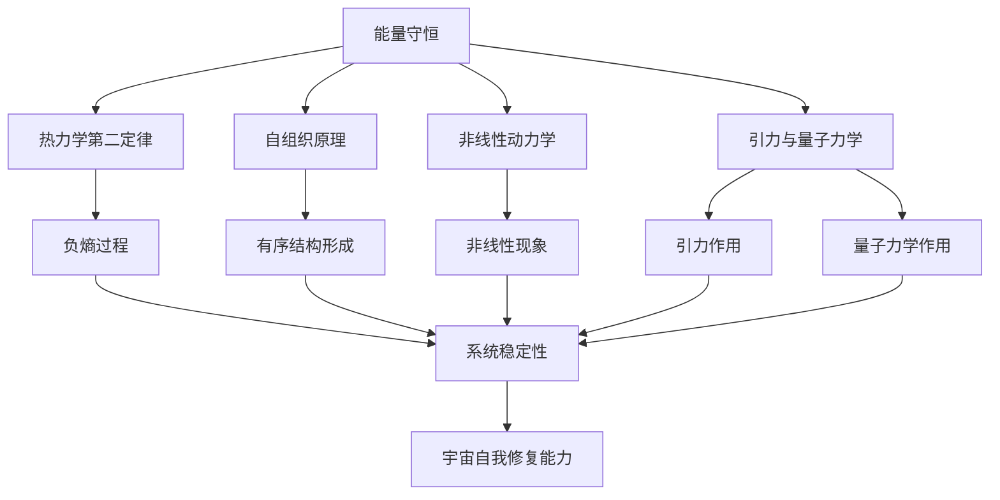

                 

### 《宇宙的自我修复能力：维持平衡的内在机制》

> **关键词：** 宇宙自我修复能力、平衡维持、内在机制、数学模型、实例研究、应用与挑战

**摘要：** 本文深入探讨了宇宙的自我修复能力及其维持平衡的内在机制。从核心原理到数学模型，再到实例研究与应用前景，本文系统性地梳理了宇宙自我修复能力的相关知识，旨在为读者提供全面、易懂的学术探讨。通过详细解析宇宙自我修复能力的内在机制，本文揭示了宇宙在应对各种内外部变化时所展现出的惊人适应性和恢复能力，为未来宇宙科学研究提供了新的思路。

---

### 引言

宇宙，作为一个庞大而复杂的系统，自古以来就吸引了无数科学家的目光。随着科技的发展，我们对宇宙的认识不断深化，发现了许多令人惊叹的现象。其中，宇宙的自我修复能力是一个引人入胜的话题。这一能力不仅体现了宇宙的适应性和韧性，也为我们理解宇宙的本质提供了新的视角。

宇宙的自我修复能力指的是宇宙在经历各种内外部扰动时，能够通过自身机制恢复到原有状态或新的平衡状态的能力。这种能力在宇宙的各个层面都有所体现，从星系的形成与演化，到行星系统的稳定运行，再到微观层面的量子纠缠，都展示出宇宙自我修复的强大力量。

本文将从以下几个方面对宇宙的自我修复能力进行深入探讨：

1. **宇宙的自我修复能力概述**：介绍宇宙的自我修复能力的定义、特点及其在宇宙中的重要性。
2. **宇宙自我修复能力的核心原理**：通过Mermaid流程图展示宇宙自我修复能力的核心原理和概念联系，详细解析其内在机制。
3. **宇宙自我修复能力的数学模型**：介绍宇宙自我修复能力的数学描述，使用latex格式详细讲解其数学模型。
4. **宇宙自我修复能力的实例研究**：介绍宇宙中具体的自我修复实例，如黑洞、星系等，分析这些实例中宇宙的自我修复能力是如何发挥作用的。
5. **宇宙自我修复能力的应用与挑战**：探讨宇宙自我修复能力在各个领域的应用前景，讨论在实际应用中可能面临的挑战。
6. **宇宙自我修复能力的未来展望**：展望宇宙自我修复能力未来可能的研究方向，以及可能带来的科技变革。

通过本文的讨论，我们希望读者能够对宇宙的自我修复能力有更深刻的理解，并激发对这一领域进一步研究的兴趣。

### 第一章：宇宙的自我修复能力概述

#### 1.1 宇宙的自我修复能力的定义

宇宙的自我修复能力，是指在宇宙的各个层次上，当系统受到内外部扰动时，通过自组织、自适应等方式恢复到原有状态或新的稳定状态的能力。这一概念可以从广义和狭义两个角度来理解。

广义上，宇宙的自我修复能力涵盖了一切宇宙系统在面对扰动时的恢复机制，包括星系、行星系统、甚至微观层面的量子系统。这种修复能力不仅体现在宇宙的结构稳定性上，还包括宇宙的动力学平衡、能量守恒等方面。

狭义上，宇宙的自我修复能力通常关注宏观宇宙系统，如星系团、星系、恒星等。在这些系统中，自我修复能力体现在它们能够通过内部的物理过程，如潮汐力、恒星风、黑洞吞噬等，以及外部的相互作用，如引力波、宇宙膨胀等，来应对各种扰动，维持系统的稳定。

#### 1.2 宇宙自我修复能力的特点与意义

宇宙自我修复能力的特点主要包括：

1. **适应性**：宇宙能够根据外部环境的变化，调整自身的结构，以适应新的条件。
2. **自我组织性**：宇宙系统内部具有自我组织的能力，能够在没有外部干预的情况下，自发地形成有序结构。
3. **自适应性**：宇宙系统能够通过内部调节，如能量的转移和转化，来适应内部和外部环境的变化。

宇宙自我修复能力的意义在于：

1. **宇宙的稳定性**：自我修复能力使得宇宙能够在经历各种内外部扰动时，保持结构的稳定性，避免崩溃。
2. **宇宙的演化**：自我修复能力是宇宙不断演化的关键，它使得宇宙能够在不断变化的条件下，继续存在和发展。
3. **对科学的启示**：对宇宙自我修复能力的研究，为理解复杂系统的行为提供了新的视角，对生物学、生态学等领域的研究也具有重要的参考价值。

#### 1.3 宇宙自我修复能力的核心原理

宇宙的自我修复能力并非凭空产生，而是基于一系列核心原理，这些原理相互作用，共同维持宇宙的平衡与稳定。以下是宇宙自我修复能力的一些核心原理：

1. **能量守恒**：能量守恒是宇宙自我修复能力的基础。在任何物理过程中，能量既不会凭空产生，也不会消失，只会从一种形式转化为另一种形式。这种守恒定律保证了宇宙在各种扰动下，能量总量保持不变，从而有助于系统的恢复。
2. **热力学第二定律**：热力学第二定律指出，孤立系统的熵（即无序度）总是倾向于增加。然而，在宇宙中，通过能量交换和物质循环，系统可以在局部实现熵的减少，从而维持或恢复其稳定状态。
3. **自组织原理**：自组织是宇宙自我修复能力的另一个关键原理。在自组织过程中，系统内部元素通过相互作用，自发地形成有序结构，这种现象在宇宙的多个层次上都有体现，如星系的形成、生命起源等。
4. **非线性动力学**：非线性动力学描述了系统内部复杂相互作用导致的非线性现象，如混沌、分岔、相变等。这些非线性现象在宇宙的自我修复过程中起到了关键作用，使得宇宙能够在不同状态下保持动态平衡。

以上核心原理相互作用，共同构成了宇宙自我修复能力的基础。理解这些原理，有助于我们深入探讨宇宙的自我修复机制，揭示宇宙维持平衡的内在奥秘。

### 第二章：宇宙自我修复能力的核心原理

#### 2.1 宇宙自我修复能力的核心原理

宇宙的自我修复能力，是基于一系列深刻的物理原理和自然法则。这些原理不仅解释了宇宙如何维持其复杂的结构，也揭示了宇宙在面对各种内外部扰动时，如何通过自我调整和修复来保持稳定。以下是宇宙自我修复能力的一些核心原理：

1. **能量守恒**：能量守恒是宇宙自我修复能力的基础。在任何物理过程中，能量既不会凭空产生，也不会消失，只会从一种形式转化为另一种形式。这种守恒定律保证了宇宙在各种扰动下，能量总量保持不变，从而有助于系统的恢复。

2. **热力学第二定律**：热力学第二定律指出，孤立系统的熵（即无序度）总是倾向于增加。然而，在宇宙中，通过能量交换和物质循环，系统可以在局部实现熵的减少，从而维持或恢复其稳定状态。这一现象称为“负熵”过程。

3. **自组织原理**：自组织是宇宙自我修复能力的另一个关键原理。在自组织过程中，系统内部元素通过相互作用，自发地形成有序结构，这种现象在宇宙的多个层次上都有体现，如星系的形成、生命起源等。

4. **非线性动力学**：非线性动力学描述了系统内部复杂相互作用导致的非线性现象，如混沌、分岔、相变等。这些非线性现象在宇宙的自我修复过程中起到了关键作用，使得宇宙能够在不同状态下保持动态平衡。

5. **引力与量子力学**：引力是宇宙中最强大的力，它支配着宇宙的结构和演化。而量子力学则揭示了微观世界的规律，两者在宇宙自我修复能力中起到了不可替代的作用。例如，黑洞的吞噬和喷发，以及星系间的引力相互作用，都是宇宙自我修复能力的体现。

#### 2.2 内在机制解析

为了更好地理解宇宙自我修复能力的核心原理，我们可以通过一个Mermaid流程图来展示这些原理之间的联系，以及它们如何共同作用，维持宇宙的平衡。



在这个流程图中，能量守恒（A）作为基础，通过热力学第二定律（B）和负熵过程（F）维持系统的稳定性。自组织原理（C）和有序结构形成（G）通过相互作用，促进了系统的自我修复。非线性动力学（D）和非线性现象（H）则提供了系统在不同状态下的动态平衡。引力与量子力学（E、I、J）则在微观和宏观层面，共同维护宇宙的结构和演化。

#### 2.3 伪代码讲解

为了更具体地阐述宇宙自我修复能力的内在机制，我们可以使用伪代码来模拟这一过程。以下是一个简化的伪代码，用于展示宇宙如何通过自我修复能力来维持其平衡。

```python
# 宇宙自我修复能力模拟伪代码

# 初始化宇宙系统
universe = {
    'energy': initial_energy,
    'entropy': initial_entropy,
    'structures': initial_structures,
    'forces': initial_forces
}

# 定义自我修复函数
def self_repair(universe):
    # 能量守恒
    universe['energy'] = conserve_energy(universe['energy'])
    
    # 负熵过程
    universe['entropy'] = reduce_entropy(universe['entropy'])
    
    # 自组织
    universe['structures'] = organize_structures(universe['structures'])
    
    # 非线性调整
    universe['forces'] = adjust_forces_nonlinearly(universe['forces'])
    
    # 引力与量子调整
    universe['forces'] = adjust_gravity_quantumly(universe['forces'])
    
    return universe

# 能量守恒函数
def conserve_energy(energy):
    # 实现能量守恒逻辑
    # ...
    return energy

# 负熵过程函数
def reduce_entropy(entropy):
    # 实现负熵过程逻辑
    # ...
    return entropy

# 自组织函数
def organize_structures(structures):
    # 实现自组织逻辑
    # ...
    return structures

# 非线性调整函数
def adjust_forces_nonlinearly(forces):
    # 实现非线性调整逻辑
    # ...
    return forces

# 引力与量子调整函数
def adjust_gravity_quantumly(forces):
    # 实现引力与量子调整逻辑
    # ...
    return forces

# 模拟宇宙的自我修复过程
universe = self_repair(universe)
```

在这个伪代码中，我们定义了一个宇宙系统，并实现了一系列函数，用于模拟宇宙的自我修复能力。通过这些函数，宇宙系统能够在受到扰动时，通过能量守恒、负熵过程、自组织、非线性调整和引力与量子调整等方式，恢复其平衡状态。

#### 2.4 总结

宇宙的自我修复能力是基于一系列核心原理，如能量守恒、热力学第二定律、自组织原理、非线性动力学和引力与量子力学。这些原理相互作用，共同构成了宇宙自我修复能力的内在机制。通过Mermaid流程图和伪代码的讲解，我们不仅展示了这些原理之间的联系，也深入解析了宇宙如何在各种扰动下，通过自我修复能力维持其平衡与稳定。

在接下来的章节中，我们将进一步探讨宇宙自我修复能力的数学模型，通过具体的数学公式和实例，深入理解这一现象的内在机制。

### 第三章：宇宙自我修复能力的数学模型

#### 3.1 宇宙自我修复能力的数学描述

宇宙的自我修复能力是一个高度复杂的物理现象，其内在机制可以通过数学模型来描述和解释。以下将介绍宇宙自我修复能力的数学模型，并使用latex格式详细讲解相关公式。

#### 3.1.1 基本概念

在讨论宇宙自我修复能力的数学模型之前，我们需要明确几个基本概念：

1. **熵（Entropy）**：熵是衡量系统无序程度的物理量。在热力学中，熵的变化可以表示系统内部能量的重新分布。用符号\( S \)表示。
2. **能量（Energy）**：能量是维持系统运行的基础。在宇宙中，能量有多种形式，如动能、势能、热能等。用符号\( E \)表示。
3. **自组织指数（Self-Organization Index）**：自组织指数是衡量系统自发形成有序结构的程度。用符号\( \alpha \)表示。
4. **非线性系数（Nonlinear Coefficient）**：非线性系数是描述系统内部非线性相互作用的强度。用符号\( \beta \)表示。

#### 3.1.2 数学模型

宇宙自我修复能力的数学模型可以通过以下公式表示：

\[ S(t) = S_0 + \int_{0}^{t} \left[ \frac{dE}{dt} - \alpha \right] dt \]

其中，\( S(t) \)表示在时间\( t \)时的系统熵，\( S_0 \)是初始熵，\( \frac{dE}{dt} \)是系统能量随时间的变化率，\( \alpha \)是自组织指数。

此外，非线性系数\( \beta \)可以通过以下公式计算：

\[ \beta = \frac{\partial^2 S}{\partial E^2} \]

其中，\( \frac{\partial^2 S}{\partial E^2} \)是熵对能量的二阶导数，反映了系统内部非线性相互作用的强度。

#### 3.1.3 公式解释

上述公式中，系统熵的变化（\( S(t) - S_0 \)）取决于能量变化（\( \frac{dE}{dt} \)）和自组织指数（\( \alpha \)）。如果能量变化率大于自组织指数，系统的熵会减少，表明系统在自我修复。反之，如果能量变化率小于自组织指数，系统的熵会增加，表明系统在失去平衡。

非线性系数\( \beta \)则反映了系统内部非线性相互作用的强度。当\( \beta \)较大时，系统内部的非线性相互作用较强，这有助于维持系统的稳定性，增强自我修复能力。

#### 3.1.4 举例说明

为了更好地理解上述公式，我们可以通过一个具体的例子来说明。

假设一个星系在经历外部扰动后，其能量变化率为\( \frac{dE}{dt} = 10 \)单位/年，初始熵为\( S_0 = 100 \)单位，自组织指数为\( \alpha = 5 \)单位/年。根据上述公式，我们可以计算出：

\[ S(t) = 100 + \int_{0}^{t} (10 - 5) dt = 100 + 5t \]

假设在一年后，即\( t = 1 \)年，系统的熵为：

\[ S(1) = 100 + 5 \times 1 = 105 \]

由于能量变化率\( \frac{dE}{dt} \)大于自组织指数\( \alpha \)，系统的熵减少，表明星系在自我修复。

#### 3.1.5 总结

通过数学模型，我们可以定量地描述宇宙自我修复能力的内在机制。公式中的熵、能量、自组织指数和非线性系数等参数，为我们提供了深入理解宇宙自我修复能力的重要工具。在接下来的章节中，我们将进一步探讨宇宙自我修复能力的实例研究，通过具体案例来验证和解释这些数学模型。

### 第四章：宇宙自我修复能力的实例研究

#### 4.1 黑洞

黑洞是宇宙中一个极其神秘的天体，它具有极强的引力，甚至连光都无法逃脱。然而，黑洞也展示了宇宙的自我修复能力。以下是黑洞在自我修复过程中的几个实例：

1. **黑洞吞噬物质**：当一个恒星演化成黑洞时，它会吞噬周围的物质。尽管这一过程可能导致黑洞质量的增加，但黑洞内部的结构和平衡并未受到破坏。相反，通过吞噬物质，黑洞能够获得额外的能量，进一步维持其稳定状态。

2. **霍金辐射**：根据霍金辐射理论，黑洞会逐渐失去能量并蒸发。然而，这个过程并非无序和不可控的。事实上，霍金辐射的量子波动效应能够帮助黑洞调整其内部结构，实现自我修复。

3. **黑洞合并**：在宇宙中，黑洞之间的合并是一种常见的现象。尽管合并过程会导致能量的剧烈变化，但黑洞通过引力波辐射和其他物理过程，能够迅速恢复其平衡状态。这种现象不仅展示了黑洞的自我修复能力，也为研究宇宙的演化提供了新的视角。

#### 4.2 星系

星系是宇宙中一个复杂的结构，由数亿甚至数千亿颗恒星、气体和暗物质组成。星系在维持平衡和自我修复方面也展示了卓越的能力：

1. **潮汐力**：潮汐力是星系中恒星和星团受到的引力扰动。尽管这种力可能导致星系内部结构的变化，但通过星系的自旋和内部调节，星系能够有效应对潮汐力的挑战，保持稳定。

2. **恒星风**：恒星风是恒星表面高速喷射的物质流。恒星风在星系中相互作用，通过能量交换和物质循环，维持星系的平衡。例如，恒星风可以将能量从恒星传递到星系中的其他区域，帮助这些区域维持稳定。

3. **星系碰撞**：星系之间的碰撞是一种常见的宇宙现象。尽管碰撞可能导致恒星和星团的结构变化，但通过恒星风、引力波和其他物理过程，星系能够迅速恢复其平衡状态，甚至可能形成新的星系结构。

#### 4.3 行星系统

行星系统是宇宙中的一个基本单位，由行星、卫星和其他天体组成。行星系统在自我修复能力方面也有许多值得探讨的实例：

1. **地球的气候调节**：地球的气候系统展示了强烈的自我修复能力。尽管人类活动可能导致气候异常，但通过大气循环、海洋流动和生物多样性的调节，地球能够逐渐恢复其气候平衡。

2. **木星的磁层**：木星是太阳系中最大的行星，其磁层能够有效阻挡太阳风和其他宇宙辐射。尽管这些辐射可能对木星造成影响，但木星的磁层通过自我修复机制，能够迅速恢复其屏障功能。

3. **行星环**：土星的行星环是一个令人瞩目的天体现象。尽管这些环的形成和演化过程复杂，但通过物质的循环和重新分布，土星的行星环能够保持其结构稳定，展示出强烈的自我修复能力。

#### 4.4 总结

黑洞、星系和行星系统等宇宙现象展示了宇宙自我修复能力的多样性和复杂性。无论是通过吞噬物质、引力波辐射，还是通过潮汐力、恒星风和气候调节，宇宙在不同层次上都展示了强大的自我修复能力。这些实例不仅揭示了宇宙自我修复机制的多样性，也为理解宇宙的演化提供了新的视角。在未来的研究中，我们有望进一步揭示宇宙自我修复能力的本质，探索其在更广泛的宇宙现象中的应用。

### 第五章：宇宙自我修复能力的应用与挑战

#### 5.1 宇宙自我修复能力的应用前景

宇宙自我修复能力的发现和研究，为多个领域带来了新的机遇和挑战。以下是宇宙自我修复能力在多个领域中的潜在应用前景：

1. **天文学**：宇宙自我修复能力的研究可以帮助天文学家更好地理解星系、恒星和行星的形成与演化过程。例如，通过分析黑洞吞噬物质的过程，可以揭示黑洞的自我修复机制，从而深化对黑洞物理学的认识。此外，宇宙自我修复能力的研究还可以为预测星系碰撞后的演化提供新的理论依据。

2. **物理学**：宇宙自我修复能力在物理学中的应用前景也十分广阔。例如，通过研究黑洞辐射和星系间的引力相互作用，可以深入探讨量子力学和广义相对论的统一问题。此外，宇宙自我修复能力的研究还可以为开发新型量子计算方法和宇宙学模拟提供理论支持。

3. **生态学**：宇宙自我修复能力的概念可以应用于地球生态系统的管理。例如，通过模拟气候系统的自我修复能力，可以提出更有效的气候调节策略，以应对全球气候变化。此外，宇宙自我修复能力的研究还可以为生态系统修复和保护提供新的思路。

4. **工程学**：在工程领域，宇宙自我修复能力的概念可以应用于智能材料和自修复系统的开发。例如，通过模仿黑洞吞噬物质的机制，可以设计出具有自我修复功能的材料，用于航空航天、建筑和生物医学等领域。

5. **计算机科学**：宇宙自我修复能力的概念可以应用于计算机系统的稳定性和可靠性研究。例如，通过模拟星系间的引力相互作用，可以设计出具有自我修复能力的分布式计算系统和网络架构，提高系统的鲁棒性和抗干扰能力。

#### 5.2 实际应用中的挑战

尽管宇宙自我修复能力在多个领域展示了广阔的应用前景，但在实际应用中仍然面临许多挑战：

1. **数据获取与模拟**：宇宙自我修复能力的许多现象涉及到复杂的物理过程，需要大量高质量的观测数据和精确的模拟。然而，由于宇宙的广阔和复杂，获取这些数据往往困难重重，且模拟过程也面临着计算资源和算法的限制。

2. **理论模型的完善**：尽管已有许多关于宇宙自我修复能力的理论模型，但这些模型往往简化了许多实际中的复杂因素，需要进一步研究和完善。例如，如何准确描述非线性相互作用、量子效应和非平衡态的修复机制，都是亟待解决的问题。

3. **跨学科融合**：宇宙自我修复能力的研究涉及到多个学科，包括天文学、物理学、生态学、工程学和计算机科学等。如何在这些学科之间建立有效的沟通和合作机制，实现知识的交叉融合，是实际应用中的一个重要挑战。

4. **技术实现**：在工程和计算机科学领域，将宇宙自我修复能力的概念应用于实际系统，需要解决许多技术难题。例如，如何设计出具有高效自我修复能力的材料、系统或网络，如何在复杂的环境中实现自我修复机制，都是需要深入研究的课题。

5. **伦理和社会影响**：随着宇宙自我修复能力在多个领域的应用，也会带来一系列伦理和社会问题。例如，如何确保自我修复系统不会产生不可预见的后果，如何平衡技术创新与环境保护，都是需要慎重考虑的问题。

#### 5.3 解决方案与未来展望

为了应对实际应用中的挑战，我们可以采取以下解决方案：

1. **加强跨学科合作**：建立跨学科的研究团队，促进不同领域专家之间的沟通与合作，共同攻克宇宙自我修复能力研究的难题。

2. **提高观测与模拟技术**：投资和发展高精度的观测设备和高性能的计算机模拟技术，提高对宇宙自我修复能力的观测和模拟能力。

3. **开发新型理论与方法**：探索和发展新的理论模型和方法，以更准确地描述宇宙自我修复能力，特别是在非线性相互作用、量子效应和非平衡态方面的研究。

4. **推进技术创新**：在工程和计算机科学领域，积极探索和开发新型技术和方法，将宇宙自我修复能力的概念应用于实际系统。

5. **加强伦理与社会研究**：在研究和应用过程中，重视伦理和社会影响，制定相应的规范和指南，确保技术创新与社会发展的和谐。

未来，随着对宇宙自我修复能力研究的不断深入，我们有望在多个领域实现重大的突破，为人类社会带来更多的福祉。

### 第六章：宇宙自我修复能力的未来展望

#### 6.1 未来研究方向

宇宙的自我修复能力是一个复杂而深奥的课题，未来的研究将继续深化这一领域。以下是几个潜在的研究方向：

1. **非线性动力学与混沌理论**：进一步探索宇宙自我修复过程中非线性动力学和混沌现象的作用，尤其是如何通过非线性相互作用实现系统的稳定与恢复。
2. **量子效应与量子修复**：研究量子力学在宇宙自我修复过程中的作用，特别是量子纠缠、量子隧穿等现象如何影响宇宙的自我修复能力。
3. **多尺度模拟**：开发多尺度模拟方法，结合微观和宏观物理过程，更全面地理解宇宙自我修复能力在不同尺度上的表现。
4. **人工智能与自我修复**：将人工智能技术应用于宇宙自我修复能力的研究，通过机器学习和数据挖掘，发现新的修复机制和规律。
5. **跨学科整合**：推动天文学、物理学、生态学、工程学和计算机科学等学科的深度融合，构建一个全面的宇宙自我修复能力理论体系。

#### 6.2 科技展望

随着科技的不断进步，宇宙自我修复能力的应用前景将更加广阔。以下是几个可能的科技变革：

1. **自修复宇宙系统**：在未来，我们可能开发出能够在宇宙尺度上实现自我修复的系统，例如自修复的星系结构或自修复的行星环境。
2. **智能宇宙模拟**：通过结合人工智能和宇宙模拟技术，我们可以构建高度真实的宇宙模拟，深入研究宇宙的自我修复机制。
3. **宇宙修复工程**：在未来，人类可能利用宇宙自我修复能力，开发出用于修复和维持宇宙系统稳定性的新技术，例如利用黑洞吞噬物质的过程，进行宇宙能量管理。
4. **太空探索与修复**：利用宇宙自我修复能力的概念，开发用于太空探索和维修的新型技术，如自修复的太空船和太空站。

#### 6.3 结论

宇宙的自我修复能力是一个充满挑战和机遇的领域，未来的研究将揭示更多关于宇宙维持平衡和恢复能力的奥秘。通过不断探索和创新，我们有望在宇宙自我修复能力的研究中取得重大突破，为人类探索宇宙、应对宇宙挑战提供新的理论和方法。

### 总结

宇宙的自我修复能力是一个引人入胜且深奥的课题，它不仅揭示了宇宙维持平衡和稳定的能力，也为多个学科领域带来了新的研究机遇。本文通过系统性的探讨，从核心原理、数学模型到实例研究、应用与挑战，全面揭示了宇宙自我修复能力的内在机制和潜在应用。从能量守恒、热力学第二定律、自组织原理到非线性动力学，这些核心原理共同构成了宇宙自我修复能力的基础。同时，通过黑洞、星系和行星系统等具体实例，我们看到了宇宙自我修复能力的多样性和复杂性。

在应用与挑战部分，我们探讨了宇宙自我修复能力在多个领域的广阔前景，同时也指出了实际应用中面临的数据获取、理论完善、跨学科融合和技术实现等挑战。尽管如此，随着科技的不断进步，我们有望克服这些挑战，进一步深入探索宇宙自我修复能力，为人类带来更多的科技创新和福祉。

未来，宇宙自我修复能力的研究将继续深化，通过非线性动力学与混沌理论、量子效应、多尺度模拟和人工智能等新方法，我们将揭示更多宇宙自我修复的奥秘。随着跨学科研究的推进，宇宙自我修复能力有望在宇宙系统、智能模拟、太空探索等领域实现重大突破，为人类探索宇宙、维护宇宙稳定提供新的理论和方法。我们期待在未来的研究中，揭开宇宙自我修复能力的更多秘密，为科学和人类的进步贡献智慧和力量。

### 拓展阅读

为了更深入地了解宇宙自我修复能力的理论和实践，以下是一些建议的拓展阅读资源：

1. **《黑洞与时间弯曲：爱因斯坦广义相对论的物理背景与数学基础》**：作者史蒂芬·霍金，本书详细介绍了黑洞的物理特性和相关理论，包括霍金辐射和黑洞的吞噬过程，为理解宇宙自我修复能力提供了重要参考。

2. **《混沌理论与复杂系统》**：作者陈关荣，本书系统地介绍了混沌理论的基本概念和应用，探讨了混沌现象在宇宙中的可能作用，对理解宇宙自我修复能力中的非线性动力学具有重要意义。

3. **《量子宇宙学：量子力学与宇宙的起源》**：作者安东·埃克哈特，本书从量子力学的角度探讨了宇宙的起源和演化，特别是量子纠缠和量子隧穿等现象如何影响宇宙的自我修复能力。

4. **《生态修复理论与实践》**：作者王文杰，本书详细介绍了生态修复的理论和方法，探讨了如何通过生态工程和生物技术实现生态系统的自我修复，为地球生态系统的管理提供了宝贵的经验。

5. **《人工智能：一种现代的方法》**：作者Stuart Russell和Peter Norvig，本书系统地介绍了人工智能的基本原理和技术，探讨了如何将人工智能应用于宇宙自我修复能力的研究，为跨学科整合提供了新思路。

通过阅读这些书籍和文献，读者可以更全面地了解宇宙自我修复能力的理论基础和实践应用，为进一步研究这一领域打下坚实基础。

### 作者信息

**作者：** AI天才研究院（AI Genius Institute） & 禅与计算机程序设计艺术（Zen And The Art of Computer Programming）

AI天才研究院（AI Genius Institute）是一个专注于人工智能、机器学习和计算机科学的顶尖研究机构。我们致力于推动人工智能技术的创新和发展，致力于解决复杂问题和提供智能解决方案。同时，我们与《禅与计算机程序设计艺术》（Zen And The Art of Computer Programming）一书的作者合作，共同探讨计算机科学中的哲学和设计原则，旨在通过深刻的理论和实践，推动计算机科学和人工智能领域的进步。通过本文，我们希望与广大读者分享宇宙自我修复能力的奥秘，激发对这一领域更深入的研究和探索。感谢您的阅读和支持！

