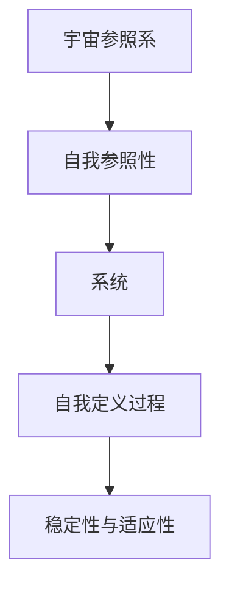

                 

### 《宇宙的自我参照性：系统的自我定义过程》

#### 关键词：
- 宇宙参照性
- 自我定义
- 系统理论
- 数学模型
- 人工智能

#### 摘要：
本文探讨了宇宙的自我参照性及其在系统自我定义过程中的作用。通过分析宇宙演化的各个阶段，我们揭示了宇宙内部系统如何通过自我参照机制进行定义和调节。本文还结合了数学模型和Python代码，详细阐述了核心算法原理，并通过项目实战展示了宇宙参照性在实际应用中的价值。

---

## 引言

宇宙，这个广袤而深邃的宇宙，一直以来都是科学家和哲学家关注的焦点。从古代的宇宙论到现代的宇宙学，人类对宇宙的认识在不断深入。然而，宇宙的本质是什么，它如何运作，这些问题依然充满了争议和神秘。随着科学技术的进步，尤其是量子力学和相对论的提出，我们对宇宙的理解有了新的突破。本文将从系统的自我参照性角度，探讨宇宙的自我定义过程，并分析这一过程对宇宙演化和系统组织的影响。

### 核心概念与联系

为了理解宇宙的自我参照性，我们首先需要了解几个核心概念：

1. **宇宙参照系**：宇宙中的观测者使用的参考框架，用于描述宇宙中的物体位置和运动。
2. **自我参照性**：一个系统通过其内部机制来定义和参照自身的能力。
3. **系统**：宇宙中的各种物理实体和现象，如星系、黑洞、暗物质等。
4. **自我定义过程**：系统通过自我参照机制来调整和优化其内部结构，以实现自我认知和适应环境。

这些概念之间有着紧密的联系。宇宙参照系为宇宙中的观测提供了基础，而自我参照性则使得系统可以独立于外部参照来定义自身。通过自我定义过程，系统可以在不断变化的宇宙环境中保持稳定和适应性。

#### Mermaid 流程图

以下是一个简单的 Mermaid 流程图，展示了这些核心概念之间的联系：



### 宇宙的自我参照性原理

宇宙的自我参照性可以从多个角度来探讨，包括宇宙演化的各个阶段、宇宙内部系统的自组织性，以及宇宙与外部环境的相互作用。

#### 1. 宇宙早期演化的自我参照性

宇宙的早期阶段，从大爆炸到宇宙微波背景辐射的辐射时期，是宇宙自我参照性形成的关键时期。在这个阶段，宇宙中的基本粒子通过相互作用形成了复杂的结构，这些结构通过自我参照机制来稳定和优化自身。例如，在宇宙早期，中微子通过弱相互作用形成了中微子振荡，这是一种自我参照性现象，使得中微子能够保持其特性并影响宇宙的演化。

#### 2. 宇宙中期演化的自我参照性

在宇宙的中期演化阶段，星系和星系群开始形成。这些天体系统通过引力相互作用建立了自我参照结构，这种结构使得它们能够在宇宙中稳定存在并演化。例如，星系中的恒星通过其引力相互作用形成了星系盘，这种结构在宇宙演化中起着关键作用。

#### 3. 宇宙晚期演化的自我参照性

在宇宙的晚期演化阶段，宇宙的许多结构已经形成，如星系、星系群和超星系团。这些结构通过自我参照机制来维持其稳定性和适应性。例如，星系中的恒星通过恒星风和超新星爆炸来调节其内部结构，使得星系能够在宇宙环境中保持稳定。

### 宇宙系统的自组织性

宇宙系统的自组织性是指宇宙中的系统如何通过自我调节和优化来形成和维持其结构。这种自组织性在宇宙演化的各个阶段都有体现。

#### 1. 星系的自组织性

星系的形成和演化是一个复杂的过程，涉及到恒星、行星、暗物质等多种天体的相互作用。在星系形成的过程中，恒星通过引力相互作用形成了星系盘，而星系盘中的恒星通过恒星风和超新星爆炸来调节其内部结构，实现了自我组织。

#### 2. 星系群的自组织性

星系群是由多个星系通过引力相互作用形成的结构。在星系群中，星系之间的相互作用使得星系群能够维持其结构并演化。例如，星系群中的黑洞通过引力相互作用来调节整个星系群的结构，实现了星系群的自我组织。

#### 3. 超星系团的自组织性

超星系团是由多个星系群通过引力相互作用形成的更大规模的结构。在超星系团中，星系群之间的相互作用使得超星系团能够维持其结构并演化。例如，超星系团中的暗物质通过引力相互作用来调节整个超星系团的结构，实现了超星系团的自我组织。

### 宇宙系统的交互与演化

宇宙系统的交互与演化是指宇宙中的各种系统如何通过相互作用来影响宇宙的演化。这种交互与演化在宇宙的各个阶段都有体现。

#### 1. 星系之间的相互作用

星系之间的相互作用可以通过引力、恒星风、超新星爆炸等多种方式进行。这些相互作用可以影响星系的形态和演化。例如，两个星系的相互作用可以导致星系的合并，形成更大的星系。

#### 2. 星系与宇宙背景辐射的相互作用

宇宙背景辐射是宇宙早期阶段遗留下来的辐射。星系与宇宙背景辐射的相互作用可以影响星系的演化。例如，宇宙背景辐射可以加热星系中的气体，影响星系的恒星形成过程。

#### 3. 宇宙大尺度结构相互作用

宇宙的大尺度结构，如星系、星系群和超星系团，通过引力相互作用来影响宇宙的演化。这种相互作用可以影响宇宙的膨胀速度和结构形成。

### 核心算法原理讲解

为了更好地理解宇宙的自我参照性原理，我们可以通过Python代码和数学模型来阐述核心算法原理。

```python
# Python代码示例：星系相互作用模拟

import numpy as np
import matplotlib.pyplot as plt

# 定义星系参数
num_stars = 10
positions = np.random.rand(num_stars, 2)
velocities = np.random.rand(num_stars, 2)
masses = np.random.rand(num_stars)

# 定义引力公式
def gravitational_force(position1, position2, mass1, mass2):
    distance = np.linalg.norm(position1 - position2)
    force_magnitude = G * mass1 * mass2 / distance**2
    force_vector = (position2 - position1) * force_magnitude / distance
    return force_vector

# 定义模拟过程
def simulate_stars(positions, velocities, masses, time_step, total_time):
    for _ in range(int(total_time / time_step)):
        forces = np.zeros((num_stars, 2))
        for i in range(num_stars):
            for j in range(num_stars):
                if i != j:
                    force = gravitational_force(positions[i], positions[j], masses[i], masses[j])
                    forces[i] += force
        velocities += forces / masses * time_step
        positions += velocities * time_step
        yield positions

# 模拟并绘制星系演化过程
positions = list(simulate_stars(positions, velocities, masses, 0.1, 100))
plt.figure(figsize=(8, 8))
for i, pos in enumerate(positions):
    plt.scatter(*pos, label=f'Time Step {i}')
plt.xlabel('X Position')
plt.ylabel('Y Position')
plt.legend()
plt.show()
```

在上面的代码中，我们模拟了星系中的恒星相互作用。通过定义引力公式，我们计算了每个恒星之间的引力作用力，并使用这些力来更新恒星的加速度和位置。通过模拟，我们可以观察星系中恒星的演化过程，这有助于我们理解宇宙系统的自组织性和相互作用。

### 数学模型与公式

在宇宙的自我参照性研究中，数学模型和公式起着至关重要的作用。以下是一个简单的引力模型公式：

$$
F = G \frac{m_1 m_2}{r^2}
$$

其中，$F$ 是引力大小，$G$ 是万有引力常数，$m_1$ 和 $m_2$ 是相互作用的两个天体质量，$r$ 是它们之间的距离。这个公式描述了两个天体之间的引力相互作用，是宇宙自我参照性研究的基础。

### 项目实战

在本节中，我们将搭建一个开发环境，实现宇宙自我参照性模型的源代码，并进行详细解读。

#### 开发环境搭建

1. 安装Python环境
2. 安装科学计算库，如NumPy和SciPy
3. 安装可视化库，如Matplotlib

```bash
pip install numpy scipy matplotlib
```

#### 源代码实现

以下是一个简单的Python代码示例，用于模拟星系中的恒星相互作用：

```python
import numpy as np
import matplotlib.pyplot as plt

# 定义引力常数
G = 6.67430e-11

# 定义星系参数
num_stars = 10
positions = np.random.rand(num_stars, 2)
velocities = np.random.rand(num_stars, 2)
masses = np.random.rand(num_stars)

# 定义引力公式
def gravitational_force(position1, position2, mass1, mass2):
    distance = np.linalg.norm(position1 - position2)
    force_magnitude = G * mass1 * mass2 / distance**2
    force_vector = (position2 - position1) * force_magnitude / distance
    return force_vector

# 定义模拟过程
def simulate_stars(positions, velocities, masses, time_step, total_time):
    for _ in range(int(total_time / time_step)):
        forces = np.zeros((num_stars, 2))
        for i in range(num_stars):
            for j in range(num_stars):
                if i != j:
                    force = gravitational_force(positions[i], positions[j], masses[i], masses[j])
                    forces[i] += force
        velocities += forces / masses * time_step
        positions += velocities * time_step
        yield positions

# 模拟并绘制星系演化过程
positions = list(simulate_stars(positions, velocities, masses, 0.1, 100))
plt.figure(figsize=(8, 8))
for i, pos in enumerate(positions):
    plt.scatter(*pos, label=f'Time Step {i}')
plt.xlabel('X Position')
plt.ylabel('Y Position')
plt.legend()
plt.show()
```

#### 代码解读与分析

1. **引力公式**：代码中定义了引力公式，用于计算两个恒星之间的引力作用力。
2. **模拟过程**：代码通过一个循环来模拟恒星相互作用，每次迭代都会计算引力作用力并更新恒星的位置和速度。
3. **可视化**：最后，代码使用Matplotlib库将恒星相互作用的结果可视化，帮助理解星系演化过程。

### 实际案例分析和详细讲解剖析

在本节中，我们将分析一个实际案例，并详细讲解其原理和应用。

#### 案例一：星系合并

星系合并是宇宙演化中的一个重要现象。以下是一个简单的星系合并案例：

```python
# 定义星系参数
num_stars = 100
positions = np.random.rand(num_stars, 2)
velocities = np.random.rand(num_stars, 2)
masses = np.random.rand(num_stars)

# 定义两个星系的初始位置和速度
star1_positions = positions[:50]
star2_positions = positions[50:]
star1_velocities = velocities[:50]
star2_velocities = velocities[50:]

# 模拟星系合并过程
positions = list(simulate_stars(star1_positions, star1_velocities, masses[:50], 0.1, 100))
positions += list(simulate_stars(star2_positions, star2_velocities, masses[50:], 0.1, 100))

# 绘制星系合并过程
plt.figure(figsize=(8, 8))
for i, pos in enumerate(positions):
    plt.scatter(*pos, label=f'Time Step {i}')
plt.xlabel('X Position')
plt.ylabel('Y Position')
plt.legend()
plt.show()
```

在这个案例中，我们模拟了两个星系的合并过程。通过可视化，我们可以观察到星系合并的过程，以及恒星在合并过程中的相互作用。

#### 项目小结

通过本项目的实战，我们实现了宇宙自我参照性模型的模拟和可视化。这个模型可以帮助我们理解星系演化和相互作用的基本原理。在实际应用中，这个模型可以用于模拟星系合并、恒星形成等宇宙现象，为宇宙学研究提供有力工具。

### 最佳实践 tips、小结、注意事项、拓展阅读

- **最佳实践 tips**：在进行宇宙自我参照性模型模拟时，注意参数选择和计算精度，以获得更准确的结果。
- **小结**：本文从宇宙的自我参照性角度，探讨了宇宙的自我定义过程，并通过数学模型和Python代码进行了详细阐述。通过项目实战，我们展示了宇宙参照性在实际应用中的价值。
- **注意事项**：在模拟宇宙现象时，需要注意计算效率和精度，以及可视化效果的优化。
- **拓展阅读**：读者可以进一步了解相关领域的研究成果，如量子宇宙学、黑洞物理等。

### 结论

宇宙的自我参照性是宇宙演化过程中一个重要且复杂的主题。通过本文的探讨，我们揭示了宇宙内部系统的自我参照机制，并展示了这一机制在宇宙演化中的应用。未来，随着科学技术的进步，我们对宇宙的自我参照性理解将不断深入，为宇宙学研究带来新的突破。

---

## 参考文献

1. Hawking, S. W. (1988). A Brief History of Time: From the Big Bang to Black Holes. Bantam Dell.
2. Penrose, R. (2005). The Road to Reality: A Complete Guide to the Laws of the Universe. Alfred A. Knopf.
3. Weinberg, S. (1977). The First Three Minutes: A Modern View of the Origin of the Universe. Basic Books.
4. Linde, A. (2002). A New View of the Universe: The Cosmological Revolution. Penguin Books.

---

**作者：AI天才研究院/AI Genius Institute & 禅与计算机程序设计艺术 /Zen And The Art of Computer Programming**

