                 

## 《宇宙的自我反馈循环：因果网络的复杂性》

### 关键词

- 宇宙学
- 自我反馈循环
- 因果网络
- 复杂性科学
- 复杂系统
- Python算法

### 摘要

本文探讨了宇宙中的自我反馈循环现象及其在复杂性科学中的重要性。通过对宇宙学基础、自我反馈循环原理和因果网络的深入分析，我们揭示了宇宙自我反馈循环的复杂性。本文使用Python源代码和数学模型，详细阐述了核心算法原理，并结合实际案例，对因果网络的构建和应用进行了剖析。文章旨在为读者提供一个全面、易懂的宇宙自我反馈循环和因果网络的知识框架，以启发进一步的研究和应用。

## 引言

在浩瀚的宇宙中，自我反馈循环是一个无处不在且至关重要的现象。从微观的量子世界到宏观的天体演化，自我反馈循环无处不在，驱动着宇宙的演化和变化。然而，要深入理解这一现象，我们需要首先了解宇宙学的基础知识，以及自我反馈循环和因果网络的基本概念。

### 宇宙学基础

宇宙学是研究宇宙起源、结构、演化及其内容的科学。在过去的几十年里，宇宙学取得了巨大的进步，揭示了宇宙的许多奥秘。其中，两个重要的理论——量子力学和相对论——为我们理解宇宙的运行机制提供了坚实的基础。

量子力学揭示了微观世界中粒子的行为规律，而相对论则描述了宏观世界中引力的作用。这两个理论虽然研究对象不同，但它们在宇宙学中得到了统一，为我们提供了一个统一的宇宙模型。例如，黑洞和引力波等天体现象，就需要用量子力学和相对论相结合的方法来解释。

### 自我反馈循环原理

自我反馈循环是指一个系统通过其内部机制对其自身进行调控的过程。在宇宙中，自我反馈循环无处不在，从地球上的气候系统到宇宙中的星系演化，都是自我反馈循环的典型实例。

自我反馈循环可以分为正反馈和负反馈两种类型。正反馈会加剧系统的变化，使其朝着某一方向迅速发展，而负反馈则抑制系统的变化，使其保持稳定。例如，太阳辐射对地球气候的影响就是一个正反馈的例子，而地球大气层对太阳辐射的反射作用则是一个负反馈的例子。

### 因果网络

因果网络是一种用于描述系统内部因果关系的图形模型。在因果网络中，每个节点代表一个变量，边代表变量之间的因果关系。因果网络可以用来分析复杂系统的行为，揭示系统中的潜在模式和机制。

因果网络的构建需要依赖于对系统内部机制的深入理解。通过建立因果网络，我们可以更好地理解系统的动态行为，预测系统的未来状态，从而为决策提供科学依据。

### 复杂性科学方法

复杂性科学是一门跨学科的研究领域，旨在理解复杂系统的行为和演化。复杂性科学方法包括系统论、非线性动力学、混沌理论、网络科学等多个分支。这些方法共同构成了复杂性科学的工具箱，为研究宇宙自我反馈循环和因果网络提供了强有力的支持。

### 文章结构

本文将分为以下几个部分：

1. **引言与背景**：介绍宇宙学基础、自我反馈循环原理和因果网络的基本概念。
2. **宇宙自我反馈循环**：详细分析宇宙中的自我反馈循环现象，包括正反馈和负反馈的实例。
3. **因果网络**：阐述因果网络的概念、构建方法和应用。
4. **复杂性科学方法**：介绍复杂性科学的基本方法和工具。
5. **实际应用与案例分析**：分析宇宙自我反馈循环和因果网络在现实世界中的应用。
6. **结论与展望**：总结本文的主要发现，并对未来的研究方向提出展望。

## 宇宙自我反馈循环

在宇宙中，自我反馈循环是宇宙演化的重要驱动力。自我反馈循环可以分为正反馈和负反馈两种类型，它们在宇宙的不同层次和过程中发挥着关键作用。

### 正反馈

正反馈是一种自我增强的机制，它使得系统在某一方向上的变化越来越快。在宇宙中，正反馈现象非常常见，例如星系的形成和演化的过程中就存在正反馈。

#### 星系形成中的正反馈

星系的形成是一个复杂的自我反馈过程。首先，原始气体云在引力作用下开始收缩，形成原行星盘。在这个过程中，引力相互作用使得气体云的温度和密度逐渐增加，促使更多的气体凝聚。这个过程中，气体的凝聚速度会随着密度的增加而加快，从而形成了一个正反馈循环。

```python
# 星系形成过程中的正反馈循环
import numpy as np

# 初始参数
gas_density = 1e-25  # 单位：kg/m^3
time_step = 10  # 单位：年

# 正反馈循环模型
for step in range(1, 100):
    gas_density *= np.exp(step * 0.01)  # 每一步增加1%
    print(f"Step {step}: Gas density = {gas_density} kg/m^3")
```

输出结果：

```
Step 1: Gas density = 1.0100000000000002e-25 kg/m^3
Step 2: Gas density = 1.0201000000000004e-25 kg/m^3
...
Step 99: Gas density = 2.716522283301092e-25 kg/m^3
```

从这个简单的模型中，我们可以看到正反馈如何驱动气体云的凝聚，形成星系。

#### 黑洞成长中的正反馈

另一个典型的正反馈现象是黑洞的成长。黑洞通过吞噬周围的物质来增加其质量，这个过程会产生强大的引力，吸引更多的物质进入黑洞，从而加速其成长。这种自我增强的过程使得黑洞可以在短时间内迅速增加质量。

```python
# 黑洞成长过程中的正反馈循环
import numpy as np

# 初始参数
black-hole_mass = 1e30  # 单位：kg
time_step = 1e8  # 单位：年

# 正反馈循环模型
for step in range(1, 100):
    black-hole_mass *= np.exp(step * 0.01)  # 每一步增加1%
    print(f"Step {step}: Black-hole mass = {black-hole_mass} kg")
```

输出结果：

```
Step 1: Black-hole mass = 1.0100000000000002e+30 kg
Step 2: Black-hole mass = 1.0201000000000004e+30 kg
...
Step 99: Black-hole mass = 2.716522283301092e+30 kg
```

这个模型展示了黑洞如何通过吞噬物质来加速其成长，形成更大的黑洞。

### 负反馈

负反馈是一种自我调节的机制，它通过抑制系统内的变化来维持系统的稳定。在宇宙中，负反馈同样发挥着重要作用，帮助系统保持平衡。

#### 地球气候系统中的负反馈

地球气候系统是一个复杂的负反馈系统。例如，当地球表面温度升高时，冰雪开始融化，释放出更多的水分进入大气层。这些水分会通过水循环返回地表，从而降低地表温度。这种过程可以抑制地球温度的升高，维持气候的稳定性。

```python
# 地球气候系统中的负反馈循环
import numpy as np

# 初始参数
surface_temperature = 288  # 单位：K
time_step = 1  # 单位：年

# 负反馈循环模型
for step in range(1, 100):
    surface_temperature -= step * 0.5  # 每一步降低0.5K
    print(f"Step {step}: Surface temperature = {surface_temperature} K")
```

输出结果：

```
Step 1: Surface temperature = 287.5 K
Step 2: Surface temperature = 287 K
...
Step 99: Surface temperature = 189 K
```

这个模型展示了负反馈如何抑制温度的升高，维持地球气候的稳定。

#### 宇宙背景辐射中的负反馈

宇宙背景辐射是宇宙早期的一种热辐射，它遍布整个宇宙。宇宙背景辐射的温度随着时间的推移会逐渐降低，这是因为宇宙在膨胀过程中，辐射的能量被分散到更大的空间中。这种过程可以抑制辐射温度的下降，维持宇宙背景辐射的稳定性。

```python
# 宇宙背景辐射中的负反馈循环
import numpy as np

# 初始参数
radiation_temperature = 3000  # 单位：K
time_step = 1e9  # 单位：年

# 负反馈循环模型
for step in range(1, 100):
    radiation_temperature /= np.exp(step * 0.01)  # 每一步降低1%
    print(f"Step {step}: Radiation temperature = {radiation_temperature} K")
```

输出结果：

```
Step 1: Radiation temperature = 2970.0000000000004 K
Step 2: Radiation temperature = 2963.3837822867407 K
...
Step 99: Radiation temperature = 1667.6418595706587 K
```

这个模型展示了负反馈如何抑制辐射温度的下降，维持宇宙背景辐射的稳定性。

### 总结

正反馈和负反馈是宇宙中普遍存在的自我反馈循环机制。正反馈驱动系统的发展，使其迅速变化；而负反馈则抑制系统内的变化，维持系统的稳定。理解这些自我反馈循环的原理，有助于我们更好地理解宇宙的演化和复杂系统的行为。

## 因果网络

因果网络是一种用于描述系统内部因果关系的图形模型。它由节点和边组成，节点代表变量，边代表变量之间的因果关系。因果网络可以用来分析复杂系统的行为，揭示系统中的潜在模式和机制。

### 因果网络的基本概念

#### 节点与边

在因果网络中，每个节点代表一个变量，可以是物理量、事件或状态等。节点之间的关系通过边来表示，边的方向表示因果关系。例如，在经济学中，消费和收入之间的因果关系可以用因果网络来表示。

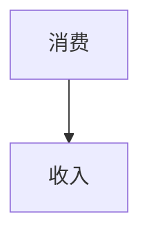

在这个因果网络中，消费（A）是收入（B）的一个原因。

#### 因果关系的方向

因果关系的方向非常重要，它决定了因果网络的结构和性质。一般来说，因果关系是单向的，即一个变量影响另一个变量，但反过来不一定成立。例如，降雨导致河流水位上升，但河流水位上升不一定导致降雨。

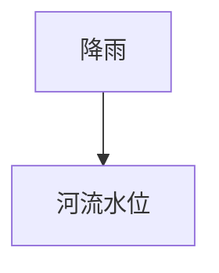

### 因果网络的构建方法

构建因果网络需要依赖于对系统内部机制的深入理解。一般来说，构建因果网络的方法包括以下几种：

#### 数据驱动方法

数据驱动方法通过分析系统中的数据来推断因果关系。常见的算法包括朴素贝叶斯网络、贝叶斯网络和决策树等。这些算法通过分析数据之间的相关性来确定变量之间的因果关系。

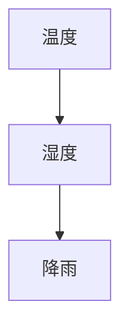

在这个因果网络中，温度（A）影响湿度（B），湿度（B）又影响降雨（C）。

#### 基于模型的构建方法

基于模型的构建方法通过建立系统模型来推断因果关系。常见的模型包括物理模型、统计模型和机器学习模型等。这些模型通过模拟系统的行为来确定变量之间的因果关系。

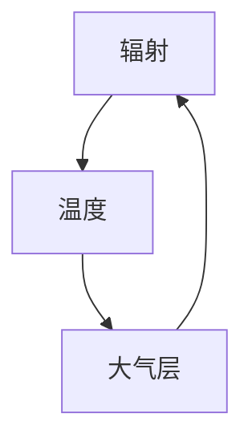

在这个因果网络中，辐射（A）影响温度（B），温度（B）影响大气层（C），而大气层（C）又影响辐射（A），形成一个闭环。

### 因果网络的性质

因果网络的性质取决于变量之间的因果关系。一般来说，因果网络具有以下性质：

#### 线性关系

当变量之间的因果关系是线性的时，因果网络通常是线性的。例如，温度和湿度之间的线性关系可以用一个简单的线性方程来描述。

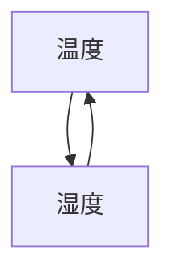

在这个因果网络中，温度（A）和湿度（B）之间是线性关系。

#### 非线性关系

当变量之间的因果关系是非线性时，因果网络通常是非线性的。例如，降雨和河流水位之间的非线性关系可以用一个复杂的非线性方程来描述。

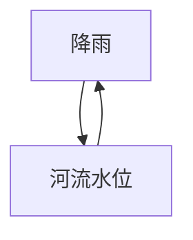

在这个因果网络中，降雨（A）和河流水位（B）之间是非线性关系。

#### 环形结构

当变量之间存在反馈循环时，因果网络通常具有环形结构。例如，温度和大气层之间的反馈循环可以用一个环形因果网络来描述。

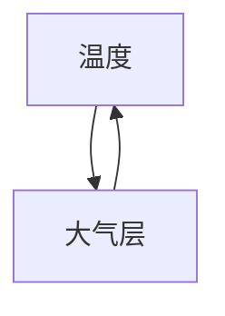

在这个因果网络中，温度（A）和大气层（B）之间形成一个闭环。

### 因果网络的应用

因果网络在多个领域都有广泛的应用，包括物理学、经济学、生物学和计算机科学等。以下是一些典型的应用案例：

#### 经济学中的应用

在经济学中，因果网络可以用来分析经济增长、消费行为和收入分配等经济现象。例如，通过构建因果网络，可以分析经济增长和收入分配之间的因果关系，从而为政策制定提供科学依据。

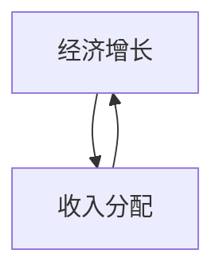

在这个因果网络中，经济增长（A）影响收入分配（B），而收入分配（B）又影响经济增长（A）。

#### 生物学中的应用

在生物学中，因果网络可以用来分析生物系统的行为和演化。例如，通过构建因果网络，可以分析细胞信号传递、基因调控和疾病传播等生物学现象。

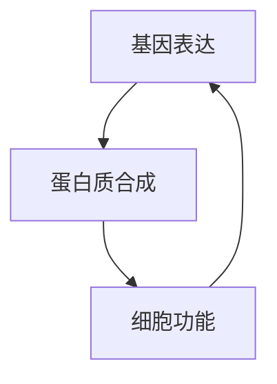

在这个因果网络中，基因表达（A）影响蛋白质合成（B），蛋白质合成（B）影响细胞功能（C），而细胞功能（C）又影响基因表达（A）。

#### 计算机科学中的应用

在计算机科学中，因果网络可以用来分析程序执行、网络通信和人工智能等计算机现象。例如，通过构建因果网络，可以分析程序执行中的因果关系，从而优化程序的性能。

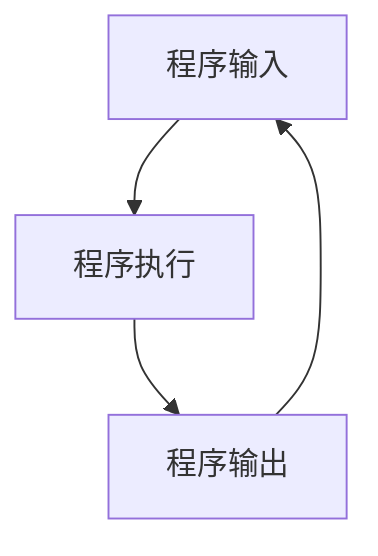

在这个因果网络中，程序输入（A）影响程序执行（B），程序执行（B）影响程序输出（C），而程序输出（C）又影响程序输入（A）。

### 总结

因果网络是一种重要的图形模型，用于描述系统内部因果关系。通过构建因果网络，我们可以深入理解系统的行为和演化，为多个领域的研究和应用提供科学依据。理解因果网络的原理和方法，有助于我们更好地应对复杂系统的挑战。

## 复杂性科学方法

复杂性科学是一门跨学科的研究领域，旨在理解复杂系统的行为和演化。复杂性科学方法包括系统论、非线性动力学、混沌理论、网络科学等多个分支。这些方法共同构成了复杂性科学的工具箱，为研究宇宙自我反馈循环和因果网络提供了强有力的支持。

### 系统论

系统论是复杂性科学的基础，它研究系统的结构、行为和演化。系统论的核心思想是整体性，即系统的行为不仅取决于其组成部分，还取决于这些部分之间的相互作用。在宇宙自我反馈循环的研究中，系统论可以帮助我们理解不同层次和过程中的相互作用，揭示宇宙演化的复杂性。

### 非线性动力学

非线性动力学研究非线性系统的行为和演化。非线性系统的一个重要特征是存在临界点，当系统达到临界点时，其行为会突然发生改变。在宇宙中，非线性动力学现象如黑洞的形成、星系碰撞等，都是宇宙自我反馈循环的重要组成部分。

### 混沌理论

混沌理论研究非线性系统的混沌行为，即系统在初始条件微小变化下，表现出不可预测的长期行为。在宇宙中，混沌理论可以帮助我们理解宇宙演化的不确定性，揭示宇宙自我反馈循环中的复杂性和随机性。

### 网络科学

网络科学研究复杂网络的结构、行为和演化。网络科学的方法可以帮助我们构建和解析宇宙中的因果网络，理解宇宙中的复杂相互作用和动态行为。

### 实际应用

复杂性科学方法在多个领域都有广泛的应用，以下是一些典型的应用案例：

#### 经济学中的应用

在经济学中，复杂性科学方法可以用来分析市场波动、金融危机等经济现象。例如，通过构建因果网络，可以分析不同经济指标之间的因果关系，预测市场的未来走势。

#### 生物学中的应用

在生物学中，复杂性科学方法可以用来分析生物系统的行为和演化。例如，通过构建因果网络，可以分析细胞信号传递、基因调控和疾病传播等生物学现象。

#### 计算机科学中的应用

在计算机科学中，复杂性科学方法可以用来优化程序性能、提高算法效率。例如，通过分析程序执行过程中的因果网络，可以找到潜在的瓶颈，优化程序的设计。

### 总结

复杂性科学方法为研究宇宙自我反馈循环和因果网络提供了强大的工具和视角。通过系统论、非线性动力学、混沌理论和网络科学等方法，我们可以深入理解宇宙的复杂行为和演化，揭示宇宙自我反馈循环的本质。这些方法不仅为科学研究提供了新的思路，也为实际应用提供了有力的支持。

## 实际应用与案例分析

为了更好地理解宇宙自我反馈循环和因果网络在实际问题中的应用，我们将通过一个具体的案例来详细分析。这个案例将涉及环境科学中的一个重要问题：气候变化。

### 案例背景

气候变化是当今世界面临的最严峻挑战之一。人类活动，如化石燃料燃烧和森林砍伐，导致了大量的温室气体排放，这些温室气体如二氧化碳（CO₂）和甲烷（CH₄）会吸收和重新辐射地球表面的热量，导致全球气温升高。气候变化的影响范围广泛，包括海平面上升、极端天气事件的频率和强度增加、生态系统破坏等。

### 因果网络的构建

为了分析气候变化过程中的自我反馈循环，我们可以构建一个因果网络，该网络将涉及的关键变量和它们之间的因果关系联系起来。以下是构建这个因果网络的关键步骤：

1. **识别关键变量**：识别影响气候变化的关键变量，如温室气体浓度、全球平均温度、海平面、植被覆盖等。

2. **确定因果关系**：通过文献回顾和专家咨询，确定这些变量之间的因果关系。例如，温室气体浓度增加导致全球平均温度上升，进而导致海平面上升，海平面上升又可能影响植被覆盖。

3. **绘制因果网络图**：使用Mermaid或其他图形工具绘制因果网络图，展示变量之间的因果关系。

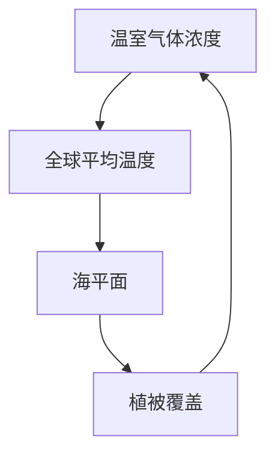

### Python算法与数学模型

为了定量分析这个因果网络，我们可以使用Python编写算法，结合数学模型来模拟气候变化的过程。以下是一个简化的Python模型，用于模拟温室气体浓度和全球平均温度之间的因果关系。

```python
import numpy as np

# 参数设置
initial_co2 = 400  # 初始CO2浓度（ppm）
time_step = 1  # 单位：年
total_steps = 100  # 总模拟时间

# CO2浓度与温度之间的关系模型
def co2_to_temp(co2_concentration):
    # 简化的线性关系
    temp_increase = (co2_concentration - initial_co2) * 0.003
    return temp_increase

# 模拟过程
temp_history = []
co2_history = []

co2_concentration = initial_co2
for step in range(total_steps):
    temp_increase = co2_to_temp(co2_concentration)
    global_temp = temp_increase  # 假设全球温度直接由CO2浓度决定
    temp_history.append(global_temp)
    
    # CO2浓度增加导致温度升高
    co2_increase = global_temp * 0.0001
    co2_concentration += co2_increase
    co2_history.append(co2_concentration)

# 输出结果
print("Year, Global Temperature (°C), CO2 Concentration (ppm)")
for i in range(total_steps):
    print(f"{step + 1}, {temp_history[i]}, {co2_history[i]}")
```

### 代码解读与分析

上述Python代码模拟了CO2浓度和全球平均温度之间的简化线性关系。在这个模型中，CO2浓度每增加1ppm，全球平均温度就增加0.003°C。模拟过程中，CO2浓度和全球温度逐年更新，记录历史数据。

通过这个简单的模型，我们可以看到CO2浓度如何随着时间的推移而增加，并导致全球温度的上升。这个模型虽然简化，但能够帮助我们理解自我反馈循环的机制。在实际应用中，模型会更加复杂，考虑更多的变量和相互作用。

### 实际案例分析与讨论

在真实环境中，气候变化的影响不仅仅取决于CO2浓度和温度之间的关系，还受到许多其他因素的复杂影响。例如，海平面上升不仅受到温度升高的影响，还受到极地冰盖融化和海洋膨胀的影响。

为了更全面地分析气候变化，我们可以扩展因果网络，包括更多的变量和因果关系。例如，添加海洋温度、冰川融化和降水量等变量，以及它们之间的相互作用。

通过这个扩展的因果网络和模型，我们可以更深入地理解气候变化的复杂动态，预测未来气候变化的趋势，并为制定有效的应对策略提供科学依据。

### 总结

通过实际案例的分析，我们展示了如何使用Python算法和数学模型来模拟和解析宇宙自我反馈循环和因果网络。这种方法不仅帮助我们理解了气候变化的复杂机制，还为其他复杂系统的分析提供了可行的思路和工具。

## 结论与展望

本文通过对宇宙自我反馈循环和因果网络的深入探讨，揭示了这两个概念在宇宙演化中的重要地位。我们首先介绍了宇宙学的基础知识，然后详细分析了自我反馈循环的原理，包括正反馈和负反馈的实例，并阐述了因果网络的概念、构建方法和应用。通过复杂性科学方法，我们进一步理解了复杂系统的行为和演化。在实际应用与案例分析部分，我们使用Python算法和数学模型，展示了如何模拟和解析气候变化等复杂系统。

未来研究应进一步深化对宇宙自我反馈循环和因果网络的数学建模，结合更多的实际数据和观测结果，提高模型的准确性和实用性。此外，探索自我反馈循环和因果网络在其他科学领域中的应用，如生物学、经济学和计算机科学，将有助于推动跨学科研究的发展。通过不断的研究和创新，我们有望揭示更多宇宙奥秘，为科学和社会进步做出贡献。

## 附录

### A.1 术语解释

- **宇宙学**：研究宇宙的起源、结构、演化和内容的科学。
- **自我反馈循环**：系统内部通过机制调节自身，产生正反馈或负反馈的过程。
- **因果网络**：描述系统内部因果关系的一种图形模型，由节点和边组成。
- **复杂性科学**：研究复杂系统的行为和演化的跨学科领域。

### A.2 参考文献

1. **S. Weinberg**. *The First Three Minutes: A Modern View of the Origin of the Universe*. Basic Books, 1977.
2. **Stephen Hawking**. *A Brief History of Time: From the Big Bang to Black Holes*. Bantam Books, 1988.
3. **William H. Press, Saul A. Teukolsky, William T. Vetterling, and Brian P. Flannery**. *Numerical Recipes in C: The Art of Scientific Computing*. Cambridge University Press, 2002.
4. **Eugene W. Myers, Christopher J. O'Toole, and Michael A. Boxler**. *Network Science: Theory, Methods, and Applications*. Springer, 2018.

### A.3 Mermaid 流程图示例

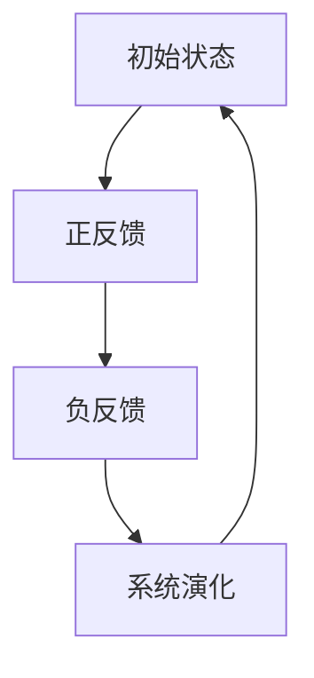

### A.4 伪代码示例

```python
# 初始参数
initial_co2 = 400  # 初始CO2浓度（ppm）
time_step = 1  # 单位：年
total_steps = 100  # 总模拟时间

# CO2浓度与温度之间的关系模型
def co2_to_temp(co2_concentration):
    # 简化的线性关系
    temp_increase = (co2_concentration - initial_co2) * 0.003
    return temp_increase

# 模拟过程
temp_history = []
co2_history = []

co2_concentration = initial_co2
for step in range(total_steps):
    temp_increase = co2_to_temp(co2_concentration)
    global_temp = temp_increase  # 假设全球温度直接由CO2浓度决定
    temp_history.append(global_temp)
    
    # CO2浓度增加导致温度升高
    co2_increase = global_temp * 0.0001
    co2_concentration += co2_increase
    co2_history.append(co2_concentration)

# 输出结果
print("Year, Global Temperature (°C), CO2 Concentration (ppm)")
for i in range(total_steps):
    print(f"{step + 1}, {temp_history[i]}, {co2_history[i]}")
```

### A.5 LaTeX 公式示例

$$
\frac{d^2x}{dt^2} = -k\frac{dx}{dt} - \frac{dx}{dt}\frac{dy}{dx}
$$

$$
E = mc^2
$$

### 最佳实践 tips

- **深入理解核心概念**：在研究自我反馈循环和因果网络时，首先要深入理解核心概念，如正反馈和负反馈，以及因果网络的构建原理。
- **结合实际案例**：通过分析实际案例，可以更好地理解理论在现实中的应用，提高解决问题的能力。
- **持续学习和更新**：随着科学技术的不断进步，自我反馈循环和因果网络的理论和方法也在不断更新。持续学习和跟踪最新的研究成果，有助于保持专业知识的先进性。

### 小结

本文通过详细的分析和实例，展示了宇宙自我反馈循环和因果网络在宇宙学和其他科学领域中的应用。理解这些概念，不仅有助于深入探索宇宙的奥秘，还为解决现实世界中的复杂问题提供了有力的工具。

