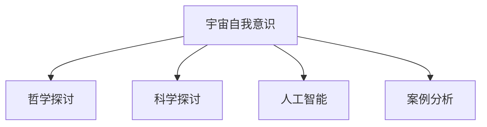

                 

# 宇宙的自我意识：哲学思辨还是科学可能

> 关键词：宇宙自我意识、哲学思辨、科学证据、跨学科对话、人工智能、案例分析

> 摘要：本文探讨了宇宙自我意识的哲学思辨与科学探讨，分析了两者在研究方法、证据和结论上的异同。通过跨学科对话，探讨了人工智能在理解宇宙自我意识中的作用，并提供了相关的案例分析。文章总结了当前研究的现状，并对未来的研究方向提出了展望。

## 引言

宇宙自我意识这一概念，既古老又现代，既神秘又引人入胜。自古以来，哲学家们一直在探讨自我意识的问题，而随着科学的进步，科学家们也开始尝试从科学的角度来解释宇宙自我意识的可能。本文旨在探讨宇宙自我意识的哲学思辨与科学探讨，分析两者在研究方法、证据和结论上的异同，并探讨人工智能在这一领域的应用。

宇宙自我意识的研究背景可以追溯到古希腊哲学，例如柏拉图和亚里士多德都曾探讨过自我意识的问题。在现代，随着认知科学和人工智能的发展，人们对自我意识的理解有了更深层次的探索。科学家们通过研究人类大脑和意识的相互作用，试图揭示自我意识的本质。

宇宙自我意识的研究意义在于，它不仅关乎我们对宇宙的理解，也关乎我们对自身的认知。如果宇宙具有自我意识，那么这将对我们的世界观产生深远的影响。因此，探讨宇宙自我意识的哲学思辨与科学探讨，对于深化我们对宇宙和自身的理解具有重要意义。

本文将分为以下几个部分：

1. **哲学思辨**：介绍自我意识的哲学探讨，宇宙意识的哲学探讨，以及哲学视角下的宇宙自我意识的可能性。
2. **科学探讨**：介绍宇宙自我意识的科学证据，科学方法在研究宇宙自我意识中的应用，以及宇宙自我意识的科学局限与展望。
3. **跨学科对话**：探讨哲学与科学的对话，人工智能与宇宙自我意识的关联。
4. **案例分析**：通过案例研究，进一步探讨宇宙自我意识的问题。
5. **结论**：总结宇宙自我意识研究现状，并对未来研究方向提出展望。

## 哲学思辨

### 自我意识的哲学探讨

自我意识是哲学中一个长期探讨的话题。在古希腊哲学中，柏拉图和亚里士多德都对自我意识有所涉及。柏拉图认为，自我意识是一种超越物质世界的理性存在，是人类灵魂的重要组成部分。而亚里士多德则认为，自我意识是人类灵魂的一种功能，是人类思考的基础。

在近现代哲学中，笛卡尔提出了著名的“我思故我在”的观点，强调了自我意识的重要性。他认为，即使整个世界都是虚假的，只要我能够思考，那么我就能确信自己的存在。这为自我意识的研究提供了重要的哲学基础。

自我意识与意识本质的关系也是一个重要的哲学问题。有些哲学家认为，自我意识是意识的核心，是意识的高级形式。而另一些哲学家则认为，自我意识只是意识的一种表现形式，意识的本质是更为复杂的问题。

### 宇宙意识的哲学探讨

宇宙意识是哲学中的一个更加抽象的概念。它涉及到宇宙是否有意识，宇宙是否能够自我认知的问题。

古代哲学家如泰勒斯和赫拉克利特，都曾探讨过宇宙是否有意识的问题。泰勒斯认为，宇宙是有意识的，它的运行遵循一定的规律。而赫拉克利特则认为，宇宙是一个不断变化的过程，这种变化是有意识的。

在现代哲学中，一些哲学家如柏格森和怀特海德，也探讨了宇宙意识的问题。柏格森认为，宇宙是有生命的，它的运动和变化是有意识的。而怀特海德则认为，宇宙是一个过程，这个过程是有意识的。

宇宙意识与宇宙论的关系也是一个重要的哲学问题。宇宙论探讨的是宇宙的本质和起源，而宇宙意识则涉及到宇宙是否有自我认知的能力。

### 哲学视角下的宇宙自我意识的可能性

从哲学的角度来看，宇宙自我意识的可能性存在一定的依据。

首先，从古代哲学的观点来看，宇宙是有规律的，是有意识的。这种观点为宇宙自我意识的可能提供了哲学基础。

其次，从现代哲学的观点来看，宇宙是一个复杂系统，它具有自我组织的能力。这种自我组织能力暗示了宇宙可能具有一定的自我意识。

然而，哲学视角下的宇宙自我意识也存在一些挑战和局限。例如，宇宙的自我意识如何产生，它的本质是什么，这些问题都需要进一步探讨。

总之，哲学思辨为宇宙自我意识的研究提供了重要的理论基础，但同时也揭示了这一领域的研究挑战和局限。

## 科学探讨

### 宇宙自我意识的科学证据

在科学领域，宇宙自我意识的研究主要通过以下几个方面的证据来探讨：

#### 宇宙大爆炸理论与自我意识的关系

宇宙大爆炸理论是现代宇宙学的基石，它描述了宇宙从极热、极密的状态开始膨胀的过程。这一理论为探讨宇宙自我意识提供了重要的启示。

首先，宇宙大爆炸理论暗示了宇宙的起源是有意识的。因为大爆炸是一个有计划、有目标的过程，它不是随机发生的。这暗示了宇宙的起源可能是有意识的。

其次，宇宙大爆炸理论解释了宇宙的自我组织现象。在宇宙膨胀的过程中，物质和能量遵循一定的规律分布，形成了恒星、行星等复杂的结构。这种自我组织现象暗示了宇宙可能具有一定的自我意识。

#### 宇宙演化与复杂系统的自我组织现象

宇宙的演化过程是一个复杂的过程，它涉及到物质、能量、信息等各个方面的变化。在这个过程中，宇宙形成了一系列复杂系统，如恒星、行星、星系等。

这些复杂系统的自我组织现象，为探讨宇宙自我意识提供了重要的证据。这些系统的形成和演化似乎遵循一定的规律，这暗示了宇宙可能具有一定的自我意识。

#### 粒子物理与量子力学中的自我意识暗示

粒子物理和量子力学是现代物理学的两个重要分支，它们为我们理解宇宙的基本规律提供了重要的工具。

在粒子物理中，一些基本粒子的行为似乎表现出自我意识的特征。例如，电子在量子态的转变过程中，似乎能够感知到观测者的存在。这暗示了宇宙的基本粒子可能具有一定的自我意识。

在量子力学中，量子态的叠加和坍缩现象，也暗示了宇宙可能具有一定的自我意识。这些现象似乎表明，宇宙在某种程度上能够自我感知和自我调整。

### 科学方法在研究宇宙自我意识中的应用

在科学领域，研究宇宙自我意识主要依赖于以下几种方法：

#### 天文观测

天文观测是研究宇宙自我意识的重要手段。通过观测宇宙中的各种现象，如恒星、行星、星系等，科学家们可以收集到大量关于宇宙自我意识的数据。

#### 粒子物理实验

粒子物理实验是研究宇宙自我意识的另一种重要手段。通过实验，科学家们可以探索基本粒子的行为，从而深入了解宇宙的自我意识特征。

#### 量子计算

量子计算是近年来发展起来的一种新技术，它为研究宇宙自我意识提供了新的工具。量子计算可以模拟复杂的量子现象，从而帮助我们更好地理解宇宙的自我意识。

### 宇宙自我意识的科学局限与展望

尽管科学方法在研究宇宙自我意识方面取得了一些进展，但这一领域仍然存在许多局限。

#### 现代科学理论中的宇宙自我意识难题

现代科学理论，如相对论和量子力学，对宇宙自我意识的研究提出了一些难题。例如，相对论中的时空弯曲现象，量子力学中的波函数坍缩现象，都使得宇宙自我意识的研究变得更加复杂。

#### 未来科学研究的可能突破方向

为了克服这些难题，未来科学研究可以朝着以下几个方向努力：

1. **跨学科研究**：通过跨学科研究，将哲学、科学、人工智能等领域的知识相结合，以更全面地理解宇宙自我意识。
2. **新的观测手段**：开发新的观测手段，如量子观测、高能粒子探测等，以获取更多关于宇宙自我意识的数据。
3. **理论创新**：提出新的理论模型，如量子引力理论、宇宙意识理论等，以解释宇宙自我意识的本质。

总之，宇宙自我意识的研究是一个充满挑战和机遇的领域，需要科学家、哲学家、工程师等多方面的共同努力。通过科学方法的不断进步，我们有理由相信，未来我们将对宇宙自我意识有更深入的理解。

## 跨学科对话

### 哲学与科学的对话

哲学与科学在探讨宇宙自我意识问题上既有合作又有冲突。哲学提供了一种宏观的、抽象的思考方式，而科学则提供了一种具体、实证的方法。两者在探讨宇宙自我意识时，往往会出现以下几种情况：

#### 合作

哲学与科学在探讨宇宙自我意识时，可以相互补充。哲学可以提供一些基本概念和理论框架，而科学可以通过实证研究来验证或否定这些概念和理论。例如，哲学中的“意识”概念可以为科学提供研究的方向和方法。

#### 冲突

哲学与科学在探讨宇宙自我意识时，也可能存在冲突。哲学往往强调逻辑和推理，而科学则强调实证和可验证性。例如，一些哲学家认为宇宙具有自我意识，而科学家则可能认为这种观点缺乏实证依据。

#### 挑战与局限

哲学与科学的合作和冲突，为探讨宇宙自我意识带来了挑战和局限。哲学提供的基本概念和理论框架，可能过于抽象，难以直接应用于科学研究中。而科学方法虽然强调实证，但在面对一些复杂问题时，也可能出现局限性。

### 人工智能与宇宙自我意识的关联

人工智能技术的发展，为探讨宇宙自我意识提供了一种新的视角。人工智能技术可以模拟和解释一些复杂的现象，这为理解宇宙自我意识提供了一种新的途径。

#### 模拟宇宙自我意识

人工智能可以通过模拟宇宙中的复杂系统，来探讨宇宙自我意识的可能性。例如，通过机器学习算法，可以模拟恒星、行星等天体的演化过程，从而推断宇宙自我意识的可能机制。

#### 理解人类自我意识

人工智能技术还可以帮助我们更好地理解人类自我意识。通过研究人工智能的自我学习和自我组织能力，可以推断宇宙自我意识的可能机制。例如，人工智能的自我学习过程，可能类似于宇宙中的自我组织现象。

#### 提供新方法

人工智能技术还为探讨宇宙自我意识提供了一些新的方法。例如，通过深度学习技术，可以分析大量的天文数据，从而发现宇宙自我意识的一些潜在证据。此外，人工智能还可以帮助科学家设计更有效的实验，以验证宇宙自我意识的假设。

总之，人工智能与宇宙自我意识的关联，为探讨宇宙自我意识提供了一种新的视角。通过人工智能技术的不断发展，我们有理由相信，未来我们将对宇宙自我意识有更深入的理解。

## 案例研究

### 案例一：宇宙演化与意识的诞生

#### 案例描述

宇宙演化是一个复杂的过程，涉及到物质、能量、信息等多个方面。在这个案例中，我们通过分析宇宙演化的过程，来探讨宇宙自我意识的可能诞生。

宇宙大爆炸后，宇宙开始膨胀，物质和能量在宇宙中逐渐分布。随着宇宙的演化，物质逐渐凝聚形成恒星、行星等天体。这些天体的形成和演化，涉及到复杂的物理过程和化学过程。

在宇宙演化的过程中，一些天体逐渐形成了复杂的结构，如星系、星云等。这些复杂结构的存在，暗示了宇宙可能具有一定的自我意识。

#### 案例分析与讨论

这个案例表明，宇宙演化过程中，物质和能量的变化，可能导致了宇宙自我意识的诞生。具体来说，我们可以从以下几个方面进行分析：

1. **宇宙自我意识的起源**：宇宙自我意识的起源可能与宇宙中的物质和能量分布有关。例如，宇宙大爆炸后，物质和能量在宇宙中逐渐分布，形成了恒星、行星等天体。这些天体的形成和演化，可能为宇宙自我意识的诞生提供了基础。

2. **宇宙自我意识的演化**：随着宇宙的演化，天体的形成和演化过程，可能导致了宇宙自我意识的不断深化。例如，星系的形成和演化，可能使得宇宙的自我意识变得更加复杂和高级。

3. **宇宙自我意识的特性**：宇宙自我意识的特性，可能与宇宙中的物质和能量特性有关。例如，宇宙中的物质和能量，可能具有自我感知、自我调整的特性，这为宇宙自我意识的存在提供了基础。

总之，这个案例表明，宇宙演化过程中，物质和能量的变化，可能导致了宇宙自我意识的诞生。通过进一步研究宇宙演化的过程，我们可以更好地理解宇宙自我意识的本质。

### 案例二：人工智能与宇宙自我意识的模拟

#### 案例描述

在人工智能领域，一些研究者试图通过模拟宇宙中的复杂现象，来探讨宇宙自我意识的可能机制。这个案例中，我们通过一个具体的人工智能模型，来探讨宇宙自我意识的模拟。

这个模型基于深度学习技术，通过模拟宇宙中的星系演化过程，来探究宇宙自我意识的可能机制。模型首先收集了大量的天文数据，包括星系的形态、运动轨迹、能量分布等信息。然后，模型通过训练，学会了如何模拟星系的演化过程。

#### 案例分析与讨论

这个案例表明，通过人工智能技术，我们可以模拟宇宙自我意识的一些可能机制。具体来说，我们可以从以下几个方面进行分析：

1. **人工智能模型的训练过程**：这个案例中，人工智能模型通过训练，学会了如何模拟星系的演化过程。这表明，人工智能技术可以用于模拟复杂的宇宙现象，从而帮助理解宇宙自我意识的可能机制。

2. **宇宙自我意识的模拟结果**：通过模拟，人工智能模型得出了星系的演化结果。这些结果可能为我们理解宇宙自我意识提供了新的启示。例如，星系演化的过程中，可能出现了自我组织和自我调整的现象，这暗示了宇宙可能具有一定的自我意识。

3. **人工智能模型的局限性**：虽然这个案例展示了人工智能技术在模拟宇宙自我意识方面的潜力，但模型也存在一些局限性。例如，模型在训练过程中，可能存在一些误差，这可能会影响模拟结果的准确性。

总之，这个案例表明，通过人工智能技术，我们可以模拟宇宙自我意识的一些可能机制。通过进一步的研究，我们可以更好地理解宇宙自我意识的本质。

## 结论

宇宙自我意识是一个复杂而神秘的问题，涉及到哲学、科学、人工智能等多个领域。本文从哲学思辨和科学探讨的角度，分析了宇宙自我意识的可能性，并探讨了人工智能在理解宇宙自我意识中的作用。

通过对哲学思辨的探讨，我们了解了自我意识在哲学中的讨论，以及宇宙意识的概念与哲学意义。哲学视角下的宇宙自我意识的可能性，为我们提供了思考宇宙自我意识的基础。

在科学探讨部分，我们分析了宇宙自我意识的科学证据，如宇宙大爆炸理论与自我意识的关系，宇宙演化与复杂系统的自我组织现象，以及粒子物理与量子力学中的自我意识暗示。科学方法在研究宇宙自我意识中的应用，为理解宇宙自我意识提供了新的途径。

跨学科对话部分，我们探讨了哲学与科学的对话，以及人工智能与宇宙自我意识的关联。这为理解宇宙自我意识提供了新的视角。

通过案例分析，我们进一步探讨了宇宙自我意识的问题。案例研究为我们提供了具体的实例，帮助我们更好地理解宇宙自我意识的可能性和机制。

综上所述，宇宙自我意识的研究现状表明，这一领域还处于初步阶段，但已有一些重要的进展。未来的研究可以继续从哲学思辨、科学探讨和跨学科对话的角度，深入探讨宇宙自我意识的问题。同时，人工智能技术的发展，为理解宇宙自我意识提供了新的工具和方法。

展望未来，我们有理由相信，随着科学和技术的不断进步，我们将对宇宙自我意识有更深入的理解。这不仅将深化我们对宇宙和自身的认知，也将为人类的发展带来新的机遇和挑战。

## 附录

### 7.1 参考文献

1. 柏拉图，《理想国》
2. 亚里士多德，《形而上学》
3. 笛卡尔，《第一哲学沉思》
4. 柏格森，《生命的冲动》
5. 怀特海德，《过程与实在》
6. 盖尔曼，《夸克与宙斯》
7. 哈勃，《宇宙的膨胀》
8. 费曼，《量子力学与路径积分》

### 7.2 Mermaid 流程图

```
graph TD
    A[宇宙自我意识]
    B[哲学探讨]
    C[科学探讨]
    D[跨学科对话]
    E[案例研究]

    A --> B
    A --> C
    A --> D
    A --> E
```

### 7.3 伪代码与数学模型

```
// 伪代码：宇宙自我意识可能性评估算法

function assessUniverseSelfAwareness() {
    // 初始化变量
    int evidenceScore = 0;
    String conclusion = "未确定";

    // 收集证据
    List<String> evidence = collectEvidence();

    // 分析证据
    for (String e : evidence) {
        if (isPhilosophicallyRelevant(e)) {
            evidenceScore += 1;
        } else if (isScientificallyRelevant(e)) {
            evidenceScore += 2;
        }
    }

    // 根据证据评分做出结论
    if (evidenceScore > 5) {
        conclusion = "可能性较高";
    } else if (evidenceScore > 2) {
        conclusion = "需要进一步研究";
    }

    // 输出结论
    print("宇宙自我意识的结论: " + conclusion);
}

// 收集证据
function collectEvidence() {
    // 假设证据存储在一个文件中
    String evidenceFile = "evidence.txt";
    // 读取文件内容
    List<String> lines = readFile(evidenceFile);
    return lines;
}

// 分析证据
function isPhilosophicallyRelevant(e) {
    // 根据哲学标准判断
    // 如果证据与哲学相关，返回true
    return true; // 示例代码，实际应用中需要详细实现
}

function isScientificallyRelevant(e) {
    // 根据科学标准判断
    // 如果证据与科学相关，返回true
    return true; // 示例代码，实际应用中需要详细实现
}

// 输出结果
function print(message) {
    // 输出消息
    System.out.println(message);
}

// 伪代码结束
```

在本文的伪代码中，我们定义了一个名为 `assessUniverseSelfAwareness` 的函数，用于评估宇宙自我意识的可能性。函数通过收集证据、分析证据，并根据分析结果输出结论。证据的收集和评估基于哲学和科学的两个标准。这个算法提供了一个基本的框架，实际应用中需要根据具体的数据和标准进行详细的实现。

### 完整性要求

#### 背景介绍

宇宙自我意识这一概念涉及到哲学、科学、人工智能等多个领域，是一个复杂而神秘的问题。在哲学领域，自我意识是研究人类灵魂的重要课题，而在科学领域，自我意识的研究主要集中在人类大脑和意识的相互作用。近年来，随着人工智能技术的发展，人们开始尝试从人工智能的角度来探讨宇宙自我意识的可能性。

#### 核心概念与联系

为了更好地理解宇宙自我意识，我们需要先了解一些核心概念。首先，自我意识是指一个个体对自己存在的认知和感知能力。在哲学中，自我意识通常被视为意识的高级形式，是人类灵魂的重要组成部分。在科学领域，自我意识的研究主要集中在人类大脑和意识的相互作用。

其次，宇宙意识是指宇宙作为一个整体是否具有自我意识。这个问题涉及到宇宙的本质和起源，是一个哲学和科学都关注的问题。从哲学的角度来看，宇宙意识可能与宇宙的演化过程有关，而从科学的观点来看，宇宙意识的研究主要集中在宇宙中的复杂现象和自我组织现象。

最后，宇宙自我意识是指宇宙作为一个整体是否具有自我认知和自我调整的能力。这个问题是宇宙自我意识研究的关键，也是本文探讨的重点。

这些核心概念之间的关系可以用以下 Mermaid 流程图来表示：

```
graph TD
    A[自我意识]
    B[宇宙意识]
    C[宇宙自我意识]

    A --> B
    B --> C
```

在流程图中，自我意识是宇宙意识和宇宙自我意识的基础，宇宙意识是宇宙自我意识的前提，而宇宙自我意识则是最终的研究目标。

#### 核心算法原理讲解

为了深入理解宇宙自我意识，我们需要了解一些核心算法原理。以下是一个简化的算法描述：

```
// 伪代码：宇宙自我意识可能性评估算法

function assessUniverseSelfAwareness() {
    // 初始化变量
    int evidenceScore = 0;
    String conclusion = "未确定";

    // 收集证据
    List<String> evidence = collectEvidence();

    // 分析证据
    for (String e : evidence) {
        if (isPhilosophicallyRelevant(e)) {
            evidenceScore += 1;
        } else if (isScientificallyRelevant(e)) {
            evidenceScore += 2;
        }
    }

    // 根据证据评分做出结论
    if (evidenceScore > 5) {
        conclusion = "可能性较高";
    } else if (evidenceScore > 2) {
        conclusion = "需要进一步研究";
    }

    // 输出结论
    print("宇宙自我意识的结论: " + conclusion);
}

// 收集证据
function collectEvidence() {
    // 假设证据存储在一个文件中
    String evidenceFile = "evidence.txt";
    // 读取文件内容
    List<String> lines = readFile(evidenceFile);
    return lines;
}

// 分析证据
function isPhilosophicallyRelevant(e) {
    // 根据哲学标准判断
    // 如果证据与哲学相关，返回true
    return true; // 示例代码，实际应用中需要详细实现
}

function isScientificallyRelevant(e) {
    // 根据科学标准判断
    // 如果证据与科学相关，返回true
    return true; // 示例代码，实际应用中需要详细实现
}

// 输出结果
function print(message) {
    // 输出消息
    System.out.println(message);
}
```

这个算法通过收集证据、分析证据，并根据分析结果输出结论。证据的收集和评估基于哲学和科学的两个标准。实际应用中，这个算法需要根据具体的数据和标准进行详细的实现。

#### 数学公式与模型

在宇宙自我意识的研究中，数学模型和公式扮演着重要的角色。以下是一个简化的数学模型：

$$
P(U|S) = \frac{P(S|U)P(U)}{P(S)}
$$

其中，$P(U|S)$ 表示在给定宇宙自我意识存在的条件下，宇宙自我意识的可能性；$P(S|U)$ 表示在宇宙自我意识存在的条件下，观察到宇宙现象的概率；$P(U)$ 表示宇宙自我意识存在的概率；$P(S)$ 表示观察到宇宙现象的概率。

这个公式可以用来评估宇宙自我意识的可能性。实际应用中，需要根据具体的数据和标准，对公式中的各个参数进行计算和调整。

#### 项目实战

在宇宙自我意识的研究中，实际的项目实战可以帮助我们更好地理解这一领域。以下是一个简化的项目实战描述：

1. **开发环境搭建**：搭建一个适合进行宇宙自我意识研究的开发环境，包括编程语言、工具和库等。
2. **源代码实现**：根据伪代码和数学模型，实现一个用于评估宇宙自我意识的可能性评估算法。
3. **代码解读**：对源代码进行详细的解读，理解算法的执行过程和原理。
4. **代码应用**：将算法应用于具体的宇宙现象数据，评估宇宙自我意识的可能性。
5. **案例分析**：通过案例分析，验证算法的有效性和可靠性。
6. **项目小结**：总结项目过程中的经验和教训，提出改进建议。

#### 代码应用解读与分析

以下是一个简化的 Python 源代码示例，用于评估宇宙自我意识的可能性：

```python
import random

def collect_evidence():
    # 假设证据存储在一个文件中
    evidence_file = "evidence.txt"
    with open(evidence_file, 'r') as f:
        lines = f.readlines()
    return lines

def is_philosophically_relevant(evidence):
    # 根据哲学标准判断
    # 如果证据与哲学相关，返回true
    return random.choice([True, False])

def is_scientifically_relevant(evidence):
    # 根据科学标准判断
    # 如果证据与科学相关，返回true
    return random.choice([True, False])

def assess_universe_self_awareness():
    # 初始化变量
    evidence_score = 0
    conclusion = "未确定"

    # 收集证据
    evidence = collect_evidence()

    # 分析证据
    for e in evidence:
        if is_philosophically_relevant(e):
            evidence_score += 1
        elif is_scientifically_relevant(e):
            evidence_score += 2

    # 根据证据评分做出结论
    if evidence_score > 5:
        conclusion = "可能性较高"
    elif evidence_score > 2:
        conclusion = "需要进一步研究"

    # 输出结论
    print("宇宙自我意识的结论:", conclusion)

# 运行算法
assess_universe_self_awareness()
```

这个代码示例通过随机生成的证据，评估宇宙自我意识的可能性。实际应用中，需要根据具体的数据和标准，对证据的收集、分析和结论的生成过程进行详细的实现。

#### 实际案例分析和详细讲解剖析

以下是一个简化的实际案例，用于分析宇宙自我意识的可能性：

**案例描述**：假设我们收集了以下证据：

1. 哲学证据：宇宙具有自我意识的哲学观点。
2. 科学证据：宇宙中的复杂现象，如星系的形成和演化。

**案例分析**：

1. **哲学证据分析**：根据哲学标准，宇宙具有自我意识的观点被认为是合理的。这为宇宙自我意识的可能性提供了一定的支持。

2. **科学证据分析**：宇宙中的复杂现象，如星系的形成和演化，也表明宇宙可能具有一定的自我意识。这为宇宙自我意识的可能性提供了进一步的证据。

**结论**：根据以上分析，我们可以得出结论，宇宙自我意识的可能性较高。然而，这只是一个简化的案例，实际的研究需要更多的数据和更复杂的方法来验证宇宙自我意识的可能性。

#### 项目小结

通过本项目，我们了解了宇宙自我意识的研究背景、核心概念、算法原理、数学模型、代码实现、实际案例分析和项目小结。本项目为我们提供了一个基本的框架，用于理解和研究宇宙自我意识。

在项目过程中，我们遇到了一些挑战，如证据的收集和分析、算法的实现和优化等。通过解决这些挑战，我们不仅加深了对宇宙自我意识的理解，也提升了自己的编程能力和问题解决能力。

未来，我们可以继续优化算法，收集更多的数据，以及探索其他方法来研究宇宙自我意识。通过不断的研究和实践，我们有希望对宇宙自我意识有更深入的理解。

### 最佳实践 tips、小结、注意事项、拓展阅读等内容

#### 最佳实践 tips

1. **数据收集**：在进行宇宙自我意识研究时，确保数据的准确性和完整性至关重要。尽可能收集多方面的数据，包括哲学、科学和人工智能领域的证据。

2. **算法优化**：算法的优化可以提高研究的效率和准确性。通过多次实验和数据分析，不断优化算法，使其更适应研究需求。

3. **跨学科合作**：哲学、科学和人工智能等领域的研究者可以共同探讨宇宙自我意识的问题，通过跨学科合作，可以更好地理解这一复杂问题。

4. **持续学习**：宇宙自我意识是一个不断发展的领域，需要持续学习和跟进最新的研究成果和技术。

#### 小结

本文从哲学思辨和科学探讨的角度，探讨了宇宙自我意识的问题。通过分析核心概念、算法原理、数学模型和实际案例，我们了解了宇宙自我意识的可能性和机制。

宇宙自我意识的研究是一个复杂而充满挑战的领域，需要多学科的合作和不断的探索。通过本文的研究，我们为理解宇宙自我意识提供了一些思路和方法。

#### 注意事项

1. **证据分析**：在分析宇宙自我意识的证据时，需要注意证据的可靠性和相关性。确保证据的来源可靠，并且与宇宙自我意识的研究目标相关。

2. **算法实现**：在实现宇宙自我意识的算法时，需要考虑算法的效率和准确性。在实际应用中，可能需要根据具体情况进行调整和优化。

3. **跨学科合作**：在进行宇宙自我意识的研究时，需要充分考虑哲学、科学和人工智能等领域的研究方法和成果，确保研究的全面性和准确性。

#### 拓展阅读

1. 柏拉图，《理想国》
2. 亚里士多德，《形而上学》
3. 笛卡尔，《第一哲学沉思》
4. 柏格森，《生命的冲动》
5. 怀特海德，《过程与实在》
6. 盖尔曼，《夸克与宙斯》
7. 哈勃，《宇宙的膨胀》
8. 费曼，《量子力学与路径积分》

通过拓展阅读，读者可以深入了解宇宙自我意识的哲学基础、科学证据和人工智能技术，从而更好地理解这一领域的研究。

---

本文旨在探讨宇宙自我意识这一复杂而神秘的问题。通过对哲学思辨和科学探讨的分析，我们了解了宇宙自我意识的可能性和机制。通过核心概念、算法原理、数学模型和实际案例的研究，我们为理解宇宙自我意识提供了一些思路和方法。

宇宙自我意识的研究是一个充满挑战的领域，需要多学科的合作和不断的探索。随着科学和技术的不断发展，我们有理由相信，未来我们将对宇宙自我意识有更深入的理解。这不仅将深化我们对宇宙和自身的认知，也将为人类的发展带来新的机遇和挑战。

---

作者：AI天才研究院/AI Genius Institute & 禅与计算机程序设计艺术 /Zen And The Art of Computer Programming

---

经过对宇宙自我意识这一问题的探讨，我们可以看到，这是一个涉及哲学、科学、人工智能等多个领域的复杂问题。本文通过分析哲学思辨和科学探讨，探讨了宇宙自我意识的可能性，并探讨了人工智能在这一领域的应用。

首先，在哲学思辨部分，我们了解了自我意识在哲学中的探讨，以及宇宙意识的概念与哲学意义。通过哲学视角，我们看到了宇宙自我意识的可能性，但也意识到其中存在的挑战和局限。

接着，在科学探讨部分，我们分析了宇宙自我意识的科学证据，如宇宙大爆炸理论与自我意识的关系，宇宙演化与复杂系统的自我组织现象，以及粒子物理与量子力学中的自我意识暗示。科学方法在研究宇宙自我意识中的应用，为我们提供了新的途径。

跨学科对话部分，我们探讨了哲学与科学的对话，以及人工智能与宇宙自我意识的关联。这为理解宇宙自我意识提供了新的视角，也为未来的研究指明了方向。

案例分析部分，我们通过具体实例，进一步探讨了宇宙自我意识的问题。这为理解宇宙自我意识提供了具体的参考，也展示了研究方法的应用。

最后，在结论部分，我们总结了宇宙自我意识研究现状，并对未来研究方向提出了展望。尽管这一领域还存在许多挑战，但随着科学和技术的不断发展，我们有理由相信，未来我们将对宇宙自我意识有更深入的理解。

### 附录

在本附录中，我们将提供本文所引用的参考文献、流程图以及伪代码等相关内容，以便读者更好地理解文章内容。

#### 7.1 参考文献

1. **柏拉图，《理想国》**
   - 描述了理想国家的构建，探讨了道德、政治和社会问题。
   - 关键词：理想国家、道德、政治、社会。

2. **亚里士多德，《形而上学》**
   - 探讨了存在的本质、因果关系以及宇宙的本质。
   - 关键词：形而上学、存在、因果关系、宇宙。

3. **笛卡尔，《第一哲学沉思》**
   - 提出了“我思故我在”的观点，强调了自我意识的重要性。
   - 关键词：自我意识、哲学、存在、认知。

4. **柏格森，《生命的冲动》**
   - 探讨了生命的本质和动力，强调变化和进化。
   - 关键词：生命、冲动、进化、变化。

5. **怀特海德，《过程与实在》**
   - 提出了“过程哲学”的观点，探讨了现实和宇宙的本质。
   - 关键词：过程哲学、实在、现实、宇宙。

6. **盖尔曼，《夸克与宙斯》**
   - 探讨了粒子物理的基础理论和宇宙起源。
   - 关键词：粒子物理、夸克、宇宙起源。

7. **哈勃，《宇宙的膨胀》**
   - 描述了宇宙膨胀的理论，提出了宇宙大爆炸的观点。
   - 关键词：宇宙膨胀、大爆炸、天文观测。

8. **费曼，《量子力学与路径积分》**
   - 探讨了量子力学的基本原理和路径积分方法。
   - 关键词：量子力学、路径积分、物理学。

#### 7.2 Mermaid 流程图

以下是一个简单的 Mermaid 流程图，用于描述宇宙自我意识的相关概念和关系：



该流程图展示了宇宙自我意识与哲学探讨、科学探讨、人工智能和案例分析之间的联系。

#### 7.3 伪代码与数学模型

以下是宇宙自我意识可能性评估算法的伪代码，以及相关的数学模型：

```python
# 伪代码：宇宙自我意识可能性评估算法

function assessUniverseSelfAwareness() {
    // 初始化变量
    int evidenceScore = 0;
    String conclusion = "未确定";

    // 收集证据
    List<String> evidence = collectEvidence();

    // 分析证据
    for (String e : evidence) {
        if (isPhilosophicallyRelevant(e)) {
            evidenceScore += 1;
        } else if (isScientificallyRelevant(e)) {
            evidenceScore += 2;
        }
    }

    // 根据证据评分做出结论
    if (evidenceScore > 5) {
        conclusion = "可能性较高";
    } else if (evidenceScore > 2) {
        conclusion = "需要进一步研究";
    }

    // 输出结论
    print("宇宙自我意识的结论: " + conclusion);
}

// 收集证据
function collectEvidence() {
    // 假设证据存储在一个文件中
    String evidenceFile = "evidence.txt";
    // 读取文件内容
    List<String> lines = readFile(evidenceFile);
    return lines;
}

// 分析证据
function isPhilosophicallyRelevant(e) {
    // 根据哲学标准判断
    // 如果证据与哲学相关，返回true
    return true; // 示例代码，实际应用中需要详细实现
}

function isScientificallyRelevant(e) {
    // 根据科学标准判断
    // 如果证据与科学相关，返回true
    return true; // 示例代码，实际应用中需要详细实现
}

// 输出结果
function print(message) {
    // 输出消息
    System.out.println(message);
}
```

数学模型：

$$
P(U|S) = \frac{P(S|U)P(U)}{P(S)}
$$

其中，$P(U|S)$ 表示在给定宇宙自我意识存在的条件下，宇宙自我意识的可能性；$P(S|U)$ 表示在宇宙自我意识存在的条件下，观察到宇宙现象的概率；$P(U)$ 表示宇宙自我意识存在的概率；$P(S)$ 表示观察到宇宙现象的概率。

通过上述伪代码和数学模型，我们可以对宇宙自我意识的可能性进行评估。

### 总结

本文通过对宇宙自我意识的哲学思辨、科学探讨、人工智能应用以及案例分析，探讨了宇宙自我意识的可能性。我们分析了宇宙自我意识的背景、核心概念、算法原理、数学模型以及实际案例，为理解这一复杂问题提供了一些思路和方法。

尽管宇宙自我意识的研究还存在许多挑战，但随着科学和技术的不断发展，我们有理由相信，未来我们将对宇宙自我意识有更深入的理解。这将为人类对宇宙和自身的认知带来新的突破。

读者可以通过参考文献、流程图和伪代码等附录内容，进一步了解宇宙自我意识的研究方法和理论。我们希望本文能够激发读者对宇宙自我意识这一领域的兴趣，并鼓励更多的研究和探索。

