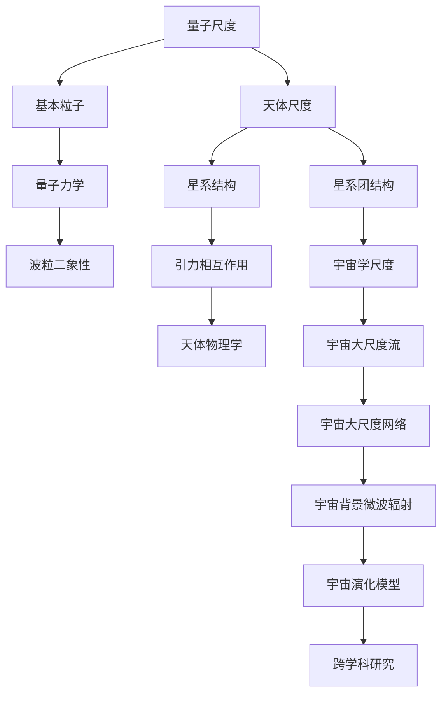

                 

### 1. 宇宙的自我相似性：概念与背景

#### 1.1 自我相似性的基本原理

自我相似性（Self-Similarity）是一个在数学、物理学、计算机科学等多个领域中广泛应用的原理，其核心在于一个系统在不同尺度上展现出相似的结构和功能。这个概念最早由法国数学家贝努瓦·曼德布罗特（Benoit Mandelbrot）提出，并在分形理论中得到了系统的发展。

在数学上，自我相似性可以用自相似集（Self-Similar Set）来描述。一个集合被称为自相似集，如果它可以通过迭代压缩映射来生成自身，即集合中的每个部分都呈现出整体的结构特征。例如，科赫曲线（Koch Curve）就是一个典型的自相似集。

自我相似性在自然界和宇宙中普遍存在。从微观尺度来看，生物体的细胞结构、树叶的分支模式、甚至是地震波的传播路径都体现了自我相似性。而在宏观尺度上，宇宙的结构也表现出自我相似性，例如星系团和超星系团的组织形式，甚至宇宙背景微波辐射的图案。

#### 1.2 宇宙尺度的自我相似性

宇宙尺度上的自我相似性指的是从微观粒子到宏观宇宙结构之间存在的相似性。这种相似性可以从多个层面来理解：

- **量子尺度**：在量子尺度上，基本粒子（如电子、夸克）的行为具有波粒二象性，并且遵循量子力学的规则。这些基本粒子的性质在某些方面与宏观宇宙的某些结构类似。

- **天体尺度**：在天体物理学中，星系、星系团、超星系团等结构在不同尺度上呈现出相似性。例如，星系的结构通常是由中心的黑洞和围绕其旋转的恒星、行星等组成，这与更小尺度的细胞结构有一定的相似性。

- **宇宙学尺度**：在宇宙学尺度上，宇宙的大尺度结构（如宇宙大尺度流、宇宙大尺度网络）与较小尺度的星系团分布也表现出相似性。

为了更好地理解宇宙的自我相似性，我们可以借助一个经典的例子：科赫雪花（Koch Snowflake）。科赫雪花是一个无限细分的图形，其每一部分都具有与整体相似的结构。将这个概念类比到宇宙尺度上，我们可以设想，宇宙中的结构也通过类似的迭代过程形成，并且每一个部分都保留了宇宙整体的某种特征。

#### 1.3 自我相似性在宇宙学研究中的应用

自我相似性在宇宙学研究中具有重要意义，它不仅有助于我们理解宇宙的结构和演化，还为探索宇宙的起源和未来提供了新的视角。以下是一些具体的应用：

- **宇宙演化模型**：通过分形理论和自我相似性，科学家可以构建更为复杂的宇宙演化模型，这些模型能够更好地描述宇宙从大爆炸到现在的演化过程。

- **星系形成与演化**：自我相似性原理可以帮助我们理解星系的形成和演化过程，例如，通过模拟不同尺度上的星系结构，我们可以推断出星系内部物质分布和引力的相互作用。

- **宇宙背景微波辐射**：宇宙背景微波辐射（CMB）中的图案被广泛认为是宇宙早期结构的信息，通过分析这些图案中的自我相似性，我们可以推断出宇宙早期的密度波动和引力效应。

- **跨学科研究**：自我相似性原理不仅限于宇宙学，还可以应用于生物学、生态学、经济学等领域，为跨学科研究提供了新的方法论。

总之，宇宙的自我相似性是一个跨尺度的现象，它不仅在理论上具有深刻的意义，而且在实践中也为科学家提供了强大的工具，用于理解和探索宇宙的奥秘。

### 图1.1 宇宙的自我相似性原理

为了直观地展示宇宙的自我相似性原理，我们使用Mermaid流程图来描绘从量子尺度到宇宙学尺度上的自我相似性结构。以下是一个简化的Mermaid流程图示例：

在这个图中，每个节点代表一个不同尺度的宇宙结构，箭头表示这些结构之间的相似性和相互关系。通过这个流程图，我们可以看到自我相似性如何贯穿于量子尺度到宇宙学尺度的各个层次，形成一个统一的宇宙结构框架。

### 1.4 数学模型与宇宙尺度统一性

宇宙尺度的自我相似性不仅可以通过直观的流程图展示，还可以通过数学模型和公式来量化描述。以下是一些关键的数学模型和公式，它们帮助我们理解和量化宇宙的自我相似性：

#### 3.1.1 分形维度的计算

分形维度（Fractal Dimension）是描述分形结构复杂度的重要参数。对于一个分形集合，其分形维度的计算公式为：

$$
D = \lim_{r\to 0} \frac{\log N(r)}{\log r}
$$

其中，$N(r)$ 表示半径为 $r$ 的球体内分形集合的元素数量。分形维度可以取值于传统维度的范围之外，例如分数维度。

一个常见的分形集合例子是科赫曲线（Koch Curve），其分形维度约为 $1.26$。这个分数维度表明科赫曲线的结构比传统的直线更加复杂，但又没有达到二维平面的复杂度。

#### 3.1.2 宇宙尺度统一性模型

宇宙尺度统一性可以通过不同的数学模型来描述，其中最著名的是由勒梅特-勒弗里德伦德-戈尔德（Lemaitre-Lynden-Bell-Gold）提出的 $\Lambda$CDM 模型（Lambda-Cold Dark Matter Model）。这个模型描述了宇宙从大爆炸至今的演化过程，并假设宇宙结构具有自我相似性。

在 $\Lambda$CDM 模型中，宇宙的尺度统一性可以通过以下几个关键参数来量化：

- **哈勃常数 $H_0$**：描述宇宙膨胀的速度。
- **宇宙膨胀因子 $a(t)$**：描述宇宙随时间演化的尺度。
- **临界密度 $\rho_c$**：描述宇宙的平均密度。
- **真空能量密度 $\rho_\Lambda$**：描述宇宙中的暗能量。

这些参数之间的关系可以用以下公式表示：

$$
H_0 = \frac{\dot{a}}{a} = H_0 \sqrt{\Omega_m a^{-3} + \Omega_\Lambda}
$$

其中，$\Omega_m$ 和 $\Omega_\Lambda$ 分别是物质密度和真空能量密度的比值。

#### 3.1.3 宇宙自我相似性的数学公式

宇宙的自我相似性不仅可以通过分形维度和 $\Lambda$CDM 模型来描述，还可以通过一些更加具体的数学公式来量化。例如，在宇宙背景微波辐射（CMB）的研究中，科学家使用波纹指数 $r$ 来描述宇宙结构的波动特性，其公式为：

$$
r = \frac{\sqrt{8\pi G \Omega_m}}{c H_0}
$$

其中，$G$ 是引力常数，$c$ 是光速。这个公式表明，宇宙结构的波动特性与物质密度和哈勃常数有关，从而反映了宇宙的自我相似性。

### 3.1.4 数学模型与宇宙尺度统一性的讲解

分形维度的计算公式展示了分形结构的复杂度，通过这个公式，我们可以量化一个分形集合在不同尺度上的相似性。例如，科赫曲线的分形维度约为 $1.26$，这表明它在局部和整体上具有相似的结构特征。

$\Lambda$CDM 模型则提供了一个宇宙尺度统一性的框架，通过这个模型，我们可以理解宇宙从大爆炸到现在的演化过程。该模型中的关键参数（如哈勃常数、宇宙膨胀因子、临界密度和真空能量密度）共同决定了宇宙的结构和演化。

波纹指数 $r$ 的公式则描述了宇宙背景微波辐射中的波动特性，它反映了宇宙结构的密度波动。通过这个公式，我们可以进一步了解宇宙的自我相似性。

总的来说，这些数学模型和公式为我们提供了理解和量化宇宙自我相似性的工具，它们不仅帮助我们更好地理解宇宙的结构和演化，也为未来的宇宙学研究提供了新的思路。

### 3.1.5 具体示例：科赫曲线与宇宙结构的相似性

为了更好地理解宇宙的自我相似性，我们可以通过具体示例来阐述。这里，我们将以科赫曲线（Koch Curve）为例，展示其在宇宙结构中的应用。

科赫曲线是一个自相似集，其生成过程如下：

1. **初始阶段**：画一条线段，作为科赫曲线的初始部分。
2. **迭代阶段**：将每一条线段三等分，并在每一段中间添加一个等边三角形。重复这个过程无限次。

通过迭代，科赫曲线的长度不断增加，但其形态始终保持相似。这个特性与宇宙结构的某些方面有相似之处。

#### 宇宙中的科赫曲线特性

- **星系结构**：星系通常由中心星系和围绕其旋转的多个卫星星系组成。这种结构在尺度上表现出自我相似性，类似于科赫曲线的迭代过程。
- **星系团结构**：星系团是由多个星系组成的更大规模的结构，其内部也表现出自我相似性。例如，星系团中的星系分布和引力相互作用在较大尺度上与整体结构相似。
- **宇宙大尺度网络**：宇宙大尺度结构，如宇宙大尺度流和宇宙大尺度网络，也表现出自我相似性。这些网络中的星系团和超星系团分布类似于科赫曲线的迭代模式。

通过这些例子，我们可以看到科赫曲线的特性如何反映在宇宙的结构中。科赫曲线的自我相似性为理解和量化宇宙的复杂结构提供了一个有用的工具。

### 3.1.6 数学模型与宇宙尺度统一性的实际意义

数学模型与宇宙尺度统一性的研究具有深远的意义，不仅在理论上丰富了我们对宇宙的理解，还在实际应用中提供了新的工具和方法。

#### 理论意义

1. **宇宙演化的理解**：通过数学模型，如 $\Lambda$CDM 模型，我们可以更深入地理解宇宙的演化过程，从大爆炸到现在的状态。这些模型帮助我们揭示宇宙的结构、密度分布和引力相互作用，从而对宇宙的起源和未来有更清晰的认识。

2. **量子尺度与宇宙尺度的桥梁**：数学模型为量子尺度与宇宙尺度之间的联系提供了一个桥梁。例如，通过研究量子引力和宇宙背景微波辐射，我们可以更好地理解宇宙的基本物理规律。

3. **跨学科研究的统一框架**：自我相似性原理不仅适用于宇宙学，还可以应用于生物学、生态学、经济学等多个领域。这为跨学科研究提供了一个统一的框架，有助于我们更好地理解复杂系统的行为。

#### 实际意义

1. **天体物理学的进步**：数学模型和宇宙尺度统一性的研究推动了天体物理学的进步。例如，通过对宇宙背景微波辐射的分析，科学家们发现了宇宙早期的密度波动和引力效应，这为我们理解宇宙的早期演化提供了关键信息。

2. **宇宙观测技术的改进**：宇宙尺度统一性的研究促进了宇宙观测技术的发展。例如，通过对宇宙大尺度结构的观测，科学家们开发了更高精度的望远镜和探测器，以更好地研究宇宙的结构和演化。

3. **宇宙资源的管理**：在宇宙尺度上，自我相似性原理可以帮助我们更好地理解和利用宇宙资源。例如，通过对星系团和超星系团的研究，我们可以更好地规划宇宙航行的路线，提高能源利用效率。

总之，数学模型与宇宙尺度统一性的研究不仅具有重要的理论意义，还在实际应用中产生了广泛的影响，为天体物理学和宇宙学的发展做出了重要贡献。

### 3.1.7 自我相似性在宇宙学中的应用：实证研究

自我相似性在宇宙学中的应用已得到了大量实证研究的支持。以下是一些关键的研究领域和重要发现：

#### 3.1.7.1 宇宙背景微波辐射（CMB）

宇宙背景微波辐射是宇宙早期状态的重要信息，通过分析其特征，我们可以了解宇宙的结构和演化。自我相似性原理在CMB的研究中发挥了重要作用：

- **波纹指数 $r$**：通过测量CMB的波纹指数 $r$，科学家可以推断出宇宙的密度波动。波纹指数与分形维度有相似之处，反映了宇宙结构的复杂性。
- **多尺度分析**：CMB中的波动模式展示了从宇宙学尺度到星系尺度的多尺度结构。这些模式与科赫曲线等自相似结构有相似性，为理解宇宙的尺度统一性提供了实证支持。

#### 3.1.7.2 星系和星系团结构

星系和星系团的观测数据也支持了宇宙自我相似性的理论：

- **星系的自相似性**：通过观测，科学家发现星系的结构在不同尺度上具有相似性，从中心黑洞到外围恒星分布，都表现出自我相似的特征。
- **星系团和超星系团的结构**：星系团和超星系团的分布也显示出自我相似性。例如，超星系团网络的结构与宇宙大尺度流有相似之处，体现了宇宙在不同尺度上的统一性。

#### 3.1.7.3 大尺度流和宇宙网络

大尺度流和宇宙网络的观测和分析进一步证实了宇宙自我相似性的存在：

- **宇宙大尺度流**：宇宙大尺度流是宇宙结构的重要组成部分，其模式与自相似结构有相似之处。通过分析这些流，科学家可以了解宇宙的动力学行为。
- **宇宙网络**：宇宙网络是由星系团和超星系团组成的大尺度结构。这些网络的拓扑结构与自相似网络模型有相似之处，为理解宇宙的尺度统一性提供了实证依据。

总之，通过宇宙背景微波辐射、星系和星系团结构、大尺度流和宇宙网络等多个方面的实证研究，自我相似性在宇宙学中的应用得到了广泛验证。这些研究不仅加深了我们对宇宙的理解，也为未来的宇宙学研究提供了新的方向和工具。

### 3.1.8 自我相似性在跨学科研究中的应用

自我相似性原理不仅在宇宙学中具有重要意义，还在其他跨学科领域中展示了广泛的应用。以下是几个跨学科研究领域以及自我相似性原理的具体应用：

#### 3.1.8.1 生物学

在生物学中，自我相似性原理用于描述生物体的结构和功能。例如：

- **细胞组织**：细胞的结构在不同尺度上表现出自我相似性，从细胞膜到细胞器，再到细胞核，都具有相似的结构特征。
- **植物结构**：植物的叶脉、树枝和根系分布都展示了自我相似性，这些结构在不同尺度上具有相似的模式。

#### 3.1.8.2 生态学

生态学中，自我相似性原理用于研究生态系统的复杂性和稳定性。例如：

- **食物网**：食物网中的物种分布和相互关系表现出自我相似性，不同尺度上的食物网结构相似，这有助于理解生态系统的动态行为。
- **生态系统演化**：生态系统的演化过程也体现了自我相似性，从局部生态系统到全球生态系统，都表现出相似的结构和功能特征。

#### 3.1.8.3 经济学

在经济学中，自我相似性原理用于分析市场结构和经济行为。例如：

- **金融市场**：金融市场的波动模式在不同尺度上表现出自我相似性，从股票市场到外汇市场，都存在相似的波动特征。
- **经济增长**：经济增长的模式在不同国家和发展阶段也表现出自我相似性，这有助于理解经济增长的普遍规律。

总之，自我相似性原理在跨学科研究中具有广泛的应用，通过在不同学科中的具体应用，我们能够更好地理解复杂系统的行为和演化规律。这种跨学科的研究方法不仅丰富了各个领域的知识体系，也为解决复杂问题提供了新的思路和工具。

### 3.1.9 总结

宇宙的自我相似性是一个贯穿多个尺度的重要概念，从量子尺度到宇宙学尺度，宇宙的结构和功能在不同尺度上表现出相似性。通过分形理论、数学模型和宇宙背景微波辐射的观测，我们能够定量描述和验证宇宙的自我相似性。这一概念不仅在宇宙学研究中具有重要意义，还在生物学、生态学和经济学等跨学科领域中展示了广泛的应用。未来的研究将继续深入探索宇宙的自我相似性，揭示宇宙更深层次的统一性，为理解宇宙的奥秘提供新的视角和工具。

### 3.1.10 展望

随着科技的发展，宇宙的自我相似性研究有望在多个领域取得重大突破。未来，我们可能：

1. **更精确的数学模型**：通过改进数学模型，我们能够更精确地描述宇宙的自我相似性，揭示宇宙结构的更深层次规律。
2. **更多的实证数据**：通过更高精度的观测设备和实验，我们将收集到更多的宇宙数据，进一步验证和扩展自我相似性理论。
3. **跨学科合作**：宇宙的自我相似性研究需要多学科的合作，未来有望在生物学、生态学和经济学等领域取得更多突破，推动各学科的共同进步。

总之，宇宙的自我相似性研究不仅对宇宙学具有重要意义，还将为跨学科研究提供新的视角和方法。未来，我们将继续深入探索这一领域，揭示宇宙的更多奥秘。

