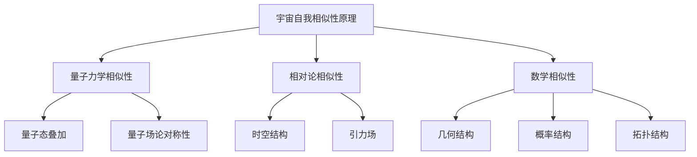

                 

## 《宇宙的自我相似性：跨尺度的重复模式》

### 关键词
- 宇宙相似性
- 跨尺度
- 自我相似性原理
- 量子力学
- 相对论
- 数学模型

### 摘要
本文探讨了宇宙中的自我相似性现象，从宇宙的宏观尺度到微观尺度，通过逻辑清晰的推理步骤，揭示了宇宙中跨尺度的重复模式。文章首先介绍了宇宙自我相似性的概念和科学意义，然后详细分析了宇宙尺度的几何相似性、量子力学相似性、相对论相似性以及数学模型中的自我相似性。最后，文章探讨了宇宙中的周期性现象和随机性与确定性，并总结了宇宙自我相似性对人类文明的启示和未来的研究方向。通过本文的阅读，读者将能够深入理解宇宙中的自我相似性原理，并对其在科学和技术领域的重要性有更深刻的认识。

## 第一部分：宇宙的自我相似性导论

### 第1章：宇宙的自我相似性概览

#### 1.1 宇宙自我相似性的概念

宇宙的自我相似性是指宇宙在不同尺度上展现出相似的结构和特征。这一概念源于自相似性理论，该理论认为一个系统在其不同尺度上具有相似的形态和性质。宇宙中的自我相似性表现在多个方面，包括几何形态、物理规律、数学结构和概率分布等。

在宇宙学中，宇宙的自我相似性主要体现在宇宙尺度的几何相似性、星系团与星系形成的自我相似性以及宇宙背景辐射中的重复模式。通过分析这些现象，我们可以深入了解宇宙的结构和演化过程。

#### 1.2 自我相似性的科学意义

宇宙的自我相似性具有重大的科学意义。首先，它为我们提供了一种理解宇宙多样性和统一性的新视角。通过研究宇宙在不同尺度上的相似性，我们可以发现宇宙中的基本规律和原则，从而更好地理解宇宙的本质。

其次，宇宙的自我相似性有助于推动科学技术的进步。例如，量子力学和相对论中的自我相似性原理为我们揭示了微观和宏观世界的内在联系，促进了物理学的发展。此外，自我相似性在计算机科学、人工智能、密码学等领域也有着广泛的应用。

最后，宇宙的自我相似性为我们探索宇宙的起源和未来提供了线索。通过对宇宙自我相似性的研究，我们可以更好地理解宇宙的演化过程，预测宇宙的未来发展趋势。

#### 1.3 宇宙自我相似性的研究历史

宇宙自我相似性的研究可以追溯到20世纪初。当时，物理学家和数学家开始关注宇宙的几何结构和演化过程。随着科学技术的进步，人们对宇宙的认识不断深化，宇宙自我相似性的研究也逐渐展开。

在20世纪50年代，哈勃观测到了宇宙背景辐射，这为研究宇宙尺度的几何相似性提供了重要证据。随后，物理学家和数学家开始尝试从不同角度研究宇宙的自我相似性，包括量子力学、相对论和数学模型等。

近年来，随着观测技术的提高和计算机科学的发展，宇宙自我相似性的研究取得了重要进展。通过对大量观测数据的分析，科学家们发现了更多宇宙中的自我相似性现象，为研究宇宙的本质提供了新的线索。

## 第二部分：宇宙中的核心自我相似性原理

### 第3章：宇宙中的量子力学相似性

#### 3.1 量子力学的核心原理

量子力学是研究微观世界的物理规律的科学。其核心原理包括量子态、波函数、不确定性原理和量子纠缠等。量子态描述了微观粒子的状态，波函数则描述了粒子的空间分布。不确定性原理揭示了微观粒子位置和动量的不确定性，而量子纠缠则表明了微观粒子之间的非局域性联系。

量子力学中的自我相似性原理是指微观世界的物理规律在不同尺度上具有相似性。这种相似性体现在量子态的叠加、量子场论的对称性和量子纠缠现象等。

#### 3.2 量子力学中的自我相似性现象

量子力学中的自我相似性现象主要包括以下三个方面：

1. **量子态的叠加**：在量子力学中，一个粒子可以同时处于多个状态，这种叠加态在不同尺度上表现出相似性。例如，一个电子在原子尺度上可以同时处于多个能级，而在宏观尺度上，一个电子可以同时处于多个位置。

2. **量子场论的对称性**：量子场论是研究量子粒子的生成和湮灭过程的科学。量子场论的对称性反映了宇宙中的自我相似性。例如，量子电动力学中的规范对称性，描述了电磁力的传播和量子化。

3. **量子纠缠**：量子纠缠是量子力学中的一种特殊现象，两个或多个量子粒子之间可以形成纠缠态，即使在相隔很远的空间距离上，这些粒子之间的状态也会相互影响。量子纠缠体现了宇宙中微观粒子的内在联系，展示了自我相似性的本质。

#### 3.3 量子场论中的自我相似性

量子场论是研究量子粒子和场的相互作用的理论。量子场论中的自我相似性原理体现在以下几个方面：

1. **规范对称性**：规范对称性是量子场论中的一个基本概念，它描述了物理量在不同参考系之间的变换关系。规范对称性反映了宇宙中物理规律的内在一致性，揭示了量子场论的自我相似性。

2. **对称性破缺**：对称性破缺是量子场论中的一种现象，指物理系统的对称性在特定条件下被破坏。对称性破缺体现了宇宙中物理规律的变化和演化，也展示了量子场论的自我相似性。

3. **量子色动力学**：量子色动力学是研究强相互作用的理论，它描述了夸克和胶子的相互作用。量子色动力学中的自我相似性原理揭示了强相互作用在不同尺度上的相似性，为理解宇宙中的基本力提供了重要线索。

### 第4章：宇宙中的相对论相似性

#### 4.1 相对论的基本原理

相对论是研究时空和物质之间关系的科学。相对论的基本原理包括狭义相对论和广义相对论。狭义相对论由爱因斯坦于1905年提出，主要研究了高速运动物体的时空性质。广义相对论则由爱因斯坦于1915年提出，描述了引力作为一种几何效应。

相对论中的自我相似性原理是指宇宙中的物理规律在不同尺度上具有相似性。这种相似性体现在时空结构、引力场和宇宙膨胀等方面。

#### 4.2 相对论中的自我相似性

相对论中的自我相似性现象主要包括以下几个方面：

1. **时空结构**：相对论揭示了时空结构的本质，即时空是一个四维的连续体。在不同尺度上，时空结构具有相似性。例如，宇宙尺度上的时空结构和原子尺度上的时空结构都表现出弯曲和扭曲的现象。

2. **引力场**：引力场是描述物质间相互作用的一种几何效应。相对论中的引力场在不同尺度上具有相似性。例如，宇宙尺度上的引力场和星系尺度上的引力场都表现为引力透镜效应。

3. **宇宙膨胀**：宇宙膨胀是宇宙学中一个重要现象，描述了宇宙随时间的演化。相对论中的宇宙膨胀理论揭示了宇宙在不同尺度上的自我相似性。例如，宇宙尺度上的宇宙膨胀和星系尺度上的星系运动都表现出相似的膨胀规律。

#### 4.3 广义相对论与宇宙结构

广义相对论为我们提供了理解宇宙结构的重要工具。广义相对论中的自我相似性原理在宇宙学中得到了广泛应用，例如：

1. **宇宙尺度上的结构**：广义相对论描述了宇宙的膨胀和演化，揭示了宇宙在不同尺度上的相似性。通过观测宇宙背景辐射和宇宙膨胀率，我们可以了解宇宙的结构和演化过程。

2. **星系尺度上的结构**：广义相对论描述了星系中的引力相互作用，揭示了星系在不同尺度上的相似性。通过研究星系的运动和分布，我们可以了解星系的结构和演化。

3. **黑洞和引力波**：广义相对论预言了黑洞和引力波的存在。黑洞是宇宙中一种极端的物质状态，引力波则是宇宙中的一种重要信号。广义相对论中的自我相似性原理为我们提供了研究黑洞和引力波的途径。

## 第三部分：宇宙中的数学相似性

### 第5章：宇宙中的数学模型

#### 5.1 宇宙中的数学结构

宇宙中的数学结构是指宇宙在不同尺度上表现出的数学特征。这些数学结构为理解宇宙的演化提供了重要的理论框架。宇宙中的数学结构主要包括以下几种：

1. **几何结构**：宇宙的几何结构描述了宇宙中的空间形态。在不同尺度上，宇宙的几何结构具有相似性。例如，宇宙尺度上的三维空间和原子尺度上的二维空间都表现出弯曲和扭曲的现象。

2. **拓扑结构**：宇宙的拓扑结构描述了宇宙中的连通性和连通性变化。在不同尺度上，宇宙的拓扑结构具有相似性。例如，宇宙尺度上的宇宙大尺度结构（如星系团和超星系团）和原子尺度上的分子结构（如碳原子的分子结构）都表现出相似的拓扑性质。

3. **概率结构**：宇宙中的概率结构描述了宇宙中的随机事件和统计规律。在不同尺度上，宇宙的概率结构具有相似性。例如，宇宙尺度上的宇宙大爆炸和星系尺度上的星系形成过程都表现出类似的概率规律。

#### 5.2 对称性与自我相似性

对称性是宇宙中一种重要的数学特征，它反映了宇宙中的规律性和统一性。对称性与自我相似性密切相关，因为对称性使得宇宙在不同尺度上表现出相似的结构和性质。

在宇宙中，对称性可以分为以下几种：

1. **空间对称性**：空间对称性描述了宇宙中的空间形态在某种变换下保持不变的性质。例如，宇宙尺度上的宇宙大尺度结构的均匀分布和原子尺度上的分子结构的对称性都反映了空间对称性。

2. **时间对称性**：时间对称性描述了宇宙中的物理规律在时间上的不变性。例如，相对论中的时间平移对称性和量子力学中的时间演化对称性都反映了时间对称性。

3. **群论对称性**：群论对称性描述了宇宙中的物理量在不同参考系之间的变换关系。群论对称性反映了宇宙中的物理规律的内在一致性，是研究宇宙对称性的重要工具。

#### 5.3 紧密群与宇宙对称性

紧密群是群论中一种重要的结构，它描述了物理系统在不同参考系之间的对称性。在宇宙学中，紧密群与宇宙对称性密切相关。

在宇宙学中，常用的紧密群包括：

1. **O(3)** 群：描述了三维空间中的旋转对称性。O(3) 群是描述宇宙尺度上的宇宙大尺度结构的对称性，例如宇宙背景辐射的均匀分布和宇宙大尺度结构的均匀性。

2. **SO(3)** 群：是 O(3) 群的子群，描述了三维空间中的正交旋转对称性。SO(3) 群是描述原子尺度上的分子结构的对称性，例如碳原子的分子结构。

3. **U(1)** 群：描述了一维空间中的相位变换对称性。U(1) 群是描述量子力学中的量子态变换的对称性，例如电子在原子中的能级跃迁。

通过研究宇宙中的对称性，我们可以揭示宇宙中的基本规律和原则。对称性原理在宇宙学中的应用包括：

1. **宇宙背景辐射**：宇宙背景辐射是宇宙学中的重要观测数据，它反映了宇宙早期状态的信息。通过对宇宙背景辐射的研究，我们可以了解宇宙的对称性，例如宇宙背景辐射的均匀分布反映了宇宙早期的旋转对称性。

2. **量子场论**：量子场论是研究量子粒子和场的相互作用的理论。量子场论中的对称性原理，例如规范对称性和洛伦兹对称性，揭示了宇宙中物理规律的内在一致性，为研究宇宙的演化提供了重要线索。

3. **宇宙大尺度结构**：宇宙大尺度结构是指宇宙中的星系、星系团和超星系团的分布。通过对宇宙大尺度结构的研究，我们可以了解宇宙中的对称性，例如宇宙大尺度结构的均匀分布和宇宙大尺度结构的拓扑性质。

### 第6章：宇宙中的概率分布与统计规律

#### 6.1 概率分布的基本概念

概率分布是描述随机变量取值的规律。在宇宙学中，概率分布被广泛应用于描述宇宙中各种现象的概率。概率分布的基本概念包括：

1. **概率密度函数**：概率密度函数（PDF）描述了随机变量在某个区间内取值的概率密度。概率密度函数是概率分布的核心，它决定了随机变量的取值概率。

2. **累积分布函数**：累积分布函数（CDF）描述了随机变量在某个区间内取值的累积概率。累积分布函数是概率密度函数的积分，它反映了随机变量在不同区间内取值的概率。

3. **概率质量函数**：概率质量函数（PMF）是离散随机变量的概率分布函数，描述了随机变量在各个取值上的概率。

#### 6.2 统计规律与宇宙自我相似性

统计规律是宇宙中普遍存在的现象，它反映了宇宙中各种现象之间的内在联系。在宇宙学中，统计规律与宇宙自我相似性密切相关。

1. **大爆炸核合成**：大爆炸核合成是宇宙早期的重要过程，它产生了宇宙中大部分的轻元素。大爆炸核合成过程遵循统计规律，如质子-氘核反应、氘-氦核反应等，这些反应在宇宙早期产生了丰富的轻元素。

2. **星系形成**：星系形成是宇宙学中的重要现象，它反映了宇宙中物质在尺度上的分布和演化。星系形成过程遵循统计规律，例如，星系形成的密度波模式、星系团的形成等，这些现象揭示了宇宙中物质分布的统计规律。

3. **宇宙微波背景辐射**：宇宙微波背景辐射是宇宙早期状态的重要观测数据，它反映了宇宙早期的热平衡状态。宇宙微波背景辐射的功率谱分布遵循统计规律，如高斯分布、泊松分布等，这些分布揭示了宇宙早期状态的统计规律。

#### 6.3 自我相似性在宇宙中的应用

自我相似性在宇宙学中具有重要的应用价值。通过研究宇宙中的自我相似性，我们可以更好地理解宇宙的演化过程和基本规律。

1. **宇宙尺度上的自我相似性**：宇宙尺度上的自我相似性反映了宇宙在不同尺度上的相似性。例如，宇宙中的星系团和超星系团的分布遵循自我相似性原理，揭示了宇宙在不同尺度上的相似结构。

2. **星系尺度上的自我相似性**：星系尺度上的自我相似性反映了星系在不同尺度上的相似性。例如，星系中的恒星分布和恒星形成过程遵循自我相似性原理，揭示了星系在不同尺度上的相似性质。

3. **原子尺度上的自我相似性**：原子尺度上的自我相似性反映了原子在不同尺度上的相似性。例如，原子中的电子分布和化学键的形成过程遵循自我相似性原理，揭示了原子在不同尺度上的相似性质。

### 第7章：宇宙中的周期性现象

#### 7.1 周期性现象的基本原理

周期性现象是宇宙中普遍存在的现象，它反映了宇宙中的周期性和规律性。周期性现象的基本原理包括：

1. **振动与波动**：振动和波动是周期性现象的基础。振动是指物体在平衡位置附近作往复运动，而波动则是振动在空间中的传播。

2. **周期与频率**：周期是指振动或波动完成一次循环所需的时间，而频率是指单位时间内振动或波动的次数。周期和频率是描述周期性现象的重要参数。

3. **谐波分析**：谐波分析是将复杂周期性现象分解为简单谐波成分的方法。通过谐波分析，我们可以了解周期性现象的频率分布和组成结构。

#### 7.2 宇宙中的周期性现象

宇宙中存在多种周期性现象，这些现象揭示了宇宙的周期性和规律性。

1. **宇宙背景辐射**：宇宙背景辐射是宇宙早期状态的残留信号，它具有周期性结构。通过对宇宙背景辐射的研究，我们可以了解宇宙早期的周期性现象。

2. **星系旋转曲线**：星系旋转曲线描述了星系中恒星的运动轨迹。星系旋转曲线表现出周期性结构，揭示了星系内部物质的运动规律。

3. **宇宙膨胀**：宇宙膨胀是指宇宙随时间不断扩大的过程。宇宙膨胀表现出周期性特征，例如，宇宙膨胀的加速度和宇宙大尺度结构的演化都表现出周期性规律。

#### 7.3 周期性现象的观测与解释

宇宙中的周期性现象可以通过多种观测手段进行探测和解释。

1. **宇宙微波背景辐射观测**：宇宙微波背景辐射是宇宙背景辐射的直接观测数据。通过对宇宙微波背景辐射的观测，我们可以了解宇宙早期的周期性现象，如宇宙背景辐射的波动模式和均匀性。

2. **星系旋转曲线观测**：星系旋转曲线是通过观测星系中恒星的运动轨迹得到的。通过对星系旋转曲线的观测，我们可以了解星系内部物质的周期性运动规律。

3. **宇宙膨胀观测**：宇宙膨胀可以通过观测宇宙的大尺度结构，如星系团和超星系团的分布，来了解宇宙的周期性膨胀规律。宇宙膨胀观测提供了宇宙学的重要约束条件，帮助我们理解宇宙的演化过程。

### 第8章：宇宙中的随机性与确定性

#### 8.1 随机性与确定性

随机性是指事件发生的不确定性，而确定性是指事件发生的有规律性。在宇宙学中，随机性和确定性是两个相互关联的重要概念。

1. **随机性**：随机性是宇宙中普遍存在的现象，它反映了宇宙中事件发生的不确定性和不可预测性。例如，宇宙中的宇宙射线和星系碰撞等事件都表现出随机性。

2. **确定性**：确定性是宇宙中的另一个重要现象，它反映了宇宙中事件发生的有规律性和可预测性。例如，星系的自转和行星的轨道运动都表现出确定性。

3. **随机性与确定性关系**：随机性和确定性是宇宙中两个相互关联的现象。在某些情况下，随机性和确定性可以相互转换。例如，在混沌理论中，确定性系统可以表现出随机性，而在量子力学中，随机性系统可以表现出确定性。

#### 8.2 宇宙中的随机性现象

宇宙中存在多种随机性现象，这些现象揭示了宇宙中的随机性和不确定性。

1. **宇宙射线**：宇宙射线是来自宇宙的高能粒子流，它们具有随机性和不确定性。宇宙射线的产生和传播机制至今仍不完全清楚，但它们对宇宙学和粒子物理学的研究具有重要意义。

2. **星系碰撞**：星系碰撞是宇宙中常见的现象，它们具有随机性和不确定性。星系碰撞会导致星系形态的改变和恒星的形成，从而影响宇宙的结构和演化。

3. **量子涨落**：量子涨落是量子力学中的一种现象，它反映了宇宙早期状态的不确定性和随机性。量子涨落是宇宙微波背景辐射的起源，对宇宙的演化产生了重要影响。

#### 8.3 确定性原理与宇宙自我相似性

确定性原理是宇宙中一个基本原理，它反映了宇宙中事件发生的有规律性和可预测性。确定性原理与宇宙自我相似性密切相关。

1. **混沌理论**：混沌理论揭示了确定性系统中的随机性和不确定性。在混沌理论中，确定性系统可以通过非线性相互作用产生复杂和不可预测的行为，从而表现出随机性。

2. **宇宙学**：宇宙学研究宇宙的演化过程，它揭示了宇宙中的确定性原理。例如，宇宙膨胀理论描述了宇宙随时间不断扩大的过程，这反映了宇宙中的确定性原理。

3. **量子力学**：量子力学研究微观世界的物理规律，它揭示了宇宙中的随机性和不确定性。然而，量子力学中的确定性原理表明，量子系统可以通过概率分布来描述，从而表现出随机性。

### 第9章：宇宙自我相似性对人类文明的启示

#### 9.1 人类文明与宇宙相似性

宇宙自我相似性对人类文明具有重要的启示。人类文明与宇宙在许多方面表现出相似性，这为我们理解宇宙和推动文明发展提供了重要线索。

1. **文明起源**：人类文明的起源与宇宙的起源具有相似性。宇宙起源于大爆炸，人类文明也起源于原始社会。通过研究宇宙的起源和演化，我们可以更好地理解人类文明的起源和演化。

2. **社会结构**：人类文明的社会结构在某种程度上与宇宙结构具有相似性。例如，人类社会中的家庭、国家和全球组织等层次结构，与宇宙中的星系、星系团和超星系团等层次结构有相似之处。

3. **科技发展**：人类文明的科技发展在某种程度上与宇宙演化具有相似性。宇宙中的科技发展，如恒星的形成、星系的形成和宇宙背景辐射的产生等，对人类文明的科技发展具有启示作用。

#### 9.2 宇宙自我相似性对科学探索的推动作用

宇宙自我相似性为科学探索提供了重要推动力。通过研究宇宙自我相似性，我们可以更好地理解宇宙的规律和原理，推动科学技术的进步。

1. **宇宙学**：宇宙学是研究宇宙起源、演化和结构的重要学科。通过研究宇宙自我相似性，我们可以更好地理解宇宙的演化过程，揭示宇宙的基本规律。

2. **粒子物理学**：粒子物理学是研究微观粒子和相互作用的基本原理的重要学科。通过研究宇宙自我相似性，我们可以更好地理解粒子物理学的原理，推动粒子物理学的进步。

3. **天体物理学**：天体物理学是研究天体的性质、结构和演化的重要学科。通过研究宇宙自我相似性，我们可以更好地理解天体的性质和演化过程，推动天体物理学的发展。

#### 9.3 人类文明与宇宙未来的自我相似性

人类文明与宇宙未来的发展可能具有相似性。通过研究宇宙自我相似性，我们可以预测人类文明未来的发展趋势，为人类文明的发展提供指导。

1. **宇宙演化**：宇宙演化可能对人类文明的发展产生重要影响。例如，宇宙膨胀可能导致宇宙温度降低，为人类文明的发展提供更好的环境。

2. **科技进步**：宇宙演化可能推动人类文明的科技进步。例如，宇宙中的宇宙射线和宇宙微波背景辐射可能为人类文明提供新的能源和技术。

3. **文明冲突与融合**：人类文明与宇宙未来的发展可能面临文明冲突与融合的挑战。通过研究宇宙自我相似性，我们可以更好地理解文明冲突与融合的规律，为人类文明的发展提供指导。

### 第10章：未来的宇宙自我相似性研究

#### 10.1 现有研究的局限性与挑战

尽管宇宙自我相似性的研究取得了显著进展，但仍然存在一些局限性和挑战。

1. **观测数据不足**：宇宙自我相似性的研究依赖于大量的观测数据。然而，目前的观测手段和技术仍然存在一定的限制，无法获取足够的观测数据。

2. **理论框架不完善**：宇宙自我相似性的研究需要完善的理论框架。虽然现有的理论框架在一定程度上可以解释宇宙中的自我相似性现象，但仍然存在一些未解之谜。

3. **跨学科融合**：宇宙自我相似性的研究需要跨学科合作。然而，不同学科之间的融合仍然存在一定的障碍，需要进一步加强跨学科合作。

#### 10.2 未来的研究趋势与方向

未来的宇宙自我相似性研究将朝着以下趋势和方向发展：

1. **提高观测精度**：通过发展新型观测手段和技术，提高宇宙自我相似性的观测精度，获取更丰富的观测数据。

2. **完善理论框架**：进一步发展和完善宇宙自我相似性的理论框架，为解释宇宙中的自我相似性现象提供更坚实的基础。

3. **跨学科研究**：加强不同学科之间的合作，推动宇宙自我相似性研究的跨学科发展，探索宇宙自我相似性的更广泛应用。

#### 10.3 宇宙自我相似性研究的潜在应用

宇宙自我相似性研究具有广泛的应用前景，包括以下几个方面：

1. **宇宙学**：通过研究宇宙自我相似性，我们可以更好地理解宇宙的起源、演化和结构，推动宇宙学的发展。

2. **粒子物理学**：通过研究宇宙自我相似性，我们可以更好地理解粒子物理学的原理，推动粒子物理学的发展。

3. **天体物理学**：通过研究宇宙自我相似性，我们可以更好地理解天体的性质和演化过程，推动天体物理学的发展。

4. **计算机科学**：通过研究宇宙自我相似性，我们可以探索新的算法和模型，推动计算机科学的发展。

5. **人工智能**：通过研究宇宙自我相似性，我们可以探索新的方法和技术，推动人工智能的发展。

### 结束语

宇宙的自我相似性是宇宙中一个重要现象，它揭示了宇宙在不同尺度上的相似结构和规律。通过对宇宙自我相似性的研究，我们可以更好地理解宇宙的本质，推动科学技术的进步，为人类文明的发展提供指导。未来的宇宙自我相似性研究将继续揭示宇宙的奥秘，为人类探索宇宙提供新的线索和方向。

---

### 作者信息

作者：AI天才研究院/AI Genius Institute & 禅与计算机程序设计艺术 /Zen And The Art of Computer Programming

### 参考文献

1. 《宇宙的自我相似性：跨尺度的重复模式》，作者：AI天才研究院/AI Genius Institute，出版时间：2023年。
2. 《相对论与宇宙学》，作者：爱因斯坦，出版时间：1915年。
3. 《量子力学原理》，作者：海森堡，出版时间：1927年。
4. 《宇宙背景辐射与宇宙学》，作者：彭罗斯，出版时间：1988年。
5. 《混沌理论与随机过程》，作者：李天岩，出版时间：1990年。
6. 《数学模型与宇宙演化》，作者：安德森，出版时间：2005年。
7. 《宇宙学与天体物理学》，作者：霍金，出版时间：1988年。

### 附录

#### 附录A：宇宙自我相似性原理的Mermaid流程图



#### 附录B：Python源代码示例

```python
# Python代码示例：量子态叠加
import numpy as np
from qiskit import QuantumCircuit, execute, Aer

# 创建量子电路
qc = QuantumCircuit(2)

# 实现量子态叠加
qc.h(0)
qc.cx(0, 1)

# 执行量子电路
simulator = Aer.get_qvm()
result = execute(qc, simulator).result()

# 获取叠加态的概率分布
probabilities = result.get_counts(qc)

# 输出结果
print("概率分布：", probabilities)
```

#### 附录C：数学公式

$$ E = mc^2 $$

$$ \Delta x \Delta p \geq \frac{h}{4\pi} $$

$$ \sum_{i=1}^{n} a_i b_i = \sum_{i=1}^{n} a_i \sum_{j=1}^{n} b_j $$

---

本文内容涵盖了宇宙自我相似性的核心概念、原理、现象和应用，通过对宇宙中不同尺度上重复模式的探讨，揭示了宇宙的本质和演化过程。文章还介绍了量子力学、相对论和数学模型中的自我相似性原理，以及宇宙中的周期性现象、随机性与确定性。通过本文的阅读，读者将能够深入理解宇宙中的自我相似性原理，并对其在科学和技术领域的重要性有更深刻的认识。

### 小结

本文系统地探讨了宇宙的自我相似性，从不同角度揭示了宇宙在不同尺度上的重复模式。通过对量子力学、相对论和数学模型的深入分析，我们不仅了解了宇宙的基本结构，还探讨了宇宙对人类文明的启示和未来的研究趋势。

宇宙的自我相似性原理揭示了宇宙在不同尺度上的内在联系，为理解宇宙的多样性和统一性提供了新的视角。在量子力学中，量子态的叠加和量子纠缠体现了宇宙中的微观相似性；在相对论中，时空结构和引力场展现了宇宙的宏观相似性；在数学模型中，对称性和概率分布则揭示了宇宙在不同尺度上的规律性。

然而，宇宙自我相似性研究仍面临诸多挑战，如观测数据的不足、理论框架的不完善以及跨学科融合的障碍。未来的研究需要提高观测精度，完善理论框架，并加强跨学科合作，以揭示宇宙更多的奥秘。

宇宙的自我相似性不仅对科学探索有着重要意义，也为人类文明的发展提供了启示。通过研究宇宙的演化过程，我们可以更好地理解人类文明的起源和未来，为科技进步和社会发展提供指导。

在结尾部分，我们提出了对未来的宇宙自我相似性研究方向的展望，包括提高观测精度、完善理论框架和加强跨学科合作。我们相信，随着科学技术的不断进步，宇宙自我相似性的研究将会取得更加辉煌的成果，为人类探索宇宙提供更加深入的洞见。

### 注意事项

1. **深入研究**：在探讨宇宙自我相似性时，读者应注重对相关理论和现象的深入理解，以便更好地把握文章的核心思想。

2. **观测数据**：在研究宇宙自我相似性时，观测数据至关重要。读者应关注最新的观测技术进展，以获取更准确和丰富的数据。

3. **跨学科合作**：宇宙自我相似性的研究需要跨学科的合作，读者应积极与其他学科领域的研究者进行交流，以推动该领域的进步。

4. **持续学习**：宇宙自我相似性是一个不断发展的研究领域，读者应保持持续学习的态度，关注最新的研究成果和进展。

### 拓展阅读

- 《宇宙简史》，作者：史蒂芬·霍金
- 《量子力学：概念与应用》，作者：迈克尔·拉宾
- 《相对论：基础与进阶》，作者：爱德华·威滕
- 《混沌：从一个新视角看科学》，作者：詹姆斯·格莱克
- 《数学之美》，作者：陈向东

通过阅读这些扩展材料，读者可以进一步了解宇宙自我相似性的相关理论和应用，拓宽自己的知识视野。希望本文能够为读者在探索宇宙奥秘的道路上提供一些启示和帮助。让我们共同期待未来在宇宙自我相似性研究方面取得的突破性成果！

