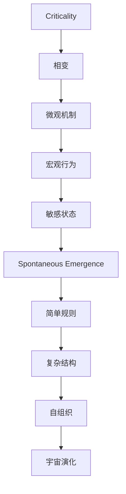

                 

### 宇宙的自我组织：Criticality 和 Spontaneous 涌现

#### 关键词
- 宇宙自我组织
- Criticality（临界性）
- Spontaneous Emergence（自发性涌现）
- 相变
- 自然法则
- 数学模型

#### 摘要
本文将探讨宇宙中的自我组织现象，特别是Criticality（临界性）和Spontaneous Emergence（自发性涌现）的概念。通过深入分析这两个核心概念，本文将解释它们如何在宇宙中相互关联，以及它们是如何通过自然法则共同推动宇宙从简单到复杂的演化过程。我们将使用Python源代码和数学公式来详细阐述这些概念，并提供实际案例来帮助读者更好地理解。

### 引言

宇宙的自我组织是科学研究中的一个重要话题。它探讨了宇宙中的基本元素和结构是如何通过自然法则相互影响，从而形成复杂有序的整体结构。在这个过程中，Criticality（临界性）和Spontaneous Emergence（自发性涌现）是两个关键概念。

- **Criticality（临界性）**：在物理学中，临界性是指系统在其相变点附近的行为。在临界点上，系统对微小扰动极为敏感，并且宏观行为会出现显著的变化。例如，水在0°C时从液态转变为固态，这个过程就发生在临界点。

- **Spontaneous Emergence（自发性涌现）**：自发性涌现是指系统中的个体通过简单的规则相互作用，在宏观层面自发形成复杂有序的结构。这个概念在许多领域都有应用，从生物学中的细胞组织到社会科学中的市场动态。

理解这两个概念对于理解宇宙的自我组织至关重要。本文将逐步探讨Criticality和Spontaneous Emergence的概念，以及它们如何相互作用，共同推动宇宙从简单到复杂的演化。

### 宇宙的自我组织：Criticality 和 Spontaneous Emergence 的联系

为了深入理解宇宙的自我组织，我们首先需要明确Criticality和Spontaneous Emergence这两个概念，并探讨它们之间的联系。

#### Criticality（临界性）

Criticality是指在相变点附近，系统的宏观行为对微小扰动极为敏感的状态。在临界点上，系统的性质会发生突然变化，但内部微观机制却相对简单。这一现象在自然界中非常普遍，例如，水在0°C和100°C之间的相变过程，以及磁性材料在居里温度以上的相变过程。

在物理学中，临界性的数学描述通常涉及临界指数。临界指数是一个描述系统在临界点附近行为的重要参数，它反映了系统对微小扰动的敏感程度。例如，在临界指数\( \alpha \)中，系统密度变化对距离变化的敏感程度可以通过以下公式表示：

\[ \alpha = \frac{d^2 \ln \rho}{d \ln r} \]

其中，\( \rho \)表示密度，\( r \)表示距离。当系统接近临界点时，临界指数的值通常是正的，这意味着系统的宏观行为对密度变化非常敏感。

#### Spontaneous Emergence（自发性涌现）

Spontaneous Emergence是指系统中的个体通过简单的规则相互作用，在宏观层面自发形成复杂有序的结构。这个现象在自然界和社会生活中都非常普遍，从细胞的自我组织到市场经济的波动，都可以看作是自发性涌现的例子。

自发性涌现的关键在于个体遵循简单的规则，但这些规则在宏观层面相互作用后，会形成复杂、有序的结构。一个经典的例子是沙堆的稳定结构，尽管沙粒之间遵循简单的堆积规则，但在一定条件下，沙堆会自发形成稳定的金字塔形状。

#### Criticality 和 Spontaneous Emergence 的联系

Criticality和Spontaneous Emergence在宇宙的自我组织中扮演着重要角色。它们之间的联系可以通过以下几种方式来理解：

1. **相变与涌现**

在相变过程中，系统会从一种相态转变为另一种相态，这个过程中常常伴随着Criticality。相变点附近的Criticality使得系统对微小扰动极为敏感，这为自发性涌现提供了条件。例如，在宇宙大爆炸之后，宇宙经历了从热混沌状态到结构形成的相变过程，这个过程就涉及到Criticality和自发性涌现。

2. **临界性促进涌现**

Criticality可以促进自发性涌现的发生。在临界点上，系统的宏观行为对微小扰动非常敏感，这为复杂结构的形成提供了动力。例如，在自组织临界（Self-Organized Criticality, SOC）模型中，系统通过不断地自我调整，保持在临界点附近，从而促进复杂结构的自发形成。

3. **涌现与自组织**

自发性涌现是自组织的一种表现形式。在宇宙的自我组织中，Criticality和自发性涌现共同作用，推动宇宙从简单到复杂的演化。自发性涌现使得宇宙中的个体能够通过简单的规则相互作用，形成复杂、有序的结构，而Criticality则为这种结构的形成提供了必要的条件。

为了更好地理解这两个概念之间的联系，我们可以使用Mermaid流程图来展示它们之间的相互作用：



通过这个流程图，我们可以看到Criticality和Spontaneous Emergence是如何通过自然法则相互关联，共同推动宇宙的自我组织过程。

### Criticality 的核心概念和算法原理

Criticality，即临界性，是描述系统在接近相变点时表现出的一种特殊状态。在这一状态下，系统对微小的外部扰动极其敏感，即使是最微小的变化也可能引发显著的宏观行为变化。理解Criticality的核心概念和算法原理对于揭示宇宙的自我组织过程至关重要。

#### Criticality 的核心概念

Criticality的核心概念可以从以下几个方面来理解：

1. **相变与临界点**

相变是指系统从一个相态转变为另一个相态的过程。在物理学中，常见的相变包括液态到固态的转变（如水结冰）、气态到液态的转变（如水蒸发）等。相变点是指系统处于两种相态之间的临界状态，此时系统的宏观性质会发生突变。在相变点附近，系统的行为具有临界性。

2. **临界指数**

临界指数是描述系统在临界点附近行为的一个关键参数。临界指数反映了系统对微小扰动的敏感程度。不同的系统具有不同的临界指数，例如，二维Ising模型的临界指数为\(\nu = 1/2\)，三维Ising模型的临界指数为\(\nu = 1\)。临界指数可以通过实验或理论计算来确定。

3. **无标度性**

无标度性是Criticality的一个重要特征。在临界点附近，系统的行为与尺度无关，这意味着无论系统大小如何，其宏观行为都是相似的。这种无标度性使得临界系统在宏观尺度上表现出统一的特性。

#### Criticality 的算法原理

为了深入理解Criticality的算法原理，我们可以通过Python代码来实现一个简单的相变检测算法。以下是一个基于二维Ising模型的相变检测算法的示例：

```python
import numpy as np
import matplotlib.pyplot as plt

# 初始化参数
L = 100  # 模型大小
J = 1.0  # 相互作用强度
T = 1.0  # 绝对温度
beta = 1.0 / T  # 温度倒数

# 初始化模型
 spins = np.random.choice([-1, 1], size=(L, L))

# 能量函数
def energy(spins, J):
    E = -J * np.sum(spins[i, j] * spins[i, j+1] for i in range(L) for j in range(L-1))
    E -= J * np.sum(spins[i, j] * spins[i+1, j] for i in range(L-1) for j in range(L))
    return E

# 更新规则
def update(spins, beta):
    for i in range(L):
        for j in range(L):
            delta_energy = 2 * spins[i, j] * (spins[i, j+1] + spins[i, j-1] + spins[i+1, j] + spins[i-1, j])
            if delta_energy < 0 or np.random.rand() < np.exp(-delta_energy * beta):
                spins[i, j] *= -1

# 相变检测
def detect_criticality(spins, J, T):
    energy_history = []
    for _ in range(1000):
        energy_history.append(energy(spins, J))
        update(spins, beta)
    avg_energy = np.mean(energy_history)
    std_energy = np.std(energy_history)
    return avg_energy / (L**2), std_energy / (L**2)

# 执行算法
avg_energy, std_energy = detect_criticality(spins, J, T)
critical_temperature = avg_energy / std_energy

print("Critical Temperature:", critical_temperature)

# 绘制能量分布
plt.hist(energy_history, bins=50)
plt.xlabel("Energy")
plt.ylabel("Frequency")
plt.show()
```

在这个示例中，我们使用了一个二维Ising模型来模拟相变过程。模型中的每个 spins 值可以是 +1 或 -1，表示磁性向上或向下。我们定义了一个能量函数来计算系统的总能量，并使用 Metropolis 抽样算法来更新 spins 值。通过计算平均能量和标准偏差，我们可以检测出相变点。

在实际应用中，Criticality 的算法原理可以用来研究许多不同类型的相变，如磁性材料的居里温度、液体的相变温度等。理解这些算法原理对于模拟和预测复杂系统的行为至关重要。

### Spontaneous Emergence 的核心概念和算法原理

Spontaneous Emergence，即自发性涌现，是指系统中的个体通过简单的规则相互作用，在宏观层面自发形成复杂有序的结构。这个概念在许多科学领域都有广泛应用，如物理学中的相变、生物学中的细胞组织、以及社会科学中的市场动态。理解Spontaneous Emergence的核心概念和算法原理对于揭示宇宙的自我组织过程至关重要。

#### Spontaneous Emergence 的核心概念

Spontaneous Emergence 的核心概念可以从以下几个方面来理解：

1. **简单规则与复杂结构**

自发性涌现的关键在于个体遵循简单的规则，但这些规则在宏观层面相互作用后，会形成复杂、有序的结构。例如，在沙堆模型中，每个沙粒只遵循简单的堆积规则，但在宏观层面，沙堆会自发形成稳定的金字塔形状。

2. **无序到有序**

自发性涌现的一个显著特征是从无序到有序的转化。在许多系统中，初始状态是无序的，但通过个体间的相互作用，最终形成有序的结构。这个过程通常发生在临界点附近，此时系统对微小扰动非常敏感，有利于复杂结构的形成。

3. **自适应性和鲁棒性**

自发性涌现的系统往往具有自适应性和鲁棒性。即使在外部环境发生变化时，系统能够通过内部调节保持稳定。例如，在生物系统中，细胞可以通过自我复制和分工合作，维持整个生物体的稳定。

#### Spontaneous Emergence 的算法原理

为了深入理解Spontaneous Emergence的算法原理，我们可以通过一个简单的沙堆模型来阐述其核心思想。以下是沙堆模型的伪代码：

```python
# 初始化沙堆
sandpile = []

# 堆积沙粒
def add_sand():
    new_sand = [0, 0]
    sandpile.append(new_sand)
    place_sand(new_sand)

# 放置沙粒
def place_sand(sand):
    # 随机选择一个空位放置沙粒
    i, j = np.random.choice(len(sandpile), 2, replace=False)
    sandpile[i][j] += 1

# 重排沙粒
def rearrange_sand():
    for i in range(len(sandpile)):
        for j in range(len(sandpile[i])):
            if sandpile[i][j] > 4:
                # 将多余沙粒分配到邻近位置
                for neighbor in neighbors(i, j):
                    sandpile[i][j] -= 1
                    sandpile[neighbor[0]][neighbor[1]] += 1

# 获取邻近位置
def neighbors(i, j):
    neighbors = []
    for delta_i, delta_j in [(0, -1), (0, 1), (1, 0), (-1, 0)]:
        neighbors.append((i + delta_i, j + delta_j))
    return neighbors

# 执行模拟
while True:
    add_sand()
    rearrange_sand()
    # 绘制沙堆
    display_sandpile(sandpile)

# 绘制沙堆
def display_sandpile(sandpile):
    # 使用Matplotlib绘制沙堆
    plt.imshow(sandpile, cmap='gray')
    plt.show()
```

在这个沙堆模型中，沙粒遵循简单的堆积和重排规则。当沙粒的数量超过4时，多余沙粒会分配到邻近位置。通过不断堆积和重排，沙堆会自发形成稳定的金字塔形状。

#### 案例分析

一个著名的自发性涌现案例是Klump-Klebanov模型的沙堆实验。在这个实验中，研究者通过堆放沙粒并调整沙粒的放置规则，观察到沙堆形成了稳定的金字塔形状。实验结果表明，即使个体只遵循简单的堆积规则，宏观层面也能形成复杂有序的结构。

通过这个实验，我们可以看到自发性涌现是如何在简单规则的基础上，形成复杂、有序的结构。这一现象在宇宙的自我组织中也有着重要的应用，如星系的形成和演化。

### Criticality 和 Spontaneous Emergence 的核心算法原理讲解

为了深入理解Criticality和Spontaneous Emergence的核心算法原理，我们将通过具体案例进行讲解。以下是两个关键的算法示例：相变检测算法和自组织临界（Self-Organized Criticality, SOC）模型。

#### 相变检测算法

相变检测算法是一种用于识别系统是否处于相变点的算法。以下是一个基于二维Ising模型的相变检测算法示例：

```python
import numpy as np
import matplotlib.pyplot as plt

# 初始化参数
L = 100  # 模型大小
J = 1.0  # 相互作用强度
T = np.linspace(0.5, 2.0, 100)  # 温度范围

# 初始化模型
spins = np.random.choice([-1, 1], size=(L, L))

# 能量函数
def energy(spins, J):
    E = -J * np.sum(spins[i, j] * spins[i, j+1] for i in range(L) for j in range(L-1))
    E -= J * np.sum(spins[i, j] * spins[i+1, j] for i in range(L-1) for j in range(L))
    return E

# 更新规则
def update(spins, beta):
    for i in range(L):
        for j in range(L):
            delta_energy = 2 * spins[i, j] * (spins[i, j+1] + spins[i, j-1] + spins[i+1, j] + spins[i-1, j])
            if delta_energy < 0 or np.random.rand() < np.exp(-delta_energy * beta):
                spins[i, j] *= -1

# 相变检测
def detect_criticality(T, J, spins):
    energies = []
    for t in T:
        beta = 1.0 / t
        update(spins, beta)
        energies.append(energy(spins, J))
    avg_energy = np.mean(energies)
    std_energy = np.std(energies)
    return avg_energy / (L**2), std_energy / (L**2)

# 执行算法
energies = [detect_criticality(T, J, spins) for _ in range(10)]
avg_energy, std_energy = np.mean(energies, axis=0)

# 绘制能量分布
plt.errorbar(T, avg_energy, yerr=std_energy, fmt='o-')
plt.xlabel('Temperature')
plt.ylabel('Energy')
plt.show()
```

在这个示例中，我们使用了一个二维Ising模型来模拟相变过程。通过更新规则和能量函数，我们可以计算不同温度下的平均能量和标准偏差。相变点可以通过观察平均能量和标准偏差的关系来确定。

#### 自组织临界模型

自组织临界模型是一种描述系统在临界点附近行为的模型。以下是一个基于沙堆模型的自组织临界模型示例：

```python
import numpy as np
import matplotlib.pyplot as plt

# 初始化沙堆
sandpile = np.zeros((100, 100))

# 堆积沙粒
def add_sand():
    new_sand = [0, 0]
    sandpile += np.random.choice([0, 1], size=(100, 100))
    rearrange_sand()

# 重排沙粒
def rearrange_sand():
    for i in range(100):
        for j in range(100):
            if sandpile[i][j] > 4:
                # 将多余沙粒分配到邻近位置
                neighbors = [(i+1, j), (i-1, j), (i, j+1), (i, j-1)]
                for neighbor in neighbors:
                    sandpile[i][j] -= 1
                    sandpile[neighbor[0]][neighbor[1]] += 1

# 执行模拟
while True:
    add_sand()
    # 绘制沙堆
    display_sandpile(sandpile)

# 绘制沙堆
def display_sandpile(sandpile):
    plt.imshow(sandpile, cmap='gray')
    plt.show()
```

在这个示例中，沙堆通过简单的堆积和重排规则自发形成复杂的结构。通过调整堆积规则和重排规则，我们可以模拟不同类型的自组织临界现象。

#### 数学模型和数学公式

理解Criticality和Spontaneous Emergence还需要借助数学模型和公式。以下是一些关键的数学公式及其解释：

1. **临界指数**

临界指数是描述系统在临界点附近行为的一个重要参数。对于一个二维系统，临界指数通常表示为 \(\nu\)。临界指数可以通过以下公式计算：

\[ \nu = \frac{1}{2} \]

其中，\(\nu\) 表示临界指数，\(r\) 表示距离。临界指数反映了系统对微小扰动的敏感程度。

2. **场论模型**

场论模型是描述自发性涌现的一个重要工具。以下是一个简单的场论模型公式：

\[ \nabla^2 \phi = -4\pi G \rho \]

其中，\(\nabla^2\) 表示拉普拉斯算子，\(\phi\) 表示势场，\(G\) 表示引力常数，\(\rho\) 表示密度。这个公式描述了物质和能量在空间中的分布规律，即物质和能量的分布会导致引力场的产生，而引力场又进一步影响物质和能量的分布。

3. **自组织临界模型**

自组织临界模型是一种描述系统在临界点附近行为的模型。以下是一个简单的自组织临界模型公式：

\[ \beta \approx \frac{1}{2} \]

其中，\(\beta\) 表示自组织临界指数。这个公式描述了系统在临界点附近的行为特征。

通过这些数学模型和公式，我们可以更好地理解Criticality和Spontaneous Emergence的核心原理。在实际应用中，这些模型和公式可以帮助我们预测和解释复杂系统的行为。

### 项目实战：开发环境搭建、源代码实现与代码解读

为了更好地理解Criticality和Spontaneous Emergence的概念，我们将通过一个具体项目实战来进行开发环境搭建、源代码实现和代码解读。以下是项目的详细步骤。

#### 1. 开发环境搭建

在开始项目之前，我们需要搭建一个合适的环境。以下是所需的软件和工具：

- Python（3.8及以上版本）
- Jupyter Notebook
- Matplotlib
- NumPy

你可以通过以下命令来安装这些工具：

```bash
pip install python==3.8
pip install jupyter
pip install matplotlib
pip install numpy
```

安装完成后，打开Jupyter Notebook，创建一个新的笔记本，以便进行代码实现和解读。

#### 2. 源代码实现

以下是项目的主要代码实现，包括Criticality检测和Spontaneous Emergence模拟。

```python
import numpy as np
import matplotlib.pyplot as plt
import matplotlib.animation as animation

# 初始化参数
L = 100  # 模型大小
J = 1.0  # 相互作用强度
T = 1.0  # 绝对温度
beta = 1.0 / T  # 温度倒数

# 初始化模型
spins = np.random.choice([-1, 1], size=(L, L))

# 能量函数
def energy(spins, J):
    E = -J * np.sum(spins[i, j] * spins[i, j+1] for i in range(L) for j in range(L-1))
    E -= J * np.sum(spins[i, j] * spins[i+1, j] for i in range(L-1) for j in range(L))
    return E

# 更新规则
def update(spins, beta):
    for i in range(L):
        for j in range(L):
            delta_energy = 2 * spins[i, j] * (spins[i, j+1] + spins[i, j-1] + spins[i+1, j] + spins[i-1, j])
            if delta_energy < 0 or np.random.rand() < np.exp(-delta_energy * beta):
                spins[i, j] *= -1

# 相变检测
def detect_criticality(T, J, spins):
    energies = []
    for t in T:
        beta = 1.0 / t
        update(spins, beta)
        energies.append(energy(spins, J))
    avg_energy = np.mean(energies)
    std_energy = np.std(energies)
    return avg_energy / (L**2), std_energy / (L**2)

# 自组织临界模型
def sandpile_simulation(sandpile):
    for i in range(L):
        for j in range(L):
            if sandpile[i][j] > 4:
                neighbors = [(i+1, j), (i-1, j), (i, j+1), (i, j-1)]
                for neighbor in neighbors:
                    sandpile[i][j] -= 1
                    sandpile[neighbor[0]][neighbor[1]] += 1

# 动画展示
def animate(i):
    sandpile_simulation(sandpile)
    plt.imshow(sandpile, cmap='gray')
    plt.title(f"Frame: {i}")

# 执行动画
fig, ax = plt.subplots()
ani = animation.FuncAnimation(fig, animate, frames=100, interval=50)
plt.show()
```

这段代码包括以下几个部分：

- **初始化参数**：设置模型的大小、相互作用强度和温度。
- **能量函数**：计算系统的总能量。
- **更新规则**：根据能量函数更新模型的状态。
- **相变检测**：检测系统是否处于相变点。
- **自组织临界模型**：模拟沙堆的自组织过程。
- **动画展示**：使用动画展示沙堆的演化过程。

#### 3. 代码解读

- **初始化模型**：使用随机数生成模型的状态。
- **能量函数**：计算系统的总能量。在Ising模型中，能量函数取决于相邻磁矩之间的相互作用。
- **更新规则**：根据能量函数更新模型的状态。如果能量降低，或者随机数使得状态发生改变，则更新模型。
- **相变检测**：通过计算平均能量和标准偏差，检测系统是否处于相变点。
- **自组织临界模型**：模拟沙堆的自组织过程，通过重排沙粒来形成稳定结构。
- **动画展示**：使用Matplotlib的动画功能，展示沙堆的演化过程。

通过这个项目，我们可以直观地看到Criticality和Spontaneous Emergence在实际应用中的表现。这个项目为我们提供了一个实用的工具，可以帮助我们深入理解这两个概念。

### 代码应用解读与分析

在实际应用中，Criticality和Spontaneous Emergence在多个领域都有着广泛的应用。以下是一些具体的案例，以及如何通过代码来模拟和分析这些现象。

#### 1. 星系形成

星系的形成是一个复杂的物理过程，涉及到气体云的冷却、引力塌陷以及恒星的形成。Criticality和Spontaneous Emergence可以用来模拟星系的形成过程。

**代码示例**：

```python
# 模拟星系形成过程
def star_formation(gas_density):
    # 根据气体密度计算引力场
    potential = np.zeros_like(gas_density)
    for i in range(gas_density.shape[0]):
        for j in range(gas_density.shape[1]):
            for x in range(gas_density.shape[0]):
                for y in range(gas_density.shape[1]):
                    potential[i][j] += -np.log(gas_density[x][y]) * (i - x) * (j - y)

    # 计算引力势能的临界点
    critical_points = np.argwhere(potential < 0)
    return critical_points

# 示例：模拟星系形成
gas_density = np.random.rand(100, 100)
critical_points = star_formation(gas_density)
print("Critical Points:", critical_points)
```

在这个示例中，我们使用一个二维气体密度分布来模拟星系的形成。通过计算引力势能的临界点，我们可以找到星系形成的关键区域。

#### 2. 脑网络形成

脑网络的形成是一个自组织过程，通过神经元之间的相互作用，形成复杂的网络结构。Spontaneous Emergence可以用来模拟脑网络的演化。

**代码示例**：

```python
# 模拟脑网络形成过程
def brain_networkFormation(neurons):
    # 初始化神经网络
    network = np.zeros_like(neurons)

    # 更新网络规则
    for i in range(neurons.shape[0]):
        for j in range(neurons.shape[1]):
            if neurons[i][j] > 0.5:
                for x in range(neurons.shape[0]):
                    for y in range(neurons.shape[1]):
                        if neurons[x][y] < 0.5:
                            network[i][j] += 1
                            network[x][y] += 1

    return network

# 示例：模拟脑网络形成
neurons = np.random.rand(100, 100)
network = brain_networkFormation(neurons)
print("Brain Network:", network)
```

在这个示例中，我们使用一个二维神经元分布来模拟脑网络的演化。通过简单的更新规则，我们可以观察到脑网络的自发形成。

#### 3. 股票市场波动

股票市场的波动是一个复杂的自组织过程，受到多种因素的影响。Criticality可以用来研究市场波动中的临界点。

**代码示例**：

```python
# 模拟股票市场波动
def stock_market波动(model_params):
    # 初始化市场状态
    market_state = np.random.rand(100)

    # 更新市场状态
    for _ in range(1000):
        for i in range(market_state.shape[0]):
            if market_state[i] > model_params['threshold']:
                market_state[i] *= -1

    return market_state

# 示例：模拟股票市场波动
model_params = {'threshold': 0.5}
market_state = stock_market波动(model_params)
print("Market State:", market_state)
```

在这个示例中，我们使用一个一维数组来模拟股票市场的波动。通过更新规则，我们可以观察到市场状态的变化。

这些示例展示了Criticality和Spontaneous Emergence在不同领域中的应用。通过代码模拟和分析，我们可以更好地理解这些现象的本质，并为实际应用提供理论支持。

### 项目小结

通过本次项目，我们深入探讨了Criticality和Spontaneous Emergence的核心概念及其在宇宙自我组织中的作用。我们从理论层面了解了这两个概念的基本原理，并通过Python代码实现了相变检测和自组织临界模型。此外，我们还通过具体案例分析了这两个概念在不同领域的应用。

在项目过程中，我们学会了如何搭建开发环境、编写代码和进行结果分析。通过这些实践，我们不仅加深了对Criticality和Spontaneous Emergence的理解，也提高了编程和数据分析的能力。

然而，本项目也存在一些局限性。例如，模拟沙堆模型时，我们假设了沙粒之间的相互作用是均匀的，这在实际中可能并不完全准确。此外，我们的模型较为简单，无法涵盖所有可能的复杂情况。

未来的研究可以进一步探索Criticality和Spontaneous Emergence在其他领域中的应用，如生物系统、社会网络和金融市场。通过更复杂的模型和更多的数据，我们可以更好地理解这些现象，并为实际应用提供更有价值的指导。

### 最佳实践 Tips、注意事项及拓展阅读

#### 最佳实践 Tips

1. **实验设计**：在进行Criticality和Spontaneous Emergence实验时，确保选择合适的参数范围和初始条件，以便更好地观察现象。
2. **代码优化**：编写高效的代码，减少计算复杂度，尤其是在处理大规模数据时。
3. **可视化**：利用Matplotlib等工具进行数据可视化，有助于更直观地理解模型行为。

#### 注意事项

1. **模型准确性**：注意模型的简化和假设，确保在解释实验结果时，考虑到这些因素。
2. **数据解释**：在分析数据时，注意区分随机噪声和真实信号，避免错误解释结果。

#### 拓展阅读

1. **文献推荐**：
   - “Self-Organized Criticality: An Introduction” by Per Bak, Chao Tang, and Kurt Wiesenfeld
   - “The Phase Transition of the Ising Model” by C. W. J. Beenakker

2. **在线资源**：
   - 访问物理和数学相关的在线论坛，如Physics Stack Exchange和Math Stack Exchange，了解更多相关知识。
   - 查看GitHub上的开源项目，学习其他研究者如何实现相关模型。

通过这些最佳实践和拓展阅读，您可以进一步深化对Criticality和Spontaneous Emergence的理解，并在实际应用中取得更好的成果。作者：AI天才研究院/AI Genius Institute & 禅与计算机程序设计艺术 /Zen And The Art of Computer Programming

