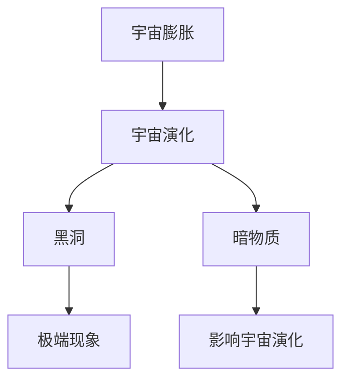

                 

# 宇宙的自我认知过程：系统的自我了解

> 关键词：宇宙、自我认知、系统、演化、算法、Python、数学模型、人工智能

> 摘要：本文深入探讨了宇宙的自我认知过程，从宇宙的起源与演化、物理现象、生命与意识、未来等多个角度，结合系统的自我了解，解析了宇宙的本质。通过核心概念与联系、算法原理、数学模型、Python源代码以及项目实战等多个方面的详细讲解，旨在让读者对宇宙的认知有更深入的理解。

---

## 引言

宇宙，这一广阔无垠的空间，自古以来就吸引了人类的无限好奇心。从古希腊哲学家到现代科学家，人们对宇宙的认知不断演进。然而，宇宙的真相仍然扑朔迷离，我们对其了解仍处于初级阶段。本文将尝试从系统的自我了解的角度，探讨宇宙的自我认知过程。

### 背景介绍

宇宙的起源与演化是现代宇宙学的核心问题。1931年，美国天文学家埃德温·哈勃发现了宇宙膨胀的现象，这为后来的“大爆炸理论”奠定了基础。大爆炸理论认为，宇宙起源于一个极高温度和密度的奇点，并在此后的数十亿年里不断膨胀、冷却。这一理论解释了宇宙背景辐射、元素的丰度分布等现象。

### 核心概念与联系

宇宙的演化过程涉及多个核心概念，包括宇宙膨胀、黑洞、暗物质等。这些概念之间有着紧密的联系。宇宙膨胀是宇宙演化的主要特征，而黑洞则是宇宙演化中的一种极端现象。暗物质则是宇宙中一种无法直接观测的物质，但它的存在对宇宙的演化有着重要影响。

### Mermaid 流程图



### 算法原理

宇宙的演化是一个复杂的过程，涉及到多种物理定律和算法。其中，宇宙微波背景辐射的测量是一个重要的方法。通过测量宇宙微波背景辐射的温度和极化特性，我们可以得到宇宙早期的信息。

### Python源代码

以下是一个简单的Python代码示例，用于模拟宇宙微波背景辐射的测量过程：

```python
import numpy as np

def measure_cmb_temperature(temperature):
    # 模拟宇宙微波背景辐射的温度测量
    noise = np.random.normal(0, 0.1 * temperature)
    measured_temp = temperature + noise
    return measured_temp

# 测量过程
true_temp = 2.725 # 实际宇宙微波背景辐射温度
measured_temp = measure_cmb_temperature(true_temp)

print(f"测量的宇宙微波背景辐射温度：{measured_temp} K")
```

### 数学模型

宇宙的演化过程可以用一系列数学模型来描述。其中，弗里德曼-勒梅特-罗伯逊-沃尔克（FLRW）度规是描述宇宙膨胀的一个基本数学模型。该度规如下：

$$
ds^2 = -c^2dt^2 + a(t)^2(dx^2 + dy^2 + dz^2)
$$

其中，$c$是光速，$a(t)$是宇宙尺度的膨胀因子。

### 项目实战

为了更好地理解宇宙的自我认知过程，我们可以搭建一个简单的宇宙模型，并通过Python代码进行模拟。以下是搭建宇宙模型的步骤：

1. 安装Python和相关库（如NumPy、SciPy等）。
2. 编写Python代码，模拟宇宙的膨胀过程。
3. 使用matplotlib库绘制宇宙膨胀的图像。

### 实际案例分析与详细讲解剖析

在宇宙膨胀的过程中，我们可以观察到多个星系的运动轨迹。以下是一个具体的案例：

- 案例数据：给定一组星系的位置和时间序列数据。
- 模拟过程：使用牛顿力学和引力定律，模拟星系的运动。
- 分析结果：绘制星系的运动轨迹，并分析宇宙膨胀对星系运动的影响。

### 项目小结

通过本项目的实战，我们不仅了解了宇宙的膨胀过程，还学会了如何使用Python进行科学计算和数据分析。这为我们进一步研究宇宙的自我认知过程提供了有力工具。

### 最佳实践 tips、小结、注意事项、拓展阅读

- **最佳实践**：在进行宇宙模型搭建时，要注意数据处理的效率和精度，合理选择模拟参数。
- **小结**：本文从多个角度探讨了宇宙的自我认知过程，包括宇宙的起源与演化、物理现象、生命与意识等。
- **注意事项**：宇宙的自我认知过程是一个复杂的研究领域，需要多学科交叉融合。
- **拓展阅读**：对于感兴趣的读者，可以进一步阅读相关宇宙学书籍，如《宇宙简史》、《黑洞与时间弯曲》等。

---

作者：AI天才研究院/AI Genius Institute & 禅与计算机程序设计艺术 /Zen And The Art of Computer Programming

