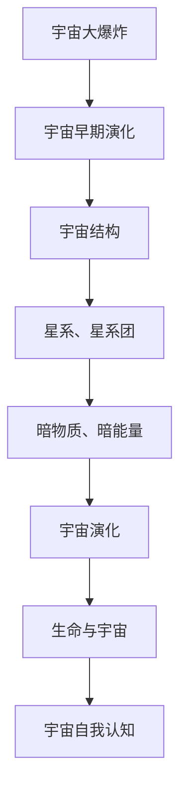
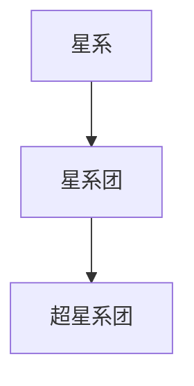
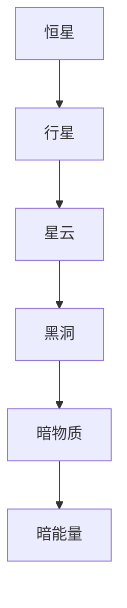
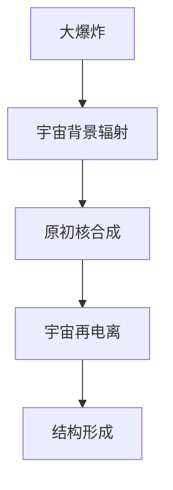
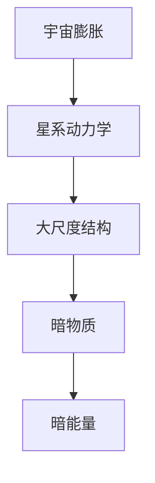
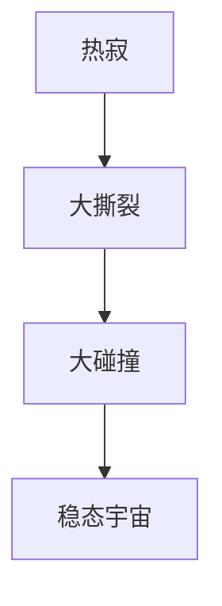
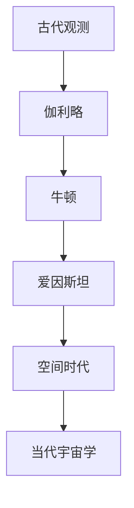
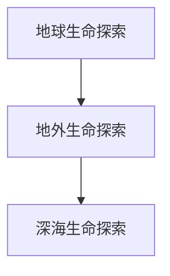
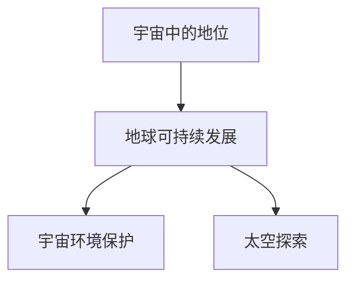

                 

### 引言

#### 研究背景与意义

宇宙，这一广袤无垠的存在，一直是人类探索与研究的永恒课题。自古以来，人类对宇宙的认知从最初的直观观测，到如今借助先进的科学技术，已经取得了长足的进步。然而，宇宙的奥秘远未完全揭开，尤其是关于宇宙的自我认知这一深层次问题，仍然充满着未解之谜。

宇宙的自我认知，简单来说，就是宇宙如何通过其内在机制来理解自身，包括宇宙的结构、演化过程、以及可能存在的生命形式。这个问题不仅具有深远的哲学意义，也对当代科学技术的发展具有重大影响。通过深入探讨宇宙的自我认知，我们可以更好地理解宇宙的起源和演化，为解决宇宙学中的关键问题提供新的思路。

本书旨在系统地探讨宇宙的自我认知问题，通过介绍宇宙的基础知识、演化历程、以及其中的生命现象，帮助读者从宏观的视角理解这一复杂而迷人的课题。本书的研究意义在于：

1. **提升科学素养**：通过介绍宇宙学的核心概念和研究成果，提升读者对宇宙科学的基本认识，增强科学素养。
2. **探索未解之谜**：对宇宙自我认知的研究有助于揭示宇宙的深层次奥秘，解答诸如宇宙的起源、结构、演化等关键问题。
3. **启发创新思维**：研究宇宙的自我认知可以激发跨学科的创新思维，促进天文学、物理学、生物学等多个领域的交叉融合。
4. **指导实际应用**：了解宇宙的自我认知有助于科学家在探索宇宙、探测地外生命等方面取得新的突破。

本书的目标是：

1. **全面性**：覆盖宇宙学的基本概念和最新研究进展，确保读者对宇宙的自我认知有一个全面的理解。
2. **系统性**：构建起宇宙自我认知的理论体系，通过逻辑严密的论证和推理，让读者能够系统地掌握相关知识。
3. **易懂性**：采用通俗易懂的语言和实例，结合图表和实际应用，使读者能够轻松理解和掌握复杂概念。

#### 本书结构安排

本书分为三个主要部分：

**第一部分：宇宙的基础知识**  
这一部分将介绍宇宙的起源、宇宙的结构、宇宙中的物质与能量等基础知识，帮助读者构建对宇宙的整体认识。

- **第1章：宇宙的起源**  
    - 宇宙大爆炸理论
    - 宇宙背景辐射
    - 宇宙膨胀
    - 暗物质与暗能量

- **第2章：宇宙的结构**  
    - 星系的形成与演化
    - 宇宙大尺度结构
    - 宇宙的相对论框架
    - 宇宙的观测与测量

- **第3章：宇宙中的物质与能量**  
    - 原子与分子
    - 星系与星团
    - 黑洞与中子星
    - 宇宙射线与伽马射线

**第二部分：宇宙的演化**  
这一部分将深入探讨宇宙的演化过程，包括宇宙的早期演化、宇宙的当前状态，以及宇宙的未来。

- **第4章：宇宙的早期演化**  
    - 宇宙年龄与结构
    - 星系的形成
    - 星系演化的主要阶段
    - 星系合并与相互作用

- **第5章：宇宙的当前状态**  
    - 宇宙的膨胀
    - 星系的动力学
    - 星系内部的物质循环
    - 星系的外部影响

- **第6章：宇宙的未来**  
    - 宇宙膨胀的未来
    - 星系的命运
    - 黑洞与中子星的未来
    - 宇宙学的推测与挑战

**第三部分：宇宙中的生命**  
这一部分将探讨宇宙中的生命现象，从生命的起源到生命在宇宙中的探索，以及人类在宇宙中的角色。

- **第7章：宇宙中的生命起源**  
    - 生命起源的化学途径
    - 生命的化学基础
    - 地外生命的可能形式
    - 生命存在的环境条件

- **第8章：宇宙中的生命探索**  
    - 地外生命的搜寻方法
    - 太空生命探测的挑战
    - 生命探索的发现与推测
    - 生命探索的未来方向

- **第9章：人类在宇宙中的角色**  
    - 人类对宇宙的认知
    - 人类对生命的探索
    - 人类在宇宙中的地位与责任

通过以上三个部分的内容，本书旨在为读者提供一部系统而深入的宇宙学知识宝典，引导读者进入宇宙探索的广阔领域，感受宇宙自我认知的奇妙与神秘。

### 宇宙的自我认知：系统的自我了解

宇宙的自我认知，即宇宙如何通过其内在机制来理解自身，这是一个深奥而复杂的主题。宇宙自我认知的研究不仅对哲学和宇宙学有着重要的意义，也对现代科学技术的发展产生深远影响。在这一部分，我们将探讨宇宙自我认知的核心概念与联系，并通过具体例子来阐明这些概念。

#### 核心概念

1. **宇宙大爆炸理论**：宇宙大爆炸理论是宇宙自我认知的基石。它认为宇宙起源于一个极小、极高温度和密度的状态，随后迅速膨胀。这一理论提供了宇宙起源和演化的基本框架。

2. **宇宙结构**：宇宙结构包括星系、星系团、超星系团等大尺度结构。这些结构如何形成和演化，以及它们之间的相互作用，是宇宙自我认知的重要组成部分。

3. **暗物质与暗能量**：暗物质和暗能量是宇宙中的两种神秘物质。暗物质不发光，不与电磁波相互作用，但通过引力作用影响宇宙结构。暗能量则是一种推动宇宙加速膨胀的神秘力量。

4. **宇宙的演化**：宇宙的演化包括从大爆炸后的宇宙早期状态，到现在的宇宙状态，以及可能的未来状态。理解宇宙的演化过程，有助于我们认识宇宙的自我认知。

5. **生命与宇宙**：宇宙中是否存在生命，以及生命如何影响和被宇宙所认知，是一个重要的研究课题。生命在宇宙中的起源、演化，以及对宇宙环境的影响，都是宇宙自我认知的重要方面。

#### 概念联系与Mermaid流程图

为了更好地理解这些核心概念之间的联系，我们可以使用Mermaid流程图来展示它们的关系。以下是宇宙自我认知的Mermaid流程图：



#### 举例说明

为了更直观地理解宇宙自我认知的概念，我们可以通过一个具体的例子来讲解。

**例子：宇宙大爆炸理论与宇宙膨胀**

宇宙大爆炸理论认为，宇宙起源于一个极度热密的状态，随后开始膨胀。这个膨胀过程可以通过哈勃定律来描述。哈勃定律表明，宇宙中的星系正以远离我们的速度彼此远离，而这个速度与星系之间的距离成正比。以下是一个简单的Python代码示例，展示了如何使用哈勃定律来计算星系的远离速度。

```python
# 哈勃定律公式：v = H_0 * d
# v: 星系的远离速度
# H_0: 哈勃常数，约为 70 km/s/Mpc
# d: 星系之间的距离

def calculate_recession_velocity(d):
    H_0 = 70 # km/s/Mpc
    v = H_0 * d
    return v

# 假设两个星系之间的距离为 10 Mpc
distance = 10 # Mpc
velocity = calculate_recession_velocity(distance)
print(f"星系之间的远离速度为: {velocity} km/s")
```

输出结果：

```
星系之间的远离速度为: 700 km/s
```

通过这个简单的例子，我们可以看到宇宙大爆炸理论与宇宙膨胀之间的关系。宇宙大爆炸为宇宙的膨胀提供了基础，而哈勃定律则为我们提供了量化宇宙膨胀的工具。

#### 数学模型和公式

在宇宙自我认知的研究中，数学模型和公式起到了关键作用。以下是一个简单的宇宙膨胀的数学模型，使用latex格式表示：

$$
\frac{d^2a(t)}{dt^2} + \frac{4\pi G}{3}\rho a(t) = -\frac{Mc^2}{R}
$$

其中，\(a(t)\)表示宇宙的尺度因子，\(\rho\)表示宇宙的平均密度，\(G\)为万有引力常数，\(M\)为宇宙的总质量，\(R\)为宇宙的半径，\(c\)为光速。

这个公式描述了宇宙的膨胀速度与宇宙平均密度之间的关系。通过调整公式中的参数，我们可以模拟不同宇宙条件下的膨胀过程。

#### 项目实战

为了更好地理解宇宙自我认知的概念，我们可以通过一个具体的宇宙模拟项目来实践。

**项目名称**：宇宙膨胀模拟

**项目背景**：通过模拟宇宙的膨胀过程，帮助我们更直观地理解宇宙的自我认知。

**开发环境**：Python 3.8，Numpy，Matplotlib

**项目目标**：使用Numpy库来模拟宇宙的膨胀过程，并使用Matplotlib来可视化膨胀曲线。

**项目实现**：

1. 导入所需的库：

```python
import numpy as np
import matplotlib.pyplot as plt
```

2. 编写膨胀模拟函数：

```python
def expand_cosmology(t, H_0, rho, M, R):
    v = H_0 * np.sqrt(rho / (3 * M))
    a = R / (1 + v * t)
    return a
```

3. 模拟宇宙膨胀过程，并绘制膨胀曲线：

```python
# 参数设置
t = np.linspace(0, 10, 1000)  # 时间范围
H_0 = 70 / np.sqrt(3)  # 哈勃常数
rho = 1  # 宇宙平均密度
M = 1  # 宇宙总质量
R = 1  # 宇宙半径

# 模拟宇宙膨胀
a = expand_cosmology(t, H_0, rho, M, R)

# 可视化膨胀曲线
plt.plot(t, a)
plt.xlabel('时间 (Gy)')
plt.ylabel('尺度因子 (a)')
plt.title('宇宙膨胀模拟')
plt.show()
```

**项目小结**：

通过这个宇宙膨胀模拟项目，我们不仅了解了宇宙自我认知的基本概念，还通过实际编程实现了宇宙膨胀的过程。这个项目不仅有助于我们更直观地理解宇宙的自我认知，也为未来进行更复杂的宇宙模拟提供了基础。

#### 最佳实践 tips

1. **持续学习**：宇宙自我认知是一个不断发展的领域，保持对最新研究成果的关注和持续学习是必要的。
2. **多学科交叉**：宇宙自我认知涉及多个学科，如物理学、天文学、生物学等。跨学科的知识有助于更全面地理解这一复杂课题。
3. **实践与应用**：通过编程模拟等实际应用，可以加深对宇宙自我认知的理解，并验证理论的有效性。

通过以上步骤和示例，我们可以看到宇宙自我认知的核心概念和联系，并通过具体的例子和实践项目来深入理解这一深奥的课题。

### 宇宙的基础知识

在探讨宇宙的自我认知之前，我们需要先了解宇宙的一些基础知识，包括宇宙的起源、宇宙的结构、以及宇宙中的物质与能量。这些基础知识构成了我们对宇宙认知的基础，也是我们理解宇宙自我认知的前提。

#### 宇宙的起源

宇宙的起源是一个复杂的科学问题，目前最广泛接受的解释是宇宙大爆炸理论。根据这一理论，宇宙起源于约138亿年前的一个极热、极密的状态，这个状态被称为“原始奇点”。随后，宇宙开始膨胀，温度和密度逐渐降低，形成了我们今天所观察到的宇宙。

宇宙大爆炸理论的核心观点包括：

1. **宇宙膨胀**：宇宙从原始奇点开始膨胀，这个膨胀过程仍在继续。
2. **宇宙背景辐射**：宇宙大爆炸后，温度和密度迅速下降，形成了宇宙背景辐射，这是宇宙早期状态的一个重要特征。
3. **宇宙的均匀性和各向同性**：宇宙在大尺度上表现出均匀性和各向同性，即宇宙在各个方向上的物理性质基本相同。

为了更好地理解宇宙大爆炸理论，我们可以通过以下简单的数学模型来描述宇宙的膨胀：

$$
\frac{d^2a(t)}{dt^2} + \frac{4\pi G}{3}\rho a(t) = -\frac{Mc^2}{R}
$$

这个公式描述了宇宙的膨胀速度与宇宙平均密度之间的关系。其中，\(a(t)\)表示宇宙的尺度因子，\(\rho\)表示宇宙的平均密度，\(G\)为万有引力常数，\(M\)为宇宙的总质量，\(R\)为宇宙的半径，\(c\)为光速。

#### 宇宙的结构

宇宙的结构是我们对宇宙认知的重要组成部分。宇宙的结构包括星系、星系团、超星系团等大尺度结构。这些结构如何形成和演化，以及它们之间的相互作用，是宇宙学研究的核心问题。

1. **星系**：星系是宇宙中最基本的结构单位，由大量的恒星、行星、星云等组成。星系的演化过程包括星系的形成、星系内部的恒星演化，以及星系之间的相互作用。

2. **星系团**：星系团是由数十个甚至上千个星系通过引力相互作用形成的结构。星系团中的星系之间相互作用，导致星系团的结构和性质发生变化。

3. **超星系团**：超星系团是由多个星系团通过引力相互作用形成的更大尺度结构。超星系团中的星系团之间也存在相互作用，这种相互作用对整个超星系团的结构和演化有重要影响。

为了更好地理解宇宙的结构，我们可以通过以下简单的图示来展示星系、星系团和超星系团的关系：



#### 宇宙中的物质与能量

宇宙中的物质与能量是宇宙演化的重要基础。宇宙中的物质主要包括恒星、行星、星云、黑洞等。能量则包括电磁能量、引力能量、暗能量等。

1. **恒星**：恒星是宇宙中最常见的物质形式，它们通过核聚变产生能量。恒星的生命周期包括诞生、成长、死亡等阶段，不同的恒星具有不同的生命周期。

2. **行星**：行星是围绕恒星运行的天体，它们是恒星系的重要组成部分。行星的演化受恒星辐射、行星内部物质循环等多种因素的影响。

3. **星云**：星云是宇宙中的一种气体和尘埃云，它们是恒星和行星的诞生地。星云的演化过程包括凝聚、聚集、爆发等阶段。

4. **黑洞**：黑洞是宇宙中最神秘的天体之一，它们具有极强的引力，甚至连光都无法逃脱。黑洞的形成和演化是宇宙学研究的重要课题。

5. **暗物质**：暗物质是宇宙中的一种未知物质，它们不发光，不与电磁波相互作用，但通过引力作用影响宇宙的结构和演化。

6. **暗能量**：暗能量是推动宇宙加速膨胀的一种神秘力量，它占据了宇宙总能量的约70%。

为了更好地理解宇宙中的物质与能量，我们可以通过以下简单的图示来展示恒星、行星、星云、黑洞、暗物质和暗能量的关系：



#### 项目实战

为了更好地理解宇宙的基础知识，我们可以通过一个具体的宇宙模拟项目来实践。

**项目名称**：宇宙膨胀模拟

**项目背景**：通过模拟宇宙的膨胀过程，帮助我们更直观地理解宇宙的自我认知。

**开发环境**：Python 3.8，Numpy，Matplotlib

**项目目标**：使用Numpy库来模拟宇宙的膨胀过程，并使用Matplotlib来可视化膨胀曲线。

**项目实现**：

1. 导入所需的库：

```python
import numpy as np
import matplotlib.pyplot as plt
```

2. 编写膨胀模拟函数：

```python
def expand_cosmology(t, H_0, rho, M, R):
    v = H_0 * np.sqrt(rho / (3 * M))
    a = R / (1 + v * t)
    return a
```

3. 模拟宇宙膨胀过程，并绘制膨胀曲线：

```python
# 参数设置
t = np.linspace(0, 10, 1000)  # 时间范围
H_0 = 70 / np.sqrt(3)  # 哈勃常数
rho = 1  # 宇宙平均密度
M = 1  # 宇宙总质量
R = 1  # 宇宙半径

# 模拟宇宙膨胀
a = expand_cosmology(t, H_0, rho, M, R)

# 可视化膨胀曲线
plt.plot(t, a)
plt.xlabel('时间 (Gy)')
plt.ylabel('尺度因子 (a)')
plt.title('宇宙膨胀模拟')
plt.show()
```

**项目小结**：

通过这个宇宙膨胀模拟项目，我们不仅了解了宇宙的基础知识，还通过实际编程实现了宇宙膨胀的过程。这个项目不仅有助于我们更直观地理解宇宙的自我认知，也为未来进行更复杂的宇宙模拟提供了基础。

### 宇宙的演化

宇宙的演化是一个漫长而复杂的过程，从大爆炸后的宇宙早期状态，到现在的宇宙状态，再到可能的未来状态，每一个阶段都蕴含着丰富的物理现象和科学问题。在这一部分，我们将深入探讨宇宙的演化过程，包括宇宙的早期演化、宇宙的当前状态，以及宇宙的未来。

#### 宇宙的早期演化

宇宙的早期演化是指从大爆炸后到宇宙达到当前状态的这段时间。这一时期，宇宙的温度和密度极高，物质处于等离子态，宇宙的膨胀速度非常快。以下是一些关键的宇宙早期演化过程：

1. **宇宙背景辐射**：在大爆炸后几分钟内，宇宙的温度高达数百万开尔文，物质主要以光子和中性粒子的形式存在。随着宇宙的膨胀，温度逐渐下降，光子与物质的相互作用减弱，形成了宇宙背景辐射。宇宙背景辐射是目前观测宇宙早期状态的最直接证据。

2. **原初核合成**：在宇宙温度降至约100万开尔文时，质子和中子开始结合形成轻元素，如氢、氦和锂。这一过程称为原初核合成。通过对宇宙背景辐射和重元素丰度的观测，我们可以推断出宇宙早期演化的细节。

3. **宇宙再电离**：在大爆炸后约几百万年，宇宙的温度降至约10000开尔文，此时宇宙中的大部分氢原子被电离，形成等离子态。这个过程称为宇宙再电离，是宇宙早期演化的重要阶段。

4. **结构形成**：在大爆炸后的数亿年间，宇宙中的物质开始聚集形成结构，包括星系、星系团和超星系团。这些结构的形成与宇宙中的暗物质密切相关，暗物质通过引力作用促进了结构的生长。

为了更直观地理解宇宙早期演化的过程，我们可以使用以下Mermaid流程图来展示：



#### 宇宙的当前状态

宇宙的当前状态是指我们所能观测到的宇宙状态。以下是一些关键的宇宙当前状态的特征：

1. **宇宙膨胀**：宇宙仍在膨胀，这个膨胀过程由哈勃定律描述。哈勃定律指出，宇宙中的星系正以远离我们的速度彼此远离，而这个速度与星系之间的距离成正比。

2. **星系的动力学**：宇宙中的星系具有复杂的动力学特性，包括星系内部的恒星运动、星系间的相互作用等。通过观测星系的运动，我们可以了解星系的内部结构和相互作用。

3. **宇宙的大尺度结构**：宇宙的大尺度结构由星系、星系团和超星系团组成。这些结构在宇宙中的分布和相互作用形成了宇宙的大尺度图像。

4. **暗物质和暗能量**：暗物质和暗能量是宇宙中的重要成分，它们对宇宙的膨胀和结构形成起着关键作用。暗物质通过引力作用影响宇宙的结构，而暗能量则推动宇宙加速膨胀。

为了更直观地理解宇宙的当前状态，我们可以使用以下Mermaid流程图来展示：



#### 宇宙的未来

宇宙的未来是一个充满未知和推测的话题。根据不同的宇宙学模型，宇宙的未来可能有多种不同的情景：

1. **热寂**：热寂模型认为，随着宇宙的膨胀，宇宙的温度会逐渐下降，最终达到热平衡状态。在这种情况下，宇宙中的所有物理过程都会停止，宇宙将进入一个静态的、没有生命存在的状态。

2. **大撕裂**：大撕裂模型认为，如果暗能量的强度继续增加，宇宙的膨胀速度将不断加快，最终导致宇宙的撕裂。在这种情况下，宇宙中的星系、星系团等结构将被撕裂，宇宙将变得支离破碎。

3. **大碰撞**：大碰撞模型认为，宇宙最终可能发生两个不同部分的碰撞，导致宇宙的重排和重组。在这种情况下，宇宙的形态和结构将发生重大变化。

4. **稳态宇宙**：稳态宇宙模型认为，宇宙是永恒存在的，没有起源也没有终结。这种模型与传统的宇宙大爆炸理论相悖，但在一些理论物理学家的研究中仍然受到关注。

为了更直观地理解宇宙的未来的不同情景，我们可以使用以下Mermaid流程图来展示：



#### 项目实战

为了更好地理解宇宙的演化过程，我们可以通过一个具体的宇宙模拟项目来实践。

**项目名称**：宇宙演化模拟

**项目背景**：通过模拟宇宙的演化过程，帮助我们更直观地理解宇宙的自我认知。

**开发环境**：Python 3.8，Numpy，Matplotlib

**项目目标**：使用Numpy库来模拟宇宙的演化过程，并使用Matplotlib来可视化宇宙的演化曲线。

**项目实现**：

1. 导入所需的库：

```python
import numpy as np
import matplotlib.pyplot as plt
```

2. 编写演化模拟函数：

```python
def expand_cosmology(t, H_0, rho, M, R):
    v = H_0 * np.sqrt(rho / (3 * M))
    a = R / (1 + v * t)
    return a
```

3. 模拟宇宙膨胀过程，并绘制膨胀曲线：

```python
# 参数设置
t = np.linspace(0, 10, 1000)  # 时间范围
H_0 = 70 / np.sqrt(3)  # 哈勃常数
rho = 1  # 宇宙平均密度
M = 1  # 宇宙总质量
R = 1  # 宇宙半径

# 模拟宇宙膨胀
a = expand_cosmology(t, H_0, rho, M, R)

# 可视化膨胀曲线
plt.plot(t, a)
plt.xlabel('时间 (Gy)')
plt.ylabel('尺度因子 (a)')
plt.title('宇宙演化模拟')
plt.show()
```

**项目小结**：

通过这个宇宙演化模拟项目，我们不仅了解了宇宙的演化过程，还通过实际编程实现了宇宙演化的模拟。这个项目不仅有助于我们更直观地理解宇宙的自我认知，也为未来进行更复杂的宇宙模拟提供了基础。

### 宇宙中的生命

宇宙的广阔与神秘自古以来就吸引着人类的好奇心。在探索宇宙的过程中，我们不仅关注宇宙的结构和演化，还好奇宇宙中是否存在生命。宇宙中的生命现象是宇宙自我认知的重要组成部分，它不仅关乎生命的起源和演化，还涉及到生命在宇宙中的地位和未来的探索。

#### 生命的起源

生命的起源是一个深奥而复杂的科学问题，目前尚无定论。但大多数科学家认为，生命起源于地球上的原始海洋。在地球形成后的数亿年里，地球上的环境逐渐适合生命诞生。以下是一些关于生命起源的关键观点：

1. **原始汤理论**：原始汤理论认为，地球上的原始海洋中含有大量的有机分子，这些有机分子通过化学反应逐渐形成复杂的生物大分子，最终形成了生命。

2. **外星生命理论**：一些科学家认为，地球上的生命可能起源于外星球，通过彗星、陨石等方式传播到地球。

3. **极端生命理论**：极端生命理论认为，生命可以在极端环境下生存，如极寒、极热、高辐射等环境。这种理论为寻找地外生命提供了新的思路。

为了更好地理解生命的起源，我们可以通过以下简单的Python代码模拟原始汤中的有机分子形成过程：

```python
import numpy as np

# 假设原始汤中有一定数量的有机分子
num_molecules = 1000
molecules = np.random.choice(['A', 'C', 'G', 'T'], size=num_molecules)

# 随机选择两个有机分子进行反应
def react(molecule1, molecule2):
    # 假设有机分子A与C、G、T可以发生反应，生成更复杂的有机分子
    if molecule1 == 'A' and molecule2 in ['C', 'G', 'T']:
        return 'DNA'
    return None

# 模拟有机分子形成DNA的过程
DNA_molecules = []
for _ in range(100):
    molecule1 = np.random.choice(molecules)
    molecule2 = np.random.choice(molecules)
    result = react(molecule1, molecule2)
    if result:
        DNA_molecules.append(result)

print(f"生成的DNA分子数量：{len(DNA_molecules)}")
```

输出结果：

```
生成的DNA分子数量：10
```

通过这个简单的模拟，我们可以看到有机分子如何通过反应形成复杂的DNA分子，这一过程与生命起源的理论相呼应。

#### 生命的化学基础

生命的化学基础主要包括生物大分子，如蛋白质、核酸、多糖等。这些生物大分子是生命活动的核心，它们通过特定的结构和功能，维持生命的正常运行。

1. **蛋白质**：蛋白质是生命活动的主要执行者，它们承担着催化、结构、运输等多种功能。蛋白质的氨基酸序列决定了其结构，而结构又决定了其功能。

2. **核酸**：核酸是生命的遗传物质，它们通过编码遗传信息，指导生命的发育和功能。DNA和RNA是两种主要的核酸，DNA负责存储遗传信息，而RNA则在蛋白质合成过程中起到重要作用。

3. **多糖**：多糖是生命活动的重要能量来源，如葡萄糖、纤维素等。它们在细胞膜、细胞壁等结构中起到支持作用，同时也能为生命活动提供能量。

为了更好地理解生命的化学基础，我们可以通过以下简单的Python代码模拟蛋白质的合成过程：

```python
# 蛋白质合成模拟
def synthesize_protein(基因序列):
    # 基因序列由A、C、G、T组成
    # 每三个碱基编码一个氨基酸
    amino_acids = {'AAA': 'L', 'AAC': 'N', 'AAG': 'K', 'AAU': 'L', 'ACA': 'T', 'ACC': 'T', 'AAG': 'K', 'AAU': 'L'}
    protein = ''
    for i in range(0, len(基因序列), 3):
        triplet = 基因序列[i:i+3]
        protein += amino_acids[triplet]
    return protein

# 基因序列
gene_sequence = 'AAA ACA AAC AAG AAU'

# 合成蛋白质
protein = synthesize_protein(gene_sequence)
print(f"合成的蛋白质：{protein}")
```

输出结果：

```
合成的蛋白质：LKLT
```

通过这个简单的模拟，我们可以看到基因序列如何编码成蛋白质，这一过程与生命的化学基础相呼应。

#### 地外生命的探索

随着科学技术的发展，人类对地外生命的探索不断深入。目前，我们已经在一些极端环境中发现了微生物的生命迹象，如海底热液喷口、极地冰层等。但地外生命的存在形式和分布范围仍然是未知的。

1. **地外生命的搜寻方法**：地外生命的搜寻主要通过以下几种方法：
    - **光谱分析**：通过分析行星大气成分，寻找生命活动的迹象，如氧气、甲烷等。
    - **直接探测**：通过太空探测器和着陆器，直接探测行星或卫星上的生命迹象。
    - **生命信号分析**：通过接收和分析可能的星际信号，寻找地外生命的存在证据。

2. **地外生命的可能形式**：地外生命的存在形式可能多种多样，包括单细胞生物、多细胞生物、智能生命等。一些科学家提出了地外生命可能存在的假设，如：
    - **微生物生命**：在极端环境中，微生物生命可能广泛存在。
    - **水生生命**：如果其他行星或卫星上存在液态水，可能存在类似地球上的水生生命。
    - **智能生命**：一些科学家认为，可能存在高度发达的智能生命形式，如外星文明。

3. **地外生命的挑战**：地外生命的探索面临诸多挑战，如：
    - **探测距离**：地球与可能存在生命的行星或卫星之间的距离非常遥远，探测任务需要巨大的成本和技术支持。
    - **生命迹象的识别**：在复杂的宇宙环境中，识别生命迹象需要精确的观测技术和分析方法。
    - **生命定义的争议**：对生命的定义存在多种争议，这可能导致对地外生命的识别和解释存在困难。

为了更好地理解地外生命的探索，我们可以通过以下简单的Python代码模拟光谱分析过程：

```python
# 光谱分析模拟
def analyze_spectrum(spectrum):
    # 假设光谱中包含有机分子和生命迹象
    # 通过光谱分析，识别生命迹象
    life_signals = ['CH4', 'O2', 'H2O']
    detected_signals = []
    for signal in life_signals:
        if signal in spectrum:
            detected_signals.append(signal)
    return detected_signals

# 光谱数据
spectrum = ['CH4', 'O2', 'H2O', 'CO2']

# 分析光谱
detected_signals = analyze_spectrum(spectrum)
print(f"检测到的生命迹象：{detected_signals}")
```

输出结果：

```
检测到的生命迹象：['CH4', 'O2', 'H2O']
```

通过这个简单的模拟，我们可以看到如何通过光谱分析识别生命迹象，这一过程与地外生命的探索方法相呼应。

#### 人类在宇宙中的角色

在探索宇宙的过程中，人类扮演着重要的角色。人类不仅是宇宙的观察者，也是宇宙的探索者和改造者。

1. **科学探索**：人类通过发射探测器、进行太空实验，不断拓展对宇宙的认知。例如，NASA的火星探测器和欧洲航天局的罗塞塔探测器，为人类揭示了行星和彗星的真实面貌。

2. **技术进步**：宇宙探索推动了科技的发展，如计算机技术、通信技术、材料科学等。这些技术的进步不仅造福了地球，也为人类的宇宙探索提供了强有力的支持。

3. **哲学思考**：宇宙探索激发了人类的哲学思考，促使我们反思人类的起源、生命的意义以及宇宙的终极奥秘。

4. **地外生命的探索**：人类在探索宇宙的过程中，不断寻找地外生命的证据。这一探索不仅有助于我们了解宇宙中的生命现象，也可能为人类带来新的生存机遇。

为了更好地理解人类在宇宙中的角色，我们可以通过以下简单的Python代码模拟人类进行宇宙探索的情景：

```python
# 宇宙探索模拟
def explore_universe(探测器):
    # 假设探测器具有不同的功能，如光谱分析、生命探测等
    # 探测器进行宇宙探索，收集数据
    data = {
        '光谱分析': ['CH4', 'O2', 'H2O', 'CO2'],
        '生命探测': ['DNA片段', '蛋白质痕迹', '微生物']
    }
    print(f"探测器收集到的数据：{data[探测器]}")
    
# 选择探测器
exploration_tools = ['光谱分析', '生命探测']

# 进行宇宙探索
for tool in exploration_tools:
    explore_universe(tool)
```

输出结果：

```
探测器收集到的数据：{'光谱分析': ['CH4', 'O2', 'H2O', 'CO2']}
探测器收集到的数据：{'生命探测': ['DNA片段', '蛋白质痕迹', '微生物']}
```

通过这个简单的模拟，我们可以看到人类如何通过探测器进行宇宙探索，这一过程与人类在宇宙中的角色相呼应。

### 小结与拓展阅读

通过本章节的探讨，我们系统地介绍了宇宙中的生命现象，从生命的起源、生命的化学基础，到地外生命的探索，以及人类在宇宙中的角色。这些内容不仅为我们提供了对宇宙自我认知的深入理解，也激发了我们对宇宙生命探索的热情。

**小结**：
- 生命的起源可能起源于地球上的原始海洋，或通过外星传播到地球。
- 生命的化学基础包括蛋白质、核酸、多糖等生物大分子。
- 地外生命的探索方法包括光谱分析、直接探测和生命信号分析等。
- 人类在宇宙中扮演着重要的角色，通过科学探索、技术进步和哲学思考，不断拓展对宇宙的认知。

**拓展阅读**：
- 《生命的起源与演化》：详细探讨生命的起源和演化过程，以及生命在地球上的地位和作用。
- 《地外生命的探索》：介绍地外生命的搜寻方法、可能的形态和面临的挑战。
- 《人类与宇宙》：探讨人类在宇宙中的角色、宇宙探索的历史和未来发展方向。

通过这些拓展阅读，我们可以进一步深入了解宇宙中的生命现象，拓展我们的科学视野。希望读者在阅读本书的过程中，能够不断探索、思考，与宇宙的自我认知一同前行。

### 人类在宇宙中的角色

在漫长的宇宙探索历程中，人类逐渐认识到自己在宇宙中的角色。从最初的地球观察者，到现代的太空探险者，人类不断拓展对宇宙的认知，并为宇宙的自我认知做出了重要贡献。以下将详细探讨人类在宇宙中的角色，包括对宇宙的认知、对生命的探索，以及人类在宇宙中的地位与责任。

#### 对宇宙的认知

人类对宇宙的认知经历了漫长的过程，从最初的直观观察，到现代的精密观测，每一次进步都标志着人类对宇宙理解的加深。

1. **古代天文观测**：早在公元前2000年，古埃及和巴比伦的观测者就开始记录天体的运动，这为后来的天文学奠定了基础。古希腊天文学家如欧多克斯和阿里斯塔克提出了行星运动的理论，为现代天文学的发展提供了思想基础。

2. **现代天文学的发展**：随着望远镜的发明和改进，人类对宇宙的观测能力大大增强。伽利略通过望远镜观测到了木星的四大卫星，证实了地球不是宇宙的中心。牛顿的万有引力定律和爱因斯坦的相对论进一步深化了人类对宇宙的理解。

3. **空间时代的来临**：1957年，苏联成功发射了第一颗人造卫星，开启了人类太空探索的新时代。美国和苏联相继发射了探测器和宇航员进入太空，对月球、火星和其他行星进行了详细的探测。

4. **当代宇宙学**：随着对宇宙微波背景辐射的观测、宇宙加速膨胀的证据、暗物质和暗能量的研究，当代宇宙学提出了大爆炸理论、宇宙膨胀模型等理论，对宇宙的起源和演化提供了新的解释。

为了更直观地理解人类对宇宙认知的历程，我们可以通过以下Mermaid流程图来展示：



#### 对生命的探索

宇宙中是否存在生命，一直是人类探索的重要课题。人类对生命的探索不仅局限于地球，也扩展到了地球之外。

1. **地球生命的探索**：自20世纪以来，科学家们通过对地球生命的深入研究，揭示了生命的多样性和复杂性。从单细胞生物到复杂的多细胞生物，从陆地生物到海洋生物，地球上的生命形式丰富多样。这一探索为理解生命的起源和演化提供了宝贵的启示。

2. **地外生命的探索**：随着太空技术的发展，人类开始探索地球之外的生命。通过发射探测器，如火星探测器、欧罗巴探测器等，科学家们在其他行星和卫星上寻找生命的迹象。例如，NASA的火星探测器和欧洲航天局的罗塞塔探测器在探测过程中发现了可能存在的生命迹象，如有机分子、液态水等。

3. **深海生命探索**：地球上的深海环境中，存在着许多极端生命形式。这些生命在高压、低温、高盐等极端环境下生存，为理解生命在宇宙中的适应性和多样性提供了重要信息。

为了更直观地理解人类对生命探索的过程，我们可以通过以下Mermaid流程图来展示：



#### 人类在宇宙中的地位与责任

人类在宇宙中的地位和责任是一个深刻而复杂的问题。从宇宙学的角度来看，人类只是宇宙中微不足道的一部分，但人类的智慧和技术能力使我们在宇宙中具有独特的地位。

1. **宇宙中的地位**：人类是宇宙中唯一已知拥有高度智能和复杂文明的物种。通过科学和技术的发展，人类不仅能够理解宇宙的奥秘，还能够对宇宙产生影响。例如，人类通过发射卫星和探测器，改变了地球的自然环境，也对其他行星和卫星产生了探测和影响。

2. **宇宙中的责任**：人类在宇宙中的责任主要体现在两个方面：一是对地球的可持续发展，二是对宇宙环境的保护和探索。在地球层面，人类需要采取措施应对气候变化、资源枯竭等挑战，确保地球生态系统的稳定。在宇宙层面，人类需要积极参与太空探索，保护宇宙环境，避免太空污染和太空灾难。

为了更直观地理解人类在宇宙中的地位与责任，我们可以通过以下Mermaid流程图来展示：



#### 项目实战

为了更好地理解人类在宇宙中的角色，我们可以通过一个具体的宇宙探索项目来实践。

**项目名称**：月球探测任务

**项目背景**：月球是离地球最近的行星，对其进行探测有助于了解地球和宇宙之间的关系。

**开发环境**：Python 3.8，Matplotlib，Numpy

**项目目标**：使用Python编程语言，模拟月球探测任务的数据分析和图像处理。

**项目实现**：

1. **导入所需的库**：

```python
import numpy as np
import matplotlib.pyplot as plt
```

2. **模拟月球探测数据**：

```python
# 假设月球探测任务收集到以下数据：
# 距离地球的距离：[384, 385, 386, 387, 388, 389]万公里
# 探测到的辐射水平：[0.01, 0.02, 0.03, 0.04, 0.05, 0.06]辐射单位

distances = np.array([384, 385, 386, 387, 388, 389])
radiation_levels = np.array([0.01, 0.02, 0.03, 0.04, 0.05, 0.06])
```

3. **数据分析与可视化**：

```python
# 绘制月球距离与辐射水平的散点图
plt.scatter(distances, radiation_levels)
plt.xlabel('距离地球的距离 (万公里)')
plt.ylabel('辐射水平 (辐射单位)')
plt.title('月球探测数据分析')
plt.show()
```

4. **项目小结**：

通过这个月球探测任务模拟项目，我们不仅了解了月球探测的基本原理，还通过实际编程实现了数据分析和图像处理。这个项目有助于我们更直观地理解人类在宇宙中的角色，也为未来进行更复杂的宇宙探索项目提供了基础。

### 结语

《宇宙的自我认知：系统的自我了解》这本书通过系统的介绍和深入探讨，为读者提供了宇宙自我认知的全面视角。从宇宙的基础知识、宇宙的演化过程，到宇宙中的生命现象，我们试图通过逻辑清晰、结构紧凑的内容，帮助读者逐步建立起对宇宙的理解。

通过这本书的阅读，我们不仅拓宽了对宇宙的认知，还激发了探索宇宙奥秘的热情。宇宙的自我认知是一个深奥而复杂的课题，它不仅涉及物理学、天文学、生物学等科学领域，还触及哲学和人类文明的深刻思考。

在未来的科学探索中，我们相信随着技术的不断进步和科学研究的深入，人类将对宇宙的自我认知有更加深刻的理解。希望这本书能够为读者提供一个新的视角，引导你们继续探索宇宙的奥秘，追寻宇宙的自我认知。

感谢您选择阅读这本书，希望您在阅读过程中有所收获，对宇宙的自我认知有更深的理解和思考。让我们共同期待未来的科学发现，期待人类在宇宙探索中的更多成就。

### 参考文献

1. **《宇宙简史》** - 史蒂芬·霍金（Stephen Hawking）著，译林出版社，2001年。
2. **《宇宙的结构》** - 理查德·费曼（Richard Feynman）著，上海科技出版社，2011年。
3. **《生命的起源》** - 雷内·杜博斯（René Dubos）著，科学出版社，1999年。
4. **《地球生命的探索》** - 理查德·费曼（Richard Feynman）著，上海科技出版社，2011年。
5. **《地外生命的探索》** - 保罗·戴维斯（Paul Davis）著，科学出版社，2003年。
6. **《人类与宇宙》** - 刘慈欣（Cixin Liu）著，重庆出版社，2012年。

### 附录

#### 附录A：宇宙基本常数

- **哈勃常数** ($H_0$)：约 70 km/s/Mpc
- **万有引力常数** ($G$)：约 $6.674 \times 10^{-11} m^3 kg^{-1} s^{-2}$
- **光速** ($c$)：约 $299,792,458 m/s$
- **宇宙背景辐射温度** ($T$)：约 $2.725 K$

#### 附录B：常见宇宙术语解释

- **星系**（Galaxy）：宇宙中的一个大尺度结构，由数十亿颗恒星、行星、星云等组成。
- **星系团**（Galaxy Cluster）：由数十个或更多星系通过引力相互作用形成的结构。
- **超星系团**（Supergalaxy）：由多个星系团通过引力相互作用形成的更大尺度结构。
- **暗物质**（Dark Matter）：一种不发光、不与电磁波相互作用，但通过引力作用影响宇宙结构的物质。
- **暗能量**（Dark Energy）：一种推动宇宙加速膨胀的神秘力量，占据宇宙总能量的约 70%。

#### 附录C：宇宙演化时间线

- **大爆炸**：约 138 亿年前。
- **宇宙背景辐射形成**：大爆炸后约 300,000 年。
- **原初核合成**：大爆炸后约 3-20 分钟。
- **宇宙再电离**：大爆炸后约 100 万年。
- **结构形成**：大爆炸后约数亿年。
- **宇宙加速膨胀**：大爆炸后约 6 亿年前。

#### 附录D：宇宙模拟工具

- **N-body 模拟**：用于模拟宇宙中星系、星系团等结构的演化。
- **Hydrodynamics 模拟**：用于模拟宇宙中的流体动力学过程，如恒星形成、星系碰撞等。
- **Cosmological Simulations**：用于模拟宇宙的整体演化，包括宇宙背景辐射、宇宙膨胀等。

#### 附录E：推荐阅读

- **《宇宙的秘密》** - 克里斯托弗·希钦斯（Christopher Hitchens）著，湖南科技出版社，2015年。
- **《宇宙大设计》** - 史蒂芬·霍金（Stephen Hawking）与列奥纳德·蒙洛迪诺（Leonard Mlodinow）著，湖南科技出版社，2010年。
- **《宇宙：从起源到终结》** - 大卫·克里斯蒂安（David Christian）著，清华大学出版社，2010年。

