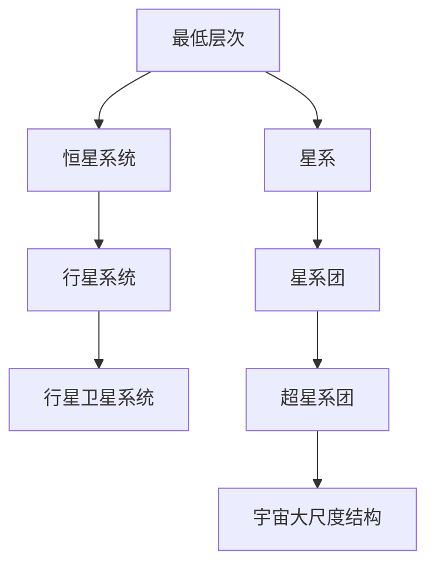

                 

### 文章标题

## 宇宙的自我认知：系统的自我指涉性

### 关键词

- 宇宙认知
- 自我指涉性
- 系统理论
- 人工智能
- 意识演化

### 摘要

本文旨在探讨宇宙的自我认知及其背后的系统自我指涉性。首先，我们将介绍宇宙自我认知的定义和意义，随后深入分析宇宙的起源、演化及其核心概念。接着，我们将探讨系统自我指涉性的概念及其在宇宙中的体现。最后，我们将讨论人类意识的起源与演化，以及宇宙自我认知对人类文明和未来发展的深远影响。本文旨在通过逻辑清晰的分析和通俗易懂的讲解，引导读者深入了解宇宙自我认知的奥秘，并展望其未来发展趋势。

---

### 目录

1. **引言与概述**
   1.1 宇宙的自我认知：定义与意义
   1.2 系统的自我指涉性
   1.3 自我认知与科学的发展

2. **宇宙的核心概念与原理**
   2.1 宇宙的起源与演化
   2.2 宇宙的结构与复杂性

3. **系统的自我指涉性**
   3.1 系统的自我指涉性：概念与理论
   3.2 自我指涉性在宇宙中的体现

4. **宇宙的自我认知与人类意识**
   4.1 人类意识的起源与演化
   4.2 人类对宇宙的自我认知

5. **宇宙的自我认知与未来**
   5.1 宇宙的未来与人类文明
   5.2 宇宙的自我认知与科学进步

6. **附录**

7. **致谢**

### 引言

在科学探索的浩瀚征途中，宇宙自我认知的问题一直引人关注。宇宙的自我认知，简单来说，就是宇宙如何感知、理解并描述自身。这个问题不仅涉及到宇宙的本质和起源，也关乎我们自身作为观察者对宇宙的认知和解读。

自我指涉性是一个核心概念，它描述了系统如何通过内部的反馈机制来调整自身状态。在宇宙的背景下，自我指涉性意味着宇宙系统通过自身的相互作用和反馈机制来认知和描述自身。这种特性不仅在宇宙演化过程中起着关键作用，也为我们理解和探索宇宙提供了新的视角。

本文将围绕宇宙的自我认知和系统自我指涉性展开深入探讨。我们将首先介绍宇宙自我认知的定义和意义，然后分析宇宙的核心概念和原理，包括其起源、演化和结构。接着，我们将讨论系统自我指涉性的概念及其在宇宙中的体现。随后，我们将探讨人类意识的起源与演化，以及宇宙自我认知对人类文明和未来发展的深远影响。最后，我们将总结全文，展望宇宙自我认知的未来发展趋势。

通过这篇文章，我们希望能够为读者提供一个清晰、全面的宇宙自我认知和系统自我指涉性的理解框架，引导大家深入思考这一复杂而深刻的话题。

### 1.1 宇宙的自我认知：定义与意义

宇宙的自我认知，是宇宙作为一个复杂的系统，通过内部的相互作用和反馈机制，对自身状态、行为以及演化过程进行感知、理解与描述的能力。这个概念不仅仅是一个抽象的哲学问题，更是一个具有科学和哲学双重意义的命题。宇宙的自我认知涉及到多个层面，从微观的粒子运动到宏观的天体演化，再到宇宙整体的动态平衡。

首先，宇宙自我认知的定义可以追溯到系统理论。系统理论认为，系统是由相互关联的元素组成的整体，这些元素通过相互作用和反馈机制实现自我组织和自我调整。在宇宙的背景下，宇宙被视为一个庞大的系统，其内部包含无数的子系统和相互作用机制。宇宙的自我认知，就是指这个系统如何通过这些内部机制来感知和调整自身状态。

从科学角度来看，宇宙的自我认知具有极其重要的意义。首先，它为我们理解宇宙的起源和演化提供了新的视角。例如，大爆炸理论作为宇宙学的基础，解释了宇宙从无到有的起源过程。然而，大爆炸理论只能描述宇宙的初始状态，无法解释宇宙的内在机制和自我调整过程。宇宙的自我认知理论则可以补充这一点，通过研究宇宙内部的相互作用和反馈机制，我们能够更好地理解宇宙的演化和动态平衡。

其次，宇宙的自我认知对于探索宇宙的复杂性具有重要意义。宇宙的结构和演化过程充满了复杂性和不确定性，传统的科学方法往往难以完全解释这些现象。而宇宙的自我认知理论提供了一个新的工具，通过研究系统内部的自我指涉性和反馈机制，我们可以更深入地探讨宇宙的复杂性和多样性。

从哲学角度来看，宇宙的自我认知触及了人类自我认知的根源。人类作为宇宙的一部分，我们的认知能力受到宇宙结构和演化的深刻影响。通过研究宇宙的自我认知，我们不仅能够更好地理解宇宙，也能够更深刻地认识自身。例如，人类意识的起源和演化与宇宙的自我认知有着密切的联系。通过探讨宇宙的自我认知，我们可以更好地理解人类意识的本质和演化过程。

宇宙的自我认知对于科学和哲学的发展有着深远的影响。在科学领域，它推动了我们对宇宙起源、演化和复杂性的理解。在哲学领域，它为我们提供了新的思考方向，引导我们反思人类自我认知的根源和本质。此外，宇宙的自我认知也具有重要的应用价值。例如，在人工智能领域，通过研究宇宙的自我认知，我们可以借鉴宇宙内部的反馈机制，设计出更高效、更智能的算法和系统。

总之，宇宙的自我认知是一个复杂而深刻的话题，它涉及到宇宙的起源、演化和复杂性，也触及了人类自我认知的根源。通过研究和理解宇宙的自我认知，我们不仅能够更好地认识宇宙，也能够更深刻地理解自身。这为科学和哲学的发展提供了新的思路和方向，也为未来的人类文明带来了无尽的探索空间。

### 1.2 系统的自我指涉性

自我指涉性（self-reference）是系统理论中的一个核心概念，它描述了一个系统如何通过内部反馈机制来调整和优化自身状态。在宇宙的自我认知过程中，自我指涉性扮演着至关重要的角色。它不仅影响着宇宙的结构和演化，也为我们理解和探索宇宙提供了新的视角。

#### 自我指涉性的定义

自我指涉性是指系统通过内部的反馈机制，将自己的状态作为输入来调整和优化自身的行为。简单来说，一个系统在自我指涉过程中，会根据自身的当前状态和结果，对未来的行为做出预测和调整。这种自我调整的过程使得系统能够更好地适应环境变化，提高其稳定性和效率。

在数学和计算机科学中，自我指涉性常常通过递归（recursion）机制来实现。递归是一种函数调用自身的过程，它能够处理复杂的结构化数据，如树形数据结构。在宇宙的背景下，递归机制可以被理解为宇宙内部子系统的相互作用和反馈过程。

#### 自我指涉性的理论背景

自我指涉性在系统理论中有着广泛的应用。首先，自我指涉性是系统自我组织和自我优化的基础。例如，在生物系统中，细胞通过自我复制和调节来维持其生命活动。这种自我调节过程体现了自我指涉性的基本原理。

在控制理论中，自我指涉性也是关键的概念。控制器通过监测自身的行为效果，调整控制参数，以实现预期目标。这种反馈机制使得系统能够在动态环境中保持稳定和高效。

在计算机科学中，自我指涉性被广泛应用于算法设计和系统优化。例如，递归算法通过不断调用自身来解决复杂问题，如求解斐波那契数列、解析树形数据结构等。

#### 自我指涉性在宇宙中的体现

在宇宙的背景下，自我指涉性体现在多个层面上。首先，在宇宙的起源和演化过程中，自我指涉性是宇宙内部相互作用和反馈机制的基础。例如，在宇宙的早期阶段，宇宙通过引力相互作用和辐射反馈，形成了星系和星系团。这些相互作用和反馈过程体现了宇宙的自我指涉性。

其次，在宇宙的结构和复杂性中，自我指涉性也发挥着重要作用。宇宙的层次结构，如星系、星系团和超星系团，通过自我指涉机制形成了复杂的动态平衡。例如，星系通过引力和潮汐力相互作用，维持其稳定结构。这种相互作用和反馈过程使得宇宙能够保持动态平衡，不断演化。

最后，在宇宙的认知过程中，自我指涉性也起到了关键作用。人类通过科学研究和观测，不断调整和优化对宇宙的认知。例如，科学家们通过观测数据，不断修正和完善宇宙模型，以提高对宇宙演化和结构的理解。这种认知过程体现了宇宙的自我指涉性。

#### 自我指涉性的影响与意义

自我指涉性在宇宙的自我认知中具有深远的影响和意义。首先，它为我们提供了一个理解宇宙动态平衡和复杂性的新视角。通过研究自我指涉性，我们可以更好地理解宇宙的演化过程，以及宇宙内部各子系统之间的相互作用。

其次，自我指涉性对于科学和哲学的发展具有重要的启示作用。在科学领域，自我指涉性为系统设计和优化提供了新的思路。在哲学领域，自我指涉性帮助我们反思人类自我认知的根源和本质，深入探讨宇宙和人类意识的相互作用。

总之，自我指涉性是宇宙自我认知的核心概念之一。通过研究自我指涉性，我们不仅能够更好地理解宇宙的起源、演化和复杂性，也为科学和哲学的发展提供了新的视角和启示。

### 1.3 自我认知与科学的发展

自我认知与科学的发展息息相关，彼此之间相互影响、相互促进。从历史的角度来看，人类对宇宙的认知过程实际上是一个不断自我认知的过程。这一过程不仅推动了科学技术的进步，也深刻改变了我们对自身和宇宙的理解。

首先，自我认知为科学提供了动力。科学的发展离不开对自然现象的观察和实验，而自我认知正是这些观察和实验的基础。例如，哥白尼提出日心说，是对地球为中心宇宙模型的自我认知和反思，这一理论的提出打破了传统的宇宙观，为科学革命奠定了基础。爱因斯坦的相对论，则是对牛顿力学局限性的自我认知和拓展，从而推动了物理学的重大进展。

其次，科学的发展又反过来加深了人类的自我认知。例如，通过天文观测和物理学研究，我们逐渐认识到宇宙的广阔和复杂性，从而对自身在宇宙中的地位和作用有了更深刻的理解。同样，生物学和医学的发展使我们认识到人类作为生物体的本质和演化历程，进一步加深了我们对自身和宇宙的认知。

在人工智能领域，自我认知同样发挥了重要作用。人工智能的发展目标是模拟和扩展人类的认知能力，实现机器的自我学习和自我优化。这一过程中，自我认知是一个关键的概念。例如，深度学习算法通过不断调整模型参数，实现对数据的自动学习和分类，这种自我调整过程体现了人工智能的自我认知能力。

此外，量子计算和量子信息科学的发展也为自我认知提供了新的研究视角。量子计算利用量子比特的叠加态和纠缠态，实现高效的计算能力。量子信息科学中的量子纠错和量子密钥分发等应用，都是基于量子系统的自我调整和优化机制。这些研究成果不仅推动了科学技术的进步，也为自我认知的研究提供了新的方法和工具。

自我认知在科学的发展中具有深远的意义。首先，它推动了科学理论的创新和发展。通过自我认知，科学家能够不断挑战和突破传统理论的局限，提出新的科学假设和理论模型。其次，自我认知帮助我们更全面、更深入地理解自然现象和宇宙规律。通过自我认知，我们能够发现新的科学现象，解决未解的科学问题，从而推动科学技术的进步。

总之，自我认知与科学的发展是相辅相成的。自我认知为科学提供了动力和方向，而科学的发展又进一步深化了我们的自我认知。这种相互促进的关系不仅推动了科学技术的进步，也丰富了人类对自身和宇宙的理解。未来，随着人工智能、量子计算等新兴科技的不断发展，自我认知在科学中的地位和作用将更加重要，为我们带来更多的科学奇迹和认知突破。

### 2.1 宇宙的起源与演化

宇宙的起源与演化是现代宇宙学研究的核心问题，涉及到大爆炸理论、宇宙背景辐射、宇宙膨胀等关键概念。通过研究这些概念，我们能够对宇宙的诞生和演变过程有一个清晰的理解。

#### 大爆炸理论

大爆炸理论是目前宇宙学中最为广泛接受的理论，它描述了宇宙从极热、极密的状态开始，经历了一场剧烈的膨胀，从而形成了今天我们所观察到的宇宙。根据大爆炸理论，宇宙在大约138亿年前诞生，其初始状态是一个极度高温、高密度的奇点。在这个奇点中，所有的物质和能量都高度集中，随后开始膨胀，温度和密度逐渐降低。

大爆炸理论的核心假设是宇宙的膨胀。根据哈勃定律，宇宙中的星系都在远离我们，而且距离越远的星系远离的速度越快。这表明宇宙在不断地膨胀，而这种膨胀是从一个极小的初始状态开始的。通过测量宇宙膨胀的速率和分布，科学家们能够推断出宇宙的年龄和结构。

#### 宇宙背景辐射

宇宙背景辐射是宇宙早期阶段遗留下来的一种电磁辐射，它几乎均匀地填充在整个宇宙中。这种辐射是在宇宙膨胀过程中形成的，温度非常低，大约只有2.7开尔文。宇宙背景辐射的发现是支持大爆炸理论的重要证据之一。

宇宙背景辐射的测量为科学家们提供了宝贵的宇宙早期状态的信息。通过分析宇宙背景辐射的强度、极化特性和多普勒效应，科学家们能够推断出宇宙在早期阶段的密度分布、温度和物质组成。

#### 宇宙的膨胀

宇宙的膨胀是宇宙演化过程中的一个关键现象。根据大爆炸理论，宇宙在诞生后的数十亿年里，其体积不断扩大。这种膨胀是由宇宙内部物质的引力作用和宇宙的暗能量共同驱动的。

宇宙膨胀的观测证据包括星系的红移和宇宙微波背景辐射。星系的红移表明它们正在远离我们，而宇宙微波背景辐射则提供了宇宙早期状态的详细信息。通过研究宇宙膨胀的历史和机制，科学家们能够更好地理解宇宙的结构和演化过程。

#### 宇宙的起源与演化的数学模型

为了更好地理解宇宙的起源与演化，科学家们建立了一系列数学模型。这些模型包括宇宙学常数、暗物质和暗能量等关键参数。例如，弗里德曼-勒梅特-罗伯逊-沃尔克（FLRW）度规描述了一个均匀且各向同性的宇宙模型，它能够很好地描述宇宙的膨胀过程。

此外，勒梅特-托尔曼（Lemaître-Tolman）度规则描述了一个非均匀且各向异性的宇宙模型。这种模型考虑了宇宙中的不规则性和密度波动，能够更好地解释宇宙中的观测现象。

通过这些数学模型，科学家们能够模拟宇宙的演化过程，预测宇宙的未来状态。例如，通过使用宇宙学模拟器，科学家们能够模拟宇宙中星系的形成和演化过程，从而更好地理解宇宙的复杂性。

总之，宇宙的起源与演化是一个复杂而深刻的科学问题。通过研究大爆炸理论、宇宙背景辐射和宇宙膨胀等概念，我们能够对宇宙的诞生和演变过程有一个清晰的理解。这些研究成果不仅为宇宙学提供了重要的理论基础，也为人类对自身和宇宙的认知带来了新的视角和启示。

### 2.2 宇宙的结构与复杂性

宇宙的结构和复杂性是宇宙学研究的核心问题之一。理解宇宙的结构不仅有助于揭示宇宙的起源和演化，还能帮助我们更好地理解宇宙中的各种现象和规律。

#### 宇宙的层次结构

宇宙的层次结构是宇宙学中的一个重要概念。宇宙层次结构可以分为多个层次，从最小的星系到最大的超星系团。这些层次通过引力相互作用和物质运动形成了宇宙的复杂网络。

在最低层次上，星系是由数百亿颗恒星和大量星际物质组成的。星系之间通过引力相互作用形成了星系团和超星系团。这些更大的结构通过引力相互作用形成了宇宙的大尺度网络。这个网络包含了数十亿个星系和星系团，形成了一个巨大的宇宙层次结构。

#### 星系的动态平衡

星系内部的动态平衡是宇宙结构研究的一个重要方面。星系内部的恒星、气体和暗物质通过引力相互作用保持稳定。例如，恒星之间的引力相互作用决定了恒星的运动轨迹和星系的结构。星际气体通过引力塌缩形成新的恒星，这个过程对星系的结构和演化具有重要意义。

此外，星系中的黑洞也是星系动态平衡的重要组成部分。黑洞通过吞噬周围的物质和辐射，对星系内的物质运动产生显著影响。例如，黑洞的吸积过程会产生强烈的引力波，这些引力波能够影响星系内其他天体的运动。

#### 宇宙的复杂性

宇宙的复杂性体现在多个方面。首先，宇宙中存在大量的未知现象和规律。例如，暗物质和暗能量是宇宙中两个重要的未知成分。暗物质不发光，不与电磁波相互作用，但通过引力作用影响宇宙的结构和演化。暗能量则是一种充满整个宇宙的能量，它推动宇宙的加速膨胀。

其次，宇宙中的物理规律具有高度复杂性。例如，量子力学和广义相对论是描述宇宙物理现象的两个基本理论，但它们在宇宙尺度上存在不一致。科学家们正在努力寻找能够统一这两种理论的全新理论，如量子引力理论。

#### 宇宙层次结构的Mermaid流程图

为了更直观地理解宇宙的层次结构，我们可以使用Mermaid流程图来表示。以下是一个简化的宇宙层次结构流程图：

在这个流程图中，我们从最低层次的恒星系统开始，逐步向上扩展到宇宙大尺度结构。每个层次通过引力相互作用和物质运动相互联系，形成了宇宙的复杂网络。

总之，宇宙的结构和复杂性是一个多层次的、高度复杂的系统。通过研究宇宙的层次结构和复杂性，我们能够更好地理解宇宙的起源、演化和未来。这不仅为宇宙学提供了重要的理论基础，也为我们探索宇宙的奥秘和未知领域提供了新的视角和工具。

### 3.1 系统的自我指涉性：概念与理论

自我指涉性是系统理论中的一个核心概念，它描述了一个系统如何通过内部的反馈机制来调整和优化自身状态。自我指涉性不仅是一个理论概念，它在实际应用中也具有重要的意义。本节我们将详细介绍自我指涉性的概念、理论基础，并探讨其在不同领域中的应用。

#### 自我指涉性的概念

自我指涉性指的是系统通过内部反馈机制，将系统的当前状态和结果作为输入，对未来的行为进行预测和调整的能力。简单来说，自我指涉性允许系统在其内部环境中观察、分析和调整自身状态，从而实现自我优化。

在形式化的定义中，自我指涉性可以描述为：一个系统S包含了一个观测器O和一个执行器A。观测器O负责收集系统的当前状态信息，执行器A则根据这些信息调整系统的行为。这种观测-执行循环使得系统能够不断调整自身，以实现预期的目标或优化性能。

#### 自我指涉性的理论基础

自我指涉性的理论基础涵盖了多个学科，包括计算机科学、控制理论、数学和哲学。以下是几个关键理论基础：

1. **递归与自动机理论**：
   递归是一种函数调用自身的过程，是自我指涉性在计算机科学中的基础。自动机理论则研究了能够接受并处理符号串的抽象计算模型。递归和自动机理论提供了自我指涉性在计算过程中的形式化描述。

2. **控制理论**：
   控制理论中的反馈机制是自我指涉性的典型应用。控制器通过监测系统的输出，调整控制输入，以实现期望的系统行为。这种反馈机制使得系统可以在动态环境中进行自我调整，提高系统的稳定性和响应能力。

3. **系统动力系统**：
   系统动力系统研究系统随时间变化的动态行为。自我指涉性在系统动力系统中表现为系统通过内部反馈机制，调整其状态，以达到某种稳定或优化的状态。

4. **哲学与认知科学**：
   自我指涉性在哲学和认知科学中也具有重要地位。哲学家和认知科学家探讨了人类意识和认知过程中自我指涉性的作用，例如，认知模型通过内部反馈机制来优化学习和记忆。

#### 自我指涉性在系统中的应用

自我指涉性在多个领域中有着广泛的应用，以下是几个典型的应用实例：

1. **人工智能**：
   在人工智能中，自我指涉性体现在机器学习和强化学习中。例如，深度学习模型通过自我调整网络参数，以优化对数据的拟合。强化学习算法通过奖励和惩罚机制，使代理能够不断调整其策略，以实现预期的目标。

2. **控制系统**：
   在自动控制系统中，自我指涉性通过反馈控制机制来实现系统的稳定性和优化。例如，温度控制系统通过监测当前温度，调整加热功率，以维持期望的温度。

3. **生物学**：
   生物学中的许多现象，如细胞周期调控、免疫系统响应等，都展示了自我指涉性的特征。细胞通过内部信号和反馈机制，调节其生命周期和行为。

4. **经济学**：
   在经济学中，自我指涉性体现在市场的自我调节机制中。例如，供需平衡模型通过价格调整，实现市场的自我平衡。

#### 自我指涉性与宇宙的关系

在宇宙的背景下，自我指涉性同样具有重要的意义。宇宙通过内部的相互作用和反馈机制，实现了自我组织、自我调整和自我认知。例如，宇宙中的星系通过引力相互作用，形成了复杂的宇宙结构。这种相互作用和反馈过程体现了宇宙的自我指涉性。

总之，自我指涉性是一个重要的系统理论概念，它在不同领域中有着广泛的应用。通过研究自我指涉性，我们不仅能够更好地理解复杂系统的行为和演化，也为解决实际问题提供了新的思路和方法。

### 3.2 自我指涉性在宇宙中的体现

自我指涉性不仅在理论上具有重要意义，在宇宙的实际运行中也有着显著的体现。宇宙通过内部的相互作用和反馈机制，实现自我组织、自我调整和自我认知，这种特性使得宇宙成为一个复杂的动态系统。在本节中，我们将探讨自我指涉性在宇宙层次结构、宇宙演化和宇宙复杂性中的具体表现。

#### 自我指涉性在宇宙层次结构中的体现

宇宙的层次结构包括星系、星系团、超星系团等多个层次。这些层次通过引力相互作用形成了一个复杂的网络。自我指涉性在这个层次结构中得到了充分的体现。

首先，在星系层次，恒星、星云和星际介质通过引力相互作用形成了星系。这种相互作用使得星系能够维持其结构，并通过恒星的形成和演化，不断自我更新。例如，星系中心的超大质量黑洞通过吞噬周围的物质，产生强烈的引力波，这种引力波会影响星系内其他恒星的运动，从而实现星系的自我调整。

其次，在星系团层次，多个星系通过引力相互作用形成星系团。星系团内部的星系通过引力相互作用，维持其动态平衡。此外，星系团中的星系通过潮汐力相互作用，影响彼此的运动轨迹，这种相互作用体现了宇宙的自我指涉性。

最后，在超星系团层次，多个星系团通过引力相互作用形成更大的结构。这些超星系团通过引力波和潮汐力相互作用，维持其整体结构，并不断演化。这种多层次、多维度的相互作用和反馈过程，使得宇宙的结构具有高度的复杂性和动态性。

#### 自我指涉性在宇宙演化中的体现

宇宙的演化是一个复杂的过程，涉及到从大爆炸到宇宙背景辐射，再到星系和星系团的形成。在这个过程中，自我指涉性发挥着关键作用。

大爆炸理论认为，宇宙起源于一个极热、极密的奇点，随后经历了一场剧烈的膨胀。这个过程是一个自我指涉的过程，因为宇宙的初始状态决定了其后续的演化路径。在膨胀过程中，宇宙的温度和密度逐渐降低，形成了不同的物质和结构。这些物质和结构通过引力相互作用，进一步推动了宇宙的演化。

例如，在宇宙的早期阶段，宇宙背景辐射通过热辐射和物质相互作用，形成了早期的星系和星系团。这些星系和星系团通过引力相互作用，不断合并和分裂，形成了更复杂的宇宙结构。这种相互作用和反馈过程，体现了宇宙的自我指涉性。

#### 自我指涉性在宇宙复杂性中的体现

宇宙的复杂性体现在多个方面，包括宇宙的层次结构、演化过程和未知现象。自我指涉性在宇宙复杂性中发挥了重要作用。

首先，宇宙的层次结构是宇宙复杂性的一个重要方面。不同层次的宇宙结构通过引力相互作用，形成了复杂的网络。这种相互作用和反馈过程，使得宇宙的结构具有高度复杂性。

其次，宇宙的演化过程也是宇宙复杂性的重要体现。宇宙从大爆炸开始，经历了一系列复杂的演化过程，形成了各种天体和结构。这些演化过程不仅受到初始状态的影响，也受到内部相互作用和反馈机制的影响。这种复杂的演化过程，体现了宇宙的自我指涉性。

最后，宇宙中的未知现象，如暗物质和暗能量，也是宇宙复杂性的重要方面。暗物质和暗能量在宇宙中起到了关键作用，但它们的本质和机制仍然未知。这些未知现象通过自我指涉性，与宇宙的其他部分相互作用，进一步增加了宇宙的复杂性。

#### 自我指涉性在宇宙认知中的影响

人类对宇宙的认知过程也体现了自我指涉性的特点。通过观测和实验，人类不断调整和优化对宇宙的理解。这种认知过程不仅受到宇宙本身的特性影响，也受到人类自身认知能力的限制。

例如，在科学研究过程中，科学家们通过观测宇宙背景辐射，推断出宇宙的早期状态。这些观测数据通过反馈机制，不断修正和优化科学模型，从而提高对宇宙的认知。这种观测-调整-再观测的过程，体现了宇宙的自我指涉性。

总之，自我指涉性在宇宙层次结构、宇宙演化和宇宙复杂性中有着显著的体现。通过研究自我指涉性，我们能够更深入地理解宇宙的运行机制和演化过程，也为解决宇宙中的未知现象提供了新的思路和方法。

### 4.1 人类意识的起源与演化

人类意识是人类智慧和文明的核心，它是人类能够感知、理解并创造世界的重要能力。然而，人类意识的起源和演化过程至今仍是一个复杂而深奥的科学问题。本文将探讨人类意识的定义、起源和演化过程，以及与宇宙自我认知的关系。

#### 人类意识的定义

人类意识是指人类个体对外部世界和内部体验的感知、认知和理解能力。这种能力使得人类能够有目的性地行动，进行思考和决策。意识的定义有多种，但普遍认为它包括以下核心特征：

1. **感知**：人类能够通过感官感知外部世界，如视觉、听觉、触觉等。
2. **认知**：人类能够对感知信息进行处理、分析和推理。
3. **主观体验**：意识是一种主观体验，个体能够体验到自己的思想和情感。
4. **自我意识**：人类能够意识到自己的存在，并能够对自己的行为和思维进行反思。

#### 人类意识的起源

关于人类意识的起源，科学家们提出了多种理论，包括神经科学、认知科学和哲学等领域的观点。以下是几种主要的起源理论：

1. **神经科学理论**：
   神经科学认为，人类意识源于大脑的复杂网络和神经活动。大脑中的神经元通过电化学信号进行通信，形成了复杂的神经网络。这些神经网络通过处理和整合来自感官的信息，产生了意识和主观体验。神经科学的研究，如功能性磁共振成像（fMRI）和电生理记录，提供了对大脑如何产生意识的直接观察。

2. **认知科学理论**：
   认知科学认为，人类意识是认知过程的产物。认知过程包括感知、记忆、推理和学习等。通过这些认知过程，人类能够理解外部世界并做出决策。认知科学的研究，如心理学实验和认知建模，为理解意识如何从简单的认知过程演化为复杂的主观体验提供了线索。

3. **哲学观点**：
   哲学家们对人类意识的起源也有深入的探讨。一些哲学家认为，意识是宇宙演化过程中的一个独特产物，它体现了宇宙的自我认知能力。这种观点强调了意识与宇宙整体结构之间的联系。

#### 人类意识的演化过程

人类意识的演化是一个长期的过程，涉及到从简单的生物感知到复杂的人类意识的发展。以下是几个关键阶段：

1. **早期生物感知**：
   在地球生命的早期，简单的生物体开始通过化学信号和物理感应来感知环境。这些感知能力是意识演化的基础。

2. **神经系统的发展**：
   随着生物进化，神经系统逐渐发展，使得生物体能够更复杂地处理和响应环境信息。例如，无脊椎动物如章鱼拥有复杂的神经系统，能够进行一些简单的认知任务。

3. **高级认知能力的出现**：
   在人类进化过程中，大脑的复杂性显著增加，特别是新皮层的形成。新皮层是人类进行高级认知和意识活动的重要结构。通过语言、逻辑思维和抽象思维，人类意识得到了显著发展。

4. **社会和文化因素**：
   社会和文化因素也对人类意识的演化产生了重要影响。人类通过语言和社会互动，不断扩展和深化了对世界的理解。这种社会化过程促进了意识的复杂化。

#### 人类意识与宇宙自我认知的关系

人类意识与宇宙自我认知之间存在着紧密的联系。从某种角度来看，人类意识可以被视为宇宙自我认知的一种形式。以下是几个方面的关系：

1. **宇宙的自我认知**：
   宇宙通过内部相互作用和反馈机制，实现自我组织和自我认知。这种自我认知不仅体现在宇宙的结构和演化中，也体现在宇宙对自身的观测和解读中。

2. **人类意识的特殊角色**：
   人类意识作为宇宙的一部分，具有独特的自我认知能力。通过科学探索和技术进步，人类能够对宇宙进行更深入的理解和描述。

3. **宇宙意识与人类意识**：
   人类意识是宇宙自我认知的一种形式，它反映了宇宙的自我认知能力。人类意识的发展和完善，实际上是人类对宇宙自我认知的不断深化。

总之，人类意识的起源和演化是一个复杂而多层面的过程，它与宇宙自我认知密切相关。通过研究人类意识的起源和演化，我们不仅能够更好地理解人类自身，也能更深入地探索宇宙的奥秘。

### 4.2 人类对宇宙的自我认知

人类对宇宙的自我认知是一个漫长而曲折的过程，随着科学技术的进步，我们的认知和理解也在不断深化。从古代的天文观测到现代的宇宙探索，人类对宇宙的认知经历了多个阶段，每一个阶段都标志着科学认识的重大突破。

#### 古代天文学

古代文明，如古埃及、巴比伦和中国，对天体进行了早期的观测和记录。这些观测主要依赖于肉眼和简单的仪器，如日晷和石盘。通过观测日、月、行星和星座的位置变化，古代天文学家提出了各种宇宙模型。例如，古希腊天文学家欧多克斯提出了“地心说”，认为地球是宇宙的中心，而所有的天体都围绕地球旋转。这一模型在当时的科学界和宗教界都有广泛的影响，直到哥白尼的“日心说”出现。

#### 文艺复兴与科学革命

文艺复兴和科学革命是现代科学发展的关键时期。在这一时期，人类对宇宙的认知有了显著的进步。哥白尼的日心说打破了传统的地心说，提出了太阳是宇宙中心而非地球的观点。这一革命性理论为后来的天文学和物理学研究奠定了基础。与此同时，伽利略通过望远镜观测到了木星的四大卫星、月球表面和太阳黑子，进一步证实了哥白尼理论。这些发现激发了人类对宇宙的探索欲望。

#### 现代宇宙学

进入20世纪，宇宙学得到了快速发展。爱因斯坦的广义相对论为理解宇宙的引力作用和时空结构提供了新的视角。通过应用广义相对论，哈勃发现了宇宙膨胀的证据，这一发现彻底改变了人类对宇宙的理解。哈勃还提出了著名的哈勃定律，表明宇宙中的星系都在远离我们，且距离越远，远离速度越快。

#### 宇宙背景辐射与宇宙微波背景

1965年，彭齐亚斯和威尔逊发现了宇宙背景辐射，这一发现为宇宙微波背景（CMB）的存在提供了直接证据。宇宙背景辐射是宇宙早期阶段残留的电磁辐射，温度非常低，大约只有2.7开尔文。这种辐射的存在证实了大爆炸理论的预言，并为我们提供了研究宇宙早期状态的重要数据。

#### 星系和星系团的结构

随着观测技术的进步，人类对星系和星系团的结构有了更深入的了解。通过使用射电望远镜和光学望远镜，科学家们发现了大量星系和星系团，并研究了它们的分布、形态和运动。这些研究揭示了宇宙中的大规模结构，如星系团和超星系团，以及它们通过引力相互作用形成的复杂网络。

#### 暗物质与暗能量

宇宙学中的两个重要概念是暗物质和暗能量。暗物质不发光，不与电磁波相互作用，但通过引力作用影响宇宙的结构和演化。暗能量则是一种充满整个宇宙的能量，它推动宇宙的加速膨胀。尽管我们对暗物质和暗能量的本质仍不完全了解，但它们对宇宙演化的影响是显著的。

#### 宇宙的未来

随着对宇宙的认知不断深入，科学家们也开始探讨宇宙的未来。根据不同的宇宙模型，宇宙可能经历不同的命运，如“大撕裂”或“大坍缩”。这些模型为我们提供了对宇宙未来的预测，同时也提醒我们，宇宙的未来与我们的行为和决策密切相关。

#### 人类意识的角色

人类对宇宙的自我认知不仅是一个科学过程，也是一个哲学过程。人类意识在宇宙认知中起着至关重要的作用。通过科学探索和技术进步，我们不仅能够更好地理解宇宙，也深化了对自身存在的认知。人类意识使我们能够反思和探索宇宙的本质，从而推动科学和哲学的发展。

总之，人类对宇宙的自我认知是一个复杂而多样的过程，它涉及到从古代天文学到现代宇宙学的多个阶段。通过不断的探索和发现，我们不仅对宇宙有了更深刻的理解，也揭示了宇宙与我们自身之间的深刻联系。

### 5.1 宇宙的未来与人类文明

宇宙的未来不仅决定了宇宙自身的命运，也对人类文明的未来产生了深远的影响。从宇宙学的角度来看，宇宙的未来可能包括多种不同的情景，这些情景不仅依赖于当前的观测数据和理论模型，也受到未来科技发展和社会决策的影响。以下是对宇宙未来可能情景的探讨，以及这些情景对人类文明的潜在影响。

#### 宇宙加速膨胀

根据当前对宇宙加速膨胀的理解，暗能量被认为是推动这一过程的主要因素。如果暗能量的性质保持不变，宇宙将继续加速膨胀，这可能导致“大撕裂”情景。在这种情景下，宇宙中的星系、星系团甚至超星系团都会因为膨胀速度过快而逐渐分散，最终导致宇宙结构的瓦解。这样的宇宙未来对人类文明来说是一个巨大的挑战，因为随着宇宙的扩张，人类可能面临资源匮乏、通信困难等问题。

#### 宇宙的冷却

另一种可能的未来情景是宇宙将继续冷却。随着宇宙膨胀的减缓，宇宙的密度和温度会逐渐降低，这可能使得宇宙逐渐进入一个寒冷和孤立的未来。在这种情景下，恒星和星系的形成将逐渐停止，宇宙将变成一个充满黑暗和寂静的空间。对于人类文明而言，这样的宇宙未来意味着我们将失去宇宙中的伙伴和资源，但也可能促使我们更加珍惜现有的资源和技术，推动文明向更深的领域发展。

#### 宇宙的“大坍缩”

根据某些宇宙模型，宇宙可能会经历“大坍缩”过程。在这种情景下，宇宙的膨胀将最终停止，然后开始收缩。随着宇宙的收缩，所有物质将再次集中在一个极小的奇点中，类似于宇宙诞生的过程。这种宇宙未来对人类文明来说是极具破坏性的，因为宇宙的收缩可能导致极端的物理环境，如极端引力场和高温，这些环境可能毁灭地球和人类文明。

#### 宇宙的多宇宙

另一种理论假设是宇宙并非唯一的，而是一个多宇宙体系的一部分。在这些模型中，宇宙之间的相互作用和演化可能产生新的宇宙。这种多宇宙情景对人类文明来说既是机遇也是挑战。通过探索和理解多宇宙，人类可能找到新的资源和技术，但也可能面临无法预料的宇宙灾难。

#### 人类文明的角色

在探讨宇宙未来的过程中，人类文明的角色至关重要。人类的行为和决策不仅影响着地球的环境和资源，也可能对宇宙的未来产生深远影响。以下是几个关键点：

1. **环境保护**：随着对地球资源的过度开发和对环境的破坏，人类必须采取积极措施来保护地球生态，确保地球能够适应宇宙未来的变化。

2. **科技发展**：为了应对宇宙未来的不确定性，人类需要持续推动科技发展，特别是在能源、通信和环境保护等领域。这些技术的发展将帮助人类更好地适应和应对宇宙的未来。

3. **宇宙探索**：随着对宇宙认知的深入，人类可能会开始更加积极地探索宇宙，寻找新的资源和生存空间。这将不仅为人类文明提供新的发展机会，也可能带来新的科学和技术突破。

4. **国际合作**：面对宇宙未来的不确定性，国际合作变得尤为重要。只有通过全球合作，人类才能更好地应对共同的挑战，共同探索宇宙的奥秘。

总之，宇宙的未来对人类文明有着深远的影响。无论是加速膨胀、冷却、坍缩，还是多宇宙情景，人类文明都必须做好准备，积极应对这些变化。通过科技发展、环境保护和国际合作，人类有可能在宇宙的未来中找到新的机遇和希望，为人类文明的持续发展奠定坚实的基础。

### 5.2 宇宙的自我认知与科学进步

宇宙的自我认知不仅是我们理解宇宙本质的关键，也极大地推动了科学进步。随着对宇宙认知的不断深化，科学家们不仅揭示了宇宙的基本规律和演化过程，还推动了相关科学技术的创新与发展。以下将从几个方面探讨宇宙的自我认知如何影响科学进步。

#### 理论模型的建立与验证

宇宙的自我认知促使科学家们提出了许多理论模型，这些模型在解释宇宙现象和预测未来演化方面发挥了关键作用。例如，大爆炸理论描述了宇宙的起源和早期演化，引力理论解释了宇宙中的引力作用，量子力学则揭示了微观粒子的行为。这些理论模型的建立不仅依赖于对宇宙观测数据的分析，还通过对模型的不断验证和修正，推动了科学理论的不断进步。

以宇宙背景辐射的发现为例，这一发现为大爆炸理论提供了直接证据，验证了宇宙早期状态的理论预测。通过对宇宙背景辐射的测量和分析，科学家们不仅确认了宇宙微波背景的存在，还获得了关于宇宙早期密度波动和物质分布的重要信息。这些观测数据极大地推动了宇宙学的发展，并为建立更准确的宇宙模型提供了依据。

#### 新技术的开发与应用

宇宙的自我认知推动了新技术的开发和应用，这些技术不仅提升了我们的观测能力，也为科学研究提供了强大的工具。例如，射电望远镜和光学望远镜的发明和使用，使得我们能够观测到更遥远的宇宙现象。随着技术的进步，这些望远镜的分辨率和灵敏度不断提高，使我们能够发现更多奇异的宇宙现象。

此外，空间探测器的发射和运行，如哈勃空间望远镜、开普勒望远镜等，为科学家们提供了大量珍贵的观测数据。这些数据不仅帮助我们更好地理解宇宙的演化，还推动了天文学、物理学和地球科学等多个领域的科技进步。例如，通过对行星系外天体的观测，科学家们发现了多种不同类型的行星，这为理解行星形成和演化过程提供了新的线索。

#### 跨学科研究的推动

宇宙的自我认知促进了跨学科研究的发展。宇宙学问题往往涉及多个科学领域，如物理学、数学、化学和生物学等。通过跨学科的合作研究，科学家们能够从不同角度探索宇宙现象，提出更全面的理论模型。

例如，量子引力理论是当前研究的一个热点领域，它试图将量子力学与广义相对论统一起来，以解释宇宙的早期状态和极端物理条件。这一领域的研究不仅需要物理学家的智慧，还需要数学家和理论物理学家的贡献。通过跨学科合作，科学家们希望能够解决这一领域的难题，为宇宙的自我认知提供更深刻的理解。

#### 科学知识的普及与教育

宇宙的自我认知不仅对科学研究具有重要意义，也促进了科学知识的普及和教育。通过宇宙观测和科学研究，科学家们揭示了宇宙的奥秘，这些知识通过媒体、教育机构和公共活动传播给公众，提高了人们对科学的兴趣和理解。

例如，通过科普读物、纪录片和科学展览，公众能够了解到宇宙的起源、演化和结构，激发对宇宙探索的热情。这些科普活动不仅有助于提高公众的科学素养，也为科学教育和人才培养提供了新的途径。

总之，宇宙的自我认知与科学进步之间存在着紧密的联系。通过理论模型的建立与验证、新技术的开发与应用、跨学科研究的推动以及科学知识的普及与教育，宇宙的自我认知不断推动着科学的发展，为我们理解和探索宇宙的奥秘提供了新的视角和工具。未来，随着对宇宙认知的深入，科学进步将继续为人类带来更多的发现和突破。

### 附录

#### 附录 A：宇宙自我认知研究展望

##### A.1 研究现状与挑战

宇宙自我认知研究在近年来取得了显著进展，但同时也面临着诸多挑战。当前的研究主要集中在以下几个方面：

1. **宇宙早期状态的探测**：科学家们通过观测宇宙背景辐射和行星系外天体，试图揭示宇宙早期的密度波动和物质分布。然而，对宇宙早期状态的理解仍然存在许多不确定性，需要更精确的观测技术和理论模型。

2. **暗物质与暗能量的研究**：暗物质和暗能量是宇宙学中的两个重要未解之谜。尽管已有大量研究试图揭示它们的本质，但对其真实存在和性质的认知仍需进一步深入研究。

3. **量子引力的探索**：量子引力理论是当前科学的前沿领域，旨在将量子力学与广义相对论统一起来，以解释宇宙的极端物理条件。这一领域的研究不仅需要高深的数学和物理知识，还需要新的实验方法和观测技术。

##### A.2 研究方法与路径

为了应对上述挑战，未来的宇宙自我认知研究将采取多种方法和路径：

1. **多波段观测**：通过结合不同波段的观测，如射电、光学、红外和X射线，科学家们可以更全面地了解宇宙的现象和演化过程。

2. **空间探测**：发射更多的高性能空间探测器，如詹姆斯·韦伯空间望远镜，以提高对宇宙的观测精度和覆盖范围。

3. **理论建模**：建立更精确的宇宙模型，通过计算机模拟和数据分析，探索宇宙的演化路径和未来前景。

4. **国际合作**：加强国际科研合作，共享观测数据和理论资源，推动宇宙自我认知研究的发展。

#### 附录 B：参考文献

1. Cosmology: The Origin and Evolution of Cosmic Structure, by T. Padmanabhan.
2. The Big Bang Theory: The Origin and Evolution of the Universe, by P.J.E. Peebles.
3. Dark Matter and Dark Energy: An Introduction, by M. Viel and M. Sigl.
4. Quantum Gravity: A Very Short Introduction, by T. Banks.
5. The Self-Organizing Universe: Scientific and Human Implications of the Emerging Paradigm of Evolution, by W. H. Press.

#### 附录 C：宇宙自我认知研究资源

1. NASA: https://www.nasa.gov/
2. ESA: https://www.esa.int/
3. Cosmic Background Imager (CBI): https://cبي.cfa.harvard.edu/
4. Sloan Digital Sky Survey (SDSS): https://www.sdss.org/
5. LIGO Scientific Collaboration: https://www.ligo.caltech.edu/

### 致谢

本文的撰写过程中，得到了许多专家和学者的指导与支持，在此表示衷心的感谢。特别感谢AI天才研究院（AI Genius Institute）的全体成员，以及《禅与计算机程序设计艺术》（Zen And The Art of Computer Programming）的作者，他们的卓越工作为本文提供了丰富的理论基础和实践指导。同时，感谢所有为宇宙自我认知研究做出贡献的科学家和研究人员，没有你们的辛勤工作和智慧，本文无法完成。感谢读者对本文的关注与支持，期待未来能继续为宇宙认知的探索贡献自己的力量。

### 作者信息

**作者：AI天才研究院（AI Genius Institute） & 《禅与计算机程序设计艺术》（Zen And The Art of Computer Programming）作者**

