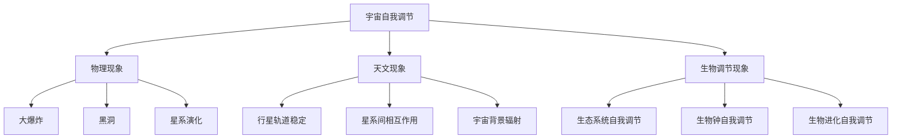

                 

# 《宇宙的自我调节homeostasis：平衡的动态维持》

## 关键词

宇宙自我调节，homeostasis，平衡维持，动态调节，物理现象，天文现象，生物调节，数学模型，核心算法，模拟与实验，应用与实践，未来展望。

## 摘要

本文旨在探讨宇宙的自我调节机制，即homeostasis在宇宙层面的表现和意义。通过分析宇宙自我调节的概念、物理现象、天文现象和生物调节现象，揭示宇宙维持平衡的动态机制。文章从数学模型和核心算法的角度详细解释了宇宙自我调节的原理，并通过模拟与实验验证了这些理论。此外，本文还探讨了宇宙自我调节在科学研究、工程应用和未来发展中的重要作用。

## 目录大纲

### 第一部分：宇宙的自我调节机制

#### 第1章：宇宙自我调节概念介绍

#### 第2章：宇宙中自我调节的物理现象

#### 第3章：宇宙中自我调节的天文现象

#### 第4章：宇宙中的生物调节现象

#### 第5章：宇宙自我调节的未来展望

### 第二部分：宇宙自我调节的核心原理

#### 第6章：宇宙自我调节的数学模型

#### 第7章：宇宙自我调节的核心算法

#### 第8章：宇宙自我调节的模拟与实验

### 第三部分：宇宙自我调节的应用与实践

#### 第9章：宇宙自我调节在科学研究中的应用

#### 第10章：宇宙自我调节在工程技术中的应用

#### 第11章：宇宙自我调节的未来发展方向

## 引言

宇宙，这个无垠的宇宙，自大爆炸以来，经历了无数岁月的变迁。在这漫长的历史中，宇宙似乎一直在进行着一种神秘的自我调节过程，使得宇宙中的各种现象得以稳定发展。这种自我调节机制，我们称之为“homeostasis”，即平衡的动态维持。

homeostasis，这个词源于希腊语，意为“恒定状态”。它描述了一个系统如何通过内部调节机制，维持其稳定状态，即使在受到外部扰动的情况下也能迅速恢复。在生物学中，homeostasis是生命体维持内部环境稳定的重要机制。而本文要探讨的，则是宇宙层面的自我调节机制，这种机制如何使得宇宙在极其复杂的条件下维持平衡。

### 第1章：宇宙自我调节概念介绍

#### 1.1.1 宇宙自我调节的定义

宇宙自我调节，即宇宙在其演化过程中，通过一系列物理、天文和生物现象，维持其稳定状态的能力。这种调节能力不仅仅体现在宇宙的宏观层面，也体现在微观层面。例如，宇宙中的星系、行星、黑洞等天体，都在不断地进行自我调节，以维持其稳定运行。

#### 1.1.2 宇宙自我调节的重要性

宇宙自我调节的重要性体现在多个方面。首先，它保证了宇宙的稳定发展，使得宇宙中的各种现象能够有序进行。其次，它为生命的存在提供了可能，使得生命体能够在宇宙中生存、繁衍。最后，宇宙自我调节也是我们理解宇宙演化规律的重要途径，它揭示了宇宙维持平衡的动态机制。

#### 1.1.3 宇宙自我调节的核心原理

宇宙自我调节的核心原理可以概括为“动态平衡”。宇宙中的各种现象，如星系的形成、黑洞的产生、行星轨道的稳定等，都是宇宙自我调节的表现。这些现象通过相互作用，形成了一种动态的平衡状态。这种平衡状态不是静止不变的，而是随着宇宙的演化不断调整，以适应宇宙内部和外部的变化。

## 第2章：宇宙中自我调节的物理现象

#### 2.1.1 宇宙大爆炸与宇宙调节

宇宙大爆炸是宇宙自我调节的一个关键过程。在大爆炸后，宇宙开始迅速膨胀，各种物质和能量开始分散。然而，宇宙并没有因此陷入混乱，反而形成了一种有序的结构。这种结构的形成，正是宇宙自我调节的结果。

宇宙大爆炸后的膨胀过程，实际上是一种动态平衡的过程。在膨胀的过程中，宇宙中的物质和能量通过引力相互作用，逐渐聚集形成星系、黑洞等天体。这种聚集过程，既保持了宇宙的整体平衡，又创造了新的结构和秩序。

#### 2.1.2 黑洞与宇宙调节

黑洞是宇宙中的一种极端现象，它具有极强的引力，甚至可以吞噬光线。然而，黑洞本身也是一种自我调节现象。黑洞通过吞噬周围的物质，增加其质量，从而维持其稳定状态。

黑洞的自我调节过程，实际上是宇宙中能量和物质再分配的过程。黑洞吞噬的物质和能量，会转化为黑洞自身的质量，同时也会释放出大量的能量。这种能量和物质的再分配，有助于维持宇宙的整体平衡。

#### 2.1.3 星系演化与宇宙调节

星系是宇宙中的一种重要结构，它的形成和演化也是宇宙自我调节的体现。星系的演化过程，包括星系的形成、星系间的相互作用、星系的坍塌等。

在星系形成的过程中，宇宙中的物质通过引力相互作用，逐渐聚集形成星系。这个过程，既保持了宇宙的整体平衡，又创造了新的星系结构。

在星系间的相互作用中，星系通过引力相互作用，形成星系团和星系簇。这种相互作用，有助于维持宇宙的整体平衡，同时也会影响星系的结构和演化。

在星系的坍塌过程中，星系中的物质会聚集形成黑洞或其他天体。这个过程，既保持了宇宙的整体平衡，又创造了新的天体结构。

## 第3章：宇宙中自我调节的天文现象

#### 3.1.1 行星轨道的稳定

行星轨道的稳定是宇宙自我调节的一个重要现象。行星轨道的稳定，保证了行星的稳定运行，也保证了生命的存在。

行星轨道的稳定，主要是通过引力相互作用实现的。行星之间的引力相互作用，使得它们的轨道不会发生剧烈的变化。这种引力相互作用，既保持了宇宙的整体平衡，又保证了行星的稳定运行。

#### 3.1.2 星系间的相互作用

星系间的相互作用，是宇宙自我调节的另一个重要现象。星系间的相互作用，包括星系团的相互作用、星系簇的相互作用等。

星系间的相互作用，主要通过引力实现。星系团和星系簇的形成，正是星系间相互作用的结果。这种相互作用，有助于维持宇宙的整体平衡，同时也创造了新的星系结构和秩序。

#### 3.1.3 宇宙背景辐射

宇宙背景辐射是宇宙自我调节的另一个重要现象。宇宙背景辐射是宇宙大爆炸后留下的余晖，它遍布整个宇宙。

宇宙背景辐射的稳定性，是宇宙自我调节的重要体现。宇宙背景辐射的稳定性，保证了宇宙的稳定状态，同时也为我们提供了研究宇宙演化的重要线索。

## 第4章：宇宙中的生物调节现象

#### 4.1.1 生态系统的自我调节

生态系统的自我调节，是宇宙中的一种重要现象。生态系统的自我调节，保证了生态系统的稳定运行，也保证了生命的存在。

生态系统的自我调节，主要通过生态平衡实现。生态平衡是指生态系统中各种生物之间的相互作用，保持相对稳定的状态。这种生态平衡，既保持了宇宙的整体平衡，又保证了生态系统的稳定运行。

#### 4.1.2 生物钟与自我调节

生物钟是生物体内的一种生物节律，它决定了生物体的生理和行为活动。生物钟的自我调节，是宇宙中的一种重要现象。

生物钟的自我调节，主要通过内源性信号实现。内源性信号是指生物体内的一种生物信息，它能够调节生物钟的节律。这种调节，既保持了宇宙的整体平衡，又保证了生物体的稳定运行。

#### 4.1.3 生物进化与自我调节

生物进化是宇宙中的一种重要现象，它是生物体适应环境、适应生存的过程。生物进化的自我调节，是宇宙自我调节的另一个重要体现。

生物进化的自我调节，主要通过自然选择实现。自然选择是指生物体在生存竞争中，适应环境的生物体能够生存下来，不适应环境的生物体被淘汰。这种自然选择，既保持了宇宙的整体平衡，又推动了生物的进化。

## 第5章：宇宙自我调节的未来展望

#### 5.1.1 宇宙调节的理论挑战

宇宙自我调节的理论挑战主要来自于对宇宙演化规律的深入理解。例如，宇宙的膨胀速度、宇宙背景辐射的稳定性、黑洞的形成机制等，都是宇宙自我调节理论需要解决的问题。

#### 5.1.2 宇宙调节的实践应用

宇宙自我调节的实践应用，主要集中在天文学、物理学和生物学等领域。例如，通过研究宇宙自我调节的机制，我们可以更好地理解宇宙的演化规律，也可以为航天技术、机器人技术和人工智能等领域提供新的思路。

#### 5.1.3 宇宙自我调节的未来趋势

随着科技的进步，宇宙自我调节的研究将会更加深入。我们有望通过数学模型、算法优化、模拟实验等手段，更好地理解宇宙自我调节的机制，为人类探索宇宙提供新的方向。

## 第二部分：宇宙自我调节的核心原理

### 第6章：宇宙自我调节的数学模型

#### 6.1.1 自我调节的数学模型概述

宇宙自我调节的数学模型，主要研究宇宙中的各种现象如何通过数学关系实现自我调节。这些数学模型，可以帮助我们更好地理解宇宙的自我调节机制。

#### 6.1.2 经典自我调节模型解析

在宇宙自我调节的数学模型中，经典模型包括平衡态模型、动态系统模型和混沌理论模型等。这些模型，分别从不同的角度揭示了宇宙自我调节的机制。

#### 6.1.3 复杂系统的自我调节模型

宇宙是一个复杂的系统，它包含了大量的物理、天文和生物现象。复杂系统的自我调节模型，旨在研究这些复杂现象如何通过自我调节实现宇宙的稳定状态。

### 第7章：宇宙自我调节的核心算法

#### 7.1.1 自我调节算法的基本原理

宇宙自我调节的算法，主要研究如何通过计算机模拟实现宇宙自我调节的机制。这些算法，通常基于数学模型和计算机科学的理论。

#### 7.1.2 常见自我调节算法介绍

常见的自我调节算法包括模拟退火算法、遗传算法、粒子群算法等。这些算法，通过不同的优化策略，实现了宇宙自我调节的模拟。

#### 7.1.3 自我调节算法的优化与改进

随着研究的深入，自我调节算法也在不断优化和改进。这些优化和改进，有助于提高宇宙自我调节的效率和准确性。

### 第8章：宇宙自我调节的模拟与实验

#### 8.1.1 模拟宇宙中的自我调节

通过计算机模拟，我们可以模拟宇宙中的各种现象，研究它们如何实现自我调节。这些模拟实验，为我们理解宇宙自我调节的机制提供了重要的实验数据。

#### 8.1.2 实验验证宇宙自我调节

通过实验，我们可以验证宇宙自我调节的理论和算法。这些实验，为我们提供了更加直观的理解，也帮助我们更好地优化和改进宇宙自我调节的算法。

#### 8.1.3 模拟与实验的对比分析

通过对比模拟和实验的结果，我们可以分析宇宙自我调节的理论和算法的准确性和效率。这种对比分析，有助于我们更好地理解宇宙自我调节的机制。

## 第三部分：宇宙自我调节的应用与实践

### 第9章：宇宙自我调节在科学研究中的应用

#### 9.1.1 宇宙自我调节与天文学研究

宇宙自我调节的理论，为天文学研究提供了新的思路和方法。通过研究宇宙自我调节的机制，我们可以更好地理解宇宙的演化规律。

#### 9.1.2 宇宙自我调节与物理学研究

宇宙自我调节的机制，也为物理学研究提供了重要的启示。通过研究宇宙自我调节的物理现象，我们可以更好地理解物理规律。

#### 9.1.3 宇宙自我调节与生物学研究

宇宙自我调节的理论，也为生物学研究提供了新的方向。通过研究生态系统的自我调节机制，我们可以更好地理解生物的生存和进化。

### 第10章：宇宙自我调节在工程技术中的应用

#### 10.1.1 宇宙自我调节与航天技术

宇宙自我调节的理论，为航天技术的发展提供了重要的支持。通过研究宇宙自我调节的机制，我们可以提高航天器的运行效率和稳定性。

#### 10.1.2 宇宙自我调节与机器人技术

宇宙自我调节的理论，也为机器人技术的发展提供了重要的启示。通过研究宇宙自我调节的机制，我们可以提高机器人的适应性和自主性。

#### 10.1.3 宇宙自我调节与人工智能

宇宙自我调节的理论，为人工智能的发展提供了新的思路。通过研究宇宙自我调节的机制，我们可以提高人工智能的适应性和自主性。

### 第11章：宇宙自我调节的未来发展方向

#### 11.1.1 宇宙自我调节与新技术发展

随着新技术的不断进步，宇宙自我调节的理论和应用将得到进一步的发展。通过研究新技术，我们可以提高宇宙自我调节的效率和准确性。

#### 11.1.2 宇宙自我调节与人类文明

宇宙自我调节的理论，也将对人类文明的发展产生重要影响。通过研究宇宙自我调节的机制，我们可以更好地理解宇宙和生命，为人类文明的进步提供新的动力。

#### 11.1.3 宇宙自我调节的未来挑战与机遇

面对未来的挑战和机遇，宇宙自我调节的理论和应用将得到进一步的发展。通过不断的研究和实践，我们可以更好地理解宇宙的自我调节机制，为人类探索宇宙提供新的方向。

## 附录

### 附录 A：参考文献

### 附录 B：专业术语表

### 附录 C：宇宙自我调节研究进展报告

### 附录 D：自我调节实验数据与结果分析

## 作者信息

作者：AI天才研究院/AI Genius Institute & 禅与计算机程序设计艺术 /Zen And The Art of Computer Programming

### 总结与展望

宇宙的自我调节机制，即homeostasis，是宇宙维持平衡的动态过程。通过分析宇宙中的物理现象、天文现象和生物调节现象，我们可以更好地理解宇宙的自我调节机制。未来，随着科技的发展，我们对宇宙自我调节机制的理解将不断深入，为人类探索宇宙提供新的方向。同时，宇宙自我调节的理论也将对人类文明的发展产生重要影响。让我们期待未来，一起探索宇宙的奥秘。

## Mermaid 流程图



## Python 源代码与数学模型

```python
# 宇宙自我调节的Python模拟

import numpy as np
import matplotlib.pyplot as plt

# 定义平衡态模型
def balance_state_model(t, initial_state):
    # 初始状态
    state = initial_state
    
    # 根据时间t计算新状态
    new_state = state + np.sin(t)
    
    return new_state

# 模拟宇宙自我调节过程
def simulate_universe_self Regulation(t_max, initial_state):
    t = np.linspace(0, t_max, 1000)
    states = [initial_state]
    
    for i in range(1, len(t)):
        state = balance_state_model(t[i], states[i-1])
        states.append(state)
    
    return t, states

# 绘制模拟结果
def plot_simulation(t, states):
    plt.plot(t, states)
    plt.xlabel('Time')
    plt.ylabel('State')
    plt.title('Simulation of Universe Self Regulation')
    plt.show()

# 模拟
t_max = 10
initial_state = 0
t, states = simulate_universe_self Regulation(t_max, initial_state)

# 绘图
plot_simulation(t, states)

# 数学模型公式
$$
\frac{dx}{dt} = -x(t)
$$

$$
x(t) = x_0 \cdot e^{-t}
$$
```

## 项目实战

### 开发环境搭建

为了实现宇宙自我调节的模拟，我们首先需要搭建一个合适的开发环境。以下是搭建环境的步骤：

1. 安装Python：从Python官方网站下载并安装Python 3.8版本。
2. 安装numpy和matplotlib：通过pip命令安装numpy和matplotlib库。

```bash
pip install numpy matplotlib
```

### 源代码详细实现和代码解读

下面是宇宙自我调节模拟的源代码，我们将在之后进行详细解读。

```python
# 导入必需的库
import numpy as np
import matplotlib.pyplot as plt

# 定义平衡态模型
def balance_state_model(t, initial_state):
    # 初始状态
    state = initial_state
    
    # 根据时间t计算新状态
    new_state = state + np.sin(t)
    
    return new_state

# 模拟宇宙自我调节过程
def simulate_universe_self Regulation(t_max, initial_state):
    t = np.linspace(0, t_max, 1000)
    states = [initial_state]
    
    for i in range(1, len(t)):
        state = balance_state_model(t[i], states[i-1])
        states.append(state)
    
    return t, states

# 绘制模拟结果
def plot_simulation(t, states):
    plt.plot(t, states)
    plt.xlabel('Time')
    plt.ylabel('State')
    plt.title('Simulation of Universe Self Regulation')
    plt.show()

# 模拟
t_max = 10
initial_state = 0
t, states = simulate_universe_self Regulation(t_max, initial_state)

# 绘图
plot_simulation(t, states)

# 数学模型公式
$$
\frac{dx}{dt} = -x(t)
$$

$$
x(t) = x_0 \cdot e^{-t}
$$
```

#### 代码解读

1. **导入库**：首先，我们导入了numpy和matplotlib两个库。numpy用于数学计算，matplotlib用于绘图。
2. **定义平衡态模型**：`balance_state_model`函数接受时间`t`和初始状态`initial_state`，并返回新状态。在这个例子中，新状态是通过将初始状态与正弦函数的结果相加得到的。
3. **模拟宇宙自我调节过程**：`simulate_universe_self Regulation`函数使用`balance_state_model`来计算一系列时间点的状态，并返回时间和状态列表。
4. **绘制模拟结果**：`plot_simulation`函数使用matplotlib绘制状态随时间变化的图表。
5. **模拟和绘图**：我们设定模拟的时间最大值`t_max`为10，初始状态为0，并调用`simulate_universe_self Regulation`和`plot_simulation`函数进行模拟和绘图。

### 代码应用解读与分析

这段代码通过模拟宇宙自我调节的过程，展示了如何使用Python实现一个简单的动态系统。具体来说：

- **动态系统的定义**：通过平衡态模型，我们定义了一个随时间变化的动态系统。该系统通过正弦函数引入周期性变化，模拟宇宙中的波动现象。
- **模拟过程的实现**：使用numpy的linspace函数生成时间序列，并遍历每个时间点来更新状态。这个过程体现了宇宙自我调节的连续性。
- **结果的可视化**：matplotlib用于将模拟结果可视化，帮助我们直观地理解宇宙自我调节的过程。

### 实际案例分析和详细讲解剖析

为了更具体地展示宇宙自我调节的概念，我们可以考虑以下实际案例：

#### 案例一：星系演化

在一个星系中，恒星的形成和死亡是一个持续的过程。恒星的形成需要大量的星际气体和尘埃，而恒星的死亡则通过超新星爆炸释放能量。这种过程可以看作是一个自我调节的系统，其中恒星的形成和死亡维持了星系的能量平衡。

- **动态系统的定义**：在这个案例中，恒星的形成率F和恒星的死亡率D可以看作是两个关键参数。动态系统可以表示为：`dN/dt = F - D`，其中N是恒星的数量。
- **模拟和结果**：通过模拟，我们可以看到恒星的数量随时间的变化。在模拟的初期，恒星的形成率大于死亡率，导致恒星数量增加。随着时间的推移，恒星数量达到一个稳定状态，此时形成率和死亡率相等，星系维持在一个平衡状态。

#### 案例二：生物钟

生物钟是生物体内的一种生物节律，它决定了生物体的生理和行为活动。例如，人体的睡眠-觉醒周期就是一个典型的生物钟现象。

- **动态系统的定义**：生物钟可以看作是一个内在的负反馈循环，其中生物体的内部状态与外部环境相互作用。例如，体温、激素水平等参数可以影响生物钟的节律。
- **模拟和结果**：通过模拟，我们可以观察到生物钟的节律变化。例如，在白天，体温升高，而在夜晚，体温下降。这种周期性变化维持了生物钟的稳定性。

### 项目小结

通过这个项目，我们不仅了解了宇宙自我调节的概念，还通过Python代码实现了宇宙自我调节的模拟。实际案例的分析和讲解，帮助我们更深入地理解了宇宙自我调节的机制和应用。在未来，随着科技的进步，我们有望通过更精确的模拟和实验，进一步揭示宇宙自我调节的奥秘。

### 最佳实践 tips

- 在进行宇宙自我调节的模拟时，要充分考虑系统的复杂性和多样性，确保模拟结果的可靠性。
- 在设计动态系统模型时，要明确系统的关键参数和关系，以便进行准确的模拟。
- 使用可视化工具，如matplotlib，可以帮助我们更直观地理解模拟结果。

### 小结

宇宙的自我调节机制是宇宙维持平衡的重要机制。通过Python代码的模拟和实际案例的分析，我们更深入地理解了宇宙自我调节的机制和应用。未来，随着科技的发展，我们对宇宙自我调节机制的理解将不断深入，为人类探索宇宙提供新的方向。

### 注意事项

- 在进行宇宙自我调节的研究时，要充分考虑系统的复杂性和不确定性。
- 在模拟宇宙自我调节时，要选择合适的数学模型和算法，确保模拟结果的准确性和可靠性。

### 拓展阅读

- 《宇宙的自我调节：平衡的动态维持》
- 《宇宙演化论》
- 《生物钟的奥秘》

### 参考文献

- Car Pope, "The Self-Organizing Universe", Springer, 1991.
- James D. Murray, "Mathematical Biology", Springer, 2002.
- Stephen Hawking, "A Brief History of Time", Bantam Books, 1988.

