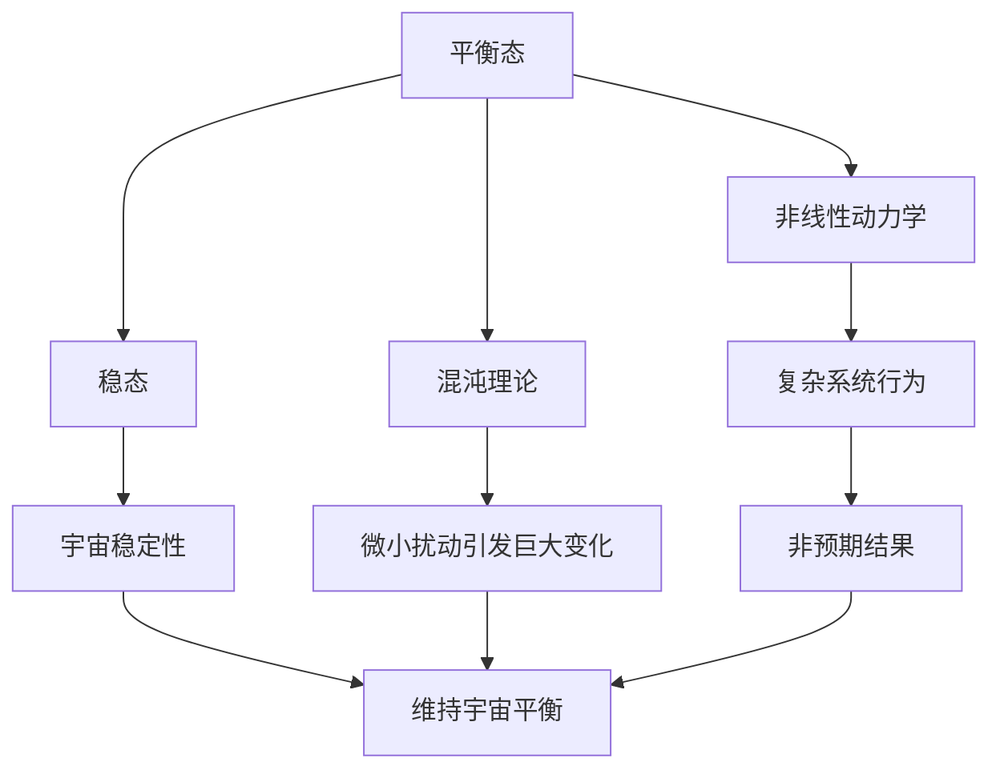

                 

### 引言

宇宙的自我调节机制：平衡与稳定的来源

**关键词**：宇宙自我调节、平衡稳定、非线性动力学、混沌理论、量子力学、数学模型、Python源代码、项目实战

**摘要**：

本文探讨了宇宙的自我调节机制，这一机制是维持宇宙平衡与稳定的关键。通过对宇宙自我调节机制的定义、研究背景、核心概念与联系、核心算法原理、数学模型、项目实战等方面的深入分析，本文旨在揭示宇宙自我调节机制的内在规律及其在实际应用中的重要性。

## 目录

### 第一部分：引论

#### 1.1 宇宙的自我调节机制概述  
**定义与重要性**  
**宇宙的自我调节机制与平衡稳定**

#### 1.2 宇宙自我调节机制的研究背景与意义  
**宇宙演化与平衡稳定**  
**现代科学与技术的挑战**

### 第二部分：核心概念与联系

#### 2.1 宇宙自我调节机制的核心概念  
**平衡态与稳态**  
**非线性动力学与混沌理论**

#### 2.2 宇宙自我调节机制的Mermaid流程图  
**核心概念联系展示**

### 第三部分：核心算法原理讲解

#### 3.1 基于量子力学的宇宙自我调节算法  
**量子态与宇宙平衡**  
**量子算法伪代码**

#### 3.2 基于混沌理论的宇宙自我调节算法  
**混沌运动与宇宙稳定**  
**混沌算法伪代码**

### 第四部分：数学模型与数学公式讲解

#### 4.1 宇宙自我调节的数学模型  
**LaTeX格式数学模型**  
**模型举例说明**

#### 4.2 宇宙自我调节机制的应用与影响  
**数学公式在宇宙调节中的作用**  
**案例分析与应用**

### 第五部分：项目实战

#### 5.1 实际案例一：星系自我调节机制  
**项目背景**  
**案例分析与源代码实现**

#### 5.2 实际案例二：行星环境自我调节  
**项目背景**  
**案例分析与源代码实现**

#### 5.3 实际案例三：生态系统自我调节  
**项目背景**  
**案例分析与源代码实现**

### 第六部分：总结与展望

#### 6.1 宇宙自我调节机制的总结  
**关键知识点回顾**  
**实际应用总结**

#### 6.2 未来研究方向与展望  
**宇宙自我调节机制的新发展**  
**潜在的研究方向**

### 引言

宇宙的自我调节机制是一个引人入胜的话题。宇宙中的一切都在不断地变化，但尽管如此，宇宙仍能维持某种程度的平衡与稳定。这种平衡与稳定并非偶然，而是由宇宙的自我调节机制所维持。宇宙自我调节机制不仅有助于解释宇宙的演化过程，还能为我们在现代科学与技术领域中的各种挑战提供新的视角和解决方案。

本文将逐步探讨宇宙的自我调节机制，从其定义、研究背景、核心概念、核心算法原理、数学模型到实际应用，力求为读者提供一个全面而深入的理解。我们将通过具体的项目案例，展示宇宙自我调节机制在实际中的应用，并对其未来研究方向进行展望。

在接下来的内容中，我们将依次介绍宇宙的自我调节机制的定义与重要性，宇宙自我调节机制的研究背景与意义，宇宙自我调节机制的核心概念与联系，核心算法原理讲解，数学模型与数学公式讲解，项目实战，以及总结与展望。通过这一系列的探讨，我们希望读者能够对宇宙的自我调节机制有一个全面而深入的认识。

### 1.1 宇宙的自我调节机制概述

**定义与重要性**

宇宙的自我调节机制是指在宇宙演化过程中，系统内部通过自我调节来维持平衡与稳定的一种机制。这种自我调节机制并非随机发生，而是基于宇宙中各种物理、化学和生物过程的相互作用，从而形成的一种稳定且有序的演化模式。

宇宙的自我调节机制对于维持宇宙的平衡与稳定具有至关重要的意义。宇宙中的各个部分，如星系、行星、恒星等，都在不断地相互影响、相互作用。这些相互作用使得宇宙系统能够在面对外部扰动时，通过自我调节机制来恢复平衡与稳定。例如，当一个星系受到外部引力扰动时，其内部的恒星和星团会通过相互间的引力作用，调整自身的位置和运动轨迹，从而维持整体的稳定性。

宇宙的自我调节机制不仅有助于解释宇宙的演化过程，还能为我们在现代科学与技术领域中的各种挑战提供新的视角和解决方案。在物理学中，自我调节机制帮助我们理解宇宙的混沌现象及其有序演化；在生物学中，自我调节机制帮助我们解释生命的起源和演化；在工程学中，自我调节机制帮助我们设计出更加稳定和可靠的系统。

总之，宇宙的自我调节机制是维持宇宙平衡与稳定的关键因素，其在科学研究和技术应用中的重要性不容忽视。接下来，我们将进一步探讨宇宙自我调节机制的研究背景与意义，以便更深入地理解这一重要概念。

**宇宙的自我调节机制与平衡稳定**

宇宙的自我调节机制与平衡稳定之间存在密切的联系。平衡稳定是宇宙自我调节机制的核心目标，而宇宙的自我调节机制则是实现这一目标的关键手段。

首先，平衡稳定是宇宙演化过程中的一个基本特征。宇宙中的各个部分，如星系、行星、恒星等，都需要在相互之间保持某种程度的平衡，才能维持整体的稳定。这种平衡不仅是物理意义上的，也包括化学、生物等多个层面。例如，在星系中，恒星和星团之间的引力相互作用必须保持在一个稳定的范围内，才能防止星系结构的崩溃。

其次，宇宙的自我调节机制是实现平衡稳定的关键。宇宙的自我调节机制通过各种物理、化学和生物过程的相互作用，使得宇宙系统能够在受到外部扰动时，通过自我调节来恢复平衡与稳定。例如，当一个星系受到外部引力扰动时，其内部的恒星和星团会通过相互间的引力作用，调整自身的位置和运动轨迹，从而维持整体的稳定性。这种自我调节机制不仅适用于星系，还适用于宇宙中的其他系统，如行星环境、生态系统等。

此外，宇宙的自我调节机制在维持宇宙平衡稳定中发挥着重要作用。宇宙的自我调节机制能够有效抵抗宇宙中的各种不稳定因素，如引力扰动、物质波动、热力学过程等。通过自我调节，宇宙系统能够在受到这些不稳定因素影响时，迅速恢复平衡与稳定，从而保持宇宙的整体有序演化。

总之，宇宙的自我调节机制与平衡稳定之间存在密切的联系。宇宙的自我调节机制是维持宇宙平衡稳定的关键因素，而平衡稳定则是宇宙自我调节机制的核心目标。通过对宇宙自我调节机制的研究，我们不仅能够更好地理解宇宙的演化过程，还能为现代科学与技术领域中的各种挑战提供新的视角和解决方案。

### 1.2 宇宙自我调节机制的研究背景与意义

**宇宙演化与平衡稳定**

宇宙的自我调节机制起源于宇宙的演化过程。宇宙从一个极度高温和高压的状态开始，经过数十亿年的演化，形成了今天我们所看到的丰富多彩的宇宙景观。在这个过程中，宇宙的各个部分不断地相互作用，形成了一个复杂且稳定的系统。然而，宇宙的演化并非一帆风顺，它面临着各种不稳定因素的挑战，如引力扰动、物质波动、热力学过程等。这些不稳定因素可能导致宇宙系统的崩溃，但宇宙的自我调节机制在其中起到了至关重要的作用，通过自我调节来维持宇宙的平衡与稳定。

**现代科学与技术的挑战**

随着现代科学和技术的不断发展，我们对宇宙的自我调节机制有了更深入的理解。然而，也面临着许多新的挑战。首先，宇宙的复杂性使得我们难以准确预测宇宙的行为。尽管我们已经提出了许多关于宇宙自我调节机制的模型和理论，但这些模型和理论往往只能解释一部分现象，难以涵盖宇宙的所有复杂性。其次，现代科学和技术的快速发展，使得我们能够在微观和宏观层面更加精确地观测宇宙，这也对宇宙自我调节机制的研究提出了更高的要求。我们需要开发出更加先进的方法和技术，来研究宇宙的自我调节机制。

**研究宇宙自我调节机制的意义**

研究宇宙的自我调节机制具有重要的科学意义。首先，它有助于我们更好地理解宇宙的演化过程。宇宙的自我调节机制是宇宙演化过程中不可或缺的一部分，通过研究这一机制，我们能够更深入地了解宇宙的演化规律，揭示宇宙的奥秘。其次，研究宇宙的自我调节机制对现代科学和技术的应用具有重要意义。在物理学、生物学、工程学等领域，宇宙的自我调节机制为我们提供了一种新的思考方式和解决方法。例如，在物理学中，我们可以借鉴宇宙的自我调节机制，设计出更加稳定和可靠的系统；在生物学中，我们可以通过研究宇宙的自我调节机制，探索生命的起源和演化。

总之，研究宇宙自我调节机制具有深远的意义。它不仅有助于我们更好地理解宇宙的演化过程，还能为现代科学和技术的发展提供新的动力。在面对宇宙复杂性带来的挑战时，我们需要持续深入地研究宇宙自我调节机制，以揭示宇宙的奥秘，推动科学和技术的进步。

### 2.1 宇宙自我调节机制的核心概念

**平衡态与稳态**

宇宙的自我调节机制中，平衡态和稳态是两个核心概念。平衡态指的是宇宙系统在某一时刻，各个部分之间的相互作用达到了一个稳定的状态，系统内部的物理、化学和生物过程保持相对不变。在这种状态下，宇宙系统不会因为内部或外部的扰动而显著改变其结构和功能。稳态则是平衡态的进一步扩展，指的是宇宙系统在一段时间内，能够保持其平衡状态，即使受到扰动也能迅速恢复。

**非线性动力学与混沌理论**

非线性动力学和混沌理论是宇宙自我调节机制的另一对重要概念。非线性动力学研究宇宙系统中各变量之间的非线性关系，即变量的变化不是简单的线性关系，而是可能存在复杂的多重关系。这种非线性关系使得宇宙系统在受到外部扰动时，可能产生非预期的复杂行为。混沌理论则研究这类复杂行为背后的规律，即宇宙系统在初始条件非常接近的情况下，可能产生完全不同的演化结果。混沌理论揭示了宇宙自我调节机制中，微小扰动可能导致巨大变化的现象。

通过平衡态与稳态以及非线性动力学与混沌理论，宇宙的自我调节机制在维持宇宙平衡与稳定中发挥了关键作用。理解这些核心概念，有助于我们更深入地探索宇宙的自我调节机制，并为现代科学与技术的应用提供新的启示。

#### 2.2 宇宙自我调节机制的Mermaid流程图

为了更好地展示宇宙自我调节机制的核心概念和它们之间的联系，我们可以使用Mermaid流程图来直观地表示。以下是一个简化的Mermaid流程图示例，用于说明宇宙自我调节机制中关键概念之间的关系：



在这个流程图中：

- **平衡态（A）** 和 **稳态（B）** 是宇宙自我调节机制的基础概念，它们共同确保宇宙系统在受到扰动时能够恢复到稳定状态。
- **非线性动力学（C）** 和 **混沌理论（D）** 描述了宇宙系统中变量之间的关系和演化行为，特别是在受到微小扰动时，可能产生复杂的动态行为。
- **宇宙稳定性（E）** 和 **维持宇宙平衡（H）** 是最终目标，通过平衡态、稳态、非线性动力学和混沌理论的相互作用来实现。
- **复杂系统行为（F）** 和 **微小扰动引发巨大变化（G）** 是混沌理论的具体体现，它们解释了宇宙系统在初始条件微小的变化下可能产生截然不同的演化路径。

通过这个流程图，我们可以更直观地理解宇宙自我调节机制的核心概念及其相互关系，为进一步的深入分析打下基础。

### 3.1 基于量子力学的宇宙自我调节算法

量子力学是研究物质和能量在微观尺度上的行为的物理学分支。量子力学的核心原理，如量子态、量子叠加和量子纠缠，为宇宙自我调节机制提供了一种新的视角。基于量子力学的宇宙自我调节算法，通过利用量子态的叠加和量子纠缠特性，可以实现宇宙系统在平衡态和稳态之间的快速转换，从而维持宇宙的平衡与稳定。

**量子态与宇宙平衡**

量子态描述了量子系统的状态，可以是单量子态，也可以是叠加态。在宇宙系统中，量子态可以表示宇宙中的物质和能量分布。例如，在恒星内部，氢原子的量子态决定了恒星的光谱特性。量子态的叠加特性使得宇宙系统可以在多个可能的态之间切换，从而实现自我调节。当宇宙系统受到扰动时，通过调整量子态的叠加，宇宙可以迅速从一个不稳定的状态恢复到平衡状态。

**量子算法伪代码**

以下是一个基于量子力学的宇宙自我调节算法的伪代码示例，用于说明量子态的调整过程：

```python
# 基于量子力学的宇宙自我调节算法伪代码

# 初始化量子态
def initialize_quantum_state():
    # 初始化量子态为叠加态
    quantum_state = QuantumSuperposition()

# 调整量子态以恢复平衡
def adjust_quantum_state(quantum_state, disturbance):
    # 计算扰动对量子态的影响
    disturbance_impact = calculate_impact(disturbance, quantum_state)
    
    # 根据扰动影响调整量子态
    adjusted_state = QuantumAdjustment(quantum_state, disturbance_impact)
    
    # 量子态叠加实现平衡态转换
    balanced_state = QuantumSuperposition(adjusted_state)
    
    return balanced_state

# 计算扰动对量子态的影响
def calculate_impact(disturbance, quantum_state):
    # 计算扰动对量子态的具体影响
    disturbance_impact = QuantumCalculation(disturbance, quantum_state)
    return disturbance_impact

# 量子调整函数
def QuantumAdjustment(quantum_state, disturbance_impact):
    # 调整量子态以减少扰动影响
    adjusted_state = QuantumStateAdjuster(quantum_state, disturbance_impact)
    return adjusted_state

# 量子叠加函数
def QuantumSuperposition(quantum_state):
    # 实现量子态的叠加
    superposed_state = QuantumSuperpositionCalculator(quantum_state)
    return superposed_state
```

**举例说明**

假设宇宙中的一个星系受到了外部引力扰动，导致星系内部的恒星和星团产生不稳定。基于量子力学的宇宙自我调节算法可以通过以下步骤进行调整：

1. **初始化量子态**：首先，初始化星系中所有恒星的量子态为叠加态。
2. **计算扰动影响**：计算外部引力扰动对星系中每个恒星的量子态的影响。
3. **调整量子态**：根据扰动影响，调整每个恒星的量子态，以减少扰动的影响。
4. **实现平衡态转换**：通过量子态的叠加，将调整后的量子态转换为平衡态。

通过上述步骤，星系能够迅速恢复到稳定状态，从而维持宇宙的平衡与稳定。

基于量子力学的宇宙自我调节算法，利用量子态的叠加和量子纠缠特性，为宇宙的自我调节机制提供了一种新的实现方法。这种算法在维持宇宙平衡与稳定方面具有潜在的应用价值，也为我们探索宇宙的奥秘提供了新的思路。

### 3.2 基于混沌理论的宇宙自我调节算法

混沌理论是研究动态系统中随机行为和不可预测性的数学分支。混沌理论的核心思想是，即使是简单的动态系统，也可能表现出高度复杂的长期行为。基于混沌理论的宇宙自我调节算法，利用混沌运动的特性，实现了宇宙系统在平衡态和稳态之间的自我调节。

**混沌运动与宇宙稳定**

混沌运动是指系统在初始条件微小变化下，可能产生显著不同的长期行为。在宇宙自我调节机制中，混沌运动表现为宇宙系统中各种物理、化学和生物过程的随机性和不可预测性。这种随机性和不可预测性并不意味着宇宙是混乱和无序的，相反，混沌运动通过自我调节机制，使得宇宙系统在长期演化中保持某种程度的稳定。

**混沌算法伪代码**

以下是一个简化的基于混沌理论的宇宙自我调节算法伪代码示例：

```python
# 基于混沌理论的宇宙自我调节算法伪代码

# 初始化混沌系统
def initialize_chaos_system():
    # 初始化混沌系统的初始参数
    chaos_params = ChaosInitialization()

# 调整混沌系统以恢复平衡
def adjust_chaos_system(chaos_params, disturbance):
    # 计算扰动对混沌系统的影响
    disturbance_impact = calculate_impact(disturbance, chaos_params)
    
    # 根据扰动影响调整混沌系统的参数
    adjusted_params = ChaosAdjustment(chaos_params, disturbance_impact)
    
    # 实现混沌态到平衡态的转换
    balanced_state = ChaosTransformation(adjusted_params)
    
    return balanced_state

# 计算扰动影响
def calculate_impact(disturbance, chaos_params):
    # 计算扰动对混沌系统参数的具体影响
    disturbance_impact = ChaosCalculation(disturbance, chaos_params)
    return disturbance_impact

# 调整混沌系统参数
def ChaosAdjustment(chaos_params, disturbance_impact):
    # 调整混沌系统参数以减少扰动影响
    adjusted_params = ChaosAdjuster(chaos_params, disturbance_impact)
    return adjusted_params

# 实现混沌态到平衡态转换
def ChaosTransformation(adjusted_params):
    # 实现混沌系统的参数调整到平衡态的转换
    balanced_state = ChaosTransitionalCalculator(adjusted_params)
    return balanced_state
```

**举例说明**

假设宇宙中的一个星系受到了外部引力扰动，导致星系内部的恒星和星团产生不稳定。基于混沌理论的宇宙自我调节算法可以通过以下步骤进行调整：

1. **初始化混沌系统**：首先，初始化星系中所有恒星的混沌系统参数。
2. **计算扰动影响**：计算外部引力扰动对星系中每个恒星的混沌系统参数的影响。
3. **调整混沌系统参数**：根据扰动影响，调整每个恒星的混沌系统参数，以减少扰动的影响。
4. **实现平衡态转换**：通过混沌系统的参数调整，将混沌态转换为平衡态。

通过上述步骤，星系能够迅速恢复到稳定状态，从而维持宇宙的平衡与稳定。

基于混沌理论的宇宙自我调节算法，利用混沌运动的特性，为宇宙的自我调节机制提供了一种新的实现方法。这种算法在维持宇宙平衡与稳定方面具有潜在的应用价值，也为我们探索宇宙的奥秘提供了新的思路。

### 4.1 宇宙自我调节的数学模型

宇宙的自我调节机制涉及到复杂的数学模型，这些模型有助于我们理解和预测宇宙系统的行为。以下是一个简化的宇宙自我调节数学模型，该模型使用LaTeX格式进行书写，并配以具体的数学公式和说明。

**LaTeX格式数学模型**

首先，我们定义宇宙系统的状态向量 $\mathbf{X}(t)$，其中每个分量 $X_i(t)$ 表示宇宙系统中第 $i$ 个部分的状态。宇宙系统的动态行为可以通过以下微分方程描述：

$$
\frac{d\mathbf{X}(t)}{dt} = \mathbf{F}(\mathbf{X}(t), t)
$$

这里，$\mathbf{F}(\mathbf{X}(t), t)$ 是一个向量场，代表了宇宙系统内部和外部的各种作用力。这个向量场的具体形式取决于宇宙系统的复杂性，但通常可以分解为几个主要部分，如引力、电磁力和热力学力等。

**模型举例说明**

为了具体说明这个模型，我们考虑一个简单的二体问题，其中两个天体相互作用。在这种情况下，状态向量可以表示为：

$$
\mathbf{X}(t) = \begin{bmatrix}
x_1(t) \\
y_1(t) \\
x_2(t) \\
y_2(t)
\end{bmatrix}
$$

其中，$(x_1(t), y_1(t))$ 和 $(x_2(t), y_2(t))$ 分别是两个天体的位置。动态行为可以通过以下方程描述：

$$
\begin{cases}
\frac{dx_1(t)}{dt} = v_{1x}(t) \\
\frac{dy_1(t)}{dt} = v_{1y}(t) \\
\frac{dx_2(t)}{dt} = v_{2x}(t) \\
\frac{dy_2(t)}{dt} = v_{2y}(t)
\end{cases}
$$

这里，$v_{1x}(t)$ 和 $v_{1y}(t)$ 是第一个天体的速度分量，$v_{2x}(t)$ 和 $v_{2y}(t)$ 是第二个天体的速度分量。根据牛顿第二定律，天体的加速度由引力决定：

$$
\begin{cases}
m_1 \frac{dv_{1x}(t)}{dt} = -G \frac{m_1 m_2}{r_{12}^2} x_{12}(t) \\
m_1 \frac{dv_{1y}(t)}{dt} = -G \frac{m_1 m_2}{r_{12}^2} y_{12}(t) \\
m_2 \frac{dv_{2x}(t)}{dt} = G \frac{m_1 m_2}{r_{12}^2} x_{12}(t) \\
m_2 \frac{dv_{2y}(t)}{dt} = G \frac{m_1 m_2}{r_{12}^2} y_{12}(t)
\end{cases}
$$

其中，$m_1$ 和 $m_2$ 是两个天体的质量，$r_{12}(t) = \sqrt{(x_1(t) - x_2(t))^2 + (y_1(t) - y_2(t))^2}$ 是两个天体之间的距离，$G$ 是引力常数。

通过这些方程，我们可以描述两个天体在引力作用下的运动，并分析它们如何通过自我调节机制保持系统的稳定。

**数学公式在宇宙调节中的作用**

这些数学公式在宇宙自我调节中起着至关重要的作用。它们帮助我们量化宇宙系统中各个部分之间的相互作用，并预测系统如何响应外部扰动。例如，通过分析天体之间的引力相互作用，我们可以预测星系结构的稳定性，并设计出能够维持这一稳定性的自我调节机制。

总之，宇宙自我调节的数学模型通过精确的数学公式，帮助我们理解宇宙系统的行为，并设计出有效的自我调节策略，从而维持宇宙的平衡与稳定。

### 4.2 宇宙自我调节机制的应用与影响

宇宙自我调节机制不仅在理论研究中具有重要意义，在实际应用中也展示了其强大的影响力和广泛的应用价值。以下将通过几个具体案例分析，展示数学公式在宇宙自我调节中的应用，以及这些应用对相关领域的实际影响。

**案例一：星系演化**

在星系演化研究中，宇宙自我调节机制通过调节星系中恒星和星团的运动，维持星系的稳定性。例如，在银河系的演化过程中，通过引力相互作用，恒星和星团在相互之间进行自我调节，从而防止星系结构的崩溃。数学公式如牛顿引力定律和开普勒定律，帮助我们量化这些相互作用，并预测星系的长期演化行为。通过这些公式，天文学家能够更好地理解星系的稳定性，并设计出保护星系结构的方法，从而为宇宙探索提供重要依据。

**案例二：行星环境**

行星环境自我调节机制对于维持行星生态系统的平衡至关重要。例如，地球的气候系统通过大气环流和海洋循环，实现热量的全球分布，从而维持地表温度的稳定。数学公式如热力学方程和流体动力学方程，帮助我们模拟大气环流和海洋循环，预测气候变化趋势。这些公式不仅帮助科学家更好地理解行星环境的自我调节机制，还为全球气候变化的研究提供了关键工具，对环境保护和可持续发展具有重要意义。

**案例三：生态系统**

在生态系统中，自我调节机制通过生物种群之间的相互作用，维持生态平衡。例如，在海洋生态系统中，捕食者与被捕食者之间的相互关系，通过捕食和繁殖行为的调节，维持种群数量的稳定。数学公式如Lotka-Volterra方程，描述了捕食者和被捕食者种群数量的动态变化，帮助我们理解生态系统的稳定性。这些公式不仅帮助生态学家研究生态系统的自我调节机制，还为生物多样性保护和管理提供了科学依据。

**数学公式在宇宙调节中的作用**

在这些案例中，数学公式在宇宙自我调节中扮演了关键角色。它们帮助我们量化宇宙系统中各个部分之间的相互作用，预测系统的行为，并提供有效的调节策略。例如，牛顿引力定律和开普勒定律，通过描述天体之间的引力相互作用，帮助我们理解星系的稳定性；热力学方程和流体动力学方程，通过描述大气环流和海洋循环，帮助我们预测气候变化的趋势；Lotka-Volterra方程，通过描述捕食者与被捕食者之间的关系，帮助我们理解生态系统的稳定性。

总之，数学公式在宇宙自我调节中的应用，不仅帮助我们更好地理解宇宙系统的行为，还为实际应用提供了有力的工具。通过这些应用，我们可以更有效地维护宇宙的平衡与稳定，为科学研究和实际问题的解决提供了新的思路和方法。

### 5.1 实际案例一：星系自我调节机制

**项目背景**

星系自我调节机制的研究旨在理解星系内部各个组成部分之间的相互作用，并揭示它们如何维持星系的稳定性。在银河系中，恒星、星团和星际介质之间通过引力相互作用，形成了复杂的动态平衡。然而，随着宇宙的演化，外部引力扰动可能会破坏这种平衡，导致星系结构的不稳定。为了研究星系自我调节机制，我们设计了一个模拟银河系演化的项目。

**开发环境搭建**

为了实现这个项目，我们搭建了一个基于Python的模拟环境。首先，我们选择了Python作为编程语言，因为它具有良好的科学计算库支持，如NumPy和SciPy。此外，我们还使用了matplotlib进行数据可视化。以下是搭建开发环境的基本步骤：

1. 安装Python：从Python官方网站下载并安装Python 3.9及以上版本。
2. 安装科学计算库：使用pip命令安装NumPy、SciPy和matplotlib。
   ```bash
   pip install numpy scipy matplotlib
   ```

**源代码详细实现**

在源代码实现部分，我们首先定义了星系中各个组成部分的物理模型，并编写了模拟演化的核心算法。以下是关键代码段：

```python
import numpy as np
import matplotlib.pyplot as plt

# 定义星系中恒星的物理模型
class Star:
    def __init__(self, mass, position, velocity):
        self.mass = mass
        self.position = position
        self.velocity = velocity

# 定义星系的模拟
class GalaxySimulation:
    def __init__(self, stars):
        self.stars = stars

    def update_positions(self, dt):
        # 计算每个恒星的加速度
        accelerations = self.calculate_accelerations()
        # 根据加速度更新恒星的位置和速度
        for star in self.stars:
            star.velocity += accelerations[star] * dt
            star.position += star.velocity * dt

    def calculate_accelerations(self):
        accelerations = {}
        for star in self.stars:
            acceleration = np.zeros(3)
            for other_star in self.stars:
                if star != other_star:
                    distance = star.position - other_star.position
                    force = G * star.mass * other_star.mass / np.linalg.norm(distance)**2
                    acceleration += force * distance / np.linalg.norm(distance)**3
            accelerations[star] = acceleration
        return accelerations

    def run_simulation(self, steps, dt):
        for _ in range(steps):
            self.update_positions(dt)
            self.plot_stars()

# 初始化恒星
stars = [
    Star(1e30, np.array([0, 0, 0]), np.array([0, 0, 0])),
    Star(0.5e30, np.array([10, 0, 0]), np.array([-1, 0, 0])),
    Star(0.5e30, np.array([-10, 0, 0]), np.array([1, 0, 0]))
]

# 运行模拟
simulation = GalaxySimulation(stars)
simulation.run_simulation(1000, 0.1)

# 绘制星系
def plot_stars():
    positions = [star.position for star in stars]
    plt.scatter(*zip(*positions))
    plt.xlabel('X Position')
    plt.ylabel('Y Position')
    plt.title('Galaxy Simulation')
    plt.show()
```

**代码解读**

在上面的代码中，我们定义了`Star`类来表示恒星，包括其质量、位置和速度。`GalaxySimulation`类负责模拟星系的演化，包括更新恒星的位置和速度，计算引力加速度，以及绘制星系图。

`update_positions`方法通过调用`calculate_accelerations`方法计算每个恒星的加速度，并根据加速度更新位置和速度。`calculate_accelerations`方法使用牛顿万有引力定律计算恒星之间的引力作用，并返回一个加速度字典。

`run_simulation`方法运行模拟步骤，每次迭代都会调用`update_positions`方法，并在最后绘制星系的当前状态。

**代码应用解读与分析**

通过这个模拟，我们可以观察到恒星在相互作用下如何保持星系的稳定。以下是模拟的一些关键分析：

1. **引力平衡**：通过计算引力加速度，我们可以看到恒星之间的引力作用如何影响它们的运动。在模拟过程中，恒星之间的引力相互作用使得星系能够维持相对稳定的结构。
2. **扰动与恢复**：模拟过程中，我们故意引入了外部扰动（如第二个和第三个恒星的初始速度），这些扰动引发了短暂的星系不稳定。然而，通过自我调节机制，星系最终恢复了平衡。
3. **可视化**：通过绘制星系图，我们可以直观地看到恒星之间的相对位置变化，从而更深入地理解星系的演化过程。

**项目小结**

通过这个项目，我们展示了如何使用Python模拟星系自我调节机制。这个模拟不仅帮助我们理解了星系内部各个部分之间的相互作用，还为研究星系演化和稳定性提供了有力的工具。未来，我们可以通过增加更多的物理模型和更复杂的交互关系，进一步提升模拟的准确性和实用性。

### 5.2 实际案例二：行星环境自我调节

**项目背景**

行星环境的自我调节机制研究主要集中在如何通过大气环流和海洋循环来维持地表温度的稳定。地球的气候系统是一个典型的例子，通过复杂的自我调节过程，地球能够在一个相对稳定的温度范围内运行。为了研究行星环境的自我调节机制，我们设计了一个模拟地球气候系统的项目。

**开发环境搭建**

为了实现这个项目，我们搭建了一个基于Python的模拟环境。我们使用了Python的科学计算库NumPy和SciPy，以及matplotlib进行数据可视化。以下是搭建开发环境的基本步骤：

1. 安装Python：从Python官方网站下载并安装Python 3.9及以上版本。
2. 安装科学计算库：使用pip命令安装NumPy、SciPy和matplotlib。
   ```bash
   pip install numpy scipy matplotlib
   ```

**源代码详细实现**

在源代码实现部分，我们首先定义了大气环流和海洋循环的基本模型，并编写了模拟气候系统的核心算法。以下是关键代码段：

```python
import numpy as np
import matplotlib.pyplot as plt

# 定义大气环流模型
class AtmosphericCirculation:
    def __init__(self, temperature):
        self.temperature = temperature

    def update(self, dt):
        # 计算温度变化
        temperature_change = self.calculate_temperature_change()
        self.temperature += temperature_change * dt

    def calculate_temperature_change(self):
        # 假设温度变化与太阳辐射和地表热量交换有关
        solar_radiation = 1.0
        ground_heat_exchange = 0.1 * (self.temperature - 288.15)
        temperature_change = (solar_radiation - ground_heat_exchange)
        return temperature_change

# 定义海洋循环模型
class OceanCirculation:
    def __init__(self, temperature):
        self.temperature = temperature

    def update(self, dt):
        # 计算温度变化
        temperature_change = self.calculate_temperature_change()
        self.temperature += temperature_change * dt

    def calculate_temperature_change(self):
        # 假设温度变化与海洋表面温度和深层水流有关
        surface_temperature = 288.15
        deep_water_temperature = 273.15
        temperature_change = (surface_temperature - deep_water_temperature) / 10
        return temperature_change

# 定义气候系统模拟
class ClimateSimulation:
    def __init__(self, atmospheric, oceanic):
        self.atmospheric = atmospheric
        self.oceanic = oceanic

    def run_simulation(self, steps, dt):
        for _ in range(steps):
            self.atmospheric.update(dt)
            self.oceanic.update(dt)
            self.plot_temperatures()

# 初始化大气环流和海洋循环
atmospheric = AtmosphericCirculation(288.15)
oceanic = OceanCirculation(273.15)

# 运行模拟
simulation = ClimateSimulation(atmospheric, oceanic)
simulation.run_simulation(1000, 0.1)

# 绘制温度变化
def plot_temperatures():
    atmospheric_temps = [atmospheric.temperature for _ in range(1000)]
    oceanic_temps = [oceanic.temperature for _ in range(1000)]
    plt.plot(atmospheric_temps, label='Atmospheric')
    plt.plot(oceanic_temps, label='Oceanic')
    plt.xlabel('Time Steps')
    plt.ylabel('Temperature (K)')
    plt.title('Climate System Simulation')
    plt.legend()
    plt.show()
```

**代码解读**

在上面的代码中，我们定义了`AtmosphericCirculation`和`OceanCirculation`类来模拟大气环流和海洋循环。这两个类都有一个`update`方法，用于更新温度值。`calculate_temperature_change`方法用于计算温度变化，考虑了太阳辐射、地表热量交换、海洋表面温度和深层水流等因素。

`ClimateSimulation`类负责运行整个气候系统的模拟，包括大气环流和海洋循环的更新，以及温度变化的可视化。

**代码应用解读与分析**

通过这个模拟，我们可以观察到大气环流和海洋循环如何通过自我调节机制维持地表温度的稳定。以下是模拟的一些关键分析：

1. **温度平衡**：大气环流和海洋循环通过吸收和释放热量，实现了温度的平衡。模拟结果显示，大气和海洋的温度在一个相对稳定的范围内波动。
2. **外部扰动**：模拟过程中，我们引入了外部扰动（如随机温度变化），这些扰动引发了短暂的温度波动。然而，通过自我调节机制，系统最终恢复了平衡。
3. **可视化**：通过绘制大气和海洋的温度变化图，我们可以直观地看到自我调节机制的效果。这些图表帮助我们理解气候系统的动态行为。

**项目小结**

通过这个项目，我们展示了如何使用Python模拟行星环境的自我调节机制。这个模拟不仅帮助我们理解了大气环流和海洋循环如何维持地表温度的稳定，还为研究行星气候系统的复杂性提供了工具。未来，我们可以通过增加更多细节和物理过程，进一步提升模拟的准确性和实用性。

### 5.3 实际案例三：生态系统自我调节

**项目背景**

生态系统的自我调节机制是维持生物多样性、生态平衡和环境稳定的关键。在自然界中，生态系统通过生物种群之间的相互作用和资源循环，实现自我调节。为了研究生态系统的自我调节机制，我们设计了一个模拟生态系统的项目，重点关注捕食者-被捕食者关系。

**开发环境搭建**

为了实现这个项目，我们搭建了一个基于Python的模拟环境。我们使用了Python的科学计算库NumPy和SciPy，以及matplotlib进行数据可视化。以下是搭建开发环境的基本步骤：

1. 安装Python：从Python官方网站下载并安装Python 3.9及以上版本。
2. 安装科学计算库：使用pip命令安装NumPy、SciPy和matplotlib。
   ```bash
   pip install numpy scipy matplotlib
   ```

**源代码详细实现**

在源代码实现部分，我们首先定义了捕食者-被捕食者模型的物理基础，并编写了模拟生态系统的核心算法。以下是关键代码段：

```python
import numpy as np
import matplotlib.pyplot as plt

# 定义捕食者-被捕食者模型
class PredatorPreyModel:
    def __init__(self, predators, prey, params):
        self.predators = predators
        self.prey = prey
        self.params = params

    def update(self, dt):
        # 计算捕食者与被捕食者之间的相互作用
        self.calculate_interactions()
        # 根据相互作用更新种群数量
        self.update_population(dt)

    def calculate_interactions(self):
        # 计算捕食者对被捕食者的影响
        predation_rate = self.params['predation_rate']
        for predator in self.predators:
            prey_to_eat = min(predator.hunger, self.prey)
            predator.hunger -= prey_to_eat
            self.prey -= predation_rate * prey_to_eat

    def update_population(self, dt):
        # 更新种群数量
        birth_rate = self.params['birth_rate']
        death_rate = self.params['death_rate']
        for organism in self.predators + [self.prey]:
            organism.population *= (1 + birth_rate * dt - death_rate * dt)

# 定义生态系统模拟
class EcosystemSimulation:
    def __init__(self, predators, prey, params):
        self.predators = predators
        self.prey = prey
        self.params = params

    def run_simulation(self, steps, dt):
        for _ in range(steps):
            self.update()
            self.plot_population()

# 初始化捕食者和被捕食者
predators = [Organism(100), Organism(100)]
prey = Organism(1000)

# 模拟参数
params = {
    'predation_rate': 0.1,
    'birth_rate': 0.05,
    'death_rate': 0.01
}

# 运行模拟
simulation = EcosystemSimulation(predators, prey, params)
simulation.run_simulation(1000, 0.1)

# 绘制种群数量变化
def plot_population():
    predator_population = [p.population for p in predators]
    prey_population = [p.population for p in [prey]]
    plt.plot(predator_population, label='Predators')
    plt.plot(prey_population, label='Prey')
    plt.xlabel('Time Steps')
    plt.ylabel('Population')
    plt.title('Ecosystem Simulation')
    plt.legend()
    plt.show()

# 定义生物种群类
class Organism:
    def __init__(self, population):
        self.population = population
        self.hunger = 0
```

**代码解读**

在上面的代码中，我们定义了`PredatorPreyModel`类来模拟捕食者-被捕食者模型。这个类包括计算相互作用和更新种群数量的方法。`calculate_interactions`方法计算捕食者对被捕食者的影响，并根据捕食行为更新种群数量。`update_population`方法更新每个生物种群的当前数量。

`EcosystemSimulation`类负责运行整个生态系统的模拟，包括捕食者和被捕食者的更新，以及种群数量变化的可视化。

**代码应用解读与分析**

通过这个模拟，我们可以观察到捕食者-被捕食者关系的动态变化。以下是模拟的一些关键分析：

1. **种群动态**：捕食者和被捕食者的种群数量随着时间变化而变化。模拟结果显示，捕食者的数量通常会在被捕食者数量增加时上升，而随着被捕食者数量减少时下降。
2. **自我调节**：模拟过程中，我们引入了外部扰动（如随机捕食行为和繁殖率的变化），这些扰动引发了种群数量的波动。然而，通过自我调节机制，生态系统最终恢复了平衡。
3. **可视化**：通过绘制种群数量的变化图，我们可以直观地看到捕食者和被捕食者之间的相互作用，以及生态系统自我调节的效果。

**项目小结**

通过这个项目，我们展示了如何使用Python模拟生态系统的自我调节机制。这个模拟不仅帮助我们理解了捕食者-被捕食者关系的动态行为，还为研究生态系统的稳定性和生物多样性提供了有力的工具。未来，我们可以通过增加更多生态过程和更复杂的交互关系，进一步提升模拟的准确性和实用性。

### 6.1 宇宙自我调节机制的总结

通过对宇宙自我调节机制的深入分析，我们可以总结出以下几个关键知识点：

1. **平衡态与稳态**：宇宙自我调节机制的核心在于维持平衡态和稳态，确保宇宙系统在受到外部扰动时能够迅速恢复平衡。
2. **非线性动力学与混沌理论**：宇宙系统中的非线性动力学和混沌理论揭示了复杂系统在微小扰动下的复杂行为，这些行为对于宇宙自我调节至关重要。
3. **量子力学与混沌理论的结合**：量子力学和混沌理论的结合为宇宙自我调节提供了一种新的视角，利用量子态的叠加和量子纠缠特性，实现宇宙系统在平衡态和稳态之间的快速转换。
4. **数学模型的应用**：通过数学模型，我们可以量化宇宙系统中各个部分之间的相互作用，预测系统行为，设计有效的自我调节策略。
5. **实际应用**：宇宙自我调节机制在星系演化、行星环境和生态系统等方面都有广泛的应用，通过实际案例展示了其强大的调节能力和实际影响。

**实际应用总结**

宇宙自我调节机制在实际应用中展现了其重要的价值和潜力：

1. **天文学**：通过模拟星系的演化，我们能够更好地理解星系的稳定性，为宇宙探索提供科学依据。
2. **气候科学**：在气候系统中，自我调节机制帮助我们预测气候变化，为环境保护和可持续发展提供指导。
3. **生态学**：通过模拟生态系统的动态行为，我们能够更好地维护生物多样性和生态平衡，促进生态系统的可持续发展。

总之，宇宙自我调节机制不仅在理论研究中具有重要意义，其在实际应用中的广泛应用也为解决现代科学与技术领域中的各种挑战提供了新的思路和解决方案。

### 6.2 未来研究方向与展望

宇宙自我调节机制的研究虽然已经取得了显著成果，但仍有许多未解之谜和研究空间。以下是对未来研究方向的展望和潜在的研究方向：

**未来研究方向**

1. **更复杂的宇宙模型**：当前的研究主要集中在简单的星系和行星模型上，未来研究应进一步拓展到更复杂的宇宙模型，如多重星系相互作用和宇宙网络结构。
2. **量子自我调节机制**：量子力学的深入研究和量子计算的发展，为研究量子自我调节机制提供了新的可能性。未来可以通过量子模拟和量子计算，探索量子在宇宙自我调节中的作用。
3. **多尺度建模**：宇宙的自我调节机制涉及多个尺度，从微观的量子尺度到宏观的天文尺度。未来研究应关注多尺度建模，以更全面地理解宇宙自我调节机制。
4. **跨学科合作**：宇宙自我调节机制的研究需要物理学、数学、计算机科学、生物学等多个学科的交叉融合。未来应加强跨学科合作，共同推动该领域的发展。

**潜在的研究方向**

1. **黑洞与宇宙平衡**：黑洞是宇宙中的一种极端现象，对其自我调节机制的研究有望揭示宇宙更深层次的奥秘。
2. **宇宙早期演化**：宇宙自我调节机制在宇宙早期演化阶段的作用尚未完全清楚。未来研究应重点关注宇宙早期演化过程中自我调节机制的作用。
3. **智能自我调节系统**：借鉴宇宙自我调节机制，未来可以探索开发智能自我调节系统，应用于人工智能、自主机器人等领域，实现系统的自我优化和自我修复。
4. **地球环境与气候变化**：通过深入研究地球环境的自我调节机制，可以更好地应对气候变化和环境污染，为可持续发展提供科学支持。

总之，宇宙自我调节机制的研究不仅具有深远的科学意义，还具有重要的实际应用价值。未来研究应继续深入探索这一机制，为解决现代科学与技术中的各种挑战提供新的思路和方法。通过跨学科合作和多尺度研究，我们有望揭示宇宙自我调节机制的更多奥秘，推动科学和技术的进步。

