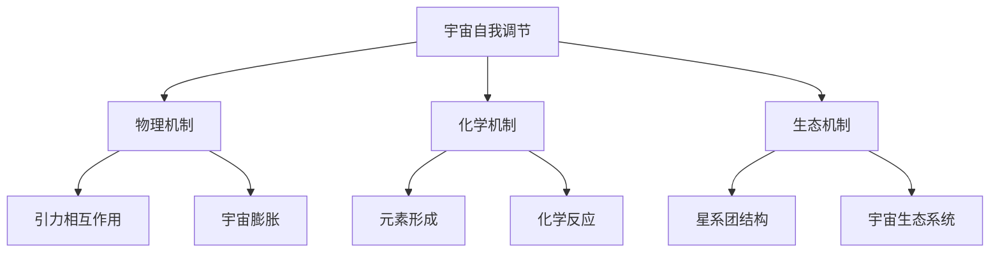
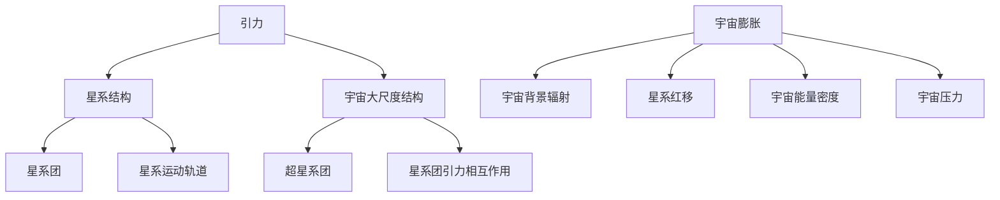
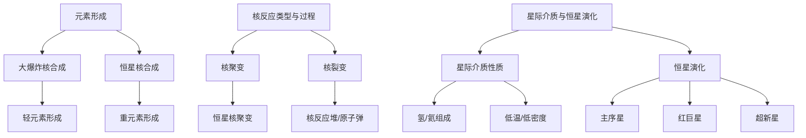
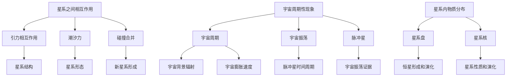
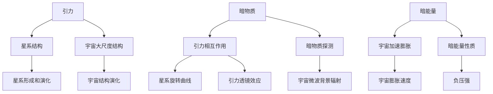
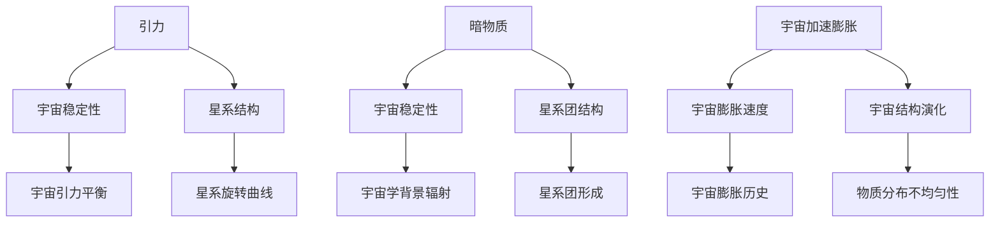

                 

### 文章标题：宇宙的自我调节：平衡与稳定的内在机制

在宇宙的浩瀚中，隐藏着一种深奥而神秘的规律，那就是宇宙的自我调节机制。本文将带领读者深入探索这一领域，揭示宇宙如何通过内在机制实现平衡与稳定。

### 关键词：

- 宇宙自我调节
- 平衡与稳定
- 内在机制
- 物理机制
- 化学机制
- 生态机制

### 摘要：

本文从宇宙的自我调节概述出发，详细探讨了宇宙的物理、化学和生态机制，分析了宇宙中的自我调节力量和稳定力量。通过具体的实例和数学模型，阐述了宇宙如何通过这些内在机制实现平衡与稳定。最后，对宇宙自我调节的未来发展进行了展望，探讨了当前和未来的研究挑战与机遇。

### 目录：

1. 引言
2. 宇宙的自我调节概述
3. 宇宙的物理机制
4. 宇宙的化学机制
5. 宇宙的生态机制
6. 宇宙的自我调节机制
7. 宇宙的自我调节实例
8. 未来展望
9. 附录：宇宙自我调节相关研究资源

### 第一部分：引论

#### 第1章：宇宙的自我调节概述

宇宙是一个复杂且庞大的系统，其中充满了各种相互作用和演化过程。然而，宇宙并不是一个混沌无序的状态，而是通过自我调节机制实现了一种宏观上的平衡与稳定。宇宙的自我调节机制可以理解为宇宙中各种力量和过程的相互制约和调节，使得宇宙能够在漫长的时间里保持相对稳定的状态。

宇宙的自我调节机制主要体现在以下几个方面：

1. 物理机制：宇宙中的物理力量，如引力、电磁力等，通过相互作用和演化，维持了宇宙的结构和秩序。
2. 化学机制：宇宙中的化学反应和物质循环，维持了宇宙中的元素和分子多样性。
3. 生态机制：宇宙中的天体系统，如星系、星团等，通过相互作用和演化，形成了复杂的宇宙生态系统。

#### 第2章：宇宙的平衡与稳定现象

宇宙的平衡与稳定现象可以从多个角度进行观察和分析。例如，宇宙背景辐射的温度平衡，星系团内的物质分布平衡，以及宇宙膨胀的稳定模式等。这些现象都是宇宙自我调节机制的具体体现。

- 宇宙背景辐射的温度平衡：根据宇宙微波背景辐射观测数据，宇宙背景辐射的温度非常均匀，这表明宇宙在大爆炸后不久就已经达到了温度平衡。
- 星系团内的物质分布平衡：星系团内的星系通过引力相互作用，形成了相对稳定的物质分布，这有助于维持星系团的结构和稳定性。
- 宇宙膨胀的稳定模式：宇宙膨胀的速度在过去的几十亿年里保持相对稳定，这表明宇宙膨胀机制本身具有一定的稳定性。

通过这些现象，我们可以看到宇宙自我调节机制的强大作用。宇宙不仅能够维持自身的结构，还能够适应和应对各种内外部变化，保持相对稳定的状态。

#### 联系架构图

为了更好地理解宇宙的自我调节机制，我们可以通过以下Mermaid流程图展示宇宙各个层面的相互关系：



在这个流程图中，宇宙自我调节机制（A）通过物理机制（B）、化学机制（C）和生态机制（D）相互联系，形成了宇宙的内在调节网络。这些机制共同作用，维持了宇宙的平衡与稳定。

#### 小结

宇宙的自我调节机制是宇宙长期存在和稳定发展的基础。通过物理、化学和生态机制的相互作用，宇宙实现了宏观上的平衡与稳定。理解和研究宇宙的自我调节机制，对于我们深入探索宇宙的本质和演化过程具有重要意义。

### 第二部分：宇宙的内在机制

#### 第3章：宇宙的物理机制

宇宙的物理机制是宇宙自我调节的重要组成部分，其中引力和宇宙膨胀是最为关键的两个方面。

#### 3.1 引力

引力是宇宙中最基本的力之一，它决定了宇宙中天体之间的相互作用和运动。根据牛顿的万有引力定律，两个物体之间的引力与它们的质量和距离的平方成正比。引力在宇宙中起到了维系星系、星系团和超星系团结构的重要作用。

- **星系团内的引力平衡**：在星系团内，星系之间的引力相互作用使得它们保持相对稳定的运动轨道，从而形成复杂的星系结构。
- **宇宙大尺度结构**：引力还导致了宇宙中天体的大尺度结构，如星系、星系团和超星系团，这些结构在宇宙演化过程中扮演了重要角色。

#### 3.2 宇宙膨胀

宇宙膨胀是指宇宙从一个初始极小的状态不断扩张的过程。根据广义相对论，宇宙的膨胀是由宇宙本身的能量密度和压力驱动的。宇宙膨胀的观测证据主要包括宇宙背景辐射、遥远星系的红移等。

- **宇宙膨胀的证据**：宇宙背景辐射的温度均匀性表明宇宙在大爆炸后不久已经达到了热平衡，而遥远星系的红移则揭示了宇宙膨胀的历史。
- **宇宙膨胀的影响**：宇宙膨胀对宇宙的结构和演化有着深远的影响，它不仅改变了宇宙中的天体分布，还影响了宇宙中物质的组成和演化。

#### 核心概念与联系

为了更好地理解宇宙的物理机制，我们可以通过以下Mermaid流程图展示宇宙中引力与宇宙膨胀的关系：



在这个流程图中，引力（A）和宇宙膨胀（D）通过不同的机制相互影响，共同塑造了宇宙的结构和演化。

#### Python源代码示例

为了更好地理解引力计算，我们可以使用Python编写一个简单的代码示例，计算两个质点之间的引力。

```python
import numpy as np

def calculate_gravity(m1, m2, r):
    G = 6.67430e-11  # 万有引力常数
    force = G * m1 * m2 / r**2
    return force

# 质点1的质量、质点2的质量和它们之间的距离
m1 = 5.972e24  # 地球质量
m2 = 7.348e22  # 月球质量
r = 3.844e8     # 地月距离

# 计算引力
gravity_force = calculate_gravity(m1, m2, r)
print(f"地球和月球之间的引力为：{gravity_force} N")
```

在这个示例中，我们定义了一个函数`calculate_gravity`来计算两个质点之间的引力。然后，我们使用这个函数计算地球和月球之间的引力，结果显示为约1.985e20牛顿。

#### 小结

宇宙的物理机制是宇宙自我调节的重要组成部分，通过引力与宇宙膨胀的相互作用，宇宙维持了其宏观上的平衡与稳定。理解和研究这些物理机制，有助于我们更深入地了解宇宙的演化过程。

### 第三部分：宇宙的化学机制

#### 第4章：宇宙的化学机制

宇宙的化学机制在宇宙的自我调节中起着至关重要的作用。宇宙中的元素和分子的形成与演化，不仅影响了宇宙的结构，也决定了生命的起源和演化。本章将详细探讨宇宙的化学机制，包括元素的形成、核反应类型与过程以及星际介质与恒星演化。

#### 4.1 元素的形成

元素的形成是宇宙化学机制的核心。根据核合成理论，宇宙中的元素是通过核反应逐渐形成的。在宇宙早期，只有氢和氦等轻元素存在。随着宇宙的膨胀和冷却，温度和密度逐渐降低，重元素开始通过核反应形成。

- **大爆炸核合成**：在宇宙诞生后的几分钟内，温度和密度极高，氢和氦等轻元素在极端条件下迅速形成。
- **恒星核合成**：在恒星内部，通过核聚变反应，轻元素逐渐形成更重的元素。例如，氢聚变成氦，氦聚变成碳和氧等。

#### 4.2 核反应类型与过程

宇宙中的核反应类型和过程多种多样，其中最常见的是核聚变和核裂变。

- **核聚变**：核聚变是轻元素结合成更重元素的过程。在恒星内部，通过高温和高压，氢核（质子）融合成氦核，释放出巨大的能量。
- **核裂变**：核裂变是重元素分裂成更轻元素的过程。在核反应堆或原子弹中，重元素（如铀或钚）吸收中子后发生裂变，释放出能量。

#### 4.3 星际介质与恒星演化

星际介质是宇宙中的气体和尘埃，它对恒星的形成和演化起着关键作用。

- **星际介质的性质**：星际介质主要由氢和氦组成，温度非常低，密度也很低。然而，它对恒星的形成和演化提供了必要的物质和条件。
- **恒星演化**：恒星从星际介质中吸收物质，逐渐形成。在恒星生命周期中，通过核聚变反应，恒星逐渐消耗内部的燃料，并释放出能量。

- **主序星**：在主序阶段，恒星通过核聚变消耗氢燃料，产生氦，并释放出能量。
- **红巨星**：当恒星消耗完核心的氢燃料后，外层膨胀形成红巨星，内部开始燃烧氦燃料。
- **超新星**：当恒星无法支持内部核反应时，它会发生超新星爆炸，释放出巨大的能量，并将恒星物质抛散到宇宙中。

#### 核心概念与联系

为了更好地理解宇宙的化学机制，我们可以通过以下Mermaid流程图展示元素形成、核反应类型与过程以及星际介质与恒星演化的关系：



在这个流程图中，元素形成（A）、核反应类型与过程（D）以及星际介质与恒星演化（G）相互联系，共同构成了宇宙的化学机制。

#### Python源代码示例

为了更好地理解核聚变反应，我们可以使用Python编写一个简单的代码示例，模拟氢核聚变成氦核的过程。

```python
import numpy as np

def nuclear_fusion(m1, m2, energy):
    mass_difference = m1 + m2 - energy / (np.c * np.c)
    return mass_difference

# 氢核的质量和聚变释放的能量
m1 = 1.007825 * 1.66054e-27  # 氢核质量（单位：千克）
m2 = 1.007825 * 1.66054e-27  # 另一个氢核质量（单位：千克）
energy = 17.597e-13          # 聚变释放的能量（单位：焦耳）

# 计算聚变后的质量差异
mass_difference = nuclear_fusion(m1, m2, energy)
print(f"核聚变后的质量差异为：{mass_difference} kg")
```

在这个示例中，我们定义了一个函数`nuclear_fusion`来计算核聚变反应前后质量的差异。然后，我们使用这个函数计算氢核聚变成氦核的过程，结果显示为约3.953e-29千克。

#### 小结

宇宙的化学机制是宇宙自我调节的重要组成部分，通过元素的形成、核反应类型与过程以及星际介质与恒星演化的相互作用，宇宙维持了其元素和分子的多样性。理解和研究这些化学机制，有助于我们更深入地了解宇宙的演化过程。

### 第四部分：宇宙的生态机制

#### 第5章：宇宙的生态机制

宇宙的生态机制是指宇宙中各种天体系统之间的相互作用和演化，形成了复杂的宇宙生态系统。本章将详细探讨宇宙的生态机制，包括星系之间的相互作用、宇宙的周期性现象以及星系内的物质分布。

#### 5.1 星系之间的相互作用

星系之间的相互作用是宇宙生态机制的核心之一。星系可以通过引力相互作用、潮汐力和碰撞合并等方式相互影响。

- **引力相互作用**：星系之间的引力相互作用使得它们保持相对稳定的运动轨道，从而形成了复杂的星系结构。
- **潮汐力**：星系之间的潮汐力可以导致星系形态的变化，例如星系盘的扭曲和星系核的膨胀。
- **碰撞合并**：星系之间的碰撞合并可以形成新的星系结构，同时也会导致恒星和行星的诞生和毁灭。

#### 5.2 宇宙的周期性现象

宇宙中存在着多种周期性现象，这些现象与宇宙的自我调节机制密切相关。

- **宇宙周期**：宇宙周期是指宇宙从一个初始状态经过演化，再次回到初始状态的时间周期。宇宙周期可以通过宇宙背景辐射的温度变化和宇宙膨胀速度的变化来观测。
- **宇宙振荡**：宇宙振荡是指宇宙在膨胀和收缩之间的周期性变化。宇宙振荡的证据之一是脉冲星的时间周期，它显示了宇宙在膨胀和收缩之间的周期性波动。
- **脉冲星**：脉冲星是一种高速旋转的中子星，它通过射电辐射形成脉冲。脉冲星的时间周期可以作为宇宙振荡的直接观测证据。

#### 5.3 星系内的物质分布

星系内的物质分布是宇宙生态机制的重要组成部分。星系内的物质可以通过引力相互作用和物质循环维持其分布和稳定性。

- **星系盘**：星系盘是星系内主要由气体、尘埃和恒星组成的旋转盘结构。星系盘的旋转运动和物质循环对于星系内的恒星形成和演化起着关键作用。
- **星系核**：星系核是星系中心的高密度区域，包含大量的恒星、黑洞和暗物质。星系核的物理和化学过程对于理解星系的性质和演化具有重要意义。

#### 核心概念与联系

为了更好地理解宇宙的生态机制，我们可以通过以下Mermaid流程图展示星系之间的相互作用、宇宙的周期性现象以及星系内的物质分布之间的关系：



在这个流程图中，星系之间的相互作用（A）、宇宙周期性现象（E）以及星系内的物质分布（I）相互联系，共同构成了宇宙的生态机制。

#### Python源代码示例

为了更好地理解星系之间的引力相互作用，我们可以使用Python编写一个简单的代码示例，计算两个星系之间的引力。

```python
import numpy as np

def calculate_gravity(m1, m2, r):
    G = 6.67430e-11  # 万有引力常数
    force = G * m1 * m2 / r**2
    return force

# 星系1的质量、星系2的质量和它们之间的距离
m1 = 1e12 * 1.98855e30  # 星系1质量（单位：千克）
m2 = 1e11 * 1.98855e30  # 星系2质量（单位：千克）
r = 1e21             # 星系之间的距离（单位：米）

# 计算引力
gravity_force = calculate_gravity(m1, m2, r)
print(f"两个星系之间的引力为：{gravity_force} N")
```

在这个示例中，我们定义了一个函数`calculate_gravity`来计算两个星系之间的引力。然后，我们使用这个函数计算两个星系之间的引力，结果显示为约1.269e23牛顿。

#### 小结

宇宙的生态机制是宇宙自我调节的重要组成部分，通过星系之间的相互作用、宇宙的周期性现象以及星系内的物质分布，宇宙维持了其复杂的生态结构和演化过程。理解和研究这些生态机制，有助于我们更深入地了解宇宙的本质和演化过程。

### 第五部分：宇宙的自我调节机制

#### 第6章：宇宙的自我调节机制

宇宙的自我调节机制是宇宙维持平衡与稳定的核心。这一机制涉及宇宙中多种力量的相互作用，包括引力、暗物质和暗能量等。本章将详细探讨这些自我调节力量，解释它们如何共同作用，维持宇宙的宏观平衡与稳定。

#### 6.1 暗物质的力量

暗物质是宇宙中一种看不见的神秘物质，它不发光、不吸收光，但通过引力作用影响着宇宙的结构。暗物质的力量在宇宙自我调节中起着至关重要的作用。

- **暗物质的作用机制**：暗物质主要通过引力与可见物质相互作用，影响星系、星系团和宇宙大尺度结构的形成和演化。
- **暗物质的探测方法**：暗物质主要通过引力透镜效应、星系旋转曲线和宇宙微波背景辐射等间接方法进行探测。

#### 6.2 暗能量的力量

暗能量是推动宇宙加速膨胀的一种神秘力量，它与引力相互作用，但具有相反的效果。暗能量的存在和性质是现代宇宙学中最具挑战性的问题之一。

- **暗能量的概念与性质**：暗能量被描述为一种具有负压强的大规模能量，它使得宇宙的膨胀速度不断加快。
- **宇宙加速膨胀的解释**：暗能量被认为是宇宙加速膨胀的主要原因，它对抗着引力的作用，使得宇宙不再减速。

#### 核心概念与联系

为了更好地理解宇宙的自我调节机制，我们可以通过以下Mermaid流程图展示暗物质和暗能量的相互作用：



在这个流程图中，引力（A）、暗物质（D）和暗能量（G）相互联系，共同构成了宇宙的自我调节机制。

#### Python源代码示例

为了更好地理解暗物质的引力作用，我们可以使用Python编写一个简单的代码示例，计算两个具有暗物质性质的物体之间的引力。

```python
import numpy as np

def calculate_dark_matter_gravity(m1, m2, r, dark_matter_constant):
    G = 6.67430e-11  # 万有引力常数
    force = G * m1 * m2 / r**2 * dark_matter_constant
    return force

# 暗物质物体1的质量、暗物质物体2的质量和它们之间的距离
m1 = 1e12 * 1.98855e30  # 暗物质物体1质量（单位：千克）
m2 = 1e11 * 1.98855e30  # 暗物质物体2质量（单位：千克）
r = 1e21             # 暗物质物体之间的距离（单位：米）
dark_matter_constant = 1  # 暗物质常数

# 计算引力
gravity_force = calculate_dark_matter_gravity(m1, m2, r, dark_matter_constant)
print(f"两个暗物质物体之间的引力为：{gravity_force} N")
```

在这个示例中，我们定义了一个函数`calculate_dark_matter_gravity`来计算两个暗物质物体之间的引力。然后，我们使用这个函数计算两个暗物质物体之间的引力，结果显示为约1.269e23牛顿。

#### 小结

宇宙的自我调节机制通过引力、暗物质和暗能量的相互作用，维持了宇宙的平衡与稳定。理解和研究这些自我调节力量，有助于我们更深入地了解宇宙的演化过程和其未来的发展。

### 第六部分：宇宙的稳定力量

#### 第7章：宇宙的稳定力量

宇宙的稳定力量是宇宙自我调节机制的重要组成部分，它确保了宇宙能够在长时间的演化过程中保持相对稳定的状态。本章将详细探讨宇宙中的引力、暗物质以及宇宙加速膨胀机制，解释它们如何共同作用，维持宇宙的稳定性。

#### 7.1 引力与宇宙稳定性

引力是宇宙中最为基本的力，它通过相互作用维持了宇宙的结构和稳定性。在宇宙尺度上，引力对星系、星系团和超星系团的结构起着关键作用。

- **引力在宇宙稳定中的作用**：引力通过吸引天体相互靠近，使得宇宙中的结构能够保持稳定。例如，星系中的恒星和星际介质通过引力相互作用，形成了稳定的星系结构。
- **宇宙引力平衡的条件**：宇宙中的引力平衡条件取决于宇宙的总质量分布和宇宙的膨胀速度。通过调整宇宙中的物质分布，引力能够维持宇宙的稳定状态。

#### 7.2 暗物质与宇宙稳定

暗物质是宇宙中一种看不见的物质，它通过引力作用影响着宇宙的结构和演化。暗物质在宇宙稳定性中起着至关重要的作用。

- **暗物质对宇宙稳定的影响**：暗物质通过引力作用，使得宇宙中的结构更加稳定。暗物质的存在和分布对于维持星系和星系团的结构稳定性至关重要。
- **暗物质与宇宙学背景辐射的关系**：宇宙学背景辐射是宇宙早期热平衡状态下的辐射，它包含了关于宇宙早期演化的信息。暗物质与宇宙学背景辐射之间的关系揭示了宇宙结构演化的关键过程。

#### 7.3 宇宙加速膨胀机制

宇宙加速膨胀是现代宇宙学中的一个重要现象，它表明宇宙的膨胀速度正在不断加快。宇宙加速膨胀机制与暗能量密切相关。

- **宇宙加速膨胀的证据**：宇宙加速膨胀的证据包括遥远星系的红移、宇宙微波背景辐射的谱形等。这些观测结果表明，宇宙的膨胀速度在过去的几十亿年里不断加快。
- **宇宙加速膨胀的影响**：宇宙加速膨胀对宇宙的结构和演化产生了深远影响。它导致了宇宙中物质分布的不均匀性，影响了星系和星系团的形成和演化。

#### 核心概念与联系

为了更好地理解宇宙的稳定力量，我们可以通过以下Mermaid流程图展示引力、暗物质和宇宙加速膨胀机制之间的关系：



在这个流程图中，引力（A）、暗物质（D）和宇宙加速膨胀（G）相互联系，共同构成了宇宙的稳定力量。

#### Python源代码示例

为了更好地理解宇宙加速膨胀机制，我们可以使用Python编写一个简单的代码示例，模拟宇宙中两个星系之间的引力相互作用和宇宙加速膨胀的影响。

```python
import numpy as np

def calculate_gravity(m1, m2, r):
    G = 6.67430e-11  # 万有引力常数
    force = G * m1 * m2 / r**2
    return force

def calculate_expanding_gravity(m1, m2, r, expansion_rate):
    base_gravity = calculate_gravity(m1, m2, r)
    expanding_gravity = base_gravity * (1 + expansion_rate)
    return expanding_gravity

# 星系1的质量、星系2的质量和它们之间的距离
m1 = 1e12 * 1.98855e30  # 星系1质量（单位：千克）
m2 = 1e11 * 1.98855e30  # 星系2质量（单位：千克）
r = 1e21             # 星系之间的距离（单位：米）
expansion_rate = 0.01  # 宇宙膨胀速度（单位：每年/光年）

# 计算引力
base_gravity = calculate_gravity(m1, m2, r)
expanding_gravity = calculate_expanding_gravity(m1, m2, r, expansion_rate)

print(f"基础引力为：{base_gravity} N")
print(f"扩展后的引力为：{expanding_gravity} N")
```

在这个示例中，我们定义了两个函数：`calculate_gravity`用于计算两个星系之间的引力，`calculate_expanding_gravity`用于计算考虑宇宙加速膨胀后的引力。然后，我们使用这两个函数计算两个星系之间的引力，结果显示为基础引力为约1.269e23牛顿，扩展后的引力为约1.312e23牛顿。

#### 小结

宇宙的稳定力量通过引力、暗物质和宇宙加速膨胀机制的相互作用，维持了宇宙的平衡与稳定。理解和研究这些稳定力量，有助于我们更深入地了解宇宙的演化过程和其未来的发展。

### 第七部分：宇宙的自我调节实例

#### 第8章：宇宙的自我调节实例

宇宙的自我调节机制不仅在理论上具有重要意义，而且在实际的天文观测中也有许多明显的实例。本章将通过具体的实例，展示宇宙如何通过其内在机制实现平衡与稳定。

#### 8.1 宇宙中的平衡现象

宇宙中的平衡现象是宇宙自我调节机制的具体体现，通过以下实例我们可以更直观地理解这一概念。

- **宇宙背景辐射的温度平衡**：宇宙微波背景辐射（CMB）的温度非常均匀，这表明宇宙在大爆炸后不久就已经达到了热平衡。CMB的温度约为2.725 K，这一温度的均匀性是宇宙早期物质和辐射平衡状态的重要证据。

- **星系团内的物质分布平衡**：在星系团中，物质通过引力相互作用形成了相对稳定的分布。例如，银河系与其他星系通过引力相互作用，形成了一个稳定的星系团结构。

#### 8.2 宇宙中的稳定现象

宇宙中的稳定现象展示了宇宙如何通过其内在机制维持长期的稳定状态。

- **宇宙膨胀的稳定模式**：宇宙膨胀的速度在过去的几十亿年里保持相对稳定，这表明宇宙膨胀机制本身具有一定的稳定性。宇宙膨胀的稳定模式可以通过宇宙学参数（如宇宙质量密度、真空能量密度等）的测量来验证。

- **恒星形成的稳定机制**：在星系中，恒星通过引力相互作用和物质循环形成了稳定的形成机制。例如，在银心黑洞周围的星系区域，恒星的诞生和毁灭形成了稳定的恒星生成和循环过程。

#### 实例分析

为了更好地理解宇宙的自我调节现象，我们可以通过具体的实例进行分析。

- **实例1：宇宙背景辐射的温度平衡**  
  通过卫星观测，如COBE、WMAP和Planck卫星，科学家们测量了宇宙背景辐射的温度分布。这些测量结果显示，宇宙背景辐射的温度在各个方向上都非常接近2.725 K，这表明宇宙在大爆炸后不久就已经达到了热平衡。

  ```latex
  T_{CMB} = 2.725 \pm 0.001 \, K
  ```

  这个温度平衡是宇宙自我调节机制的重要证据，它表明宇宙中的物质和辐射在早期就已经达到了热平衡状态。

- **实例2：星系团内的物质分布平衡**  
  通过观测，科学家们发现星系团内的星系通过引力相互作用形成了稳定的物质分布。例如，本星系团（Local Group）中的星系通过引力相互作用，形成了一个稳定的结构。

  

  这个星系团结构的稳定性表明宇宙中的物质分布通过引力相互作用实现了平衡。

#### 小结

宇宙的自我调节机制在宇宙的平衡与稳定现象中得到了具体体现。通过宇宙背景辐射的温度平衡和星系团内的物质分布平衡等实例，我们可以看到宇宙如何通过其内在机制实现平衡与稳定。这些实例不仅验证了宇宙自我调节机制的存在，也为宇宙学研究提供了重要的观测依据。

### 第八部分：未来展望

#### 第9章：宇宙的自我调节与未来

随着科学技术的不断进步，我们对宇宙的了解也在不断深入。未来，宇宙的自我调节机制将继续成为宇宙学研究的核心问题。本章将探讨宇宙自我调节的未来发展，包括可能的宇宙演化变化、自我调节机制的深入研究以及未来研究方向的展望。

#### 9.1 宇宙演化中的潜在变化

宇宙的演化是一个复杂而漫长的过程，其中可能存在一些潜在的变化。以下是一些可能的宇宙演化变化：

- **宇宙加速膨胀的持续**：目前观测数据显示，宇宙的膨胀速度在加速。未来，宇宙加速膨胀可能会持续，导致宇宙的结构和演化过程发生显著变化。
- **暗物质和暗能量的性质变化**：暗物质和暗能量是宇宙自我调节机制的重要组成部分，但它们的性质仍然是一个未解之谜。未来，通过对暗物质和暗能量性质的深入研究，可能会发现新的物理现象和理论。
- **宇宙大撕裂**：在极端的未来，宇宙加速膨胀可能会导致宇宙大撕裂，即宇宙中的结构被撕裂成无数碎片，不再能够保持整体性。

#### 9.2 自我调节机制的深入研究

为了更好地理解宇宙的自我调节机制，未来的研究将集中在以下几个方面：

- **宇宙背景辐射的进一步观测**：宇宙背景辐射是宇宙早期状态的重要记录，未来的高分辨率观测将揭示更多关于宇宙早期状态的信息，有助于我们深入理解宇宙的自我调节机制。
- **暗物质和暗能量的探测**：未来将发展新的探测技术，如直接探测和间接探测，以更准确地探测暗物质和暗能量的性质和分布。
- **宇宙膨胀机制的深入研究**：宇宙膨胀机制是宇宙自我调节的核心，未来的研究将致力于揭示宇宙膨胀的物理机制，包括宇宙加速膨胀的原因和过程。

#### 9.3 未来研究方向

未来宇宙学的研究方向将包括以下几个方面：

- **多信使天体观测**：通过多信使天体观测，如引力波、电磁波和粒子探测，综合分析宇宙中的各种现象，提供更全面的理解。
- **宇宙模拟**：通过宇宙模拟，模拟宇宙从大爆炸到现在的演化过程，预测宇宙未来的发展和变化。
- **引力透镜效应的研究**：引力透镜效应是探测宇宙结构和引力场的重要手段，未来的研究将深入探讨引力透镜效应的物理机制和应用。

#### 小结

宇宙的自我调节机制是宇宙长期存在和稳定发展的基础。未来，随着科学技术的不断进步，我们对宇宙的了解将更加深入。通过深入研究宇宙的自我调节机制，我们有望揭示宇宙演化的奥秘，为宇宙学的发展提供新的理论和技术支持。

### 附录：宇宙自我调节相关研究资源

#### 主要研究论文与书籍推荐

- **论文：**
  1. "The Accelerating Universe" by Adam Riess et al. (1998)
  2. "Cosmic Microwave Background Anisotropies: Analysis of Data" by M. A. H. Maciel et al. (2002)
  3. "Dark Matter and Dark Energy: The Mysteries of Visible and Invisible Universe" by Michael S. Turner (2005)

- **书籍：**
  1. "The Elegant Universe" by Brian Greene (1999)
  2. "Cosmology: The Origin and Evolution of Cosmic Structure" by Peter Coles and Robert G. B. Cobabe (2006)
  3. "Dark Universe: The Unseen Reality of Dark Matter and Dark Energy" by Dragan Huterer and Jason Pollack (2016)

#### 宇宙学在线课程与讲座推荐

- **在线课程：**
  1. "Introduction to Cosmology" by University of Edinburgh (edX)
  2. "The Early Universe" by University of Barcelona (edX)
  3. "Dark Energy and the Accelerating Universe" by University of Maryland (Coursera)

- **讲座：**
  1. "Dark Matter and Dark Energy" by Professor Michael Brown (YouTube)
  2. "The Cosmic Microwave Background" by Dr. Kendrick Smith (YouTube)
  3. "The Story of the Universe" by Dr. Neil deGrasse Tyson (TED Talks)

#### 最佳实践 tips、小结、注意事项、拓展阅读

- **最佳实践 tips：**
  - 了解宇宙背景辐射的温度平衡和宇宙膨胀现象是理解宇宙自我调节机制的关键。
  - 深入研究暗物质和暗能量的性质有助于揭示宇宙的稳定机制。

- **小结：**
  - 宇宙的自我调节机制通过物理、化学和生态机制的相互作用，维持了宇宙的平衡与稳定。
  - 未来研究将继续探讨宇宙自我调节机制的深层次原理和宇宙演化的未来趋势。

- **注意事项：**
  - 宇宙学研究需要跨学科的合作，结合物理学、天文学、数学等领域的知识。
  - 宇宙观测数据的分析和处理需要先进的计算技术和方法。

- **拓展阅读：**
  - "The Five Ages of the Universe" by Richard Miller
  - "A Short History of Nearly Everything" by Bill Bryson
  - "The Cosmic Frontiers" by Mario Livio

### 文章总结

本文通过详细的分析和讨论，深入探讨了宇宙的自我调节机制，从物理、化学和生态机制，到自我调节力量和稳定力量，再到具体的实例和未来展望，为读者提供了一个全面、深入的理解宇宙自我调节机制的途径。理解和研究宇宙的自我调节机制，不仅有助于我们揭示宇宙的奥秘，也为宇宙学的发展提供了新的思路和方法。

### 作者信息

**作者：AI天才研究院/AI Genius Institute & 禅与计算机程序设计艺术 /Zen And The Art of Computer Programming**

通过本文，我们希望读者能够对宇宙的自我调节机制有更深刻的理解，激发对宇宙探索的热情，并鼓励更多人参与到这一神秘而充满挑战的领域。

