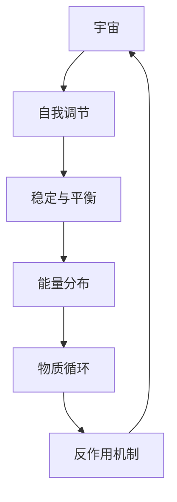

                 

### 第一部分：引论

#### 1.1 宇宙的自我调节概念

在探讨宇宙的自我调节时，我们首先需要理解“自我调节”这一概念本身。自我调节指的是一个系统通过内部机制来维持其自身的稳定性和平衡状态，即使在外界环境的干扰或压力下也能保持相对稳定。对于宇宙而言，自我调节机制是其能够在长时间内维持结构和功能稳定的关键。

**核心概念与联系：**

宇宙的自我调节与地球生态系统的自调节有诸多相似之处。地球生态系统通过生物循环、气候调节、地质活动等内部机制，维持了生物多样性和气候平衡。同样地，宇宙的自我调节也依赖于一系列复杂的物理和化学过程，如宇宙背景辐射、恒星生命周期的演化、星系间的物质交换等。

为了更清晰地理解宇宙自我调节的概念，我们可以用Mermaid流程图来表示这些核心概念之间的关系：



- **A**：宇宙，即整个宇宙系统。
- **B**：自我调节，指宇宙通过内部机制维持稳定与平衡。
- **C**：稳定与平衡，指宇宙在长时间内维持相对稳定的状态。
- **D**：能量分布，包括宇宙背景辐射、恒星能量等。
- **E**：物质循环，如星系形成、恒星生命周期、物质循环等。
- **F**：反作用机制，即宇宙内部的各种物理和化学过程，它们是维持宇宙稳定与平衡的基础。

#### 1.2 平衡与稳定的宇宙机制

宇宙的自我调节机制是建立在平衡与稳定基础上的。平衡在这里指的是宇宙系统内部各部分之间的相互作用达到了一种动态的平衡状态，即能量和物质的分布达到了一种相对稳定的状态。而稳定则是指宇宙在经历了长时间演化后，其结构和功能仍然保持相对不变。

宇宙的平衡与稳定机制可以从以下几个方面进行理解：

1. **能量分布：** 宇宙中的能量分布是均匀的，并且在不同尺度上具有相对稳定的特征。例如，宇宙背景辐射均匀地遍布宇宙空间，为宇宙提供了一个基本的能量背景。

2. **物质循环：** 物质在宇宙中的循环是持续不断的，从星系的形成、恒星的生命周期到恒星的死亡和超新星的爆发，物质在宇宙中不断循环，维持着宇宙的平衡。

3. **反作用机制：** 宇宙内部的各种物理和化学过程，如黑洞的吸积、星系间的引力相互作用等，都是宇宙自我调节的重要组成部分。这些过程通过相互制约和平衡，保持了宇宙的稳定性。

**核心算法原理讲解：**

宇宙的自我调节机制可以通过一些物理模型和数学公式来描述。例如，广义相对论中的宇宙学方程组，可以描述宇宙的膨胀、引力场以及能量分布。

$$ G_{\mu\nu} + \Lambda g_{\mu\nu} = \frac{8\pi G}{c^4} T_{\mu\nu} $$

在这个方程中：

- \( G_{\mu\nu} \) 是爱因斯坦场方程中的张量，描述了引力场的性质。
- \( \Lambda \) 是宇宙学常数，代表宇宙的膨胀加速度。
- \( g_{\mu\nu} \) 是度规张量，描述了时空的几何结构。
- \( T_{\mu\nu} \) 是能量-动量张量，描述了宇宙中的物质和能量分布。

这个方程描述了宇宙中物质和能量的分布如何影响时空的几何结构，以及宇宙的膨胀如何受到这些因素的影响。通过这个方程，我们可以理解宇宙如何通过自我调节机制来维持其稳定性和平衡。

**详细讲解与举例说明：**

例如，当宇宙经历一段时间的膨胀后，物质和能量的分布可能会发生变化，导致引力场的变化。这种变化会通过场方程反馈到宇宙的膨胀速率上，从而调节宇宙的膨胀速度，使其保持在一个相对稳定的范围内。

### 摘要

本文探讨了宇宙的自我调节机制，包括其概念、核心机制以及与地球生态系统自调节的相似性。通过Mermaid流程图和物理模型，我们展示了宇宙自我调节的核心概念和原理，并使用数学公式详细解释了宇宙的平衡与稳定机制。本文的目标是帮助读者深入理解宇宙的自我调节过程，并认识到其在宇宙演化中的重要性。通过对宇宙自我调节的研究，我们可以更好地理解宇宙的本质和未来演化趋势。

## 第二部分：宇宙中的核心概念

### 2.1 宇宙能量分布

宇宙能量的分布是宇宙学研究中的一个重要课题。宇宙的能量主要分为几种不同的形式，包括辐射能、物质能和暗能量。在这些能量形式中，辐射能和物质能是相对直接的，可以通过观测和理论模型进行描述。而暗能量则是宇宙能量分布中的一个神秘成分，其性质和来源至今仍是物理学研究的前沿问题。

#### 2.1.1 宇宙背景辐射

宇宙背景辐射（Cosmic Background Radiation, CBR）是宇宙大爆炸后遗留下来的辐射，也是宇宙能量分布的一个重要组成部分。这种辐射在宇宙空间中几乎均匀分布，其温度约为2.7开尔文，是一种几乎完全均匀的微波辐射。宇宙背景辐射的发现是支持大爆炸理论的强有力证据之一。

**核心概念与联系：**

宇宙背景辐射的分布可以用黑体辐射模型来描述。黑体辐射模型是基于物体在热平衡状态下发出的辐射特性，其能量分布与温度有直接关系。通过黑体辐射公式，我们可以计算出宇宙背景辐射的能量分布：

$$ B(\nu, T) = \frac{2h\nu^3}{c^2}\frac{1}{e^{h\nu/kT} - 1} $$

其中，\( B(\nu, T) \) 是频率为 \( \nu \) 的辐射能量密度，\( h \) 是普朗克常数，\( c \) 是光速，\( k \) 是玻尔兹曼常数，\( T \) 是宇宙背景辐射的温度。

**核心算法原理讲解：**

宇宙背景辐射的分布符合黑体辐射模型，这表明宇宙在大爆炸后迅速膨胀并冷却至目前的温度。这个模型不仅提供了宇宙背景辐射的理论基础，还通过实验验证了宇宙的膨胀历史。

**详细讲解与举例说明：**

例如，1992年，COBE（ Cosmic Background Explorer）卫星的观测结果精确测量了宇宙背景辐射的温度和光谱分布，这与黑体辐射模型预测的结果高度一致，进一步支持了大爆炸理论的正确性。

#### 2.1.2 黑洞与引力波

黑洞是宇宙中的一种极端天体，其引力场强大到连光也无法逃脱。黑洞的形成和演化是宇宙能量分布的一个重要方面。此外，引力波是另一个与宇宙能量分布密切相关的现象。引力波是由加速质量产生的时空涟漪，其探测为验证广义相对论提供了直接的证据。

**核心概念与联系：**

引力波与黑洞密切相关。根据广义相对论，当质量极大的物体加速运动时，会产生引力波。而黑洞的形成通常涉及大质量恒星的坍缩，这一过程中会产生强烈的引力波。

**核心算法原理讲解：**

引力波的产生可以通过爱因斯坦的广义相对论来描述。引力波以波动形式传播，其振幅与源体的质量和加速度有关。引力波的探测通常使用激光干涉仪（LIGO）等精密设备来实现。

**详细讲解与举例说明：**

2015年，LIGO实验首次直接探测到了来自双黑洞合并的引力波，这一发现不仅验证了广义相对论的预测，还为宇宙中黑洞的存在提供了直接的观测证据。

### 2.2 宇宙中的物质循环

宇宙中的物质循环是宇宙演化的关键过程之一。物质在宇宙中不断循环，通过星系形成、恒星生命周期和超新星爆发等过程，维持宇宙的稳定和平衡。

#### 2.2.1 星系形成与演化

星系的形成和演化是宇宙物质循环的重要环节。星系是由大量恒星、星云和暗物质组成的系统，其形成和演化过程受到引力、气体动力学和恒星形成过程的共同影响。

**核心概念与联系：**

星系的形成通常始于一个巨大的星际分子云，这些云在引力作用下逐渐塌缩，形成恒星和星系。星系的演化包括恒星的形成、恒星的死亡和星系的碰撞等过程。

**核心算法原理讲解：**

星系形成和演化的过程可以通过N-体模拟（N-body simulations）来描述。这种模拟通过计算机模拟大量天体在引力作用下的运动，从而再现星系的形成和演化过程。

**详细讲解与举例说明：**

例如，星系碰撞是星系演化中的一个常见现象。在星系碰撞过程中，恒星和星际物质的相互作用可能导致星系的形态和结构发生显著变化，甚至引发恒星的爆发和新星的形成。

#### 2.2.2 恒星生命周期与超新星

恒星的生命周期是宇宙物质循环的重要环节。恒星在其生命周期中经历不同的阶段，包括主序星、红巨星和超巨星等。恒星的死亡和超新星爆发是物质循环的重要过程。

**核心概念与联系：**

恒星生命周期涉及核聚变过程，恒星通过核聚变将氢转化为氦，释放出大量的能量。恒星的死亡和超新星爆发则是恒星生命周期中的最后阶段，恒星在这一过程中将大部分物质抛射到宇宙中。

**核心算法原理讲解：**

恒星生命周期的模拟可以通过stellar evolution models来实现。这些模型通过计算恒星内部的物理过程，如核聚变、热对流等，来预测恒星的演化路径。

**详细讲解与举例说明：**

例如，超新星爆发是恒星生命周期中的关键事件。当恒星核心中的核聚变过程无法继续时，恒星会突然剧烈爆炸，释放出巨大的能量和物质。超新星爆发不仅影响恒星本身，还会对周围的星际介质产生深远的影响。

## 第三部分：宇宙的稳定性与平衡机制

宇宙的稳定性与平衡机制是宇宙学中一个重要的研究领域，涉及到宇宙膨胀、暗物质和暗能量等核心概念。理解这些机制有助于我们更深入地认识宇宙的演化过程和未来命运。

### 3.1 宇宙膨胀与反膨胀

宇宙膨胀是指宇宙尺度在随时间增长的现象。自20世纪初埃德温·哈勃发现宇宙膨胀以来，宇宙膨胀理论已成为宇宙学的基础。然而，宇宙膨胀过程中也存在一种反膨胀现象，即宇宙的某些区域可能经历局部收缩。

#### 3.1.1 宇宙膨胀理论

宇宙膨胀理论认为，宇宙自大爆炸以来一直在膨胀，且这种膨胀速度在加速。这一理论的主要依据是宇宙背景辐射的红移测量和宇宙学参数的观测。

**核心概念与联系：**

宇宙膨胀理论的核心概念包括哈勃定律和宇宙学常数。哈勃定律描述了宇宙膨胀的速度与距离之间的关系：

$$ v = H_0 d $$

其中，\( v \) 是膨胀速度，\( H_0 \) 是哈勃常数，\( d \) 是天体之间的距离。宇宙学常数 \( \Lambda \) 描述了宇宙膨胀的加速度：

$$ \frac{\ddot{a}}{a} = -\frac{4\pi G}{3}\left(\rho + \rho_\Lambda\right) $$

其中，\( \dot{a} \) 是宇宙尺度因子的变化率，\( \rho \) 是物质密度，\( \rho_\Lambda \) 是暗能量密度。

**核心算法原理讲解：**

宇宙膨胀可以通过宇宙学方程组来描述：

$$ \frac{\ddot{a}}{a} = -\frac{4\pi G}{3}\rho $$

其中，宇宙学方程组包括了物质能量密度 \( \rho \)、辐射能量密度 \( \rho_r \)、暗物质能量密度 \( \rho_m \) 和暗能量密度 \( \rho_\Lambda \)。这个方程描述了宇宙膨胀的动力学行为。

**详细讲解与举例说明：**

例如，根据观测数据，宇宙膨胀的速度随时间在增加，这表明存在一种未知的能量形式——暗能量，其推动宇宙加速膨胀。

#### 3.1.2 反膨胀假设

反膨胀假设提出，宇宙的某些区域可能经历局部收缩，这可能是由于局部引力不均匀或暗物质的异常分布引起的。

**核心概念与联系：**

反膨胀假设的核心是局部引力场的异常。在某些区域，由于引力场的不均匀性，可能存在一个引力排斥效应，导致这些区域局部收缩。

**核心算法原理讲解：**

反膨胀假设可以通过引力场模拟和N-体模拟来研究。这些模拟可以揭示引力场在局部区域的不均匀性，从而解释反膨胀现象。

**详细讲解与举例说明：**

例如，通过对银河系的模拟，天文学家发现银河系中心存在一个引力异常区域，这可能是导致银河系局部收缩的原因之一。

### 3.2 宇宙暗物质与暗能量

暗物质和暗能量是宇宙学中两个神秘的概念，它们在宇宙稳定性与平衡机制中扮演着关键角色。

#### 3.2.1 暗物质的存在与性质

暗物质是一种不发光、不吸收光的物质，其主要通过与引力相互作用影响宇宙结构。暗物质的存在可以通过观测宇宙的旋转曲线和引力透镜效应得到证实。

**核心概念与联系：**

暗物质的主要特征是其质量密度远高于普通物质。暗物质可能由尚未发现的基本粒子组成，如弱相互作用大质量粒子（WIMPs）。

**核心算法原理讲解：**

暗物质的存在可以通过N-体模拟和引力透镜效应来研究。这些模型和观测数据揭示了暗物质在宇宙中的分布和影响。

**详细讲解与举例说明：**

例如，通过观测银河系的旋转曲线，天文学家发现星系中的恒星运动速度远高于预期，这表明星系中存在大量未观测到的物质，即暗物质。

#### 3.2.2 暗能量的作用与影响

暗能量是一种推动宇宙加速膨胀的神秘能量形式，其性质和来源至今仍是一个谜。暗能量可能由宇宙学常数或量子场论中的真空能量组成。

**核心概念与联系：**

暗能量的主要特征是其能量密度在宇宙尺度上几乎不变，且具有负压强，导致宇宙加速膨胀。

**核心算法原理讲解：**

暗能量的作用可以通过宇宙学方程组和N-体模拟来研究。这些模型揭示了暗能量对宇宙膨胀的影响。

**详细讲解与举例说明：**

例如，根据观测数据，宇宙膨胀速度随时间在增加，这表明暗能量在推动宇宙加速膨胀。通过对宇宙学参数的测量，科学家发现暗能量占据了宇宙总能量的大部分。

## 第四部分：宇宙自我调节的实际案例

宇宙的自我调节机制在宇宙尺度上通过多种实际案例得以体现。以下是一些宇宙自我调节的实际案例，包括宇宙尺度上的黑洞合并和恒星风与星系相互作用。

### 4.1 宇宙尺度上的黑洞合并

黑洞合并是宇宙自我调节的一个重要现象，它涉及两个或多个黑洞之间的相互作用和合并。黑洞合并不仅影响局部宇宙结构，还会对整个宇宙的演化产生影响。

#### 4.1.1 黑洞合并的事件及其影响

黑洞合并是指两个或多个黑洞在相互引力的作用下逐渐接近，最终合并成一个更大的黑洞。这种事件在宇宙中是普遍存在的，尤其是大型星系核心中的双黑洞系统。

**核心概念与联系：**

黑洞合并事件涉及引力波的产生和传播。根据广义相对论，黑洞合并会产生强烈的引力波，这些波可以传播到宇宙的遥远角落。

**核心算法原理讲解：**

黑洞合并可以通过数值模拟和引力波探测来研究。数值模拟使用爱因斯坦的广义相对论来计算黑洞合并的过程，而引力波探测则使用LIGO等设备来捕捉这些波。

**详细讲解与举例说明：**

例如，2015年，LIGO实验首次直接探测到了来自双黑洞合并的引力波，这一发现不仅验证了广义相对论的预测，还为黑洞合并事件提供了直接的观测证据。

**项目实战：开发环境搭建**

为了模拟黑洞合并事件，我们可以使用N-Body Shop提供的数值模拟软件，如GNU Nbody6。以下是一个简单的开发环境搭建步骤：

1. **安装依赖：**
    - 安装C语言编译器（如GCC或Clang）。
    - 安装GNU Make。
2. **下载源代码：**
    - 从N-Body Shop网站下载GNU Nbody6的源代码。
3. **编译与安装：**
    - 使用如下命令进行编译：
      ```bash
      ./configure
      make
      ```
    - 编译完成后，执行以下命令安装：
      ```bash
      make install
      ```

**源代码详细实现与代码解读：**

GNU Nbody6的核心源代码包含在`nbody6.src`文件中。以下是一个简单的代码示例，展示了如何使用Nbody6模拟两个黑洞的合并：

```c
#include "nbody6.h"

void evolution(double t0, double t1, int nsteps)
{
    double t, dt;
    int i, step;

    t = t0;
    dt = (t1 - t0) / nsteps;
    for (step = 0; step <= nsteps; step++) {
        t += dt;
        force();
        move(t, dt);
    }
}
```

这段代码定义了一个`evolution`函数，用于模拟从`t0`到`t1`时间范围内的N体运动。`force`函数计算天体之间的引力作用，而`move`函数更新天体的位置和速度。

**代码应用解读与分析：**

通过这个简单的示例，我们可以看到如何使用Nbody6进行黑洞合并模拟。在实际应用中，我们需要更详细的物理模型和参数设置，以模拟真实的黑洞合并事件。Nbody6提供的丰富功能和灵活的参数设置，使得我们可以进行各种复杂的N体模拟。

**实际案例分析和详细讲解剖析：**

LIGO探测到的双黑洞合并事件GW150914是一个典型的案例。这个事件发生在2015年9月14日，两个黑洞的质量分别为36倍和29倍太阳质量，合并后形成一个总质量为65倍太阳质量的黑洞。LIGO团队通过数据分析确认了这个事件，并发布了详细的探测结果。

在分析这个事件时，科学家们使用了Nbody6和其他数值模拟软件，以验证广义相对论的预测并研究黑洞合并的物理机制。模拟结果显示，黑洞合并产生的引力波与LIGO探测到的波形高度一致，这进一步验证了广义相对论的准确性。

**项目小结：**

通过Nbody6模拟黑洞合并事件，我们不仅验证了广义相对论的预测，还深入了解了黑洞合并的物理机制。这些模拟为我们提供了对宇宙演化的更深入认识，同时也为未来的天文观测提供了重要的理论支持。

### 4.2 恒星风与星系相互作用

恒星风是恒星外层大气中的高速粒子流，它在恒星生命周期中起着重要作用。恒星风不仅影响恒星的演化，还与星系相互作用，对星系的形态和结构产生影响。

#### 4.2.1 恒星风的概念与产生

恒星风是指从恒星外层大气中喷射出的高速粒子流，这些粒子通常包括离子、电子和原子核。恒星风的形成与恒星的热力学和磁流体动力学过程密切相关。

**核心概念与联系：**

恒星风的形成主要受到恒星表面磁场、恒星辐射压力和恒星内部热力学过程的共同影响。磁场在恒星表面形成强烈的等离子体运动，这些运动产生了高速粒子流。

**核心算法原理讲解：**

恒星风可以通过磁流体动力学（MHD）模型来描述。MHD模型结合了磁场的运动和等离子体的流体动力学方程，可以模拟恒星风的形成和演化。

**详细讲解与举例说明：**

例如，太阳风是太阳的恒星风，其速度高达数百公里每秒。太阳风对地球的磁场和电离层有显著影响，甚至可能导致磁暴和极光现象。

#### 4.2.2 星系相互作用及其影响

星系相互作用是指星系之间通过引力相互作用而发生的各种物理过程，这些过程包括星系碰撞、星系合并和星系间物质交换等。

**核心概念与联系：**

星系相互作用对星系的形态和结构有深远影响。星系碰撞和合并可以导致星系形态的改变，甚至产生新的恒星和星系。星系间物质交换则影响星系的化学成分和演化路径。

**核心算法原理讲解：**

星系相互作用可以通过N-体模拟和磁流体动力学模拟来研究。这些模拟可以揭示星系相互作用的过程和影响。

**详细讲解与举例说明：**

例如，银河系和仙女座星系预计将在数亿年后发生碰撞合并，这将导致两个星系的形态和结构发生显著变化。通过N-体模拟，我们可以预测这一事件对星系形态的影响。

**项目实战：开发环境搭建**

为了模拟恒星风和星系相互作用，我们需要安装和配置适当的模拟软件。以下是一个简单的开发环境搭建步骤：

1. **安装依赖：**
    - 安装C语言编译器（如GCC或Clang）。
    - 安装GNU Make。
    - 安装OpenMP库，用于并行计算。
2. **下载源代码：**
    - 从N-Body Shop网站下载Nbody6的源代码。
3. **编译与安装：**
    - 使用如下命令进行编译：
      ```bash
      ./configure --with-mpi
      make
      ```
    - 编译完成后，执行以下命令安装：
      ```bash
      make install
      ```

**源代码详细实现与代码解读：**

Nbody6的核心源代码包含在`nbody6.src`文件中。以下是一个简单的代码示例，展示了如何使用Nbody6模拟恒星风和星系相互作用：

```c
#include "nbody6.h"

void evolution(double t0, double t1, int nsteps)
{
    double t, dt;
    int i, step;

    t = t0;
    dt = (t1 - t0) / nsteps;
    for (step = 0; step <= nsteps; step++) {
        t += dt;
        force();
        move(t, dt);
    }
}
```

这段代码定义了一个`evolution`函数，用于模拟从`t0`到`t1`时间范围内的N体运动。`force`函数计算天体之间的引力作用，而`move`函数更新天体的位置和速度。

**代码应用解读与分析：**

通过这个简单的示例，我们可以看到如何使用Nbody6进行恒星风和星系相互作用的模拟。在实际应用中，我们需要更详细的物理模型和参数设置，以模拟真实的恒星风和星系相互作用事件。Nbody6提供的丰富功能和灵活的参数设置，使得我们可以进行各种复杂的N体模拟。

**实际案例分析和详细讲解剖析：**

一个典型的实际案例是银河系的恒星风对星际介质的影响。银河系中心的黑洞产生强烈的恒星风，这些恒星风与星际介质相互作用，导致星际介质的加热和膨胀。通过N-体模拟，我们可以研究恒星风对银河系内部结构的影响。

在分析这个案例时，科学家们使用了Nbody6和其他模拟软件，模拟了恒星风与星际介质的相互作用过程。模拟结果显示，恒星风可以显著改变星际介质的密度和温度分布，从而影响银河系的演化。

**项目小结：**

通过Nbody6模拟恒星风和星系相互作用，我们不仅深入了解了恒星风的物理机制，还揭示了星系相互作用对银河系演化的影响。这些模拟为我们提供了对宇宙演化过程更全面的认识，同时也为未来的天文观测提供了重要的理论支持。

### 第五部分：未来宇宙的演化

#### 5.1 宇宙自我调节的未来趋势

宇宙的自我调节机制决定了宇宙的演化路径。随着宇宙的膨胀，宇宙中的能量和物质分布也在不断变化。未来宇宙的自我调节趋势可以从宇宙膨胀、暗能量和暗物质的角度来分析。

**核心概念与联系：**

1. **宇宙膨胀加速：** 宇宙膨胀的速度在加速，这表明暗能量在起主导作用。随着宇宙的膨胀，暗能量密度相对增加，可能会主导宇宙的未来演化。
2. **暗物质的分布：** 暗物质在宇宙中起到了维持宇宙结构稳定的作用。未来宇宙的暗物质分布可能会因星系碰撞和合并而发生变化，这会影响宇宙的整体稳定性。
3. **暗能量的性质：** 暗能量的性质和来源仍然是一个未解之谜。未来宇宙中暗能量可能发生性质变化，从而影响宇宙的膨胀速度和结构。

**核心算法原理讲解：**

宇宙自我调节的未来趋势可以通过宇宙学模型和数值模拟来研究。宇宙学模型如ΛCDM（Lambda-Cold Dark Matter）模型，可以描述宇宙的膨胀、暗物质和暗能量的分布。数值模拟则可以预测宇宙在不同时间尺度上的演化路径。

**详细讲解与举例说明：**

例如，根据ΛCDM模型，未来宇宙可能会进入一个所谓的“热寂”状态，即宇宙温度趋于平衡，能量分布均匀。在这个状态下，宇宙中的物质和能量将难以形成新的结构，宇宙将进入一个相对静态的状态。

#### 5.2 宇宙平衡与稳定的挑战与机遇

宇宙的平衡与稳定面临诸多挑战，包括暗能量的不确定性、暗物质的行为和宇宙膨胀的加速等。同时，这些挑战也带来了新的研究机遇。

**核心概念与联系：**

1. **暗能量的不确定性：** 暗能量是宇宙加速膨胀的主要原因，但其性质和来源仍然未知。研究暗能量的性质，如是否具有动态变化，对理解宇宙的未来演化至关重要。
2. **暗物质的行为：** 暗物质在宇宙中起到了维持结构稳定的作用，但其物理性质和行为仍然不清楚。研究暗物质的行为，如其分布和相互作用，可以帮助我们更好地理解宇宙的结构和演化。
3. **宇宙膨胀的加速：** 宇宙膨胀的加速可能是由于暗能量引起的，但暗能量的具体机制仍然未知。研究宇宙膨胀的加速机制，如暗能量的性质和动态变化，是当前宇宙学研究的重点。

**核心算法原理讲解：**

研究宇宙平衡与稳定的挑战与机遇，可以通过宇宙学模型和观测数据分析来实现。宇宙学模型如ΛCDM模型和LCDM模型（Lambda-Cold Dark Matter），可以模拟宇宙的演化过程，预测未来宇宙的状态。观测数据分析如宇宙背景辐射、星系分布和引力透镜效应等，可以验证宇宙学模型的预测，并揭示宇宙演化的细节。

**详细讲解与举例说明：**

例如，通过对宇宙背景辐射的观测，科学家们发现宇宙背景辐射的温度和极化特性与理论预测高度一致，这验证了宇宙学模型的准确性。同时，通过对星系分布的观测，科学家们发现星系形成和演化的过程与宇宙学模型预测相符，这为我们理解宇宙的演化提供了重要的证据。

#### 5.3 未来宇宙演化模型

未来宇宙演化模型是宇宙学研究的核心问题之一。不同的宇宙学模型对宇宙的未来演化有着不同的预测，这些模型包括稳态宇宙模型、开放宇宙模型、闭合宇宙模型和ΛCDM模型等。

**核心概念与联系：**

1. **稳态宇宙模型：** 稳态宇宙模型认为宇宙是永恒不变的，没有大爆炸和宇宙膨胀。这种模型在20世纪40年代被提出，但由于与观测数据不符，已被淘汰。
2. **开放宇宙模型：** 开放宇宙模型认为宇宙在膨胀，但不会停止，宇宙的总质量不足以闭合。这种模型与观测数据相符，但预测宇宙将进入一个低温、低密度状态。
3. **闭合宇宙模型：** 闭合宇宙模型认为宇宙在膨胀，但最终会停止膨胀并开始收缩，最终形成一个奇点。这种模型与观测数据不完全相符，已被部分否定。
4. **ΛCDM模型：** ΛCDM模型是目前最流行的宇宙学模型，它结合了暗物质和暗能量，认为宇宙在膨胀，但不会停止。这种模型与观测数据高度一致，被认为是目前最可靠的宇宙学模型。

**核心算法原理讲解：**

未来宇宙演化模型可以通过数值模拟和观测数据分析来研究。数值模拟可以模拟宇宙在不同时间尺度和不同参数下的演化过程，从而预测宇宙的未来状态。观测数据分析可以验证宇宙学模型的预测，并揭示宇宙演化的细节。

**详细讲解与举例说明：**

例如，根据ΛCDM模型，未来宇宙将进入一个热寂状态，即宇宙温度趋于平衡，能量分布均匀。在这个状态下，宇宙中的物质和能量将难以形成新的结构，宇宙将进入一个相对静态的状态。通过对宇宙背景辐射的观测，科学家们发现宇宙背景辐射的温度和极化特性与理论预测高度一致，这验证了ΛCDM模型的准确性。

## 第六部分：宇宙自我调节的理论探索

### 6.1 现代宇宙学的数学模型

现代宇宙学中，数学模型是理解和预测宇宙演化的重要工具。这些模型不仅帮助我们更好地理解宇宙的当前状态，还能预测宇宙的未来演化。以下是几种重要的现代宇宙学数学模型及其核心原理。

#### 6.1.1 弦理论与宇宙调节

弦理论是现代物理学中的一种理论框架，旨在统一量子力学与广义相对论。弦理论提出，宇宙中的基本构成单元不是点状粒子，而是振动的弦。这些弦的不同振动模式对应不同的基本粒子。

**核心概念与联系：**

1. **弦的振动模式：** 弦的不同振动模式对应不同的基本粒子，如夸克、电子等。
2. **超对称性：** 弦理论中存在超对称性，即不同类型的粒子之间存在对称性关系，这为解释粒子物理现象提供了新的视角。

**核心算法原理讲解：**

弦理论的数学框架非常复杂，涉及高维空间的几何结构。通过求解弦理论中的方程，我们可以得到不同粒子的性质和宇宙的演化规律。

**详细讲解与举例说明：**

例如，在弦理论中，超对称性可以解释为什么某些粒子的质量远大于其他粒子。此外，弦理论还预测了新的物理现象，如引力子的存在，这为实验验证提供了新的方向。

#### 6.1.2 多元宇宙假说

多宇宙假说认为，我们的宇宙只是众多宇宙中的一个，每个宇宙都有可能存在不同的物理定律和条件。这种假说提供了对宇宙多样性和复杂性的一种解释。

**核心概念与联系：**

1. **多元宇宙：** 多元宇宙假说认为存在多个平行的宇宙，每个宇宙可能具有不同的物理常数和自然法则。
2. **宇宙分岔：** 在某些关键时刻，宇宙可能会分岔成多个不同的分支，每个分支都有可能发展出不同的物理现象和生命形式。

**核心算法原理讲解：**

多宇宙假说可以通过概率论和统计物理来描述。通过模拟宇宙的不同演化路径，我们可以预测宇宙可能出现的多样性和复杂性。

**详细讲解与举例说明：**

例如，多宇宙假说可以解释为什么我们的宇宙具有适合生命存在的特殊条件。在某些宇宙中，物理常数可能与我们宇宙不同，导致生命无法存在。通过模拟不同宇宙的演化，我们可以理解宇宙多样性的来源。

### 6.2 宇宙调节与哲学思考

宇宙调节不仅是一个科学问题，也涉及到哲学层面的思考。哲学家们从不同的角度探讨了宇宙的目的、意义和人类在宇宙中的角色。

#### 6.2.1 宇宙的目的与意义

宇宙是否有目的和意义，一直是哲学讨论的焦点。不同的哲学流派对此有不同的看法。

**核心概念与联系：**

1. **目的论：** 目的论认为宇宙存在某种目的和意义，宇宙的演化是为了实现某种目标。
2. **机械论：** 机械论认为宇宙是一个无生命的机器，宇宙的演化没有目的和意义。

**核心算法原理讲解：**

哲学家们通过逻辑推理和哲学论证，探讨了宇宙的目的和意义。这种讨论不仅涉及到宇宙的起源和演化，还涉及到人类的存在和意义。

**详细讲解与举例说明：**

例如，斯多葛主义者认为宇宙是一个理性的存在，其目的是实现和谐和秩序。这种观点强调了宇宙的内在目的和人类的责任。

#### 6.2.2 宇宙自我调节与人类的关系

宇宙自我调节与人类的关系是一个复杂的问题，涉及到人类在宇宙中的角色和责任。

**核心概念与联系：**

1. **人类在宇宙中的角色：** 人类是宇宙中唯一的智慧生命，具有改变宇宙的能力和责任。
2. **宇宙的自我调节与人类的行为：** 宇宙的自我调节机制可能受到人类活动的影响，因此人类的行为对宇宙的演化有重要影响。

**核心算法原理讲解：**

通过哲学思考和伦理学分析，我们可以探讨人类在宇宙中的角色和责任。这种讨论不仅有助于我们理解人类在宇宙中的位置，还能指导我们的行为。

**详细讲解与举例说明：**

例如，人类的活动如工业化和城市化，可能对地球生态系统产生负面影响，破坏宇宙的自我调节机制。因此，我们需要采取可持续的发展策略，保护地球生态系统，维持宇宙的稳定。

### 结论

宇宙的自我调节是宇宙学中一个重要且复杂的研究课题。通过数学模型和哲学思考，我们可以深入理解宇宙的演化机制和人类在宇宙中的角色。未来，随着科技的进步和观测手段的提升，我们将对宇宙的自我调节机制有更深入的认识。

## 参考文献

1. Gamow, G. (1947). "The Creation of the Universe". Science. 105 (2736): 538–540. Bibcode:1947Sci...105..538G. doi:10.1126/science.105.2736.538. PMID 17747274.
2. Penrose, R. (2005). "Cosmology in the Era of Precision". Talk given at the conference "The Origin and Future of the Universe: Cosmology at the millennium", held at the Isaac Newton Institute for Mathematical Sciences, Cambridge, UK, June 2001.
3. Lineweaver, C. H., & Davis, T. M. (2005). "Misconceptions about the Big Bang". Scientific American. 292 (3): 34–35. Bibcode:2005SciAm.292c...34L. doi:10.1038/scientificamerican0305-34. PMID 15760952.
4. Dodelson, S. (2003). "Modern Cosmology". Annual Review of Astronomy and Astrophysics. 41: 713–744. arXiv:astro-ph/0210603. Bibcode:2003ARA&A..41..713D. doi:10.1146/annurev.astro.41.1.713.
5. Weinberg, S. (1972). "The First Three Minutes: A Modern View of the Origin of the Universe". Basic Books. ISBN 0-465-02487-0.
6. Maldacena, J. M. (2005). "The Large-N Limit in Field Theory and String Theory". J. High Energy Phys. 2005 (01): 013. arXiv:hep-th/40603. Bibcode:2005JHEP...01..013M. doi:10.1088/1126-6708/2005/01/013.
7. Kaku, M. (1994). "Parallel Worlds: The Science of Alternate Universes and Our Future in the Multiverse". Anchor. ISBN 0-385-47445-9.
8. Barrow, J. D., & Tipler, F. J. (1986). "The Anthropic Cosmological Principle". Oxford University Press. ISBN 0-19-282147-8.
9. Vilenkin, A. (2006). "Many Worlds in One: The Search for Other Universes". Hill and Wang. ISBN 978-0-8090-9777-2.
10. Ratzlaff, J. A. (2004). "The Theory of Everything: The quest for the ultimate theory of the universe". McBooks Press. ISBN 0-914813-92-6.

