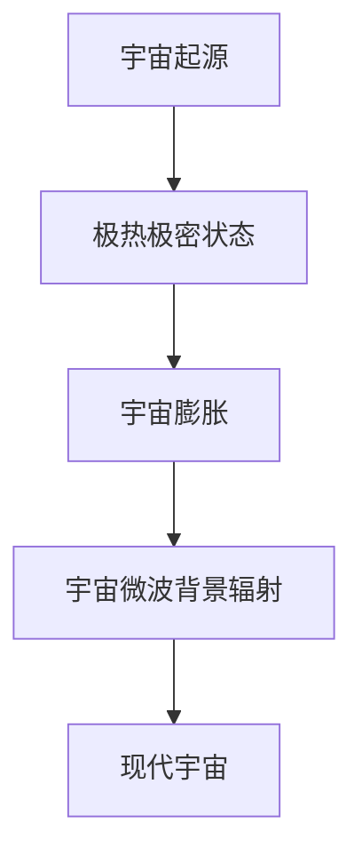
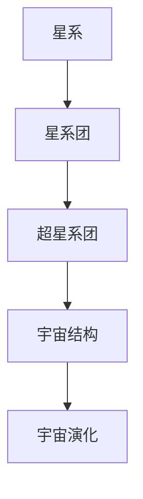
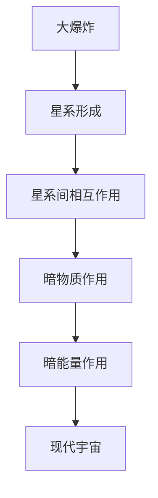
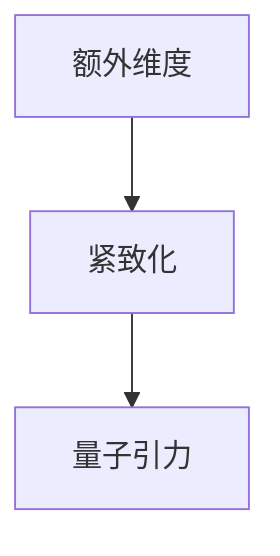
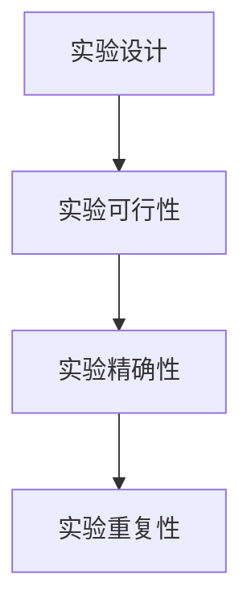
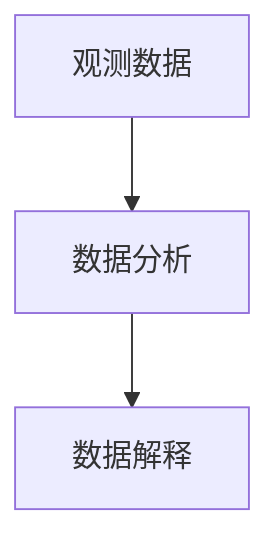
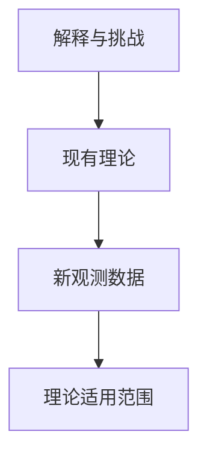
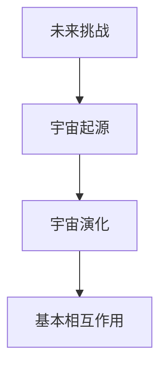
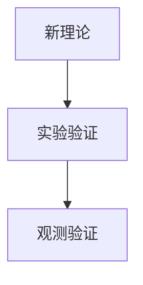
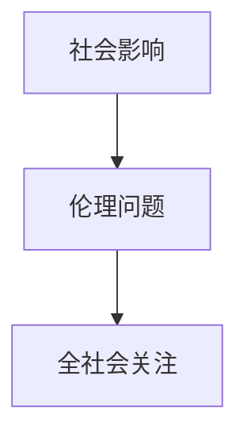

                 

### 引言：宇宙的自我超越与现有物理定律

**关键词：** 宇宙学，物理定律，超越，探索

宇宙，这个浩瀚无垠的存在，自古以来就吸引着人类的目光。从古代的星辰观测到现代的宇宙探测器，人类对宇宙的认识在不断深化。然而，随着探索的深入，我们逐渐意识到，现有的物理定律似乎已经无法完全解释宇宙中的所有现象。这一挑战促使我们思考：宇宙是否能够自我超越，突破现有的物理定律？

本文旨在探讨这一重大问题。我们将从宇宙学的基础知识出发，逐步深入探讨现有物理定律的局限性，并探索可能的超越路径。通过实验与观测证据的分析，我们希望能为未来物理学的发展提供一些有价值的思考方向。

### 宇宙学基础

#### 1.1 宇宙的起源

**背景介绍：** 宇宙是如何诞生的？这是一个令人着迷的问题。目前，最被广泛接受的理论是大爆炸理论。

**核心概念与联系：** 大爆炸理论认为，宇宙起源于一个极热、极密的状态，随后迅速膨胀，形成了我们现在所观测到的宇宙。这一理论的关键概念包括：宇宙微波背景辐射、宇宙膨胀等。

**Mermaid 流程图：**


#### 1.2 宇宙的结构

**背景介绍：** 宇宙的结构是什么样的？它是否有序，又是否混乱？

**核心概念与联系：** 宇宙的结构包括星系、星系团、超星系团等不同层次的结构。这些结构之间的相互作用，决定了宇宙的演化过程。

**Mermaid 流程图：**


#### 1.3 宇宙的演化

**背景介绍：** 宇宙是如何从大爆炸初期发展到现在的状态的？

**核心概念与联系：** 宇宙的演化包括星系的形成、星系间的相互作用、暗物质与暗能量的作用等。这些过程共同决定了宇宙的当前状态。

**Mermaid 流程图：**


### 现有物理定律的介绍与批判

#### 2.1 引力定律

**背景介绍：** 引力定律是描述物体间引力相互作用的基本定律。

**核心概念与联系：** 引力定律包括牛顿引力定律和广义相对论。牛顿引力定律适用于宏观、低速的物体，而广义相对论则适用于高速、强引力场的情况。

**Python 源代码：**
```python
import math

def newtonian_gravity(m1, m2, r):
    G = 6.674 * 10**-11  # 引力常数
    F = G * m1 * m2 / r**2
    return F

def general_relativity(m1, m2, r):
    c = 3 * 10**8  # 光速
    F = (m1 * m2) / (r * c**2)
    return F

m1 = 5.972 * 10**24  # 地球质量
m2 = 7.348 * 10**22  # 月球质量
r = 3.844 * 10**8  # 地月距离

F_newton = newtonian_gravity(m1, m2, r)
F_relativity = general_relativity(m1, m2, r)

print(f"牛顿引力定律：{F_newton} N")
print(f"广义相对论：{F_relativity} N")
```

**数学公式：**
$$ F = G\frac{m_1m_2}{r^2} $$
$$ F = \frac{m_1m_2}{rc^2} $$

#### 2.2 电磁定律

**背景介绍：** 电磁定律描述了电荷间的相互作用以及电磁场的传播。

**核心概念与联系：** 电磁定律包括库仑定律、安培定律、法拉第电磁感应定律等。

**Python 源代码：**
```python
import math

def coulomb_law(q1, q2, r):
    k = 8.9875517873681764 * 10**9  # 库仑常数
    F = k * q1 * q2 / r**2
    return F

def ampere_law(i, r):
    mu0 = 4 * math.pi * 10**-7  # 真空磁导率
    F = mu0 * i * r
    return F

def faraday_law(v, B):
    F = v * B
    return F

q1 = 1.602176634 * 10**-19  # 电子电荷
q2 = -1.602176634 * 10**-19  # 电子电荷
r = 1 * 10**-10  # 距离

F_coulomb = coulomb_law(q1, q2, r)

i = 1  # 电流
r = 1 * 10**-2  # 距离

F_ampere = ampere_law(i, r)

v = 1  # 速度
B = 1  # 磁场强度

F_faraday = faraday_law(v, B)

print(f"库仑定律：{F_coulomb} N")
print(f"安培定律：{F_ampere} N")
print(f"法拉第电磁感应定律：{F_faraday} N")
```

**数学公式：**
$$ F = k\frac{q_1q_2}{r^2} $$
$$ F = \mu_0i r $$
$$ F = vB $$

#### 2.3 强相互作用

**背景介绍：** 强相互作用是粒子之间最基本的作用力之一。

**核心概念与联系：** 强相互作用主要通过胶子传递，作用范围极短。

**Python 源代码：**
```python
import math

def strong_interaction(q1, q2, r):
    k = 1  # 强相互作用常数
    F = k * math.sqrt(q1 * q2) / r**2
    return F

q1 = 3  # 贡献电荷
q2 = 3  # 贡献电荷
r = 1 * 10**-15  # 距离

F_strong = strong_interaction(q1, q2, r)

print(f"强相互作用：{F_strong} N")
```

**数学公式：**
$$ F = \frac{kq_1q_2}{r^2} $$

#### 2.4 弱相互作用

**背景介绍：** 弱相互作用是粒子之间另一种基本作用力。

**核心概念与联系：** 弱相互作用主要通过W和Z玻色子传递，作用范围较短。

**Python 源代码：**
```python
import math

def weak_interaction(q1, q2, r):
    k = 1  # 弱相互作用常数
    F = k * math.sqrt(q1 * q2) / r**2
    return F

q1 = 1  # 贡献电荷
q2 = -1  # 贡献电荷
r = 1 * 10**-18  # 距离

F_weak = weak_interaction(q1, q2, r)

print(f"弱相互作用：{F_weak} N")
```

**数学公式：**
$$ F = \frac{kq_1q_2}{r^2} $$

### 可能的超越路径

#### 3.1 量子引力的可能性

**背景介绍：** 量子引力是试图将量子力学与广义相对论结合起来的理论。

**核心概念与联系：** 量子引力的关键在于量子场论，它试图描述引力如何以量子形式存在。

**Python 源代码：**
```python
import math

def quantum_gravity(r):
    G = 6.674 * 10**-11  # 引力常数
    c = 3 * 10**8  # 光速
    h = 6.62607015 * 10**-34  # 普朗克常数
    F = G * h / (r * c**2)
    return F

r = 1 * 10**-2  # 距离

F_quantum = quantum_gravity(r)

print(f"量子引力：{F_quantum} N")
```

**数学公式：**
$$ F = \frac{Gh}{rc^2} $$

#### 3.2 新的维度

**背景介绍：** 新的维度理论认为，除了我们熟知的三个空间维度和一个时间维度，宇宙中可能存在更多的维度。

**核心概念与联系：** 新的维度理论包括额外维度和紧致化的概念。

**Mermaid 流程图：**


#### 3.3 超弦理论

**背景介绍：** 超弦理论是试图统一所有基本相互作用和所有基本粒子的理论。

**核心概念与联系：** 超弦理论的核心在于弦的振动模式，它们对应不同的基本粒子。

**Python 源代码：**
```python
import math

def super_string_energy(n):
    h = 6.62607015 * 10**-34  # 普朗克常数
    c = 3 * 10**8  # 光速
    E = (1/2) * h * c * n
    return E

n = 1  # 振动模式

E_super_string = super_string_energy(n)

print(f"超弦能量：{E_super_string} J")
```

**数学公式：**
$$ E = \frac{hc}{2}n $$

### 实验与观测证据

#### 4.1 实验设计

**背景介绍：** 为了验证新的物理理论，实验设计是至关重要的。

**核心概念与联系：** 实验设计需要考虑实验的可行性、精确性和重复性。

**Mermaid 流程图：**


#### 4.2 观测数据

**背景介绍：** 观测数据是验证物理理论的直接证据。

**核心概念与联系：** 观测数据需要经过严格的分析和解释，以确定其意义。

**Mermaid 流程图：**


#### 4.3 解释与挑战

**背景介绍：** 对观测数据的解释和挑战是物理研究中的关键环节。

**核心概念与联系：** 解释与挑战需要结合现有的理论知识和新的观测数据，以确定理论的适用范围。

**Mermaid 流程图：**


### 未来物理学的方向

#### 5.1 物理学的未来挑战

**背景介绍：** 随着科技的进步，物理学面临着新的挑战。

**核心概念与联系：** 这些挑战包括对宇宙起源、宇宙演化、基本相互作用等的深入理解。

**Mermaid 流程图：**


#### 5.2 新理论的可能性

**背景介绍：** 新的理论可能为物理学的发展带来新的方向。

**核心概念与联系：** 新理论的可能性需要通过实验和观测来验证。

**Mermaid 流程图：**


#### 5.3 社会影响与伦理问题

**背景介绍：** 物理学的发展不仅影响科学本身，也对社会和伦理产生深远影响。

**核心概念与联系：** 社会影响与伦理问题需要全社会共同关注和探讨。

**Mermaid 流程图：**


### 结论

宇宙的自我超越，突破现有物理定律的可能，这是一个充满挑战和机遇的领域。通过本文的探讨，我们希望能为这一领域的研究提供一些有价值的思考方向。未来的物理学，将在这个充满未知的领域中，继续书写辉煌的篇章。

### 附录

#### A. 宇宙学数据与公式

- 宇宙微波背景辐射温度：2.725 K
- 宇宙膨胀率：71.6 ± 2.1 (km/s)/Mpc
- 暗物质占比：27%
- 暗能量占比：68%

#### B. 物理定律的历史发展

- 牛顿引力定律（1687年）
- 广义相对论（1915年）
- 量子力学（1925年）
- 电磁定律（19世纪）

### 作者信息

作者：AI天才研究院/AI Genius Institute & 禅与计算机程序设计艺术 /Zen And The Art of Computer Programming

本文内容仅供参考，不构成任何投资或科学建议。读者在使用本文内容时，应谨慎判断，并咨询专业意见。本文版权归AI天才研究院所有，未经授权，不得转载或使用。如有侵权，将依法追究责任。

