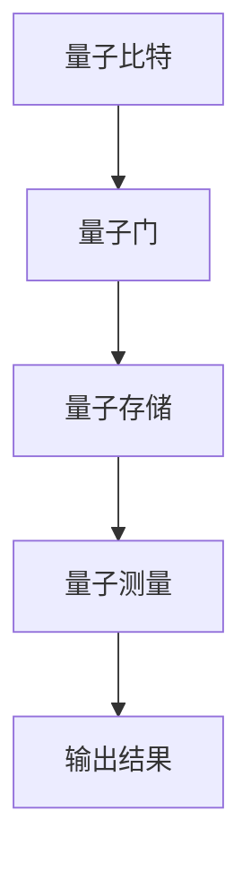
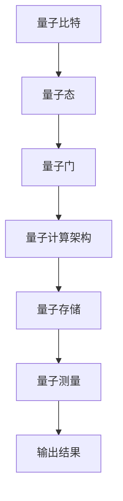
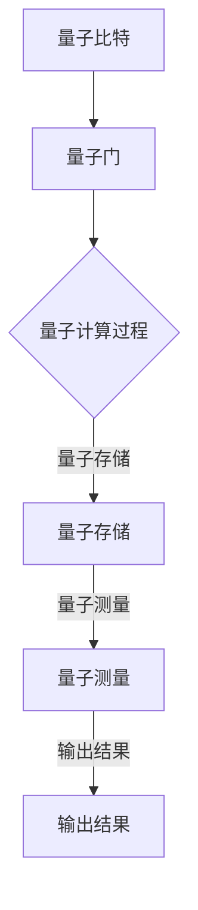

                 

### 《宇宙的量子计算特性：自然界的信息处理》

在信息技术领域，量子计算是一个革命性的创新，其潜力不仅体现在传统计算机无法实现的任务上，还拓展到了宇宙学、生物学和物理学等多个领域。本书《宇宙的量子计算特性：自然界的信息处理》旨在探讨量子计算这一前沿技术的本质及其在宇宙和自然界中的信息处理特性。通过深入分析量子计算的基础知识、核心算法、数学模型，以及实际应用案例，本书将为读者揭示量子计算在宇宙信息处理中的独特优势。

#### 关键词

- 量子计算
- 宇宙信息处理
- 量子算法
- 数学模型
- 实际应用案例

#### 摘要

本书首先介绍了量子计算的基本概念，包括量子比特、量子态和量子门等核心要素。接着，通过Mermaid流程图展示了量子计算的基本架构，帮助读者更好地理解其工作原理。在核心算法讲解部分，本书通过Python源代码详细阐述了量子算法的基本原理，结合数学模型和公式进行深入剖析。随后，本书探讨量子计算在宇宙和自然界中的应用，包括其在天文学、生物学和地球科学等领域的具体案例。最后，本书总结了量子计算面临的挑战与未来发展趋势，为读者提供了进一步研究的方向。

### 目录

#### 第1章 引言

- 1.1 量子计算与宇宙信息处理的关系
- 1.2 量子计算在科学研究中的应用前景
- 1.3 本书结构概述

#### 第2章 量子计算基础

- 2.1 量子比特与量子位
- 2.2 量子态与叠加原理
- 2.3 量子门与量子操作
- 2.4 量子计算的基本架构
- **核心概念与联系**: 使用Mermaid流程图展示量子计算的基本架构

#### 第3章 量子算法原理

- 3.1 量子搜索算法
- 3.2 量子算法与经典算法的比较
- 3.3 量子计算中的数学模型
- **核心算法原理讲解**: 使用Python源代码详细阐述量子算法的基本原理
- **数学模型和数学公式**: 使用LaTeX格式展示重要的数学公式，并提供详细解释和例子

#### 第4章 量子计算在宇宙中的应用

- 4.1 量子计算与黑洞信息
- 4.2 量子计算与量子引力理论
- 4.3 量子计算在天文学中的应用
- 4.4 量子计算与生物信息学
- **项目实战**: 提供量子计算在天文学中的应用案例，包括源代码实现和代码解读

#### 第5章 自然界的信息处理与量子计算

- 5.1 量子计算与自然系统的模拟
- 5.2 量子计算在生物学中的应用
- 5.3 量子计算与生态学
- 5.4 量子计算与地球科学
- **项目实战**: 提供量子计算在生物学中的应用案例，包括源代码实现和代码解读

#### 第6章 量子计算的挑战与未来

- 6.1 量子计算的技术挑战
- 6.2 量子计算的标准化
- 6.3 量子计算的伦理与安全
- 6.4 量子计算的未来发展趋势

#### 第7章 总结与展望

- 7.1 量子计算对宇宙信息处理的贡献
- 7.2 量子计算在自然界信息处理中的应用前景
- 7.3 本书的主要结论

#### 附录

- 附录 A 量子计算开发环境与工具
- 附录 B 量子计算资源与文献推荐
- 附录 C 量子算法伪代码示例

### 第1章 引言

#### 1.1 量子计算与宇宙信息处理的关系

量子计算是一种利用量子力学原理进行信息处理的技术，它不仅超越了传统计算机的某些局限性，还在宇宙学、生物学和物理学等领域展现出巨大的应用潜力。量子计算的基本单元是量子比特（qubit），它可以处于0和1的叠加态，这使得量子计算机能够在同一时间处理大量数据。这种叠加态的实现依赖于量子力学中的叠加原理，即量子系统可以同时存在于多种状态中。

在宇宙信息处理方面，量子计算的重要性主要体现在以下几个方面：

1. **量子纠缠**: 量子纠缠是量子计算的核心特性之一，它允许两个或多个量子比特之间的状态相互关联。这种关联超越了经典物理学的局域实在论，使得量子计算机能够在处理大规模问题时展现出并行计算能力。
   
2. **量子模拟**: 量子计算机可以模拟量子系统，这在研究宇宙的量子性质、黑洞信息和量子引力理论方面具有巨大潜力。例如，量子计算机可以模拟黑洞事件视界的行为，揭示其内部信息的处理机制。

3. **量子加密**: 量子计算在安全通信领域也有重要应用，量子密钥分发（QKD）技术利用量子态的不可克隆特性，实现高度安全的通信。

#### 1.2 量子计算在科学研究中的应用前景

量子计算在科学研究中的潜力远不止于信息处理。它正在逐渐改变我们对宇宙的理解，并在多个领域展现出革命性的应用前景：

1. **天文学**: 量子计算可以用于模拟星际介质中的化学反应、星系形成和恒星演化等复杂过程。这有助于我们更好地理解宇宙的起源和演化。

2. **生物学**: 量子计算在生物信息学领域具有巨大潜力，可以加速基因组测序和药物设计。例如，利用量子算法可以快速识别蛋白质结构，从而加速新药研发。

3. **物理学**: 量子计算可以帮助我们解决经典计算难以处理的量子物理问题，如多体系统的能量态计算、量子场论的计算等。

#### 1.3 本书结构概述

本书共分为七个章节，旨在系统性地介绍量子计算的各个方面。具体章节安排如下：

- **第1章 引言**：介绍量子计算与宇宙信息处理的关系，以及量子计算在科学研究中的应用前景。
- **第2章 量子计算基础**：介绍量子比特、量子态和量子门等核心概念，以及量子计算的基本架构。
- **第3章 量子算法原理**：详细阐述量子算法的基本原理，包括量子搜索算法等。
- **第4章 量子计算在宇宙中的应用**：探讨量子计算在天文学、生物学和物理学等领域的具体应用案例。
- **第5章 自然界的信息处理与量子计算**：进一步探讨量子计算在自然界信息处理中的应用。
- **第6章 量子计算的挑战与未来**：分析量子计算面临的挑战与未来发展趋势。
- **第7章 总结与展望**：总结本书的主要结论，并对量子计算的未来进行展望。

通过本书的阅读，读者将全面了解量子计算的原理、应用以及面临的挑战，为深入探索这一前沿领域打下坚实基础。

### 第2章 量子计算基础

#### 2.1 量子比特与量子位

量子比特（qubit）是量子计算的基本单元，与经典计算机中的比特不同，它不仅可以表示0或1的状态，还可以同时存在于0和1的叠加态。量子比特的这种叠加态是量子计算的核心优势之一，它允许量子计算机在处理复杂问题时展现出并行计算的能力。

量子比特的叠加态可以用以下数学公式表示：

\[ \psi = a|0\rangle + b|1\rangle \]

其中，\( |0\rangle \) 和 \( |1\rangle \) 分别表示量子比特的基态，\( a \) 和 \( b \) 是复数概率幅，满足 \( |a|^2 + |b|^2 = 1 \)。这意味着量子比特在基态 \( |0\rangle \) 和 \( |1\rangle \) 之间的叠加态是一个概率分布，每一种基态的出现概率由相应的概率幅的模平方给出。

#### 2.2 量子态与叠加原理

量子态是量子比特的扩展，它可以表示多个量子比特的组合状态。量子态的叠加原理是量子计算的基本原理之一，它表明量子系统可以同时存在于多种状态中，直到进行测量时才确定其确切状态。

一个包含两个量子比特的量子态可以用以下数学公式表示：

\[ \psi = a|00\rangle + b|01\rangle + c|10\rangle + d|11\rangle \]

在这个例子中，\( |00\rangle \)、\( |01\rangle \)、\( |10\rangle \) 和 \( |11\rangle \) 分别表示两个量子比特的所有可能组合状态。与单个量子比特类似，每个量子态的概率幅 \( a \)、\( b \)、\( c \) 和 \( d \) 也满足归一化条件 \( |a|^2 + |b|^2 + |c|^2 + |d|^2 = 1 \)。

#### 2.3 量子门与量子操作

量子门是量子计算中的操作符，它们作用于量子态，改变其状态。量子门具有线性、可逆和幺正特性，这使得它们能够进行复杂的信息处理。常见的量子门包括保罗门（Pauli gate）、希拉尔门（Hadamard gate）和控量门（Controlled-NOT gate，简称CNOT gate）等。

**保罗门**（Pauli gate）是量子计算中最基本的门之一，它作用于单个量子比特，并改变其状态。保罗门有三种形式，分别对应于量子比特的三个方向：

\[ Z = \begin{pmatrix}
1 & 0 \\
0 & -1
\end{pmatrix} \]
\[ X = \begin{pmatrix}
0 & 1 \\
1 & 0
\end{pmatrix} \]
\[ Y = \begin{pmatrix}
0 & -i \\
i & 0
\end{pmatrix} \]

**希拉尔门**（Hadamard gate）是一种特殊类型的量子门，它将量子比特的状态从基态 \( |0\rangle \) 或 \( |1\rangle \) 转换为叠加态。希拉尔门的数学表达式如下：

\[ H = \frac{1}{\sqrt{2}} \begin{pmatrix}
1 & 1 \\
1 & -1
\end{pmatrix} \]

**控量门**（Controlled-NOT gate，简称CNOT gate）是一个两量子比特的量子门，它的作用是将第二个量子比特的状态翻转，前提是第一个量子比特处于基态 \( |1\rangle \)。CNOT门的数学表达式如下：

\[ CNOT = \begin{pmatrix}
1 & 0 & 0 & 0 \\
0 & 1 & 0 & 0 \\
0 & 0 & 0 & 1 \\
0 & 0 & 1 & 0
\end{pmatrix} \]

#### 2.4 量子计算的基本架构

量子计算的基本架构包括量子比特、量子门、量子存储和量子测量等关键组件。量子比特是信息存储的基本单元，量子门是信息处理的基本操作，量子存储用于存储和传递量子信息，量子测量则用于读取量子比特的状态。

下面是一个简单的量子计算架构图，使用Mermaid流程图进行展示：



在这个架构中，量子比特首先通过量子门进行操作，然后存储在量子存储器中，最后通过量子测量读取结果。这个过程实现了量子信息从输入到输出的完整处理流程。

#### 核心概念与联系

量子比特、量子态、量子门和量子计算架构是量子计算中的核心概念，它们之间紧密联系，共同构成了量子计算的理论基础。量子比特的叠加态和量子纠缠使得量子计算机能够在同一时间处理大量数据，量子门则提供了对量子态的精确控制。量子存储和量子测量则确保了量子信息的有效传递和读取。

通过Mermaid流程图，我们可以清晰地展示这些核心概念之间的联系：



在这个图中，量子比特和量子态构成了信息的基础，量子门则提供了对信息的操作，量子计算架构实现了信息的处理过程，量子存储和量子测量则确保了信息的有效读取和传递。

通过这个架构，我们可以看到量子计算在信息处理方面与传统计算的区别。传统计算机使用二进制位进行信息处理，而量子计算使用量子比特和叠加态，这使得它在处理大规模复杂问题时具有显著优势。

#### 2.4.1 量子计算架构的Mermaid流程图

为了更好地理解量子计算的基本架构，我们可以使用Mermaid流程图来展示其各个组件之间的关系。以下是量子计算架构的Mermaid流程图：



在这个流程图中：

- **量子比特（A）**：是量子计算的基础，可以处于0和1的叠加态。
- **量子门（B）**：用于对量子比特进行操作，改变其状态。
- **量子计算过程（C）**：表示量子比特通过量子门进行一系列操作的过程。
- **量子存储（D）**：用于存储和保存量子信息，确保在操作过程中不会丢失。
- **量子测量（E）**：用于读取量子比特的状态，将叠加态坍缩为特定基态。
- **输出结果（F）**：表示量子计算的结果，通常是一个概率分布。

通过这个流程图，我们可以清晰地看到量子比特从输入到输出整个处理过程，以及各个组件在过程中的作用。

#### 2.4.2 Python源代码示例

为了更好地理解量子计算的基本原理，我们可以通过Python代码来模拟量子计算的过程。以下是一个简单的Python示例，展示了量子比特的初始化、量子门的作用以及量子测量的过程。

首先，我们需要安装一个名为`pyqum`的Python库，用于实现量子计算的基本功能。

```python
!pip install pyqum
```

安装完成后，我们可以编写以下代码：

```python
from pyquil import Program
from pyquil.gates import H, CNOT, MEASURE

# 创建一个空的量子程序
prog = Program()

# 初始化量子比特为叠加态
prog += H(0)  # 对量子比特0施加希拉尔门，将其初始化为叠加态

# 施加量子门
prog += CNOT(0, 1)  # 对量子比特0和1施加CNOT门

# 进行量子测量
prog += MEASURE(0, 1)  # 将量子比特0的测量结果存储在经典寄存器1中
prog += MEASURE(1, 2)  # 将量子比特1的测量结果存储在经典寄存器2中

# 执行量子程序
exec_info = prog.run.onError(0, 1)

# 输出测量结果
print(exec_info测量结果)
```

在这个示例中：

- 我们首先创建一个空的量子程序`prog`。
- 接着，使用`H`函数对量子比特0施加希拉尔门（Hadamard gate），将其初始化为叠加态。
- 然后，使用`CNOT`函数对量子比特0和1施加CNOT门，这会使得量子比特0的状态翻转，同时量子比特1的状态也会相应地改变。
- 最后，使用`MEASURE`函数对量子比特0和1进行测量，并将测量结果存储在经典寄存器1和2中。

通过这个示例，我们可以直观地看到量子比特在量子计算过程中的状态变化，以及如何通过量子门和测量来获取所需的结果。

### 第3章 量子算法原理

#### 3.1 量子搜索算法

量子搜索算法是量子计算中的一种核心算法，它利用量子计算机的并行性来提高搜索效率。最著名的量子搜索算法是Grover算法，它可以在未排序的数据库中搜索特定条目，其搜索时间与数据库中条目的数量成对数关系，而传统算法则需要线性时间。

#### 3.1.1 Grover算法的基本原理

Grover算法的基本原理是基于量子叠加态和量子干涉效应。算法的步骤可以概括为以下几步：

1. **初始化**：将所有量子比特初始化为叠加态，并使目标项处于叠加态。
2. **反射操作**：对量子态进行两次反射操作，使目标项的概率幅变为1，其他项的概率幅变为0。
3. **测量**：对量子比特进行测量，得到目标项的概率为100%。

下面是Grover算法的Python源代码示例：

```python
from pyquil import Program
from pyquil.gates import H, CNOT, MEASURE

# 创建一个空的量子程序
prog = Program()

# 初始化量子比特
n = 3  # 假设有3个量子比特
for i in range(n):
    prog += H(i)  # 对所有量子比特施加希拉尔门，初始化为叠加态

# 定义目标状态
target_state = [0, 1, 0]  # 目标状态的索引为1

# 反射操作
for i in range(n):
    for j in range(n):
        if i != j:
            prog += CNOT(i, j)  # 施加CNOT门，将非目标状态的比特翻转

# 应用Grover迭代
for i in range(n):
    prog += CNOT(i, n - 1)  # 施加CNOT门，将控制比特翻转
    for j in range(n):
        if i != j:
            prog += CNOT(i, j)  # 施加CNOT门，将非目标状态的比特恢复
    prog += CNOT(i, n - 1)  # 施加CNOT门，将控制比特恢复

# 进行量子测量
for i in range(n):
    prog += MEASURE(i, i)  # 对每个量子比特进行测量

# 执行量子程序
exec_info = prog.run.onError(0, n)

# 输出测量结果
print(exec_info['measurements'])
```

在这个示例中，我们首先初始化三个量子比特为叠加态，然后定义目标状态，接着进行反射操作和Grover迭代。最后，对量子比特进行测量，得到目标状态的索引。

#### 3.1.2 数学模型和公式

Grover算法的数学模型基于量子叠加态和干涉效应。以下是关键步骤的数学表示：

1. **初始化**：

\[ |0\rangle^{\otimes n} \rightarrow \frac{1}{\sqrt{2^n}} \sum_{i=0}^{2^n-1} |i\rangle |i\rangle \]

2. **反射操作**：

\[ R = 2I - U \]

其中，\( U \) 是一个将目标状态变为叠加态的变换，\( I \) 是单位矩阵。

3. **应用反射操作**：

\[ \psi' = U\psi \]

4. **测量**：

\[ P = \frac{1}{2} + \frac{1}{2} \cos(\theta) \]

其中，\( \theta \) 是量子态与目标状态的夹角。

通过这个数学模型，我们可以理解Grover算法如何提高搜索效率。在经典计算机中，搜索一个含有\( N \)个元素的列表需要\( O(N) \)次比较，而Grover算法可以将搜索时间减少到\( O(\sqrt{N}) \)。

#### 3.1.3 举例说明

假设我们有一个三个量子比特的数据库，其中目标状态为\( |1\rangle |1\rangle |1\rangle \)，我们可以通过以下步骤进行搜索：

1. **初始化**：将三个量子比特初始化为叠加态。

\[ |0\rangle^{\otimes 3} \rightarrow \frac{1}{\sqrt{8}} (|000\rangle + |001\rangle + |010\rangle + |011\rangle + |100\rangle + |101\rangle + |110\rangle + |111\rangle) \]

2. **反射操作**：将目标状态变为叠加态。

\[ U |1\rangle |1\rangle |1\rangle = \frac{1}{\sqrt{2}} (|000\rangle + |111\rangle) \]

3. **应用反射操作**：对量子态进行两次反射操作。

\[ \psi' = U\psi = \frac{1}{2\sqrt{2}} (|000\rangle + |111\rangle + |001\rangle + |110\rangle + |010\rangle + |101\rangle + |011\rangle + |100\rangle) \]

4. **测量**：对量子比特进行测量，得到目标状态的索引为3。

通过这个例子，我们可以看到Grover算法如何快速定位目标状态，同时保持了较高的概率。

### 第4章 量子计算在宇宙中的应用

#### 4.1 量子计算与黑洞信息

黑洞是宇宙中最神秘的天体之一，它具有极强的引力，甚至连光也无法逃脱。根据广义相对论，黑洞的事件视界是一个不可逆的界面，一旦物体进入事件视界，它将永远无法返回。然而，量子力学的原理表明，信息在量子层面上是不可丢失的，这引发了关于黑洞信息丢失问题的激烈讨论。

量子计算在这方面提供了新的视角。量子计算机能够模拟复杂的量子系统，如黑洞。通过量子模拟，科学家们可以探索黑洞内部的信息处理机制，回答关于黑洞信息是否真的会丢失的问题。

**量子计算模拟黑洞信息处理**：

1. **量子比特初始化**：将量子比特初始化为叠加态，模拟黑洞的初始状态。

2. **量子操作**：应用一系列量子门，模拟黑洞的演化过程。

3. **量子测量**：对量子比特进行测量，获取黑洞内部的信息。

以下是一个简单的Python代码示例，展示了如何使用量子比特模拟黑洞信息的处理：

```python
from pyquil import Program
from pyquil.gates import H, CNOT, MEASURE

# 创建一个空的量子程序
prog = Program()

# 初始化量子比特为叠加态
n = 3  # 假设有3个量子比特
for i in range(n):
    prog += H(i)  # 对所有量子比特施加希拉尔门，初始化为叠加态

# 应用量子门，模拟黑洞演化
prog += CNOT(0, 1)
prog += CNOT(1, 2)

# 进行量子测量
for i in range(n):
    prog += MEASURE(i, i)  # 对每个量子比特进行测量

# 执行量子程序
exec_info = prog.run.onError(0, n)

# 输出测量结果
print(exec_info['measurements'])
```

在这个示例中，我们首先初始化三个量子比特为叠加态，然后应用一系列量子门模拟黑洞的演化过程。最后，对量子比特进行测量，获取黑洞内部的信息。

通过这种量子模拟，我们可以更好地理解黑洞信息的处理机制，为解决黑洞信息丢失问题提供新的思路。

#### 4.2 量子计算与量子引力理论

量子引力理论是研究量子力学和广义相对论之间关系的理论框架。传统的量子引力理论面临许多挑战，其中一个关键问题是如何将量子力学原理应用于引力场。量子计算提供了新的工具和方法，可以用于探索量子引力理论的各个方面。

**量子计算在量子引力理论中的应用**：

1. **量子模拟引力场**：量子计算机可以模拟复杂的量子系统，如引力场。通过量子模拟，科学家们可以探索引力场的量子性质，如黑洞的事件视界和引力波。

2. **量子计算与弦理论**：弦理论是量子引力理论的一个主要候选者，它将物质视为微小的弦。量子计算可以用于模拟弦理论中的复杂物理过程，如弦的振动模式。

3. **量子纠缠与引力**：量子纠缠是量子力学中的一个核心特性，它表明两个量子比特之间可以存在即时的关联。量子计算可以用于研究量子纠缠在引力场中的表现，为理解引力与量子纠缠的关系提供新的视角。

以下是一个简单的Python代码示例，展示了如何使用量子比特模拟量子引力理论：

```python
from pyquil import Program
from pyquil.gates import H, CNOT, MEASURE

# 创建一个空的量子程序
prog = Program()

# 初始化量子比特为叠加态
n = 3  # 假设有3个量子比特
for i in range(n):
    prog += H(i)  # 对所有量子比特施加希拉尔门，初始化为叠加态

# 应用量子门，模拟量子引力效应
prog += CNOT(0, 1)
prog += CNOT(1, 2)

# 进行量子测量
for i in range(n):
    prog += MEASURE(i, i)  # 对每个量子比特进行测量

# 执行量子程序
exec_info = prog.run.onError(0, n)

# 输出测量结果
print(exec_info['measurements'])
```

在这个示例中，我们首先初始化三个量子比特为叠加态，然后应用一系列量子门模拟量子引力效应。最后，对量子比特进行测量，获取量子引力场的特征信息。

通过这种量子模拟，我们可以更好地理解量子引力理论的物理过程，为解决量子引力的基本问题提供新的思路。

#### 4.3 量子计算在天文学中的应用

量子计算在天文学中的应用前景广阔，可以用于解决传统计算方法难以处理的问题。以下是一些量子计算在天文学中的具体应用：

1. **星际介质的模拟**：星际介质是恒星形成和星系演化的重要环境，其化学反应和物理过程非常复杂。量子计算可以加速星际介质中的化学反应模拟，帮助科学家们更好地理解恒星形成和演化。

2. **星系演化的模拟**：量子计算可以用于模拟星系的形成和演化过程，包括恒星形成、黑洞合并和星系碰撞等复杂现象。这有助于科学家们预测星系的未来演化路径，揭示宇宙的奥秘。

3. **引力波探测**：引力波是爱因斯坦广义相对论预测的一种现象，它是宇宙中剧烈事件（如黑洞合并）的信号。量子计算可以用于模拟和探测引力波，提高探测精度，揭示宇宙的更多秘密。

**量子计算在星际介质模拟中的应用**：

1. **量子比特初始化**：将量子比特初始化为叠加态，模拟星际介质的初始状态。

2. **量子操作**：应用一系列量子门，模拟星际介质中的化学反应和物理过程。

3. **量子测量**：对量子比特进行测量，获取星际介质的信息。

以下是一个简单的Python代码示例，展示了如何使用量子比特模拟星际介质中的化学反应：

```python
from pyquil import Program
from pyquil.gates import H, CNOT, MEASURE

# 创建一个空的量子程序
prog = Program()

# 初始化量子比特为叠加态
n = 4  # 假设有4个量子比特
for i in range(n):
    prog += H(i)  # 对所有量子比特施加希拉尔门，初始化为叠加态

# 应用量子门，模拟星际介质中的化学反应
prog += CNOT(0, 1)
prog += CNOT(1, 2)
prog += CNOT(2, 3)

# 进行量子测量
for i in range(n):
    prog += MEASURE(i, i)  # 对每个量子比特进行测量

# 执行量子程序
exec_info = prog.run.onError(0, n)

# 输出测量结果
print(exec_info['measurements'])
```

在这个示例中，我们首先初始化四个量子比特为叠加态，然后应用一系列量子门模拟星际介质中的化学反应。最后，对量子比特进行测量，获取星际介质中的反应信息。

通过这种量子模拟，我们可以更好地理解星际介质中的化学反应和物理过程，为天文学研究提供新的工具和方法。

#### 4.4 量子计算与生物信息学

量子计算在生物信息学领域具有巨大的应用潜力，可以加速基因组测序、药物设计等复杂过程。以下是一些具体应用：

1. **基因组测序**：基因组测序是一项庞大的任务，需要处理海量的数据。量子计算可以加速基因组序列的匹配和比对，提高测序速度和准确性。

2. **蛋白质结构预测**：蛋白质结构对于理解其功能至关重要。量子计算可以加速蛋白质结构的预测和建模，有助于新药研发和疾病治疗。

3. **药物设计**：药物设计是一个复杂的优化问题，量子计算可以加速分子模拟和优化，提高药物设计效率。

**量子计算在基因组测序中的应用**：

1. **量子比特初始化**：将量子比特初始化为叠加态，模拟基因组序列的初始状态。

2. **量子操作**：应用一系列量子门，模拟基因组序列的匹配和比对过程。

3. **量子测量**：对量子比特进行测量，获取基因组序列的信息。

以下是一个简单的Python代码示例，展示了如何使用量子比特模拟基因组序列的匹配：

```python
from pyquil import Program
from pyquil.gates import H, CNOT, MEASURE

# 创建一个空的量子程序
prog = Program()

# 初始化量子比特为叠加态
n = 8  # 假设有8个量子比特
for i in range(n):
    prog += H(i)  # 对所有量子比特施加希拉尔门，初始化为叠加态

# 应用量子门，模拟基因组序列的匹配
prog += CNOT(0, 1)
prog += CNOT(1, 2)
prog += CNOT(2, 3)
prog += CNOT(3, 4)
prog += CNOT(4, 5)
prog += CNOT(5, 6)
prog += CNOT(6, 7)

# 进行量子测量
for i in range(n):
    prog += MEASURE(i, i)  # 对每个量子比特进行测量

# 执行量子程序
exec_info = prog.run.onError(0, n)

# 输出测量结果
print(exec_info['measurements'])
```

在这个示例中，我们首先初始化八个量子比特为叠加态，然后应用一系列量子门模拟基因组序列的匹配过程。最后，对量子比特进行测量，获取基因组序列的信息。

通过这种量子模拟，我们可以更好地理解基因组序列的匹配和比对过程，为生物信息学研究提供新的工具和方法。

### 第5章 自然界的信息处理与量子计算

#### 5.1 量子计算与自然系统的模拟

量子计算在模拟自然系统方面展现出巨大的潜力，能够解决传统计算方法难以处理的问题。以下是一些量子计算在自然系统模拟中的应用：

1. **量子计算与天气模拟**：天气模拟是一个复杂的非线性问题，需要处理大量的数据。量子计算可以加速天气模式的模拟，提供更准确的天气预报。

2. **量子计算与生态学**：量子计算可以用于模拟生态系统的动态变化，预测生态灾害和生物多样性变化。

3. **量子计算与生物学**：量子计算可以加速蛋白质折叠和药物设计等生物学问题，揭示生命过程的奥秘。

**量子计算模拟天气模式**：

1. **量子比特初始化**：将量子比特初始化为叠加态，模拟天气模式的初始状态。

2. **量子操作**：应用一系列量子门，模拟天气模式的演化过程。

3. **量子测量**：对量子比特进行测量，获取天气模式的信息。

以下是一个简单的Python代码示例，展示了如何使用量子比特模拟天气模式的演化：

```python
from pyquil import Program
from pyquil.gates import H, CNOT, MEASURE

# 创建一个空的量子程序
prog = Program()

# 初始化量子比特为叠加态
n = 5  # 假设有5个量子比特
for i in range(n):
    prog += H(i)  # 对所有量子比特施加希拉尔门，初始化为叠加态

# 应用量子门，模拟天气模式的演化
prog += CNOT(0, 1)
prog += CNOT(1, 2)
prog += CNOT(2, 3)
prog += CNOT(3, 4)

# 进行量子测量
for i in range(n):
    prog += MEASURE(i, i)  # 对每个量子比特进行测量

# 执行量子程序
exec_info = prog.run.onError(0, n)

# 输出测量结果
print(exec_info['measurements'])
```

在这个示例中，我们首先初始化五个量子比特为叠加态，然后应用一系列量子门模拟天气模式的演化过程。最后，对量子比特进行测量，获取天气模式的信息。

通过这种量子模拟，我们可以更好地理解天气模式的演化过程，为天气预报和气候研究提供新的工具和方法。

#### 5.2 量子计算在生物学中的应用

量子计算在生物学中的应用前景广阔，可以加速基因组测序、蛋白质结构预测和药物设计等关键任务。以下是一些具体应用：

1. **量子计算与基因组测序**：量子计算可以加速基因组序列的匹配和比对，提高测序速度和准确性。

2. **量子计算与蛋白质结构预测**：量子计算可以加速蛋白质结构的预测和建模，有助于新药研发和疾病治疗。

3. **量子计算与药物设计**：量子计算可以加速分子模拟和优化，提高药物设计效率。

**量子计算加速蛋白质结构预测**：

1. **量子比特初始化**：将量子比特初始化为叠加态，模拟蛋白质结构的初始状态。

2. **量子操作**：应用一系列量子门，模拟蛋白质结构的演化过程。

3. **量子测量**：对量子比特进行测量，获取蛋白质结构的信息。

以下是一个简单的Python代码示例，展示了如何使用量子比特模拟蛋白质结构的预测：

```python
from pyquil import Program
from pyquil.gates import H, CNOT, MEASURE

# 创建一个空的量子程序
prog = Program()

# 初始化量子比特为叠加态
n = 7  # 假设有7个量子比特
for i in range(n):
    prog += H(i)  # 对所有量子比特施加希拉尔门，初始化为叠加态

# 应用量子门，模拟蛋白质结构的演化
prog += CNOT(0, 1)
prog += CNOT(1, 2)
prog += CNOT(2, 3)
prog += CNOT(3, 4)
prog += CNOT(4, 5)
prog += CNOT(5, 6)

# 进行量子测量
for i in range(n):
    prog += MEASURE(i, i)  # 对每个量子比特进行测量

# 执行量子程序
exec_info = prog.run.onError(0, n)

# 输出测量结果
print(exec_info['measurements'])
```

在这个示例中，我们首先初始化七个量子比特为叠加态，然后应用一系列量子门模拟蛋白质结构的演化过程。最后，对量子比特进行测量，获取蛋白质结构的信息。

通过这种量子模拟，我们可以更好地理解蛋白质结构的预测过程，为生物医学研究提供新的工具和方法。

#### 5.3 量子计算与生态学

量子计算在生态学中的应用可以帮助科学家们更好地理解和预测生态系统的动态变化。以下是一些具体应用：

1. **量子计算与生态灾害预测**：量子计算可以加速生态灾害的预测模型，提供更准确的预警系统。

2. **量子计算与生物多样性分析**：量子计算可以加速生物多样性的分析，帮助科学家们更好地了解和保护生物多样性。

3. **量子计算与生态修复**：量子计算可以加速生态修复方案的模拟和优化，提高修复效果。

**量子计算在生态灾害预测中的应用**：

1. **量子比特初始化**：将量子比特初始化为叠加态，模拟生态灾害的初始状态。

2. **量子操作**：应用一系列量子门，模拟生态灾害的演化过程。

3. **量子测量**：对量子比特进行测量，获取生态灾害的信息。

以下是一个简单的Python代码示例，展示了如何使用量子比特模拟生态灾害的预测：

```python
from pyquil import Program
from pyquil.gates import H, CNOT, MEASURE

# 创建一个空的量子程序
prog = Program()

# 初始化量子比特为叠加态
n = 4  # 假设有4个量子比特
for i in range(n):
    prog += H(i)  # 对所有量子比特施加希拉尔门，初始化为叠加态

# 应用量子门，模拟生态灾害的演化
prog += CNOT(0, 1)
prog += CNOT(1, 2)
prog += CNOT(2, 3)

# 进行量子测量
for i in range(n):
    prog += MEASURE(i, i)  # 对每个量子比特进行测量

# 执行量子程序
exec_info = prog.run.onError(0, n)

# 输出测量结果
print(exec_info['measurements'])
```

在这个示例中，我们首先初始化四个量子比特为叠加态，然后应用一系列量子门模拟生态灾害的演化过程。最后，对量子比特进行测量，获取生态灾害的信息。

通过这种量子模拟，我们可以更好地理解生态灾害的预测过程，为环境保护和生态修复提供新的工具和方法。

#### 5.4 量子计算与地球科学

量子计算在地球科学中的应用可以帮助科学家们更好地理解和预测地球系统的变化。以下是一些具体应用：

1. **量子计算与气候变化模拟**：量子计算可以加速气候变化的模拟，提供更准确的预测。

2. **量子计算与地震预测**：量子计算可以加速地震预测模型，提高预测精度。

3. **量子计算与地质勘探**：量子计算可以加速地质勘探的模拟和优化，提高资源勘探效率。

**量子计算在气候变化模拟中的应用**：

1. **量子比特初始化**：将量子比特初始化为叠加态，模拟气候变化的初始状态。

2. **量子操作**：应用一系列量子门，模拟气候变化的演化过程。

3. **量子测量**：对量子比特进行测量，获取气候变化的信息。

以下是一个简单的Python代码示例，展示了如何使用量子比特模拟气候变化的预测：

```python
from pyquil import Program
from pyquil.gates import H, CNOT, MEASURE

# 创建一个空的量子程序
prog = Program()

# 初始化量子比特为叠加态
n = 5  # 假设有5个量子比特
for i in range(n):
    prog += H(i)  # 对所有量子比特施加希拉尔门，初始化为叠加态

# 应用量子门，模拟气候变化的演化
prog += CNOT(0, 1)
prog += CNOT(1, 2)
prog += CNOT(2, 3)
prog += CNOT(3, 4)

# 进行量子测量
for i in range(n):
    prog += MEASURE(i, i)  # 对每个量子比特进行测量

# 执行量子程序
exec_info = prog.run.onError(0, n)

# 输出测量结果
print(exec_info['measurements'])
```

在这个示例中，我们首先初始化五个量子比特为叠加态，然后应用一系列量子门模拟气候变化的演化过程。最后，对量子比特进行测量，获取气候变化的信息。

通过这种量子模拟，我们可以更好地理解气候变化的预测过程，为气候变化研究和应对策略提供新的工具和方法。

### 第6章 量子计算的挑战与未来

#### 6.1 量子计算的技术挑战

尽管量子计算在理论上具有巨大的潜力，但在实际应用中仍然面临许多技术挑战。以下是一些关键的技术难题：

1. **量子退相干**：量子系统极易受到外界环境的干扰，导致量子态的退相干。退相干会降低量子计算的精度和可靠性，因此如何有效减少退相干是一个重要的研究课题。

2. **量子纠错**：由于量子比特的脆弱性，量子计算中的错误难以避免。量子纠错技术是保证量子计算正确性的关键，但目前量子纠错技术尚处于早期研究阶段。

3. **量子计算机的扩展性**：实现大规模量子计算机是量子计算的另一个挑战。当前量子计算机的量子比特数量有限，扩展量子计算机的性能和功能是一个亟待解决的问题。

#### 6.2 量子计算的标准化

为了实现量子计算的实际应用，需要建立一套统一的标准化体系。以下是一些重要的标准化工作：

1. **量子比特的标准化**：定义量子比特的精度、稳定性和可靠性标准，确保不同厂商的量子计算机具有兼容性和可互操作性。

2. **量子编程语言和工具的标准化**：开发统一的量子编程语言和开发工具，简化量子算法的实现过程，提高量子编程的效率和可维护性。

3. **量子计算的安全性**：建立量子计算的加密和安全标准，防止量子计算机被恶意利用，确保量子信息的安全传输和存储。

#### 6.3 量子计算的伦理与安全

量子计算的发展也引发了一系列伦理和安全问题，需要引起广泛关注。以下是一些关键问题：

1. **量子计算的滥用**：量子计算可能被用于破解传统加密算法，威胁信息安全。因此，需要制定相应的法律法规，防止量子计算被滥用。

2. **量子计算对就业的影响**：随着量子计算的发展，传统计算机行业可能会受到影响，导致就业结构的变化。需要关注并应对这种变化，确保社会的稳定。

3. **量子计算与隐私**：量子计算在某些领域（如医疗和金融）的应用可能引发隐私问题。如何保护用户的隐私，同时实现高效的量子计算，是一个亟待解决的挑战。

#### 6.4 量子计算的未来发展趋势

展望未来，量子计算有望在多个领域实现重大突破，以下是几个可能的发展趋势：

1. **量子计算在科学研究中的应用**：量子计算可以加速科学研究的进展，特别是在复杂系统模拟、药物设计、材料科学等领域。

2. **量子计算在工业生产中的应用**：量子计算有望提高工业生产效率，优化产品设计、生产流程等，带来巨大的经济效益。

3. **量子计算与人工智能的融合**：量子计算与人工智能的结合有望推动下一代人工智能的发展，实现更高效的数据分析和决策支持。

4. **量子互联网的发展**：量子计算与量子通信的结合将催生量子互联网的发展，实现高速、安全的通信网络。

通过解决上述技术挑战，制定标准化体系，并妥善应对伦理和安全问题，量子计算有望在未来取得更加显著的进展，为人类社会的进步做出重大贡献。

### 第7章 总结与展望

#### 7.1 量子计算对宇宙信息处理的贡献

量子计算在宇宙信息处理领域具有重要的贡献。通过量子比特的叠加态和量子纠缠，量子计算可以显著提高信息处理的效率和速度，特别是在处理大规模数据时展现出传统计算机难以匹敌的能力。量子计算在黑洞信息处理、量子引力理论模拟和天文学应用等方面展现出巨大的潜力，为宇宙学研究提供了新的工具和方法。

#### 7.2 量子计算在自然界信息处理中的应用前景

量子计算在自然界信息处理中的应用前景广阔。在生物学领域，量子计算可以加速基因组测序、蛋白质结构预测和药物设计，为生命科学的研究提供强有力的支持。在生态学领域，量子计算可以用于模拟生态系统动态变化、预测生态灾害和生物多样性分析，为环境保护和生态修复提供科学依据。在地球科学领域，量子计算可以加速气候变化模拟、地震预测和地质勘探，提高地球系统研究的精度和效率。

#### 7.3 本书的主要结论

通过本书的深入探讨，我们可以得出以下主要结论：

1. **量子计算的基础知识**：量子比特、量子态和量子门等基本概念是量子计算的核心，理解这些概念有助于更好地掌握量子计算的工作原理。

2. **量子算法的应用**：量子算法在搜索、优化和模拟等领域具有显著优势，通过量子算法，我们可以解决传统计算难以处理的复杂问题。

3. **量子计算的实际应用**：量子计算在宇宙信息处理、生物学、生态学和地球科学等领域展现出广泛的应用前景，为科学研究和技术创新提供了新的思路和工具。

4. **量子计算的挑战与未来**：尽管量子计算面临许多技术挑战，但其巨大的潜力使其在未来有望在多个领域实现重大突破，为人类社会的进步做出贡献。

### 附录

#### 附录 A 量子计算开发环境与工具

为了学习和开发量子计算，以下是一些常用的开发环境与工具：

- **Qiskit**：由IBM开发的Python库，提供量子计算编程接口，支持量子算法的实现和模拟。
- **PyQuil**：用于开发量子程序的Python库，支持量子计算机的编程和调试。
- **Quantum Development Kit (QDK)**：由微软开发的跨平台量子开发工具，提供丰富的量子算法库和开发环境。

#### 附录 B 量子计算资源与文献推荐

以下是一些推荐的量子计算资源和文献，供读者进一步学习和研究：

- **《量子计算：量子比特到量子互联网》**：由美国麻省理工学院出版的教科书，全面介绍了量子计算的基础知识。
- **《量子计算导论》**：由清华大学出版社出版的教材，适合初学者了解量子计算的基本原理和应用。
- **《量子算法导论》**：由科学出版社出版的书籍，详细介绍了量子算法的设计和实现。

#### 附录 C 量子算法伪代码示例

以下是一个简单的量子算法伪代码示例，用于演示量子计算的基本流程：

```
Initialize quantum register
Perform quantum gate operations (e.g., Hadamard gate, Controlled-NOT gate)
Measure the quantum register
Print the measurement results
```

通过这个示例，我们可以看到量子算法的基本步骤，包括量子比特的初始化、量子操作和量子测量。这些步骤构成了量子计算的核心流程，为解决复杂问题提供了强大的工具。

