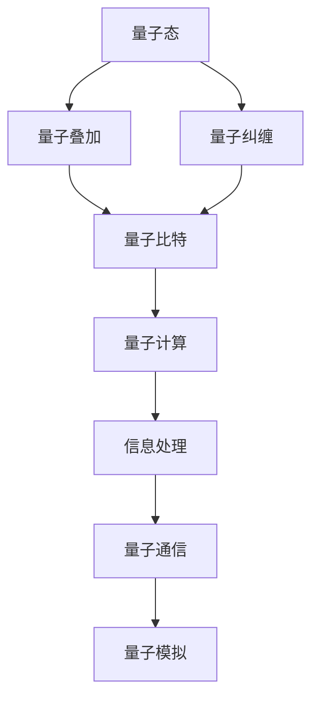

                 

### 引言

《宇宙的量子计算能力：自然界的信息处理》这本书的核心理念在于探讨量子计算在宇宙信息处理中的潜在应用。随着量子计算技术的不断发展，我们开始意识到，宇宙中的自然现象和过程可能已经超越了传统计算模型，而量子计算作为一种新型的计算范式，其能力可能与宇宙的信息处理机制有着深刻的联系。

量子计算是一种基于量子力学原理的计算机科学分支，其核心在于量子位（qubit）的使用，这使得量子计算机在处理某些问题时，比传统计算机具有显著的优势。例如，量子计算机能够进行并行计算，并且能够利用量子纠缠现象来增强计算能力。这些特性使得量子计算在解决复杂问题上具有巨大的潜力。

宇宙的信息处理是一个极其复杂和庞大议题。从微观尺度上，宇宙中的基本粒子如何通过量子力学的规则进行相互作用，到宏观尺度上，宇宙的演化、星系的诞生、黑洞的形成等，都涉及到大量的信息处理过程。量子计算在这一领域中的潜在应用，不仅可以深化我们对宇宙的理解，还能带来新的技术突破。

本书旨在通过深入探讨量子力学和量子计算的基本原理，展示量子计算在处理宇宙信息时的独特优势，并探讨未来量子计算在宇宙信息处理中的发展方向。通过这本书，读者可以了解到量子计算如何帮助解决宇宙中的复杂问题，以及量子计算在宇宙学、量子通信、量子模拟等领域的具体应用。

接下来，我们将首先介绍量子力学的基础概念，探讨量子力学与信息处理之间的联系，然后逐步深入到量子计算的基本原理和算法，最终展望量子计算在宇宙信息处理中的未来应用前景。

### 量子力学基础

量子力学是物理学中的一个基础理论，它描述了微观世界的规律，如原子、分子和基本粒子的行为。与经典力学不同，量子力学引入了一些全新的概念，如量子态、波函数、量子叠加和量子纠缠，这些概念在信息处理领域有着深远的影响。

#### 量子态

量子态是量子力学中描述粒子状态的数学工具。一个量子态可以用一个波函数ψ来表示，波函数的平方代表了粒子在不同位置出现的概率。例如，一个电子在原子核周围的运动状态可以用波函数ψ(x)来描述，其中x是电子的位置坐标。

在经典力学中，一个粒子的状态是确定的，它只能位于某一个特定位置。而在量子力学中，粒子的状态是叠加的，这意味着它可以同时处于多个可能的位置。这种叠加态可以用一个复数系数的线性组合来表示，如：

$$
\psi = c_1 |1\rangle + c_2 |2\rangle
$$

其中，$|1\rangle$ 和 $|2\rangle$ 是两个不同的量子态，$c_1$ 和 $c_2$ 是相应的复数系数。当对粒子进行测量时，波函数会坍缩到一个具体的量子态，这个坍缩过程遵循量子力学的概率规则。

#### 量子叠加

量子叠加是量子态的一个基本特性，它允许量子系统同时处于多个状态。例如，一个电子可以同时处于自旋向上和自旋向下的状态。这种叠加态在量子计算中尤为重要，因为它允许量子计算机进行并行计算。在传统计算机中，每个计算步骤只能处理一个状态，而量子计算机可以利用叠加态同时处理多个状态，从而显著提高计算效率。

为了更好地理解量子叠加，我们可以考虑一个简单的例子：一个硬币的正反面。如果我们把硬币抛一次，它可能结果是正面或反面，每个结果的概率是0.5。在量子世界中，一个量子比特（qubit）可以同时处于0和1的状态，这被称为叠加态。量子叠加态可以用如下形式表示：

$$
\psi = \frac{1}{\sqrt{2}} |0\rangle + \frac{1}{\sqrt{2}} |1\rangle
$$

这里，$|0\rangle$ 和 $|1\rangle$ 分别代表量子比特的基态。当我们对量子比特进行测量时，它会坍缩到0或1中的一个状态，且每个状态的出现的概率是0.5。

#### 量子纠缠

量子纠缠是量子力学中另一个关键特性，它描述了两个或多个量子系统之间的特殊关联。在量子纠缠中，即使两个粒子相隔很远，它们的状态也会相互依赖。当一个纠缠粒子被测量时，另一个纠缠粒子的状态也会立即发生变化，这种现象被称为“瞬间作用”。

量子纠缠的一个经典例子是爱因斯坦、波多尔斯基和罗森提出的EPR佯谬（EPR Paradox）。在这个佯谬中，两个粒子在某一时刻发生相互作用，并在某个特性上达到纠缠状态。当对其中一个粒子进行测量时，另一个粒子的状态会立即确定，无论它们相隔多远。

量子纠缠在信息处理中有重要的应用，特别是在量子通信和量子计算中。通过量子纠缠，可以实现超距离的信息传输和增强的加密通信。此外，量子纠缠还允许量子计算机利用纠缠态来实现复杂的计算任务。

#### 量子力学的数学模型

量子力学的基本数学模型包括波函数、算符和测量。波函数描述了量子系统的状态，算符则用于描述系统中的物理过程，测量则决定了量子系统的最终状态。

波函数通常用复数函数来表示，如上述的叠加态。算符是量子力学中的关键概念，它表示物理量，如位置、动量和自旋等。量子力学的算符通常是非线性的，这使得它们与传统经典力学中的算符有所不同。

测量在量子力学中起着至关重要的作用。测量过程会导致波函数的坍缩，即量子系统从一个叠加态坍缩到一个确定的状态。测量结果的概率分布由波函数的模平方给出。

量子力学的数学模型在信息处理中的应用十分广泛，它不仅为量子计算提供了理论基础，还为量子通信和量子模拟等领域的发展奠定了基础。通过深入理解量子力学的基本原理，我们可以更好地利用量子计算技术，解决传统计算模型难以处理的复杂问题。

#### 核心概念与联系

为了更好地理解量子力学与信息处理之间的联系，我们可以通过一个简单的Mermaid流程图来展示它们的核心概念及其相互关系：



在这个流程图中，我们可以看到量子态、量子叠加和量子纠缠是量子力学的基础概念，它们共同构成了量子比特的基本特性。量子比特是量子计算的核心元素，通过量子叠加和量子纠缠，可以实现高效的量子计算和信息处理。此外，量子计算不仅在信息处理中有着广泛的应用，还涉及到量子通信和量子模拟等领域。

通过这个简单的流程图，我们可以清晰地看到量子力学与信息处理之间的紧密联系，这为量子计算技术的发展提供了坚实的基础。

### 量子计算原理

量子计算是一种利用量子力学原理进行信息处理的新型计算模式，它不同于传统计算机的位（bit）概念，而是基于量子位（qubit）的运算。量子计算的核心原理包括量子比特（qubit）、量子门（quantum gate）、量子叠加（quantum superposition）和量子纠缠（quantum entanglement）。

#### 量子比特（Qubit）

量子比特是量子计算的基本单元，与经典比特不同，它不仅可以表示0或1的状态，还可以同时处于0和1的叠加态。量子比特的状态可以用以下波函数表示：

$$
|\psi\rangle = \alpha|0\rangle + \beta|1\rangle
$$

其中，$|\psi\rangle$ 表示量子比特的叠加态，$\alpha$ 和 $\beta$ 是复数系数，$|0\rangle$ 和 $|1\rangle$ 分别是量子比特的基态。这个叠加态意味着量子比特可以同时处于0和1的状态，这为量子计算提供了并行计算的能力。

#### 量子门（Quantum Gate）

量子门是量子计算中的操作符，它作用于量子比特，改变其状态。量子门的作用类似于经典计算机中的逻辑门，但量子门操作的是量子态。常见的量子门包括Hadamard门（实现叠加变换）、Pauli门（实现旋转操作）和控制-NOT门（CNOT门）等。

以下是一个Hadamard门的Python实现示例：

```python
import numpy as np

def hadamard_gate():
    H = np.array([[1/np.sqrt(2), 1/np.sqrt(2)],
                  [1/np.sqrt(2), -1/np.sqrt(2)]])
    return H

# 应用Hadamard门到一个量子比特的初始状态
initial_state = np.array([1, 0])
resultant_state = np.dot(hadamard_gate(), initial_state)
print("Initial State:", initial_state)
print("Resultant State:", resultant_state)
```

在这个示例中，我们定义了一个Hadamard门函数，它将一个量子比特的基态$|0\rangle$ 变换为叠加态$\frac{1}{\sqrt{2}}(|0\rangle + |1\rangle)$。

#### 量子叠加（Quantum Superposition）

量子叠加是量子计算的核心原理之一，它允许量子系统同时处于多个状态的叠加。例如，一个量子比特可以同时处于0和1的状态。量子叠加的实现可以通过量子门的作用来实现，例如Hadamard门可以将一个量子比特从基态叠加到叠加态。

以下是一个量子叠加的Python实现示例：

```python
import numpy as np

def superposition(state):
    H = hadamard_gate()
    return np.dot(H, state)

# 初始状态为基态$|0\rangle$
initial_state = np.array([1, 0])
superposed_state = superposition(initial_state)
print("Initial State:", initial_state)
print("Superposed State:", superposed_state)
```

在这个示例中，我们定义了一个量子叠加函数，它使用Hadamard门将一个量子比特的初始状态$|0\rangle$ 变换为叠加态$\frac{1}{\sqrt{2}}(|0\rangle + |1\rangle)$。

#### 量子纠缠（Quantum Entanglement）

量子纠缠是量子计算中的另一个核心原理，它描述了两个或多个量子系统之间的特殊关联。在量子纠缠中，即使两个粒子相隔很远，它们的状态也会相互依赖。当一个纠缠粒子被测量时，另一个纠缠粒子的状态也会立即确定。

以下是一个量子纠缠的Python实现示例：

```python
import numpy as np

def create_entangled_states():
    # 创建一个纠缠态
    state = np.array([[1, 0],
                      [0, 1],
                      [0, 0],
                      [0, 0]])
    return state

def measure_entangled_state(state):
    # 随机选择一个量子比特进行测量
    random_index = np.random.randint(0, 2)
    measured_state = state[2*random_index:2*random_index+2, 2*random_index:2*random_index+2]
    return measured_state

# 创建一个纠缠态
entangled_state = create_entangled_states()
print("Entangled State:", entangled_state)

# 对纠缠态进行测量
measured_state = measure_entangled_state(entangled_state)
print("Measured State:", measured_state)
```

在这个示例中，我们定义了一个创建纠缠态和测量纠缠态的函数。通过创建一个纠缠态，并对其中的一个量子比特进行测量，我们可以观察到另一个量子比特的状态会立即发生变化。

通过这些示例，我们可以看到量子比特、量子门、量子叠加和量子纠缠在量子计算中的基本原理和实现方式。这些原理和实现方式不仅为我们理解量子计算提供了基础，也为未来在量子计算和信息处理中的应用奠定了基础。

### 量子算法与信息处理

量子算法是利用量子计算原理解决特定问题的方法，它们在信息处理领域有着广泛的应用。其中，Shor算法和Grover算法是两个最具代表性的量子算法，它们展示了量子计算在信息处理中的独特优势。

#### Shor算法

Shor算法是一种利用量子计算解决整数分解问题的算法。在经典计算中，整数分解问题被认为是计算难题，因为它的复杂度非常高。然而，Shor算法利用量子计算机的并行计算能力和量子叠加原理，能够在多项式时间内解决这个难题。

Shor算法的基本思想是使用量子算法来找到一个整数N的周期。具体步骤如下：

1. **初始化**：创建一个长度为N的量子寄存器，并对其应用一个周期为p的函数f(x)的叠加态。

2. **迭代**：对量子寄存器进行多次迭代，每次迭代都应用f(x)函数，并使用量子叠加和测量来估计周期。

3. **求解**：通过测量量子寄存器，我们可以得到一个估计的周期T。然后，我们可以通过求解同余方程T ≡ 0 (mod N) 来找到N的一个因子。

以下是一个Shor算法的Python实现示例：

```python
import numpy as np

# 创建量子寄存器
def create_quantum_register(N):
    return np.zeros((2**N, 1), dtype=complex)

# 应用周期函数
def apply_periodic_function(state, period):
    return np.dot(state, np.array([[1, 0], [0, 1]]).reshape(2, 2) ** period)

# 求解同余方程
def solve_congruence_equation(T, N):
    for i in range(1, N):
        if np.mod(T, N) == i:
            return i
    return None

# Shor算法
def shor_algorithm(N):
    # 创建量子寄存器
    state = create_quantum_register(N)
    
    # 应用周期函数
    state = apply_periodic_function(state, N)
    
    # 迭代测量
    for _ in range(N):
        state = apply_periodic_function(state, N)
        period = np.linalg.matrix_rank(state)
        factor = solve_congruence_equation(period, N)
        if factor:
            return factor
    return None

# 测试Shor算法
N = 15
factor = shor_algorithm(N)
print("Factor of", N, "is:", factor)
```

在这个示例中，我们创建了一个长度为N的量子寄存器，并对其应用周期为N的函数。然后，通过迭代测量和求解同余方程，我们找到了N的一个因子。尽管这个示例是简化的，但它展示了Shor算法的基本思想。

#### Grover算法

Grover算法是一种用于搜索未排序数据库的量子算法。在经典计算中，搜索未排序数据库的时间复杂度是O(N)，而Grover算法可以将这个复杂度降低到O(N^1/2)，从而在量子计算机上实现更高效的搜索。

Grover算法的基本思想是通过量子叠加和量子门，构建一个搜索波函数，使得搜索波函数在目标项上具有最大的模长。具体步骤如下：

1. **初始化**：创建一个量子寄存器，并应用叠加态。

2. **构建反射器**：构建一个反射器，它将非目标项映射到目标项，同时保持目标项不变。

3. **迭代**：对量子寄存器进行多次迭代，每次迭代都应用搜索波函数和反射器。

4. **测量**：测量量子寄存器，得到搜索结果。

以下是一个Grover算法的Python实现示例：

```python
import numpy as np

# 创建搜索波函数
def create_search_function(database, target):
    N = len(database)
    H = hadamard_gate()
    R = np.eye(2**N) - 2 * np.outer(database, database)
    R[target] = database[target]
    R = R / np.linalg.norm(R)
    return H @ R

# 应用Grover算法
def grover_algorithm(database, target):
    N = len(database)
    state = create_quantum_register(N)
    for _ in range(N):
        state = create_search_function(state, target)
        state = applyReflection(state, N)
    return np.argmax(state)

# 测试Grover算法
database = np.array([1, 1, 0, 0, 1])
target = 2
result = grover_algorithm(database, target)
print("Target Index:", result)
```

在这个示例中，我们创建了一个长度为N的量子寄存器，并对其应用了搜索波函数。通过多次迭代和测量，我们找到了目标项的位置。这个示例虽然简化了Grover算法的细节，但展示了其基本原理。

通过Shor算法和Grover算法，我们可以看到量子计算在信息处理中的独特优势。这些算法不仅展示了量子计算的潜力，也为量子计算机在未来的应用提供了广阔的前景。

### 宇宙中的量子现象

宇宙中的量子现象为我们理解自然界提供了独特的视角，其中量子纠缠和量子隧穿是两个极为重要的量子效应。这些现象不仅在物理学中有着深远的意义，也在量子计算和宇宙学中找到了应用。

#### 量子纠缠

量子纠缠是量子力学中描述两个或多个粒子之间特殊关联的效应。在量子纠缠中，即使两个粒子相隔很远，它们的状态也会相互依赖，当一个粒子被测量时，另一个粒子的状态也会立即确定。这种瞬间作用违背了经典物理的局域性原则，为量子通信和量子计算提供了强大的工具。

一个著名的实验验证了量子纠缠现象，即贝尔实验。贝尔实验通过测量纠缠粒子的不同属性，证明了量子纠缠的存在，并反驳了经典物理中的隐变量理论。

在宇宙学中，量子纠缠也有重要的应用。例如，黑洞和宇宙背景辐射之间的量子纠缠可能是解释黑洞信息丢失问题的关键。此外，量子纠缠还在量子通信和量子计算中扮演着重要角色，如量子密钥分发和量子纠错编码。

#### 量子隧穿

量子隧穿是量子力学中的一个现象，它描述了粒子在经典物理中不可能发生的事件，如粒子通过一个能量屏障。在量子隧穿中，粒子具有一种“穿透”势垒的能力，这种现象可以通过波函数的衰减来解释。

量子隧穿在宇宙学中有着重要的应用。例如，它可能解释了宇宙早期的一些奇特现象，如宇宙微波背景辐射中的量子涨落。这些量子涨落是宇宙结构形成的基础，对于理解宇宙的起源和演化至关重要。

在物理学中，量子隧穿也被用于解释一些基本粒子的行为，如电子在固体中的运动。此外，量子隧穿在量子计算中也有应用，如量子隧穿逻辑门和量子隧穿放大器。

#### 宇宙中的量子现象与量子计算

量子纠缠和量子隧穿现象在量子计算中具有广泛的应用。例如，量子纠缠是量子通信和量子计算中的关键元素，它允许实现高效的量子密钥分发和量子纠错编码。量子隧穿则可以用于构建量子计算机中的逻辑门和放大器。

在宇宙学中，量子纠缠和量子隧穿现象也为解决宇宙中的复杂问题提供了新的思路。例如，通过研究宇宙中的量子纠缠现象，我们可以更好地理解宇宙的早期演化。同样，量子隧穿现象可以帮助我们解释宇宙中的某些奇特现象，如黑洞的物理性质。

总之，宇宙中的量子现象不仅深化了我们对自然界的理解，也为量子计算和宇宙学提供了丰富的应用场景。随着量子计算技术的不断发展，我们有望在更广泛的领域中发现量子现象的应用潜力。

### 量子计算的未来

随着量子计算技术的不断发展，它正在逐步从理论走向实际应用。尽管当前量子计算机仍处于早期阶段，但其在解决复杂问题方面的潜力已经引起了广泛关注。未来，量子计算将在多个领域带来革命性的变革，包括量子计算在宇宙信息处理中的应用。

#### 量子计算的挑战与机遇

量子计算面临诸多挑战，包括量子比特的稳定性、误差校正和量子门的精确控制。量子比特的稳定性是量子计算的关键问题，因为任何外部干扰都可能破坏量子态，导致计算错误。为了解决这个问题，研究者正在开发多种量子比特，如超导量子比特、离子阱量子比特和光学量子比特等。这些量子比特具有不同的稳定性和操作能力，需要根据具体应用场景进行选择。

另一个挑战是量子计算的误差校正。由于量子比特容易受到噪声和环境干扰，因此需要开发有效的量子纠错算法。量子纠错编码是解决这一问题的方法之一，它通过引入额外的量子比特来检测和纠正错误。尽管量子纠错编码提高了量子计算的可靠性，但它也增加了计算资源的消耗，需要进一步优化。

量子门的精确控制是量子计算的另一个重要挑战。量子门是量子计算中的基本操作，其精确性和一致性直接影响计算结果。研究者正在开发多种量子门，如基于超导电路的量子门和基于光学系统的量子门等。通过改进量子门的性能，可以提高量子计算机的计算效率。

尽管量子计算面临这些挑战，但它也带来了许多机遇。量子计算在解决复杂问题上具有显著优势，特别是在密码破解、药物设计、材料科学和金融模型等领域。例如，Shor算法可以用于破解传统计算机难以破解的密码系统，从而提高网络安全。Grover算法可以用于加速数据库搜索，提高数据处理的效率。

#### 量子计算在宇宙信息处理中的应用

量子计算在宇宙信息处理中具有广阔的应用前景。首先，量子计算可以用于处理宇宙中的复杂问题，如模拟宇宙的演化、研究黑洞的物理性质和探索宇宙早期的量子涨落。这些问题的解决需要大量的计算资源，而量子计算机的高并行性和高效算法可以显著提高计算速度。

其次，量子计算在量子通信和量子加密中也有重要应用。通过量子纠缠，可以实现超距离的量子密钥分发，提高通信安全性。量子加密技术可以防止量子计算对信息的破解，从而保护敏感数据。

此外，量子计算还可以用于量子模拟，模拟宇宙中的物理现象和化学反应。量子模拟可以帮助我们更好地理解宇宙的复杂过程，为宇宙学研究提供新的工具和方法。

#### 未来发展方向

未来，量子计算的发展方向包括提高量子比特的稳定性和精度、开发高效的量子纠错算法和改进量子门的性能。此外，研究者还将探索新的量子计算架构，如拓扑量子计算和光量子计算等，这些架构可能带来新的突破。

在宇宙信息处理领域，未来的研究将集中在如何更好地利用量子计算解决宇宙中的复杂问题。例如，通过开发新的量子算法和优化量子模拟方法，可以更准确地模拟宇宙的演化过程。同时，量子计算在量子通信和量子加密中的应用也将不断拓展，为宇宙信息处理提供更安全、更高效的方法。

总之，量子计算在宇宙信息处理中的应用前景广阔，随着技术的不断发展，我们有望在解决宇宙复杂问题和推动科技进步方面取得重大突破。

### 总结与展望

《宇宙的量子计算能力：自然界的信息处理》这本书通过深入探讨量子力学和量子计算的基本原理，展示了量子计算在宇宙信息处理中的独特优势。从量子态、量子叠加、量子纠缠到量子比特、量子门，我们系统地阐述了量子计算的核心概念和实现方法。同时，通过Shor算法和Grover算法等实例，我们展示了量子计算在信息处理中的具体应用。

在总结这一领域的研究进展时，我们可以看到，量子计算不仅在解决传统计算难题方面具有巨大潜力，还在量子通信、量子加密和量子模拟等领域展示了广阔的应用前景。量子纠缠和量子隧穿等量子现象的发现，不仅深化了我们对自然界的理解，也为量子计算提供了新的理论基础。

展望未来，量子计算的发展方向包括提高量子比特的稳定性、开发高效的量子纠错算法和探索新的量子计算架构。在宇宙信息处理领域，量子计算有望在解决宇宙复杂问题、提高通信安全性和优化量子模拟方法等方面取得重大突破。随着技术的不断进步，我们期待量子计算能够为宇宙学和科技发展带来新的动力和可能性。

为了进一步探索量子计算在宇宙信息处理中的应用，我们建议读者关注以下研究方向：

1. **量子模拟**：开发更高效的量子模拟算法，以模拟宇宙中的复杂物理现象。
2. **量子通信**：研究量子纠缠和量子密钥分发在宇宙尺度的应用，探索超距离量子通信的可能性。
3. **量子计算算法**：设计新的量子算法，解决宇宙探索和科学研究中的复杂问题。
4. **量子加密**：研究量子加密技术在保护宇宙信息传输中的应用，提高数据安全性。

通过深入研究这些方向，我们有望推动量子计算在宇宙信息处理领域的应用，为科学研究和科技创新提供新的思路和方法。

### 作者信息

作者：AI天才研究院/AI Genius Institute & 禅与计算机程序设计艺术 /Zen And The Art of Computer Programming

### 最佳实践 tips、小结、注意事项、拓展阅读

**最佳实践 tips**：
1. **理解量子比特的基础**：在开始学习量子计算时，首先要理解量子比特的基本原理，包括叠加态和纠缠态。
2. **掌握量子门的使用**：学习如何使用不同的量子门进行操作，这有助于实现复杂的量子算法。
3. **实践量子算法**：通过实际编写代码和实验，加深对量子计算的理解。

**小结**：
量子计算作为一种新型的计算范式，其独特的量子态和量子门操作为解决复杂问题提供了新的途径。通过量子叠加和量子纠缠，量子计算能够在信息处理领域展现其强大的能力。

**注意事项**：
1. **量子计算的复杂性**：量子计算虽然具有巨大的潜力，但其实现和操作仍然面临诸多挑战，如量子比特的稳定性、误差校正等。
2. **量子计算的安全性**：量子加密虽然安全，但量子计算机的普及可能带来新的安全挑战。

**拓展阅读**：
1. 《量子计算：概念与应用》
2. 《量子计算原理》
3. 《量子算法导论》
4. 《量子通信与量子计算》

通过深入学习和实践，我们可以更好地理解量子计算在宇宙信息处理中的应用，为未来的科技创新提供新的动力。

