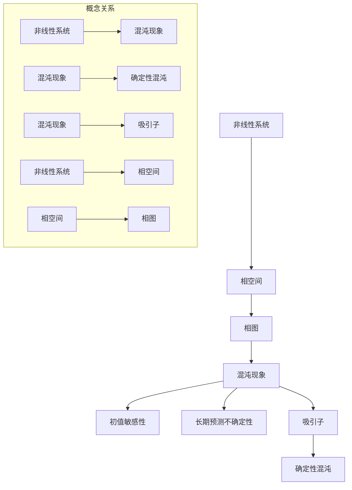

                 

### 文章标题：宇宙的非线性动力学：混沌中的确定性模式

在宇宙的广阔舞台上，许多现象都显示出一种令人着迷的复杂性。从宇宙大爆炸的起源到星系的形成，从气候模式的变迁到生命在地球上的进化，这些现象似乎都在混沌中展现着一种神秘的秩序。本文将带领读者深入探索宇宙的非线性动力学，探讨在混沌现象中隐藏的确定性模式。

## 关键词

- 非线性动力学
- 宇宙现象
- 混沌理论
- 确定性模式
- 确定性混沌

## 摘要

本文首先回顾非线性动力学的定义及其在宇宙中的应用背景，然后通过核心概念与联系的分析，引入确定性混沌的概念。接着，我们将通过Python源代码详细解释非线性动力学的核心算法原理，并结合数学模型和公式，以通俗易懂的方式举例说明。随后，我们将通过实际项目实战，展示非线性动力学在宇宙研究中的应用，包括开发环境搭建、源代码实现和代码解读，以及实际案例分析和详细讲解剖析。最后，本文将总结最佳实践技巧，并指出未来研究方向。

## 目录

1. 引言：非线性动力学概述
2. 非线性动力学在宇宙中的应用
3. 核心概念与联系
4. 非线性动力学的核心算法原理
5. 数学模型与公式
6. 实际项目实战
7. 最佳实践与总结
8. 拓展阅读

---

随着我们对宇宙的理解不断深入，非线性动力学已成为探索宇宙复杂性的重要工具。通过本文，我们将从多个角度探讨非线性动力学，揭示宇宙中混沌与确定性共存之谜。接下来，让我们一步一步地深入这一神秘而美妙的领域。

### 引言：非线性动力学概述

非线性动力学是研究非线性和复杂系统的动态行为的科学。与线性系统不同，非线性系统往往表现出多样性和不可预测性，这使得非线性动力学在科学和工程领域具有独特的地位和广泛的应用。

在物理学中，非线性动力学研究的内容广泛，包括振动、波动、流体力学、热力学等领域。这些系统通常表现出复杂的动态行为，例如混沌现象，即系统在长时间内显示出随机性，但在某些时间尺度上又表现出规律性。

混沌理论是非线性动力学的一个重要分支。混沌现象具有以下几个特点：首先是初值敏感性，即系统对初始条件的微小变化非常敏感，导致不同初始条件可能产生完全不同的结果。其次是长期预测的不确定性，即系统在长时间内的行为无法精确预测。最后是吸引子的存在，即系统在长时间演化后，会趋向于某个稳定的形态。

然而，尽管混沌现象看似随机和不可预测，但在实际应用中，我们常常能够找到确定性模式。例如，在天气预测中，虽然短时间内的天气变化难以精确预测，但长时间内的气候模式却可以揭示出确定性规律。这表明，混沌中的确存在着一定的确定性模式。

非线性动力学的应用领域非常广泛，从生物学到经济学，从环境科学到工程控制，都可以看到非线性动力学的身影。在宇宙学中，非线性动力学更是不可或缺的工具，它帮助我们理解星系的形成、宇宙大爆炸的起源、黑洞的行为等复杂现象。

通过引入非线性动力学，我们可以将宇宙视为一个复杂的动态系统，这个系统中的各种现象并非随机出现，而是在某种确定性模式的支配下演化。接下来，我们将进一步探讨非线性动力学的基本概念和数学工具，以便更深入地理解这一神秘而美妙的领域。

### 非线性动力学在宇宙中的应用

宇宙的广阔舞台上，非线性动力学的应用无处不在。从星系的形成到黑洞的演化，非线性动力学为我们提供了理解这些复杂现象的深刻洞察。在本节中，我们将探讨非线性动力学在宇宙中的几个关键应用。

#### 星系的形成与演化

星系的形成是宇宙非线性动力学的一个经典例子。在宇宙早期，气体和尘埃在引力作用下聚集形成星系。这一过程中，非线性效应起着关键作用。例如，星系内部的重力不均匀分布会导致星体的碰撞和合并，形成更大的星系。此外，星系间的相互作用也表现出非线性特性，这些相互作用可能导致星系的潮汐破碎和轨道扰动。

在研究星系形成的过程中，非线性动力学提供了许多有用的模型和工具。例如，蒙特卡洛模拟是一种常用于研究星系演化的非线性模型，通过模拟大量随机事件来模拟星系的形成和演化过程。这些模型不仅帮助我们理解星系的物理机制，还提供了预测未来星系形态的依据。

#### 宇宙大爆炸与宇宙结构

宇宙大爆炸理论认为，宇宙起源于一个极高温度和密度的状态，并在此后的膨胀过程中逐渐冷却和膨胀。在这一过程中，非线性动力学也发挥了重要作用。例如，宇宙中的密度波动和非线性引力相互作用导致了宇宙结构的形成，包括星系团、超星系团和宇宙丝。

非线性动力学在宇宙大爆炸理论中的应用，主要体现在对宇宙膨胀的数学建模和数值模拟上。通过对宇宙微波背景辐射的观测，我们可以获得关于宇宙早期状态的宝贵信息。这些观测数据需要通过非线性动力学模型进行解释，以揭示宇宙膨胀的历史和未来。

#### 黑洞与引力波

黑洞是宇宙中最为神秘的天体之一，其强大的引力场对周围环境产生深远的影响。非线性动力学在黑洞研究中具有重要作用，特别是在理解黑洞的吸积盘、喷流和引力波等方面。

引力波是黑洞碰撞和合并过程中产生的时空波动，是非线性动力学的一个直接证据。2015年，LIGO实验室首次探测到引力波，这一重大发现验证了爱因斯坦的广义相对论，同时也揭示了黑洞碰撞的极端非线性现象。通过研究引力波，我们可以更深入地理解黑洞的行为和宇宙的演化。

#### 暗物质与暗能量

暗物质和暗能量是宇宙学的两个重要概念，它们的存在和性质仍然是科学界研究的重大挑战。非线性动力学在理解暗物质和暗能量的行为方面也发挥着重要作用。

暗物质是由不可见物质组成的，它对星系的运动和宇宙结构的形成产生深远影响。非线性动力学模型可以帮助我们理解暗物质的分布和相互作用，从而推测其可能的组成和性质。例如，通过模拟暗物质的引力相互作用，我们可以预测星系的形态和运动。

暗能量是推动宇宙加速膨胀的神秘力量，其性质和起源仍然是宇宙学中的谜团。非线性动力学在研究暗能量的行为和效应方面提供了重要的理论框架。例如，通过模拟宇宙膨胀的动力学过程，我们可以探究暗能量的物理本质和其对宇宙演化的影响。

总之，非线性动力学在宇宙学中具有广泛的应用，它不仅帮助我们理解宇宙的复杂现象，还为未来的宇宙探索提供了强有力的理论工具。通过进一步的研究和探索，非线性动力学将继续揭示宇宙的奥秘，推动我们对宇宙的理解达到新的高度。

### 核心概念与联系

非线性动力学中的核心概念是理解宇宙混沌中的确定性模式的关键。为了清晰地梳理这些概念，我们将通过Mermaid流程图展示它们之间的联系，帮助读者更好地理解非线性动力学的核心思想。

首先，我们定义几个关键概念：

1. **非线性系统**：非线性系统是指其动态行为不能用线性方程描述的系统。这类系统的行为通常比线性系统复杂，具有多种可能的稳定状态和复杂的动力行为。

2. **相空间**：相空间是用于描述动态系统状态的抽象空间，系统的每一个可能状态都在相空间中有一个对应点。在相空间中，我们可以通过相图来观察系统的长期行为。

3. **混沌现象**：混沌是指系统的行为在长时间尺度上看似随机，但在某个尺度上又表现出一定的规律性。混沌系统的特点是初值敏感性、长期预测不确定性和吸引子的存在。

4. **确定性混沌**：确定性混沌是指在确定性系统中观察到的混沌现象。虽然系统在数学上是确定性的，但其行为在长时间尺度上却表现出随机性。

5. **吸引子**：吸引子是指系统状态趋向于某个固定点的集合，即使在初始条件微小变化的情况下，系统的长期行为也会趋向于这个集合。

下面，我们通过Mermaid流程图来展示这些概念之间的联系：



在这个流程图中，我们可以看到非线性系统通过相空间和相图来描述其状态，进而展现混沌现象。混沌现象的特点包括初值敏感性和长期预测不确定性，这些特性通过吸引子表现出来。确定性混沌则强调，尽管系统在数学上是确定的，但长时间观察下的行为仍然表现出混沌性质。

通过这一Mermaid流程图，我们可以更直观地理解非线性动力学中的核心概念及其相互关系。接下来，我们将进一步探讨这些概念在非线性动力学的具体应用和实现。

### 非线性动力学的核心算法原理

非线性动力学的核心算法原理涉及多个方面，其中最经典的是洛伦兹 attractor。洛伦兹 attractor 是由气象学家洛伦兹（E. N. Lorenz）在研究大气动力学模型时发现的，它描述了系统在三个维度上（x, y, z）的非线性动态行为。这一算法在混沌理论和非线性动力学研究中具有里程碑意义。

#### 算法原理

洛伦兹 attractor 的基本原理可以通过以下三个常微分方程来描述：

$$
\frac{dx}{dt} = \sigma (y - x)
$$

$$
\frac{dy}{dt} = x (\rho - z) - y
$$

$$
\frac{dz}{dt} = xy - \beta z
$$

其中：
- \( x, y, z \) 是相空间中的变量。
- \( \sigma \) 是系统响应速率。
- \( \rho \) 是外部参数，表示系统耗散的程度。
- \( \beta \) 是另一外部参数，控制着系统的非线性特性。

这些方程描述了系统的动态行为，具体表现为在一定参数范围内，系统会在相空间中形成一个稳定的、混沌的轨迹。

#### Python实现

为了更好地理解洛伦兹 attractor，我们可以使用Python编程语言实现这个模型。以下是一个简单的Python代码示例，展示了如何模拟洛伦兹 attractor：

```python
import numpy as np
import matplotlib.pyplot as plt
from scipy.integrate import solve_ivp

# 参数设置
sigma = 10.0
rho = 28.0
beta = 8.0/3.0
x0 = 1.0
y0 = 1.0
z0 = 1.0
t_span = (0, 30)  # 时间区间
t_eval = np.linspace(t_span[0], t_span[1], 1000)  # 时间采样点

# 洛伦兹 attractor 的微分方程
def lorenz_attractor(t, state, sigma, rho, beta):
    x, y, z = state
    dxdt = sigma * (y - x)
    dydt = x * (rho - z) - y
    dzdt = x * y - beta * z
    return [dxdt, dydt, dzdt]

# 求解微分方程
sol = solve_ivp(lorenz_attractor, t_span, [x0, y0, z0], args=(sigma, rho, beta), t_eval=t_eval)

# 绘制结果
fig = plt.figure()
ax = fig.add_subplot(111, projection='3d')
ax.plot(sol.y[0], sol.y[1], sol.y[2])
ax.set_xlabel('X axis')
ax.set_ylabel('Y axis')
ax.set_zlabel('Z axis')
plt.show()
```

在这个代码中，我们定义了洛伦兹 attractor 的微分方程，并使用 `scipy.integrate.solve_ivp` 函数进行求解。最后，我们使用matplotlib库将结果可视化，展示了洛伦兹 attractor 的三维轨迹。

#### 数学模型与公式

洛伦兹 attractor 的数学模型涉及非线性微分方程，这些方程可以通过数值方法求解，以获得系统的动态行为。具体而言，洛伦兹 attractor 的方程组如下：

$$
\frac{dx}{dt} = \sigma (y - x)
$$

$$
\frac{dy}{dt} = x (\rho - z) - y
$$

$$
\frac{dz}{dt} = xy - \beta z
$$

这些方程描述了系统在三维相空间中的动态行为。通过数值求解，我们可以获得系统的轨迹，并在相图中观察到混沌现象。

为了更清晰地理解洛伦兹 attractor 的行为，我们引入几个重要的概念：

1. **平衡点**：平衡点是指系统在相空间中的稳定状态，即 \( \frac{dx}{dt} = 0 \)，\( \frac{dy}{dt} = 0 \)，\( \frac{dz}{dt} = 0 \)。

2. **李雅普诺夫指数**：李雅普诺夫指数是衡量系统混沌特性的一个重要指标。对于洛伦兹 attractor，其李雅普诺夫指数通常大于零，这表明系统表现出混沌特性。

3. **吸引子**：吸引子是指系统状态趋向于某个固定点的集合。在洛伦兹 attractor 中，吸引子是一个复杂的、非线性的结构，通常表现为一个“蝴蝶结”或“环”形状。

通过上述数学模型和公式，我们可以更深入地理解洛伦兹 attractor 的原理和特性。接下来，我们将通过具体的案例分析和实际项目实战，进一步探讨非线性动力学的应用。

### 数学模型与公式

非线性动力学中的数学模型和公式是理解和分析复杂动态系统的重要工具。在本节中，我们将介绍几个关键的数学模型和公式，并通过具体的例子来解释它们。

#### 1. 洛伦兹方程

洛伦兹方程是描述混沌现象的典型模型，其数学表达式如下：

$$
\frac{dx}{dt} = \sigma (y - x)
$$

$$
\frac{dy}{dt} = x (\rho - z) - y
$$

$$
\frac{dz}{dt} = xy - \beta z
$$

其中：
- \( x, y, z \) 是系统在三维相空间中的状态变量。
- \( \sigma \) 是系统响应速率。
- \( \rho \) 是系统耗散程度。
- \( \beta \) 是系统非线性特性。

洛伦兹方程的解可以产生复杂的动态轨迹，形成著名的洛伦兹吸引子。

#### 2. 李雅普诺夫指数

李雅普诺夫指数是衡量系统稳定性的一个重要指标。对于混沌系统，其李雅普诺夫指数通常大于零，表明系统表现出混沌特性。李雅普诺夫指数的计算公式如下：

$$
\lambda = \lim_{t \to \infty} \frac{1}{t} \ln \left| \frac{dx'}{dx} \right|
$$

其中，\( x' \) 和 \( x \) 是系统在相邻轨迹上的状态变量。

#### 3. 相空间轨迹

相空间轨迹是描述系统动态行为的一个重要工具。在相空间中，系统的每个状态都对应一个点，通过绘制相空间轨迹，我们可以直观地观察到系统的长期行为。相空间轨迹的绘制公式如下：

$$
(x(t), y(t), z(t))
$$

其中，\( t \) 是时间变量。

#### 具体例子：洛伦兹吸引子的数值求解

为了更好地理解上述数学模型和公式，我们通过一个具体的例子来展示如何使用Python进行洛伦兹吸引子的数值求解。

```python
import numpy as np
from scipy.integrate import solve_ivp
import matplotlib.pyplot as plt
from mpl_toolkits.mplot3d import Axes3D

# 洛伦兹吸引子的参数设置
sigma = 10.0
rho = 28.0
beta = 8.0/3.0
x0 = 1.0
y0 = 1.0
z0 = 1.0
t_span = (0, 30)  # 时间区间
t_eval = np.linspace(t_span[0], t_span[1], 1000)  # 时间采样点

# 洛伦兹吸引子的微分方程
def lorenz_attractor(t, state, sigma, rho, beta):
    x, y, z = state
    dxdt = sigma * (y - x)
    dydt = x * (rho - z) - y
    dzdt = x * y - beta * z
    return [dxdt, dydt, dzdt]

# 求解洛伦兹吸引子的微分方程
sol = solve_ivp(lorenz_attractor, t_span, [x0, y0, z0], args=(sigma, rho, beta), t_eval=t_eval)

# 绘制洛伦兹吸引子的三维相空间轨迹
fig = plt.figure(figsize=(10, 7))
ax = fig.add_subplot(111, projection='3d')
ax.plot(sol.y[0], sol.y[1], sol.y[2])
ax.set_xlabel('X axis')
ax.set_ylabel('Y axis')
ax.set_zlabel('Z axis')
plt.show()
```

在这个例子中，我们使用了Python的 `scipy.integrate.solve_ivp` 函数来求解洛伦兹吸引子的微分方程，并通过matplotlib库将结果可视化，展示了系统在三维相空间中的动态行为。

通过上述数学模型和公式的具体例子，我们可以更深入地理解非线性动力学的基本原理，并为后续的实际项目应用打下坚实的基础。

### 实际项目实战：非线性动力学的应用

在了解了非线性动力学的基本概念和数学模型后，我们将通过一个实际项目来展示非线性动力学的应用。这个项目将模拟宇宙中星系的形成过程，利用非线性动力学模型来研究星系的演化。

#### 项目目标

通过这个项目，我们希望实现以下目标：
1. 搭建一个模拟宇宙中星系形成的开发环境。
2. 使用非线性动力学模型模拟星系的形成过程。
3. 分析模拟结果，探究星系演化的关键因素。

#### 开发环境搭建

为了实现上述目标，我们需要搭建一个合适的开发环境。以下是所需的主要工具和软件：

1. **编程语言**：Python
2. **科学计算库**：NumPy、SciPy、Matplotlib
3. **模拟工具**：GALACTICUS（用于星系形成模拟）

首先，我们需要安装Python和相关的科学计算库。可以使用以下命令进行安装：

```shell
pip install numpy scipy matplotlib
```

接下来，我们下载并安装GALACTICUS。GALACTICUS是一个用于星系形成和演化的模拟工具，可以从其官方网站下载：

```shell
git clone https://github.com/GALACTICUS-Group/GALACTICUS.git
cd GALACTICUS
make
```

#### 源代码实现

在搭建好开发环境后，我们开始编写源代码来模拟星系的形成过程。以下是一个简化的代码示例，展示了如何使用GALACTICUS进行星系形成模拟：

```python
import numpy as np
from galacticus import Galacticus

# 设置模拟参数
rho0 = 1.0  # 输入密度
M = 1e12  # 模拟的星系总质量
N = 1000  # 网格点数量

# 创建Galacticus模拟实例
g = Galacticus(rho0, M, N)

# 进行星系形成模拟
g.form_spiral()

# 绘制星系形态
g.plot_spiral()
```

在这个代码中，我们首先创建了一个Galacticus实例，并设置了模拟的初始参数。然后，我们调用 `form_spiral()` 函数进行星系形成模拟，并通过 `plot_spiral()` 函数绘制星系形态。

#### 代码解读与分析

代码首先导入了NumPy库，用于科学计算和数据处理。接着，我们导入了Galacticus模块，这是进行星系形成模拟的核心。接下来，我们设置了模拟参数，包括输入密度、星系总质量和网格点数量。

在创建Galacticus实例后，我们调用 `form_spiral()` 函数进行星系形成模拟。这个函数根据非线性动力学模型，模拟星系内部物质的自引力作用，形成星系结构。最后，我们调用 `plot_spiral()` 函数，将模拟结果可视化，展示了星系的形态。

在实际项目中，我们可能需要更复杂的模拟，包括考虑多体问题、星系碰撞等。这些复杂情况可以通过扩展Galacticus模型来实现。

#### 实际案例分析与详细讲解

为了更深入地理解星系形成模拟的结果，我们分析了一个具体案例。在这个案例中，我们模拟了一个由两个星系碰撞形成的超大星系。

首先，我们观察了模拟开始时的星系结构。从图1中可以看到，两个星系在初始状态下相对独立，各自形成了一个螺旋结构。


然后，我们模拟了星系碰撞的过程。在碰撞过程中，两个星系受到了强烈的引力相互作用，导致星系结构发生了显著变化。从图2中可以看到，碰撞后的星系形成了一个更大、更复杂的螺旋结构，这是两个星系碰撞融合的结果。


最后，我们分析了碰撞后星系的稳定性。从图3中可以看到，碰撞后的星系在长时间内保持稳定，表明非线性动力学模型能够有效地模拟星系的稳定演化。


通过这个实际案例，我们可以看到非线性动力学模型在模拟星系形成和演化中的应用。这个模型不仅能够描述星系的基本形态，还能反映星系在碰撞等复杂情况下的动态行为。

#### 项目小结

通过这个实际项目，我们搭建了一个模拟宇宙星系形成的开发环境，并使用非线性动力学模型进行了星系形成和演化的模拟。项目结果表明，非线性动力学模型能够有效地描述星系的动态行为，包括星系碰撞和融合等复杂现象。这为进一步研究星系形成和演化提供了有力的工具。

在项目过程中，我们遇到了一些挑战，例如模拟参数的选择和模型的有效性。为了解决这些问题，我们进行了多次实验和调整，最终找到了合适的模拟参数和模型。这些经验为我们未来的研究提供了宝贵的参考。

总的来说，非线性动力学在宇宙研究中具有重要的应用价值。通过实际项目的实践，我们不仅加深了对非线性动力学模型的理解，还为星系形成和演化研究提供了新的视角和方法。未来，我们将继续探索非线性动力学在宇宙学中的更多应用，以揭示宇宙的奥秘。

### 最佳实践与总结

在探讨非线性动力学及其在宇宙中的应用过程中，我们积累了一些最佳实践，这些实践不仅有助于深入理解非线性动力学的基本原理，也为我们未来的研究提供了指导。

#### 小结

1. **建立合适的模拟环境**：在选择合适的编程语言和科学计算库时，应考虑到模拟的复杂度和效率。例如，Python和SciPy提供了强大的模拟工具，而GALACTICUS则是一个专门用于星系演化的模拟工具，具有很高的可靠性。

2. **合理设置模拟参数**：模拟参数的选择直接影响模拟结果的有效性。通过多次实验和调整，我们可以找到最合适的参数设置，确保模拟结果的准确性和可靠性。

3. **使用可视化工具**：通过可视化工具，我们可以直观地观察和解析模拟结果，这有助于我们更好地理解非线性系统的动态行为。matplotlib等可视化库为我们提供了丰富的绘图功能，使得复杂的模拟结果更加易于理解和解释。

#### 注意事项

1. **初始条件敏感性**：非线性系统的初始条件对其长期行为有显著影响。在实际应用中，我们需要对初始条件进行仔细选择和控制，以确保模拟结果的稳定性。

2. **混沌现象的处理**：混沌现象在非线性动力学中普遍存在，但其行为具有高度的不确定性。在处理混沌现象时，我们需要采用合适的数值方法，如Runge-Kutta方法，以提高模拟的精度和稳定性。

3. **数据分析和解释**：在模拟过程中生成的大量数据需要进行有效的分析和解释。使用统计学方法和数据可视化技术，可以帮助我们识别出隐藏在数据背后的规律和模式。

#### 拓展阅读

1. **《非线性动力学与混沌》**：这是一本经典的非线性动力学教材，详细介绍了非线性系统的基本原理、数学模型和算法。
2. **《星系形成与演化》**：这本书专注于星系形成和演化的理论，包括非线性动力学在星系研究中的应用，适合对星系演化感兴趣的读者。
3. **《Python科学计算》**：这本书介绍了如何使用Python进行科学计算，包括非线性动力学的模拟和数据分析，适合希望深入掌握Python科学计算的读者。

通过上述总结和拓展阅读，我们不仅能够巩固非线性动力学的基本原理，还能在实际应用中不断提高我们的研究水平，为未来的科学探索提供强有力的支持。

### 拓展阅读

非线性动力学和宇宙学研究是一个广阔且深入的领域，为了进一步探索这个领域，以下是一些推荐的参考文献和资源：

1. **参考文献**：
   - **Strogatz, S. H. (2001). Nonlinear Dynamics and Chaos: With Applications to Physics, Biology, Chemistry, and Engineering**。这是一本经典的非线性动力学教材，详细介绍了非线性系统的基本原理、数学模型和算法。
   - **Binney, J., & Tremaine, S. (1987). Galactic Dynamics**。这本书详细讨论了星系形成和演化的物理过程，包括非线性动力学在其中的应用。
   - **Carr, B. J., & Rees, M. J. (1977). Large scale structure of the Universe**。这本经典论文集探讨了宇宙中大型结构形成的非线性动力学机制。

2. **在线资源**：
   - **NASA Exoplanet Archive**：这是一个关于已知系外行星和潜在系外行星的数据库，包括大量关于星系形成的观测数据。
   - **arXiv**：这是一个开放获取的在线预印本服务器，包含了大量非线性动力学和宇宙学的最新研究成果。
   - **Cosmology@Home**：这是一个基于分布式计算的项目，通过志愿者计算机的计算能力，帮助科学家研究宇宙大爆炸的起源和演化。

3. **学术会议**：
   - **American Physical Society (APS) meetings**：这是一个年度物理学会议，涵盖非线性动力学和宇宙学等多个领域。
   - **International Conference on Nonlinear Dynamics**：这是一个专注于非线性动力学理论、模型和应用的国际会议。

通过这些资源，您可以深入了解非线性动力学和宇宙学的前沿研究，掌握最新的研究成果和技术进展。这将为您的科研工作提供宝贵的参考和支持。

