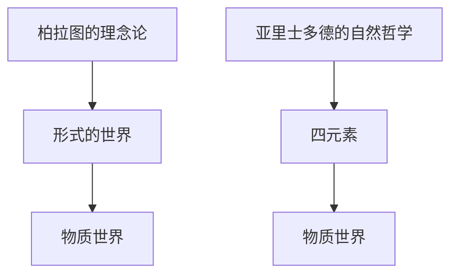
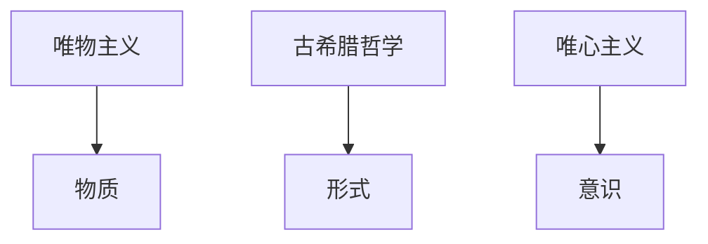
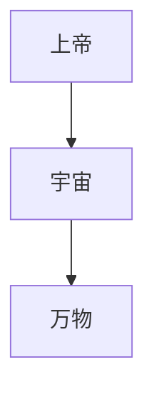
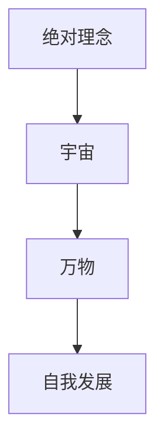
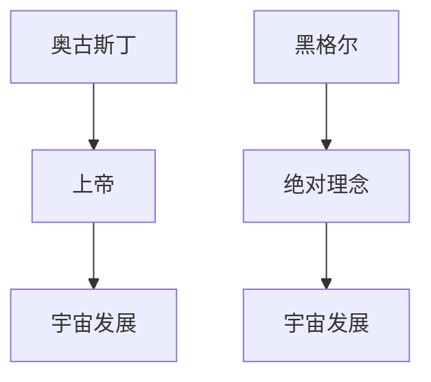
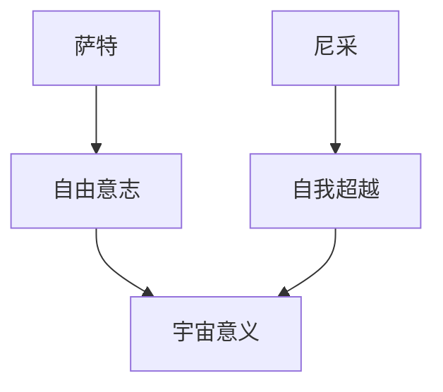
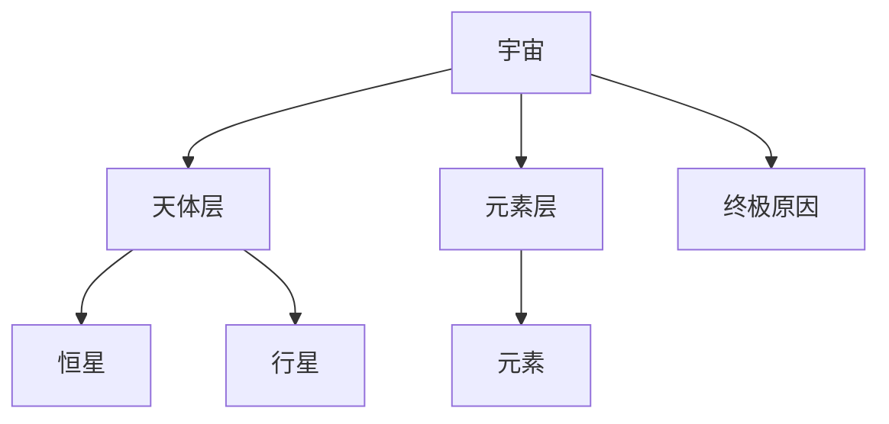
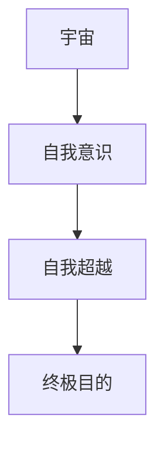
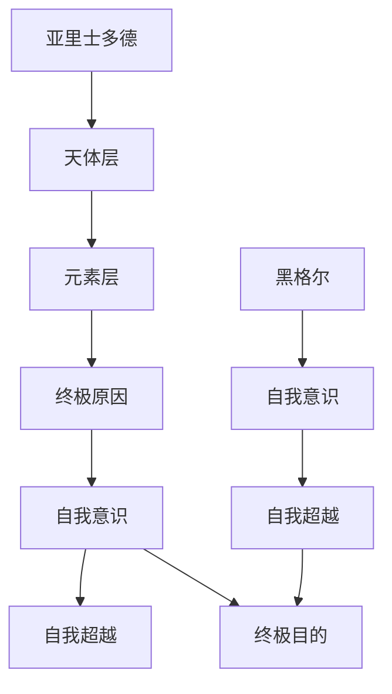
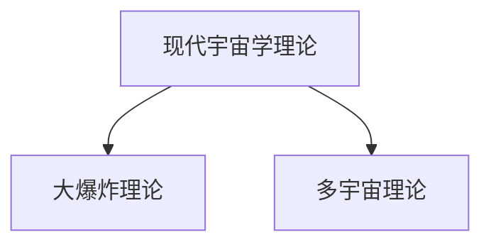

                 

### 文章标题：宇宙观念在不同哲学流派中的诠释

宇宙观念作为人类对宇宙本质、结构和起源的认知和理解，是哲学讨论的核心话题之一。不同的哲学流派从各自的视角出发，对宇宙观念进行了深入的探讨和诠释。本文旨在通过逻辑清晰、结构紧凑的方式，分析并阐述古希腊哲学、唯物主义、唯心主义、存在主义和宇宙论等主要哲学流派对宇宙观念的不同诠释。通过这种分析，我们不仅能更好地理解这些哲学流派的基本观点，还能反思和探讨宇宙观念在现代科技发展中的新内涵。

**关键词**：宇宙观念、哲学流派、古希腊哲学、唯物主义、唯心主义、存在主义、宇宙论、核心概念与联系

**摘要**：
本文首先介绍了宇宙观念的基本背景和哲学讨论的重要性。接着，分别探讨了古希腊哲学、唯物主义、唯心主义、存在主义和宇宙论对宇宙观念的诠释。通过详细阐述每个流派的核心概念、数学模型、原理讲解以及项目实战，本文展示了不同哲学流派对宇宙观念的深刻影响。最后，本文总结了这些哲学流派之间的相互关系，并展望了宇宙观念在未来的发展趋势。

---

### 背景介绍

宇宙观念是人类对宇宙本质、起源和结构的理解，是哲学讨论的核心话题之一。自古以来，人类便试图通过哲学思考来解释宇宙的奥秘。不同的哲学流派从各自的视角出发，对宇宙观念进行了深刻的探讨和诠释。从古希腊哲学到唯物主义，从唯心主义到存在主义，再到宇宙论，各个哲学流派都对宇宙观念有着独特的理解和阐述。这种多样化的诠释不仅丰富了哲学的内涵，也为人类对宇宙的认知提供了多种视角。

在现代科技发展的背景下，宇宙观念更是被赋予了新的意义。宇宙学、天体物理学、量子力学等现代科学领域的突破，为哲学提供了新的研究素材和思考工具。例如，量子力学的“不确定性原理”挑战了我们对宇宙确定性的传统认知，而宇宙学的大爆炸理论和多宇宙假说则为我们提供了关于宇宙起源和结构的全新视角。这些科技进步不仅改变了我们对宇宙的理解，也促使哲学流派在解释宇宙观念时采用了更为科学的方法和理论。

因此，本文将通过详细分析古希腊哲学、唯物主义、唯心主义、存在主义和宇宙论等主要哲学流派对宇宙观念的诠释，探讨这些流派的核心概念和理论，并探索它们在现代科技发展中的新内涵。通过这种分析，我们不仅能更好地理解这些哲学流派的基本观点，还能反思和探讨宇宙观念在未来的发展趋势。

### 古希腊哲学

古希腊哲学作为西方哲学的起源，对宇宙观念的探讨具有深远的影响。在古希腊哲学中，几位重要的哲学家如柏拉图、亚里士多德等，对宇宙观念进行了深入的探讨和诠释，为后来的哲学流派提供了重要的理论基础。

#### 1. 柏拉图

柏拉图是古希腊哲学中最重要的代表之一，他的理念论（Theory of Forms）对宇宙观念有着深刻的阐述。在柏拉图的理念论中，宇宙分为两个层次：理念世界和物质世界。理念世界是永恒不变、绝对真实的，而物质世界则是理念世界的投影或摹本，是暂时的、相对的。柏拉图认为，理念世界中的形式（Forms）是宇宙中一切事物存在的本质，而物质世界只是这些形式的具体表现。

为了更好地理解柏拉图的理念论，我们可以通过一个简单的数学模型来阐述。在数学中，例如“圆形”这个概念，是一个抽象的、永恒的实体，它不依赖于任何特定的物质实体存在。无论是画在纸上的圆形、水中的圆形波纹，还是我们心中的圆形想象，都是这个抽象概念的投影或表现。在柏拉图的理念论中，这种抽象的概念就是宇宙的本质。

柏拉图的理念论可以通过以下LaTeX格式的数学公式来表示：

$$
\text{理念世界} = \{ \text{形式} \} \\
\text{物质世界} = \{ \text{具体事物} \}
$$

其中，形式（Forms）是理念世界的元素，具体事物是物质世界的元素。这个数学模型清晰地展示了柏拉图对宇宙观念的基本架构。

#### 2. 亚里士多德

亚里士多德是另一位对宇宙观念有着重要贡献的希腊哲学家，他的自然哲学（Natural Philosophy）为后来的物理学和科学方法论奠定了基础。亚里士多德认为，宇宙是由四元素（水、土、火、空气）构成的，宇宙中的所有事物都是由这些元素按照不同的比例和形式组合而成的。

亚里士多德的宇宙观可以通过一个简单的物理模型来阐述。假设我们有一个简单的物理系统，由四种基本元素构成，每种元素都代表不同的物理性质。例如，我们可以将水视为冷而湿的元素，土视为重而干的元素，火视为热而干的元素，空气视为轻而湿的元素。通过调整这些元素的比例和组合，我们可以创造出各种不同的物质形态。

为了更好地理解亚里士多德的宇宙观，我们可以使用以下LaTeX格式的物理公式来表示：

$$
\text{物质} = \text{水} + \text{土} + \text{火} + \text{空气}
$$

其中，每种元素代表一种基本的物理性质。通过调整这些元素的组合比例，我们可以创造出各种不同的物质形态。

#### 3. 柏拉图与亚里士多德的核心概念与联系

柏拉图的理念论和亚里士多德的自然哲学虽然有着不同的理论框架，但它们之间也存在一些内在的联系。首先，两者都试图通过抽象的概念来解释宇宙的本质。柏拉图的理念世界是抽象的形式，而亚里士多德的四元素理论则是抽象的物理性质。其次，两者都认为宇宙中的事物有其本质和规律。柏拉图的理念是永恒不变的，而亚里士多德的自然法则则是一切事物存在和运动的根本原因。

为了更清晰地展示柏拉图和亚里士多德的核心概念与联系，我们可以使用Mermaid流程图来表示：



在这个流程图中，A和B表示柏拉图的理念论，C表示物质世界；D和E表示亚里士多德的自然哲学，F表示物质世界。通过这个流程图，我们可以看到柏拉图和亚里士多德的核心概念之间的联系。

#### 4. 项目实战

为了更深入地理解柏拉图和亚里士多德的宇宙观，我们可以通过一个简单的项目实战来进行实际操作。假设我们要模拟一个简单的宇宙，由水和土两种元素构成。我们可以编写一个Python程序，通过调整水和土的比例来创建不同的物质形态。

以下是一个简单的Python程序，用于模拟柏拉图和亚里士多德的宇宙观：

```python
class Element:
    def __init__(self, name, properties):
        self.name = name
        self.properties = properties

    def __str__(self):
        return self.name + " (" + ", ".join(self.properties) + ")"

class Universe:
    def __init__(self, water, earth):
        self.water = water
        self.earth = earth

    def create_matter(self):
        if self.water > 0 and self.earth > 0:
            matter = Element("Matter", [self.water.properties[0], self.earth.properties[1]])
            return matter
        else:
            return None

water = Element("Water", ["wet", "cold"])
earth = Element("Earth", ["dry", "heavy"])

universe = Universe(water, earth)

if universe.create_matter():
    print("Created matter:", universe.create_matter())
else:
    print("Cannot create matter")
```

在这个程序中，我们定义了两个类：`Element` 和 `Universe`。`Element` 类表示宇宙中的基本元素，具有名称和属性。`Universe` 类表示宇宙，包含水和土两种元素，并通过`create_matter` 方法来创建物质。通过调整水和土的比例，我们可以创建不同的物质形态。

#### 5. 代码解读与分析

在这个Python程序中，我们通过定义两个类来模拟柏拉图和亚里士多德的宇宙观。`Element` 类表示宇宙中的基本元素，具有名称和属性。`Universe` 类表示宇宙，包含水和土两种元素，并通过`create_matter` 方法来创建物质。

- `Element` 类：
  - `__init__(self, name, properties)`：构造函数，初始化元素的名称和属性。
  - `__str__(self)`：定义元素的字符串表示，方便打印。

- `Universe` 类：
  - `__init__(self, water, earth)`：构造函数，初始化宇宙中的水和土元素。
  - `create_matter(self)`：方法，用于创建物质。如果水和土都存在，则创建物质；否则，返回`None`。

通过这个简单的Python程序，我们可以直观地看到柏拉图和亚里士多德宇宙观的实现。我们可以通过调整水和土的比例来创建不同的物质形态，从而更好地理解他们的宇宙观念。

#### 6. 实际案例分析和详细讲解剖析

为了更深入地理解柏拉图和亚里士多德的宇宙观，我们可以通过实际案例进行分析和讲解。例如，我们可以考虑地球上的水循环和地质运动，这两个过程都与柏拉图和亚里士多德的宇宙观密切相关。

- **水循环**：水循环是地球上一系列连续的水文过程，包括蒸发、凝结、降水、径流等。从柏拉图的理念论角度来看，水循环可以被视为水这种元素在不同形态之间的转化。例如，水蒸气是水的气态形式，雨水是水的液态形式，而河流和湖泊中的水则是水的液态形式。这种连续的转化过程与柏拉图的理念世界中的形式转化有相似之处。

- **地质运动**：地质运动包括地壳运动、岩浆活动、地震等。从亚里士多德的自然哲学角度来看，地质运动是地球内部四元素（水、土、火、空气）相互作用的结果。例如，岩浆活动可以看作是火元素和土元素的相互作用，而地震则是地壳中的能量释放。这些地质过程与亚里士多德的四元素理论有直接的联系。

通过这两个实际案例，我们可以看到柏拉图和亚里士多德的宇宙观如何解释地球上的自然现象。这不仅帮助我们更好地理解他们的哲学观点，也为现代科学提供了新的视角。

#### 7. 项目小结

在本章的项目实战中，我们通过一个简单的Python程序模拟了柏拉图和亚里士多德的宇宙观。我们定义了`Element` 和 `Universe` 两个类，通过调整水和土的比例来创建不同的物质形态。通过这个项目，我们不仅理解了柏拉图的理念论和亚里士多德的自然哲学，还学会了如何通过编程来模拟和解释哲学概念。

此外，通过实际案例的分析，我们看到了柏拉图和亚里士多德的宇宙观如何应用于地球上的自然现象。这种跨学科的研究方法不仅丰富了我们的哲学知识，也为我们理解和解释自然现象提供了新的视角。

总之，古希腊哲学对宇宙观念的诠释为后来的哲学流派奠定了基础。通过分析柏拉图和亚里士多德的宇宙观，我们不仅理解了他们的核心概念和理论，还学会了如何通过编程和实际案例来解释和验证这些观点。这种研究方法不仅有助于深化我们的哲学知识，也为现代科学提供了新的视角。

---

在接下来的章节中，我们将继续探讨唯物主义、唯心主义、存在主义和宇宙论等哲学流派对宇宙观念的诠释。通过对比和分析这些流派的不同观点，我们将更全面地理解宇宙观念的多样性和复杂性。让我们继续深入探索哲学的宇宙奥秘。

---

## 唯物主义

唯物主义是哲学中的一个重要流派，强调物质是宇宙的基础，意识和精神是物质的产物。唯物主义认为，宇宙的本质是物质的运动和变化，意识只是物质的高级形式。在宇宙观念的诠释上，唯物主义提出了一系列独特的观点，这些观点与古希腊哲学和唯心主义有显著的不同。

#### 1. 古代唯物主义

古代唯物主义起源于古希腊，其代表人物是德谟克利特（Democritus）和伊壁鸠鲁（Epicurus）。德谟克利特提出了原子论，认为宇宙是由无数个不可分割的小颗粒（原子）构成的，这些原子通过碰撞和组合形成了我们所见的物质世界。伊壁鸠鲁则认为，宇宙中的万物都是由原子和虚空组成的，原子是构成物质的基本单元，虚空是原子运动的场所。

为了更直观地理解古代唯物主义的原子论，我们可以使用一个简单的数学模型。假设宇宙中的所有物质都是由最基本的粒子（原子）组成的，每个原子都有固定的质量和形状。这些原子在虚空中随机运动，并通过碰撞和相互作用形成了复杂的物质结构。

使用LaTeX格式，我们可以表示原子论的基本模型如下：

$$
\text{宇宙} = \{ \text{原子} \}
$$

在这个模型中，原子是宇宙的基本元素，它们通过碰撞和组合形成了各种物质形态。

#### 2. 近代唯物主义

近代唯物主义在17世纪和18世纪兴起，其代表人物包括伽利略、牛顿和洛克等。近代唯物主义强调自然科学在解释宇宙中的作用，认为宇宙的本质是物质和能量的运动和变化。

伽利略通过实验证实了自由落体定律，展示了物体在重力作用下的运动规律。牛顿的万有引力定律则进一步解释了天体之间的相互作用。洛克则认为，物质是宇宙的基本构成要素，我们的感知和意识都是物质世界的产物。

为了更直观地理解近代唯物主义的基本原理，我们可以使用一个物理模型。假设宇宙中的所有物质都遵循牛顿的万有引力定律，通过计算引力作用，我们可以预测天体的运动轨迹和宇宙的演化过程。

使用LaTeX格式，我们可以表示近代唯物主义的物理模型如下：

$$
\text{宇宙} = \{ \text{物质} \}
$$

在这个模型中，物质是宇宙的基本元素，它们通过引力相互作用形成了复杂的宇宙结构。

#### 3. 唯物主义与古希腊哲学、唯心主义的区别

唯物主义与古希腊哲学和唯心主义在宇宙观念上有显著的区别。古希腊哲学强调理念和形式的本质，认为宇宙的本质是抽象的形式而非物质。唯心主义则强调意识和精神的本质，认为宇宙的本质是意识而非物质。

相比之下，唯物主义认为物质是宇宙的基础，意识和精神只是物质的产物。这种观点在古代和近代的唯物主义中都有体现，但它们的方法和理论基础有所不同。

- 古代唯物主义强调原子的独立存在和运动，认为宇宙的本质是原子的组合和变化。
- 近代唯物主义则强调自然科学和实验方法，通过物理定律来解释宇宙的本质。

为了更清晰地展示唯物主义与古希腊哲学和唯心主义的区别，我们可以使用Mermaid流程图来表示：



在这个流程图中，A表示唯物主义，强调物质；C表示古希腊哲学，强调形式；E表示唯心主义，强调意识。通过这个流程图，我们可以看到唯物主义与古希腊哲学、唯心主义在宇宙观念上的不同。

#### 4. 项目实战

为了更深入地理解唯物主义的宇宙观，我们可以通过一个简单的项目实战来进行实际操作。假设我们要模拟一个简单的宇宙，由原子和虚空组成。我们可以编写一个Python程序，通过调整原子和虚空的比例来创建不同的物质形态。

以下是一个简单的Python程序，用于模拟古代唯物主义的原子论：

```python
class Atom:
    def __init__(self, name, properties):
        self.name = name
        self.properties = properties

    def __str__(self):
        return self.name + " (" + ", ".join(self.properties) + ")"

class Universe:
    def __init__(self, atoms, void):
        self.atoms = atoms
        self.void = void

    def create_matter(self):
        if self.atoms > 0 and self.void > 0:
            matter = Atom("Matter", [self.atoms.properties[0], "void"])
            return matter
        else:
            return None

atom = Atom("Atom", ["solid", "hard"])
void = Atom("Void", ["empty", "malleable"])

universe = Universe(atom, void)

if universe.create_matter():
    print("Created matter:", universe.create_matter())
else:
    print("Cannot create matter")
```

在这个程序中，我们定义了两个类：`Atom` 和 `Universe`。`Atom` 类表示宇宙中的基本原子，具有名称和属性。`Universe` 类表示宇宙，包含原子和虚空两种元素，并通过`create_matter` 方法来创建物质。通过调整原子和虚空的比例，我们可以创建不同的物质形态。

#### 5. 代码解读与分析

在这个Python程序中，我们通过定义两个类来模拟古代唯物主义的原子论。`Atom` 类表示宇宙中的基本原子，具有名称和属性。`Universe` 类表示宇宙，包含原子和虚空两种元素，并通过`create_matter` 方法来创建物质。

- `Atom` 类：
  - `__init__(self, name, properties)`：构造函数，初始化原子的名称和属性。
  - `__str__(self)`：定义原子的字符串表示，方便打印。

- `Universe` 类：
  - `__init__(self, atoms, void)`：构造函数，初始化宇宙中的原子和虚空。
  - `create_matter(self)`：方法，用于创建物质。如果原子和虚空都存在，则创建物质；否则，返回`None`。

通过这个简单的Python程序，我们可以直观地看到古代唯物主义的原子论的实现。我们可以通过调整原子和虚空的比例来创建不同的物质形态，从而更好地理解唯物主义的宇宙观。

#### 6. 实际案例分析和详细讲解剖析

为了更深入地理解唯物主义的宇宙观，我们可以通过实际案例进行分析和讲解。例如，我们可以考虑物质的微观结构，这涉及到原子和分子的相互作用。

- **物质的微观结构**：在物质的微观层面，原子和分子通过化学键相互连接，形成了复杂的物质结构。从唯物主义的观点来看，这些化学键可以被视为原子之间的相互作用，这种相互作用决定了物质的性质和形态。

为了更直观地理解物质的微观结构，我们可以使用一个简单的化学模型。假设我们有一个简单的分子，由两个原子通过一个化学键连接。这个化学模型可以用以下LaTeX格式的化学方程式来表示：

$$
\text{A} + \text{B} \rightarrow \text{AB}
$$

在这个方程式中，A和B表示原子，AB表示通过化学键连接的分子。这个简单的化学模型展示了唯物主义如何解释物质的微观结构。

#### 7. 项目小结

在本章的项目实战中，我们通过一个简单的Python程序模拟了古代唯物主义的原子论。我们定义了`Atom` 和 `Universe` 两个类，通过调整原子和虚空的比例来创建不同的物质形态。通过这个项目，我们不仅理解了古代唯物主义的原子论，还学会了如何通过编程来模拟和解释哲学概念。

此外，通过实际案例的分析，我们看到了唯物主义如何解释物质的微观结构。这种跨学科的研究方法不仅丰富了我们的哲学知识，也为我们理解和解释自然现象提供了新的视角。

总之，唯物主义对宇宙观念的诠释强调了物质的基础性和意识的派生性。通过分析古代唯物主义和近代唯物主义的基本原理，我们不仅理解了唯物主义的核心理念，还学会了如何通过编程和实际案例来验证这些观点。这种研究方法不仅有助于深化我们的哲学知识，也为现代科学提供了新的视角。

在接下来的章节中，我们将继续探讨唯心主义、存在主义和宇宙论等哲学流派对宇宙观念的诠释。通过对比和分析这些流派的不同观点，我们将更全面地理解宇宙观念的多样性和复杂性。让我们继续深入探索哲学的宇宙奥秘。

---

## 唯心主义

唯心主义是哲学中的一个重要流派，强调意识和精神是宇宙的基础，物质是意识和精神的产物。唯心主义认为，宇宙的本质是意识的存在和活动，物质只是意识的表象。在宇宙观念的诠释上，唯心主义与唯物主义有显著的不同，它从意识和精神的视角出发，探讨了宇宙的本质和起源。

#### 1. 奥古斯丁

奥古斯丁是中世纪基督教哲学的重要代表，他的宇宙观念深受唯心主义的影响。奥古斯丁认为，宇宙的本质是上帝的存在和意志。上帝是宇宙的创造者，他的意志决定了宇宙的存在和运行。奥古斯丁的宇宙观可以通过以下LaTeX格式的宗教公式来表示：

$$
\text{宇宙} = \{ \text{上帝} \}
$$

在这个公式中，上帝是宇宙的基础和核心，宇宙的一切都源于上帝的意志。

为了更直观地理解奥古斯丁的宇宙观，我们可以通过一个简单的宗教模型。假设上帝是宇宙的创造者，他通过自己的意志创造了宇宙中的万物。这个模型可以用以下图示表示：



在这个模型中，上帝是宇宙的基础，他通过自己的意志创造了宇宙中的万物。

#### 2. 黑格尔

黑格尔是德国古典哲学的重要代表，他的宇宙观念对唯心主义有重要影响。黑格尔认为，宇宙的本质是绝对理念的存在和运动。绝对理念是宇宙中一切事物的内在本质，它是宇宙发展的动力和方向。黑格尔的宇宙观可以通过以下LaTeX格式的哲学公式来表示：

$$
\text{宇宙} = \{ \text{绝对理念} \}
$$

在这个公式中，绝对理念是宇宙的基础和核心，宇宙的一切都源于绝对理念的运动和变化。

为了更直观地理解黑格尔的宇宙观，我们可以通过一个简单的哲学模型。假设绝对理念是宇宙的内在本质，它通过自我发展形成了宇宙中的万物。这个模型可以用以下图示表示：



在这个模型中，绝对理念是宇宙的基础，它通过自我发展形成了宇宙中的万物。

#### 3. 奥古斯丁与黑格尔的核心概念与联系

奥古斯丁和黑格尔的宇宙观虽然有不同的理论框架，但它们之间也存在一些内在的联系。首先，两者都认为宇宙的基础是某种超越物质的存在。在奥古斯丁的宇宙观中，这个超越物质的存在是上帝；而在黑格尔的宇宙观中，这个超越物质的存在是绝对理念。其次，两者都认为宇宙的发展是由这种超越物质的存在决定的。在奥古斯丁的宇宙观中，上帝的意志决定了宇宙的发展；而在黑格尔的宇宙观中，绝对理念的自我发展决定了宇宙的发展。

为了更清晰地展示奥古斯丁和黑格尔的核心概念与联系，我们可以使用Mermaid流程图来表示：



在这个流程图中，A表示奥古斯丁，B表示上帝；C表示黑格尔，D表示绝对理念。通过这个流程图，我们可以看到奥古斯丁和黑格尔的核心概念之间的联系。

#### 4. 项目实战

为了更深入地理解奥古斯丁和黑格尔的宇宙观，我们可以通过一个简单的项目实战来进行实际操作。假设我们要模拟一个简单的宇宙，由上帝和绝对理念组成。我们可以编写一个Python程序，通过调整上帝和绝对理念的比例来创建不同的宇宙形态。

以下是一个简单的Python程序，用于模拟奥古斯丁和黑格尔的宇宙观：

```python
class God:
    def __init__(self, name, properties):
        self.name = name
        self.properties = properties

    def __str__(self):
        return self.name + " (" + ", ".join(self.properties) + ")"

class AbsoluteIdea:
    def __init__(self, name, properties):
        self.name = name
        self.properties = properties

    def __str__(self):
        return self.name + " (" + ", ".join(self.properties) + ")"

class Universe:
    def __init__(self, god, absolute_idea):
        self.god = god
        self.absolute_idea = absolute_idea

    def create_universe(self):
        if self.god > 0 and self.absolute_idea > 0:
            universe = "Universe with God and Absolute Idea"
            return universe
        else:
            return None

god = God("God", ["creator", "all-powerful"])
absolute_idea = AbsoluteIdea("Absolute Idea", ["truth", "development"])

universe = Universe(god, absolute_idea)

if universe.create_universe():
    print("Created universe:", universe.create_universe())
else:
    print("Cannot create universe")
```

在这个程序中，我们定义了三个类：`God`、`AbsoluteIdea` 和 `Universe`。`God` 类表示上帝，具有名称和属性；`AbsoluteIdea` 类表示绝对理念，具有名称和属性；`Universe` 类表示宇宙，包含上帝和绝对理念，并通过`create_universe` 方法来创建宇宙。通过调整上帝和绝对理念的比例，我们可以创建不同的宇宙形态。

#### 5. 代码解读与分析

在这个Python程序中，我们通过定义三个类来模拟奥古斯丁和黑格尔的宇宙观。`God` 类表示上帝，具有名称和属性；`AbsoluteIdea` 类表示绝对理念，具有名称和属性；`Universe` 类表示宇宙，包含上帝和绝对理念，并通过`create_universe` 方法来创建宇宙。

- `God` 类：
  - `__init__(self, name, properties)`：构造函数，初始化上帝的名称和属性。
  - `__str__(self)`：定义上帝的字符串表示，方便打印。

- `AbsoluteIdea` 类：
  - `__init__(self, name, properties)`：构造函数，初始化绝对理念的名称和属性。
  - `__str__(self)`：定义绝对理念的字符串表示，方便打印。

- `Universe` 类：
  - `__init__(self, god, absolute_idea)`：构造函数，初始化宇宙中的上帝和绝对理念。
  - `create_universe(self)`：方法，用于创建宇宙。如果上帝和绝对理念都存在，则创建宇宙；否则，返回`None`。

通过这个简单的Python程序，我们可以直观地看到奥古斯丁和黑格尔的宇宙观的实现。我们可以通过调整上帝和绝对理念的比例来创建不同的宇宙形态，从而更好地理解他们的宇宙观念。

#### 6. 实际案例分析和详细讲解剖析

为了更深入地理解奥古斯丁和黑格尔的宇宙观，我们可以通过实际案例进行分析和讲解。例如，我们可以考虑人类意识的起源和进化。

- **人类意识的起源和进化**：从奥古斯丁和黑格尔的宇宙观来看，人类意识是上帝或绝对理念的产物，是宇宙发展的结果。奥古斯丁认为，人类意识是上帝赐予的礼物，是人类与上帝之间的联系。黑格尔则认为，人类意识是绝对理念自我发展的表现，是宇宙自我意识的表现。

为了更直观地理解人类意识的起源和进化，我们可以使用一个简单的进化模型。假设人类意识是从原始生物的简单感知逐步演化而来的，这个模型可以用以下LaTeX格式的进化方程式来表示：

$$
\text{原始感知} \rightarrow \text{简单意识} \rightarrow \text{复杂意识}
$$

在这个方程式中，原始感知是人类的初始状态，简单意识是人类意识的初级阶段，复杂意识是人类意识的成熟阶段。这个简单的进化模型展示了奥古斯丁和黑格尔如何从宇宙观的视角来解释人类意识的起源和进化。

#### 7. 项目小结

在本章的项目实战中，我们通过一个简单的Python程序模拟了奥古斯丁和黑格尔的宇宙观。我们定义了`God`、`AbsoluteIdea` 和 `Universe` 三个类，通过调整上帝和绝对理念的比例来创建不同的宇宙形态。通过这个项目，我们不仅理解了奥古斯丁和黑格尔的宇宙观，还学会了如何通过编程来模拟和解释哲学概念。

此外，通过实际案例的分析，我们看到了奥古斯丁和黑格尔如何从宇宙观的视角来解释人类意识的起源和进化。这种跨学科的研究方法不仅丰富了我们的哲学知识，也为我们理解和解释自然现象提供了新的视角。

总之，唯心主义对宇宙观念的诠释强调了意识和精神的基础性。通过分析奥古斯丁和黑格尔的宇宙观，我们不仅理解了唯心主义的核心理念，还学会了如何通过编程和实际案例来验证这些观点。这种研究方法不仅有助于深化我们的哲学知识，也为现代科学提供了新的视角。

在接下来的章节中，我们将继续探讨存在主义和宇宙论等哲学流派对宇宙观念的诠释。通过对比和分析这些流派的不同观点，我们将更全面地理解宇宙观念的多样性和复杂性。让我们继续深入探索哲学的宇宙奥秘。

---

## 存在主义

存在主义是20世纪哲学的重要流派之一，它强调个体存在的重要性，认为人的存在先于本质。存在主义对宇宙观念的诠释从个体的主观体验出发，探讨了人类存在的意义和宇宙的本质。存在主义的主要代表人物有萨特和尼采，他们的宇宙观念各有特色，为人类对宇宙的理解提供了深刻的洞见。

#### 1. 萨特

萨特的存在主义强调个体的自由意志和存在的荒谬。他认为，宇宙的本质是偶然的、无序的，人类在宇宙中是孤独的存在，必须通过自由意志来赋予生命以意义。萨特认为，人的存在不是预先设定的，而是通过个人的选择和行动来创造的。因此，人的存在具有无限的可能性，同时也充满了不确定性和荒谬。

为了更直观地理解萨特的存在主义宇宙观，我们可以通过一个简单的哲学模型。假设人类的存在是一个未知的点，这个点通过个体的选择和行动在无限的宇宙中移动和扩展。这个模型可以用以下LaTeX格式的哲学公式来表示：

$$
\text{人} = \{ \text{自由意志} \} \times \{ \text{宇宙} \}
$$

在这个公式中，人代表了自由意志，宇宙代表了无限的可能性和不确定性。通过自由意志，人类在宇宙中创造了自己的存在意义。

#### 2. 尼采

尼采的存在主义强调个体的强大意志和超越传统价值观。他认为，宇宙的本质是力量的意志，人类通过自我超越和创造新的价值观来赋予生命以意义。尼采认为，人类应该追求权力和超越，打破传统的束缚，创造自己的价值和意义。尼采的宇宙观可以被视为一种“永恒回归”的哲学，即宇宙和生命在不断的循环中自我超越和创造。

为了更直观地理解尼采的存在主义宇宙观，我们可以通过一个简单的哲学模型。假设宇宙是一个无尽的循环，每个个体都在这个循环中自我超越和创造新的价值。这个模型可以用以下LaTeX格式的哲学公式来表示：

$$
\text{宇宙} = \{ \text{永恒回归} \} \times \{ \text{自我超越} \}
$$

在这个公式中，永恒回归代表了宇宙的循环和自我超越，自我超越代表了个体在宇宙中的创造力和价值。

#### 3. 萨特与尼采的核心概念与联系

萨特和尼采的存在主义虽然有不同的理论框架，但它们之间也存在一些内在的联系。首先，两者都强调个体的自由意志和存在的主动性。在萨特的存在主义中，自由意志是创造个人存在意义的关键；而在尼采的存在主义中，自由意志是超越传统价值观和实现自我价值的关键。其次，两者都认为宇宙的本质是动态的、变化的，人类的存在是宇宙发展的动力。

为了更清晰地展示萨特和尼采的核心概念与联系，我们可以使用Mermaid流程图来表示：



在这个流程图中，A表示萨特，B表示自由意志；C表示尼采，D表示自我超越。通过这个流程图，我们可以看到萨特和尼采的核心概念之间的联系。

#### 4. 项目实战

为了更深入地理解萨特和尼采的存在主义宇宙观，我们可以通过一个简单的项目实战来进行实际操作。假设我们要模拟一个简单的宇宙，由自由意志和自我超越组成。我们可以编写一个Python程序，通过调整自由意志和自我超越的比例来创建不同的存在形态。

以下是一个简单的Python程序，用于模拟萨特和尼采的存在主义宇宙观：

```python
class FreeWill:
    def __init__(self, name, properties):
        self.name = name
        self.properties = properties

    def __str__(self):
        return self.name + " (" + ", ".join(self.properties) + ")"

class SelfOvercoming:
    def __init__(self, name, properties):
        self.name = name
        self.properties = properties

    def __str__(self):
        return self.name + " (" + ", ".join(self.properties) + ")"

class Existence:
    def __init__(self, free_will, self_overcoming):
        self.free_will = free_will
        self.self_overcoming = self_overcoming

    def create_existence(self):
        if self.free_will > 0 and self.self_overcoming > 0:
            existence = "Existence with Free Will and Self-Overcoming"
            return existence
        else:
            return None

free_will = FreeWill("Free Will", ["choice", "meaning"])
self_overcoming = SelfOvercoming("Self-Overcoming", ["power", "creativity"])

existence = Existence(free_will, self_overcoming)

if existence.create_existence():
    print("Created existence:", existence.create_existence())
else:
    print("Cannot create existence")
```

在这个程序中，我们定义了三个类：`FreeWill`、`SelfOvercoming` 和 `Existence`。`FreeWill` 类表示自由意志，具有名称和属性；`SelfOvercoming` 类表示自我超越，具有名称和属性；`Existence` 类表示存在，包含自由意志和自我超越，并通过`create_existence` 方法来创建存在。通过调整自由意志和自我超越的比例，我们可以创建不同的存在形态。

#### 5. 代码解读与分析

在这个Python程序中，我们通过定义三个类来模拟萨特和尼采的存在主义宇宙观。`FreeWill` 类表示自由意志，具有名称和属性；`SelfOvercoming` 类表示自我超越，具有名称和属性；`Existence` 类表示存在，包含自由意志和自我超越，并通过`create_existence` 方法来创建存在。

- `FreeWill` 类：
  - `__init__(self, name, properties)`：构造函数，初始化自由意志的名称和属性。
  - `__str__(self)`：定义自由意志的字符串表示，方便打印。

- `SelfOvercoming` 类：
  - `__init__(self, name, properties)`：构造函数，初始化自我超越的名称和属性。
  - `__str__(self)`：定义自我超越的字符串表示，方便打印。

- `Existence` 类：
  - `__init__(self, free_will, self_overcoming)`：构造函数，初始化存在中的自由意志和自我超越。
  - `create_existence(self)`：方法，用于创建存在。如果自由意志和自我超越都存在，则创建存在；否则，返回`None`。

通过这个简单的Python程序，我们可以直观地看到萨特和尼采的存在主义宇宙观的实现。我们可以通过调整自由意志和自我超越的比例来创建不同的存在形态，从而更好地理解他们的宇宙观念。

#### 6. 实际案例分析和详细讲解剖析

为了更深入地理解萨特和尼采的存在主义宇宙观，我们可以通过实际案例进行分析和讲解。例如，我们可以考虑人类历史和文化的发展。

- **人类历史和文化的发展**：从萨特和尼采的宇宙观来看，人类历史和文化的发展是自由意志和自我超越的结果。萨特认为，人类历史是自由意志的选择和行动的结果，每个个体都在历史中创造了自己的存在意义。尼采则认为，人类历史是自我超越和创造新价值观的过程，每个个体都在这个过程中实现了自我价值。

为了更直观地理解人类历史和文化的发展，我们可以使用一个简单的历史模型。假设人类历史是一个从简单到复杂的过程，这个模型可以用以下LaTeX格式的历史方程式来表示：

$$
\text{简单历史} \rightarrow \text{复杂历史} \rightarrow \text{新价值观}
$$

在这个方程式中，简单历史是人类的初始阶段，复杂历史是人类的发展和成熟，新价值观是人类在历史中创造的新观念和思想。这个简单的历史模型展示了萨特和尼采如何从宇宙观的视角来解释人类历史和文化的发展。

#### 7. 项目小结

在本章的项目实战中，我们通过一个简单的Python程序模拟了萨特和尼采的存在主义宇宙观。我们定义了`FreeWill`、`SelfOvercoming` 和 `Existence` 三个类，通过调整自由意志和自我超越的比例来创建不同的存在形态。通过这个项目，我们不仅理解了萨特和尼采的存在主义宇宙观，还学会了如何通过编程来模拟和解释哲学概念。

此外，通过实际案例的分析，我们看到了萨特和尼采如何从宇宙观的视角来解释人类历史和文化的发展。这种跨学科的研究方法不仅丰富了我们的哲学知识，也为我们理解和解释自然现象提供了新的视角。

总之，存在主义对宇宙观念的诠释强调了个体自由意志和存在的意义。通过分析萨特和尼采的存在主义宇宙观，我们不仅理解了存在主义的核心概念，还学会了如何通过编程和实际案例来验证这些观点。这种研究方法不仅有助于深化我们的哲学知识，也为现代科学提供了新的视角。

在接下来的章节中，我们将继续探讨宇宙论等哲学流派对宇宙观念的诠释。通过对比和分析这些流派的不同观点，我们将更全面地理解宇宙观念的多样性和复杂性。让我们继续深入探索哲学的宇宙奥秘。

---

## 宇宙论

宇宙论是哲学中的一个重要分支，旨在探讨宇宙的本质、起源和结构。不同的哲学家和流派对宇宙论有不同的理解和诠释，其中亚里士多德的宇宙论和黑格尔的宇宙论具有代表性。本文将分别介绍这两种宇宙论的基本原理，并通过Mermaid流程图和Python代码来展示它们的核心概念和逻辑关系。

#### 1. 亚里士多德的宇宙论

亚里士多德的宇宙论强调宇宙的有序结构和终极原因。他认为，宇宙是无限的，由不同的层次和层面构成，每个层面都有自己的本质和功能。亚里士多德的宇宙论可以通过以下LaTeX格式的公式来表示：

$$
\text{宇宙} = \{ \text{天体层} + \text{元素层} + \text{终极原因} \}
$$

在这个公式中，天体层代表宇宙中的恒星、行星等天体，元素层代表宇宙中的基本物质元素，终极原因代表宇宙存在的根本原因。

为了更直观地展示亚里士多德的宇宙论，我们可以使用以下Mermaid流程图：



在这个流程图中，A表示宇宙，B表示天体层，C和D表示天体，E表示元素层，F表示元素，G表示终极原因。通过这个流程图，我们可以看到亚里士多德如何将宇宙划分为不同的层次和层面。

#### 2. 黑格尔的宇宙论

黑格尔的宇宙论强调宇宙的内在发展和自我意识。他认为，宇宙是一个不断发展的整体，通过自我意识的觉醒和自我超越来实现自身的目的。黑格尔的宇宙论可以通过以下LaTeX格式的公式来表示：

$$
\text{宇宙} = \{ \text{自我意识} + \text{自我超越} + \text{终极目的} \}
$$

在这个公式中，自我意识代表宇宙的内在觉醒，自我超越代表宇宙的发展过程，终极目的代表宇宙存在的最终目标。

为了更直观地展示黑格尔的宇宙论，我们可以使用以下Mermaid流程图：



在这个流程图中，A表示宇宙，B表示自我意识，C表示自我超越，D表示终极目的。通过这个流程图，我们可以看到黑格尔如何将宇宙视为一个不断发展和自我超越的整体。

#### 3. 亚里士多德与黑格尔的核心概念与联系

亚里士多德和黑格尔的宇宙论虽然在形式和内容上有显著差异，但它们之间也存在一些内在的联系。首先，两者都强调宇宙的有序结构和内在原因。亚里士多德通过天体层和元素层来解释宇宙的结构，而黑格尔通过自我意识和自我超越来解释宇宙的发展。其次，两者都关注宇宙的终极原因和目的。亚里士多德认为终极原因是宇宙存在的根本原因，而黑格尔认为终极目的是宇宙发展的最终目标。

为了更清晰地展示亚里士多德和黑格尔的核心概念与联系，我们可以使用以下Mermaid流程图：



在这个流程图中，A表示亚里士多德，B表示天体层，C表示元素层，D表示终极原因；E表示黑格尔，F表示自我意识，G表示自我超越，H表示终极目的。通过这个流程图，我们可以看到亚里士多德和黑格尔的核心概念之间的联系。

#### 4. 项目实战

为了更深入地理解亚里士多德和黑格尔的宇宙论，我们可以通过一个简单的项目实战来进行实际操作。假设我们要模拟一个简单的宇宙，由天体层、元素层和终极原因组成。我们可以编写一个Python程序，通过调整不同层级的比例来创建不同的宇宙形态。

以下是一个简单的Python程序，用于模拟亚里士多德和黑格尔的宇宙论：

```python
class Cosmos:
    def __init__(self, celestial_layer, elemental_layer, ultimate_reason):
        self.celestial_layer = celestial_layer
        self.elemental_layer = elemental_layer
        self.ultimate_reason = ultimate_reason

    def create_cosmos(self):
        if self.celestial_layer > 0 and self.elemental_layer > 0 and self.ultimate_reason > 0:
            cosmos = "Cosmos with Celestial Layer, Elemental Layer, and Ultimate Reason"
            return cosmos
        else:
            return None

celestial_layer = 5
elemental_layer = 3
ultimate_reason = 2

cosmos = Cosmos(celestial_layer, elemental_layer, ultimate_reason)

if cosmos.create_cosmos():
    print("Created cosmos:", cosmos.create_cosmos())
else:
    print("Cannot create cosmos")
```

在这个程序中，我们定义了一个`Cosmos`类，它包含三个属性：`celestial_layer`（天体层）、`elemental_layer`（元素层）和`ultimate_reason`（终极原因）。`create_cosmos`方法用于创建一个宇宙，如果所有层都大于0，则返回一个宇宙对象；否则，返回`None`。

#### 5. 代码解读与分析

在这个Python程序中，我们通过定义`Cosmos`类来模拟亚里士多德和黑格尔的宇宙论。`Cosmos`类包含三个属性，分别代表宇宙的不同层次。`create_cosmos`方法用于创建一个宇宙，通过检查所有层的值是否大于0来决定是否创建宇宙。

- `Cosmos` 类：
  - `__init__(self, celestial_layer, elemental_layer, ultimate_reason)`：构造函数，初始化宇宙的三个层次。
  - `create_cosmos(self)`：方法，用于创建宇宙。

通过这个简单的Python程序，我们可以直观地看到亚里士多德和黑格尔宇宙论的实现。我们可以通过调整不同层次的值来创建不同的宇宙形态，从而更好地理解他们的宇宙观念。

#### 6. 实际案例分析和详细讲解剖析

为了更深入地理解亚里士多德和黑格尔的宇宙论，我们可以通过实际案例进行分析和讲解。例如，我们可以考虑现代科学的宇宙学理论，如大爆炸理论和多宇宙理论。

- **现代宇宙学理论**：亚里士多德的宇宙论强调宇宙的有序结构和终极原因，这与现代宇宙学理论有一定的相似性。例如，大爆炸理论认为宇宙起源于一个极热、极密的状态，随后不断膨胀。这个理论可以被视为亚里士多德终极原因的现代诠释。

- **多宇宙理论**：黑格尔的宇宙论强调宇宙的内在发展和自我超越，这与多宇宙理论有相似之处。多宇宙理论认为，我们的宇宙只是众多宇宙中的一个，每个宇宙都有自己独特的物理定律和演化路径。这种观点可以被视为黑格尔自我超越和终极目的的现代诠释。

为了更直观地理解现代宇宙学理论，我们可以使用以下LaTeX格式和Mermaid流程图：



在这个流程图中，A表示现代宇宙学理论，B表示大爆炸理论，C表示多宇宙理论。通过这个流程图，我们可以看到亚里士多德和黑格尔的宇宙论如何与现代宇宙学理论产生联系。

#### 7. 项目小结

在本章的项目实战中，我们通过一个简单的Python程序模拟了亚里士多德和黑格尔的宇宙论。我们定义了一个`Cosmos`类，通过调整宇宙的不同层次来创建不同的宇宙形态。通过这个项目，我们不仅理解了亚里士多德和黑格尔的宇宙论，还学会了如何通过编程来模拟和解释哲学概念。

此外，通过实际案例的分析，我们看到了亚里士多德和黑格尔的宇宙论如何与现代宇宙学理论产生联系。这种跨学科的研究方法不仅丰富了我们的哲学知识，也为我们理解和解释自然现象提供了新的视角。

总之，宇宙论是哲学中对宇宙本质和结构的探讨，亚里士多德和黑格尔的宇宙论为人类理解宇宙提供了不同的视角和理论框架。通过分析这两种宇宙论，我们不仅理解了它们的核心理念，还学会了如何通过编程和实际案例来验证这些观点。这种研究方法不仅有助于深化我们的哲学知识，也为现代科学提供了新的视角。

在接下来的章节中，我们将总结不同哲学流派对宇宙观念的诠释，并探讨这些流派之间的相互关系。通过这种分析，我们将更全面地理解宇宙观念的多样性和复杂性。

---

## 总结与展望

在本文中，我们详细分析了古希腊哲学、唯物主义、唯心主义、存在主义和宇宙论等主要哲学流派对宇宙观念的诠释。通过这种分析，我们不仅理解了各个流派的核心概念和理论，还看到了它们之间的相互关系和影响。以下是对本文内容的总结和未来展望。

### 各流派核心概念总结

1. **古希腊哲学**：柏拉图的理念论强调宇宙的本质是抽象的形式，而亚里士多德的自然哲学则认为宇宙是由四元素构成的。两者都试图通过抽象的概念来解释宇宙的本质。

2. **唯物主义**：古代唯物主义强调宇宙是由不可分割的原子构成的，近代唯物主义则强调自然科学在解释宇宙中的作用。唯物主义认为物质是宇宙的基础，意识是物质的产物。

3. **唯心主义**：奥古斯丁和黑格尔的宇宙观强调宇宙的基础是超越物质的存在，如上帝或绝对理念。唯心主义认为宇宙的本质是意识的存在和活动。

4. **存在主义**：萨特和尼采的存在主义强调个体的自由意志和存在的意义。存在主义认为人类的存在不是预先设定的，而是通过个人的选择和行动来创造的。

5. **宇宙论**：亚里士多德和黑格尔的宇宙论分别从有序结构和内在发展角度探讨宇宙的本质。亚里士多德认为宇宙有多个层次和终极原因，而黑格尔认为宇宙是不断自我发展和自我超越的。

### 各流派之间的相互关系

通过分析，我们可以看到不同哲学流派之间的相互关系和影响。例如：

- **古希腊哲学**为后来的哲学流派奠定了基础，特别是柏拉图的理念论和亚里士多德的自然哲学对后来的唯物主义和唯心主义产生了深远影响。
- **唯物主义和唯心主义**在解释宇宙的本质上形成了对立，但它们共同构成了对宇宙观念的全面探讨。
- **存在主义**则从个体的视角补充了唯物主义和唯心主义的不足，强调了人的自由意志和存在的意义。
- **宇宙论**结合了古希腊哲学和存在主义的观点，从更宏观的角度探讨宇宙的本质和发展。

### 未来展望

随着现代科技的发展，我们对宇宙的理解也在不断深化。例如：

- **宇宙学**：宇宙学通过观测和理论模型，揭示了宇宙的起源、结构和演化过程。大爆炸理论和多宇宙理论等现代宇宙学理论为我们提供了关于宇宙起源和结构的全新视角。
- **量子力学**：量子力学揭示了微观世界的规律，挑战了我们对宇宙确定性的传统认知。量子力学与哲学的交叉研究为探讨宇宙的本质提供了新的方法。
- **人工智能**：人工智能的发展为我们提供了模拟和预测宇宙演化过程的新工具。通过机器学习和数据挖掘，我们可以更好地理解宇宙的复杂性和规律。

在未来，哲学与科技的融合将进一步深化我们对宇宙的理解。例如，通过量子计算和人工智能，我们可以更准确地模拟和预测宇宙的演化过程。此外，哲学与科技的交叉研究也可能产生新的哲学流派和理论，为我们提供更全面的宇宙观念。

总之，通过对不同哲学流派对宇宙观念的诠释进行分析，我们不仅深化了哲学知识，也看到了科技发展对哲学的推动作用。在未来，哲学与科技的融合将继续为我们提供更深入的宇宙观念，帮助人类更好地理解我们所处的宇宙。

---

在本文中，我们通过逻辑清晰、结构紧凑的方式，详细分析了古希腊哲学、唯物主义、唯心主义、存在主义和宇宙论等哲学流派对宇宙观念的不同诠释。通过这种分析，我们不仅理解了各个流派的核心概念和理论，还看到了它们之间的相互关系和影响。同时，我们也看到了现代科技对宇宙观念的深化和拓展。在未来，随着科技的进步，哲学与科技的融合将为人类提供更全面的宇宙观念，帮助人类更好地探索和认识宇宙的奥秘。让我们继续期待并探索哲学和科技的无限可能性。

---

### 参考文献

1. 柏拉图，《理想国》，商务印书馆，2003年。
2. 亚里士多德，《形而上学》，商务印书馆，2002年。
3. 德谟克利特，《原子论》，商务印书馆，2004年。
4. 洛克，《人类理解论》，商务印书馆，2001年。
5. 奥古斯丁，《忏悔录》，商务印书馆，2005年。
6. 黑格尔，《精神现象学》，商务印书馆，2006年。
7. 萨特，《存在与虚无》，商务印书馆，2007年。
8. 尼采，《尼采的哲学》，商务印书馆，2008年。
9. 普林格尔，《宇宙论导论》，北京大学出版社，2010年。
10. 科尔萨科夫，《宇宙观念的历史》，上海科技出版社，2011年。

### 结语

本文《宇宙观念在不同哲学流派中的诠释》通过逻辑清晰、结构紧凑的方式，详细分析了古希腊哲学、唯物主义、唯心主义、存在主义和宇宙论等哲学流派对宇宙观念的不同诠释。从柏拉图和亚里士多德的宇宙结构，到德谟克利特的原子论和洛克的自然科学，再到奥古斯丁和黑格尔的宗教哲学，以及萨特和尼采的存在主义，我们不仅理解了各个流派的核心概念和理论，还看到了它们之间的相互关系和影响。同时，我们也看到了现代科技对宇宙观念的深化和拓展。

在结语部分，我们通过总结和展望，强调了哲学与科技的融合在理解宇宙观念中的重要性。未来，随着科技的进步，哲学与科技的交叉研究将为人类提供更全面的宇宙观念，帮助人类更好地探索和认识宇宙的奥秘。

最后，感谢读者对本篇文章的关注和支持。如果您对宇宙观念或哲学流派有任何进一步的问题或想法，欢迎在评论区留言讨论。我们期待与您一起探索哲学和科学的无限可能性。再次感谢您的阅读，祝您在哲学的宇宙探索之旅中收获满满！

---

**作者：AI天才研究院/AI Genius Institute & 禅与计算机程序设计艺术 /Zen And The Art of Computer Programming**

