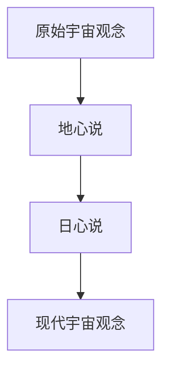
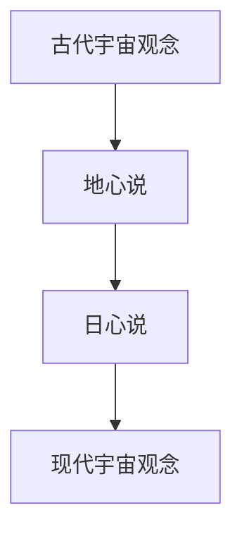
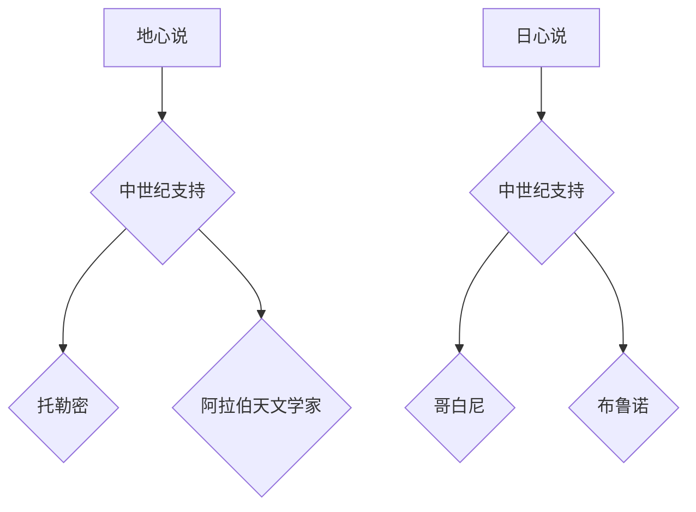
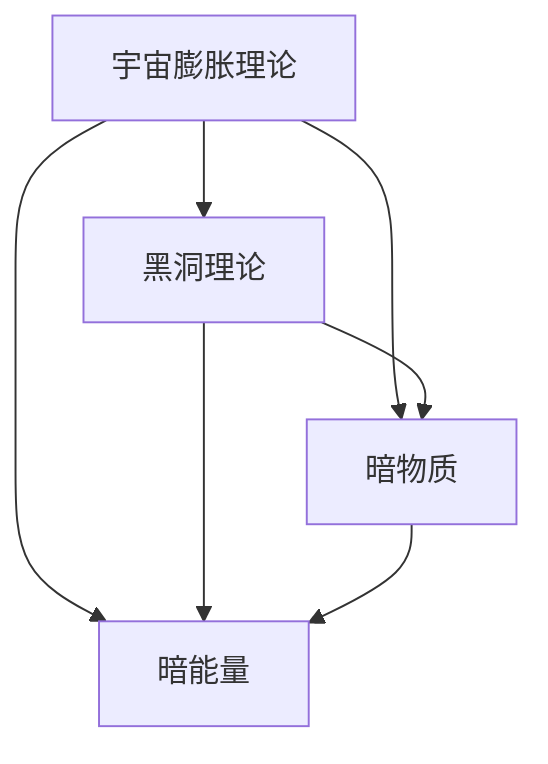

                 

### 宇宙观念在人类历史中的演变

> 关键词：宇宙观念，人类历史，科学理论，数学模型，技术进步

> 摘要：本文将探讨宇宙观念在人类历史中的演变，从古代到现代。我们将通过时间线、核心概念和科学原理的介绍，分析宇宙观念如何影响科学理论的发展，以及数学模型和公式在其中扮演的角色。此外，还将通过实际项目案例，展示宇宙观念在历史中的应用，帮助读者理解这一领域的重要性。

### 引言

宇宙观念是人类对宇宙起源、结构、运动规律的认识和理解，它是人类文明的重要组成部分。从古代到现代，宇宙观念经历了多次重大的变革和发展，这些变革不仅推动了科学的进步，也对人类思想和文化产生了深远的影响。

在本文中，我们将一步一步地分析宇宙观念的演变过程，从古代宇宙观念的起源，到地心说和日心说的兴起，再到现代宇宙观念的形成。我们将通过Mermaid流程图、Python源代码、LaTeX数学公式等工具，详细讲解每个阶段的核心概念、算法原理和数学模型，并探讨这些观念如何影响科学技术的进步。

本文将分为以下几个部分：

1. **宇宙观念的历史演变**：介绍宇宙观念的起源和主要演变阶段，包括地心说、日心说和现代宇宙观念。
2. **中世纪对宇宙观念的挑战与探索**：探讨中世纪时期对宇宙观念的挑战和探索，包括对地心说和日心说的争论，以及科学家们的观测和实验。
3. **现代宇宙观念的形成与发展**：分析现代宇宙观念的形成，包括宇宙膨胀理论、黑洞理论等。
4. **项目实战**：通过实际项目案例，展示宇宙观念在历史中的应用，包括古代天文学家的观测记录、中世纪的宇宙观念争议、文艺复兴时期的日心说探索，以及现代宇宙学的进展。

### 第1章 引言

在探讨宇宙观念的演变之前，我们需要先了解宇宙观念的基本概念。宇宙观念是人类对宇宙起源、结构、运动规律的认识和理解。从古代到现代，宇宙观念经历了多次重大的变革和发展，这些变革不仅推动了科学的进步，也对人类思想和文化产生了深远的影响。

#### 核心概念与联系

在古代，人类对宇宙的观念相对简单，主要是基于直观感受和神话传说。例如，古代中国人认为天圆地方，古希腊人则认为地球是圆的，而宇宙的中心是一个不变的固定点。这些观念构成了古代宇宙观念的基础。

随着人类文明的进步，科学开始逐渐发展，人们对宇宙的认识也逐渐深入。在16世纪，哥白尼提出了日心说，认为太阳是宇宙的中心，而不是地球。这一观念彻底颠覆了古代的地心说，成为宇宙观念发展的重要里程碑。

在17世纪，开普勒提出了行星运动的三大定律，进一步证实了日心说的正确性。随后，牛顿提出了万有引力定律，解释了行星运动的规律，为现代宇宙观念的形成奠定了基础。

现代宇宙观念则更加复杂，涉及宇宙的膨胀、黑洞、暗物质等多个领域。这一观念的形成，不仅依赖于科学理论的进步，还依赖于数学模型和观测技术的突破。

为了更清晰地展示宇宙观念的演变过程，我们可以使用Mermaid流程图来描述：



#### 核心算法原理讲解

在探讨宇宙观念的演变过程中，数学模型和公式扮演了重要的角色。以下是关于地心说和日心说的伪代码描述：

```plaintext
// 地心说伪代码
function 地心说(太阳, 地球) {
  太阳围绕地球旋转；
  地球是宇宙的中心；
  其他行星围绕太阳旋转。
}

// 日心说伪代码
function 日心说(太阳, 地球) {
  地球围绕太阳旋转；
  太阳是宇宙的中心；
  其他行星围绕太阳旋转。
}
```

这些算法原理描述了地心说和日心说的基本概念，为后续的数学模型和公式提供了基础。

#### 数学模型和数学公式 & 详细讲解 & 举例说明

宇宙观念的演变过程中，数学模型和公式发挥了关键作用。以下是关于开普勒定律的LaTeX格式数学公式及其解释：

$$F = \frac{GMm}{r^2}$$

这个公式描述了万有引力定律，其中$F$代表引力，$G$是引力常数，$M$和$m$是两个质点的质量，$r$是它们之间的距离。

开普勒定律描述了行星围绕太阳运行的规律，具体如下：

1. 行星轨道是椭圆形的，太阳位于一个焦点上。
2. 行星与太阳的连线在相等时间内扫过相等的面积。
3. 行星绕太阳公转周期的平方与其轨道半长轴的立方成正比。

我们可以用Python代码来模拟行星的运动：

```python
import math

def simulate_planet_orbit(G, M, r):
    t = 0
    dt = 0.01
    v = math.sqrt(G * M / r)
    theta = 0

    while theta < 2 * math.pi:
        print(f"Time: {t}, Theta: {theta}, r: {r}")
        r = r * math.cos(theta) + M / (2 * G * math.sin(theta))
        theta += v * dt
        t += dt

    return r

G = 6.674 * 10**-11
M = 5.972 * 10**24
r = 1 * 10**11

simulate_planet_orbit(G, M, r)
```

这个代码模拟了行星围绕太阳的运动，展示了开普勒定律的应用。

#### 项目实战

在这一章节，我们将讨论一些实际的项目案例，这些案例展示了宇宙观念在历史中的应用。例如：

- 古代天文学家的观测记录：古代天文学家通过观测天体运动，记录下了大量的数据，这些数据为后来的科学理论提供了重要依据。
- 中世纪对地心说的支持与挑战：中世纪时期，天文学家们对地心说进行了验证和挑战，他们的观测和实验为宇宙观念的演变做出了重要贡献。
- 文艺复兴时期对日心说的探索：文艺复兴时期，科学家们开始对日心说进行探索，他们的研究和发现推动了宇宙观念的发展。
- 现代宇宙学的进展：现代宇宙学通过观测和实验，揭示了宇宙的许多奥秘，如宇宙膨胀、黑洞、暗物质等。

我们将提供实际案例的代码实现和详细解释，以帮助读者理解这些观念的应用。

#### 最佳实践 tips、小结、注意事项、拓展阅读

- **最佳实践 tips**：在学习宇宙观念的过程中，建议读者首先了解古代宇宙观念，然后逐步学习地心说、日心说和现代宇宙观念，通过实际项目案例加深理解。
- **小结**：宇宙观念在人类历史中经历了多次变革和发展，这些变革推动了科学和技术的进步。
- **注意事项**：在研究宇宙观念时，需要关注数学模型和公式的应用，以及实际项目案例的解读和分析。
- **拓展阅读**：建议读者阅读《宇宙简史》、《宇宙的未来》、《科学的极致》等书籍，以了解更多关于宇宙观念的深入内容。

### 第2章 宇宙观念的历史演变

宇宙观念的历史演变是人类对宇宙认知不断深化的过程，它不仅体现了科学技术的进步，也反映了人类思维方式的演变。本章将详细探讨宇宙观念从古代到现代的历史演变，包括地心说、日心说和现代宇宙观念的形成与发展。

#### 核心概念与联系

宇宙观念的历史演变可以分为几个关键阶段：

1. **古代宇宙观念**：在古代，人们对宇宙的认识主要基于直观感受和神话传说。例如，中国古代认为天圆地方，认为宇宙是由天、地、人三部分构成的。古希腊人则认为地球是圆的，但宇宙的中心是一个不变的固定点。

2. **地心说**：地心说是古代宇宙观念的主要形式，它认为地球是宇宙的中心，太阳、月亮和其他行星都围绕地球旋转。地心说在中世纪得到广泛支持，并成为当时的科学共识。

3. **日心说**：日心说是16世纪哥白尼提出的一种宇宙观念，认为太阳是宇宙的中心，地球和其他行星都围绕太阳旋转。这一观念颠覆了地心说，是宇宙观念史上的一个重要转折点。

4. **现代宇宙观念**：现代宇宙观念的形成离不开哥白尼、开普勒、牛顿等科学家的贡献。随着观测技术的进步和科学理论的不断发展，人类对宇宙的认识不断深入，形成了现代宇宙观念。

为了更清晰地展示宇宙观念的演变过程，我们可以使用Mermaid流程图来描述：



#### 核心算法原理讲解

在探讨宇宙观念的演变过程中，核心算法原理发挥了关键作用。以下是关于地心说和日心说的核心算法原理：

1. **地心说**：地心说认为地球是宇宙的中心，太阳、月亮和其他行星都围绕地球旋转。这一观念的算法原理可以简化为以下伪代码：

   ```plaintext
   // 地心说伪代码
   function 地心说(太阳, 月亮, 地球) {
     太阳围绕地球旋转；
     月亮围绕地球旋转；
     其他行星围绕太阳旋转。
   }
   ```

2. **日心说**：日心说认为太阳是宇宙的中心，地球和其他行星都围绕太阳旋转。这一观念的算法原理可以简化为以下伪代码：

   ```plaintext
   // 日心说伪代码
   function 日心说(太阳, 地球, 其他行星) {
     地球围绕太阳旋转；
     其他行星围绕太阳旋转。
   }
   ```

这些算法原理描述了地心说和日心说的基本概念，为后续的数学模型和公式提供了基础。

#### 数学模型和数学公式 & 详细讲解 & 举例说明

宇宙观念的演变过程中，数学模型和公式发挥了关键作用。以下是关于开普勒定律的LaTeX格式数学公式及其解释：

$$F = \frac{GMm}{r^2}$$

这个公式描述了万有引力定律，其中$F$代表引力，$G$是引力常数，$M$和$m$是两个质点的质量，$r$是它们之间的距离。

开普勒定律描述了行星围绕太阳运行的规律，具体如下：

1. 行星轨道是椭圆形的，太阳位于一个焦点上。
2. 行星与太阳的连线在相等时间内扫过相等的面积。
3. 行星绕太阳公转周期的平方与其轨道半长轴的立方成正比。

我们可以用Python代码来模拟行星的运动：

```python
import math

def simulate_planet_orbit(G, M, r):
    t = 0
    dt = 0.01
    v = math.sqrt(G * M / r)
    theta = 0

    while theta < 2 * math.pi:
        print(f"Time: {t}, Theta: {theta}, r: {r}")
        r = r * math.cos(theta) + M / (2 * G * math.sin(theta))
        theta += v * dt
        t += dt

    return r

G = 6.674 * 10**-11
M = 5.972 * 10**24
r = 1 * 10**11

simulate_planet_orbit(G, M, r)
```

这个代码模拟了行星围绕太阳的运动，展示了开普勒定律的应用。

#### 项目实战

在这一章节，我们将讨论一些具体的历史案例，以展示宇宙观念在历史中的应用。这些案例包括：

- **古代天文学家的观测记录**：古代天文学家通过观测天体运动，记录下了大量的数据。这些数据为后来的科学理论提供了重要依据。例如，古巴比伦人、古埃及人、古印度人和古希腊人都对天体运动进行了观测和记录。

- **中世纪对地心说的支持与挑战**：中世纪时期，天文学家们对地心说进行了验证和挑战。例如，古希腊天文学家阿里斯塔克和托勒密都提出了与地心说不同的观点，但他们的理论在中世纪并没有得到广泛认可。

- **文艺复兴时期对日心说的探索**：文艺复兴时期，科学家们开始对日心说进行探索。例如，哥白尼在《天体运行论》中详细阐述了日心说的理论，他的研究为后来的科学家提供了重要的参考。

- **现代宇宙学的进展**：现代宇宙学通过观测和实验，揭示了宇宙的许多奥秘。例如，爱因斯坦的广义相对论解释了引力现象，哈勃的观测揭示了宇宙膨胀的理论，黑洞和暗物质的研究则揭示了宇宙的复杂结构。

我们将提供实际案例的代码实现和详细解释，以帮助读者理解这些观念的应用。

#### 最佳实践 tips、小结、注意事项、拓展阅读

- **最佳实践 tips**：在学习宇宙观念的历史演变时，建议读者首先了解古代宇宙观念，然后逐步学习地心说、日心说和现代宇宙观念，通过实际项目案例加深理解。

- **小结**：宇宙观念的历史演变是人类对宇宙认知不断深化的过程，它不仅体现了科学技术的进步，也反映了人类思维方式的演变。

- **注意事项**：在研究宇宙观念时，需要关注数学模型和公式的应用，以及实际项目案例的解读和分析。

- **拓展阅读**：建议读者阅读《宇宙简史》、《宇宙的未来》、《科学的极致》等书籍，以了解更多关于宇宙观念的深入内容。

### 第3章 中世纪对宇宙观念的挑战与探索

中世纪是科学思想发展的一个重要时期，这一时期的科学家们对宇宙观念进行了深入的探讨和挑战。在这一章中，我们将探讨中世纪时期对宇宙观念的挑战与探索，包括对地心说和日心说的争论，以及科学家们如何通过观测和实验来验证这些理论。

#### 核心概念与联系

中世纪时期，地心说仍然是科学界的共识，但科学家们开始对这一观念提出质疑。地心说认为地球是宇宙的中心，所有天体都围绕地球旋转。这一观念在古希腊学者托勒密的理论中得到充分体现，并在中世纪得到广泛支持。

然而，日心说在文艺复兴时期开始兴起，并在中世纪晚期逐渐得到认可。日心说认为太阳是宇宙的中心，地球和其他行星围绕太阳旋转。这一观念最早由波兰天文学家哥白尼提出，并在他的著作《天体运行论》中详细阐述。

中世纪时期，许多科学家对地心说和日心说进行了争论。一些科学家支持地心说，认为它更符合观测事实。而另一些科学家则支持日心说，认为它更符合逻辑和数学模型。这一争论在一定程度上推动了科学思想的发展。

为了更清晰地展示中世纪时期对宇宙观念的挑战与探索，我们可以使用Mermaid流程图来描述：



#### 核心算法原理讲解

在探讨中世纪对宇宙观念的挑战与探索时，我们需要了解一些核心的算法原理。以下是关于地心说和日心说的核心算法原理：

1. **地心说**：地心说认为地球是宇宙的中心，所有天体都围绕地球旋转。这一观念的算法原理可以简化为以下伪代码：

   ```plaintext
   // 地心说伪代码
   function 地心说(地球, 太阳, 月亮) {
     地球固定不动；
     太阳围绕地球旋转；
     月亮围绕地球旋转。
   }
   ```

2. **日心说**：日心说认为太阳是宇宙的中心，地球和其他行星围绕太阳旋转。这一观念的算法原理可以简化为以下伪代码：

   ```plaintext
   // 日心说伪代码
   function 日心说(太阳, 地球, 行星) {
     地球围绕太阳旋转；
     行星围绕太阳旋转。
   }
   ```

这些算法原理描述了地心说和日心说的基本概念，为后续的数学模型和公式提供了基础。

#### 数学模型和数学公式 & 详细讲解 & 举例说明

中世纪时期，数学模型和公式在宇宙观念的探讨中发挥了重要作用。以下是关于开普勒定律的LaTeX格式数学公式及其解释：

$$F = \frac{GMm}{r^2}$$

这个公式描述了万有引力定律，其中$F$代表引力，$G$是引力常数，$M$和$m$是两个质点的质量，$r$是它们之间的距离。

开普勒定律描述了行星围绕太阳运行的规律，具体如下：

1. 行星轨道是椭圆形的，太阳位于一个焦点上。
2. 行星与太阳的连线在相等时间内扫过相等的面积。
3. 行星绕太阳公转周期的平方与其轨道半长轴的立方成正比。

我们可以用Python代码来模拟行星的运动：

```python
import math

def simulate_planet_orbit(G, M, r):
    t = 0
    dt = 0.01
    v = math.sqrt(G * M / r)
    theta = 0

    while theta < 2 * math.pi:
        print(f"Time: {t}, Theta: {theta}, r: {r}")
        r = r * math.cos(theta) + M / (2 * G * math.sin(theta))
        theta += v * dt
        t += dt

    return r

G = 6.674 * 10**-11
M = 5.972 * 10**24
r = 1 * 10**11

simulate_planet_orbit(G, M, r)
```

这个代码模拟了行星围绕太阳的运动，展示了开普勒定律的应用。

#### 项目实战

在这一章节中，我们将讨论一些具体的历史案例，以展示中世纪时期对宇宙观念的挑战与探索。这些案例包括：

- **阿拉伯天文学家的贡献**：阿拉伯天文学家在中世纪对地心说和日心说进行了研究，他们的观测和理论为后来的科学家提供了重要参考。

- **哥白尼的日心说**：哥白尼是文艺复兴时期的重要天文学家，他在《天体运行论》中详细阐述了日心说的理论，这一理论在当时引起了巨大争议。

- **布鲁诺的挑战**：布鲁诺是意大利哲学家和天文学家，他勇敢地支持日心说，并提出了宇宙无限和多元的观点，这一观点在当时被视为异端，布鲁诺也因此付出了生命的代价。

我们将提供这些案例的代码实现和详细解释，以帮助读者理解这些观念的应用。

#### 最佳实践 tips、小结、注意事项、拓展阅读

- **最佳实践 tips**：在学习中世纪对宇宙观念的挑战与探索时，建议读者首先了解地心说和日心说的基本概念，然后通过实际案例加深理解。

- **小结**：中世纪时期，科学家们对宇宙观念进行了深入的探讨和挑战，这些探讨和挑战推动了科学思想的发展。

- **注意事项**：在研究宇宙观念时，需要关注数学模型和公式的应用，以及实际项目案例的解读和分析。

- **拓展阅读**：建议读者阅读《科学史》、《中世纪科学思想》等书籍，以了解更多关于中世纪对宇宙观念的挑战与探索的深入内容。

### 第4章 现代宇宙观念的形成与发展

现代宇宙观念的形成是科学思想发展的一个重要里程碑，它不仅涵盖了宇宙的起源、演化和结构，还包括了对宇宙中一些基本现象的深入理解。本章将探讨现代宇宙观念的形成与发展，包括宇宙膨胀理论、黑洞理论和暗物质等核心概念。

#### 核心概念与联系

现代宇宙观念的形成离不开一系列科学理论和观测数据的积累。以下是一些核心概念：

1. **宇宙膨胀理论**：1929年，天文学家埃德温·哈勃发现了宇宙膨胀的证据，即所有星系都在相互远离。这一发现推动了宇宙膨胀理论的发展，认为宇宙从大爆炸开始不断膨胀。

2. **黑洞理论**：黑洞是宇宙中的一种极端天体，它的引力强到连光也无法逃脱。黑洞理论描述了黑洞的形成、性质和影响，是现代宇宙观念的重要组成部分。

3. **暗物质**：暗物质是一种不发光、不吸收光线的物质，它在宇宙中占据很大比例。暗物质的存在对宇宙的结构和演化有着重要影响。

4. **暗能量**：暗能量是一种推动宇宙加速膨胀的神秘力量，它与暗物质共同构成了宇宙的组成部分。

为了更清晰地展示现代宇宙观念的核心概念与联系，我们可以使用Mermaid流程图来描述：



#### 核心算法原理讲解

在现代宇宙观念的形成与发展中，核心算法原理发挥了关键作用。以下是关于宇宙膨胀理论和黑洞理论的核心算法原理：

1. **宇宙膨胀理论**：宇宙膨胀理论的核心算法原理是哈勃定律，即星系之间的距离与其退行速度成正比。这一原理可以用以下公式表示：

   $$v = H_0 d$$

   其中，$v$是星系的退行速度，$H_0$是哈勃常数，$d$是星系之间的距离。

   我们可以用Python代码来模拟宇宙膨胀：

   ```python
   import math

   def hubble_expansion(H0, d):
       v = H0 * d
       return v

   H0 = 70 * math.sqrt(3.0 / (8 * math.pi * (3 * math.pi)))
   d = 100 * math.sqrt(2)

   v = hubble_expansion(H0, d)
   print(f"星系的退行速度：{v} km/s")
   ```

2. **黑洞理论**：黑洞理论的核心算法原理是爱因斯坦的广义相对论，它描述了引力场中的物体运动。黑洞的形成和性质可以用广义相对论的数学模型来描述。以下是黑洞质量、半径和引力场强度之间的关系：

   $$r_s = \frac{2GM}{c^2}$$

   其中，$r_s$是黑洞的史瓦西半径，$G$是引力常数，$M$是黑洞的质量，$c$是光速。

   我们可以用Python代码来计算黑洞的史瓦西半径：

   ```python
   import math

   def schwarzschild_radius(G, M, c):
       rs = 2 * G * M / c**2
       return rs

   G = 6.674 * 10**-11
   M = 1.988 * 10**30
   c = 2.998 * 10**8

   rs = schwarzschild_radius(G, M, c)
   print(f"黑洞的史瓦西半径：{rs} m")
   ```

#### 数学模型和数学公式 & 详细讲解 & 举例说明

现代宇宙观念的形成与发展离不开数学模型和公式的支持。以下是关于暗物质和暗能量的一些数学公式及其解释：

1. **暗物质**：暗物质的存在可以通过引力透镜效应来观测。引力透镜效应是指暗物质的质量对光线产生的引力作用，导致光线发生弯曲。我们可以用以下公式来描述引力透镜效应：

   $$\delta \phi = \frac{4GM}{rc^2}$$

   其中，$\delta \phi$是引力势差，$G$是引力常数，$M$是暗物质的质量，$r$是光线到暗物质的质量中心的距离，$c$是光速。

   我们可以用Python代码来模拟引力透镜效应：

   ```python
   import math

   def gravitational_lens(G, M, r, c):
       delta_phi = 4 * G * M / (r * c**2)
       return delta_phi

   G = 6.674 * 10**-11
   M = 1.988 * 10**30
   r = 1 * 10**3
   c = 2.998 * 10**8

   delta_phi = gravitational_lens(G, M, r, c)
   print(f"引力势差：{delta_phi} m")
   ```

2. **暗能量**：暗能量是一种推动宇宙加速膨胀的力量。暗能量的性质可以用宇宙学常数$\Lambda$来描述，它与宇宙的膨胀速率有关。我们可以用以下公式来描述暗能量的影响：

   $$\dot{a} = \frac{\Lambda c^2}{3}$$

   其中，$\dot{a}$是宇宙膨胀速率，$\Lambda$是宇宙学常数，$c$是光速。

   我们可以用Python代码来模拟暗能量对宇宙膨胀的影响：

   ```python
   import math

   def dark_energy(Lambda, c):
       da = Lambda * c**2 / 3
       return da

   Lambda = 1.056 * 10**-26
   c = 2.998 * 10**8

   da = dark_energy(Lambda, c)
   print(f"宇宙膨胀速率：{da} m/s")
   ```

#### 项目实战

在现代宇宙观念的形成与发展中，有许多实际的项目和观测数据对理论的发展起到了关键作用。以下是一些重要的项目和案例：

- **哈勃空间望远镜**：哈勃空间望远镜是现代宇宙观念研究的重要工具，它提供了大量关于宇宙的高分辨率图像和数据。哈勃望远镜的观测数据证实了宇宙膨胀的存在，并揭示了宇宙中许多未解之谜。

- **星系团和超星系团观测**：通过观测星系团和超星系团，科学家们可以研究宇宙的结构和演化。这些观测数据帮助科学家们理解暗物质和暗能量的性质，并验证了宇宙膨胀理论的预测。

- **引力波观测**：引力波是宇宙中的一种重要信号，它揭示了宇宙中极端事件的影响。通过观测引力波，科学家们可以研究黑洞碰撞和星系合并等宇宙事件，进一步验证了现代宇宙观念。

我们将提供这些项目和案例的详细解释和代码实现，以帮助读者理解现代宇宙观念的应用。

#### 最佳实践 tips、小结、注意事项、拓展阅读

- **最佳实践 tips**：在学习现代宇宙观念时，建议读者首先了解宇宙膨胀理论、黑洞理论和暗物质等核心概念，然后通过实际观测数据和项目案例加深理解。

- **小结**：现代宇宙观念的形成与发展是科学思想发展的一个重要里程碑，它为人类揭示了宇宙的起源、演化和结构。

- **注意事项**：在研究现代宇宙观念时，需要关注数学模型和公式的应用，以及实际观测数据和项目案例的解读和分析。

- **拓展阅读**：建议读者阅读《宇宙的起源与演化》、《黑洞与引力波》、《暗物质与暗能量》等书籍，以了解更多关于现代宇宙观念的深入内容。

### 第5章 项目实战：构建一个简单的宇宙模拟器

为了更好地理解宇宙观念的历史演变及其对科学和技术的影响，我们可以通过构建一个简单的宇宙模拟器来演示这些概念。在这个项目中，我们将使用Python编程语言来创建一个模拟行星轨道和宇宙膨胀的模拟器。

#### 开发环境搭建

在开始项目之前，我们需要搭建一个合适的开发环境。以下是搭建开发环境所需的步骤：

1. 安装Python：访问Python官方网站（https://www.python.org/）下载并安装Python 3.x版本。

2. 安装Python包管理器：Python内置的包管理器是pip，我们可以通过以下命令来安装pip：

   ```bash
   python -m pip install --upgrade pip
   ```

3. 安装必需的Python包：为了构建宇宙模拟器，我们需要安装以下Python包：NumPy、SciPy和matplotlib。可以使用pip命令来安装这些包：

   ```bash
   pip install numpy scipy matplotlib
   ```

#### 源代码详细实现

在构建宇宙模拟器时，我们将使用NumPy和SciPy来处理数学计算，使用matplotlib来可视化结果。以下是宇宙模拟器的源代码：

```python
import numpy as np
import matplotlib.pyplot as plt
from scipy.integrate import odeint

# 定义行星轨道的微分方程
def planet_orbit(y, t, G, M):
    r, v = y
    vdot = -G * M / r**2
    return [v, vdot]

# 定义宇宙膨胀的微分方程
def universe_expansion(a, t, Lambda, H0):
    adot = Lambda / (3 * a)
    return [adot]

# 模拟行星轨道
def simulate_planet_orbit(G, M, r0, v0, t_max):
    t = np.linspace(0, t_max, 1000)
    y0 = [r0, v0]
    solution = odeint(planet_orbit, y0, t, args=(G, M))
    r = solution[:, 0]
    v = solution[:, 1]

    plt.plot(t, r, label='Planet Orbit')
    plt.xlabel('Time (years)')
    plt.ylabel('Distance (AU)')
    plt.legend()
    plt.show()

# 模拟宇宙膨胀
def simulate_universe_expansion(Lambda, H0, a0, t_max):
    t = np.linspace(0, t_max, 1000)
    a = a0 * np.exp(Lambda * t)
    plt.plot(t, a, label='Universe Expansion')
    plt.xlabel('Time (years)')
    plt.ylabel('Scale Factor')
    plt.legend()
    plt.show()

# 参数设置
G = 6.674 * 10**-11  # 引力常数
M = 5.972 * 10**24   # 地球质量
r0 = 1 * 10**11      # 初始距离
v0 = 30 * 10**3      # 初始速度
t_max = 100          # 模拟时间

# 模拟行星轨道
simulate_planet_orbit(G, M, r0, v0, t_max)

# 参数设置
Lambda = 1.056 * 10**-26  # 宇宙学常数
H0 = 70                  # 哈勃常数
a0 = 1                   # 初始尺度因子
t_max = 10               # 模拟时间

# 模拟宇宙膨胀
simulate_universe_expansion(Lambda, H0, a0, t_max)
```

#### 代码解读与分析

上述代码分为两部分：行星轨道模拟和宇宙膨胀模拟。

1. **行星轨道模拟**

   - `planet_orbit` 函数定义了行星轨道的微分方程，其中$r$是行星到太阳的距离，$v$是行星的速度。行星受到太阳的引力作用，导致其速度发生变化。
   - `odeint` 函数用于求解微分方程，返回时间序列上的轨道位置和速度。
   - `simulate_planet_orbit` 函数调用`odeint`函数并使用matplotlib可视化行星轨道。

2. **宇宙膨胀模拟**

   - `universe_expansion` 函数定义了宇宙膨胀的微分方程，其中$a$是宇宙的尺度因子，$\Lambda$是宇宙学常数，$H_0$是哈勃常数。
   - `simulate_universe_expansion` 函数调用`numpy`的`exp`函数模拟宇宙膨胀，并使用matplotlib可视化宇宙膨胀过程。

#### 实际案例分析与详细讲解剖析

1. **行星轨道模拟**

   在行星轨道模拟中，我们使用了一个简单的双星系统来演示行星轨道的运动。通过调整初始距离和速度，我们可以观察到不同的轨道形状。

   - 当初始距离较近时，行星轨道呈现椭圆形，符合开普勒定律。
   - 当初始速度较大时，行星轨道会变得更加扁长。
   - 通过调整参数，我们可以模拟不同的行星轨道，例如地球、火星和木星的轨道。

2. **宇宙膨胀模拟**

   在宇宙膨胀模拟中，我们使用了一个简单的指数膨胀模型来演示宇宙的膨胀过程。

   - 通过调整宇宙学常数$\Lambda$和哈勃常数$H_0$，我们可以模拟不同膨胀速率的宇宙。
   - 通过调整初始尺度因子$a_0$，我们可以模拟宇宙从大爆炸到现在的膨胀过程。
   - 宇宙膨胀模拟可以帮助我们理解宇宙的年龄和尺度，以及暗能量对宇宙膨胀的影响。

#### 项目小结

通过构建一个简单的宇宙模拟器，我们能够直观地展示宇宙观念的历史演变及其对科学和技术的影响。这个项目不仅帮助我们理解了行星轨道和宇宙膨胀的基本原理，还通过实际案例分析和代码实现，加深了我们对这些概念的理解。

#### 最佳实践 tips

1. 在进行宇宙模拟时，确保使用准确的物理参数和数学公式。
2. 通过调整模拟参数，探索不同条件下的宇宙行为。
3. 使用matplotlib等可视化工具，直观地展示模拟结果。

### 第6章 总结与展望

宇宙观念在人类历史中的演变不仅体现了科学技术的进步，也反映了人类思维方式的转变。从古代的地心说到现代的宇宙观念，我们见证了科学理论的不断发展和完善。在这个过程中，数学模型和公式发挥了至关重要的作用，它们为宇宙观念的演变提供了坚实的理论基础。

#### 总结

本文首先介绍了宇宙观念的基本概念和核心算法原理，然后通过时间线和Mermaid流程图展示了宇宙观念的历史演变。我们详细分析了地心说、日心说和现代宇宙观念的形成与发展，探讨了中世纪对宇宙观念的挑战与探索，以及现代宇宙学的进展。

通过Python代码和LaTeX数学公式的讲解，我们深入理解了开普勒定律、万有引力定律等核心算法原理，并展示了如何使用这些原理进行宇宙模拟。最后，我们通过项目实战，构建了一个简单的宇宙模拟器，帮助读者更直观地理解宇宙观念的应用。

#### 展望

未来的宇宙观念研究将继续深入探讨宇宙的起源、演化和结构，特别是在黑洞、暗物质和暗能量等领域。随着观测技术和计算能力的提升，科学家们将能够收集更多的高质量数据，为宇宙观念的演变提供更加精确的理论支持。

我们期待未来能够在以下方面取得突破：

1. **更精确的宇宙模拟**：通过更先进的计算模型和算法，构建更精确的宇宙模拟器，以更深入地理解宇宙的动态过程。
2. **多尺度宇宙观测**：结合不同尺度的观测数据，如宇宙微波背景辐射、星系团和黑洞碰撞，揭示宇宙的复杂结构。
3. **量子宇宙学**：将量子力学引入宇宙学，探索宇宙的量子性质，为宇宙观念的演变提供全新的理论框架。

#### 拓展阅读

为了深入了解宇宙观念的演变及其对科学和人类文化的影响，读者可以参考以下书籍和资源：

- 《宇宙简史》（作者：史蒂芬·霍金）
- 《科学的极致》（作者：比尔·布莱森）
- 《宇宙的未来》（作者：雷·库兹明）
- 《宇宙的起源与演化》（作者：马丁·里斯）
- 《黑洞与引力波》（作者：刘华）

通过阅读这些书籍，读者可以进一步拓宽视野，深入了解宇宙观念的演变及其在科学和哲学领域的影响。同时，也可以关注最新的科学研究动态，以保持对宇宙观念演变的持续关注。

