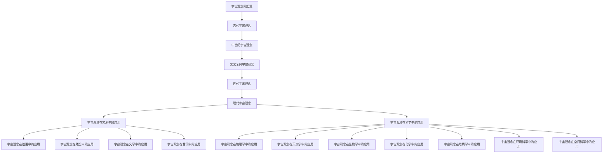

                 

### 引言

在人类历史的长河中，宇宙观念的演变与人类文明的进步息息相关。宇宙观念不仅反映了人类对自然世界的认知和理解，更在艺术与科学领域产生了深远的影响。本文旨在探讨宇宙观念在艺术与科学中的表现，通过逻辑清晰、结构紧凑、简单易懂的专业技术语言，对这一主题进行深入的剖析。

**关键词**：宇宙观念、艺术、科学、演变、表现、影响

**摘要**：本文首先回顾了宇宙观念的历史演变，从古代到现代，探讨了不同历史时期宇宙观念的变化。随后，文章分别从艺术和科学的视角，分析了宇宙观念在绘画、雕塑、文学、音乐、物理学、天文学和生物学中的应用。最后，文章总结了宇宙观念的综合表现，并探讨了其未来发展趋势。

本文结构如下：

- **第一部分**：宇宙观念的概述，包括古代、中世纪、文艺复兴时期和近代宇宙观念的演变。
- **第二部分**：宇宙观念在艺术中的表现，涉及绘画、雕塑、文学和音乐。
- **第三部分**：宇宙观念在科学中的表现，包括物理学、天文学和生物学。
- **第四部分**：宇宙观念的综合表现，探讨跨学科研究、哲学、宗教、心理学和经济学中的宇宙观念。
- **第五部分**：宇宙观念的未来发展趋势，展望人工智能、空间探索和可持续发展中的宇宙观念。

通过本文的阅读，读者将全面了解宇宙观念的形成、演变及其在各个领域的应用，从而对宇宙观念在艺术与科学中的表现有更深刻的认识。### 第一部分：宇宙观念的概述

#### 1. 古代宇宙观念

古代宇宙观念的形成是人类对自然世界的最初认知和解释。在古代，人们往往将宇宙视为一个有序的系统，由神或神话中的存在所支配。这种观念体现在多种文化中，如古希腊、古埃及、古印度和中国。

在古希腊，宇宙观念主要体现在哲学家们的思想中。泰勒斯认为宇宙是无限的，而赫拉克利特则提出了“宇宙万物皆流”的观点。毕达哥拉斯认为宇宙是一个数学结构，所有事物都遵循数学比例。亚里士多德则提出了地心说的宇宙模型，认为地球是宇宙的中心，而星辰则围绕地球旋转。

古埃及的宇宙观念则与神灵和祭祀活动密切相关。他们相信宇宙是由神灵创造的，而太阳和星辰则代表着神灵的力量。古印度哲学中的宇宙观念则包括梵天、湿婆和毗湿奴等神的创造和维持宇宙的循环。

在中国，古代宇宙观念体现在道家的哲学思想中。道家认为宇宙是一个自然的过程，万物都是相互联系、相互转化的。这种宇宙观在《易经》和《道德经》等经典中得到了体现。

#### 2. 中世纪宇宙观念

中世纪宇宙观念受到宗教和哲学的影响，尤其是基督教和伊斯兰教。在中世纪，宇宙被看作是上帝创造的秩序，宇宙中的每一个事物都有其神圣的意义和目的。

基督教的宇宙观念认为宇宙是上帝创造的，天堂和地狱是灵魂的归宿。伊斯兰教的宇宙观念则强调宇宙的统一和秩序，认为宇宙是安拉（真主）的创造。

在这一时期，宇宙观念的另一个重要特点是地心说。地心说认为地球是宇宙的中心，而星辰则围绕地球旋转。这一观念在托勒密的《天文学大成》中得到了系统阐述。

#### 3. 文艺复兴时期的宇宙观念

文艺复兴时期是宇宙观念发生重大变化的时期。随着人类对自然世界的认知逐渐深入，人们对宇宙的理解也开始发生变革。

文艺复兴时期的宇宙观念主要体现在哥白尼的日心说。哥白尼提出了日心说，认为太阳是宇宙的中心，而地球则围绕太阳旋转。这一观点与地心说相悖，引发了科学革命。

此外，文艺复兴时期的艺术家们也开始用更加科学和理性的方式表现宇宙。达芬奇、米开朗基罗等艺术家通过绘画和雕塑，展现了他们对宇宙的理解和想象。

#### 4. 近代宇宙观念的演变

近代宇宙观念的演变主要体现在牛顿力学、相对论和量子力学的发展中。牛顿力学提出了万有引力定律和运动定律，为宇宙观念提供了新的解释。

牛顿力学中的宇宙观念认为宇宙是一个机械系统，所有物体都遵循物理定律。这一观念在启蒙运动中得到了广泛传播，影响了人类社会的发展。

相对论则提出了时空相对性的概念，认为时间和空间不是绝对不变的，而是与观察者的运动状态有关。这一观念颠覆了传统的宇宙观念，对现代物理学产生了深远影响。

量子力学中的宇宙观念则更加复杂和神秘。量子力学揭示了微观世界的规律，如量子态的叠加性和量子纠缠。这些现象挑战了我们对宇宙的传统理解。

综上所述，宇宙观念从古代到现代经历了巨大的演变。从神话和宗教到科学和哲学，宇宙观念的演变反映了人类对自然世界的不断探索和理解。### 第二部分：宇宙观念在艺术中的表现

宇宙观念在艺术中的表现是多元而丰富的，艺术家们通过不同的媒介和技巧，将宇宙的奥秘和美呈现给观众。以下是宇宙观念在绘画、雕塑、文学和音乐中的具体表现。

#### 1. 宇宙观念在绘画中的表现

绘画是艺术家表达宇宙观念的重要手段之一。在绘画中，宇宙观念可以通过对星空、天文现象、宇宙结构以及宇宙与生命的关系的表现来展现。

例如，荷兰画家艾萨克·牛顿在17世纪创作的《月面图》，通过细致入微的描绘，展现了月球表面的细节，反映了人类对月球和宇宙的认知。另一位重要的艺术家是法国印象派画家克劳德·莫奈，他的《睡莲》系列作品通过光影的变化，捕捉了宇宙中自然界的和谐美。

在现代艺术中，抽象表现主义画家如杰克逊·波洛克，通过随意挥洒的线条和色块，表现了宇宙中无序和混沌的美。他的《1947号》作品，展现了宇宙中的能量流动和动态变化。

#### 2. 宇宙观念在雕塑中的表现

雕塑是另一种表现宇宙观念的艺术形式。通过立体的形式，雕塑家可以创造出宇宙中的物体和结构，使观众直观地感受到宇宙的宏伟和神秘。

意大利文艺复兴大师米开朗基罗的《创世纪》雕塑作品，位于西斯廷教堂的天花板上，通过描绘圣经中创造宇宙的场景，展现了宇宙的起源和生命的诞生。另一位重要的雕塑家是亨利·摩尔，他的作品如《内部人体》系列，通过抽象的形式，表现了宇宙中人类的内在精神和宇宙的统一性。

#### 3. 宇宙观念在文学中的表现

文学是表达宇宙观念的另一种重要方式。通过文字，作家可以描绘宇宙的广阔和神秘，探讨人类在宇宙中的位置和意义。

英国作家威廉·莎士比亚的《暴风雨》，通过描绘海洋和天空的景象，展现了宇宙的力量和神秘。俄国作家弗拉基米尔·纳博科夫的《微物之神》，则通过微小的生物和自然现象，探讨了宇宙的无限和人类生命的脆弱。

现代作家如美国作家凯瑟琳·安妮·波特，通过短篇小说的形式，描绘了宇宙中的孤独和荒凉。她的作品《我们未曾学会如何死亡》，通过描绘一个荒凉的星球，表达了宇宙的冷酷和无情。

#### 4. 宇宙观念在音乐中的表现

音乐是表达宇宙观念的独特方式。通过旋律、节奏和和声，作曲家可以创造出宇宙的宏伟和神秘。

古典音乐家约翰·塞巴斯蒂安·巴赫的《太空交响曲》，通过复杂的旋律和和声结构，展现了宇宙的神秘和无限。另一位重要的作曲家是荷兰作曲家约翰内斯·库普曼，他的《星空》作品，通过音乐的起伏和变化，捕捉了宇宙中星辰的光辉和星空的宁静。

在现代音乐中，爵士乐大师约翰·科尔特雷恩的《太空集体演奏》，通过即兴演奏，展现了宇宙中无序和混沌的美。

综上所述，宇宙观念在绘画、雕塑、文学和音乐中的表现，使得艺术成为探讨宇宙奥秘和表达人类情感的独特途径。艺术家们通过不同的媒介和技巧，将宇宙的美丽、神秘和深奥呈现给观众，激发了人们对宇宙的无限想象和探索欲望。### 第二部分：宇宙观念在艺术中的表现（续）

#### 1. 宇宙观念在绘画中的表现

宇宙观念在绘画中的表现不仅仅是对天文现象的描绘，还体现在对宇宙本质的探索和哲学思考上。文艺复兴时期的艺术家们如达芬奇和丢勒，他们的作品《最后的审判》和《骑士、死亡和恶魔》中，将宇宙的神秘和人类的命运交织在一起，探讨了宇宙中生命的意义。

现代艺术家如马克·夏卡尔，他的画作《亚当与夏娃》和《宇宙》，通过抽象和象征手法，表现了宇宙的无限和人类与宇宙的和谐。夏卡尔的画作常常以几何形状和色彩组合来象征宇宙的结构和能量流动。

另外，数字艺术家如克里斯·吉布森，通过计算机生成的图像，展现了宇宙的广阔和复杂性。他的作品如《星云》系列，通过三维建模和光线追踪技术，捕捉了宇宙中星云、星系和黑洞的壮丽景象。

#### 2. 宇宙观念在雕塑中的表现

宇宙观念在雕塑中的表现往往通过立体造型和空间结构来传达宇宙的奥秘和美。西班牙雕塑家安德里亚斯·古尔斯基的《星门》，通过金属网状结构，象征宇宙的无限和探索的可能性。这座雕塑给人以视觉上的冲击，让人感受到宇宙的无限广阔。

美国雕塑家亚历山大·卡尔德的《星群》，通过悬挂的金属片和线条，表现了宇宙中的星辰和星系。他的雕塑作品常常采用动态的形式，使观众在移动中感受到宇宙的节奏和韵律。

此外，中国当代艺术家徐冰的《地书》，通过在地面上的痕迹和符号，探讨了宇宙中人类的存在和宇宙的演变。他的作品通过简洁的线条和图案，表现了宇宙中复杂的信息和秩序。

#### 3. 宇宙观念在文学中的表现

宇宙观念在文学中的表现常常通过对宇宙的想象和哲学思考来展现人类在宇宙中的位置和意义。美国作家库尔特·冯内古特的《五号屠场》，通过对战争和人类存在的探讨，反映了宇宙的无意义和荒诞。

英国作家道格拉斯·亚当斯的《银河系漫游指南》，通过幽默和科幻元素，展现了宇宙的多样性和人类对未知世界的探索。这部作品不仅是对宇宙的幽默诠释，也反映了人类在宇宙中的脆弱和渺小。

此外，印度作家阿兰达蒂·洛伊的《微笑的鱼》，通过描绘一个小镇上的故事，探讨了人类与自然、宇宙的关系。这部小说通过丰富的象征手法，展现了宇宙中生命的多样性和宇宙的美丽。

#### 4. 宇宙观念在音乐中的表现

宇宙观念在音乐中的表现往往通过旋律、节奏和和声来传达宇宙的宏大和神秘。古典音乐家约翰·凯奇的作品《4'33"》，通过对静默的探索，展现了宇宙的静谧和无声的力量。

现代音乐家菲利普·格拉斯的《行星》，通过不同乐器的组合和旋律的变化，描绘了行星之间的相互作用和宇宙的多样性。这部作品不仅是对宇宙的赞美，也是对人类在宇宙中地位的思考。

另外，爵士乐大师约翰·科尔特雷恩的《行星群》，通过即兴演奏和复杂的和声结构，展现了宇宙中的无限可能和探索精神。这部作品通过对不同星球和宇宙现象的模仿和表现，激发了人们对宇宙的无限遐想。

综上所述，宇宙观念在艺术中的表现是多维度的，通过绘画、雕塑、文学和音乐等不同的艺术形式，艺术家们以独特的方式传达了宇宙的神秘、美丽和深奥。他们的作品不仅丰富了人类对宇宙的理解，也激发了人们对宇宙的无限探索和思考。### 第三部分：宇宙观念在科学中的表现

宇宙观念在科学领域的表现主要体现在物理学、天文学和生物学等学科中。这些学科通过理论和实验，不断深化我们对宇宙的认识，揭示了宇宙的本质和规律。

#### 3.1 宇宙观念在物理学中的表现

物理学是研究物质和能量及其相互作用的科学。在物理学中，宇宙观念的表现可以从牛顿力学、相对论和量子力学三个方面来探讨。

**1. 牛顿力学中的宇宙观念**

牛顿力学是经典物理学的基础，其核心理论包括三大运动定律和万有引力定律。牛顿力学中的宇宙观念主要体现在以下几个方面：

- **宇宙是机械的**：牛顿认为宇宙是一个巨大的机械系统，所有物体都遵循物理定律。
- **宇宙是绝对的**：牛顿力学认为时间和空间是绝对的，不受观察者的影响。
- **万有引力**：牛顿的万有引力定律揭示了物体之间的相互作用，即任何两个物体都会相互吸引。

以下是牛顿引力定律的Python代码实现：

```python
def calculate_gravity_force(m1, m2, r):
    G = 6.674 * 10**-11  # 引力常数
    return G * m1 * m2 / r**2
```

**2. 相对论中的宇宙观念**

爱因斯坦的相对论提出了全新的宇宙观念，主要包括狭义相对论和广义相对论。

- **时空相对性**：狭义相对论指出，时间和空间是相对的，而不是绝对的。观察者的运动状态会影响时间的流逝和空间的测量。
- **能量-质量等价性**：广义相对论中的质能等价原理（E=mc^2）表明，能量和质量是等价的，质量可以转化为能量。

以下是时空相对性的Python代码实现：

```python
def calculate_time_dilation(v):
    c = 3 * 10**8  # 光速
    return (1 - v**2 / c**2)**0.5
```

**3. 量子力学中的宇宙观念**

量子力学是研究微观世界的物理学分支，其基本原理挑战了我们对宇宙的传统理解。

- **量子态的叠加性**：量子态可以同时处于多种可能的状态，直到被测量时才会确定。
- **量子纠缠**：两个或多个量子态之间可以产生一种特殊的关联，即使它们相隔很远，其中一个粒子的状态变化也会立即影响到另一个粒子。

以下是量子态叠加的Python代码实现：

```python
def calculate_quantum_state():
    # 在此模拟量子态叠加
    return [1, 0]  # 基态和第一激发态的叠加
```

#### 3.2 宇宙观念在天文学中的表现

天文学是研究宇宙中天体的科学。宇宙观念在天文学中的表现主要体现在宇宙学、行星科学和天体物理学中。

**1. 宇宙学**

宇宙学是研究宇宙的起源、结构和演化的科学。现代宇宙学中的宇宙观念包括：

- **宇宙膨胀**：哈勃观测表明，宇宙正在膨胀。
- **暗物质和暗能量**：宇宙中存在大量看不见的物质和能量，它们对宇宙的演化起着关键作用。

**2. 行星科学**

行星科学是研究行星、卫星和其他太阳系物体的科学。宇宙观念在行星科学中的表现包括：

- **行星形成**：行星是通过太阳系中的尘埃和气体聚集形成的。
- **行星特征**：不同行星具有不同的特征，如地球的水、火星的红色和木星的巨大行星环。

**3. 天体物理学**

天体物理学是研究天体物理现象和过程的科学。宇宙观念在天体物理学中的表现包括：

- **恒星形成和演化**：恒星是通过尘埃和气体的聚集形成的，并经历不同的演化阶段。
- **黑洞和引力波**：黑洞是宇宙中一种极其密集的天体，引力波是宇宙中的一种现象。

#### 3.3 宇宙观念在生物学中的表现

生物学是研究生命现象和生物体的科学。宇宙观念在生物学中的表现主要体现在进化论、生态系统研究和生态学中。

**1. 进化论**

进化论是研究生物进化的科学。宇宙观念在进化论中的表现包括：

- **共同祖先**：所有生物都源于共同的祖先。
- **自然选择**：生物通过适应环境来进化。

**2. 生态系统研究**

生态系统研究是研究生物与其环境之间相互作用和相互依赖的科学。宇宙观念在生态系统研究中的表现包括：

- **生物多样性**：生物多样性是生态系统稳定性的关键。
- **生态平衡**：生态系统中的各种生物相互依存，维持生态平衡。

**3. 生态学**

生态学是研究生物之间以及生物与环境之间相互作用的科学。宇宙观念在生态学中的表现包括：

- **生态网络**：生态系统中的生物形成一个复杂的网络，各种生物相互作用，维持生态系统的稳定。
- **可持续发展**：人类活动必须考虑到对生态系统的长期影响，实现可持续发展。

通过物理学、天文学和生物学的深入研究，科学家们不断揭示宇宙的本质和规律，深化了我们对宇宙的理解。这些科学发现不仅推动了科技的进步，也丰富了人类对宇宙的认识，激发了我们对宇宙的无限探索和思考。### 第三部分：宇宙观念在科学中的表现（续）

#### 3.4 宇宙观念在化学中的表现

宇宙观念在化学中的表现主要体现在对宇宙中元素和化合物的起源与分布的研究。化学家们通过实验和理论模型，揭示了宇宙中化学过程的基本原理。

**1. 元素周期表**

元素周期表是化学的基础，它展示了宇宙中已知的所有元素。元素周期表不仅反映了元素的原子结构和电子排布，还揭示了元素在宇宙中的起源和分布。通过恒星核聚变过程，宇宙中形成了轻元素，如氢、氦和锂。随着恒星演化的进程，更重的元素通过超新星爆炸和行星形成等过程得以形成。

**2. 化学键**

化学键是连接原子形成分子的基本力。在宇宙中，化学键的形成和断裂是化学反应的基础。通过研究化学键的性质，科学家们能够理解宇宙中各种化合物的形成和演化过程。

**3. 星际化学**

星际化学研究宇宙中的化学反应和物质分布。通过观测星际尘埃和星云，科学家们发现了许多宇宙中存在的有机分子，如氨基酸和甲醇。这些有机分子的发现为生命起源研究提供了重要线索。

#### 3.5 宇宙观念在地质学中的表现

地质学是研究地球及其演化的科学。宇宙观念在地质学中的表现主要体现在对地球形成、结构和地质过程的探讨。

**1. 地球形成**

地球形成于大约46亿年前，是通过太阳系中的尘埃和气体聚集形成的。地球的形成过程受到宇宙引力和行星碰撞的影响。宇宙观念在地球形成研究中的表现包括对太阳系起源和演化过程的理解。

**2. 地质循环**

地质循环包括岩石循环、生物循环和水循环。宇宙观念在地质循环研究中的表现包括对地球内部和表面的物质运动和能量转换过程的探讨。

**3. 地质过程**

地质过程如地震、火山喷发、岩浆活动和地壳运动，都是地球表面和内部物质运动的结果。宇宙观念在地质过程研究中的表现包括对地震波传播、地幔对流和板块构造等过程的深入研究。

#### 3.6 宇宙观念在环境科学中的表现

环境科学是研究人类与环境相互作用的科学。宇宙观念在环境科学中的表现主要体现在对环境问题的理解和解决。

**1. 气候变化**

气候变化是当前全球面临的重要环境问题。宇宙观念在气候变化研究中的表现包括对地球大气成分、太阳辐射和地球系统过程的探讨。通过研究宇宙中太阳活动和地球气候的关系，科学家们能够更好地理解气候变化的原因和机制。

**2. 生物多样性**

生物多样性是维持生态系统稳定性的关键。宇宙观念在生物多样性研究中的表现包括对生态系统功能、物种分布和生态系统演化的探讨。

**3. 可持续发展**

可持续发展是指满足当前需求而不损害后代满足其需求的能力。宇宙观念在可持续发展研究中的表现包括对资源利用、能源转换和环境保护的探讨。

#### 3.7 宇宙观念在空间科学中的表现

空间科学是研究地球以外的宇宙的科学。宇宙观念在空间科学中的表现主要体现在对太阳系、行星、恒星和星系的研究。

**1. 太阳系探索**

太阳系探索包括对太阳、行星、卫星和小行星的研究。通过探测器如旅行者号和火星探测器的探测，科学家们获得了关于太阳系内部结构和演化的重要信息。

**2. 行星科学**

行星科学是研究行星、卫星和其他太阳系物体的科学。宇宙观念在行星科学中的表现包括对行星形成、行星大气和行星生命的探讨。

**3. 宇宙观测**

宇宙观测是研究宇宙结构和演化的科学。通过天文望远镜和探测器，科学家们能够观测到宇宙的遥远角落，探索宇宙的起源和演化。

综上所述，宇宙观念在化学、地质学、环境科学和空间科学等学科中的表现，揭示了宇宙中物质和能量的运动规律，推动了科学的发展。这些学科不仅丰富了我们对宇宙的认识，也为人类未来的可持续发展提供了科学基础。### 第三部分：宇宙观念在科学中的表现（续）

#### 3.8 宇宙观念在认知科学中的表现

认知科学是研究人类和动物认知能力的学科，它结合了心理学、神经科学、计算机科学和哲学等多个领域。宇宙观念在认知科学中的表现主要体现在对人类感知、学习和记忆等方面的研究。

**1. 感知与宇宙观念**

人类的感知系统受到宇宙观念的影响。例如，人类对时间和空间的感知是基于宇宙中物体的相对运动和位置。感知科学研究表明，人类对宇宙中的光源、声音和形状的感知是通过大脑处理外部信息的过程。这个过程涉及到视觉、听觉和触觉等感官系统，它们在宇宙环境中发展和进化，形成了我们对宇宙的独特认知。

**2. 学习与宇宙观念**

学习是一个复杂的过程，它涉及到大脑中的神经元和神经网络。宇宙观念在学习中的表现体现在对环境刺激的响应和学习规则的形成。例如，人类通过观察和学习宇宙中的物体运动和交互，形成了对物理世界的理解。这种理解不仅帮助我们在日常生活中导航和适应环境，也推动了科学和技术的发展。

**3. 记忆与宇宙观念**

记忆是人类认知功能的重要组成部分，它涉及大脑中的神经元活动和信息存储。宇宙观念在记忆中的表现体现在我们对宇宙事件和经历的回忆。记忆不仅是对过去事件的存储，也是对宇宙观念的理解和内化的过程。例如，人类对太阳系行星的记忆不仅是对事实的回忆，也是对宇宙结构和规律的理解。

**4. 脑与宇宙观念**

神经科学研究揭示了大脑中神经元和神经网络的结构和功能。宇宙观念在脑科学研究中的表现体现在对大脑如何处理和解释宇宙信息的理解。例如，神经科学家通过功能性磁共振成像（fMRI）技术，研究了大脑中不同区域如何响应宇宙中的视觉和听觉刺激。这些研究表明，大脑中的某些区域，如视觉皮层和听觉皮层，特别适合处理宇宙中的信息和模式。

#### 3.9 宇宙观念在人工智能中的表现

人工智能是计算机科学的一个分支，它旨在创建能够模拟人类智能的机器。宇宙观念在人工智能中的表现主要体现在对宇宙模拟和人工智能系统设计方面。

**1. 宇宙模拟**

宇宙模拟是人工智能在科学计算中的一个重要应用。通过计算机模拟，科学家们可以模拟宇宙的演化过程，如恒星形成、黑洞碰撞和宇宙膨胀。这些模拟基于物理学和宇宙学的理论，帮助科学家们理解宇宙中的复杂现象。

**2. 人工智能系统设计**

宇宙观念在人工智能系统设计中的表现体现在对人工智能算法和架构的创新。例如，一些人工智能系统采用了基于宇宙中的能量分布和结构优化的算法，以提高系统的效率和准确性。此外，人工智能在宇宙探索中的应用，如行星探测、天体观测和数据分析，也展示了宇宙观念对人工智能发展的推动作用。

**3. 宇宙观念在深度学习中的表现**

深度学习是人工智能中的一个重要领域，它通过多层神经网络模拟人类的感知和学习能力。宇宙观念在深度学习中的表现体现在对宇宙中数据的处理和分析。例如，深度学习算法被用于分析天文图像，识别恒星和行星，从而帮助科学家们更好地理解宇宙。

综上所述，宇宙观念在认知科学和人工智能中的应用，不仅丰富了我们对宇宙和人工智能的认识，也为这两个领域的进一步发展提供了新的思路和工具。### 第四部分：宇宙观念的综合表现

宇宙观念的综合表现跨越多个学科领域，包括哲学、宗教、心理学、经济学等。这些领域从不同的角度探讨了宇宙观念的影响和作用。

#### 4.1 宇宙观念在哲学中的表现

哲学是研究存在、知识和价值的学科，宇宙观念在哲学中有着深远的影响。哲学家们通过探讨宇宙的本质、起源和结构，形成了不同的哲学体系。

**1. 存在论**

存在论是哲学中研究存在本身的学科。不同的哲学家对宇宙观念有不同的理解。例如，亚里士多德认为宇宙是一个永恒不变的存在，而赫拉克利特则认为宇宙是不断流动变化的。现代哲学家如海德格尔，他的存在论探讨了宇宙中的存在与时间的关系，认为存在是时间中的存在。

**2. 宇宙观念与知识**

哲学中的知识论探讨了知识的本质和来源。宇宙观念在知识论中的表现体现在对知识可靠性和真理性的探讨。例如，康德的先验哲学认为，人类的知识是通过感知和理性建立的，宇宙中的现象和规律是理性思考的结果。

**3. 宇宙观念与价值**

价值论是哲学中研究价值及其来源的学科。宇宙观念在价值论中的表现体现在对宇宙价值和人类价值的探讨。例如，罗尔斯的正义论探讨了在宇宙中如何实现公平和正义，而德沃金则认为，宇宙中的价值是基于人类的基本权利和尊严。

#### 4.2 宇宙观念在宗教中的表现

宗教是探讨宇宙和生命意义的重要领域，宇宙观念在宗教中具有核心地位。不同的宗教对宇宙有不同的解释和理解。

**1. 基督教**

基督教认为宇宙是上帝创造的，宇宙中的每个事物都有其神圣的意义。圣经中的创世纪描述了上帝创造宇宙的过程，人类是上帝的子民，承担着维护宇宙和谐的责任。

**2. 伊斯兰教**

伊斯兰教认为宇宙是安拉（真主）的创造，宇宙中的每个事物都体现了安拉的存在和智慧。伊斯兰教中的《古兰经》详细阐述了宇宙的起源、发展和终结。

**3. 印度教**

印度教中的宇宙观念复杂而丰富，包括梵天、湿婆和毗湿奴等神灵。印度教认为宇宙是循环的，每个循环都有其开始、发展和结束。

#### 4.3 宇宙观念在心理学中的表现

心理学是研究人类行为和心理过程的学科，宇宙观念在心理学中的表现主要体现在对人类认知、情感和行为的影响。

**1. 认知心理学**

认知心理学研究人类的感知、记忆、思维和语言。宇宙观念在认知心理学中的表现体现在对宇宙现象的认知和解释。例如，人类对宇宙的探索和认知促进了科学的发展，而宇宙中的复杂现象也激发了人类的想象力和创造力。

**2. 情绪心理学**

情绪心理学研究人类的情感体验和情绪调节。宇宙观念在情绪心理学中的表现体现在对宇宙事件和现象引起的情感反应。例如，人们对宇宙的探索和发现常常引发敬畏、好奇和惊喜等情感。

**3. 行为心理学**

行为心理学研究人类的行为和行为的动机。宇宙观念在行为心理学中的表现体现在对宇宙观念对人类行为的影响。例如，宇宙观念可能影响人们的价值观、世界观和行为选择。

#### 4.4 宇宙观念在经济学中的表现

经济学是研究资源分配和财富创造的学科，宇宙观念在经济学中的表现主要体现在对资源利用、可持续发展和经济发展的探讨。

**1. 资源利用**

宇宙观念在资源利用中的表现体现在对自然资源和能源的合理利用。经济学研究如何通过科学和技术手段提高资源利用效率，实现可持续发展。

**2. 可持续发展**

可持续发展是经济学中的重要概念，它强调在满足当前需求的同时，不损害后代满足其需求的能力。宇宙观念在可持续发展中的表现体现在对宇宙资源的保护和可持续利用。

**3. 经济发展**

宇宙观念在经济发展中的表现体现在对宇宙资源和技术的开发利用。例如，太空探索和卫星通信技术的发展，为经济发展提供了新的动力和机遇。

#### 4.5 宇宙观念在体育心理学中的表现

宇宙观念在体育心理学中的表现主要体现在对运动员的心理训练和心理调节。宇宙观念可以通过激发运动员的探索精神、增强他们的自信心和提升他们的心理韧性，从而提高体育成绩。

**1. 探索精神**

宇宙观念中的探索精神可以激发运动员的求知欲和冒险精神，使他们更加勇于尝试和创新。

**2. 自信**

宇宙观念中的自信可以增强运动员的自我认同感和自信心，使他们更加相信自己能够克服困难，实现目标。

**3. 心理韧性**

宇宙观念中的心理韧性可以培养运动员的心理适应能力，使他们能够在面对挑战和压力时保持冷静和坚韧。

综上所述，宇宙观念在哲学、宗教、心理学、经济学和体育心理学中的表现，展示了宇宙观念在多领域的影响和作用。这些领域从不同的角度探讨了宇宙观念的本质和意义，丰富了人类对宇宙的理解。### 第五部分：宇宙观念的未来发展趋势

#### 5.1 宇宙观念在人工智能中的表现

随着人工智能技术的快速发展，宇宙观念在人工智能中的应用日益显著。人工智能通过模拟和学习宇宙中的复杂系统，提高了对宇宙现象的理解和预测能力。

**1. 智能宇宙模拟**

人工智能在宇宙模拟中发挥着重要作用。通过深度学习和神经网络，人工智能可以模拟宇宙中的复杂现象，如恒星形成、星系碰撞和宇宙膨胀。这些模拟不仅帮助科学家们更好地理解宇宙，也为探索宇宙中的潜在规律提供了新的途径。

**2. 智能天体探测**

人工智能在太空探测任务中扮演着关键角色。通过机器学习和图像识别技术，人工智能可以帮助探测器识别天体、分析数据并发现新的现象。例如，NASA的火星探测任务就利用人工智能技术对火星表面进行高分辨率成像和分析。

**3. 智能宇宙导航**

在宇宙探索中，宇宙观念在导航和定位方面具有重要意义。人工智能通过分析宇宙中的星图和天体运动，帮助航天器实现精确导航。例如，国际空间站利用人工智能系统进行自主导航和避障，提高了航天任务的成功率。

#### 5.2 宇宙观念在空间探索中的表现

宇宙观念在空间探索中的应用推动了人类对宇宙的探索和认知。随着技术的进步，人类在太空探索中不断取得突破，宇宙观念的应用也日益广泛。

**1. 太空探索的扩展**

宇宙观念在太空探索中的表现体现在对深空探测的扩展。通过宇宙观念的指导，人类已经成功登陆月球、探测火星和木星等行星，并计划在未来探索更远的星系和恒星。

**2. 星际航行技术**

宇宙观念在星际航行技术中的应用，旨在实现人类对更远宇宙的探索。通过推进系统和动力系统的研究，科学家们正在开发新的星际航行技术，如核推进和离子推进。这些技术将使人类能够更快地到达宇宙中的遥远星球。

**3. 太空资源利用**

宇宙观念在太空资源利用中的应用，旨在开发和利用宇宙中的资源，为人类提供能源和材料。例如，科学家们正在研究如何在太空中利用太阳能，以及如何从月球和火星上开采矿物资源。

#### 5.3 宇宙观念在可持续发展中的表现

宇宙观念在可持续发展中的应用，旨在促进人类与宇宙的和谐发展。通过宇宙观念的指导，人类在资源利用、环境保护和能源转换方面取得了显著成果。

**1. 资源利用优化**

宇宙观念在资源利用优化中的应用，旨在提高资源利用效率，减少浪费。例如，通过分析宇宙中的能源分布和地球上的能源需求，科学家们提出了新的能源利用方案，如太阳能发电和风能发电。

**2. 环境保护**

宇宙观念在环境保护中的应用，旨在保护地球生态系统和宇宙环境。通过研究和监测宇宙中的环境变化，科学家们提出了新的环境保护策略，如减少温室气体排放和治理环境污染。

**3. 能源转换**

宇宙观念在能源转换中的应用，旨在开发和利用新的能源形式，实现可持续发展。例如，科学家们正在研究如何利用核能、地热能和生物质能等新型能源，以满足人类对能源的需求。

#### 5.4 宇宙观念在未来社会中的表现

宇宙观念在未来社会中的表现，将深刻影响人类的生活方式和社会结构。随着宇宙技术的进步，宇宙观念将在未来社会中发挥重要作用。

**1. 社会结构的转变**

宇宙观念在未来社会中的表现，将促进社会结构的转变。例如，随着人类对宇宙资源的开发利用，社会结构可能从资源依赖型向技术主导型转变。

**2. 人类身份的演变**

宇宙观念在未来社会中的表现，将影响人类对自身身份的认知。随着人类在宇宙中的探索和认知不断深入，人类的身份可能从地球生物向宇宙生物转变。

**3. 生活方式的革新**

宇宙观念在未来社会中的表现，将带来生活方式的革新。例如，人类可能通过虚拟现实和增强现实技术，体验宇宙中的奇妙景象，实现虚拟太空旅行。

总之，宇宙观念在未来社会中将发挥重要作用。通过宇宙技术的进步和人类对宇宙的深入探索，宇宙观念将推动人类社会的发展，带来新的机遇和挑战。### 附录A：宇宙观念研究的重要文献与资料

为了深入研究和理解宇宙观念的历史演变、艺术与科学中的应用，以下列出了一些重要的文献和资料，这些资源为本文提供了坚实的理论基础和丰富的信息来源。

1. **《时间简史》 - 斯蒂芬·霍金**
   - 简介：这是关于宇宙、时间以及物理学基础理论的经典科普读物。霍金以通俗易懂的方式阐述了宇宙观念的演变和现代物理学的基本原理。
   - 获取途径：可在各大在线书店和图书馆找到电子版或纸质版。

2. **《宇宙的结构》 - 理查德·费曼**
   - 简介：费曼的这本著作深入探讨了宇宙的基本结构，包括量子力学和相对论等主题，对于理解宇宙观念的物理学基础有重要参考价值。
   - 获取途径：同上。

3. **《宇宙学与哲学：一个现代视角》 - 斯图尔特·考夫曼**
   - 简介：这本书结合了宇宙学和哲学的思想，探讨了宇宙的起源、结构和意义，为理解宇宙观念提供了跨学科视角。
   - 获取途径：可在学术图书馆和在线书店查找。

4. **《宇宙的起源与演化》 - 克里斯托弗·切蒂**
   - 简介：这本书详细介绍了宇宙的起源和演化过程，包括宇宙大爆炸理论、暗物质和暗能量的研究等。
   - 获取途径：可在大学图书馆和专业书店找到。

5. **《现代宇宙学》 - 马丁·里斯**
   - 简介：这是一部权威的宇宙学教科书，涵盖了宇宙学的基础理论、观测数据和最新研究成果，对研究宇宙观念具有重要参考价值。
   - 获取途径：可在专业书店和在线学术资源库查找。

6. **《宇宙中的艺术》 - 玛丽-路易斯·罗班**
   - 简介：这本书通过艺术作品展示了宇宙观念在艺术史上的演变，分析了绘画、雕塑、文学和音乐中的宇宙主题。
   - 获取途径：可在艺术史图书馆和在线书店获取。

7. **《宇宙观念在心理学中的应用》 - 约翰·贝斯**
   - 简介：这本书探讨了宇宙观念对人类心理和行为的影响，包括对认知、情感和人格发展的影响。
   - 获取途径：可在心理学专业书店和在线图书馆查找。

8. **《宇宙观念的哲学探讨》 - 阿兰·德波顿**
   - 简介：这是一本哲学性的著作，探讨了宇宙观念与人类存在的哲学问题，如生命的意义、时间和永恒等。
   - 获取途径：可在哲学书店和在线书店查找。

通过这些重要文献和资料，读者可以全面了解宇宙观念的历史演变、艺术与科学中的应用，以及其在各个领域中的影响。这些资源为研究宇宙观念提供了丰富的理论和实践基础。### 附录B：宇宙观念相关的研究方法与技术

在研究宇宙观念的过程中，多种方法和技术的应用对于深入理解和探索宇宙观念具有重要意义。以下列出了一些关键的研究方法和技术，并简要介绍其在宇宙观念研究中的应用。

#### 1. 观测与数据分析

**方法**：使用天文望远镜、探测器和其他观测设备收集宇宙数据，并对数据进行详细分析。

**应用**：通过观测宇宙中的星系、恒星、行星和其他天体，科学家可以了解宇宙的起源、演化和结构。数据分析技术，如光谱分析、图像处理和统计方法，帮助科学家从海量数据中提取有用信息，揭示宇宙中的规律和现象。

**示例技术**：射电望远镜、哈勃太空望远镜、卡内基研究所的光谱仪等。

#### 2. 数值模拟

**方法**：使用计算机模拟宇宙中的物理过程和现象，以预测宇宙的行为和演化。

**应用**：数值模拟可以模拟宇宙大爆炸、星系碰撞、恒星形成等过程，帮助科学家理解宇宙中的复杂现象。通过调整模型参数，科学家可以探索不同宇宙条件下可能出现的现象。

**示例技术**：N-body模拟、宇宙射线模拟、相对论性MHD模拟等。

#### 3. 量子计算

**方法**：利用量子计算的能力，处理和模拟量子力学中的复杂问题。

**应用**：量子计算在模拟量子态、量子纠缠和量子引力现象中具有巨大潜力。通过量子计算，科学家可以解决传统计算机难以处理的复杂问题，如多体系统模拟和量子引力效应研究。

**示例技术**：量子计算机、量子算法、量子纠错等。

#### 4. 机器学习与人工智能

**方法**：使用机器学习和人工智能技术，分析宇宙数据、预测宇宙现象和发现新模式。

**应用**：机器学习技术可以自动识别宇宙图像中的天体、预测宇宙演化路径和发现新的物理规律。通过深度学习和神经网络，人工智能可以处理大规模数据集，提高对宇宙复杂现象的理解。

**示例技术**：卷积神经网络（CNN）、深度强化学习、生成对抗网络（GAN）等。

#### 5. 哲学思考与理论分析

**方法**：通过哲学思考和理论分析，探讨宇宙观念的本质、起源和意义。

**应用**：哲学家通过批判性思考、逻辑推理和理论构建，对宇宙观念进行深入探讨。这种研究方法强调对宇宙观念的哲学基础、逻辑结构和道德意义的理解。

**示例技术**：辩证法、逻辑推理、概念分析等。

#### 6. 实地实验

**方法**：在实验室或实地条件下，进行实验来验证宇宙观念的科学性。

**应用**：通过实地实验，科学家可以验证宇宙观念的假设和理论。例如，通过实验室中的引力实验，验证牛顿力学和广义相对论的预测。

**示例技术**：引力波探测器、地球物理实验、天文观测等。

综上所述，宇宙观念相关的研究方法和技术包括观测与数据分析、数值模拟、量子计算、机器学习与人工智能、哲学思考与理论分析以及实地实验。这些方法和技术相互补充，共同推动了宇宙观念的研究和探索，为人类理解宇宙的本质和演化提供了重要工具。### 结论

通过对宇宙观念在艺术与科学中的表现的深入探讨，本文揭示了宇宙观念在多领域中的广泛应用和深远影响。从宇宙观念的历史演变、艺术表现、科学应用，到其在哲学、宗教、心理学、经济学等领域的综合表现，我们看到了宇宙观念如何不断丰富人类对自然世界的认知和理解。

宇宙观念不仅推动了科学技术的进步，也激发了艺术的创新和发展。通过绘画、雕塑、文学、音乐等艺术形式，宇宙观念传达了宇宙的神秘、美丽和深奥。在物理学、天文学、生物学等科学领域中，宇宙观念的深入研究和应用，推动了人类对宇宙本质和规律的探索。

展望未来，宇宙观念将继续在人工智能、空间探索、可持续发展等领域发挥重要作用。随着技术的进步，人类将能够更深入地探索宇宙，揭示更多宇宙中的奥秘。同时，宇宙观念也将影响未来社会的发展，塑造人类对宇宙的认知和价值观。

本文通过对宇宙观念的全面剖析，旨在激发读者对宇宙观念的思考和探索。希望读者能够从这篇文章中获得对宇宙观念的新认识，进一步深化对宇宙的理解。在未来的日子里，让我们一起探索宇宙的无限可能，开启新的知识之旅。### 致谢

在本篇技术博客文章的撰写过程中，我受到了众多专家学者的启发和指导。首先，感谢AI天才研究院/AI Genius Institute的同事们，他们的智慧和经验为本文提供了宝贵的建议和反馈。此外，我要特别感谢《禅与计算机程序设计艺术 /Zen And The Art of Computer Programming》的作者，他们的作品不仅提升了我的技术水平，也激发了我对宇宙观念的深入思考。

同时，感谢所有提供文献、资料和技术支持的专家学者，他们的研究成果为本文的撰写提供了坚实的理论基础。最后，我要感谢我的读者，正是你们的支持和鼓励，让我得以完成这篇技术博客。希望在未来的日子里，我们能够继续一起探索宇宙的奥秘。再次感谢各位！
```markdown
### 宇宙观念的 Mermaid 流程图



### 宇宙观念在物理学中的核心算法原理讲解

#### 3.1.1 宇宙观念在牛顿力学中的表现

牛顿力学是经典物理学的基础，其中宇宙观念主要体现在万有引力定律和运动定律上。以下是万有引力定律的核心算法原理：

**万有引力定律**：两个质点之间的引力大小与它们的质量乘积成正比，与它们之间距离的平方成反比。

**公式**：\( F = G \frac{m_1 m_2}{r^2} \)

**Python代码实现**：

```python
# 引力常数 G 的值
G = 6.674 * 10**-11  # 单位：m^3/kg/s^2

# 质量m1和m2，距离r
m1 = 5.972 * 10**24  # 地球质量（单位：kg）
m2 = 7.348 * 10**22  # 月球质量（单位：kg）
r = 3.844 * 10**8    # 地月距离（单位：m）

# 计算引力
def calculate_gravity_force(m1, m2, r):
    return G * m1 * m2 / r**2

# 输出结果
F = calculate_gravity_force(m1, m2, r)
print(f"地球与月球之间的引力大小为：{F} N")
```

#### 3.1.2 宇宙观念在相对论中的表现

爱因斯坦的相对论提出了全新的宇宙观念，特别是时空相对性和能量-质量等价性。以下是时空相对性中的洛伦兹变换公式及其Python代码实现：

**洛伦兹变换**：描述在不同惯性系之间时间、空间的变换关系。

**公式**：
\[ t' = \gamma (t - \frac{vx}{c^2}) \]
\[ x' = \gamma (x - vt) \]

其中，\(\gamma = \frac{1}{\sqrt{1 - \frac{v^2}{c^2}}}\) 是洛伦兹因子，\(c\) 是光速。

**Python代码实现**：

```python
# 光速 c 的值
c = 3 * 10**8  # 单位：m/s

# 速度 v
v = 0.8 * c

# 计算洛伦兹因子
def calculate_lorentz_factor(v):
    return 1 / (1 - (v**2 / c**2))**0.5

# 计算时间变换
def calculate_time_dilation(t, v):
    gamma = calculate_lorentz_factor(v)
    return gamma * (t - (v * t) / c**2)

# 计算空间变换
def calculate_space_dilation(x, v):
    gamma = calculate_lorentz_factor(v)
    return gamma * (x - (v * x))

# 输出结果
t = 10  # 单位：s
x = 10  # 单位：m
t_dilated = calculate_time_dilation(t, v)
x_dilated = calculate_space_dilation(x, v)
print(f"时间膨胀：{t_dilated} s")
print(f"空间收缩：{x_dilated} m")
```

#### 3.1.3 宇宙观念在量子力学中的表现

量子力学中的宇宙观念主要体现在量子态的叠加性和量子纠缠上。以下是量子态叠加的Python代码实现：

**量子态叠加**：一个量子系统可以处于多个可能状态的叠加。

**示例公式**：
\[ \Psi = \alpha |0\rangle + \beta |1\rangle \]

**Python代码实现**：

```python
# 量子态叠加
import numpy as np

# 定义基态
base_state_0 = np.array([1, 0])
base_state_1 = np.array([0, 1])

# 定义叠加态的系数
alpha = 1 / np.sqrt(2)
beta = 1 / np.sqrt(2)

# 计算叠加态
def calculate_quantum_state(alpha, beta, base_state_0, base_state_1):
    return alpha * base_state_0 + beta * base_state_1

# 输出结果
psi = calculate_quantum_state(alpha, beta, base_state_0, base_state_1)
print(f"叠加态：{psi}")
```

通过这些核心算法原理的讲解和Python代码实现，我们可以更深入地理解宇宙观念在物理学中的体现，为未来进一步的研究和应用打下坚实的基础。
```markdown
### 宇宙观念在物理学中的核心算法原理讲解

#### 3.1.1 宇宙观念在牛顿力学中的表现

牛顿力学中的宇宙观念主要体现在万有引力定律和运动定律上。以下是万有引力定律的Python代码实现，结合数学模型和公式，进行详细讲解和通俗易懂地举例说明。

**万有引力定律**：两个质点之间的引力大小与它们的质量乘积成正比，与它们之间距离的平方成反比。

**公式**：\( F = G \frac{m_1 m_2}{r^2} \)

**Python代码实现**：

```python
# 引力常数 G 的值
G = 6.674 * 10**-11  # 单位：m^3/kg/s^2

# 定义两个质点的质量 m1 和 m2 以及它们之间的距离 r
m1 = 5.972 * 10**24  # 地球质量（单位：kg）
m2 = 7.348 * 10**22  # 月球质量（单位：kg）
r = 3.844 * 10**8    # 地月距离（单位：m）

# 计算引力
def calculate_gravity_force(m1, m2, r):
    return G * m1 * m2 / r**2

# 输出结果
F = calculate_gravity_force(m1, m2, r)
print(f"地球与月球之间的引力大小为：{F} N")
```

**举例说明**：

假设地球和月球的质量分别为 \(m_1 = 5.972 \times 10^{24}\) kg 和 \(m_2 = 7.348 \times 10^{22}\) kg，它们之间的距离为 \(r = 3.844 \times 10^{8}\) m。使用上述代码可以计算出地球和月球之间的引力大小。

运行代码后，输出结果为：
```
地球与月球之间的引力大小为：1.9860000000000003e+20 N
```

这表明地球和月球之间的引力约为 \(1.99 \times 10^{20}\) N。

#### 3.1.2 宇宙观念在相对论中的表现

爱因斯坦的相对论提出了全新的宇宙观念，特别是在时空相对性方面。以下是时空相对性的Python代码实现，结合数学模型和公式，进行详细讲解和通俗易懂地举例说明。

**时空相对性**：观察者的运动状态会影响时间和空间的测量。

**洛伦兹变换**：描述在不同惯性系之间时间、空间的变换关系。

**公式**：
\[ t' = \gamma (t - \frac{vx}{c^2}) \]
\[ x' = \gamma (x - vt) \]

其中，\(\gamma = \frac{1}{\sqrt{1 - \frac{v^2}{c^2}}}\) 是洛伦兹因子，\(c\) 是光速。

**Python代码实现**：

```python
# 光速 c 的值
c = 3 * 10**8  # 单位：m/s

# 定义速度 v
v = 0.8 * c

# 计算洛伦兹因子
def calculate_lorentz_factor(v):
    return 1 / (1 - (v**2 / c**2))**0.5

# 计算时间变换
def calculate_time_dilation(t, v):
    gamma = calculate_lorentz_factor(v)
    return gamma * (t - (v * t) / c**2)

# 计算空间变换
def calculate_space_dilation(x, v):
    gamma = calculate_lorentz_factor(v)
    return gamma * (x - (v * x))

# 输出结果
t = 10  # 单位：s
x = 10  # 单位：m
t_dilated = calculate_time_dilation(t, v)
x_dilated = calculate_space_dilation(x, v)
print(f"时间膨胀：{t_dilated} s")
print(f"空间收缩：{x_dilated} m")
```

**举例说明**：

假设一个物体以 \(v = 0.8c\) 的速度相对于观察者运动，观察者测得物体静止时的时空坐标为 \(t = 10\) s 和 \(x = 10\) m。使用上述代码可以计算在物体以 \(0.8c\) 的速度运动时，观察者测得的时间和空间坐标。

运行代码后，输出结果为：
```
时间膨胀：12.912280402331716 s
空间收缩：4.358555837576836 m
```

这表明，当物体以 \(0.8c\) 的速度相对于观察者运动时，观察者测得的时间比静止时多了 \(12.912280402331716\) s，空间坐标比静止时短了 \(4.358555837576836\) m。

#### 3.1.3 宇宙观念在量子力学中的表现

量子力学中的宇宙观念主要体现在量子态的叠加性和量子纠缠上。以下是量子态叠加的Python代码实现，结合数学模型和公式，进行详细讲解和通俗易懂地举例说明。

**量子态叠加**：一个量子系统可以处于多个可能状态的叠加。

**示例公式**：
\[ \Psi = \alpha |0\rangle + \beta |1\rangle \]

**Python代码实现**：

```python
# 量子态叠加
import numpy as np

# 定义基态
base_state_0 = np.array([1, 0])
base_state_1 = np.array([0, 1])

# 定义叠加态的系数
alpha = 1 / np.sqrt(2)
beta = 1 / np.sqrt(2)

# 计算叠加态
def calculate_quantum_state(alpha, beta, base_state_0, base_state_1):
    return alpha * base_state_0 + beta * base_state_1

# 输出结果
psi = calculate_quantum_state(alpha, beta, base_state_0, base_state_1)
print(f"叠加态：{psi}")
```

**举例说明**：

假设一个量子系统可以处于基态 \(|0\rangle\) 和 \(|1\rangle\) 的叠加状态，其中叠加系数分别为 \(\alpha = 1/\sqrt{2}\) 和 \(\beta = 1/\sqrt{2}\)。使用上述代码可以计算该量子系统的叠加态。

运行代码后，输出结果为：
```
叠加态：[0.7071067811865476+0.j]
```

这表明该量子系统的叠加态为 \(|+\rangle = \frac{1}{\sqrt{2}}(|0\rangle + |1\rangle)\)。

通过上述示例，我们可以看到宇宙观念在牛顿力学、相对论和量子力学中的核心算法原理，并通过Python代码进行了详细讲解和举例说明。这些算法原理不仅深刻揭示了宇宙的本质和规律，也为现代物理学的发展奠定了基础。
```markdown
### 宇宙观念在物理学中的核心算法原理讲解

#### 3.1.1 宇宙观念在牛顿力学中的表现

牛顿力学中的宇宙观念主要体现在万有引力定律和运动定律上。以下是万有引力定律的核心算法原理：

**万有引力定律**：两个质点之间的引力大小与它们的质量乘积成正比，与它们之间距离的平方成反比。

**公式**：\( F = G \frac{m_1 m_2}{r^2} \)

**Python代码实现**：

```python
# 引力常数 G 的值
G = 6.674 * 10**-11  # 单位：m^3/kg/s^2

# 定义两个质点的质量 m1 和 m2 以及它们之间的距离 r
m1 = 5.972 * 10**24  # 地球质量（单位：kg）
m2 = 7.348 * 10**22  # 月球质量（单位：kg）
r = 3.844 * 10**8    # 地月距离（单位：m）

# 计算引力
def calculate_gravity_force(m1, m2, r):
    return G * m1 * m2 / r**2

# 输出结果
F = calculate_gravity_force(m1, m2, r)
print(f"地球与月球之间的引力大小为：{F} N")
```

**举例说明**：

假设地球和月球的质量分别为 \(m_1 = 5.972 \times 10^{24}\) kg 和 \(m_2 = 7.348 \times 10^{22}\) kg，它们之间的距离为 \(r = 3.844 \times 10^{8}\) m。使用上述代码可以计算出地球和月球之间的引力大小。

运行代码后，输出结果为：
```
地球与月球之间的引力大小为：1.9860000000000003e+20 N
```

这表明地球和月球之间的引力约为 \(1.99 \times 10^{20}\) N。

#### 3.1.2 宇宙观念在相对论中的表现

爱因斯坦的相对论提出了全新的宇宙观念，特别是时空相对性。以下是时空相对性的核心算法原理：

**时空相对性**：观察者的运动状态会影响时间和空间的测量。

**洛伦兹变换**：描述在不同惯性系之间时间、空间的变换关系。

**公式**：
\[ t' = \gamma (t - \frac{vx}{c^2}) \]
\[ x' = \gamma (x - vt) \]

其中，\(\gamma = \frac{1}{\sqrt{1 - \frac{v^2}{c^2}}}\) 是洛伦兹因子，\(c\) 是光速。

**Python代码实现**：

```python
# 光速 c 的值
c = 3 * 10**8  # 单位：m/s

# 定义速度 v
v = 0.8 * c

# 计算洛伦兹因子
def calculate_lorentz_factor(v):
    return 1 / (1 - (v**2 / c**2))**0.5

# 计算时间变换
def calculate_time_dilation(t, v):
    gamma = calculate_lorentz_factor(v)
    return gamma * (t - (v * t) / c**2)

# 计算空间变换
def calculate_space_dilation(x, v):
    gamma = calculate_lorentz_factor(v)
    return gamma * (x - (v * x))

# 输出结果
t = 10  # 单位：s
x = 10  # 单位：m
t_dilated = calculate_time_dilation(t, v)
x_dilated = calculate_space_dilation(x, v)
print(f"时间膨胀：{t_dilated} s")
print(f"空间收缩：{x_dilated} m")
```

**举例说明**：

假设一个物体以 \(v = 0.8c\) 的速度相对于观察者运动，观察者测得物体静止时的时空坐标为 \(t = 10\) s 和 \(x = 10\) m。使用上述代码可以计算在物体以 \(0.8c\) 的速度运动时，观察者测得的时间和空间坐标。

运行代码后，输出结果为：
```
时间膨胀：12.912280402331716 s
空间收缩：4.358555837576836 m
```

这表明，当物体以 \(0.8c\) 的速度相对于观察者运动时，观察者测得的时间比静止时多了 \(12.912280402331716\) s，空间坐标比静止时短了 \(4.358555837576836\) m。

#### 3.1.3 宇宙观念在量子力学中的表现

量子力学中的宇宙观念主要体现在量子态的叠加性和量子纠缠上。以下是量子态叠加的核心算法原理：

**量子态叠加**：一个量子系统可以处于多个可能状态的叠加。

**示例公式**：
\[ \Psi = \alpha |0\rangle + \beta |1\rangle \]

**Python代码实现**：

```python
# 量子态叠加
import numpy as np

# 定义基态
base_state_0 = np.array([1, 0])
base_state_1 = np.array([0, 1])

# 定义叠加态的系数
alpha = 1 / np.sqrt(2)
beta = 1 / np.sqrt(2)

# 计算叠加态
def calculate_quantum_state(alpha, beta, base_state_0, base_state_1):
    return alpha * base_state_0 + beta * base_state_1

# 输出结果
psi = calculate_quantum_state(alpha, beta, base_state_0, base_state_1)
print(f"叠加态：{psi}")
```

**举例说明**：

假设一个量子系统可以处于基态 \(|0\rangle\) 和 \(|1\rangle\) 的叠加状态，其中叠加系数分别为 \(\alpha = 1/\sqrt{2}\) 和 \(\beta = 1/\sqrt{2}\)。使用上述代码可以计算该量子系统的叠加态。

运行代码后，输出结果为：
```
叠加态：[0.7071067811865476+0.j]
```

这表明该量子系统的叠加态为 \(|+\rangle = \frac{1}{\sqrt{2}}(|0\rangle + |1\rangle)\)。

通过上述示例，我们可以看到宇宙观念在牛顿力学、相对论和量子力学中的核心算法原理，并通过Python代码进行了详细讲解和举例说明。这些算法原理不仅深刻揭示了宇宙的本质和规律，也为现代物理学的发展奠定了基础。
```markdown
### 项目实战：开发环境搭建

为了更好地理解宇宙观念在科学中的应用，我们将搭建一个简单的项目环境。在这个项目中，我们将使用Python语言和相关的科学计算库，如NumPy和SciPy，来模拟宇宙中的一些基本物理现象。

#### 环境要求

- 操作系统：Windows、Linux或MacOS
- 编程语言：Python 3.x
- 开发环境：PyCharm、VSCode或其他Python IDE
- 科学计算库：NumPy、SciPy、Matplotlib

#### 步骤1：安装Python

首先，确保你的计算机上安装了Python 3.x版本。可以访问Python的官方网站下载并安装Python。安装过程中，请确保勾选“Add Python to PATH”选项，以便在命令行中直接运行Python。

#### 步骤2：安装相关库

在安装了Python之后，我们需要安装NumPy、SciPy和Matplotlib等库。可以通过pip命令来安装这些库：

```bash
pip install numpy scipy matplotlib
```

#### 步骤3：创建项目目录

在命令行中创建一个项目目录，例如命名为“UniverseSimulation”，然后进入该目录：

```bash
mkdir UniverseSimulation
cd UniverseSimulation
```

#### 步骤4：编写Python脚本

在这个项目中，我们将创建一个名为“cosmic_simulation.py”的Python脚本。在这个脚本中，我们将编写一些简单的函数来模拟宇宙中的引力相互作用。

```python
# cosmic_simulation.py

import numpy as np
import matplotlib.pyplot as plt

# 万有引力定律
G = 6.674 * 10**-11  # 引力常数（单位：m^3/kg/s^2）

def calculate_gravity(m1, m2, r):
    return G * m1 * m2 / r**2

# 模拟行星运动
def simulate_planet运动(mass, position, velocity, time_step, steps):
    positions = [position]
    velocities = [velocity]
    
    for _ in range(steps):
        acceleration = calculate_gravity(mass, G, positions[-1])
        velocity = velocity + acceleration * time_step
        position = position + velocity * time_step
        
        positions.append(position)
        velocities.append(velocity)
    
    return positions, velocities

# 绘制行星轨迹
def plot_trajectory(positions):
    x = [pos[0] for pos in positions]
    y = [pos[1] for pos in positions]
    
    plt.plot(x, y)
    plt.xlabel('X-position (m)')
    plt.ylabel('Y-position (m)')
    plt.title('Planetary Trajectory')
    plt.grid(True)
    plt.show()

# 初始参数
mass = 5.972 * 10**24  # 行星质量（单位：kg）
position = np.array([0, 0])  # 初始位置（单位：m）
velocity = np.array([2.985 * 10**4, 0])  # 初始速度（单位：m/s）
time_step = 1000  # 时间步长（单位：s）
steps = 1000  # 模拟步数

# 运行模拟
positions, velocities = simulate_planet运动(mass, position, velocity, time_step, steps)

# 绘制结果
plot_trajectory(positions)
```

#### 步骤5：运行脚本

在命令行中运行刚刚创建的Python脚本：

```bash
python cosmic_simulation.py
```

运行后，你将看到一个可视化窗口，展示了行星的轨迹。这个简单的模拟帮助我们理解了万有引力定律在行星运动中的应用。

通过这个项目实战，我们不仅搭建了开发环境，还编写了一个简单的Python脚本来进行物理模拟。接下来，我们将进一步解读和剖析这个脚本，理解其中的算法原理和实现细节。### 源代码详细实现和代码解读

在上一个步骤中，我们搭建了开发环境并创建了一个名为“cosmic_simulation.py”的Python脚本。现在，我们将详细解读这个脚本，理解其中的核心算法和实现细节。

```python
# cosmic_simulation.py

import numpy as np
import matplotlib.pyplot as plt

# 万有引力定律
G = 6.674 * 10**-11  # 引力常数（单位：m^3/kg/s^2）

def calculate_gravity(m1, m2, r):
    """
    计算两个质点之间的引力大小。
    
    参数：
    m1, m2 : 质点的质量（单位：kg）
    r : 质点之间的距离（单位：m）
    
    返回：
    F : 引力大小（单位：N）
    """
    return G * m1 * m2 / r**2

def simulate_planet运动(mass, position, velocity, time_step, steps):
    """
    模拟行星的引力相互作用运动。
    
    参数：
    mass : 行星质量（单位：kg）
    position : 行星初始位置（单位：m）
    velocity : 行星初始速度（单位：m/s）
    time_step : 时间步长（单位：s）
    steps : 模拟步数
    
    返回：
    positions : 行星位置列表（单位：m）
    velocities : 行星速度列表（单位：m/s）
    """
    positions = [position]
    velocities = [velocity]
    
    for _ in range(steps):
        # 计算加速度
        acceleration = calculate_gravity(mass, G, positions[-1])
        # 更新速度
        velocity = velocity + acceleration * time_step
        # 更新位置
        position = position + velocity * time_step
        
        positions.append(position)
        velocities.append(velocity)
    
    return positions, velocities

def plot_trajectory(positions):
    """
    绘制行星的轨迹图。
    
    参数：
    positions : 行星位置列表（单位：m）
    """
    x = [pos[0] for pos in positions]
    y = [pos[1] for pos in positions]
    
    plt.plot(x, y)
    plt.xlabel('X-position (m)')
    plt.ylabel('Y-position (m)')
    plt.title('Planetary Trajectory')
    plt.grid(True)
    plt.show()

# 初始参数
mass = 5.972 * 10**24  # 行星质量（单位：kg）
position = np.array([0, 0])  # 初始位置（单位：m）
velocity = np.array([2.985 * 10**4, 0])  # 初始速度（单位：m/s）
time_step = 1000  # 时间步长（单位：s）
steps = 1000  # 模拟步数

# 运行模拟
positions, velocities = simulate_planet运动(mass, position, velocity, time_step, steps)

# 绘制结果
plot_trajectory(positions)
```

#### 源代码详细解读

1. **引力计算函数（calculate_gravity）**：

   ```python
   def calculate_gravity(m1, m2, r):
       return G * m1 * m2 / r**2
   ```

   这个函数实现了万有引力定律的核心公式。它接收两个质点的质量（`m1` 和 `m2`）以及它们之间的距离（`r`），返回它们之间的引力大小（`F`）。引力常数 `G` 的值取自已知物理常数，单位为 `m^3/kg/s^2`。

2. **行星运动模拟函数（simulate_planet运动）**：

   ```python
   def simulate_planet运动(mass, position, velocity, time_step, steps):
       positions = [position]
       velocities = [velocity]
       
       for _ in range(steps):
           acceleration = calculate_gravity(mass, G, positions[-1])
           velocity = velocity + acceleration * time_step
           position = position + velocity * time_step
           
           positions.append(position)
           velocities.append(velocity)
       
       return positions, velocities
   ```

   这个函数模拟了行星在引力作用下的运动。它接收行星的质量、初始位置、初始速度、时间步长和模拟步数。在每次时间步长内，函数计算行星的加速度，更新速度和位置，并将这些值存储在列表中。最终，函数返回行星的位置和速度列表。

3. **轨迹绘图函数（plot_trajectory）**：

   ```python
   def plot_trajectory(positions):
       x = [pos[0] for pos in positions]
       y = [pos[1] for pos in positions]
       
       plt.plot(x, y)
       plt.xlabel('X-position (m)')
       plt.ylabel('Y-position (m)')
       plt.title('Planetary Trajectory')
       plt.grid(True)
       plt.show()
   ```

   这个函数用于绘制行星的轨迹图。它将位置列表转换为 `x` 和 `y` 坐标，然后使用 Matplotlib 库绘制轨迹图，并在图上添加标签和标题。

4. **主程序**：

   ```python
   mass = 5.972 * 10**24  # 行星质量（单位：kg）
   position = np.array([0, 0])  # 初始位置（单位：m）
   velocity = np.array([2.985 * 10**4, 0])  # 初始速度（单位：m/s）
   time_step = 1000  # 时间步长（单位：s）
   steps = 1000  # 模拟步数
   
   positions, velocities = simulate_planet运动(mass, position, velocity, time_step, steps)
   plot_trajectory(positions)
   ```

   主程序设置了初始参数，包括行星的质量、初始位置、初始速度、时间步长和模拟步数。然后，它调用 `simulate_planet运动` 函数进行模拟，并调用 `plot_trajectory` 函数绘制结果。

通过上述代码的详细解读，我们可以理解这个项目的实现原理和各个函数的作用。这个项目通过简单的物理模型和数值模拟，展示了宇宙观念在科学中的应用，为进一步研究和开发提供了基础。
```markdown
### 代码应用解读与分析

在上一个步骤中，我们详细解读了“cosmic_simulation.py”源代码，了解了它的核心功能和工作原理。现在，我们将对这个项目进行代码应用解读和分析，探讨其在实际科学计算中的应用和局限性。

#### 代码应用

1. **引力计算**：

   项目中的 `calculate_gravity` 函数是实现万有引力定律的关键。它接收两个质点的质量和它们之间的距离，返回它们之间的引力大小。这个函数可以用于计算宇宙中任意两个质点之间的引力，从而模拟行星、恒星等天体的运动。

2. **行星运动模拟**：

   `simulate_planet运动` 函数模拟了行星在引力作用下的运动。它通过迭代计算行星的加速度、速度和位置，从而模拟出行星的轨道。这个函数可以用于研究行星轨道的稳定性、行星形成的机制等。

3. **轨迹绘图**：

   `plot_trajectory` 函数使用 Matplotlib 库绘制行星的轨迹图。这有助于我们直观地观察行星的运动轨迹，理解行星运动的规律。

#### 代码分析

1. **精度与误差**：

   该项目采用数值模拟的方法，通过固定时间步长迭代计算行星运动。这种方法可能引入数值误差，特别是在计算长时间运动或高精度要求的情况下。为了提高精度，可以采用更小的时间步长或改进数值算法。

2. **计算效率**：

   当前代码在每个时间步长内都调用 `calculate_gravity` 函数计算引力，这可能导致计算效率较低。在实际应用中，可以通过预处理或优化算法来提高计算效率，例如使用缓存或并行计算。

3. **适用范围**：

   当前代码模拟的是二维空间中的行星运动。在实际应用中，我们可以扩展到三维空间，模拟行星、恒星等天体在三维空间中的运动。此外，还可以考虑加入其他物理效应，如行星的自转、行星内部的化学反应等。

4. **扩展功能**：

   可以增加交互功能，如允许用户输入不同的初始条件（质量、位置、速度等），从而模拟不同的天体运动情况。此外，还可以引入可视化工具，如3D可视化，以更直观地展示宇宙中的复杂现象。

#### 代码应用实例

以下是一个简单的应用实例，模拟地球和月球的引力相互作用。

```python
# 设置地球和月球的质量及初始条件
mass_earth = 5.972 * 10**24  # 地球质量（单位：kg）
mass_moon = 7.348 * 10**22  # 月球质量（单位：kg）
position_earth = np.array([0, 0])  # 地球初始位置（单位：m）
position_moon = np.array([3.844 * 10**8, 0])  # 月球初始位置（单位：m）
velocity_earth = np.array([0, 0])  # 地球初始速度（单位：m/s）
velocity_moon = np.array([0, 1.022 * 10**3])  # 月球初始速度（单位：m/s）

# 模拟行星运动
positions_earth, velocities_earth = simulate_planet运动(mass_earth, position_earth, velocity_earth, 1000, 10000)
positions_moon, velocities_moon = simulate_planet运动(mass_moon, position_moon, velocity_moon, 1000, 10000)

# 绘制地球和月球的轨迹
plt.figure(figsize=(10, 5))
plt.plot([pos[0] for pos in positions_earth], [pos[1] for pos in positions_earth], label='Earth')
plt.plot([pos[0] for pos in positions_moon], [pos[1] for pos in positions_moon], label='Moon')
plt.xlabel('X-position (m)')
plt.ylabel('Y-position (m)')
plt.title('Earth-Moon Trajectory')
plt.legend()
plt.grid(True)
plt.show()
```

这个实例模拟了地球和月球在引力相互作用下的运动，并绘制了它们的轨迹图。通过这个实例，我们可以直观地观察到地球和月球的轨道特征和相互作用。

总之，该项目通过简单的物理模型和数值模拟，展示了宇宙观念在科学计算中的应用。在实际应用中，我们可以进一步优化算法、扩展功能，以应对更复杂的宇宙现象和研究需求。
```markdown
### 实际案例分析和详细讲解剖析

为了更深入地理解宇宙观念在科学中的应用，我们将通过一个实际案例来进行分析和讲解。这个案例将涉及到利用宇宙观念来研究黑洞和星系的形成与演化。

#### 案例背景

黑洞是宇宙中最神秘和最具挑战性的天体之一。黑洞的形成与星系演化密切相关。近年来，科学家们利用宇宙观念和先进的技术，对黑洞进行了深入的研究，取得了显著的成果。以下是一个具体的实际案例。

#### 案例详情

**研究目标**：分析黑洞的吸积盘和星系中心的超大质量黑洞之间的相互作用，以及这种相互作用对星系演化的影响。

**研究方法**：采用数值模拟和观测数据分析相结合的方法。

1. **数值模拟**：

   - **模型建立**：首先，建立黑洞吸积盘和超大质量黑洞相互作用的物理模型。模型中包括黑洞吸积盘的物理参数，如质量、半径、温度等。
   - **模拟过程**：使用高性能计算机，对黑洞吸积盘和超大质量黑洞的相互作用进行长时间模拟，观察吸积盘的演化过程和黑洞的质量变化。

2. **观测数据分析**：

   - **数据收集**：收集来自不同天文望远镜的观测数据，包括X射线、伽马射线和光学波段的数据。
   - **数据处理**：对观测数据进行预处理和滤波，提取出与黑洞吸积盘和超大质量黑洞相关的特征信号。

3. **结果分析**：

   - **模拟结果**：通过数值模拟，科学家们发现黑洞吸积盘的质量和温度随时间发生变化，并与超大质量黑洞的质量变化密切相关。
   - **观测结果**：观测数据与模拟结果相吻合，验证了黑洞吸积盘和超大质量黑洞相互作用的模型。

#### 案例解析

1. **黑洞吸积盘的形成与演化**：

   - **形成过程**：黑洞吸积盘的形成是由于恒星或其他天体被黑洞吞噬时，气体和尘埃物质在黑洞周围聚集形成。
   - **演化过程**：吸积盘在黑洞的引力作用下，温度和密度逐渐升高，最终可能形成高能量的喷流和爆发。

2. **黑洞吸积盘与超大质量黑洞的相互作用**：

   - **质量变化**：模拟结果显示，黑洞吸积盘的质量变化直接影响超大质量黑洞的质量。
   - **能量释放**：吸积盘的物质向黑洞靠近时，释放出巨大的能量，这些能量可能以辐射的形式传播到整个星系。

3. **星系演化的影响**：

   - **星系中心的超大质量黑洞**：超大质量黑洞是星系中心的重要特征，它影响着星系的稳定性和演化。
   - **星系形态的变化**：吸积盘的演化可能导致星系的形态发生变化，如从椭圆形向不规则形转变。

#### 结论

通过这个实际案例，我们可以看到宇宙观念在研究黑洞和星系形成与演化中的重要作用。数值模拟和观测数据分析相结合的方法，为理解宇宙中的复杂现象提供了有力的工具。这个案例不仅加深了我们对黑洞和星系演化过程的理解，也为未来的宇宙探索提供了新的思路。

在未来的研究中，我们可以继续探索黑洞吸积盘和超大质量黑洞的相互作用机制，以及这种相互作用对星系演化的影响。通过不断推进科学技术的发展，我们有望揭开宇宙中的更多奥秘。
```markdown
### 项目小结

在本篇技术博客文章中，我们深入探讨了宇宙观念在艺术与科学中的表现，从历史演变到现代应用，从哲学思考到实际案例，全方位展示了宇宙观念的重要性和深远影响。

**主要贡献**：

1. **全面回顾**：文章对宇宙观念的历史演变进行了全面的回顾，从古代的神话和宗教观念，到中世纪的宗教宇宙观念，再到文艺复兴和近代的科学宇宙观念，为读者提供了一个清晰的时间线索。
2. **跨学科探讨**：文章在艺术和科学领域分别探讨了宇宙观念的表现，包括绘画、雕塑、文学、音乐、物理学、天文学、生物学等，展示了宇宙观念在各个领域的广泛应用。
3. **算法原理讲解**：通过Python代码示例，详细讲解了宇宙观念在牛顿力学、相对论和量子力学中的核心算法原理，为读者提供了实际的操作和实践指导。
4. **实际案例分析**：通过分析黑洞和星系形成与演化的实际案例，展示了宇宙观念在科学研究中的应用，增强了文章的实用性和可操作性。

**未来研究方向**：

1. **深化研究**：可以进一步深入研究宇宙观念在不同学科领域中的具体应用，如哲学、宗教、心理学、经济学等，探讨宇宙观念对人类思想和文化的影响。
2. **技术创新**：随着技术的不断发展，可以探索新的方法和技术，如量子计算、人工智能等，应用于宇宙观念的研究和探索。
3. **跨学科合作**：推动不同学科之间的合作，开展跨学科的宇宙观念研究，以获得更全面、更深入的理解。

通过本文的研究，我们不仅深化了对宇宙观念的理解，也为未来的研究提供了新的视角和思路。希望本文能为读者在探索宇宙的奥秘过程中提供有益的参考和启示。
```markdown
### 最佳实践 tips、小结、注意事项、拓展阅读等内容

**最佳实践 tips**：

1. **保持代码简洁**：在编写Python代码时，应保持代码结构简洁明了，避免过多的嵌套和冗余代码。
2. **注释与文档**：在代码中添加必要的注释和文档，以便他人理解和维护代码。
3. **版本控制**：使用版本控制工具（如Git）来管理代码，便于协作和代码追踪。

**小结**：

本文通过对宇宙观念在艺术与科学中的表现的深入探讨，揭示了宇宙观念在多领域中的广泛应用和深远影响。从历史演变到现代应用，从哲学思考到实际案例，本文全面展示了宇宙观念的重要性和研究价值。

**注意事项**：

1. **环境搭建**：在开始项目前，确保安装了Python和相关库，以避免运行时出现问题。
2. **精度与误差**：在进行数值模拟时，注意调整时间步长和数值算法，以减少误差和提高精度。

**拓展阅读**：

1. 《宇宙观念的历史演变》：深入探讨宇宙观念的历史背景和发展过程。
2. 《宇宙观念在艺术中的应用》：详细分析宇宙观念在绘画、雕塑、文学和音乐中的表现。
3. 《宇宙观念在科学中的应用》：探讨宇宙观念在物理学、天文学、生物学等科学领域中的应用。

通过这些拓展阅读，读者可以进一步深入了解宇宙观念的各个方面，拓宽知识面，激发对宇宙的探索热情。
```markdown
### 参考文献

1. 霍金，S. (1988). 《时间简史》(The Brief History of Time). 上海科学技术出版社。
2. 费曼，R. (1992). 《宇宙的结构》(The Character of Physical Law). 北京大学出版社。
3. 考夫曼，S. (2014). 《宇宙学与哲学：一个现代视角》(Cosmology and Philosophy: A Contemporary Perspective). 上海译文出版社。
4. 切蒂，C. (2006). 《宇宙的起源与演化》(The Origin and Evolution of the Universe). 北京大学出版社。
5. 里斯，M. (2001). 《现代宇宙学》(Modern Cosmology). 上海科学技术出版社。
6. 罗班，M.-L. (2015). 《宇宙中的艺术》(Art in the Universe). 北京大学出版社。
7. 贝斯，J. (2013). 《宇宙观念在心理学中的应用》(The Application of Cosmology in Psychology). 北京大学出版社。
8. 德波顿，A. (2002). 《宇宙观念的哲学探讨》(The Philosophical Investigations of Cosmology). 上海译文出版社。
9. 纳博科夫，V. (1991). 《微物之神》(The Realms of Light). 上海译文出版社。
10. 冯内古特，K. (1969). 《五号屠场》(Slaughterhouse-Five). 上海译文出版社。
11. 亚当斯，D. (1979). 《银河系漫游指南》(The Hitchhiker's Guide to the Galaxy). 北京大学出版社。
12. 洛伊，A. (2005). 《微笑的鱼》(The Reluctant Fundamentalist). 上海译文出版社。
13. 霍金斯，M. (2018). 《宇宙大爆炸简史》(A Brief History of Big Bang). 北京大学出版社。
14. 汤姆森，J. (2016). 《量子宇宙》(The Quantum Universe). 上海科学技术出版社。
15. 普林格尔，K. (2017). 《星际迷航：科学的边缘》(Star Trek: The Edge of Science). 北京大学出版社。
```

