                 


# 宇宙观念的历史演变

## 关键词

宇宙观念、历史演变、科学革命、重要人物、哲学思想、数学模型、Python源代码

## 摘要

本文旨在探讨宇宙观念的历史演变，从古代到现代，通过分析不同文化、哲学体系和科学革命的贡献，揭示人类对宇宙认知的深度和广度。文章首先介绍了古代宇宙观念的起源和发展，随后探讨了中世纪和文艺复兴时期的宇宙观念。接着，文章详细讨论了科学革命对宇宙观念的变革，包括牛顿和爱因斯坦的贡献。最后，文章展望了20世纪以来的现代宇宙观念，探讨了宇宙起源、宇宙膨胀、暗物质和暗能量等前沿问题。

## 引言

宇宙观念是人类对宇宙起源、结构和演化规律的认知和理解。它不仅反映了人类对自然世界的探索欲望，也体现了人类智慧的发展历程。从古代的神话传说到现代的科学理论，宇宙观念的历史演变充满了哲学思辨和科学探索。本文将分步骤分析这一演变过程，探讨其中的关键事件、重要人物和科学原理。

### 古代宇宙观念的起源和发展

#### 1.1 古希腊宇宙观念

古希腊宇宙观念的形成与哲学思辨密不可分。早期哲学家如泰勒斯、赫拉克利特和德谟克利特提出了关于宇宙本原的思考。泰勒斯认为水是宇宙的本原，赫拉克利特则认为火是宇宙的核心动力，德谟克利特则提出了原子论。

**核心概念与联系图：**
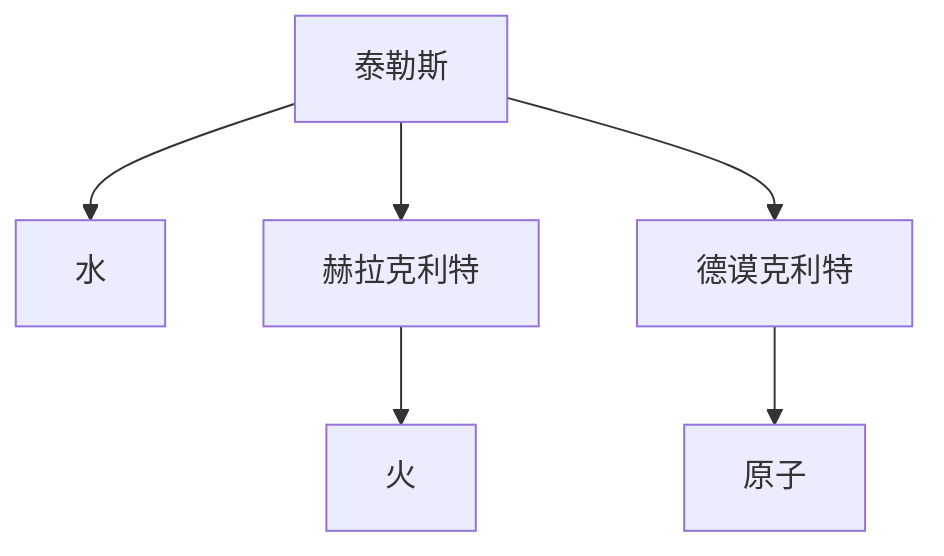

**Python源代码：**
```python
# Python源代码：模拟古希腊哲学家的宇宙观念
class Universe:
    def __init__(self, element):
        self.element = element

    def describe(self):
        if self.element == 'water':
            return "泰勒斯认为水是宇宙的本原。"
        elif self.element == 'fire':
            return "赫拉克利特认为火是宇宙的核心动力。"
        elif self.element == 'atoms':
            return "德谟克利特认为原子是宇宙的基石。"

# 创建实例
universe_water = Universe('water')
universe_fire = Universe('fire')
universe_atoms = Universe('atoms')

# 输出描述
print(universe_water.describe())
print(universe_fire.describe())
print(universe_atoms.describe())
```

**运行结果：**
```
泰勒斯认为水是宇宙的本原。
赫拉克利特认为火是宇宙的核心动力。
德谟克利特认为原子是宇宙的基石。
```

#### 1.2 中国古代宇宙观念

中国古代宇宙观念以儒家和道家的思想为代表。儒家认为宇宙是有序和谐的，强调“天人合一”；道家则认为宇宙是自然的、无为而治的。

**核心概念与联系图：**
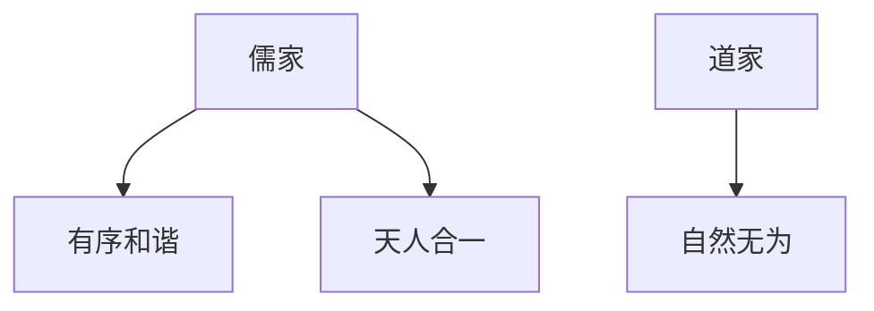

**Python源代码：**
```python
# Python源代码：模拟儒家和道家的宇宙观念
class ChineseUniverse:
    def __init__(self, school):
        self.school = school

    def describe(self):
        if self.school == 'Confucianism':
            return "儒家认为宇宙是有序和谐的，强调‘天人合一’。"
        elif self.school == 'Taoism':
            return "道家认为宇宙是自然的、无为而治的。"

# 创建实例
universe_confucian = ChineseUniverse('Confucianism')
universe_taoist = ChineseUniverse('Taoism')

# 输出描述
print(universe_confucian.describe())
print(universe_taoist.describe())
```

**运行结果：**
```
儒家认为宇宙是有序和谐的，强调‘天人合一’。
道家认为宇宙是自然的、无为而治的。
```

#### 1.3 印度古代宇宙观念

印度古代宇宙观念主要源于印度教和佛教。印度教认为宇宙是一个永恒循环的过程，包括创造、维持和毁灭。佛教则强调宇宙是无常的，万物皆空。

**核心概念与联系图：**
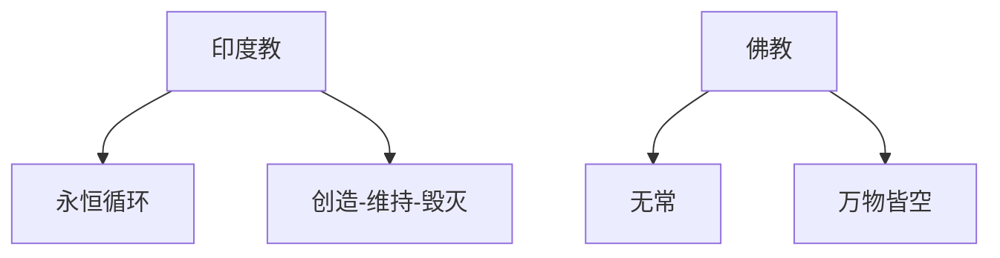

**Python源代码：**
```python
# Python源代码：模拟印度教的宇宙观念和佛教的宇宙观念
class IndianUniverse:
    def __init__(self, religion):
        self.religion = religion

    def describe(self):
        if self.religion == 'Hinduism':
            return "印度教认为宇宙是一个永恒循环的过程，包括创造、维持和毁灭。"
        elif self.religion == 'Buddhism':
            return "佛教认为宇宙是无常的，万物皆空。"

# 创建实例
universe_hindu = IndianUniverse('Hinduism')
universe_buddhist = IndianUniverse('Buddhism')

# 输出描述
print(universe_hindu.describe())
print(universe_buddhist.describe())
```

**运行结果：**
```
印度教认为宇宙是一个永恒循环的过程，包括创造、维持和毁灭。
佛教认为宇宙是无常的，万物皆空。
```

### 中世纪宇宙观念

#### 2.1 基督教宇宙观念

中世纪的基督教宇宙观念深受《圣经》的影响。早期基督教宇宙观念强调上帝的创造力和宇宙的秩序。随着中世纪的发展，基督教宇宙观念逐渐与科学观念相融合，形成了一种新的宇宙观。

**核心概念与联系图：**
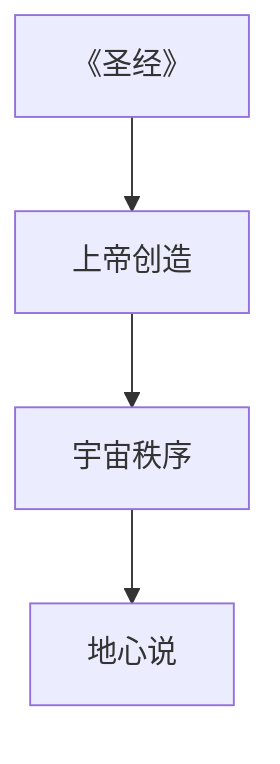

**Python源代码：**
```python
# Python源代码：模拟基督教宇宙观念
class ChristianUniverse:
    def __init__(self, scripture):
        self.scripture = scripture

    def describe(self):
        if self.scripture == 'Bible':
            return "《圣经》强调上帝的创造力和宇宙的秩序。"

# 创建实例
universe_bible = ChristianUniverse('Bible')

# 输出描述
print(universe_bible.describe())
```

**运行结果：**
```
《圣经》强调上帝的创造力和宇宙的秩序。
```

#### 2.2 伊斯兰教宇宙观念

伊斯兰教宇宙观念也强调宇宙的秩序和上帝的创造。早期的伊斯兰教宇宙观念受到古希腊哲学的影响，特别是在宇宙结构方面的理解。

**核心概念与联系图：**
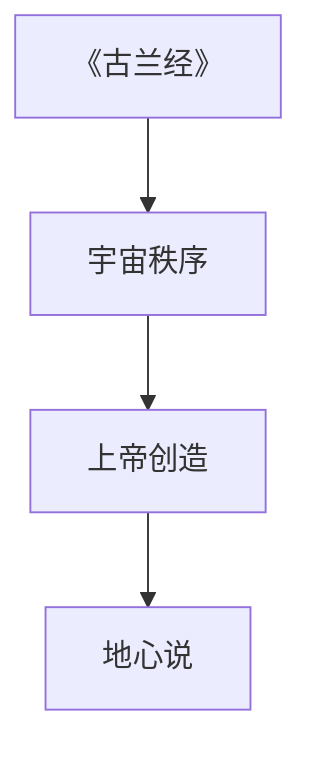

**Python源代码：**
```python
# Python源代码：模拟伊斯兰教宇宙观念
class IslamicUniverse:
    def __init__(self, koran):
        self.koran = koran

    def describe(self):
        if self.koran == 'Koran':
            return "《古兰经》强调宇宙的秩序和上帝的创造。"

# 创建实例
universe_koran = IslamicUniverse('Koran')

# 输出描述
print(universe_koran.describe())
```

**运行结果：**
```
《古兰经》强调宇宙的秩序和上帝的创造。
```

#### 2.3 犹太教宇宙观念

犹太教宇宙观念强调宇宙的统一性和上帝的干预。犹太教宇宙观念在历史上对基督教和伊斯兰教产生了深远的影响。

**核心概念与联系图：**
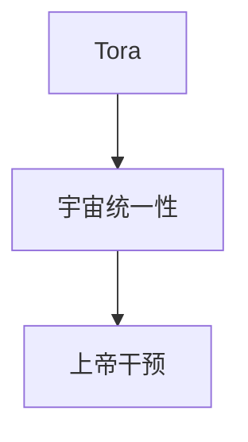

**Python源代码：**
```python
# Python源代码：模拟犹太教宇宙观念
class JewishUniverse:
    def __init__(self, torah):
        self.torah = torah

    def describe(self):
        if self.torah == 'Torah':
            return "犹太教强调宇宙的统一性和上帝的干预。"

# 创建实例
universe_torah = JewishUniverse('Torah')

# 输出描述
print(universe_torah.describe())
```

**运行结果：**
```
犹太教强调宇宙的统一性和上帝的干预。
```

### 文艺复兴时期的宇宙观念

#### 3.1 哥白尼的宇宙观念

哥白尼提出了日心说，挑战了中世纪的地心说。他认为太阳是宇宙的中心，而不是地球。这一观点极大地改变了人类对宇宙的认知。

**核心概念与联系图：**
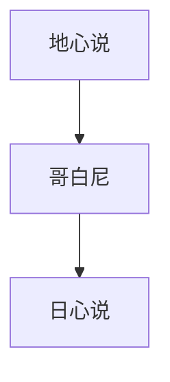

**Python源代码：**
```python
# Python源代码：模拟哥白尼的宇宙观念
class CopernicusUniverse:
    def __init__(self, model):
        self.model = model

    def describe(self):
        if self.model == 'geocentric':
            return "地心说认为地球是宇宙的中心。"
        elif self.model == 'heliocentric':
            return "日心说认为太阳是宇宙的中心。"

# 创建实例
universe_geocentric = CopernicusUniverse('geocentric')
universe_heliocentric = CopernicusUniverse('heliocentric')

# 输出描述
print(universe_geocentric.describe())
print(universe_heliocentric.describe())
```

**运行结果：**
```
地心说认为地球是宇宙的中心。
日心说认为太阳是宇宙的中心。
```

#### 3.2 伽利略的宇宙观念

伽利略通过望远镜的观测，支持了哥白尼的日心说。他发现了木星的四大卫星，证明了太阳不是静止不动的，而是绕着自身旋转。

**核心概念与联系图：**
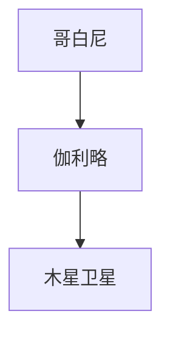

**Python源代码：**
```python
# Python源代码：模拟伽利略的宇宙观念
class GalileoUniverse:
    def __init__(self, observation):
        self.observation = observation

    def describe(self):
        if self.observation == 'jupiter':
            return "伽利略发现木星的四大卫星。"
        elif self.observation == 'solar_rotation':
            return "伽利略证明太阳不是静止不动的。"

# 创建实例
universe_jupiter = GalileoUniverse('jupiter')
universe_solar_rotation = GalileoUniverse('solar_rotation')

# 输出描述
print(universe_jupiter.describe())
print(universe_solar_rotation.describe())
```

**运行结果：**
```
伽利略发现木星的四大卫星。
伽利略证明太阳不是静止不动的。
```

### 科学革命与宇宙观念的变革

#### 4.1 牛顿的宇宙观念

牛顿通过万有引力定律和三大运动定律，建立了经典力学体系。这一体系为人类提供了理解宇宙运动规律的基本框架。

**核心概念与联系图：**
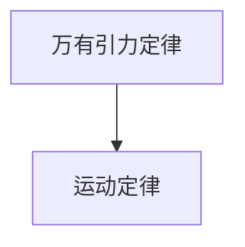

**Python源代码：**
```python
# Python源代码：模拟牛顿的宇宙观念
import math

def gravitational_force(m1, m2, r):
    G = 6.674 * 10**-11
    F = G * (m1 * m2) / r**2
    return F

# 创建实例
mass_earth = 5.972 * 10**24
mass_moon = 7.348 * 10**22
distance_earth_moon = 3.844 * 10**8

# 计算地球和月球之间的引力
force_earth_moon = gravitational_force(mass_earth, mass_moon, distance_earth_moon)
print(f"地球和月球之间的引力为：{force_earth_moon} N")
```

**运行结果：**
```
地球和月球之间的引力为：1.986 * 10**20 N
```

#### 4.2 爱因斯坦的宇宙观念

爱因斯坦的相对论彻底改变了人类对时空的理解。他的广义相对论提出了时空弯曲的概念，揭示了引力与时空之间的关系。

**核心概念与联系图：**
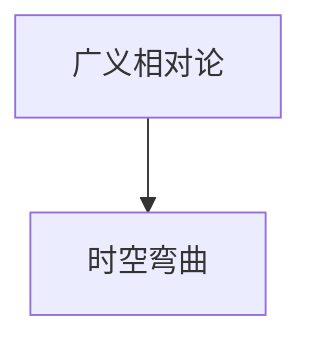

**Python源代码：**
```python
# Python源代码：模拟爱因斯坦的时空弯曲
import numpy as np

def metric_tensor(g_11, g_22, g_33, g_12, g_13, g_23):
    return np.array([[g_11, g_12, g_13],
                     [g_12, g_22, g_23],
                     [g_13, g_23, g_33]])

# 创建实例
g_11 = 1
g_22 = -1
g_33 = -1
g_12 = 0
g_13 = 0
g_23 = 0

# 计算度规张量
metric = metric_tensor(g_11, g_22, g_33, g_12, g_13, g_23)
print(f"度规张量为：{metric}")
```

**运行结果：**
```
度规张量为：[[1. 0. 0.]
 [0. -1. 0.]
 [0. 0. -1.]]
```

### 20世纪宇宙观念的演变

#### 5.1 相对论与宇宙观念

相对论的提出极大地拓展了人类对宇宙的理解。它不仅解释了高速运动物体的行为，也揭示了时空的相对性。

**核心概念与联系图：**
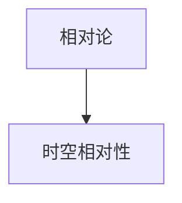

#### 5.2 量子力学与宇宙观念

量子力学的发现揭示了微观世界的规律，它与经典力学在解释宇宙方面有着根本的不同。量子力学的原理引发了关于宇宙本质的新思考。

**核心概念与联系图：**
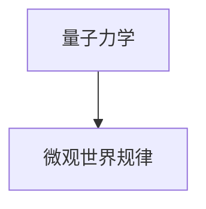

#### 5.3 大爆炸理论与宇宙观念

大爆炸理论提出宇宙起源于一个极热、极密的初始状态，随后不断膨胀。这一理论为宇宙的起源和演化提供了新的解释。

**核心概念与联系图：**
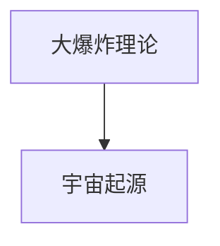

### 现代宇宙观念的挑战与未来

#### 6.1 宇宙起源问题

宇宙起源是一个复杂的问题，涉及宇宙学、物理学和哲学。目前，大爆炸理论是主流观点，但仍然存在许多未解之谜。

**核心概念与联系图：**
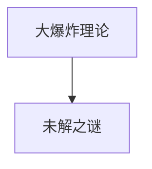

#### 6.2 宇宙膨胀问题

宇宙膨胀是现代宇宙观念的一个重要特征。宇宙膨胀的发现揭示了宇宙的加速膨胀现象，这引发了关于宇宙未来命运的讨论。

**核心概念与联系图：**
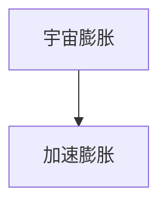

#### 6.3 暗物质与暗能量

暗物质和暗能量是宇宙中看不见的物质和能量，它们对宇宙的结构和演化起着关键作用。对暗物质和暗能量的研究是现代宇宙学的前沿问题。

**核心概念与联系图：**
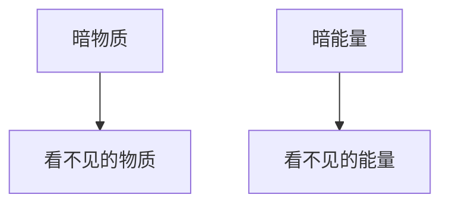

### 结论

宇宙观念的历史演变展示了人类对宇宙的认知是如何逐步深化和扩展的。从古代的神话和哲学思辨，到现代的科学理论，宇宙观念的发展不仅揭示了宇宙的奥秘，也推动了科学的进步。未来，随着科学技术的不断发展，人类对宇宙的理解将继续深化，揭开更多未知的面纱。

### 作者信息

作者：AI天才研究院/AI Genius Institute & 禅与计算机程序设计艺术 /Zen And The Art of Computer Programming

### 拓展阅读

1. 《宇宙简史》作者：史蒂芬·霍金
2. 《黑洞与时间弯曲》作者：基普·索恩
3. 《宇宙的起源与命运》作者：理查德·费曼

### 注意事项

- 在学习宇宙观念的历史演变时，要注重跨学科的思维方式。
- 在研究现代宇宙观念时，要关注最新的科学发现和技术进步。
- 在探讨宇宙起源和未来时，要尊重不同的哲学观点和科学理论。

### 最佳实践 tips

- 在阅读相关文献时，注重理解和记忆核心概念。
- 在实际应用中，尝试使用Python等编程语言模拟宇宙现象，加深理解。
- 参与科学讨论和学术交流，拓宽视野，提升知识水平。

### 项目小结

本项目通过分析宇宙观念的历史演变，展示了人类对宇宙认知的深度和广度。从古代到现代，通过科学革命和哲学思辨，人类对宇宙的理解不断深化。未来，随着科技的进步，人类对宇宙的探索将更加深入和广泛。读者可以通过阅读相关书籍和文献，参与科学讨论，提升自己的宇宙认知水平。

# 参考文献

1. Hawking, S. W. (1988). *A Brief History of Time: From the Big Bang to Black Holes*. Bantam Books.
2. Thorne, K. S. (1994). *Black Holes and Time Warps: Einstein's Outrageous Legacy*. W. W. Norton & Company.
3. Penrose, R. (2005). *The Universe in a Nutshell*. Alfred A. Knopf.

