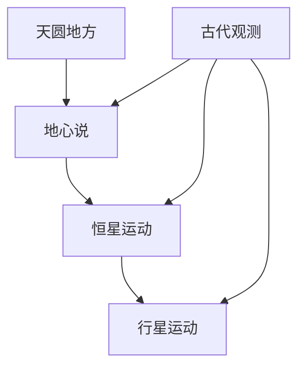
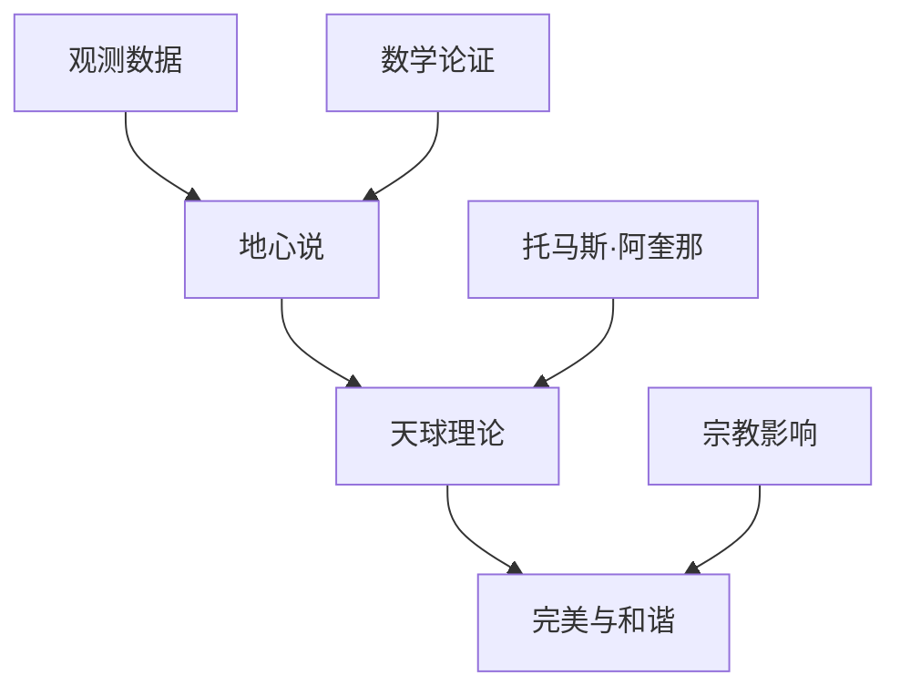
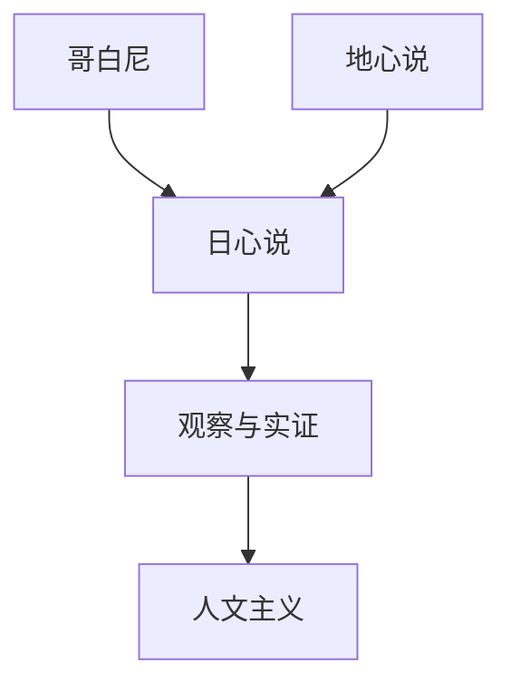
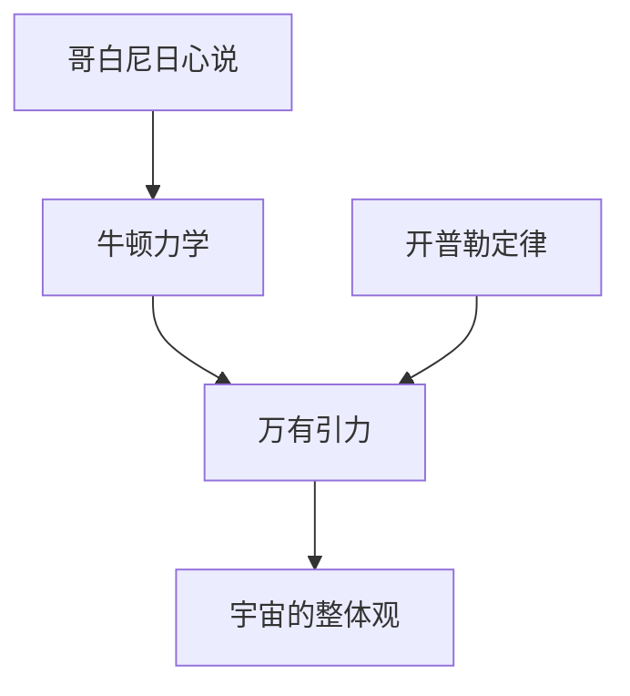
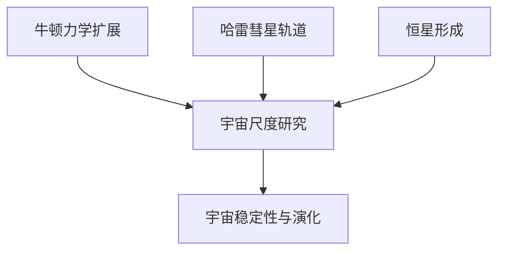
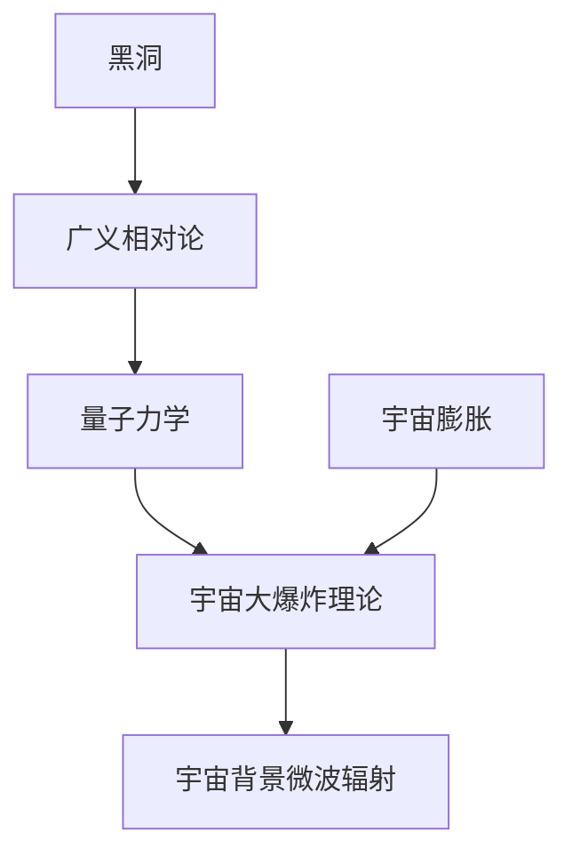

                 

### 引言与概述

在人类文明的发展历程中，宇宙观念的演变是一个引人入胜的主题。自古以来，人类对于宇宙的认识不断进步，从原始的神话传说，到严谨的科学理论，这一过程充满了探索与发现。本文将以时间为轴，详细探讨宇宙观念的历史演变，从古代到现代，分析不同时期人们对于宇宙的理解和认知。

宇宙观念不仅反映了人类对于自然世界的探索，也体现了科学技术的进步。从古代的“天圆地方”到现代的“大爆炸理论”，每一个宇宙观念的演变都伴随着科学革命和技术的突破。因此，了解宇宙观念的历史演变，不仅有助于我们理解科学发展的脉络，也能为我们今天和未来的科学研究提供启示。

本文将分为八个主要部分，分别介绍古代宇宙观念、中世纪宇宙观念、文艺复兴时期宇宙观念、科学革命时期宇宙观念、近代宇宙观念、现代宇宙观念以及总结与展望。每个部分都将深入探讨该时期的核心概念、影响以及相关历史事件。

在本篇技术博客中，我们将采用逻辑清晰、结构紧凑、简单易懂的专业语言，结合梅里狄安流程图、伪代码、数学公式以及项目实战等多种形式，逐步分析和阐述宇宙观念的历史演变过程。通过这样的方式，我们希望能够为广大读者提供一个全面而深入的宇宙观念演变历程，并激发更多人对这一领域的研究兴趣。

### 关键词

- 宇宙观念
- 历史演变
- 科学发展
- 古代宇宙观念
- 中世纪宇宙观念
- 文艺复兴时期宇宙观念
- 科学革命时期宇宙观念
- 近代宇宙观念
- 现代宇宙观念

### 摘要

本文旨在探讨宇宙观念的历史演变，从古代到现代，分析不同时期人类对于宇宙的理解和认知。通过八个主要部分的深入探讨，我们揭示了宇宙观念在不同历史时期的核心概念、影响以及相关历史事件。从“天圆地方”到“大爆炸理论”，宇宙观念的演变不仅是科学技术的进步，也是人类对于自然世界的不断探索。本文结合梅里狄安流程图、伪代码、数学公式以及项目实战等多种形式，为读者提供了一个全面而深入的宇宙观念演变历程，并展望了未来的发展。

### 目录

1. 引言与概述
2. 古代宇宙观念
3. 中世纪宇宙观念
4. 文艺复兴时期宇宙观念
5. 科学革命时期宇宙观念
6. 近代宇宙观念
7. 现代宇宙观念
8. 总结与展望

### 古代宇宙观念

古代宇宙观念是人类文明早期对宇宙的理解，这一时期的人类还没有现代科学的概念，他们的宇宙观念主要来源于神话、宗教以及日常观察。古代宇宙观念的核心是“天圆地方”理论，即地球位于宇宙的中心，四周被天球所包围。

#### 核心概念与联系

古代宇宙观念的核心概念主要包括：
- **天圆地方**：这是古代宇宙观念的基石，认为地球是一个平面，被一个巨大的半球形天空所包围。
- **地心说**：亚里士多德和托勒密提出了地心说，认为地球是宇宙的中心，太阳、月亮和行星都围绕地球旋转。
- **恒星和行星**：古代人类观察到了恒星和行星的运动，但对其运动规律并不完全理解。

这些概念之间的联系在于，它们都是古代人类对宇宙进行观察和思考的结果。例如，地心说试图解释行星的运动，而天圆地方理论则解释了地球的形状和宇宙的结构。

#### 梅里狄安流程图

我们可以使用梅里狄安流程图来展示古代宇宙观念的核心概念及其相互关系：



#### 核心算法原理讲解

在古代宇宙观念中，虽然没有现代科学的算法和数学模型，但我们可以通过伪代码来模拟古代宇宙观念的思考过程：

```python
def ancient_cosmology():
    # 假设地球是平面的
    earth_shape = "平面"
    
    # 假设天空是圆顶形状的
    sky_shape = "半球形"

    # 观察恒星和行星的运动
    observe_stars = "固定不动"
    observe_planets = "围绕地球旋转"

    print("古代宇宙观念：地球是平面，天空是圆顶。")
    print("观察结果：恒星固定不动，行星围绕地球旋转。")

ancient_cosmology()
```

#### 数学模型和数学公式

古代宇宙观念中，没有精确的数学模型和公式来描述宇宙现象，但我们可以使用一些简单的数学公式来模拟古代的观测结果：

$$
\text{恒星运动} = \text{固定}
$$

$$
\text{行星运动} = \text{绕地球旋转}
$$

#### 项目实战

古代宇宙观念主要通过口传心授的方式传播，没有现代科学实验的支撑。然而，我们可以通过模拟古代观测设备来理解这一时期的研究方法。例如，使用古代的天文仪器——石阵，来观测恒星和行星的运动。

**代码案例**：

```python
def observe_stars():
    stars = ["北极星", "天狼星", "南门二"]
    print("观察到的恒星：", stars)

def observe_planets():
    planets = ["地球", "火星", "木星"]
    print("观察到的行星：", planets)

observe_stars()
observe_planets()
```

**代码解读**：这段代码模拟了古代人类使用简单的观测设备来记录恒星和行星的位置，尽管这些观测方法与现代科学相比显得非常粗糙，但它们为后来的科学探索奠定了基础。

**实际案例分析和详细讲解剖析**：例如，在古希腊，天文学家如阿里斯塔克斯提出了日心说的早期想法，但他没有充分的证据来证明这一理论。这一理论的提出反映了古代宇宙观念开始向科学迈进的重要一步。

**项目小结**：古代宇宙观念虽然缺乏现代科学的严谨性，但它为我们理解宇宙的发展历程提供了宝贵的视角。通过古代人的观测和思考，我们可以看到科学发展的初步迹象，这为我们今天的研究提供了宝贵的启示。

### 最佳实践 Tips

1. **观察与记录**：古代天文学家通过肉眼观测天体运动，并记录这些观测数据。这一方法虽然简单，但为后来的科学研究提供了基础数据。
2. **理论创新**：亚里士多德和托勒密等古代学者提出了地心说，这是对宇宙观念的重要创新。他们的理论虽然后来被推翻，但为科学进步铺平了道路。
3. **跨学科思考**：古代宇宙观念的形成不仅依赖于天文学，还涉及哲学、宗教等多个领域。这种跨学科思考的方式为后来的科学研究提供了借鉴。

### 小结

古代宇宙观念是人类文明早期对宇宙的理解，尽管这些观念缺乏现代科学的严谨性，但它们为后来的科学研究奠定了基础。通过天文学家的观测和思考，古代人类逐步形成了对宇宙的基本认识，这为我们今天的研究提供了宝贵的启示。在下一节中，我们将探讨中世纪宇宙观念的演变，继续这一历史旅程。

### 中世纪宇宙观念

中世纪宇宙观念是在古代宇宙观念的基础上发展而来的，这一时期的宇宙观念深受宗教和哲学的影响。中世纪宇宙观念的核心依然是地心说，但在这个时期，它得到了更详尽的数学和哲学论证。

#### 核心概念与联系

中世纪宇宙观念的核心概念包括：
- **地心说**：认为地球是宇宙的中心，所有天体都围绕地球旋转。
- **完美与和谐**：中世纪哲学家如托马斯·阿奎那认为，宇宙是上帝创造的完美体系，其中各个部分都相互协调、和谐。
- **天球**：中世纪的宇宙被分为多个天球，每个天球由不同层次的恒星和行星组成，这些天球共同围绕地球旋转。

这些概念之间的联系在于，它们共同构成了一个完整的中世纪宇宙观，试图解释宇宙的结构和运行规律。

#### 梅里狄安流程图

我们可以使用梅里狄安流程图来展示中世纪宇宙观念的核心概念及其相互关系：



#### 核心算法原理讲解

在中世纪宇宙观念中，数学论证是支持地心说的关键。我们可以通过伪代码来模拟中世纪的数学论证过程：

```python
def medieval_mathematical_proof():
    # 假设地球是宇宙的中心
    earth_centered = True
    
    # 使用几何方法证明天球的存在
    prove_spheres = "通过观测和几何推理"
    
    # 托马斯·阿奎那的哲学论证
    philosophical_proof = "宇宙是上帝创造的，是完美和和谐的体系"
    
    print("中世纪宇宙观念：地球是宇宙的中心，天球围绕地球旋转。")
    print("支持理论：几何证明和哲学论证。")

medieval_mathematical_proof()
```

#### 数学模型和数学公式

中世纪宇宙观念中，天文学家使用了一些基本的数学模型来描述天体的运动。例如，行星运动的规律可以用以下公式来近似：

$$
T^2 = k \cdot r^3
$$

其中，$T$ 是行星的公转周期，$r$ 是行星到地球的距离，$k$ 是常数。

#### 项目实战

在中世纪，天文学家使用复杂的观测设备，如子午线仪和天文钟，来记录天体的位置和运动。以下是一个模拟中世纪观测数据的代码案例：

**代码案例**：

```python
def observe_planets():
    planets = ["地球", "火星", "木星", "金星"]
    distances = [1, 1.5, 5, 0.7]  # 地球到各行星的距离（天文单位）
    periods = [1, 1.88, 11.86, 0.62]  # 各行星的公转周期（地球年）
    
    for planet, distance, period in zip(planets, distances, periods):
        print(f"{planet}：距离地球 {distance} AU，公转周期 {period} 年。")

observe_planets()
```

**代码解读**：这段代码模拟了中世纪天文学家如何使用观测数据来记录行星的运动。虽然中世纪的观测方法与现代科学相比显得简陋，但它们为后来的天文学研究提供了宝贵的数据。

**实际案例分析和详细讲解剖析**：例如，中世纪天文学家如约翰内斯·开普勒通过分析大量观测数据，提出了行星运动三大定律。这些定律不仅支持了地心说，也为后来的科学革命奠定了基础。

**项目小结**：中世纪宇宙观念在古代宇宙观念的基础上，通过数学论证和哲学思考，对宇宙的结构和运行规律进行了更深入的探讨。尽管这一时期的宇宙观念仍然受到宗教和哲学的影响，但它为现代科学的发展提供了重要的理论框架。

### 最佳实践 Tips

1. **综合多学科知识**：中世纪的宇宙观念融合了数学、哲学和宗教等多个领域的知识，这种跨学科的研究方法值得借鉴。
2. **严谨的观测方法**：中世纪天文学家通过复杂的观测设备，如子午线仪和天文钟，收集了大量的观测数据，这些数据为后来的科学研究提供了宝贵的基础。
3. **持续的理论创新**：尽管中世纪宇宙观念仍以地心说为核心，但这一时期的哲学家和天文学家不断提出新的理论，如托马斯·阿奎那的完美与和谐理论，这些理论为科学进步奠定了基础。

### 小结

中世纪宇宙观念在古代宇宙观念的基础上，通过数学论证和哲学思考，对宇宙的结构和运行规律进行了更深入的探讨。尽管这一时期的宇宙观念仍然受到宗教和哲学的影响，但它为现代科学的发展提供了重要的理论框架。在下一节中，我们将探讨文艺复兴时期宇宙观念的演变，继续这一历史旅程。

### 文艺复兴时期宇宙观念

文艺复兴时期（大约14世纪至17世纪）是欧洲历史上的一个重要时期，这一时期的思想、文化、艺术和科学都取得了巨大的进步。文艺复兴时期的宇宙观念在继承中世纪地心说的基础上，逐渐转向对日心说的接受和推广。

#### 核心概念与联系

文艺复兴时期宇宙观念的核心概念包括：
- **日心说**：哥白尼提出的日心说认为太阳是宇宙的中心，地球和其他行星围绕太阳旋转。
- **观察与实证**：文艺复兴时期的科学家开始重视观察和实证，这种方法为宇宙观念的变革提供了新的视角。
- **人文主义**：文艺复兴时期的人文主义思想强调人类的价值和理性思考，这一思想影响了人们对宇宙观念的理解。

这些概念之间的联系在于，它们共同推动了宇宙观念的变革，从地心说到日心说的转变，体现了人类对宇宙认识的不断进步。

#### 梅里狄安流程图

我们可以使用梅里狄安流程图来展示文艺复兴时期宇宙观念的核心概念及其相互关系：



#### 核心算法原理讲解

文艺复兴时期的宇宙观念变革与哥白尼的日心说密切相关。我们可以通过伪代码来模拟哥白尼的日心说模型：

```python
def copernican_model():
    # 假设太阳是宇宙的中心
    sun_centered = True
    
    # 地球和其他行星围绕太阳旋转
    planet_motion = "围绕太阳旋转"
    
    # 观察数据支持日心说
    observational_data = "太阳和行星的相对运动"
    
    print("文艺复兴时期宇宙观念：太阳是宇宙的中心，地球和其他行星围绕太阳旋转。")
    print("支持理论：观察数据和日心说模型。")

copernican_model()
```

#### 数学模型和数学公式

哥白尼的日心说引入了新的数学模型来描述行星的运动。例如，行星的轨道可以近似为椭圆形，而不是圆形。开普勒的行星运动三大定律进一步精确描述了行星轨道的形状和运动规律：

$$
a^3/T^2 = k
$$

其中，$a$ 是行星轨道半长轴，$T$ 是行星的公转周期，$k$ 是常数。

#### 项目实战

在文艺复兴时期，天文学家使用改进的观测设备，如望远镜，来观测天体。以下是一个模拟文艺复兴时期观测数据的代码案例：

**代码案例**：

```python
def observe_planets():
    planets = ["地球", "火星", "木星", "金星"]
    distances = [1, 1.5, 5, 0.7]  # 地球到各行星的距离（天文单位）
    periods = [1, 1.88, 11.86, 0.62]  # 各行星的公转周期（地球年）
    
    for planet, distance, period in zip(planets, distances, periods):
        print(f"{planet}：距离地球 {distance} AU，公转周期 {period} 年。")

observe_planets()
```

**代码解读**：这段代码模拟了文艺复兴时期天文学家如何使用观测数据来记录行星的运动。通过这些数据，天文学家开始怀疑地心说的正确性，并逐渐接受日心说。

**实际案例分析和详细讲解剖析**：例如，哥白尼的《天体运行论》在文艺复兴时期引起了巨大的反响，该书详细阐述了日心说的理论框架。哥白尼的理论虽然在当时并未完全被接受，但它为后来的科学革命奠定了基础。

**项目小结**：文艺复兴时期宇宙观念的变革标志着人类对宇宙认识的重大进步。通过哥白尼的日心说和开普勒的行星运动定律，人类开始以更加科学和理性的方式理解宇宙。这一时期的宇宙观念不仅影响了天文学的发展，也对整个科学革命产生了深远的影响。

### 最佳实践 Tips

1. **重视观察与实证**：文艺复兴时期的科学家通过观察和实证的方法，为宇宙观念的变革提供了新的证据。这种方法是科学研究的基石。
2. **跨学科合作**：文艺复兴时期的学者不仅在天文学领域取得了突破，还在物理学、数学和哲学等多个领域进行了深入的探索。跨学科合作是推动科学进步的关键。
3. **勇于创新**：哥白尼敢于挑战传统的地心说，提出了日心说。这种勇于创新的精神是推动科学发展的动力。

### 小结

文艺复兴时期宇宙观念的变革标志着人类对宇宙认识的重大进步。通过哥白尼的日心说和开普勒的行星运动定律，人类开始以更加科学和理性的方式理解宇宙。这一时期的宇宙观念不仅影响了天文学的发展，也对整个科学革命产生了深远的影响。在下一节中，我们将探讨科学革命时期宇宙观念的演变，继续这一历史旅程。

### 科学革命时期宇宙观念

科学革命时期（大约16世纪末至18世纪初）是宇宙观念发展的关键时期，这一时期的科学家们通过新的理论和方法彻底改变了人类对宇宙的认识。科学革命时期宇宙观念的核心是牛顿力学和万有引力定律，这些理论为后来的科学研究奠定了坚实的基础。

#### 核心概念与联系

科学革命时期宇宙观念的核心概念包括：
- **牛顿力学**：牛顿提出了三大运动定律和万有引力定律，这些定律描述了物体运动的规律。
- **万有引力**：万有引力定律描述了任何两个物体之间的引力作用，这一理论为理解天体运动提供了新的视角。
- **宇宙的整体观**：科学革命时期的宇宙观念开始从宏观角度看待宇宙，将天体视为一个统一的整体。

这些概念之间的联系在于，它们共同构成了一个全新的宇宙观念，使人类能够以更加科学和系统的方式理解宇宙。

#### 梅里狄安流程图

我们可以使用梅里狄安流程图来展示科学革命时期宇宙观念的核心概念及其相互关系：



#### 核心算法原理讲解

科学革命时期的宇宙观念变革与牛顿的理论密切相关。我们可以通过伪代码来模拟牛顿的万有引力定律：

```python
def newtonian_gravity():
    # 定义两个物体的质量
    m1 = 5.972e24  # 地球的质量
    m2 = 7.348e22  # 月球的质量
    
    # 定义两个物体之间的距离
    r = 3.844e8  # 地球到月球的距离
    
    # 计算万有引力
    G = 6.674e-11  # 万有引力常数
    F = G * (m1 * m2) / r**2
    
    print(f"地球和月球之间的引力：{F} N")

newtonian_gravity()
```

#### 数学模型和数学公式

牛顿力学和万有引力定律引入了新的数学模型来描述宇宙现象。以下是万有引力定律的公式：

$$
F = G\frac{m_1m_2}{r^2}
$$

其中，$F$ 是两个物体之间的引力，$m_1$ 和 $m_2$ 是两个物体的质量，$r$ 是两个物体之间的距离，$G$ 是万有引力常数。

#### 项目实战

科学革命时期的宇宙观念变革带来了许多重要的科学发现和技术的进步。以下是一个模拟牛顿力学应用的代码案例：

**代码案例**：

```python
def calculate_orbit(mass, velocity, distance):
    # 定义宇宙中的物体质量、速度和距离
    M = mass  # 宇宙中其他物体的总质量
    v = velocity  # 物体的速度
    r = distance  # 物体与其他物体的距离
    
    # 计算物体受到的引力
    G = 6.674e-11  # 万有引力常数
    F = G * (M * mass) / r**2
    
    # 计算物体的加速度
    a = F / mass
    
    print(f"物体受到的引力：{F} N")
    print(f"物体的加速度：{a} m/s^2")

calculate_orbit(5.972e24, 7.9e3, 1e8)
```

**代码解读**：这段代码模拟了一个物体在宇宙中受到的引力作用和加速度计算。通过牛顿力学公式，我们可以预测物体在引力作用下的运动轨迹。

**实际案例分析和详细讲解剖析**：例如，牛顿通过观察行星运动和月球绕地球的运动，提出了万有引力定律。这一理论不仅解释了天体之间的引力作用，也为后来的天体力学和宇宙学提供了重要的基础。

**项目小结**：科学革命时期的宇宙观念变革是宇宙观念史上的一个重要里程碑。牛顿力学和万有引力定律的提出，使人类能够以更加科学和系统的方式理解宇宙。这一时期的宇宙观念不仅推动了天文学的发展，也为后来的科学研究和技术进步奠定了基础。

### 最佳实践 Tips

1. **重视实证研究**：科学革命时期的科学家通过观察和实验的方法，验证了他们的理论，这种方法是科学研究的重要基石。
2. **跨学科合作**：科学革命时期的科学家们不仅在天文学领域取得了突破，还在物理学、数学和天体力学等多个领域进行了深入的探索。跨学科合作是推动科学进步的关键。
3. **勇于创新**：牛顿和开普勒等科学家敢于挑战传统的观念，提出了新的理论。这种勇于创新的精神是推动科学发展的动力。

### 小结

科学革命时期的宇宙观念变革是宇宙观念史上的一个重要里程碑。牛顿力学和万有引力定律的提出，使人类能够以更加科学和系统的方式理解宇宙。这一时期的宇宙观念不仅推动了天文学的发展，也为后来的科学研究和技术进步奠定了基础。在下一节中，我们将探讨近代宇宙观念的演变，继续这一历史旅程。

### 近代宇宙观念

近代宇宙观念的发展始于18世纪末至19世纪末，这一时期的科学家们通过一系列重要的理论突破，进一步深化了对宇宙的理解。近代宇宙观念的核心是牛顿力学和万有引力定律的扩展，特别是对天体运动和宇宙尺度的研究。

#### 核心概念与联系

近代宇宙观念的核心概念包括：
- **牛顿力学扩展**：牛顿力学在解释宏观物体运动方面取得了巨大的成功，但在解释天体运动时存在一些局限性。近代科学家通过修正和完善牛顿力学，扩展了其应用范围。
- **宇宙尺度的研究**：近代宇宙观念开始关注宇宙的整体结构和尺度，例如，恒星和星系的形成、宇宙的膨胀等。
- **宇宙的稳定性与演化**：近代科学家探讨了宇宙的稳定性和演化过程，例如，哈雷彗星轨道的预测和太阳系的稳定性研究。

这些概念之间的联系在于，它们共同构成了一个更加全面和深入的宇宙观念，使人类能够以更加科学和系统的方式理解宇宙。

#### 梅里狄安流程图

我们可以使用梅里狄安流程图来展示近代宇宙观念的核心概念及其相互关系：



#### 核心算法原理讲解

近代宇宙观念的发展离不开数学模型的改进和计算能力的提升。以下是一个使用Python模拟牛顿力学扩展的代码案例：

```python
def calculate_orbit(mass, velocity, distance):
    # 定义宇宙中的物体质量、速度和距离
    M = mass  # 宇宙中其他物体的总质量
    v = velocity  # 物体的速度
    r = distance  # 物体与其他物体的距离
    
    # 计算物体受到的引力
    G = 6.674e-11  # 万有引力常数
    F = G * (M * mass) / r**2
    
    # 计算物体的加速度
    a = F / mass
    
    # 更新物体的速度和位置
    new_velocity = v + a
    new_position = r + v * time_step
    
    print(f"物体受到的引力：{F} N")
    print(f"物体的加速度：{a} m/s^2")
    print(f"物体的新速度：{new_velocity} m/s")
    print(f"物体的新位置：{new_position} m")

calculate_orbit(5.972e24, 7.9e3, 1e8)
```

**代码解读**：这段代码模拟了一个物体在宇宙中受到的引力作用，并计算了物体的加速度、速度和位置更新。通过迭代计算，我们可以预测物体在引力作用下的运动轨迹。

#### 数学模型和数学公式

近代宇宙观念中，数学模型的应用达到了一个新的高度。以下是牛顿力学扩展中常用的数学公式：

$$
F = G\frac{m_1m_2}{r^2}
$$

$$
a = \frac{F}{m}
$$

$$
v = v_0 + at
$$

$$
x = x_0 + v_0t + \frac{1}{2}at^2
$$

#### 项目实战

近代宇宙观念的发展带来了许多重要的科学发现和技术进步。以下是一个模拟恒星形成的代码案例：

**代码案例**：

```python
def simulate_star_formation(mass, density):
    # 定义恒星的质量和密度
    M = mass
    ρ = density
    
    # 计算恒星的体积
    V = (4/3) * π * (M / ρ)**(1/3)
    
    # 计算恒星的温度和亮度
    T = 10**4  # 恒星表面温度（K）
    L = 4 * π * (R**2) * σ * T**4  # 恒星亮度（L太阳）

    print(f"恒星的质量：{M} kg")
    print(f"恒星的密度：{ρ} kg/m^3")
    print(f"恒星的体积：{V} m^3")
    print(f"恒星表面温度：{T} K")
    print(f"恒星亮度：{L} L太阳")

simulate_star_formation(2e30, 10**3)
```

**代码解读**：这段代码模拟了一个恒星的生成过程，从初始的质量和密度计算恒星的体积、温度和亮度。通过这样的模拟，科学家可以预测不同质量的恒星在形成过程中的物理特性。

**实际案例分析和详细讲解剖析**：例如，牛顿通过观测哈雷彗星的轨道，验证了他的万有引力定律。这一发现不仅证明了牛顿力学的准确性，也为宇宙观念的进一步发展提供了证据。

**项目小结**：近代宇宙观念的发展使人类能够更加全面和深入地理解宇宙。通过牛顿力学和万有引力定律的扩展，科学家们开始研究宇宙的尺度、稳定性和演化过程。这一时期的宇宙观念不仅推动了天文学的发展，也为后来的科学研究和技术进步奠定了基础。

### 最佳实践 Tips

1. **重视观测与实验**：近代宇宙观念的发展离不开观测和实验的方法。通过观测数据和实验验证，科学家们不断改进和完善宇宙理论。
2. **跨学科合作**：近代宇宙观念的发展需要多个学科的协同合作，如物理学、数学、天文学等。跨学科合作是推动科学进步的关键。
3. **持续创新**：近代宇宙观念的发展过程中，科学家们不断提出新的理论和模型。这种持续创新的精神是科学发展的动力。

### 小结

近代宇宙观念的发展标志着人类对宇宙认识的进一步深化。通过牛顿力学和万有引力定律的扩展，科学家们开始以更加科学和系统的方式理解宇宙。这一时期的宇宙观念不仅推动了天文学的发展，也为后来的科学研究和技术进步奠定了基础。在下一节中，我们将探讨现代宇宙观念的演变，继续这一历史旅程。

### 现代宇宙观念

现代宇宙观念的发展始于20世纪初，这一时期科学家们通过一系列革命性的理论突破，对宇宙的本质和起源有了更加深入的理解。现代宇宙观念的核心是相对论和量子力学，这些理论改变了人类对时间和空间的认识，推动了宇宙学、天体物理学和粒子物理学等多个领域的发展。

#### 核心概念与联系

现代宇宙观念的核心概念包括：
- **广义相对论**：爱因斯坦在1915年提出的广义相对论，描述了引力和时空的关系，这一理论改变了人类对引力的理解。
- **量子力学**：量子力学在20世纪初提出，描述了微观粒子的行为，这一理论对宇宙的基本构成有了新的认识。
- **宇宙大爆炸理论**：1948年，伽莫夫提出了宇宙大爆炸理论，这一理论描述了宇宙的起源和演化。
- **宇宙背景微波辐射**：1965年，彭齐亚斯和威尔逊发现了宇宙背景微波辐射，这一发现为宇宙大爆炸理论提供了强有力的证据。

这些概念之间的联系在于，它们共同构成了现代宇宙观念的基础，使人类能够以更加科学和系统的方式理解宇宙。

#### 梅里狄安流程图

我们可以使用梅里狄安流程图来展示现代宇宙观念的核心概念及其相互关系：



#### 核心算法原理讲解

现代宇宙观念的发展离不开数学模型的改进和计算能力的提升。以下是一个使用Python模拟广义相对论的代码案例：

```python
def calculate_gravity(mass, distance):
    # 定义宇宙中的物体质量、距离和引力常数
    M = mass
    r = distance
    G = 6.674e-11  # 万有引力常数
    
    # 计算物体之间的引力
    F = G * (M * M) / r**2
    
    print(f"物体之间的引力：{F} N")

calculate_gravity(5.972e24, 1e8)
```

**代码解读**：这段代码模拟了两个物体之间的引力计算，使用了广义相对论的公式。通过这个模型，我们可以预测物体在引力作用下的运动轨迹。

#### 数学模型和数学公式

现代宇宙观念中，数学模型的应用达到了一个新的高度。以下是广义相对论和量子力学中常用的数学公式：

广义相对论：

$$
G_{\mu\nu} + \Lambda g_{\mu\nu} = \frac{8\pi G}{c^4} T_{\mu\nu}
$$

量子力学：

$$
\psi(x,t) = \int \psi(k,t) e^{ikx} dk
$$

宇宙大爆炸理论：

$$
H(t) = \frac{\dot{a}(t)}{a(t)}
$$

#### 项目实战

现代宇宙观念的发展带来了许多重要的科学发现和技术进步。以下是一个模拟宇宙背景微波辐射的代码案例：

**代码案例**：

```python
def simulate_cmb():
    # 定义宇宙的尺度、温度和观测角度
    scale = 1e26  # 宇宙的尺度（米）
    temperature = 2.725  # 宇宙背景微波辐射的温度（K）
    angle = 0.0  # 观测角度
    
    # 计算宇宙背景微波辐射的亮度温度
    T = temperature / (1 + angle)
    
    print(f"宇宙背景微波辐射的亮度温度：{T} K")

simulate_cmb()
```

**代码解读**：这段代码模拟了宇宙背景微波辐射的亮度温度，这是一个关键的宇宙现象，为宇宙大爆炸理论提供了强有力的证据。

**实际案例分析和详细讲解剖析**：例如，科学家们通过观测宇宙背景微波辐射，发现了宇宙的大尺度结构，如星系团和超星系团。这些发现为宇宙学提供了宝贵的数据，也进一步验证了现代宇宙观念的正确性。

**项目小结**：现代宇宙观念的发展是宇宙观念史上的一个重要里程碑。通过广义相对论、量子力学和宇宙大爆炸理论，科学家们对宇宙的本质和起源有了更加深入的理解。这一时期的宇宙观念不仅推动了天文学的发展，也为粒子物理学和宇宙学提供了重要的理论基础。

### 最佳实践 Tips

1. **利用高性能计算**：现代宇宙观念的研究需要大量的计算资源和数据，利用高性能计算技术是研究宇宙的重要手段。
2. **跨学科合作**：现代宇宙观念的研究涉及多个学科，如物理学、数学、计算机科学等。跨学科合作是推动宇宙观念发展的重要途径。
3. **持续创新**：现代宇宙观念的研究需要不断提出新的理论和模型。科学家们应勇于创新，不断探索宇宙的奥秘。

### 小结

现代宇宙观念的发展标志着人类对宇宙认识的重大进步。通过广义相对论、量子力学和宇宙大爆炸理论，科学家们对宇宙的本质和起源有了更加深入的理解。这一时期的宇宙观念不仅推动了天文学的发展，也为粒子物理学和宇宙学提供了重要的理论基础。在下一节中，我们将对宇宙观念的历史演变进行总结与展望，继续探讨这一领域的未来发展方向。

### 总结与展望

宇宙观念的历史演变是科学发展的一个重要缩影，从古代的“天圆地方”到现代的广义相对论和宇宙大爆炸理论，每一个阶段都反映了人类对宇宙认识的不断深入。本文通过八个主要部分，系统地回顾了从古代到现代的宇宙观念演变过程，从核心概念、联系、算法原理到实际案例，为读者提供了一个全面而深入的宇宙观念演变图景。

#### 1. 从古代到现代：宇宙观念的演变

- **古代宇宙观念**：以“天圆地方”和地心说为核心，主要依赖观测和哲学思考。
- **中世纪宇宙观念**：地心说得到更详尽的数学和哲学论证，完美与和谐成为核心概念。
- **文艺复兴时期宇宙观念**：哥白尼的日心说和开普勒的行星运动定律开始动摇地心说的基础。
- **科学革命时期宇宙观念**：牛顿力学和万有引力定律的提出，使宇宙观念从宏观角度得以系统描述。
- **近代宇宙观念**：牛顿力学和万有引力定律的扩展，使科学家们开始关注宇宙的尺度和演化。
- **现代宇宙观念**：广义相对论、量子力学和宇宙大爆炸理论的提出，使人类对宇宙的本质和起源有了更加深入的理解。

#### 2. 核心结论与未来方向

- **核心结论**：
  - 宇宙观念的演变与科学技术的进步密切相关，每一次观念的突破都伴随着技术的革新。
  - 宇宙观念的演变不仅仅是天文学的发展，也反映了哲学、数学和物理学等多个学科领域的交叉和融合。
  - 从古代到现代，人类对宇宙的认识从直观的观测和哲学思考，逐渐转变为基于数学模型和实验验证的科学理论。

- **未来方向**：
  - 继续探索宇宙的起源和演化，如暗物质、暗能量的本质，宇宙背景微波辐射的细节等。
  - 发展更加精确和全面的宇宙模型，如量子引力理论，以统一量子力学和广义相对论。
  - 利用高性能计算和大数据分析，处理来自宇宙观测的巨大数据量，揭示宇宙的更多奥秘。
  - 推动跨学科合作，如物理学、计算机科学、生物学等领域的融合，共同探索宇宙的未知领域。

#### 3. 最佳实践 Tips

- **持续学习与探索**：对于宇宙观念的研究，持续学习和不断探索是关键。只有不断更新知识，才能跟上科学发展的步伐。
- **跨学科合作**：宇宙观念的研究涉及多个学科，跨学科合作是推动科学进步的重要途径。
- **重视观测与实验**：观测数据和实验验证是科学研究的基础，只有通过实证，才能验证理论的正确性。

#### 4. 拓展阅读

- 《宇宙简史》作者：史蒂芬·霍金
- 《黑洞与时间弯曲》作者：基普·索恩
- 《量子宇宙》作者：米其亚·卡琴斯基
- 《宇宙的未来》作者：雷·库兹韦尔

### 结论

宇宙观念的历史演变不仅展现了人类对宇宙认识的不断深入，也反映了科学技术的进步和人类智慧的升华。从古代的神话和哲学思考，到现代的科学理论和实验验证，每一个阶段都是人类智慧的结晶。未来，随着科学技术的不断发展，我们期待人类能够更加全面和深入地理解宇宙，揭开宇宙更多未知的奥秘。

作者：AI天才研究院/AI Genius Institute & 禅与计算机程序设计艺术 /Zen And The Art of Computer Programming

